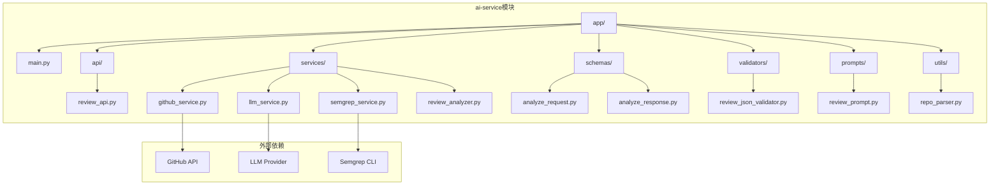
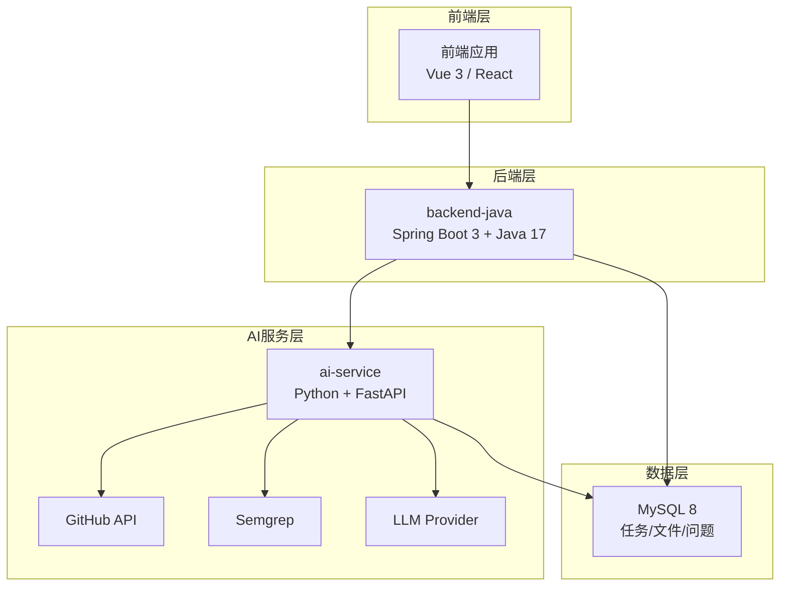
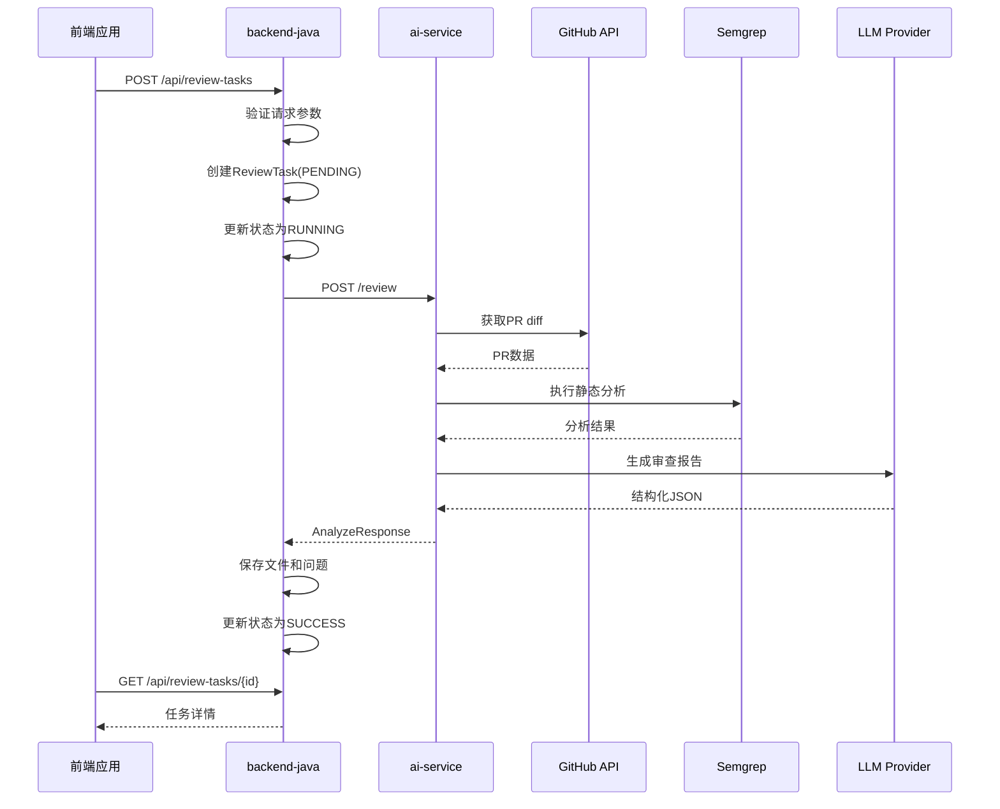
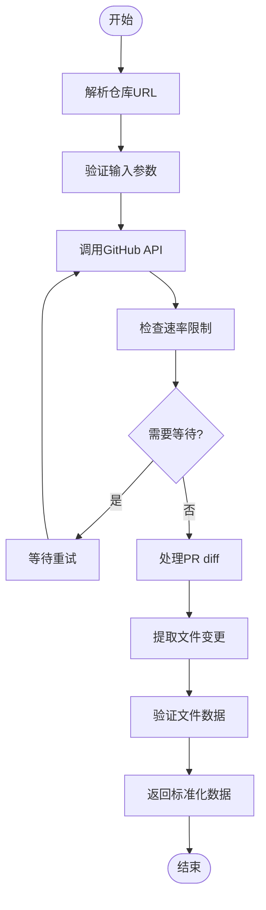
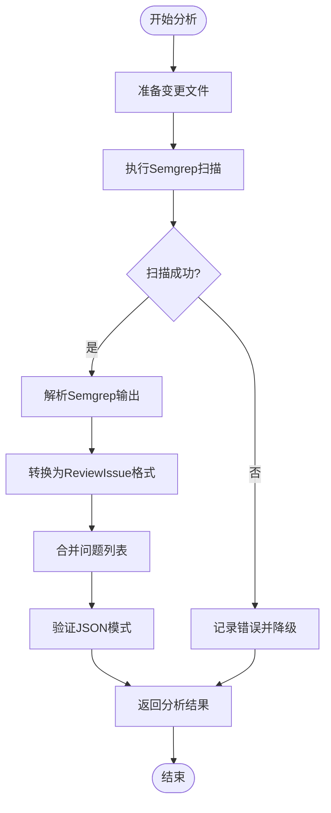
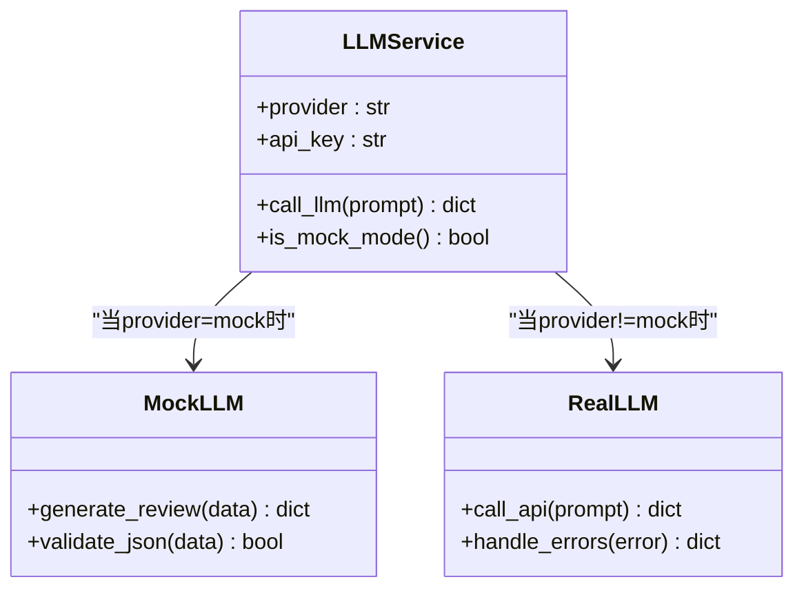
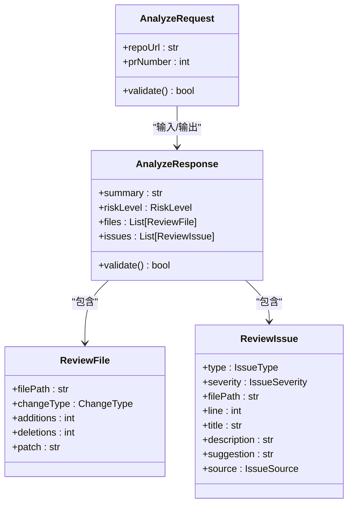
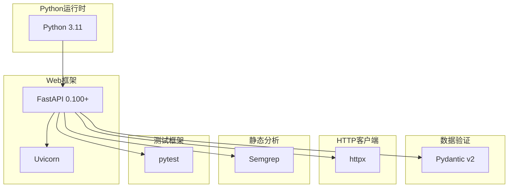

# AI分析服务模块

<cite>
**本文档引用的文件**
- [README.md](file://README.md)
- [ai-service/README.md](file://ai-service/README.md)
- [docs/ARCHITECTURE.md](file://docs/ARCHITECTURE.md)
- [docs/API.md](file://docs/API.md)
- [docs/PRD.md](file://docs/PRD.md)
- [.env.example](file://.env.example)
- [docker-compose.yml](file://docker-compose.yml)
</cite>

## 目录
1. [简介](#简介)
2. [项目结构](#项目结构)
3. [核心组件](#核心组件)
4. [架构概览](#架构概览)
5. [详细组件分析](#详细组件分析)
6. [依赖关系分析](#依赖关系分析)
7. [性能考虑](#性能考虑)
8. [故障排除指南](#故障排除指南)
9. [结论](#结论)
10. [附录](#附录)

## 简介

CodeReviewX是一个面向GitHub Pull Request的智能代码审查与修复建议Agent系统。ai-service模块是该系统的核心AI分析引擎，采用Python + FastAPI技术栈构建，专门负责GitHub PR diff获取、Semgrep静态分析、LLM审查生成等AI分析任务。

在Round 01阶段，该模块仍处于占位符状态，但已经明确了完整的架构设计和实现规划。该模块将作为独立的服务运行，通过HTTP API与其他组件进行交互，确保系统的模块化和可维护性。

## 项目结构

根据规划文档，ai-service模块将采用清晰的分层架构设计：



**图表来源**
- [ai-service/README.md:50-77](file://ai-service/README.md#L50-L77)
- [docs/ARCHITECTURE.md:206-229](file://docs/ARCHITECTURE.md#L206-L229)

**章节来源**
- [ai-service/README.md:50-77](file://ai-service/README.md#L50-L77)
- [docs/ARCHITECTURE.md:206-229](file://docs/ARCHITECTURE.md#L206-L229)

## 核心组件

### 1. API层 (API Layer)
负责定义HTTP端点和请求/响应处理：
- **review_api.py**: 主要的分析API端点
- **统一响应格式**: 标准化的JSON响应结构
- **错误处理**: 统一的错误响应格式

### 2. 服务层 (Services Layer)
实现核心业务逻辑：
- **github_service.py**: GitHub API集成和PR数据获取
- **semgrep_service.py**: Semgrep静态分析执行和结果转换
- **llm_service.py**: LLM调用和审查生成
- **review_analyzer.py**: 整体分析流程协调器

### 3. 模型层 (Schemas Layer)
数据验证和结构定义：
- **analyze_request.py**: 请求数据模型
- **analyze_response.py**: 响应数据模型
- **Pydantic v2**: 类型安全的数据验证

### 4. 工具层 (Utils Layer)
辅助功能：
- **repo_parser.py**: 仓库URL解析和验证
- **review_prompt.py**: LLM提示词模板管理

**章节来源**
- [ai-service/README.md:19-25](file://ai-service/README.md#L19-L25)
- [docs/ARCHITECTURE.md:231-238](file://docs/ARCHITECTURE.md#L231-L238)

## 架构概览

### 系统架构图



**图表来源**
- [docs/ARCHITECTURE.md:19-52](file://docs/ARCHITECTURE.md#L19-L52)
- [docs/ARCHITECTURE.md:73-107](file://docs/ARCHITECTURE.md#L73-L107)

### 核心调用链路



**图表来源**
- [docs/ARCHITECTURE.md:110-141](file://docs/ARCHITECTURE.md#L110-L141)
- [docs/API.md:243-332](file://docs/API.md#L243-L332)

**章节来源**
- [docs/ARCHITECTURE.md:110-153](file://docs/ARCHITECTURE.md#L110-L153)
- [docs/API.md:243-332](file://docs/API.md#L243-L332)

## 详细组件分析

### GitHub PR Diff获取服务

#### 组件职责
- 解析GitHub仓库URL和PR编号
- 调用GitHub API获取PR详细信息
- 提取和标准化diff数据
- 处理文件变更信息（新增、修改、删除）

#### 数据流程



**图表来源**
- [ai-service/README.md:21](file://ai-service/README.md#L21)

#### 错误处理策略
- GitHub API调用失败：返回GITHUB_FETCH_FAILED错误
- PR不存在：返回PR_NOT_FOUND错误
- 速率限制：自动重试机制
- 网络超时：指数退避重试

**章节来源**
- [ai-service/README.md:21](file://ai-service/README.md#L21)
- [docs/ARCHITECTURE.md:144-152](file://docs/ARCHITECTURE.md#L144-L152)

### Semgrep静态分析服务

#### 组件职责
- 在变更代码上执行Semgrep扫描
- 将Semgrep输出转换为统一的ReviewIssue格式
- 处理不同语言和规则集的差异
- 实现降级处理机制

#### 分析流程



**图表来源**
- [ai-service/README.md:23](file://ai-service/README.md#L23)

#### 性能优化
- 并行处理多个文件的扫描
- 缓存Semgrep规则配置
- 限制扫描文件大小和数量

**章节来源**
- [ai-service/README.md:23](file://ai-service/README.md#L23)
- [docs/ARCHITECTURE.md:148](file://docs/ARCHITECTURE.md#L148)

### LLM审查生成服务

#### 组件职责
- 组织和格式化分析数据
- 构建LLM提示词
- 调用LLM API生成结构化审查报告
- 实现mock模式支持

#### Mock模式实现



**图表来源**
- [ai-service/README.md:24](file://ai-service/README.md#L24)
- [ai-service/README.md:83-85](file://ai-service/README.md#L83-L85)

#### 集成策略
- 环境变量控制：LLM_PROVIDER=mock或真实提供商
- API密钥管理：LLM_API_KEY配置
- 渐进式迁移：从mock到真实LLM的平滑过渡

**章节来源**
- [ai-service/README.md:24](file://ai-service/README.md#L24)
- [ai-service/README.md:83-85](file://ai-service/README.md#L83-L85)
- [docs/ARCHITECTURE.md:15](file://docs/ARCHITECTURE.md#L15)

### 数据验证和序列化

#### Pydantic模型设计



**图表来源**
- [docs/ARCHITECTURE.md:253-281](file://docs/ARCHITECTURE.md#L253-L281)

#### JSON Schema验证
- 使用Pydantic v2进行类型安全验证
- 自定义验证器确保数据完整性
- 严格的字段约束和默认值处理

**章节来源**
- [docs/ARCHITECTURE.md:253-281](file://docs/ARCHITECTURE.md#L253-L281)

## 依赖关系分析

### 技术栈依赖



**图表来源**
- [ai-service/README.md:29-39](file://ai-service/README.md#L29-L39)

### 外部服务依赖

| 依赖项 | 用途 | 版本要求 | 配置方式 |
|--------|------|----------|----------|
| GitHub API | PR数据获取 | REST API v4 | GITHUB_TOKEN |
| LLM Provider | 审查生成 | OpenAI/Anthropic | LLM_API_KEY |
| Semgrep | 静态分析 | CLI 1.x | 本地安装 |
| MySQL | 数据持久化 | 8.0+ | 由backend-java管理 |

**章节来源**
- [ai-service/README.md:29-39](file://ai-service/README.md#L29-L39)
- [docs/ARCHITECTURE.md:329-336](file://docs/ARCHITECTURE.md#L329-L336)

## 性能考虑

### 并发处理
- 使用异步FastAPI处理I/O密集型任务
- GitHub API调用采用连接池复用
- Semgrep扫描支持多文件并行处理

### 缓存策略
- GitHub API响应缓存
- LLM调用结果缓存（针对相同输入）
- 规则配置缓存减少重复加载

### 超时和重试
- GitHub API超时设置：30秒
- Semgrep执行超时：60秒
- LLM API超时：120秒
- 指数退避重试机制

### 资源管理
- 进程池管理Semgrep执行
- 内存使用监控和限制
- 日志级别控制减少I/O开销

## 故障排除指南

### 常见错误及解决方案

| 错误类型 | 错误码 | 描述 | 解决方案 |
|----------|--------|------|----------|
| GitHub API失败 | GITHUB_FETCH_FAILED | 无法获取PR数据 | 检查GITHUB_TOKEN有效性，确认仓库权限 |
| PR不存在 | PR_NOT_FOUND | PR编号无效 | 验证PR编号，确认仓库存在 |
| Semgrep失败 | SEMGREP_FAILED | 扫描执行失败 | 检查Semgrep安装，验证规则配置 |
| LLM调用失败 | LLM_FAILED | LLM API调用失败 | 检查LLM_API_KEY，确认服务可用性 |
| JSON验证失败 | INVALID_REQUEST | 响应格式不符合规范 | 检查数据模型定义，验证字段完整性 |

### 调试技巧

#### 环境配置检查
```bash
# 验证环境变量
echo "GITHUB_TOKEN: ${GITHUB_TOKEN}"
echo "LLM_PROVIDER: ${LLM_PROVIDER}"
echo "SEMGREP_TIMEOUT_SECONDS: ${SEMGREP_TIMEOUT_SECONDS}"

# 测试GitHub API连通性
curl -H "Authorization: token ${GITHUB_TOKEN}" \
  -H "Accept: application/vnd.github.v4+json" \
  "https://api.github.com/repos/owner/repo/pulls/12"
```

#### 日志分析
- 启用DEBUG级别日志
- 监控关键指标：请求延迟、错误率、资源使用
- 分析慢查询和阻塞操作

#### 性能监控
- 使用uvicorn的性能统计
- 监控内存和CPU使用情况
- 分析API响应时间分布

**章节来源**
- [docs/ARCHITECTURE.md:285-314](file://docs/ARCHITECTURE.md#L285-L314)

## 结论

ai-service模块作为CodeReviewX系统的核心AI分析引擎，采用了清晰的分层架构设计和严格的技术规范。虽然在Round 01阶段仍处于规划阶段，但其架构设计充分考虑了可扩展性、可维护性和可靠性。

该模块的主要优势包括：
- **模块化设计**：清晰的职责分离和接口定义
- **渐进式集成**：mock模式支持平滑过渡到真实LLM
- **健壮的错误处理**：多层次的容错和降级机制
- **标准化的数据流**：统一的输入输出格式和验证机制

随着后续Round的推进，该模块将逐步实现完整的AI分析管道，为CodeReviewX系统提供强大的智能代码审查能力。

## 附录

### API接口规范

#### ai-service内部API
- **端点**: `/review`
- **方法**: `POST`
- **用途**: 执行完整的PR分析流程
- **请求参数**: `repoUrl` (字符串), `prNumber` (整数)
- **响应格式**: 标准化的AnalyzeResponse结构

#### 错误响应格式
```json
{
  "errorCode": "ERROR_CODE",
  "message": "Human readable error message",
  "recoverable": true/false
}
```

### 配置选项

| 环境变量 | 默认值 | 说明 |
|----------|--------|------|
| GITHUB_TOKEN | 空 | GitHub API认证令牌 |
| LLM_PROVIDER | mock | LLM提供商标识 |
| LLM_API_KEY | 空 | LLM API密钥 |
| SEMGREP_TIMEOUT_SECONDS | 30 | Semgrep执行超时时间 |

### Docker部署配置
- **端口**: 8000
- **镜像**: Python 3.11基础镜像
- **依赖**: requirements.txt管理
- **健康检查**: /health端点