# AI服务概览

<cite>
**本文档引用的文件**
- [README.md](file://README.md)
- [ai-service/README.md](file://ai-service/README.md)
- [docs/PRD.md](file://docs/PRD.md)
- [docs/ARCHITECTURE.md](file://docs/ARCHITECTURE.md)
- [docs/AGENT_RULES.md](file://docs/AGENT_RULES.md)
- [docker-compose.yml](file://docker-compose.yml)
- [handoff/round-01/01-cursor-handoff.md](file://handoff/round-01/01-cursor-handoff.md)
</cite>

## 目录
1. [简介](#简介)
2. [项目结构](#项目结构)
3. [核心组件](#核心组件)
4. [架构概览](#架构概览)
5. [详细组件分析](#详细组件分析)
6. [技术栈选择](#技术栈选择)
7. [服务边界与职责](#服务边界与职责)
8. [集成方式](#集成方式)
9. [依赖关系分析](#依赖关系分析)
10. [性能考虑](#性能考虑)
11. [故障排除指南](#故障排除指南)
12. [结论](#结论)

## 简介

AI服务是CodeReviewX项目中的核心分析引擎，作为独立的微服务模块，专门负责GitHub Pull Request的智能代码审查分析。该服务采用Python 3.11 + FastAPI技术栈构建，实现了从代码差异获取到结构化审查报告生成的完整分析流水线。

在CodeReviewX的整体架构中，AI服务扮演着"分析专家"的角色，专注于技术层面的代码质量分析，而不涉及业务逻辑编排和数据持久化。这种职责分离确保了系统的模块化和可维护性。

## 项目结构

CodeReviewX项目采用模块化架构设计，AI服务位于独立的服务目录中，体现了微服务的设计理念：

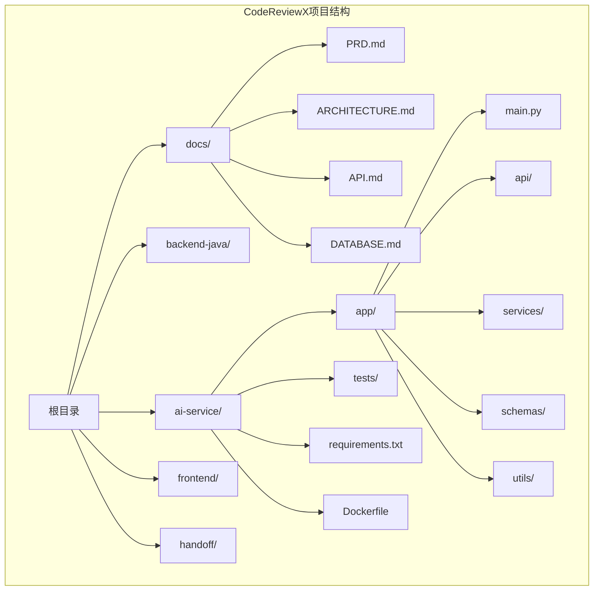

**图表来源**
- [README.md:58-82](file://README.md#L58-L82)
- [ai-service/README.md:50-77](file://ai-service/README.md#L50-L77)

**章节来源**
- [README.md:58-82](file://README.md#L58-L82)
- [ai-service/README.md:50-77](file://ai-service/README.md#L50-L77)

## 核心组件

AI服务作为独立微服务，具有以下核心职责：

### 主要职责矩阵

| 职责领域 | 具体功能 | 技术实现 |
|---------|---------|---------|
| **GitHub PR数据获取** | 解析仓库URL，调用GitHub API，获取PR diff和变更文件列表 | httpx客户端，GitHub API v4 |
| **代码变更解析** | 标准化文件变更信息（路径、变更类型、新增/删除行数、diff片段） | 正则表达式解析，文件路径标准化 |
| **静态分析执行** | 调用Semgrep进行静态代码分析，转换为标准ReviewIssue格式 | subprocess调用，JSON输出解析 |
| **LLM审查生成** | 组织prompt，调用mock或真实LLM，生成结构化审查报告 | Pydantic模型验证，JSON schema校验 |
| **结构化输出** | 生成统一的AnalyzeResponse格式，包含summary、riskLevel、files、issues | Pydantic模型序列化 |

### 服务架构层次

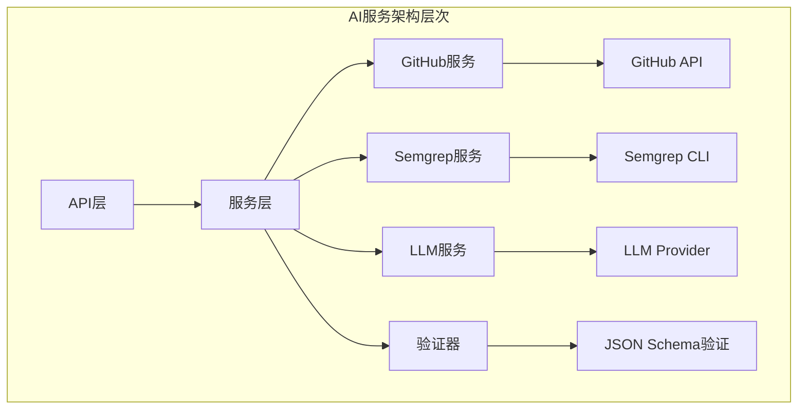

**图表来源**
- [docs/ARCHITECTURE.md:233-266](file://docs/ARCHITECTURE.md#L233-L266)

**章节来源**
- [ai-service/README.md:19-26](file://ai-service/README.md#L19-L26)
- [docs/ARCHITECTURE.md:90-107](file://docs/ARCHITECTURE.md#L90-L107)

## 架构概览

AI服务在整个CodeReviewX系统中处于核心分析位置，与前后端服务形成清晰的职责边界：

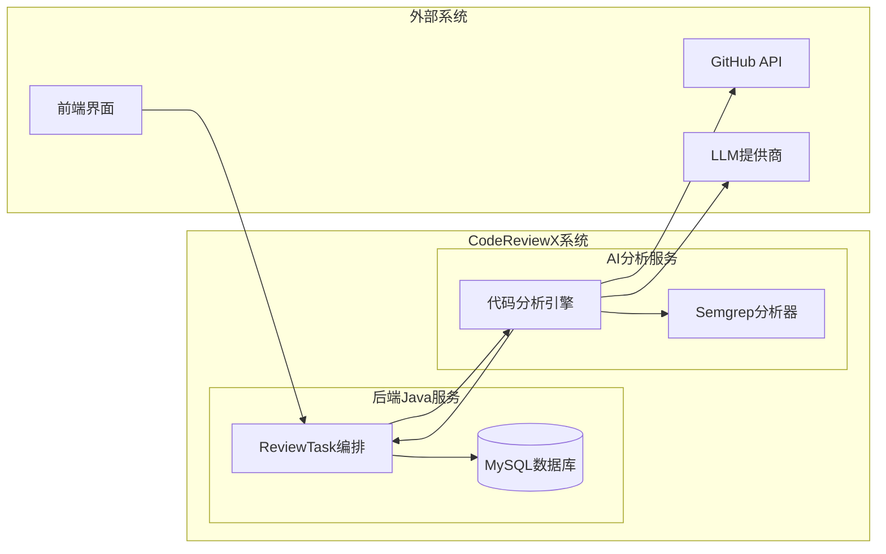

**图表来源**
- [docs/ARCHITECTURE.md:19-52](file://docs/ARCHITECTURE.md#L19-L52)
- [docs/PRD.md:32-52](file://docs/PRD.md#L32-L52)

### 核心调用链路

AI服务的典型工作流程如下：

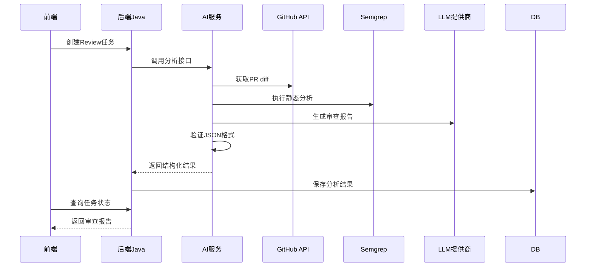

**图表来源**
- [docs/ARCHITECTURE.md:137-168](file://docs/ARCHITECTURE.md#L137-L168)

**章节来源**
- [docs/ARCHITECTURE.md:19-52](file://docs/ARCHITECTURE.md#L19-L52)
- [docs/PRD.md:32-52](file://docs/PRD.md#L32-L52)

## 详细组件分析

### GitHub服务组件

GitHub服务负责与GitHub API交互，获取PR相关的所有必要信息：

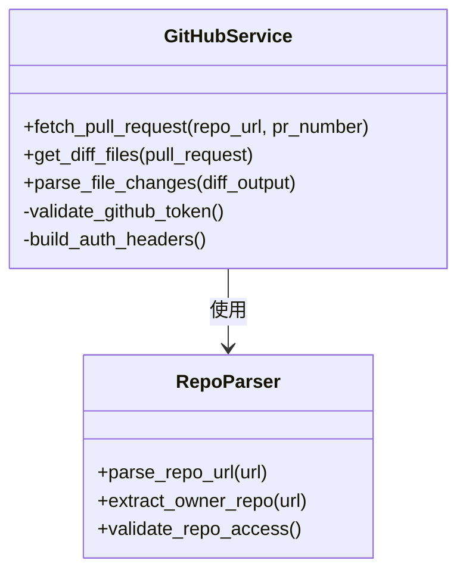

**图表来源**
- [ai-service/README.md:21](file://ai-service/README.md#L21)

### Semgrep服务组件

Semgrep服务封装了静态代码分析的所有逻辑：

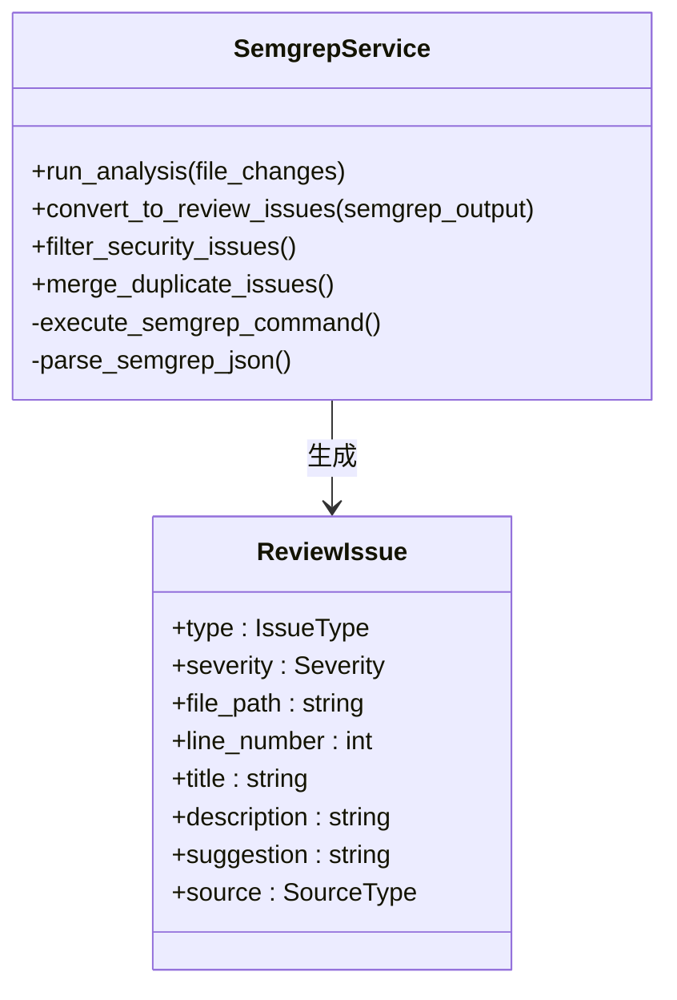

**图表来源**
- [docs/ARCHITECTURE.md:246-249](file://docs/ARCHITECTURE.md#L246-L249)

### LLM服务组件

LLM服务提供了灵活的审查生成能力，支持mock模式和真实LLM：

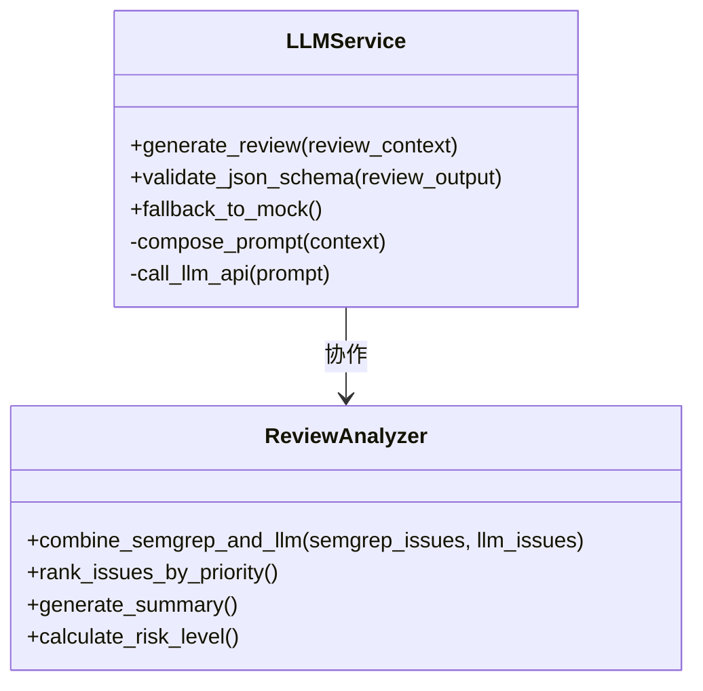

**图表来源**
- [ai-service/README.md:24](file://ai-service/README.md#L24)

**章节来源**
- [ai-service/README.md:19-26](file://ai-service/README.md#L19-L26)
- [docs/ARCHITECTURE.md:233-266](file://docs/ARCHITECTURE.md#L233-L266)

## 技术栈选择

AI服务选择了Python 3.11 + FastAPI作为技术栈，这一选择体现了现代微服务开发的最佳实践：

### 技术栈决策分析

| 技术组件 | 版本选择 | 选择理由 | 优势 |
|---------|---------|---------|------|
| **Python** | 3.11 | 最新稳定版本，性能优化，async支持 | 类型提示完善，异步I/O性能好 |
| **FastAPI** | 0.100+ | 现代异步框架，自动文档生成 | 自动OpenAPI文档，类型安全 |
| **Pydantic** | v2 | 数据验证和序列化 | 类型安全，自动数据转换 |
| **httpx** | — | 现代HTTP客户端 | 支持异步，替代requests |
| **Semgrep** | latest | 优秀的静态分析工具 | 多语言支持，规则丰富 |
| **pytest** | — | 测试框架 | 异步测试支持，插件生态 |
| **uvicorn** | — | ASGI服务器 | 生产就绪，性能优异 |

### 架构优势

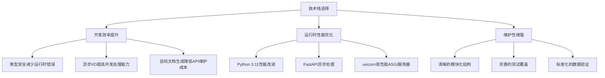

**图表来源**
- [ai-service/README.md:29-40](file://ai-service/README.md#L29-L40)

**章节来源**
- [ai-service/README.md:29-40](file://ai-service/README.md#L29-L40)

## 服务边界与职责

AI服务严格遵循微服务设计原则，明确了自身的职责边界和不负责的功能：

### 明确的职责范围

**AI服务负责：**
- GitHub PR diff获取和解析
- 变更文件的标准化处理
- Semgrep静态分析执行
- LLM审查报告生成
- 结构化JSON输出验证

**AI服务不负责：**
- 直接写入MySQL数据库
- 管理ReviewTask状态
- 对外暴露业务API
- 持有用户会话或认证状态

### 职责边界图

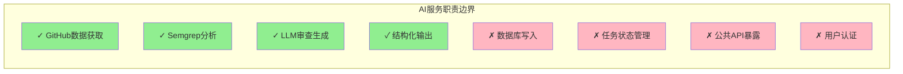

**图表来源**
- [ai-service/README.md:43-47](file://ai-service/README.md#L43-L47)
- [docs/ARCHITECTURE.md:90-107](file://docs/ARCHITECTURE.md#L90-L107)

### 失败处理策略

AI服务采用渐进式失败处理机制：

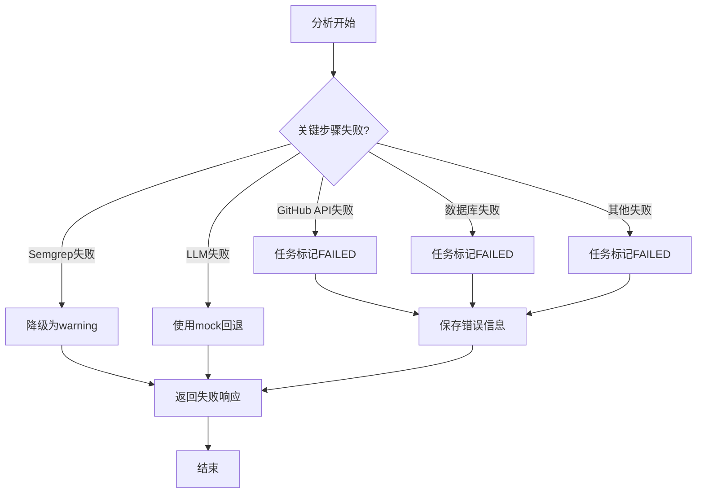

**图表来源**
- [docs/ARCHITECTURE.md:170-180](file://docs/ARCHITECTURE.md#L170-L180)

**章节来源**
- [ai-service/README.md:43-47](file://ai-service/README.md#L43-L47)
- [docs/ARCHITECTURE.md:90-107](file://docs/ARCHITECTURE.md#L90-L107)

## 集成方式

AI服务通过REST API与后端Java服务集成，采用内部服务调用的方式：

### API集成规范

| 接口 | 方法 | 路径 | 功能描述 |
|------|------|------|---------|
| 分析接口 | POST | `/review` | 接收repoUrl和prNumber，返回分析结果 |
| 健康检查 | GET | `/health` | 检查服务可用性 |
| 配置查询 | GET | `/config` | 获取服务配置信息 |

### 数据交换格式

**输入请求格式：**
```json
{
  "repoUrl": "https://github.com/owner/repo",
  "prNumber": 12
}
```

**输出响应格式：**
```json
{
  "summary": "代码审查总结",
  "riskLevel": "LOW|MEDIUM|HIGH",
  "files": [
    {
      "filePath": "src/main/java/example/UserService.java",
      "changeType": "added|modified|deleted",
      "additions": 20,
      "deletions": 5,
      "patch": "@@ -1,5 +1,10 @@ ..."
    }
  ],
  "issues": [
    {
      "type": "BUG|SECURITY|PERFORMANCE|TEST|STYLE",
      "severity": "LOW|MEDIUM|HIGH",
      "filePath": "src/main/java/example/UserService.java",
      "line": 42,
      "title": "问题标题",
      "description": "问题描述",
      "suggestion": "修复建议",
      "source": "LLM|SEMGREP"
    }
  ]
}
```

### 集成流程

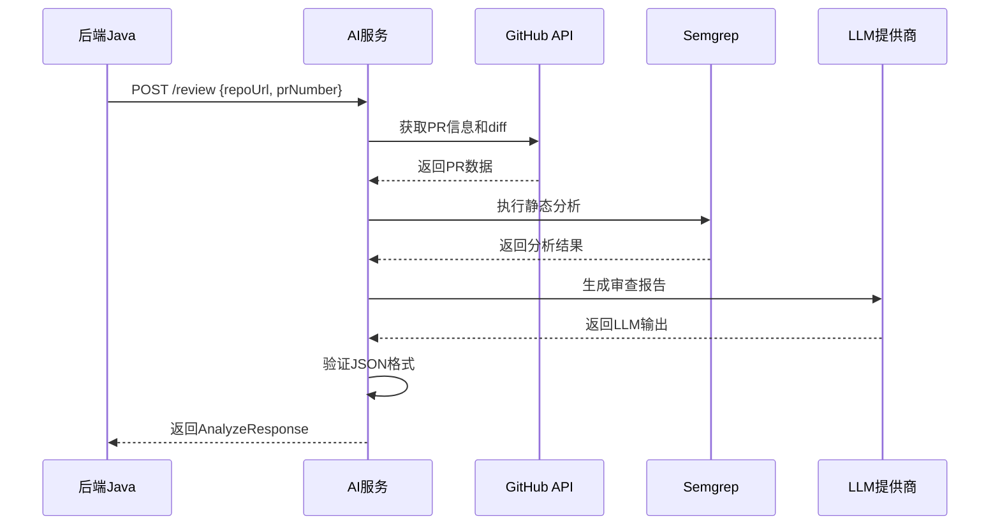

**图表来源**
- [docs/ARCHITECTURE.md:137-168](file://docs/ARCHITECTURE.md#L137-L168)
- [docs/ARCHITECTURE.md:270-308](file://docs/ARCHITECTURE.md#L270-L308)

**章节来源**
- [docs/ARCHITECTURE.md:137-168](file://docs/ARCHITECTURE.md#L137-L168)
- [docs/ARCHITECTURE.md:270-308](file://docs/ARCHITECTURE.md#L270-L308)

## 依赖关系分析

AI服务的依赖关系体现了清晰的分层架构和模块化设计：

### 依赖层次结构

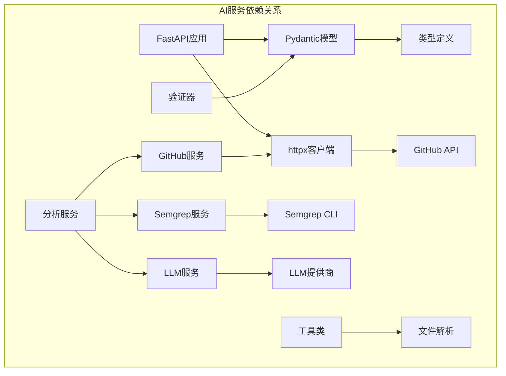

**图表来源**
- [ai-service/README.md:29-40](file://ai-service/README.md#L29-L40)
- [docs/ARCHITECTURE.md:233-266](file://docs/ARCHITECTURE.md#L233-L266)

### 外部依赖管理

AI服务对外部依赖的管理遵循最小化原则：

| 依赖类型 | 依赖组件 | 版本要求 | 用途 |
|---------|---------|---------|------|
| **必需依赖** | Python 3.11+ | 最新稳定版 | 运行时环境 |
| **Web框架** | FastAPI 0.100+ | 最新稳定版 | API服务 |
| **数据验证** | Pydantic v2 | 最新稳定版 | 请求/响应验证 |
| **HTTP客户端** | httpx | 最新稳定版 | GitHub API调用 |
| **静态分析** | Semgrep latest | 最新版本 | 代码质量分析 |
| **测试框架** | pytest | 最新稳定版 | 单元测试 |
| **ASGI服务器** | uvicorn | 最新稳定版 | 生产部署 |

**章节来源**
- [ai-service/README.md:29-40](file://ai-service/README.md#L29-L40)
- [docs/ARCHITECTURE.md:356-363](file://docs/ARCHITECTURE.md#L356-L363)

## 性能考虑

AI服务在设计时充分考虑了性能优化和可扩展性：

### 性能优化策略

1. **异步处理**：利用FastAPI的异步特性，提高并发处理能力
2. **缓存机制**：合理使用缓存减少重复的GitHub API调用
3. **资源池管理**：对LLM和Semgrep调用进行连接池管理
4. **超时控制**：为外部API调用设置合理的超时时间
5. **内存管理**：避免加载大型diff文件到内存中

### 可扩展性设计

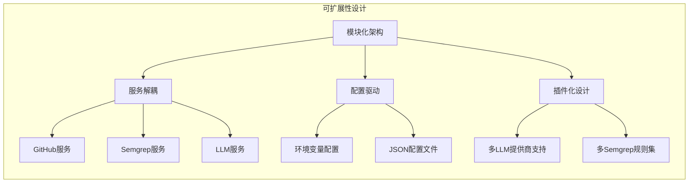

## 故障排除指南

### 常见问题及解决方案

| 问题类型 | 症状 | 可能原因 | 解决方案 |
|---------|------|---------|---------|
| **GitHub API错误** | 401/403认证失败 | Token无效或权限不足 | 检查GITHUB_TOKEN配置 |
| **Semgrep执行失败** | 分析超时或崩溃 | 代码量过大或规则冲突 | 优化规则配置，增加超时时间 |
| **LLM调用失败** | JSON格式错误 | LLM输出不符合预期 | 实现mock回退机制 |
| **网络连接超时** | API调用超时 | 网络不稳定或防火墙阻断 | 检查网络配置，增加重试机制 |
| **内存不足** | 服务崩溃 | 处理大型PR时内存溢出 | 优化内存使用，分批处理 |

### 监控指标

AI服务应该监控以下关键指标：
- **响应时间**：各API端点的平均响应时间
- **错误率**：各外部服务调用的失败率
- **资源使用**：CPU、内存、磁盘使用情况
- **吞吐量**：每分钟处理的任务数量

**章节来源**
- [docs/ARCHITECTURE.md:333-341](file://docs/ARCHITECTURE.md#L333-L341)

## 结论

AI服务作为CodeReviewX项目的核心分析引擎，通过精心设计的微服务架构和清晰的职责边界，为整个系统提供了强大的代码审查能力。其采用的Python 3.11 + FastAPI技术栈不仅保证了开发效率和运行性能，还为未来的功能扩展奠定了坚实基础。

通过严格的模块化设计和标准化的数据交换格式，AI服务能够与后端Java服务和前端界面无缝集成，形成了完整的代码审查生态系统。同时，其支持的mock模式和渐进式失败处理机制，确保了系统的稳定性和可靠性。

随着项目的推进，AI服务将继续演进，逐步实现更复杂的代码分析能力和更丰富的审查报告功能，为开发者提供更加智能化的代码审查体验。