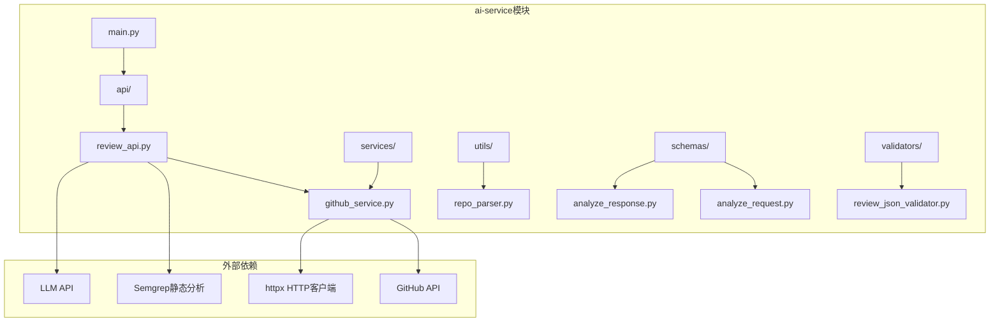
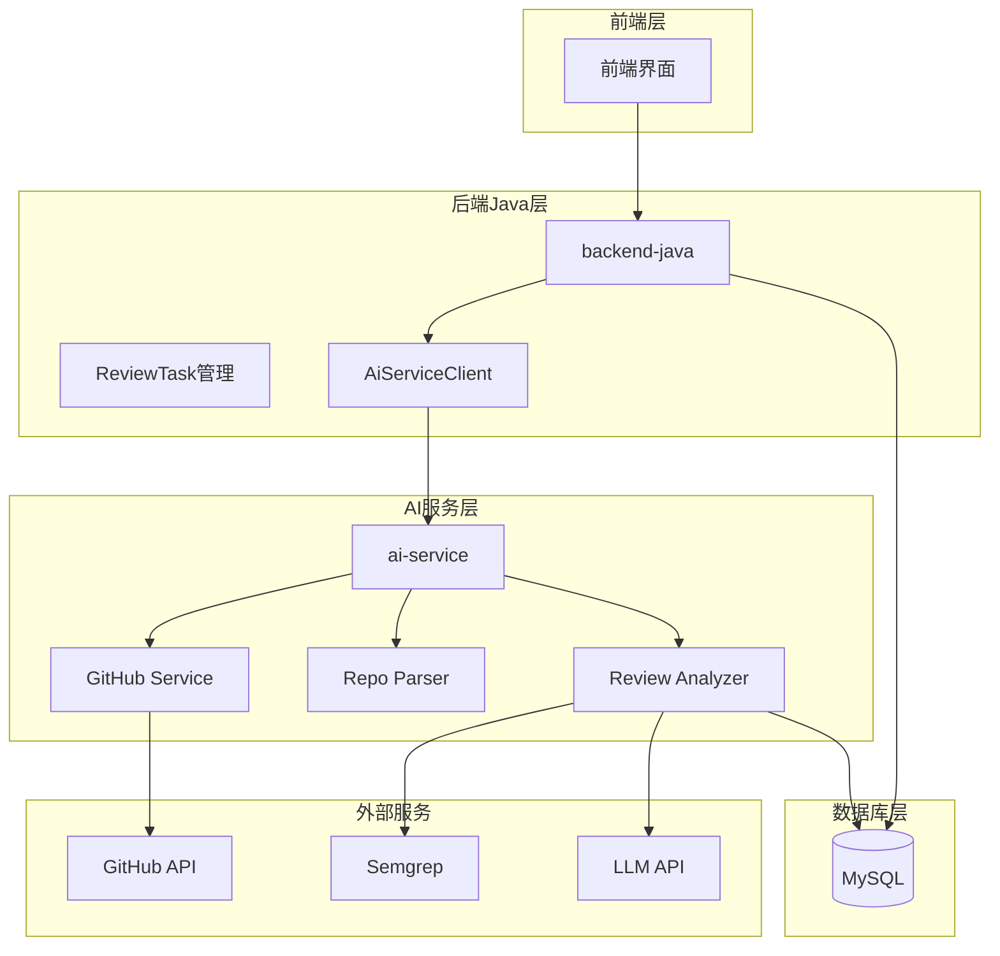
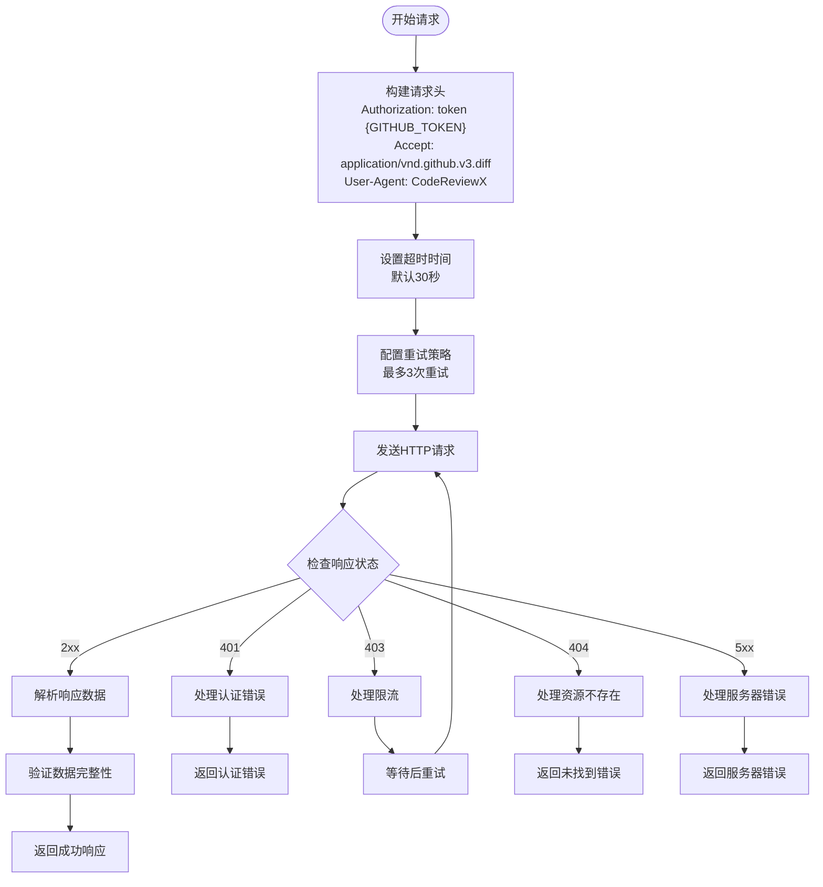
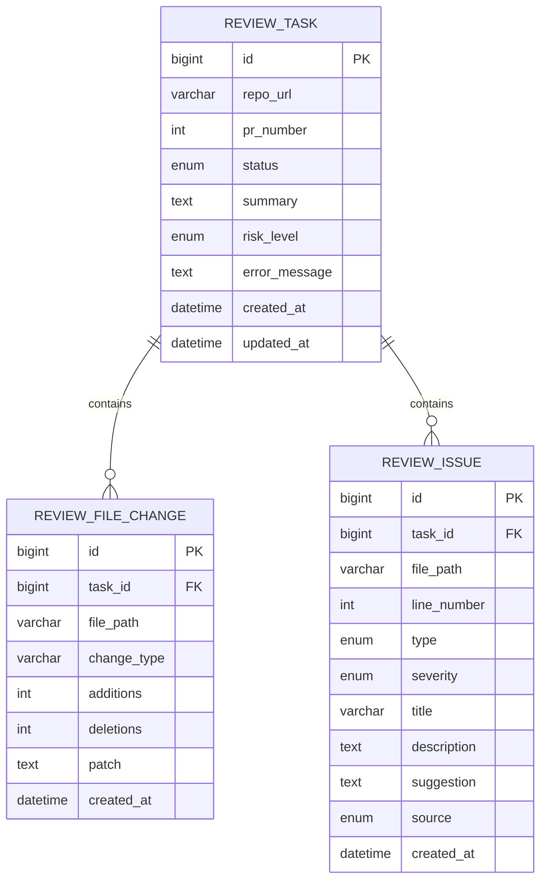
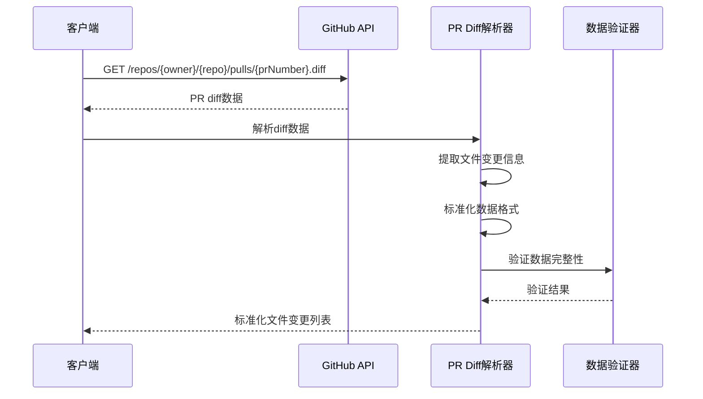
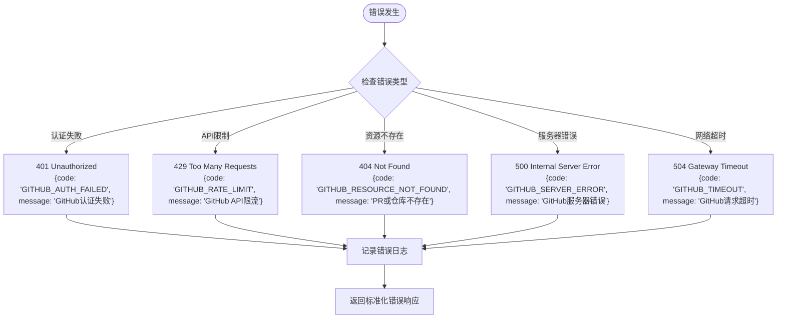
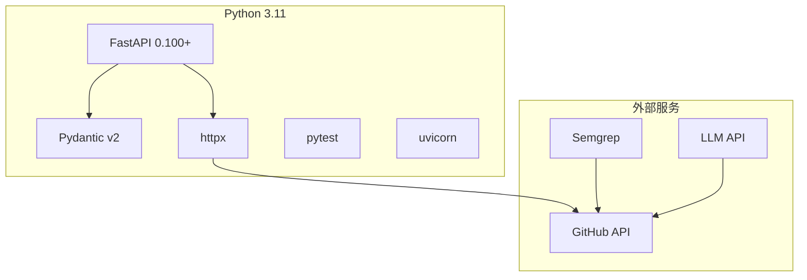
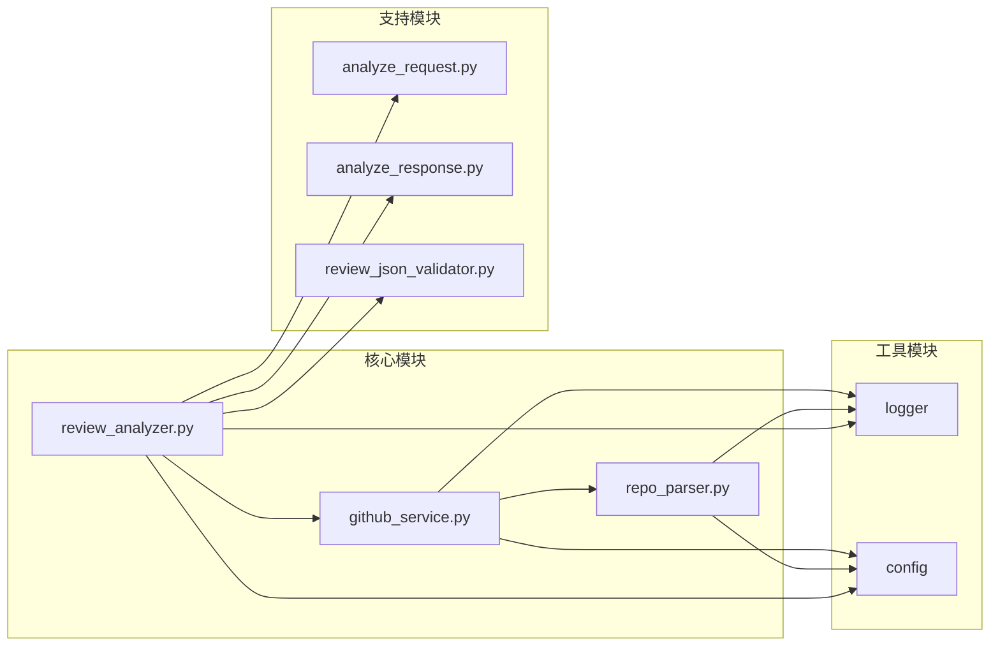

# GitHub API集成

<cite>
**本文档引用的文件**
- [README.md](file://README.md)
- [ai-service/README.md](file://ai-service/README.md)
- [docs/ARCHITECTURE.md](file://docs/ARCHITECTURE.md)
- [docs/API.md](file://docs/API.md)
- [docs/PRD.md](file://docs/PRD.md)
- [docs/AGENT_RULES.md](file://docs/AGENT_RULES.md)
- [docker-compose.yml](file://docker-compose.yml)
</cite>

## 目录
1. [简介](#简介)
2. [项目结构](#项目结构)
3. [核心组件](#核心组件)
4. [架构概览](#架构概览)
5. [详细组件分析](#详细组件分析)
6. [依赖关系分析](#依赖关系分析)
7. [性能考虑](#性能考虑)
8. [故障排除指南](#故障排除指南)
9. [结论](#结论)

## 简介

CodeReviewX是一个面向GitHub Pull Request的智能代码审查系统。该系统通过解析仓库URL并调用GitHub API获取PR diff和变更文件列表，结合静态分析工具和LLM生成结构化的代码审查报告。

根据项目规划，GitHub API集成将在Round 04中实现，主要职责包括：
- 解析GitHub仓库URL并提取owner和repo信息
- 调用GitHub API获取PR基本信息和diff数据
- 标准化文件变更信息，包括文件路径、变更类型、新增/删除行数、diff片段
- 实现HTTP客户端选择（httpx）和请求参数配置
- 处理错误响应和API限流策略
- 实现认证机制（GitHub Token）

## 项目结构

基于现有文档，GitHub API集成将位于ai-service模块中，采用分层架构设计：

**图表来源**
- [docs/ARCHITECTURE.md:233-266](file://docs/ARCHITECTURE.md#L233-L266)
- [ai-service/README.md:50-77](file://ai-service/README.md#L50-L77)

**章节来源**
- [README.md:58-82](file://README.md#L58-L82)
- [docs/ARCHITECTURE.md:233-266](file://docs/ARCHITECTURE.md#L233-L266)
- [ai-service/README.md:50-77](file://ai-service/README.md#L50-L77)

## 核心组件

### GitHub服务层 (github_service.py)

GitHub服务层负责与GitHub API的交互，包括：
- 仓库URL解析和验证
- GitHub API请求构建和发送
- 响应数据解析和标准化
- 错误处理和重试机制

### 仓库解析器 (repo_parser.py)

专门负责解析GitHub仓库URL，提取必要的元数据：
- owner（仓库所有者）
- repo（仓库名称）
- PR编号
- URL格式验证

### 分析响应模型 (analyze_response.py)

定义标准化的数据结构，确保不同来源的数据能够统一处理：
- summary（审查总结）
- riskLevel（风险等级）
- files（文件变更列表）
- issues（问题列表）

**章节来源**
- [docs/ARCHITECTURE.md:90-107](file://docs/ARCHITECTURE.md#L90-L107)
- [docs/ARCHITECTURE.md:280-308](file://docs/ARCHITECTURE.md#L280-L308)
- [ai-service/README.md:19-26](file://ai-service/README.md#L19-L26)

## 架构概览

GitHub API集成在整个系统中的位置如下：

**图表来源**
- [docs/ARCHITECTURE.md:19-52](file://docs/ARCHITECTURE.md#L19-L52)
- [docs/ARCHITECTURE.md:137-180](file://docs/ARCHITECTURE.md#L137-L180)

**章节来源**
- [docs/ARCHITECTURE.md:19-52](file://docs/ARCHITECTURE.md#L19-L52)
- [docs/ARCHITECTURE.md:137-180](file://docs/ARCHITECTURE.md#L137-L180)

## 详细组件分析

### GitHub API客户端配置

#### HTTP客户端选择：httpx

httpx是推荐的HTTP客户端，具有以下优势：
- 支持异步请求，提高并发性能
- 内置JSON序列化和反序列化
- 自动处理重定向和连接池
- 丰富的错误处理机制

#### 请求参数配置

**图表来源**
- [docs/ARCHITECTURE.md:356-363](file://docs/ARCHITECTURE.md#L356-L363)
- [docs/API.md:41-51](file://docs/API.md#L41-L51)

#### 认证机制

GitHub API认证采用个人访问令牌（PAT）方式：
- 令牌存储在环境变量中：`GITHUB_TOKEN`
- 令牌永不硬编码在源代码中
- 支持令牌轮换和更新
- 日志中避免输出完整令牌

**章节来源**
- [docs/ARCHITECTURE.md:356-363](file://docs/ARCHITECTURE.md#L356-L363)
- [docs/AGENT_RULES.md:152-160](file://docs/AGENT_RULES.md#L152-L160)

### PR diff数据结构解析

#### 标准化文件变更数据结构

**图表来源**
- [docs/PRD.md:125-169](file://docs/PRD.md#L125-L169)

#### PR diff解析流程

**图表来源**
- [docs/ARCHITECTURE.md:92-100](file://docs/ARCHITECTURE.md#L92-L100)
- [docs/ARCHITECTURE.md:280-308](file://docs/ARCHITECTURE.md#L280-L308)

**章节来源**
- [docs/ARCHITECTURE.md:92-100](file://docs/ARCHITECTURE.md#L92-L100)
- [docs/ARCHITECTURE.md:280-308](file://docs/ARCHITECTURE.md#L280-L308)

### 错误处理机制

#### 错误响应格式

系统定义了统一的错误响应格式：

**图表来源**
- [docs/API.md:312-341](file://docs/API.md#L312-L341)
- [docs/ARCHITECTURE.md:170-180](file://docs/ARCHITECTURE.md#L170-L180)

#### API限流应对策略

针对GitHub API的限流机制，系统采用以下策略：

1. **指数退避重试**：当遇到429状态码时，按指数增长等待时间重试
2. **缓存机制**：对频繁访问的PR数据进行缓存，减少API调用次数
3. **批量请求优化**：合理安排请求顺序，避免在同一时间段内大量并发请求
4. **监控告警**：实时监控API使用情况，及时发现异常流量

**章节来源**
- [docs/API.md:312-341](file://docs/API.md#L312-L341)
- [docs/ARCHITECTURE.md:170-180](file://docs/ARCHITECTURE.md#L170-L180)

## 依赖关系分析

### 技术栈依赖

**图表来源**
- [ai-service/README.md:29-40](file://ai-service/README.md#L29-L40)

### 模块间依赖关系

**图表来源**
- [docs/ARCHITECTURE.md:233-266](file://docs/ARCHITECTURE.md#L233-L266)

**章节来源**
- [ai-service/README.md:29-40](file://ai-service/README.md#L29-L40)
- [docs/ARCHITECTURE.md:233-266](file://docs/ARCHITECTURE.md#L233-L266)

## 性能考虑

### 并发处理策略

1. **异步请求**：使用httpx的异步特性，支持并发请求多个PR
2. **连接池管理**：合理配置连接池大小，避免过多并发导致资源耗尽
3. **请求批量化**：对于多个相关PR，考虑批量化处理以减少API调用次数

### 缓存策略

1. **短期缓存**：对最近访问的PR数据进行缓存，缓存时间为5-10分钟
2. **增量更新**：检查PR的最后更新时间，仅在发生变化时重新获取数据
3. **内存管理**：设置缓存大小上限，避免内存占用过大

### 资源优化

1. **数据压缩**：对大型diff数据进行压缩传输
2. **分页处理**：对于大文件变更，采用分页方式处理
3. **内存优化**：使用生成器模式处理大型数据流

## 故障排除指南

### 常见问题诊断

#### 认证问题
- **症状**：401错误，提示认证失败
- **排查**：检查GITHUB_TOKEN环境变量是否正确设置
- **解决**：重新生成GitHub Personal Access Token并更新环境变量

#### API限流问题
- **症状**：429错误，提示API使用超限
- **排查**：检查请求频率和并发数量
- **解决**：实现指数退避重试机制，降低请求频率

#### 网络连接问题
- **症状**：连接超时或网络错误
- **排查**：检查网络连接和防火墙设置
- **解决**：增加超时时间，实现重连机制

#### 数据解析问题
- **症状**：diff数据解析失败
- **排查**：检查GitHub API版本兼容性和数据格式
- **解决**：更新API版本，完善数据解析逻辑

### 调试技巧

1. **启用详细日志**：在开发环境中启用DEBUG级别日志
2. **使用测试数据**：准备公开仓库的PR作为测试用例
3. **监控API使用**：跟踪API调用次数和响应时间
4. **单元测试**：为关键函数编写单元测试，确保功能正确性

**章节来源**
- [docs/AGENT_RULES.md:152-160](file://docs/AGENT_RULES.md#L152-L160)

## 结论

GitHub API集成为CodeReviewX系统提供了核心的数据获取能力。通过合理的架构设计、严格的错误处理机制和完善的性能优化策略，系统能够稳定可靠地获取PR diff数据并进行后续的分析处理。

在实现过程中，需要重点关注：
- 认证安全性和令牌管理
- API限流和错误恢复策略
- 数据解析的准确性和完整性
- 性能优化和资源管理
- 日志记录和监控告警

随着Round 04的推进，这些功能将逐步实现并集成到整个系统中，为用户提供完整的代码审查解决方案。