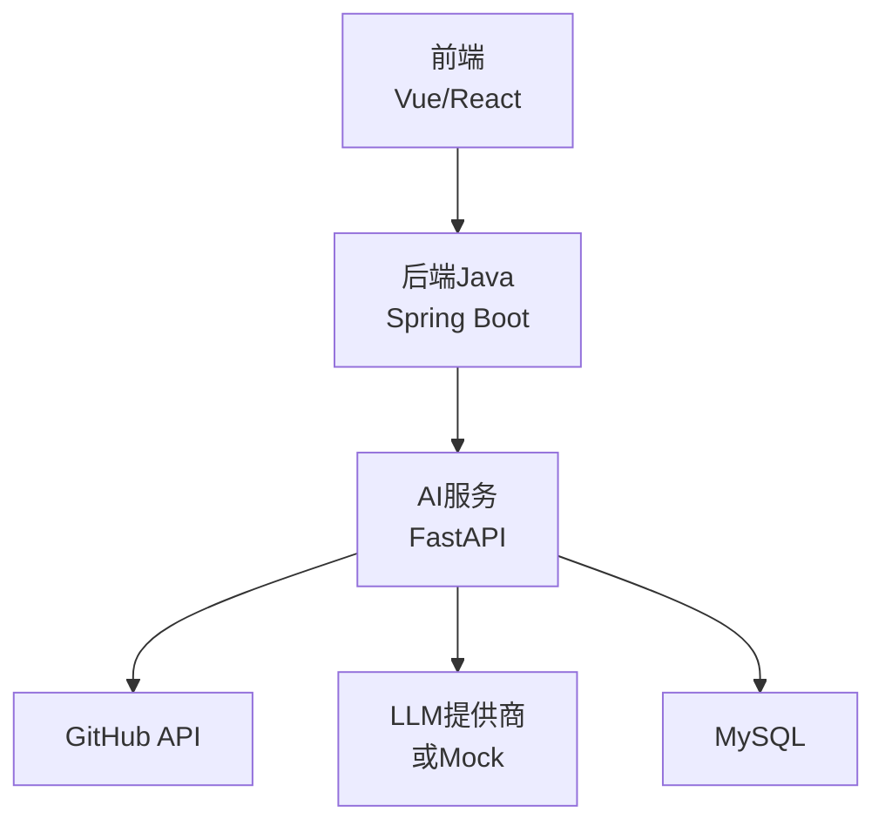
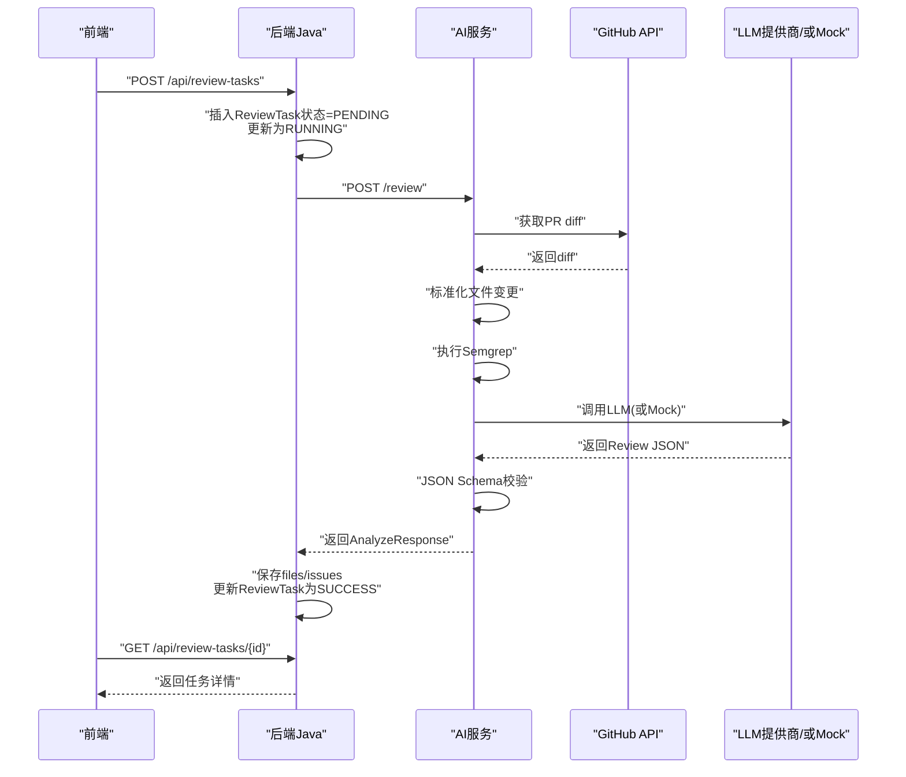
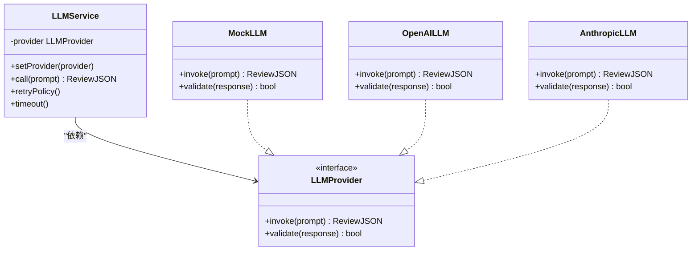
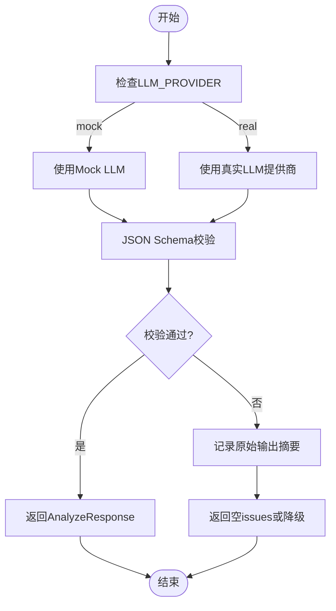
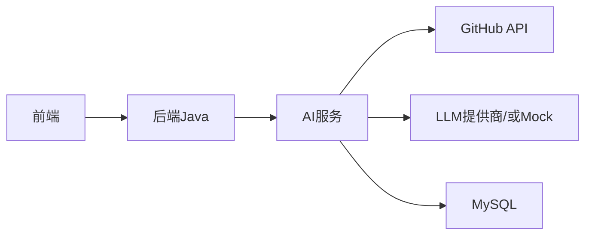

# LLM集成策略

<cite>
**本文引用的文件**
- [README.md](file://README.md)
- [docs/PRD.md](file://docs/PRD.md)
- [docs/ARCHITECTURE.md](file://docs/ARCHITECTURE.md)
- [docs/API.md](file://docs/API.md)
- [docs/DATABASE.md](file://docs/DATABASE.md)
- [docs/AGENT_RULES.md](file://docs/AGENT_RULES.md)
- [docker-compose.yml](file://docker-compose.yml)
- [ai-service/README.md](file://ai-service/README.md)
</cite>

## 目录
1. [简介](#简介)
2. [项目结构](#项目结构)
3. [核心组件](#核心组件)
4. [架构总览](#架构总览)
5. [详细组件分析](#详细组件分析)
6. [依赖关系分析](#依赖关系分析)
7. [性能考量](#性能考量)
8. [故障排查指南](#故障排查指南)
9. [结论](#结论)
10. [附录](#附录)

## 简介
本文件面向 CodeReviewX 项目，系统化阐述从 mock LLM 到真实 LLM 提供商的渐进式集成策略。基于仓库现有文档，我们明确了模块边界、调用链路、失败降级与 mock 回退机制，并给出 API 适配器设计、提示词工程最佳实践、成本控制与调用优化、错误重试机制，以及 mock 与真实模式的切换配置与集成示例路径。

## 项目结构
- 采用“文档驱动”的工程方法：PRD、架构、API、数据库等文档先行，随后按轮次逐步实现。
- 模块划分清晰：前端仅调用后端；后端负责编排与持久化；ai-service 负责 GitHub 数据获取、Semgrep 与 LLM 分析；MySQL 仅承载业务数据。
- Round 01 为“工程骨架”阶段，LLM 集成尚未实现，但已规划 mock 回退与真实提供商的渐进过渡。

图表来源
- [docs/ARCHITECTURE.md:19-52](file://docs/ARCHITECTURE.md#L19-L52)
- [docs/ARCHITECTURE.md:73-107](file://docs/ARCHITECTURE.md#L73-L107)
- [docs/ARCHITECTURE.md:233-266](file://docs/ARCHITECTURE.md#L233-L266)

章节来源
- [README.md:58-82](file://README.md#L58-L82)
- [docs/ARCHITECTURE.md:19-52](file://docs/ARCHITECTURE.md#L19-L52)

## 核心组件
- 后端Java（backend-java）
  - 职责：REST API、任务编排、状态流转、调用 ai-service、持久化。
  - 禁止：不得直接执行 Semgrep、编写 LLM prompt、解析复杂 diff、绕过 ai-service 调用 LLM。
- AI服务（ai-service）
  - 职责：拉取 PR diff、标准化文件变更、执行 Semgrep、组织 LLM prompt、校验 JSON、合并 LLM 与 Semgrep 结果。
  - 禁止：不得直接写 MySQL、管理 ReviewTask 状态、对前端暴露业务 API。
- 前端（frontend）
  - 职责：任务创建、列表、详情展示；仅调用后端。
- 数据库（MySQL）
  - 职责：存储任务、文件变更、问题记录。

章节来源
- [docs/ARCHITECTURE.md:56-107](file://docs/ARCHITECTURE.md#L56-L107)
- [docs/DATABASE.md:20-134](file://docs/DATABASE.md#L20-L134)

## 架构总览
- 端到端调用链路：前端 -> 后端 -> ai-service -> GitHub API/LLM -> ai-service -> 后端 -> 前端。
- 失败降级策略：GitHub 失败 -> 任务 FAILED；Semgrep 失败 -> 降级 warning；LLM 失败 -> mock 回退；JSON 校验失败 -> 记录摘要，不返回未校验结构；ai-service 超时 -> 任务 FAILED。
- 状态机：PENDING -> RUNNING -> SUCCESS 或 FAILED；FAILED 必须记录可读错误原因。

图表来源
- [docs/ARCHITECTURE.md:137-181](file://docs/ARCHITECTURE.md#L137-L181)
- [docs/API.md:54-241](file://docs/API.md#L54-L241)

章节来源
- [docs/ARCHITECTURE.md:110-181](file://docs/ARCHITECTURE.md#L110-L181)
- [docs/API.md:54-333](file://docs/API.md#L54-L333)

## 详细组件分析

### LLM提供商选择标准与API适配器设计
- 选择标准
  - 一致性与稳定性：输出结构稳定，便于统一校验与落库。
  - 成本与配额：支持按 token/调用计费，具备速率限制与配额管理。
  - 响应延迟与吞吐：适合批量 PR 分析场景，具备合理的并发能力。
  - 安全与合规：支持敏感信息过滤、内容安全策略。
  - 生态与文档：完善的 SDK/HTTP API、示例与错误码规范。
- API适配器设计
  - 统一抽象：定义 llm_service 接口，封装不同提供商的差异（认证、URL、参数、错误码）。
  - 配置驱动：通过环境变量切换提供商（如 LLM_PROVIDER=mock/openai/anthropic 等）。
  - 超时与重试：统一超时、指数退避重试、熔断与隔离。
  - 结果校验：严格 JSON Schema 校验，失败时记录原始输出摘要。
  - 日志与追踪：埋点请求耗时、错误码、重试次数，便于成本与性能分析。

图表来源
- [docs/ARCHITECTURE.md:233-266](file://docs/ARCHITECTURE.md#L233-L266)
- [ai-service/README.md:83-86](file://ai-service/README.md#L83-L86)

章节来源
- [ai-service/README.md:19-47](file://ai-service/README.md#L19-L47)
- [docs/ARCHITECTURE.md:233-266](file://docs/ARCHITECTURE.md#L233-L266)

### 渐进式集成方案：从mock到真实提供商
- Round 03：实现 mock LLM
  - 目标：LLM_PROVIDER=mock 时返回固定 Review JSON，确保端到端流程可用，无外部依赖。
  - 配置：通过环境变量控制；无需 API Key。
- Round 05：接入真实提供商
  - 目标：替换 mock 为真实 LLM，保持接口一致与 JSON Schema 校验不变。
  - 配置：新增提供商密钥与端点；保留统一错误码与重试策略。
- 运维保障：灰度发布、A/B 测试、回滚预案与监控告警。

图表来源
- [docs/ARCHITECTURE.md:170-179](file://docs/ARCHITECTURE.md#L170-L179)
- [docs/ARCHITECTURE.md:345-363](file://docs/ARCHITECTURE.md#L345-L363)
- [ai-service/README.md:83-86](file://ai-service/README.md#L83-L86)

章节来源
- [README.md:103](file://README.md#L103)
- [docs/ARCHITECTURE.md:170-179](file://docs/ARCHITECTURE.md#L170-L179)
- [docs/ARCHITECTURE.md:345-363](file://docs/ARCHITECTURE.md#L345-L363)
- [ai-service/README.md:83-86](file://ai-service/README.md#L83-L86)

### 提示词工程最佳实践与模板设计
- 目标对齐：明确要求输出结构（summary、riskLevel、files、issues），并限定问题类别与来源。
- 模板化：将 PR diff、变更文件、Semgrep 结果与领域知识组合为可复用提示词模板。
- 一致性：固定输出格式与字段，便于 JSON Schema 校验与前端渲染。
- 可观测性：在提示词中加入“仅输出JSON，不要额外解释”，减少模型幻觉与多余文本。
- 迭代优化：基于真实输出与人工校验持续调整提示词，建立 A/B 实验与效果指标。

章节来源
- [docs/PRD.md:104-122](file://docs/PRD.md#L104-L122)
- [docs/ARCHITECTURE.md:245-255](file://docs/ARCHITECTURE.md#L245-L255)

### 成本控制策略
- 模型选择：优先选择性价比高的模型族，针对不同风险级别设定阈值与调用策略。
- Prompt优化：减少 token 使用，合并多轮对话为单次调用，避免冗余上下文。
- 批量化：对多个文件或相似变更进行批处理，降低调用次数。
- 限流与配额：设置每分钟/每小时调用上限，预留突发额度。
- 监控与告警：跟踪成本、错误率、延迟与 token 使用，及时预警。

章节来源
- [docs/ARCHITECTURE.md:345-363](file://docs/ARCHITECTURE.md#L345-L363)

### API调用优化与错误重试机制
- 超时与重试
  - 统一超时：为 GitHub API 与 LLM API 设置合理超时。
  - 指数退避：失败时按 1s、2s、4s…上限重试，避免雪崩。
  - 幂等性：确保重试不会重复产生副作用（如多次保存相同结果）。
- 熔断与隔离
  - 熔断：连续失败超过阈值时短时拒绝请求，快速失败。
  - 隔离：不同提供商/模型实例隔离，避免互相影响。
- 错误分类
  - 可恢复：网络抖动、临时限流。
  - 不可恢复：参数错误、鉴权失败、模型输出无法校验。
- 记录与追踪
  - 记录原始输出摘要与重试次数，便于审计与优化。

章节来源
- [docs/ARCHITECTURE.md:170-179](file://docs/ARCHITECTURE.md#L170-L179)
- [docs/ARCHITECTURE.md:345-363](file://docs/ARCHITECTURE.md#L345-L363)

### mock模式与真实模式切换配置
- 环境变量
  - LLM_PROVIDER：mock 或真实提供商标识。
  - LLM_API_KEY：真实提供商密钥（mock 模式无需）。
  - SEMGREP_TIMEOUT_SECONDS：Semgrep 超时秒数。
- 切换流程
  - Round 03：LLM_PROVIDER=mock，返回固定 Review JSON。
  - Round 05：LLM_PROVIDER=real，配置真实提供商密钥与端点，保持接口一致。
- 配置示例路径
  - 后端Java：AI_SERVICE_BASE_URL 等。
  - AI服务：LLM_PROVIDER、LLM_API_KEY、SEMGREP_TIMEOUT_SECONDS。

章节来源
- [docs/ARCHITECTURE.md:345-363](file://docs/ARCHITECTURE.md#L345-L363)
- [docker-compose.yml:1-14](file://docker-compose.yml#L1-L14)

### 完整集成示例（路径指引）
- 后端Java调用AI服务
  - 端点：POST /review（内部调用，非前端直连）
  - 请求体：repoUrl、prNumber
  - 响应：AnalyzeResponse（summary、riskLevel、files、issues）
- AI服务内部流程
  - 拉取 PR diff -> 标准化文件变更 -> 执行 Semgrep -> 调用 LLM（或 Mock）-> JSON Schema 校验 -> 返回 AnalyzeResponse
- 前端展示
  - 任务详情：summary、riskLevel、files、issues

章节来源
- [docs/API.md:243-333](file://docs/API.md#L243-L333)
- [docs/ARCHITECTURE.md:137-181](file://docs/ARCHITECTURE.md#L137-L181)
- [docs/DATABASE.md:94-134](file://docs/DATABASE.md#L94-L134)

## 依赖关系分析
- 模块耦合
  - 前端仅依赖后端；后端仅依赖 ai-service；ai-service 依赖 GitHub API 与 LLM 提供商。
- 外部依赖
  - GitHub API：用于获取 PR diff 与变更文件。
  - LLM 提供商：统一接口与 JSON Schema 校验，mock 作为回退。
- 循环依赖
  - 无直接循环依赖；通过统一的 AnalyzeResponse 与错误码规范避免循环耦合。

图表来源
- [docs/ARCHITECTURE.md:19-52](file://docs/ARCHITECTURE.md#L19-L52)

章节来源
- [docs/ARCHITECTURE.md:19-52](file://docs/ARCHITECTURE.md#L19-L52)

## 性能考量
- 并发与限流：根据提供商配额与自身吞吐，设置并发上限与队列长度。
- 缓存策略：对静态文件与 Semgrep 结果进行缓存，减少重复计算。
- 超时与重试：统一超时与指数退避，避免级联故障。
- 监控指标：请求延迟、错误率、token 使用、成本占比、重试次数。

## 故障排查指南
- 常见失败场景与处理
  - GitHub API 失败：任务置 FAILED，记录 error_message。
  - Semgrep 失败：降级为 warning，不导致任务失败。
  - LLM 失败：使用 mock 回退；若回退也失败，则任务 FAILED。
  - JSON 校验失败：记录原始输出摘要，不返回未校验结构。
  - ai-service 超时：任务 FAILED，记录超时原因。
- 排查步骤
  - 检查环境变量与密钥配置。
  - 查看日志与追踪 ID，定位失败环节。
  - 验证 JSON Schema 校验规则与提示词模板。
  - 评估提供商配额与限流策略。

章节来源
- [docs/ARCHITECTURE.md:170-179](file://docs/ARCHITECTURE.md#L170-L179)

## 结论
通过“mock 先行、真实提供商渐进接入”的策略，结合统一的 API 适配器、严格的 JSON 校验与降级回退机制，CodeReviewX 能够在保障稳定性的同时，逐步引入真实 LLM 提供商。配合成本控制、调用优化与错误重试策略，可在 MVP 阶段构建可演示、可运维的代码审查流水线。

## 附录
- Round 进度与职责
  - Round 01：工程骨架（已完成）
  - Round 02：后端骨架
  - Round 03：AI服务 mock 管道
  - Round 04：GitHub PR diff 集成
  - Round 05：Semgrep + LLM 集成
  - Round 06：前端 + Docker + CI + 文档

章节来源
- [README.md:110-120](file://README.md#L110-L120)