# Semgrep静态分析

<cite>
**本文档引用的文件**
- [README.md](file://README.md)
- [docs/PRD.md](file://docs/PRD.md)
- [docs/ARCHITECTURE.md](file://docs/ARCHITECTURE.md)
- [docs/API.md](file://docs/API.md)
- [docs/AGENT_RULES.md](file://docs/AGENT_RULES.md)
- [docker-compose.yml](file://docker-compose.yml)
- [ai-service/README.md](file://ai-service/README.md)
</cite>

## 目录
1. [简介](#简介)
2. [项目结构](#项目结构)
3. [核心组件](#核心组件)
4. [架构概览](#架构概览)
5. [Semgrep集成详解](#semgrep集成详解)
6. [配置选项与环境变量](#配置选项与环境变量)
7. [结果转换与标准化](#结果转换与标准化)
8. [问题类型识别与分类](#问题类型识别与分类)
9. [性能优化策略](#性能优化策略)
10. [规则自定义与扩展](#规则自定义与扩展)
11. [扫描配置示例](#扫描配置示例)
12. [依赖关系分析](#依赖关系分析)
13. [故障排除指南](#故障排除指南)
14. [结论](#结论)

## 简介

CodeReviewX是一个面向GitHub Pull Request的智能代码审查系统。该系统通过集成Semgrep静态分析工具，能够自动检测代码中的潜在Bug、安全风险、性能问题和测试缺失等问题，并结合LLM生成结构化的审查报告。

在当前的Round 01阶段，系统已经完成了工程骨架的搭建，包括完整的文档体系、模块边界定义和API设计规范。Semgrep集成作为MVP功能的重要组成部分，将在后续Round中逐步实现。

## 项目结构

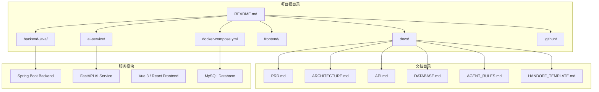

**图表来源**
- [README.md:58-82](file://README.md#L58-L82)
- [docs/ARCHITECTURE.md:19-52](file://docs/ARCHITECTURE.md#L19-L52)

**章节来源**
- [README.md:58-82](file://README.md#L58-L82)
- [docs/ARCHITECTURE.md:19-52](file://docs/ARCHITECTURE.md#L19-L52)

## 核心组件

### 模块职责边界

根据架构设计，各模块的职责边界清晰明确：

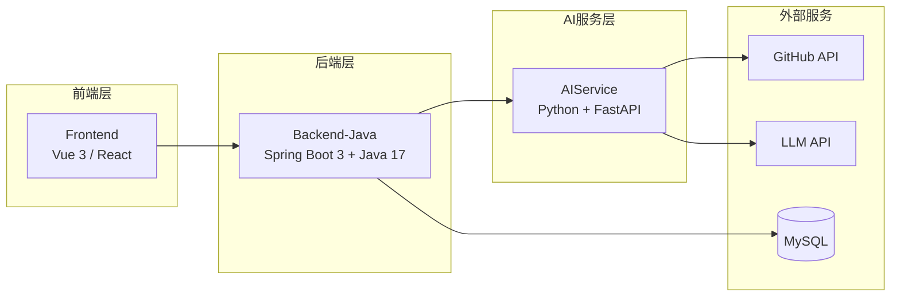

**图表来源**
- [docs/ARCHITECTURE.md:21-47](file://docs/ARCHITECTURE.md#L21-L47)

### 服务交互流程

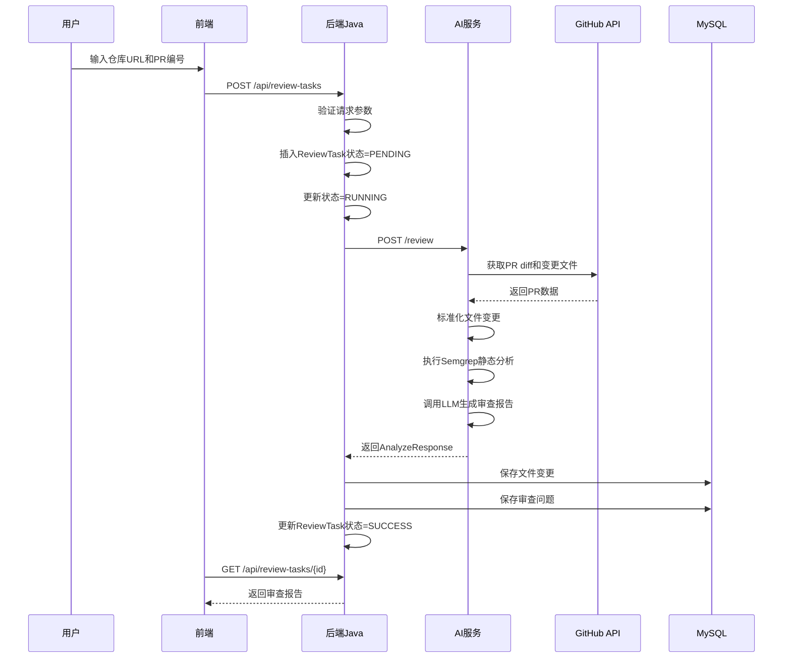

**图表来源**
- [docs/ARCHITECTURE.md:139-168](file://docs/ARCHITECTURE.md#L139-L168)

**章节来源**
- [docs/ARCHITECTURE.md:56-107](file://docs/ARCHITECTURE.md#L56-L107)
- [docs/ARCHITECTURE.md:137-181](file://docs/ARCHITECTURE.md#L137-L181)

## 架构概览

### 系统总体架构

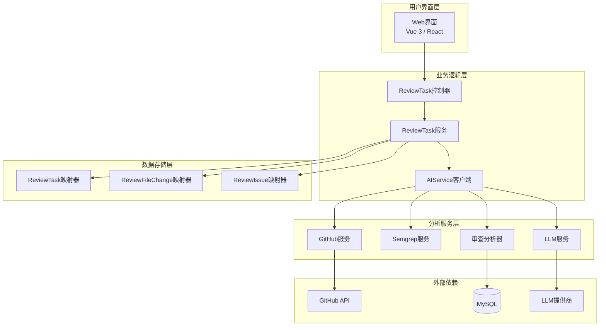

**图表来源**
- [docs/ARCHITECTURE.md:183-266](file://docs/ARCHITECTURE.md#L183-L266)

### 数据流设计

系统采用标准化的数据流设计，确保Semgrep分析结果能够无缝集成到整体审查流程中：

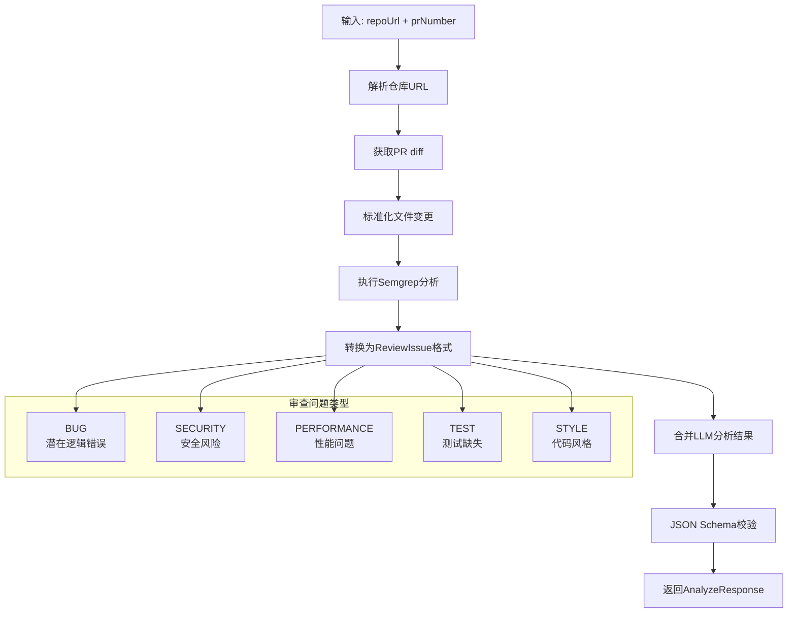

**图表来源**
- [docs/ARCHITECTURE.md:269-308](file://docs/ARCHITECTURE.md#L269-L308)
- [docs/PRD.md:104-122](file://docs/PRD.md#L104-L122)

**章节来源**
- [docs/ARCHITECTURE.md:269-308](file://docs/ARCHITECTURE.md#L269-L308)
- [docs/PRD.md:104-122](file://docs/PRD.md#L104-L122)

## Semgrep集成详解

### 集成架构设计

根据架构文档，Semgrep集成将作为独立的服务模块运行：

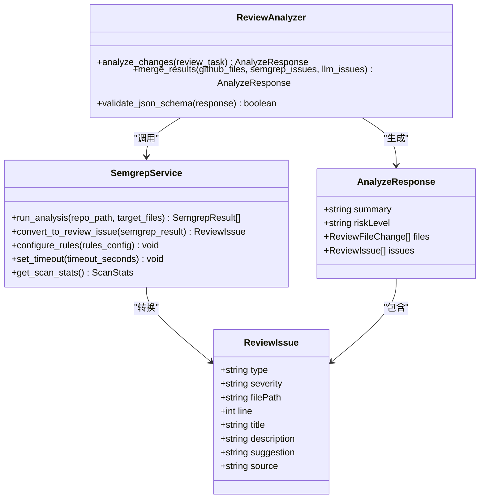

**图表来源**
- [docs/ARCHITECTURE.md:245-249](file://docs/ARCHITECTURE.md#L245-L249)
- [docs/ARCHITECTURE.md:243-244](file://docs/ARCHITECTURE.md#L243-L244)

### 扫描执行流程

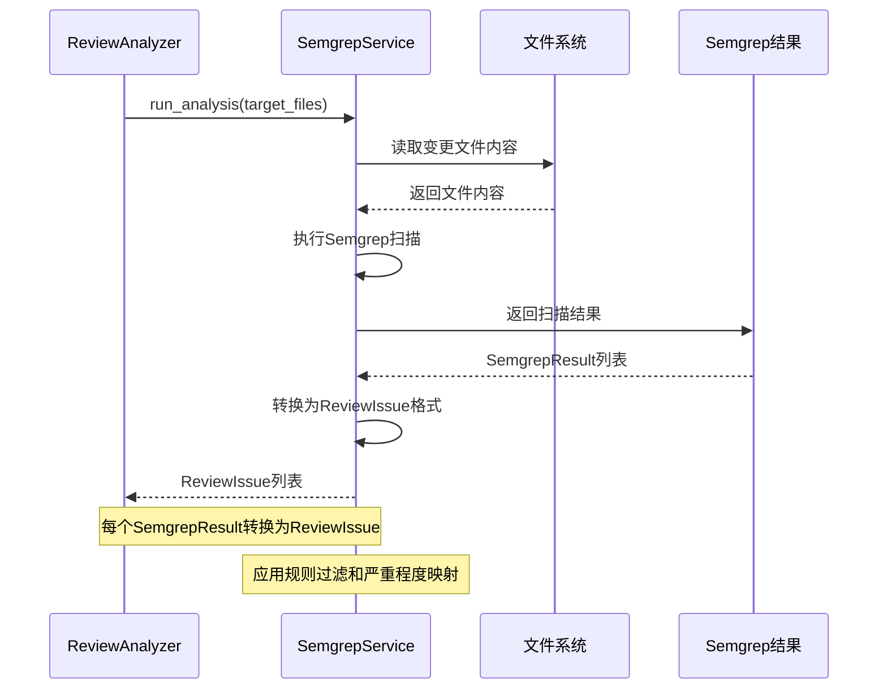

**图表来源**
- [docs/ARCHITECTURE.md:153-159](file://docs/ARCHITECTURE.md#L153-L159)

**章节来源**
- [docs/ARCHITECTURE.md:233-266](file://docs/ARCHITECTURE.md#L233-L266)
- [docs/ARCHITECTURE.md:153-159](file://docs/ARCHITECTURE.md#L153-L159)

## 配置选项与环境变量

### 环境变量配置

根据架构设计，Semgrep相关的环境变量配置如下：

| 环境变量 | 默认值 | 说明 | 生效范围 |
|---------|--------|------|---------|
| SEMGREP_TIMEOUT_SECONDS | 30 | Semgrep执行超时时间（秒） | ai-service |
| SEMGREP_RULES_PATH | .semgrep/ | 规则文件目录路径 | ai-service |
| SEMGREP_OUTPUT_FORMAT | json | 输出格式（json/sarif） | ai-service |
| SEMGREP_CONFIG_FILE | .semgrep.yml | 规则配置文件路径 | ai-service |

### 配置文件结构

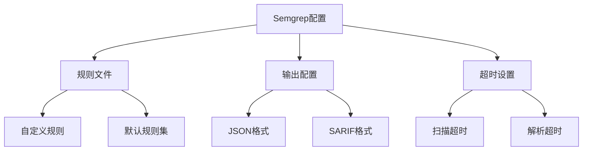

**图表来源**
- [docs/ARCHITECTURE.md:356-363](file://docs/ARCHITECTURE.md#L356-L363)

**章节来源**
- [docs/ARCHITECTURE.md:345-370](file://docs/ARCHITECTURE.md#L345-L370)

## 结果转换与标准化

### ReviewIssue格式规范

Semgrep扫描结果需要转换为统一的ReviewIssue格式：

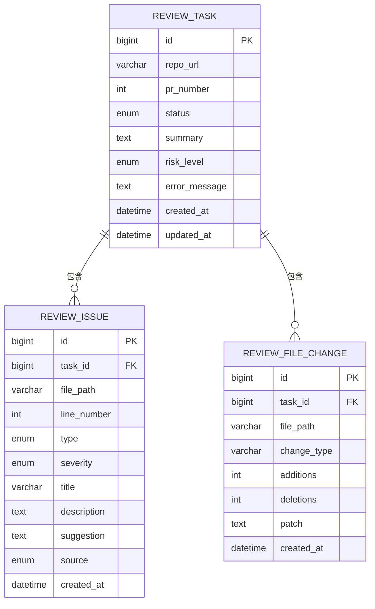

**图表来源**
- [docs/PRD.md:154-168](file://docs/PRD.md#L154-L168)

### 转换映射规则

| Semgrep字段 | ReviewIssue字段 | 映射规则 | 示例 |
|------------|----------------|---------|------|
| rule_id | type | 映射到问题类型枚举 | "java.lang.security.audit.crypto.use-of-hard-coded-secret.use-of-hard-coded-secret" → "SECURITY" |
| message | title | 提取规则标题 | "Hardcoded secret detected" |
| fix | suggestion | 提供修复建议 | "Move this value to environment variables" |
| location.path | filePath | 文件路径 | "src/main/java/AuthController.java" |
| location.line | line | 行号 | 15 |
| severity | severity | 映射严重程度 | "ERROR" → "HIGH" |
| metadata.cwe | description | CWE描述 | "CWE-259: Use of Hard-coded Password" |

**章节来源**
- [docs/PRD.md:104-122](file://docs/PRD.md#L104-L122)
- [docs/API.md:218-230](file://docs/API.md#L218-L230)

## 问题类型识别与分类

### 问题类型分类体系

根据PRD文档，系统支持五种类型的问题识别：

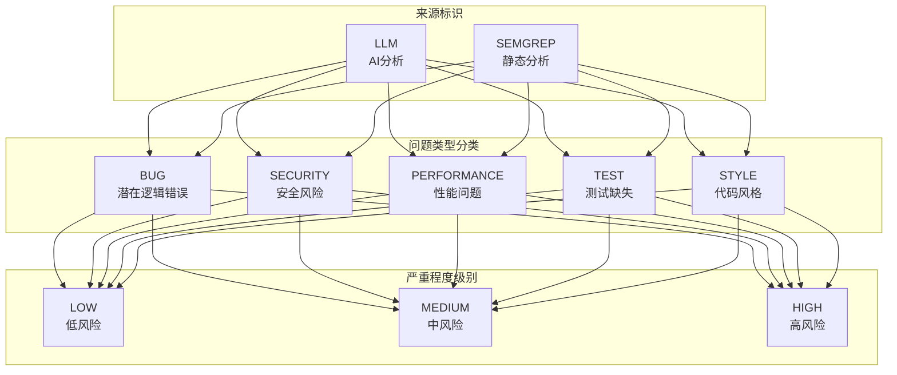

**图表来源**
- [docs/PRD.md:104-122](file://docs/PRD.md#L104-L122)

### 识别机制

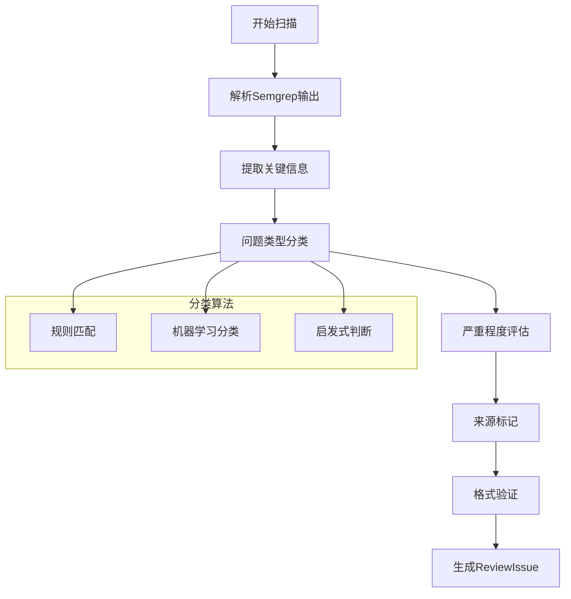

**图表来源**
- [docs/PRD.md:104-122](file://docs/PRD.md#L104-L122)

**章节来源**
- [docs/PRD.md:104-122](file://docs/PRD.md#L104-L122)

## 性能优化策略

### 扫描性能优化

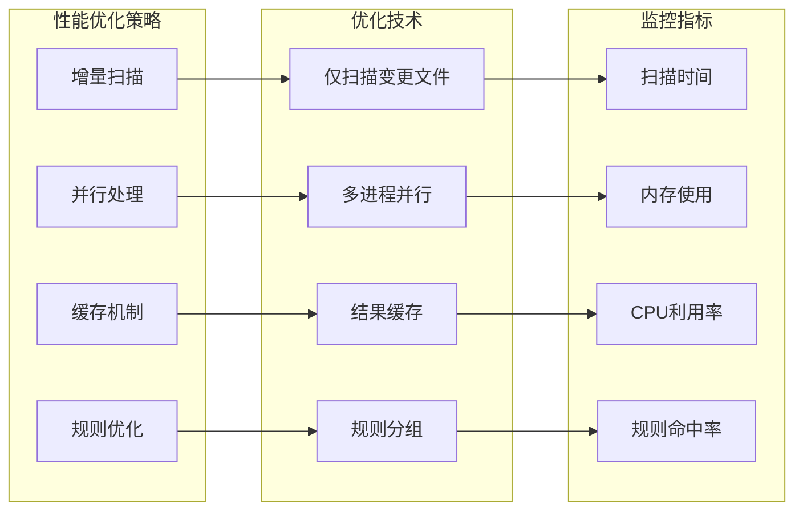

### 优化实施要点

1. **增量扫描策略**
   - 仅对PR变更的文件执行Semgrep扫描
   - 利用Git diff信息确定扫描范围
   - 减少不必要的文件扫描

2. **并行处理优化**
   - 多进程并行执行多个文件的扫描
   - 异步处理扫描结果转换
   - 流水线式处理提高吞吐量

3. **缓存机制**
   - 缓存规则匹配结果
   - 缓存重复的扫描文件
   - 实现智能缓存失效策略

4. **规则优化**
   - 分组加载相关规则
   - 动态启用/禁用规则
   - 优先执行高价值规则

**章节来源**
- [docs/ARCHITECTURE.md:170-180](file://docs/ARCHITECTURE.md#L170-L180)

## 规则自定义与扩展

### 规则配置体系

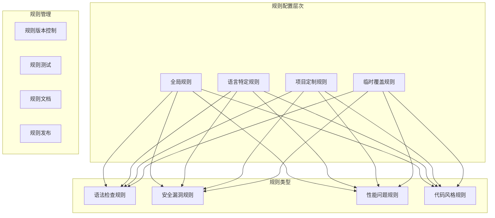

### 规则扩展方法

1. **自定义规则开发**
   - 基于YAML语法定义新规则
   - 支持正则表达式和AST匹配
   - 实现条件触发和上下文感知

2. **规则组合策略**
   - 规则集的动态组合
   - 条件规则的启用/禁用
   - 规则优先级的调整

3. **规则测试与验证**
   - 单元测试框架
   - 规则效果验证
   - 性能影响评估

**章节来源**
- [docs/ARCHITECTURE.md:248](file://docs/ARCHITECTURE.md#L248)

## 扫描配置示例

### 基础配置模板

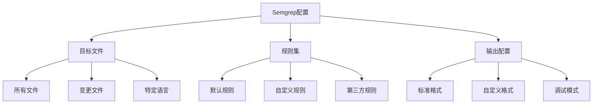

### 配置文件示例

```yaml
# .semgrep.yml
rules:
  # 安全规则
  - id: hardcoded-secret
    patterns:
      - pattern: "String secret = \"...\""
      - pattern: "secret = \"...\""
    languages: [java, python, javascript]
    severity: ERROR
    tags: ["security"]
  
  # 性能规则
  - id: n-plus-one-query
    patterns:
      - pattern: "for (...) { SELECT * FROM table WHERE id = ? }"
    languages: [java, python]
    severity: WARNING
    tags: ["performance"]

# 输出配置
output:
  format: json
  timeout: 30
  max_target_breaches: 100
```

**章节来源**
- [docs/ARCHITECTURE.md:356-363](file://docs/ARCHITECTURE.md#L356-L363)

## 依赖关系分析

### 组件依赖图

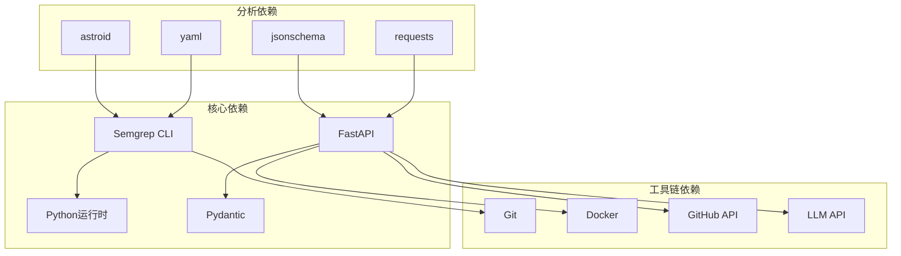

### 依赖管理策略

1. **版本锁定**
   - 使用requirements.txt锁定依赖版本
   - 定期更新安全补丁版本
   - 实施依赖审计机制

2. **容器化部署**
   - Docker镜像包含完整依赖栈
   - 多阶段构建优化镜像大小
   - 缓存依赖层提高构建速度

3. **安全扫描**
   - 定期扫描依赖漏洞
   - 实施供应链安全策略
   - 建立依赖更新流程

**章节来源**
- [docs/ARCHITECTURE.md:29-46](file://docs/ARCHITECTURE.md#L29-L46)

## 故障排除指南

### 常见问题诊断

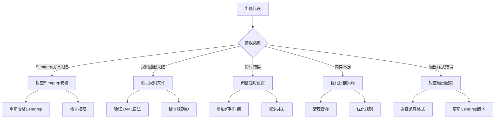

### 错误处理策略

根据架构设计，系统采用分级的错误处理策略：

| 错误场景 | 处理策略 | 影响范围 |
|---------|---------|---------|
| GitHub API失败 | 任务状态FAILED，保存error_message | 整个流程中断 |
| Semgrep失败 | 降级为warning，不导致任务失败 | 仅影响静态分析结果 |
| LLM失败 | 使用mock fallback或返回空issues | 审查报告完整性受影响 |
| LLM JSON schema校验失败 | 记录原始输出摘要，不返回未校验结构 | 输出格式标准化失败 |
| 后台数据库保存失败 | 任务状态FAILED | 结果持久化失败 |
| ai-service超时 | 任务状态FAILED，保存超时原因 | 服务可用性问题 |

**章节来源**
- [docs/ARCHITECTURE.md:170-180](file://docs/ARCHITECTURE.md#L170-L180)

## 结论

CodeReviewX项目通过精心设计的架构，为Semgrep静态分析的集成奠定了坚实的基础。虽然当前Round 01阶段尚未实现完整的Semgrep集成，但完整的文档体系、清晰的模块边界和标准化的API设计为后续的功能实现提供了明确的指导。

### 主要优势

1. **架构清晰**：模块职责边界明确，便于Semgrep集成的独立开发和测试
2. **标准化程度高**：统一的ReviewIssue格式确保了分析结果的一致性
3. **容错机制完善**：分级的错误处理策略提高了系统的稳定性
4. **扩展性强**：灵活的规则配置和自定义机制支持持续的功能增强

### 下一步建议

1. **优先实现Semgrep服务模块**：独立开发SemgrepService，确保与其他模块的解耦
2. **建立规则测试框架**：为自定义规则提供完善的测试和验证机制
3. **优化性能指标**：重点关注扫描速度和资源消耗的平衡
4. **完善监控告警**：建立全面的性能监控和异常告警机制

通过遵循本文档的设计原则和最佳实践，开发团队可以高效地实现Semgrep静态分析功能，为CodeReviewX系统提供强大的代码质量保障能力。