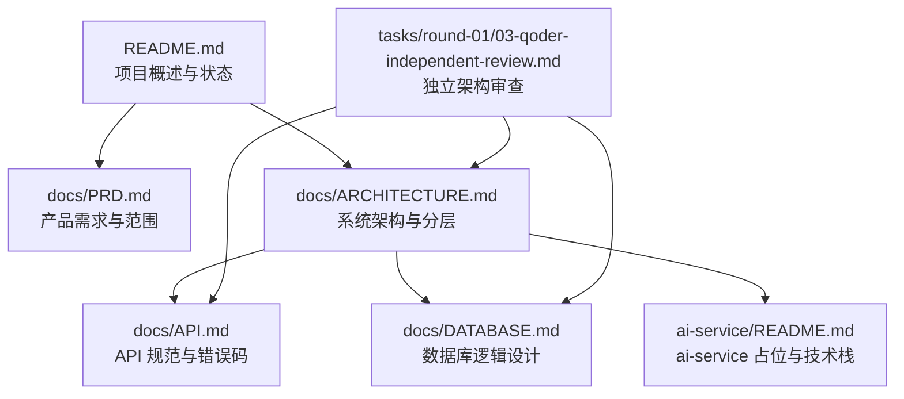
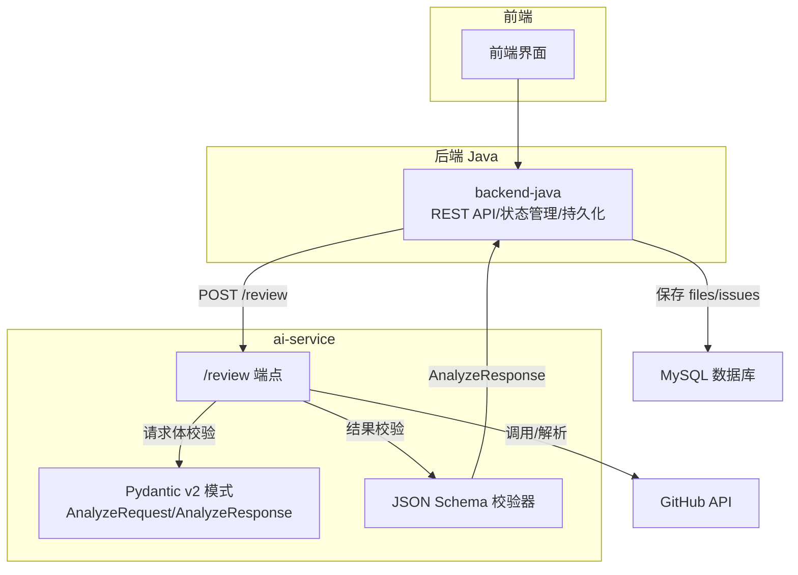
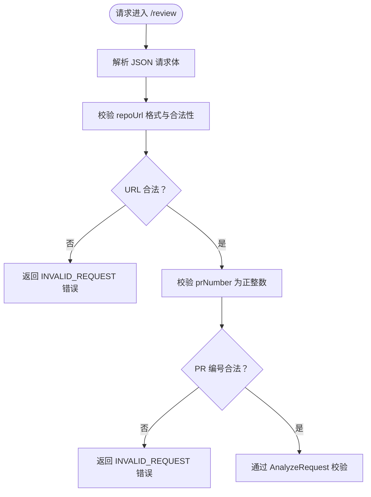
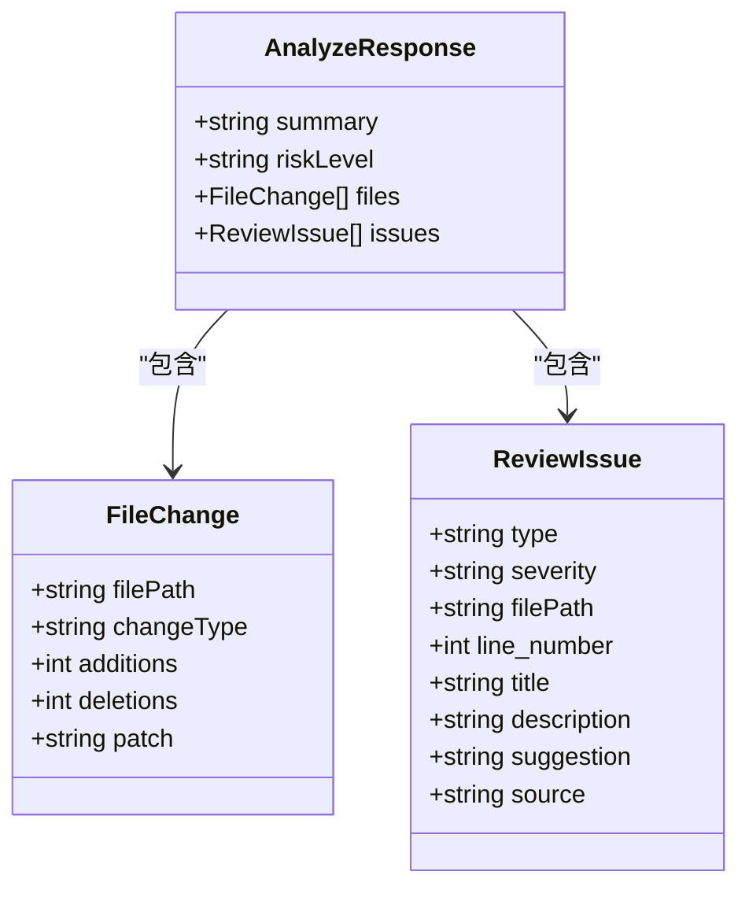
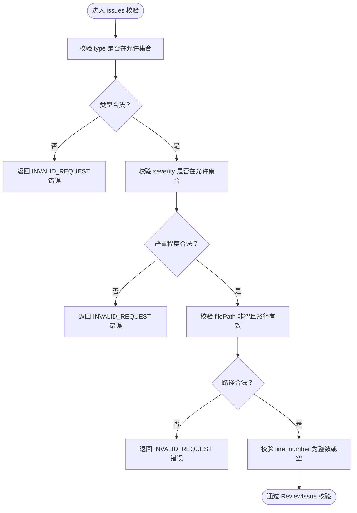
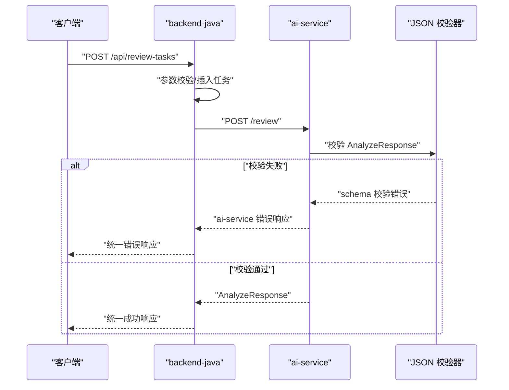
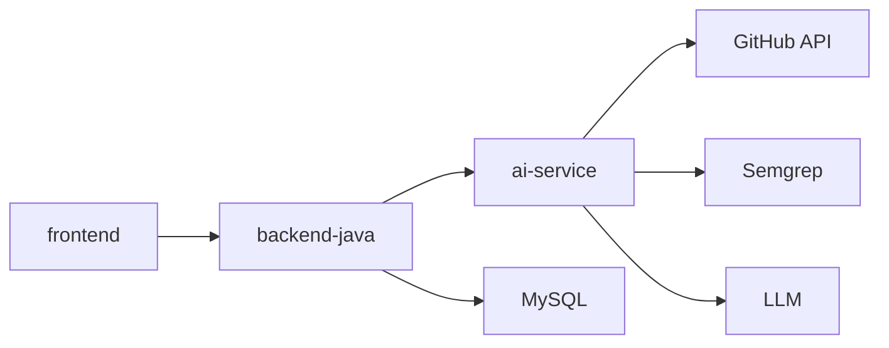

# 数据模式与验证

<cite>
**本文引用的文件**
- [README.md](file://README.md)
- [docs/PRD.md](file://docs/PRD.md)
- [docs/ARCHITECTURE.md](file://docs/ARCHITECTURE.md)
- [docs/API.md](file://docs/API.md)
- [docs/DATABASE.md](file://docs/DATABASE.md)
- [ai-service/README.md](file://ai-service/README.md)
- [tasks/round-01/03-qoder-independent-review.md](file://tasks/round-01/03-qoder-independent-review.md)
</cite>

## 目录
1. [简介](#简介)
2. [项目结构](#项目结构)
3. [核心组件](#核心组件)
4. [架构总览](#架构总览)
5. [详细组件分析](#详细组件分析)
6. [依赖关系分析](#依赖关系分析)
7. [性能考量](#性能考量)
8. [故障排查指南](#故障排查指南)
9. [结论](#结论)
10. [附录](#附录)

## 简介
本文件围绕数据模式与验证机制展开，重点说明 Pydantic v2 在数据验证中的应用与优势，文档化核心数据模式 AnalyzeRequest 与 AnalyzeResponse 的设计思路与字段约束，解释 ReviewIssue 的标准格式与字段含义，并结合项目文档梳理数据验证规则、错误消息定制与序列化处理方式。同时提供数据模式定义示例与验证测试思路，帮助开发者正确使用与扩展验证机制。

## 项目结构
- 项目采用多文档与模块规划的方式，明确划分了 PRD、架构、API、数据库等文档，以及各模块职责边界。
- ai-service 在 Round 01 为占位阶段，未来将使用 Pydantic v2 定义请求/响应模型与 JSON 校验器。

**图示来源**
- [README.md:1-120](file://README.md#L1-L120)
- [docs/PRD.md:1-218](file://docs/PRD.md#L1-L218)
- [docs/ARCHITECTURE.md:1-417](file://docs/ARCHITECTURE.md#L1-L417)
- [docs/API.md:1-378](file://docs/API.md#L1-L378)
- [docs/DATABASE.md:1-294](file://docs/DATABASE.md#L1-L294)
- [ai-service/README.md:1-86](file://ai-service/README.md#L1-L86)
- [tasks/round-01/03-qoder-independent-review.md:1-667](file://tasks/round-01/03-qoder-independent-review.md#L1-L667)

**章节来源**
- [README.md:1-120](file://README.md#L1-L120)
- [docs/PRD.md:1-218](file://docs/PRD.md#L1-L218)
- [docs/ARCHITECTURE.md:1-417](file://docs/ARCHITECTURE.md#L1-L417)
- [docs/API.md:1-378](file://docs/API.md#L1-L378)
- [docs/DATABASE.md:1-294](file://docs/DATABASE.md#L1-L294)
- [ai-service/README.md:1-86](file://ai-service/README.md#L1-L86)
- [tasks/round-01/03-qoder-independent-review.md:1-667](file://tasks/round-01/03-qoder-independent-review.md#L1-L667)

## 核心组件
- AnalyzeRequest：ai-service 接收的分析请求体，包含仓库地址与 PR 编号等必要字段。
- AnalyzeResponse：ai-service 返回的标准化 Review JSON，包含 summary、riskLevel、files、issues 等字段。
- ReviewIssue：问题条目的标准格式，包含类型、严重程度、来源、位置与修复建议等字段。
- 错误响应：统一的错误响应格式，便于前后端与服务间的一致性处理。

上述组件在文档中均有明确的字段定义、取值范围与约束说明，为后续 Pydantic v2 的数据验证与序列化奠定基础。

**章节来源**
- [docs/ARCHITECTURE.md:269-311](file://docs/ARCHITECTURE.md#L269-L311)
- [docs/API.md:243-333](file://docs/API.md#L243-L333)
- [docs/DATABASE.md:94-134](file://docs/DATABASE.md#L94-L134)
- [docs/PRD.md:104-122](file://docs/PRD.md#L104-L122)

## 架构总览
下图展示了 Review 数据在系统内的流动与验证位置，强调 ai-service 在数据规范化与校验中的关键作用。

**图示来源**
- [docs/ARCHITECTURE.md:137-182](file://docs/ARCHITECTURE.md#L137-L182)
- [docs/ARCHITECTURE.md:233-266](file://docs/ARCHITECTURE.md#L233-L266)
- [docs/API.md:243-333](file://docs/API.md#L243-L333)
- [ai-service/README.md:29-40](file://ai-service/README.md#L29-L40)

## 详细组件分析

### AnalyzeRequest 数据模式
- 字段与约束
  - repoUrl：字符串，必填，格式为 https://github.com/{owner}/{repo}。
  - prNumber：整数，必填，必须为正整数。
- 验证要点
  - URL 格式校验与协议/主机名合法性。
  - PR 编号必须为正整数，避免无效请求。
- 序列化处理
  - 作为 HTTP 请求体传入 ai-service 的 /review 端点，Pydantic v2 将进行严格的数据类型与格式校验。

**图示来源**
- [docs/API.md:56-77](file://docs/API.md#L56-L77)
- [docs/ARCHITECTURE.md:269-278](file://docs/ARCHITECTURE.md#L269-L278)

**章节来源**
- [docs/API.md:56-77](file://docs/API.md#L56-L77)
- [docs/ARCHITECTURE.md:269-278](file://docs/ARCHITECTURE.md#L269-L278)

### AnalyzeResponse 数据模式
- 字段与约束
  - summary：字符串，Review 总结。
  - riskLevel：字符串枚举，取值 LOW/MEDIUM/HIGH。
  - files：数组，每项包含 filePath、changeType、additions、deletions、patch 等字段。
  - issues：数组，每项为 ReviewIssue 标准格式。
- 验证要点
  - riskLevel 限定枚举值。
  - files 与 issues 的结构一致性与字段完整性。
- 序列化处理
  - Pydantic v2 将确保返回结构符合 AnalyzeResponse 模式，便于下游持久化与前端渲染。

**图示来源**
- [docs/ARCHITECTURE.md:280-308](file://docs/ARCHITECTURE.md#L280-L308)
- [docs/API.md:264-312](file://docs/API.md#L264-L312)
- [docs/DATABASE.md:94-134](file://docs/DATABASE.md#L94-L134)

**章节来源**
- [docs/ARCHITECTURE.md:280-308](file://docs/ARCHITECTURE.md#L280-L308)
- [docs/API.md:264-312](file://docs/API.md#L264-L312)
- [docs/DATABASE.md:94-134](file://docs/DATABASE.md#L94-L134)

### ReviewIssue 标准格式与字段约束
- 字段与约束
  - type：问题类型，枚举值包括 BUG/SECURITY/PERFORMANCE/TEST/STYLE。
  - severity：严重程度，枚举值 LOW/MEDIUM/HIGH。
  - filePath：问题所在文件路径。
  - line_number：问题行号（可为空，Semgrep 通常有）。
  - title/description：问题标题与描述。
  - suggestion：修复建议（可为空）。
  - source：来源，LLM 或 SEMGREP。
- 验证要点
  - type/severity/source 限定枚举值。
  - filePath 必填且合理。
  - line_number 为整数或空值。
- 序列化处理
  - ReviewIssue 作为 AnalyzeResponse.issues 数组元素，统一由 Pydantic v2 校验与序列化。

**图示来源**
- [docs/DATABASE.md:94-134](file://docs/DATABASE.md#L94-L134)
- [docs/PRD.md:104-122](file://docs/PRD.md#L104-L122)
- [docs/API.md:218-230](file://docs/API.md#L218-L230)

**章节来源**
- [docs/DATABASE.md:94-134](file://docs/DATABASE.md#L94-L134)
- [docs/PRD.md:104-122](file://docs/PRD.md#L104-L122)
- [docs/API.md:218-230](file://docs/API.md#L218-L230)

### 错误响应与错误码
- 统一错误响应格式
  - 后端 Java：包含 code、message、details。
  - ai-service：包含 errorCode、message、recoverable。
- 错误码与处理策略
  - INVALID_REQUEST：参数错误或校验失败。
  - TASK_NOT_FOUND：任务不存在。
  - AI_SERVICE_ERROR/GITHUB_FETCH_FAILED/DATABASE_ERROR/INTERNAL_ERROR：对应后端错误。
  - ai-service 错误码：GITHUB_FETCH_FAILED、PR_NOT_FOUND、SEMGREP_FAILED、LLM_FAILED、INVALID_REQUEST。
- 失败链路处理
  - GitHub API 失败：FAILED 并记录 error_message。
  - Semgrep 失败：降级为 warning，不导致任务失败。
  - LLM 失败：优先使用 mock fallback，fallback 失败后任务置为 FAILED。
  - JSON schema 校验失败：记录原始输出摘要，不返回未校验结构。

**图示来源**
- [docs/ARCHITECTURE.md:170-182](file://docs/ARCHITECTURE.md#L170-L182)
- [docs/API.md:313-333](file://docs/API.md#L313-L333)
- [docs/ARCHITECTURE.md:269-308](file://docs/ARCHITECTURE.md#L269-L308)

**章节来源**
- [docs/ARCHITECTURE.md:170-182](file://docs/ARCHITECTURE.md#L170-L182)
- [docs/API.md:313-333](file://docs/API.md#L313-L333)
- [docs/ARCHITECTURE.md:269-308](file://docs/ARCHITECTURE.md#L269-L308)

## 依赖关系分析
- 模块耦合
  - frontend 仅通过 backend-java 调用 ai-service，避免直接依赖底层服务。
  - backend-java 负责参数校验、状态管理与持久化，ai-service 负责数据获取与结构化输出。
- 外部依赖
  - ai-service 计划使用 Pydantic v2 进行请求/响应建模与校验，使用 JSON Schema 校验器保障输出一致性。
  - GitHub API、Semgrep、LLM 作为外部服务，ai-service 负责调用与结果转换。

**图示来源**
- [docs/ARCHITECTURE.md:19-52](file://docs/ARCHITECTURE.md#L19-L52)
- [ai-service/README.md:19-40](file://ai-service/README.md#L19-L40)

**章节来源**
- [docs/ARCHITECTURE.md:19-52](file://docs/ARCHITECTURE.md#L19-L52)
- [ai-service/README.md:19-40](file://ai-service/README.md#L19-L40)

## 性能考量
- 校验开销
  - Pydantic v2 在解析与校验阶段具备高性能特性，适合在 ai-service 的 /review 端点前置校验，减少后续处理的失败率。
- 序列化优化
  - 使用 Pydantic v2 的序列化能力，可降低手动序列化成本，提升响应稳定性与一致性。
- 失败降级
  - Semgrep/LLM 失败时采用降级策略，避免阻塞整体流程，提高系统可用性。

[本节为通用指导，无需列出具体文件来源]

## 故障排查指南
- 常见问题与定位
  - INVALID_REQUEST：检查 AnalyzeRequest 的 repoUrl 与 prNumber 是否符合约束。
  - JSON schema 校验失败：确认 AnalyzeResponse 的字段与类型是否满足模式定义。
  - ai-service 错误码：根据错误码定位 GitHub API、Semgrep 或 LLM 的调用问题。
- 日志与可观测性
  - FAILED 状态需记录 error_message，便于问题追踪与复盘。
  - 对于 JSON schema 校验失败，记录原始输出摘要，辅助定位异常数据。

**章节来源**
- [docs/ARCHITECTURE.md:128-134](file://docs/ARCHITECTURE.md#L128-L134)
- [docs/API.md:41-51](file://docs/API.md#L41-L51)
- [docs/API.md:323-332](file://docs/API.md#L323-L332)

## 结论
本文件基于现有文档梳理了 CodeReviewX 的数据模式与验证机制，明确了 AnalyzeRequest/AnalyzeResponse 与 ReviewIssue 的字段与约束，并总结了错误响应与失败链路处理策略。随着 ai-service 进入后续 Round，Pydantic v2 将成为数据验证与序列化的核心工具，确保请求与响应的一致性与可靠性，为后续 Semgrep 与 LLM 集成提供稳定的数据契约。

[本节为总结性内容，无需列出具体文件来源]

## 附录

### 数据模式定义示例（路径指引）
- AnalyzeRequest
  - 示例路径：[docs/API.md:56-77](file://docs/API.md#L56-L77)
- AnalyzeResponse
  - 示例路径：[docs/ARCHITECTURE.md:280-308](file://docs/ARCHITECTURE.md#L280-L308)
  - 示例路径：[docs/API.md:264-312](file://docs/API.md#L264-L312)
- ReviewIssue
  - 示例路径：[docs/DATABASE.md:94-134](file://docs/DATABASE.md#L94-L134)
  - 示例路径：[docs/PRD.md:104-122](file://docs/PRD.md#L104-L122)

### 验证测试思路（路径指引）
- 请求体校验
  - 路径：[docs/API.md:56-77](file://docs/API.md#L56-L77)
  - 目标：构造非法 repoUrl 与负数 prNumber，验证 INVALID_REQUEST 错误返回。
- 响应体校验
  - 路径：[docs/ARCHITECTURE.md:280-308](file://docs/ARCHITECTURE.md#L280-L308)
  - 目标：构造缺少字段或类型不符的 AnalyzeResponse，验证 JSON schema 校验失败。
- 问题条目校验
  - 路径：[docs/DATABASE.md:94-134](file://docs/DATABASE.md#L94-L134)
  - 目标：构造 type/severity/source 非法值，验证 ReviewIssue 校验失败。

**章节来源**
- [docs/API.md:56-77](file://docs/API.md#L56-L77)
- [docs/ARCHITECTURE.md:280-308](file://docs/ARCHITECTURE.md#L280-L308)
- [docs/DATABASE.md:94-134](file://docs/DATABASE.md#L94-L134)