# 服务架构设计

<cite>
**本文档引用的文件**
- [README.md](file://README.md)
- [docker-compose.yml](file://docker-compose.yml)
- [docs/ARCHITECTURE.md](file://docs/ARCHITECTURE.md)
- [docs/PRD.md](file://docs/PRD.md)
- [docs/API.md](file://docs/API.md)
- [docs/DATABASE.md](file://docs/DATABASE.md)
- [docs/AGENT_RULES.md](file://docs/AGENT_RULES.md)
- [docs/HANDOFF_TEMPLATE.md](file://docs/HANDOFF_TEMPLATE.md)
- [ai-service/README.md](file://ai-service/README.md)
- [backend-java/README.md](file://backend-java/README.md)
- [frontend/README.md](file://frontend/README.md)
</cite>

## 目录
1. [简介](#简介)
2. [项目结构](#项目结构)
3. [核心组件](#核心组件)
4. [架构总览](#架构总览)
5. [详细组件分析](#详细组件分析)
6. [依赖关系分析](#依赖关系分析)
7. [性能考虑](#性能考虑)
8. [故障排除指南](#故障排除指南)
9. [结论](#结论)
10. [附录](#附录)

## 简介

CodeReviewX是一个面向GitHub Pull Request的智能代码审查与修复建议Agent系统。该项目采用多服务架构设计，通过模块化和分层架构实现清晰的服务边界和职责分离。系统旨在为用户提供自动化的代码审查报告，包括风险评估、问题识别和修复建议。

该系统遵循"文档优先"的原则，在第一轮Round 01中建立了完整的项目骨架、文档体系和Agent协作规则，为后续的功能实现奠定了坚实的基础。

## 项目结构

### 整体项目布局

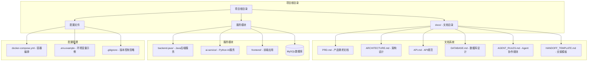

**图表来源**
- [README.md:58-82](file://README.md#L58-L82)
- [docker-compose.yml:1-14](file://docker-compose.yml#L1-L14)

### 服务模块职责划分

| 模块 | 技术栈 | 核心职责 | 状态 |
|------|--------|----------|------|
| **backend-java** | Spring Boot 3 + Java 17 | REST API、任务编排、数据持久化、调用ai-service | Round 01占位符 |
| **ai-service** | Python + FastAPI | GitHub数据获取、Semgrep执行、LLM分析、结构化输出 | Round 01占位符 |
| **frontend** | Vue 3/React | 任务创建表单、任务列表、报告展示 | Round 01占位符 |
| **MySQL** | MySQL 8 | 任务、文件变更、问题持久化 | Round 01占位符 |

**章节来源**
- [README.md:47-55](file://README.md#L47-L55)
- [README.md:110-120](file://README.md#L110-L120)

## 核心组件

### 1. 模块化设计原则

系统采用严格的模块化设计，确保各服务之间的职责清晰分离：

#### 核心设计原则
- **单一职责原则**：每个模块专注于特定的业务领域
- **开闭原则**：对扩展开放，对修改封闭
- **依赖倒置原则**：高层模块不依赖低层模块
- **接口隔离原则**：客户端不应该依赖它不需要的接口

#### 服务边界定义

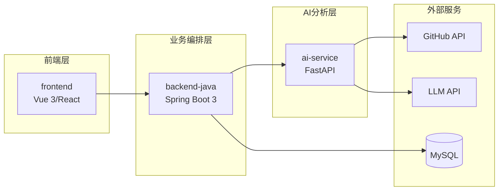

**图表来源**
- [docs/ARCHITECTURE.md:19-52](file://docs/ARCHITECTURE.md#L19-L52)

### 2. 分层架构设计

#### backend-java 分层架构

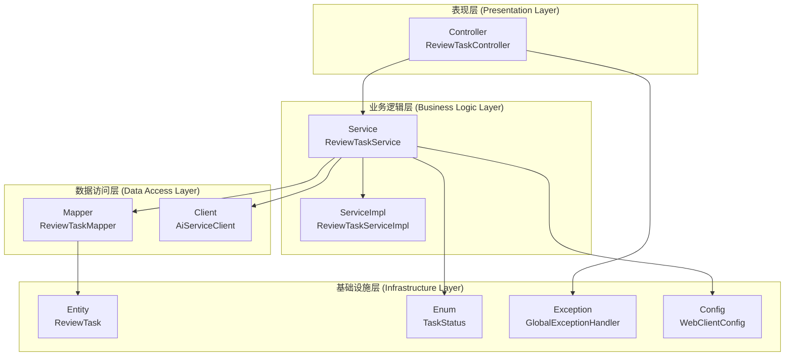

**图表来源**
- [docs/ARCHITECTURE.md:183-220](file://docs/ARCHITECTURE.md#L183-L220)

#### ai-service 分层架构

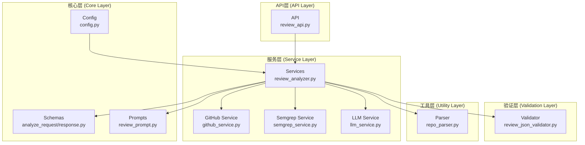

**图表来源**
- [docs/ARCHITECTURE.md:233-256](file://docs/ARCHITECTURE.md#L233-L256)

**章节来源**
- [docs/ARCHITECTURE.md:183-266](file://docs/ARCHITECTURE.md#L183-L266)

## 架构总览

### 系统总体架构

CodeReviewX采用三层架构设计，实现了清晰的职责分离和良好的可扩展性：

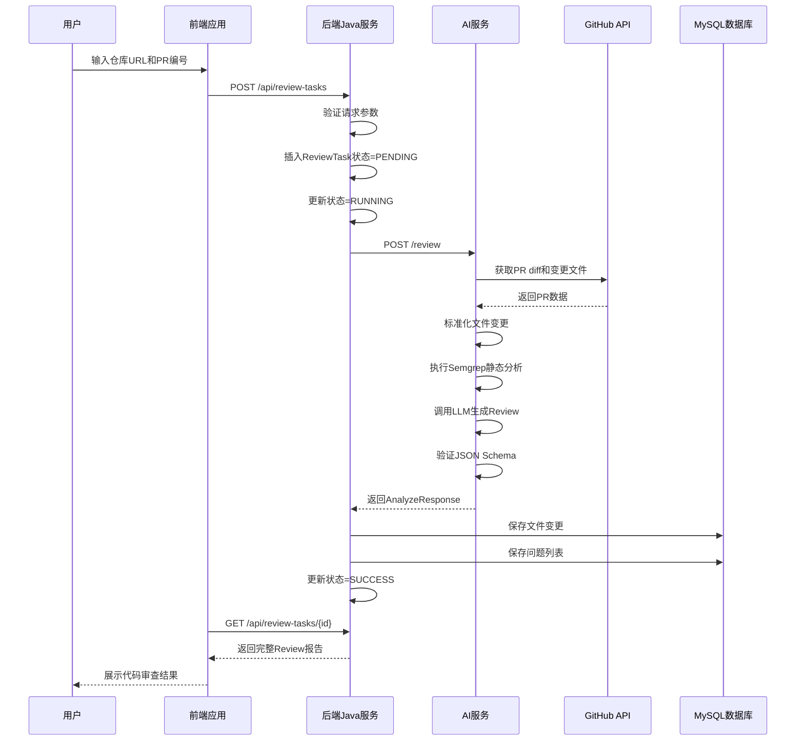

**图表来源**
- [docs/ARCHITECTURE.md:137-181](file://docs/ARCHITECTURE.md#L137-L181)

### 数据流设计

系统的数据流遵循严格的单向传递原则，确保数据的一致性和可追踪性：

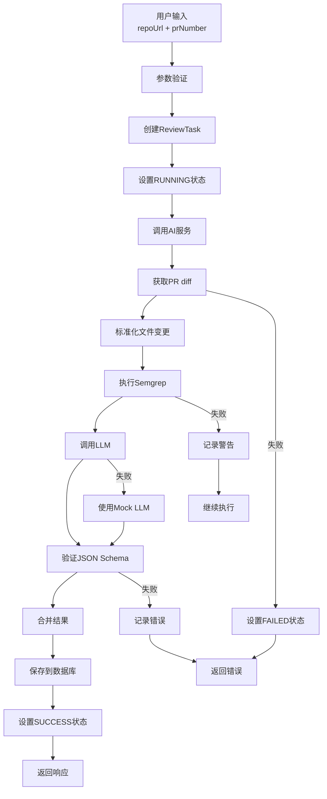

**图表来源**
- [docs/ARCHITECTURE.md:269-308](file://docs/ARCHITECTURE.md#L269-L308)

**章节来源**
- [docs/ARCHITECTURE.md:137-181](file://docs/ARCHITECTURE.md#L137-L181)

## 详细组件分析

### 1. review_analyzer 组件

#### 设计原则
- **单一职责**：专注于代码审查分析流程的协调
- **可扩展性**：支持不同类型的分析服务集成
- **容错性**：实现优雅的降级策略

#### 核心功能
- 协调GitHub数据获取、Semgrep执行和LLM分析
- 标准化不同来源的数据格式
- 实现结果合并和冲突解决
- 执行最终的数据验证

#### 处理流程

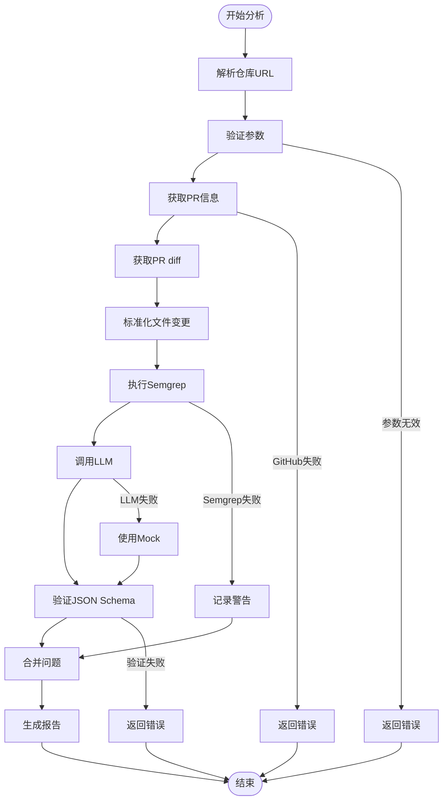

**图表来源**
- [docs/ARCHITECTURE.md:90-107](file://docs/ARCHITECTURE.md#L90-L107)

### 2. github_service 组件

#### 设计原则
- **封装性**：隐藏GitHub API的复杂性
- **健壮性**：实现完善的错误处理和重试机制
- **可测试性**：支持模拟和单元测试

#### 核心功能
- 解析GitHub仓库URL并提取owner和repo
- 调用GitHub API获取PR信息和diff
- 处理认证和速率限制
- 实现数据缓存和去重

#### API交互流程

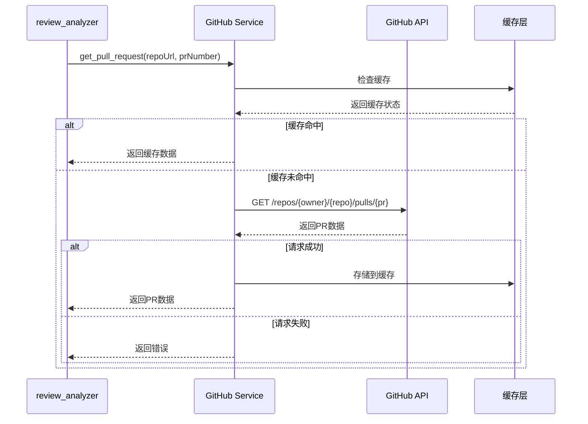

**图表来源**
- [docs/ARCHITECTURE.md:90-107](file://docs/ARCHITECTURE.md#L90-L107)

### 3. semgrep_service 组件

#### 设计原则
- **无状态性**：每次调用都是独立的分析过程
- **可配置性**：支持不同的规则集和配置
- **性能优化**：实现并发执行和结果聚合

#### 核心功能
- 执行Semgrep静态分析命令
- 解析和转换Semgrep输出格式
- 实现超时控制和资源管理
- 支持增量分析和缓存

#### 处理流程

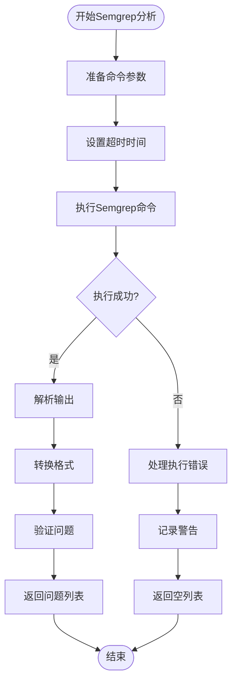

**图表来源**
- [docs/ARCHITECTURE.md:90-107](file://docs/ARCHITECTURE.md#L90-L107)

### 4. llm_service 组件

#### 设计原则
- **抽象性**：屏蔽不同LLM提供商的差异
- **可替换性**：支持Mock和真实LLM的无缝切换
- **安全性**：保护敏感信息和API密钥

#### 核心功能
- 支持多种LLM提供商的统一接口
- 实现Prompt工程和上下文管理
- 提供Mock模式用于开发和测试
- 实现错误恢复和重试机制

#### 模式切换流程

```mermaid
stateDiagram-v2
[*] --> Init
Init --> MockMode : LLM_PROVIDER=mock
Init --> RealMode : LLM_PROVIDER!=mock
MockMode --> GenerateMockResponse
GenerateMockResponse --> ValidateResponse
ValidateResponse --> Success : 验证通过
ValidateResponse --> Failure : 验证失败
RealMode --> CallRealLLM
CallRealLLM --> CheckResponse{响应有效?}
CheckResponse --> |否| RetryAttempts
CheckResponse --> |是| ValidateResponse
RetryAttempts --> MaxRetries{达到最大重试次数?}
MaxRetries --> |否| CallRealLLM
MaxRetries --> |是| UseFallback
UseFallback --> GenerateMockResponse
Success --> [*]
Failure --> [*]
UseFallback --> [*]
```

**图表来源**
- [docs/ARCHITECTURE.md:90-107](file://docs/ARCHITECTURE.md#L90-L107)

**章节来源**
- [docs/ARCHITECTURE.md:90-107](file://docs/ARCHITECTURE.md#L90-L107)

## 依赖关系分析

### 1. 模块依赖图

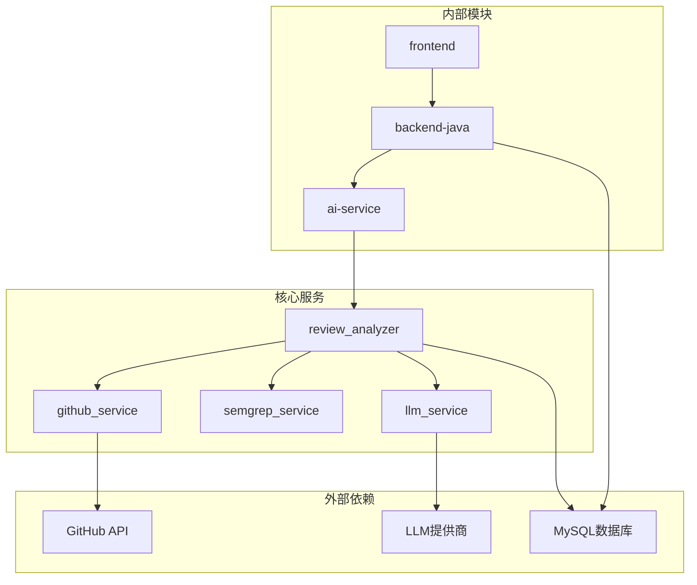

**图表来源**
- [docs/ARCHITECTURE.md:19-52](file://docs/ARCHITECTURE.md#L19-L52)

### 2. 数据模型关系

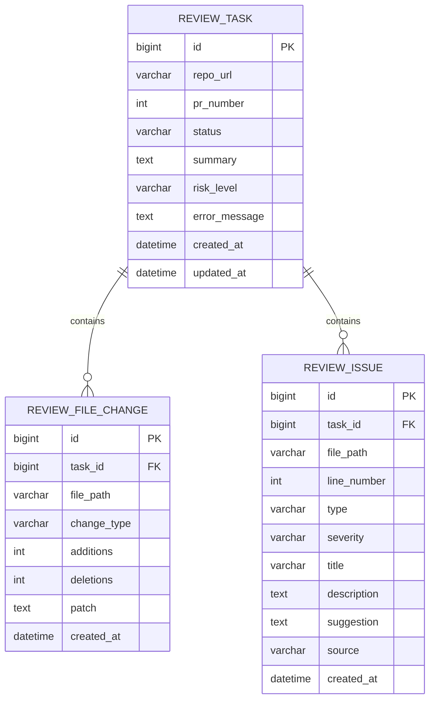

**图表来源**
- [docs/DATABASE.md:22-134](file://docs/DATABASE.md#L22-L134)

### 3. 依赖耦合分析

#### 内聚性评估
- **高内聚**：每个模块专注于单一职责
- **低耦合**：通过明确定义的接口进行通信
- **清晰边界**：模块间依赖关系透明

#### 潜在风险点
- **循环依赖**：当前设计避免了循环依赖
- **紧耦合**：通过接口抽象降低紧耦合风险
- **技术债务**：Mock模式减少技术债务积累

**章节来源**
- [docs/DATABASE.md:22-134](file://docs/DATABASE.md#L22-L134)

## 性能考虑

### 1. 性能优化策略

#### 并发处理
- **异步调用**：AI服务调用支持异步处理
- **连接池**：数据库和HTTP客户端使用连接池
- **缓存机制**：实现多层次缓存策略

#### 资源管理
- **超时控制**：所有外部调用设置合理超时
- **内存优化**：大文件diff处理时的内存管理
- **并发限制**：防止过度并发导致的资源耗尽

### 2. 可扩展性设计

#### 水平扩展
- **无状态设计**：AI服务支持水平扩展
- **负载均衡**：前端和后端服务可部署多实例
- **数据库读写分离**：支持读库扩展

#### 垂直扩展
- **微服务拆分**：未来可进一步拆分为独立服务
- **CDN加速**：静态资源可使用CDN
- **数据库优化**：索引和查询优化

## 故障排除指南

### 1. 错误处理架构

#### 错误分类
- **参数错误**：INVALID_REQUEST
- **任务不存在**：TASK_NOT_FOUND  
- **AI服务错误**：AI_SERVICE_ERROR
- **GitHub获取失败**：GITHUB_FETCH_FAILED
- **数据库错误**：DATABASE_ERROR
- **内部错误**：INTERNAL_ERROR

#### 错误传播机制

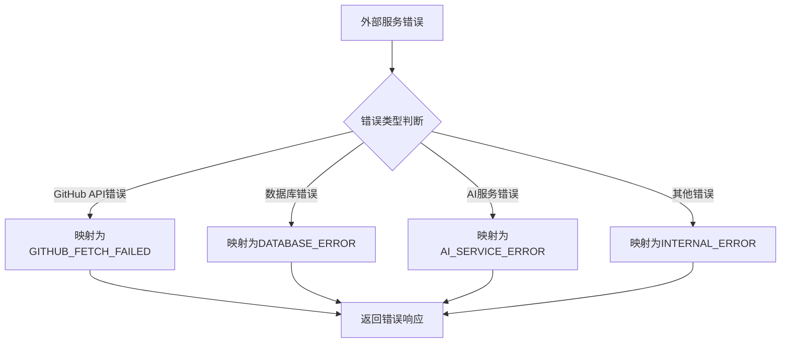

**图表来源**
- [docs/ARCHITECTURE.md:312-342](file://docs/ARCHITECTURE.md#L312-L342)

### 2. 日志记录策略

#### 日志级别
- **DEBUG**：详细的操作日志和调试信息
- **INFO**：关键业务事件和状态变化
- **WARN**：潜在问题和降级处理
- **ERROR**：错误事件和异常情况

#### 日志内容
- **请求ID**：跨服务调用的唯一标识
- **时间戳**：精确到毫秒的时间信息
- **用户代理**：客户端信息和版本
- **IP地址**：请求来源的网络信息

**章节来源**
- [docs/ARCHITECTURE.md:312-342](file://docs/ARCHITECTURE.md#L312-L342)

## 结论

CodeReviewX项目展现了优秀的软件架构设计理念，通过模块化和分层架构实现了清晰的职责分离和良好的可扩展性。项目采用的"文档优先"开发模式确保了架构设计的稳定性和一致性。

### 主要优势

1. **清晰的模块边界**：每个服务都有明确的职责范围
2. **严格的分层设计**：层次分明，便于维护和测试
3. **完善的错误处理**：多层次的错误处理和降级策略
4. **可扩展的架构**：支持未来的功能扩展和技术演进

### 发展建议

1. **持续集成**：建立完善的CI/CD流程
2. **监控告警**：实现全面的系统监控和告警机制
3. **性能优化**：根据实际使用情况进行性能调优
4. **安全加固**：加强系统的安全防护措施

## 附录

### 1. 配置管理

#### 环境变量配置

| 服务 | 关键配置项 | 默认值 | 说明 |
|------|------------|--------|------|
| **backend-java** | SPRING_DATASOURCE_URL | jdbc:mysql://mysql:3306/codereviewx | 数据库连接URL |
|  | SPRING_DATASOURCE_USERNAME | codereviewx | 数据库用户名 |
|  | SPRING_DATASOURCE_PASSWORD | codereviewx | 数据库密码 |
|  | AI_SERVICE_BASE_URL | http://ai-service:8000 | AI服务基础URL |
| **ai-service** | GITHUB_TOKEN | 空 | GitHub访问令牌 |
|  | LLM_PROVIDER | mock | LLM提供商选择 |
|  | LLM_API_KEY | 空 | LLM API密钥 |
|  | SEMGREP_TIMEOUT_SECONDS | 30 | Semgrep超时时间(秒) |
| **frontend** | VITE_API_BASE_URL | http://localhost:8080 | 后端API基础URL |

### 2. API规范

#### 统一响应格式

**成功响应**
```json
{
  "data": { }
}
```

**错误响应**
```json
{
  "code": "ERROR_CODE",
  "message": "Human readable error message",
  "details": null
}
```

#### 错误码定义

| 错误码 | HTTP状态 | 场景描述 |
|--------|----------|----------|
| `INVALID_REQUEST` | 400 | 请求参数错误或校验失败 |
| `TASK_NOT_FOUND` | 404 | 任务不存在 |
| `AI_SERVICE_ERROR` | 502 | ai-service调用失败 |
| `GITHUB_FETCH_FAILED` | 502 | GitHub数据获取失败 |
| `DATABASE_ERROR` | 500 | 数据库操作失败 |
| `INTERNAL_ERROR` | 500 | 未知系统错误 |

### 3. Agent协作流程

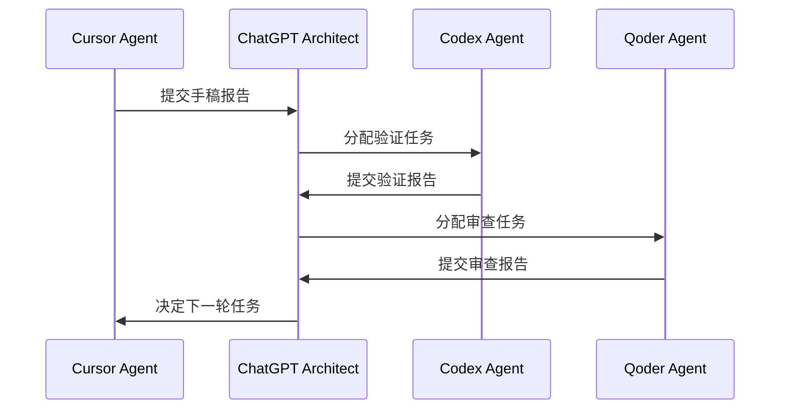

**图表来源**
- [docs/AGENT_RULES.md:35-57](file://docs/AGENT_RULES.md#L35-L57)