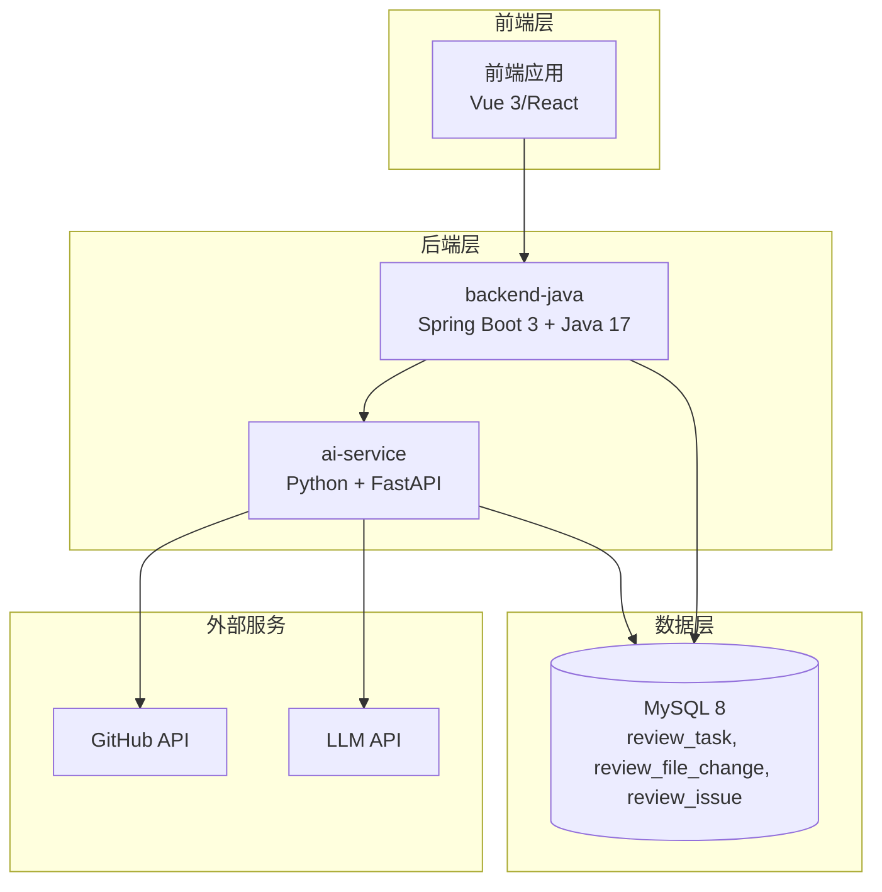
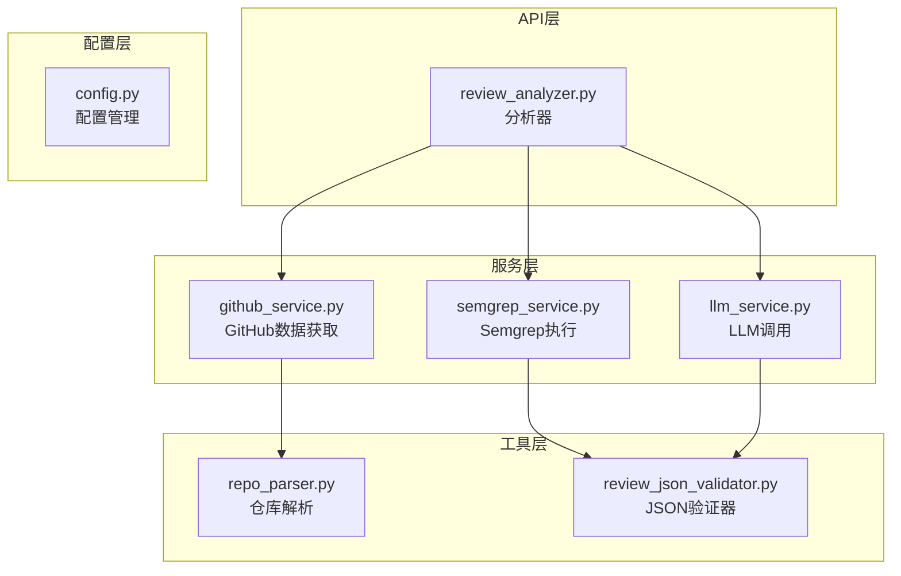
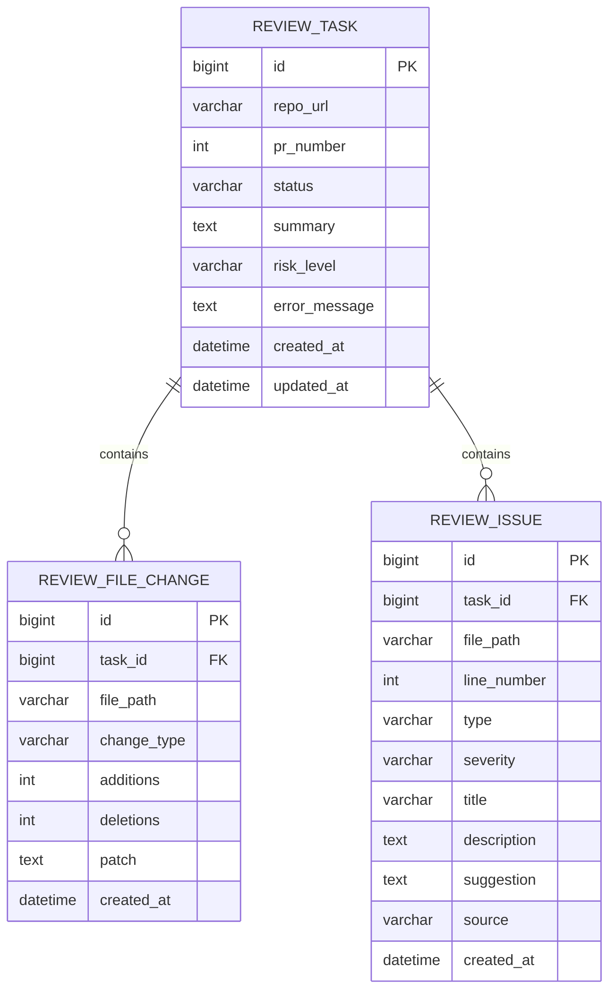
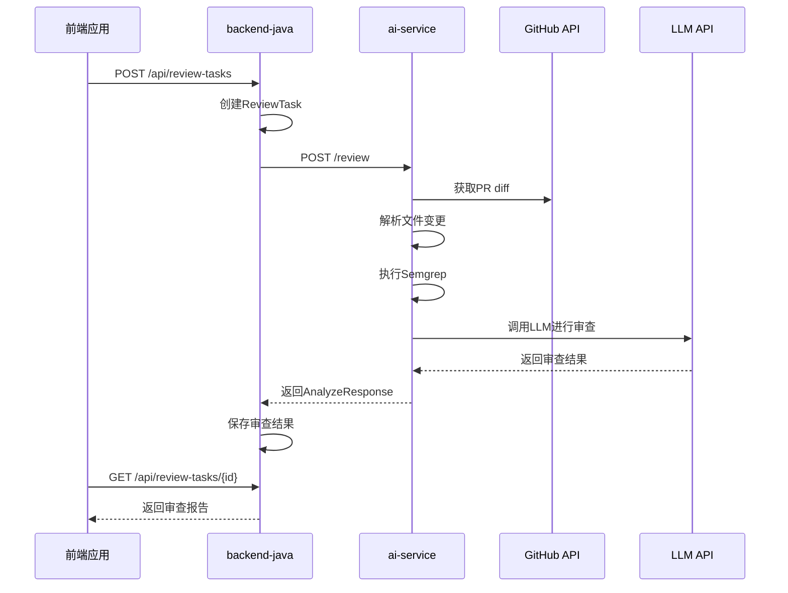
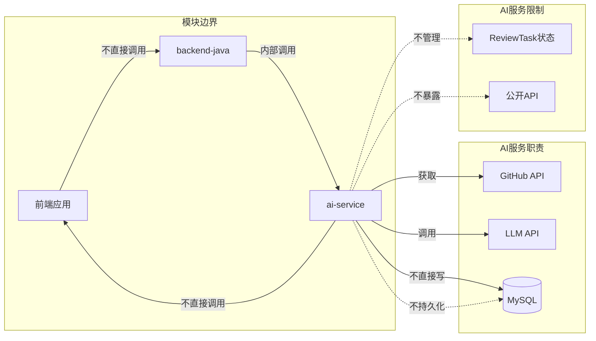
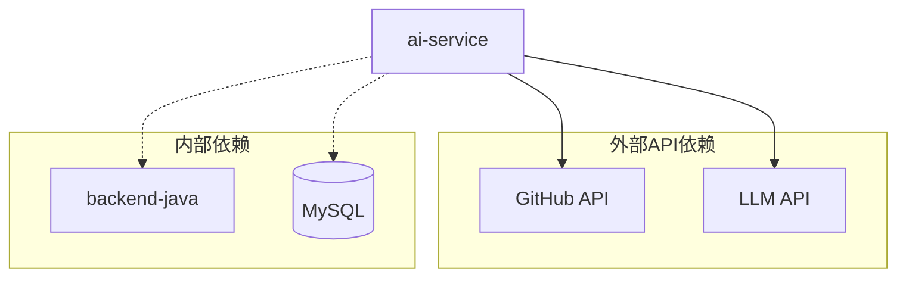
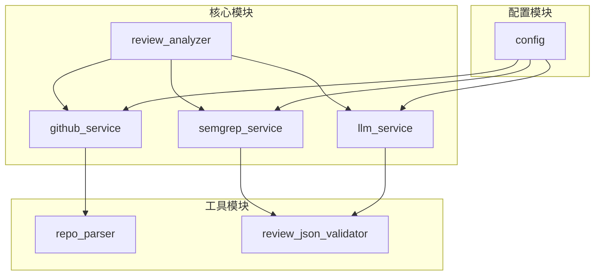
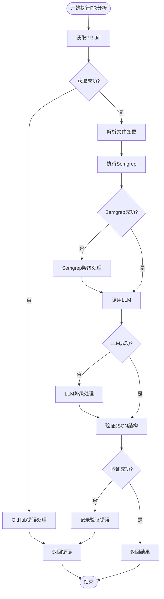

# AI服务API

<cite>
**本文档引用的文件**
- [README.md](file://README.md)
- [docs/API.md](file://docs/API.md)
- [docs/ARCHITECTURE.md](file://docs/ARCHITECTURE.md)
- [docs/DATABASE.md](file://docs/DATABASE.md)
- [docs/PRD.md](file://docs/PRD.md)
- [ai-service/README.md](file://ai-service/README.md)
- [backend-java/README.md](file://backend-java/README.md)
- [docker-compose.yml](file://docker-compose.yml)
- [handoff/round-01/03-qoder-review.md](file://handoff/round-01/03-qoder-review.md)
</cite>

## 目录
1. [简介](#简介)
2. [项目结构](#项目结构)
3. [核心组件](#核心组件)
4. [架构概览](#架构概览)
5. [详细组件分析](#详细组件分析)
6. [依赖关系分析](#依赖关系分析)
7. [性能考虑](#性能考虑)
8. [故障排除指南](#故障排除指南)
9. [结论](#结论)

## 简介

CodeReviewX是一个面向GitHub Pull Request的智能代码审查系统。该系统旨在为后端开发者提供一个专门的内部API接口，用于执行PR分析任务。本文档专注于`/review`端点的详细API规范，该端点仅供`backend-java`内部调用，不对前端或其他外部组件暴露。

该AI服务的核心职责包括：
- 解析GitHub仓库URL并提取owner和repo信息
- 调用GitHub API获取PR diff和变更文件列表
- 标准化文件变更信息
- 执行Semgrep静态分析
- 调用LLM进行代码审查
- 返回结构化的Review JSON响应

## 项目结构

根据项目文档，CodeReviewX采用模块化架构，主要包含四个核心模块：



**图表来源**
- [docs/ARCHITECTURE.md:19-52](file://docs/ARCHITECTURE.md#L19-L52)
- [docs/PRD.md:32-52](file://docs/PRD.md#L32-L52)

**章节来源**
- [README.md:58-82](file://README.md#L58-L82)
- [docs/ARCHITECTURE.md:19-52](file://docs/ARCHITECTURE.md#L19-L52)

## 核心组件

### AI服务架构组件

AI服务采用分层设计，确保职责分离和可维护性：



**图表来源**
- [docs/ARCHITECTURE.md:233-266](file://docs/ARCHITECTURE.md#L233-L266)

### 数据模型组件

系统使用三个核心数据表来存储审查结果：



**图表来源**
- [docs/DATABASE.md:22-134](file://docs/DATABASE.md#L22-L134)

**章节来源**
- [docs/ARCHITECTURE.md:233-266](file://docs/ARCHITECTURE.md#L233-L266)
- [docs/DATABASE.md:22-134](file://docs/DATABASE.md#L22-L134)

## 架构概览

### 系统调用链路

AI服务在整个系统中的位置和调用关系如下：



**图表来源**
- [docs/ARCHITECTURE.md:137-180](file://docs/ARCHITECTURE.md#L137-L180)
- [docs/PRD.md:32-52](file://docs/PRD.md#L32-L52)

### 内部API边界

AI服务的内部API设计严格遵循模块边界原则：



**图表来源**
- [docs/ARCHITECTURE.md:56-107](file://docs/ARCHITECTURE.md#L56-L107)
- [ai-service/README.md:43-46](file://ai-service/README.md#L43-L46)

**章节来源**
- [docs/ARCHITECTURE.md:56-107](file://docs/ARCHITECTURE.md#L56-L107)
- [ai-service/README.md:19-46](file://ai-service/README.md#L19-L46)

## 详细组件分析

### /review 端点详细规范

#### 请求规范

**端点**: `POST /review`

**请求头**:
- `Content-Type: application/json`
- `Accept: application/json`

**请求体参数**:

| 参数名 | 类型 | 必填 | 说明 |
|--------|------|------|------|
| `repoUrl` | string | 是 | GitHub仓库URL，格式：`https://github.com/{owner}/{repo}` |
| `prNumber` | integer | 是 | Pull Request编号，必须为正整数 |

**请求体示例**:
```json
{
  "repoUrl": "https://github.com/owner/repo",
  "prNumber": 12
}
```

**章节来源**
- [docs/API.md:247-262](file://docs/API.md#L247-L262)

#### 响应规范

**成功响应** (`200 OK`):

| 字段名 | 类型 | 说明 |
|--------|------|------|
| `summary` | string | PR审查总结报告 |
| `riskLevel` | string | 风险等级：`LOW` / `MEDIUM` / `HIGH` |
| `files` | array | 变更文件列表 |
| `issues` | array | 审查问题列表 |

**files数组项字段**:

| 字段名 | 类型 | 说明 |
|--------|------|------|
| `filePath` | string | 文件路径 |
| `changeType` | string | 变更类型：`added` / `modified` / `deleted` |
| `additions` | integer | 新增行数 |
| `deletions` | integer | 删除行数 |
| `patch` | string | diff片段（统一使用@@格式） |

**issues数组项字段**:

| 字段名 | 类型 | 说明 |
|--------|------|------|
| `type` | string | 问题类型：`BUG` / `SECURITY` / `PERFORMANCE` / `TEST` / `STYLE` |
| `severity` | string | 严重程度：`LOW` / `MEDIUM` / `HIGH` |
| `filePath` | string | 问题所在文件路径 |
| `line` | integer | 问题行号 |
| `title` | string | 问题标题 |
| `description` | string | 问题描述 |
| `suggestion` | string | 修复建议 |
| `source` | string | 来源：`LLM` / `SEMGREP` |

**成功响应示例**:
```json
{
  "summary": "This PR introduces potential risks in user authentication logic.",
  "riskLevel": "MEDIUM",
  "files": [
    {
      "filePath": "src/main/java/example/UserService.java",
      "changeType": "modified",
      "additions": 20,
      "deletions": 5,
      "patch": "@@ -1,5 +1,10 @@\\n-old line\\n+new line"
    }
  ],
  "issues": [
    {
      "type": "BUG",
      "severity": "MEDIUM",
      "filePath": "src/main/java/example/UserService.java",
      "line": 42,
      "title": "Potential null pointer exception",
      "description": "The variable may be null before use.",
      "suggestion": "Add a null check before accessing the field.",
      "source": "LLM"
    },
    {
      "type": "SECURITY",
      "severity": "HIGH",
      "filePath": "src/main/java/example/AuthController.java",
      "line": 15,
      "title": "Hardcoded secret detected",
      "description": "A hardcoded token was found in the source code.",
      "suggestion": "Move this value to environment variables.",
      "source": "SEMGREP"
    }
  ]
}
```

**章节来源**
- [docs/API.md:247-302](file://docs/API.md#L247-L302)

#### 错误响应规范

**AI服务错误响应格式**:

| 字段名 | 类型 | 说明 |
|--------|------|------|
| `errorCode` | string | 错误码 |
| `message` | string | 错误信息 |
| `recoverable` | boolean | 是否可恢复 |

**AI服务错误码定义**:

| 错误码 | 场景 | HTTP状态码 |
|--------|------|------------|
| `GITHUB_FETCH_FAILED` | GitHub API请求失败 | 502 |
| `PR_NOT_FOUND` | PR不存在 | 404 |
| `SEMGREP_FAILED` | Semgrep执行失败 | 500 |
| `LLM_FAILED` | LLM调用失败 | 500 |
| `INVALID_REQUEST` | 请求参数错误 | 400 |

**错误响应示例**:
```json
{
  "errorCode": "GITHUB_FETCH_FAILED",
  "message": "Failed to fetch pull request: Repository not found or no access",
  "recoverable": false
}
```

**章节来源**
- [docs/API.md:313-332](file://docs/API.md#L313-L332)

### Patch格式规范

AI服务返回的patch格式遵循统一的标准格式：

**Patch格式特点**:
- 使用`@@ -start,length +start,length @@`开头
- 每个diff块包含上下文和变更行
- 新增行以前缀`+`标识，删除行以前缀`-`标识
- 保持原始文件编码和换行符

**Patch示例结构**:
```
@@ -1,5 +1,10 @@
-old line 1
-old line 2
+new line 1
+new line 2
+new line 3
 context line
```

**章节来源**
- [docs/API.md:276](file://docs/API.md#L276)

### 问题类型分类

AI服务支持的问题类型和严重程度分类：

**问题类型** (`IssueType`):
- `BUG`: 潜在逻辑错误或运行时异常
- `SECURITY`: 安全风险，如注入、密钥泄露、未授权访问
- `PERFORMANCE`: 性能问题，如N+1查询、不必要的循环、内存泄露风险
- `TEST`: 测试缺失或测试覆盖不足
- `STYLE`: 代码风格或可读性问题

**严重程度** (`IssueSeverity`):
- `LOW`: 低严重程度
- `MEDIUM`: 中严重程度
- `HIGH`: 高严重程度

**问题来源** (`IssueSource`):
- `LLM`: 由LLM分析生成
- `SEMGREP`: 由Semgrep静态分析生成

**章节来源**
- [docs/PRD.md:104-122](file://docs/PRD.md#L104-L122)
- [docs/API.md:354-378](file://docs/API.md#L354-L378)

## 依赖关系分析

### 外部依赖

AI服务对外部系统的依赖关系：



**图表来源**
- [docs/ARCHITECTURE.md:42-46](file://docs/ARCHITECTURE.md#L42-L46)

### 内部模块依赖

AI服务内部模块间的依赖关系：



**图表来源**
- [docs/ARCHITECTURE.md:233-266](file://docs/ARCHITECTURE.md#L233-L266)

**章节来源**
- [docs/ARCHITECTURE.md:233-266](file://docs/ARCHITECTURE.md#L233-L266)

## 性能考虑

### 超时和重试策略

AI服务在执行过程中需要考虑以下性能因素：

1. **GitHub API超时**: 设置合理的超时时间，避免长时间阻塞
2. **Semgrep执行时间**: 大型仓库可能需要较长时间执行静态分析
3. **LLM调用延迟**: LLM响应时间不稳定，需要考虑缓存和降级策略
4. **数据库写入性能**: 批量插入审查结果时需要注意性能优化

### 错误处理和降级

系统设计了多层错误处理和降级机制：



**图表来源**
- [docs/ARCHITECTURE.md:170-180](file://docs/ARCHITECTURE.md#L170-L180)

## 故障排除指南

### 常见错误和解决方案

**GitHub API错误** (`GITHUB_FETCH_FAILED`):
- 检查GitHub Token配置
- 验证仓库URL格式
- 确认PR编号有效
- 检查网络连接和防火墙设置

**Semgrep执行错误** (`SEMGREP_FAILED`):
- 检查Semgrep配置文件
- 验证仓库权限
- 确认Semgrep版本兼容性
- 查看Semgrep日志输出

**LLM调用错误** (`LLM_FAILED`):
- 检查LLM API密钥配置
- 验证LLM服务可用性
- 确认请求格式符合API要求
- 考虑使用mock模式进行测试

**数据库错误** (`DATABASE_ERROR`):
- 检查数据库连接配置
- 验证表结构和索引
- 确认数据库权限设置
- 查看数据库日志

### 调试建议

1. **启用详细日志**: 在开发环境中启用DEBUG级别日志
2. **使用mock服务**: 在LLM集成前使用mock服务进行测试
3. **监控资源使用**: 监控CPU、内存和磁盘使用情况
4. **性能基准测试**: 对关键路径进行性能基准测试

**章节来源**
- [docs/ARCHITECTURE.md:170-180](file://docs/ARCHITECTURE.md#L170-L180)

## 结论

CodeReviewX的AI服务API设计遵循了清晰的模块边界和职责分离原则。通过`/review`端点，`backend-java`可以可靠地调用AI服务进行PR分析，获得结构化的审查报告。

关键设计要点包括：
- **严格的内部API边界**: AI服务不对任何外部组件暴露
- **标准化的数据格式**: 统一的请求和响应格式
- **完善的错误处理**: 多层次的错误处理和降级机制
- **清晰的模块职责**: 各模块职责明确，避免交叉耦合

对于后端开发者，建议重点关注以下方面：
1. 正确处理AI服务的错误响应和降级策略
2. 确保请求参数的完整性和有效性
3. 合理处理返回的结构化数据
4. 实现适当的超时和重试机制

该API设计为CodeReviewX系统的后续开发奠定了坚实的基础，确保了系统的可扩展性和可维护性。