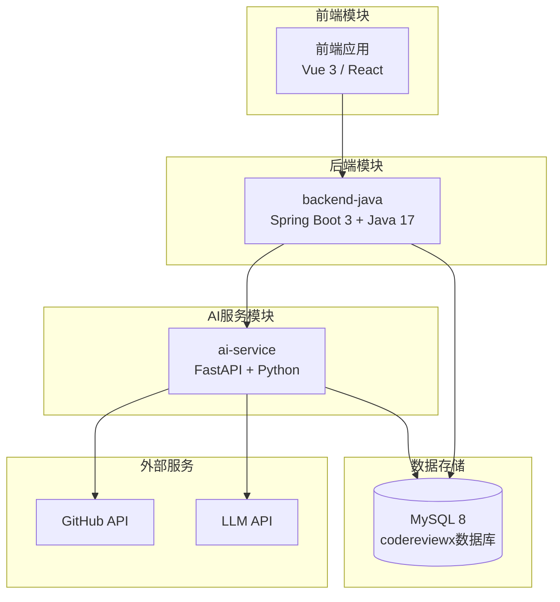
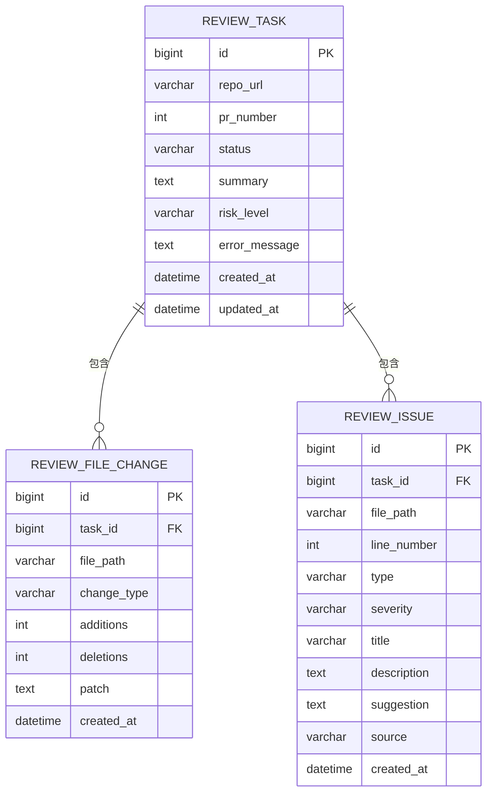
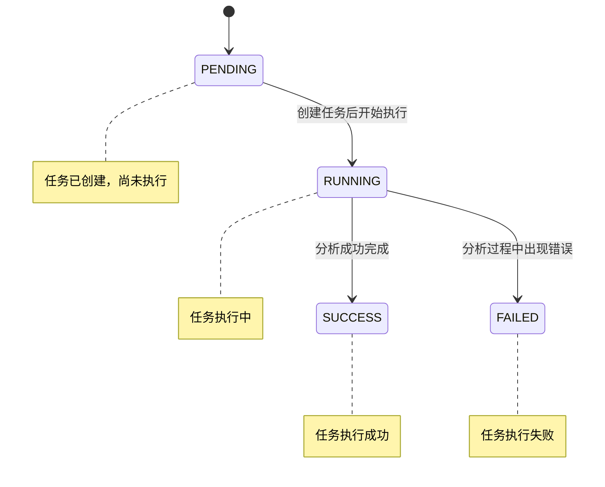
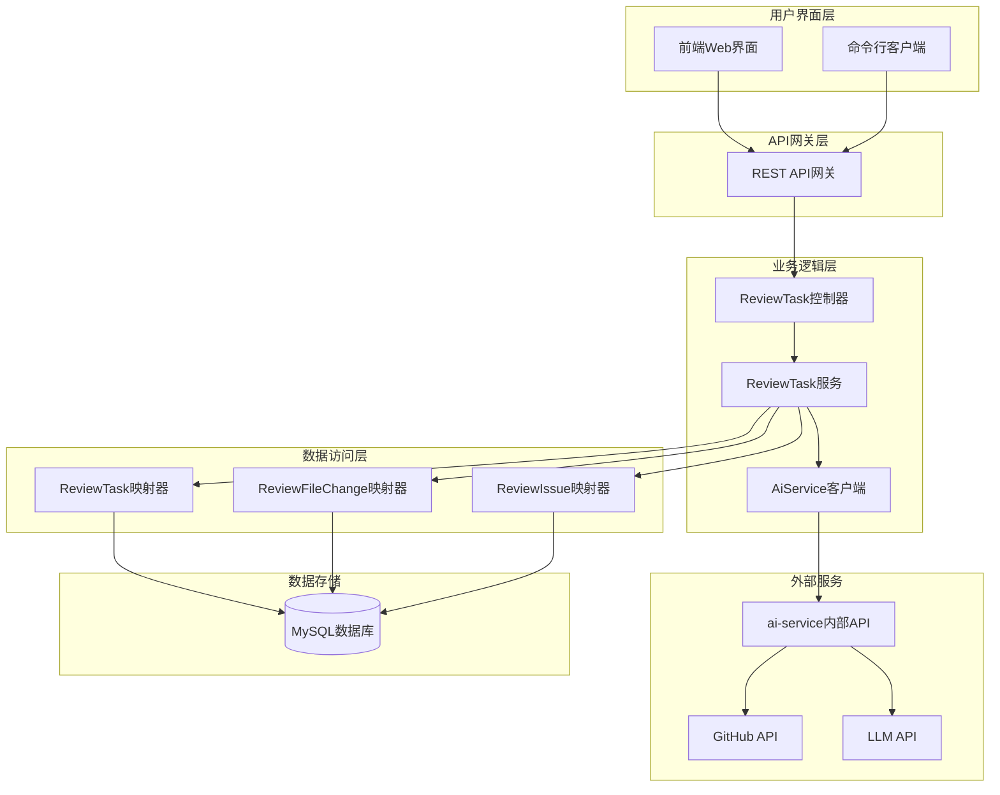
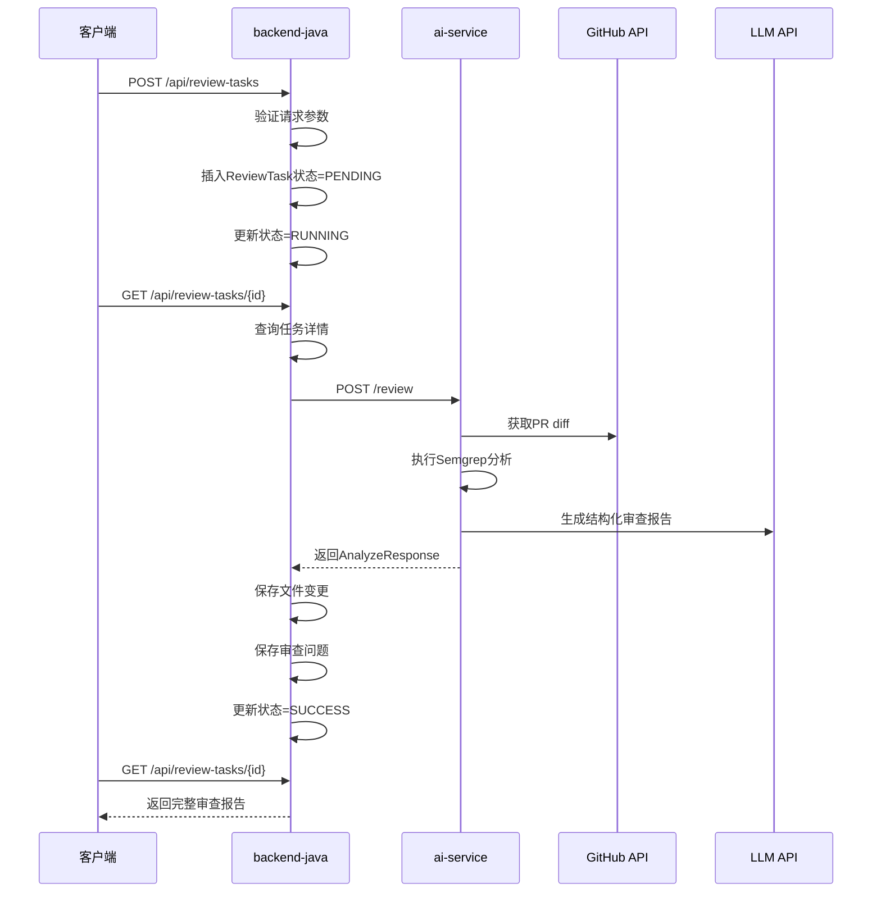
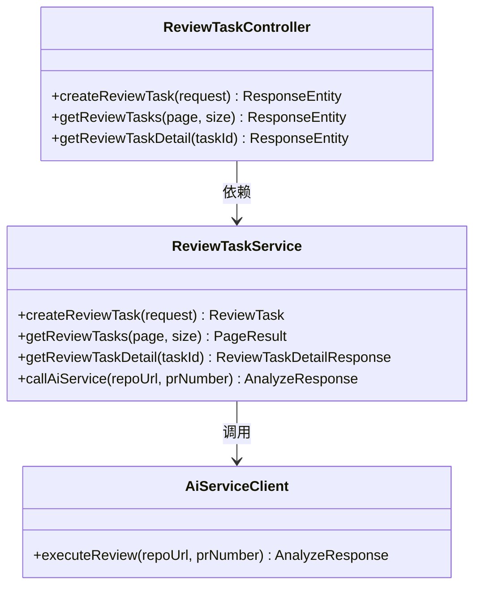
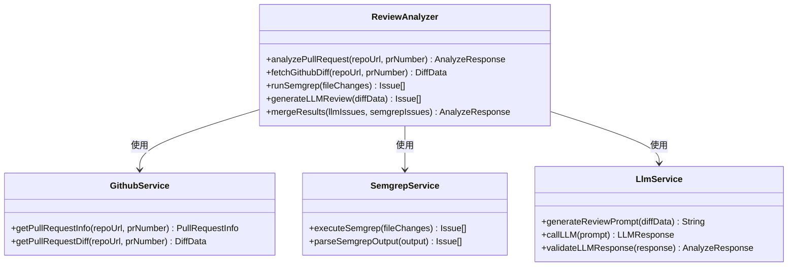

# API参考文档

<cite>
**本文档引用的文件**
- [README.md](file://README.md)
- [docs/API.md](file://docs/API.md)
- [docs/ARCHITECTURE.md](file://docs/ARCHITECTURE.md)
- [docs/DATABASE.md](file://docs/DATABASE.md)
- [docs/PRD.md](file://docs/PRD.md)
- [docker-compose.yml](file://docker-compose.yml)
- [frontend/README.md](file://frontend/README.md)
- [docs/AGENT_RULES.md](file://docs/AGENT_RULES.md)
</cite>

## 目录
1. [简介](#简介)
2. [项目结构](#项目结构)
3. [核心组件](#核心组件)
4. [架构概览](#架构概览)
5. [详细组件分析](#详细组件分析)
6. [API规范](#api规范)
7. [错误处理](#错误处理)
8. [安全考虑](#安全考虑)
9. [版本管理](#版本管理)
10. [客户端SDK使用指南](#客户端sdk使用指南)
11. [集成最佳实践](#集成最佳实践)
12. [故障排除指南](#故障排除指南)
13. [结论](#结论)

## 简介

CodeReviewX是一个面向GitHub Pull Request的智能代码审查系统。该系统能够自动获取PR diff，结合静态分析工具和LLM生成结构化的代码审查报告，帮助开发者发现潜在Bug、安全风险、性能问题和测试缺失问题，并提供修复建议。

### 系统特性

- **智能代码审查**：结合静态分析和LLM技术
- **多维度风险评估**：涵盖Bug、安全、性能、测试、代码风格等多个方面
- **结构化报告**：提供详细的审查总结和问题列表
- **可视化展示**：通过Web界面清晰展示审查结果
- **模块化架构**：前后端分离，服务职责明确

**章节来源**
- [README.md:29-44](file://README.md#L29-L44)
- [docs/PRD.md:32-52](file://docs/PRD.md#L32-L52)

## 项目结构

CodeReviewX采用模块化架构设计，主要包含四个核心模块：



**图表来源**
- [docs/ARCHITECTURE.md:19-52](file://docs/ARCHITECTURE.md#L19-L52)
- [docs/ARCHITECTURE.md:373-381](file://docs/ARCHITECTURE.md#L373-L381)

### 模块职责

| 模块 | 技术栈 | 核心职责 |
|------|--------|----------|
| `backend-java` | Spring Boot 3 + Java 17 | REST API、任务生命周期管理、MySQL持久化、调用ai-service |
| `ai-service` | Python + FastAPI | GitHub diff获取、Semgrep执行、LLM审查、结构化JSON输出 |
| `frontend` | Vue 3 / React | 任务创建表单、任务列表、任务详情和审查报告展示 |
| `mysql` | MySQL 8 | 任务、文件变更和审查问题的持久化存储 |

**章节来源**
- [README.md:49-54](file://README.md#L49-L54)
- [docs/ARCHITECTURE.md:56-107](file://docs/ARCHITECTURE.md#L56-L107)

## 核心组件

### ReviewTask实体

ReviewTask是系统的核心实体，代表一次代码审查任务的完整生命周期。



**图表来源**
- [docs/DATABASE.md:22-134](file://docs/DATABASE.md#L22-L134)

### 状态流转

ReviewTask在整个生命周期内遵循严格的状态转换规则：



**图表来源**
- [docs/ARCHITECTURE.md:110-134](file://docs/ARCHITECTURE.md#L110-L134)

**章节来源**
- [docs/DATABASE.md:22-56](file://docs/DATABASE.md#L22-L56)
- [docs/ARCHITECTURE.md:110-134](file://docs/ARCHITECTURE.md#L110-L134)

## 架构概览

### 整体架构设计



**图表来源**
- [docs/ARCHITECTURE.md:183-266](file://docs/ARCHITECTURE.md#L183-L266)

### 调用链路

系统的核心调用链路如下：



**图表来源**
- [docs/ARCHITECTURE.md:137-180](file://docs/ARCHITECTURE.md#L137-L180)

**章节来源**
- [docs/ARCHITECTURE.md:17-16](file://docs/ARCHITECTURE.md#L17-L16)

## 详细组件分析

### 后端Java组件

#### ReviewTaskController

ReviewTaskController负责处理所有与ReviewTask相关的HTTP请求。



**图表来源**
- [docs/ARCHITECTURE.md:188-219](file://docs/ARCHITECTURE.md#L188-L219)

#### ReviewTaskService

ReviewTaskService实现了完整的业务逻辑，包括任务创建、状态管理和与ai-service的交互。

**章节来源**
- [docs/ARCHITECTURE.md:188-219](file://docs/ARCHITECTURE.md#L188-L219)

### AI服务组件

#### ReviewAnalyzer

ReviewAnalyzer是ai-service的核心组件，负责协调整个分析流程。



**图表来源**
- [docs/ARCHITECTURE.md:245-255](file://docs/ARCHITECTURE.md#L245-L255)

**章节来源**
- [docs/ARCHITECTURE.md:233-266](file://docs/ARCHITECTURE.md#L233-L266)

## API规范

### 通用规范

#### 基础URL配置

| 环境 | backend-java | ai-service |
|------|-------------|-----------|
| 本地开发 | `http://localhost:8080` | `http://localhost:8000` |
| Docker Compose | `http://backend-java:8080` | `http://ai-service:8000` |

#### 请求格式

- Content-Type: `application/json`
- 字符集: UTF-8

#### 统一响应格式

**成功响应格式：**
```json
{
  "data": { }
}
```

**错误响应格式：**
```json
{
  "code": "ERROR_CODE",
  "message": "人类可读的错误信息",
  "details": null
}
```

**章节来源**
- [docs/API.md:11-39](file://docs/API.md#L11-L39)

### 后端Java API

#### 创建Review任务

**HTTP方法和URL：**
```http
POST /api/review-tasks
```

**请求参数：**

| 字段 | 类型 | 必填 | 说明 |
|------|------|------|------|
| `repoUrl` | string | 是 | GitHub仓库地址，格式：`https://github.com/{owner}/{repo}` |
| `prNumber` | integer | 是 | Pull Request编号，必须为正整数 |

**请求示例：**
```json
{
  "repoUrl": "https://github.com/example/repo",
  "prNumber": 123
}
```

**响应格式：**
```json
{
  "taskId": 1,
  "status": "PENDING"
}
```

**响应字段说明：**

| 字段 | 类型 | 说明 |
|------|------|------|
| `taskId` | long | 任务ID |
| `status` | string | 任务状态，始终为`PENDING` |

**错误响应示例：**
```json
{
  "code": "INVALID_REQUEST",
  "message": "repoUrl必须是有效的GitHub URL",
  "details": null
}
```

**章节来源**
- [docs/API.md:56-95](file://docs/API.md#L56-L95)

#### 查询任务列表

**HTTP方法和URL：**
```http
GET /api/review-tasks
```

**查询参数：**

| 参数 | 类型 | 说明 |
|------|------|------|
| `page` | integer | 页码，从0开始，默认0 |
| `size` | integer | 每页数量，默认20 |

**响应格式：**
```json
{
  "items": [
    {
      "taskId": 1,
      "repoUrl": "https://github.com/example/repo",
      "prNumber": 123,
      "status": "SUCCESS",
      "riskLevel": "MEDIUM",
      "createdAt": "2026-06-19T10:00:00"
    }
  ],
  "total": 1
}
```

**响应字段说明：**

| 字段 | 类型 | 说明 |
|------|------|------|
| `items` | array | 任务列表 |
| `total` | integer | 总任务数 |

**items字段说明：**

| 字段 | 类型 | 说明 |
|------|------|------|
| `taskId` | long | 任务ID |
| `repoUrl` | string | GitHub仓库地址 |
| `prNumber` | integer | PR编号 |
| `status` | string | `PENDING` / `RUNNING` / `SUCCESS` / `FAILED` |
| `riskLevel` | string | `LOW` / `MEDIUM` / `HIGH` / null（未完成时） |
| `createdAt` | string | ISO 8601格式时间 |

**章节来源**
- [docs/API.md:99-142](file://docs/API.md#L99-L142)

#### 查询任务详情

**HTTP方法和URL：**
```http
GET /api/review-tasks/{id}
```

**路径参数：**

| 参数 | 类型 | 说明 |
|------|------|------|
| `id` | long | 任务ID |

**响应格式：**
```json
{
  "taskId": 1,
  "repoUrl": "https://github.com/example/repo",
  "prNumber": 123,
  "status": "SUCCESS",
  "summary": "这个PR包含几个中等风险问题。",
  "riskLevel": "MEDIUM",
  "errorMessage": null,
  "createdAt": "2026-06-19T10:00:00",
  "updatedAt": "2026-06-19T10:01:30",
  "files": [
    {
      "filePath": "src/main/java/example/UserService.java",
      "changeType": "modified",
      "additions": 20,
      "deletions": 5
    }
  ],
  "issues": [
    {
      "type": "BUG",
      "severity": "MEDIUM",
      "filePath": "src/main/java/example/UserService.java",
      "line": 42,
      "title": "潜在的空指针异常",
      "description": "变量在使用前可能为空。",
      "suggestion": "在访问字段前添加空值检查。",
      "source": "LLM"
    }
  ]
}
```

**响应字段说明：**

| 字段 | 类型 | 说明 |
|------|------|------|
| `taskId` | long | 任务ID |
| `repoUrl` | string | GitHub仓库地址 |
| `prNumber` | integer | PR编号 |
| `status` | string | 任务状态 |
| `summary` | string | Review总结（任务成功后填充） |
| `riskLevel` | string | 风险等级（任务成功后填充） |
| `errorMessage` | string | 失败原因（FAILED状态时填充） |
| `files` | array | 变更文件列表 |
| `issues` | array | Review问题列表 |

**files项字段：**

| 字段 | 类型 | 说明 |
|------|------|------|
| `filePath` | string | 文件路径 |
| `changeType` | string | `added` / `modified` / `deleted` |
| `additions` | integer | 新增行数 |
| `deletions` | integer | 删除行数 |

**issues项字段：**

| 字段 | 类型 | 说明 |
|------|------|------|
| `type` | string | `BUG` / `SECURITY` / `PERFORMANCE` / `TEST` / `STYLE` |
| `severity` | string | `LOW` / `MEDIUM` / `HIGH` |
| `filePath` | string | 问题所在文件路径 |
| `line` | integer | 问题行号 |
| `title` | string | 问题标题 |
| `description` | string | 问题描述 |
| `suggestion` | string | 修复建议 |
| `source` | string | `LLM` / `SEMGREP` |

**错误响应（任务不存在）：**
```json
{
  "code": "TASK_NOT_FOUND",
  "message": "找不到ID为999的Review任务",
  "details": null
}
```

**章节来源**
- [docs/API.md:145-240](file://docs/API.md#L145-L240)

### AI服务API

#### 执行PR分析

**HTTP方法和URL：**
```http
POST /review
```

**请求体：**
```json
{
  "repoUrl": "https://github.com/example/repo",
  "prNumber": 123
}
```

**响应格式：**
```json
{
  "summary": "这个PR在用户认证逻辑中引入了潜在风险。",
  "riskLevel": "MEDIUM",
  "files": [
    {
      "filePath": "src/main/java/example/UserService.java",
      "changeType": "modified",
      "additions": 20,
      "deletions": 5,
      "patch": "@@ -1,5 +1,10 @@\\n-old line\\n+new line"
    }
  ],
  "issues": [
    {
      "type": "BUG",
      "severity": "MEDIUM",
      "filePath": "src/main/java/example/UserService.java",
      "line": 42,
      "title": "潜在的空指针异常",
      "description": "变量在使用前可能为空。",
      "suggestion": "在访问字段前添加空值检查。",
      "source": "LLM"
    },
    {
      "type": "SECURITY",
      "severity": "HIGH",
      "filePath": "src/main/java/example/AuthController.java",
      "line": 15,
      "title": "检测到硬编码密钥",
      "description": "在源代码中发现了硬编码的令牌。",
      "suggestion": "将此值移动到环境变量中。",
      "source": "SEMGREP"
    }
  ]
}
```

**响应字段说明：**

| 字段 | 类型 | 说明 |
|------|------|------|
| `summary` | string | Review总结 |
| `riskLevel` | string | `LOW` / `MEDIUM` / `HIGH` |
| `files` | array | PR变更文件列表（含patch） |
| `issues` | array | 所有Review问题（合并LLM+Semgrep） |

**错误响应（GitHub拉取失败）：**
```json
{
  "errorCode": "GITHUB_FETCH_FAILED",
  "message": "获取Pull Request失败：仓库不存在或无访问权限",
  "recoverable": false
}
```

**章节来源**
- [docs/API.md:243-332](file://docs/API.md#L243-L332)

## 错误处理

### 错误码定义

#### 后端Java错误码

| 错误码 | HTTP状态 | 场景 |
|--------|----------|------|
| `INVALID_REQUEST` | 400 | 请求参数错误或校验失败 |
| `TASK_NOT_FOUND` | 404 | 任务不存在 |
| `AI_SERVICE_ERROR` | 502 | ai-service调用失败 |
| `GITHUB_FETCH_FAILED` | 502 | GitHub数据获取失败 |
| `DATABASE_ERROR` | 500 | 数据库操作失败 |
| `INTERNAL_ERROR` | 500 | 未知系统错误 |

#### AI服务错误码

| 错误码 | 场景 |
|--------|------|
| `GITHUB_FETCH_FAILED` | GitHub API请求失败 |
| `PR_NOT_FOUND` | PR不存在 |
| `SEMGREP_FAILED` | Semgrep执行失败（通常降级处理） |
| `LLM_FAILED` | LLM调用失败（通常降级为mock） |
| `INVALID_REQUEST` | 请求参数错误 |

### 错误响应格式

#### 统一错误响应

```json
{
  "code": "ERROR_CODE",
  "message": "人类可读的错误信息",
  "details": null
}
```

#### AI服务错误响应

```json
{
  "errorCode": "GITHUB_FETCH_FAILED",
  "message": "获取Pull Request失败",
  "recoverable": false
}
```

**章节来源**
- [docs/API.md:41-51](file://docs/API.md#L41-L51)
- [docs/ARCHITECTURE.md:312-341](file://docs/ARCHITECTURE.md#L312-L341)

## 安全考虑

### 认证机制

根据项目设计，MVP阶段不引入复杂的认证机制。系统采用以下安全策略：

1. **无用户系统**：第一阶段不包含登录注册功能
2. **开放API**：前端直接调用后端API，无需中间认证层
3. **环境隔离**：通过Docker Compose实现服务间的网络隔离

### 权限控制

由于系统设计为简单的代码审查工具，权限控制相对简单：

- **前端权限**：仅能访问后端提供的公共API
- **后端权限**：仅能调用预定义的ai-service内部API
- **数据库权限**：通过连接字符串控制访问权限

### 安全最佳实践

#### 环境变量管理

```env
# backend-java配置
SPRING_DATASOURCE_URL=jdbc:mysql://mysql:3306/codereviewx
SPRING_DATASOURCE_USERNAME=codereviewx
SPRING_DATASOURCE_PASSWORD=codereviewx
AI_SERVICE_BASE_URL=http://ai-service:8000

# ai-service配置
GITHUB_TOKEN=
LLM_PROVIDER=mock
LLM_API_KEY=
SEMGREP_TIMEOUT_SECONDS=30

# frontend配置
VITE_API_BASE_URL=http://localhost:8080
```

#### 安全规则

1. **凭据保护**：GitHub Token和LLM API Key不得硬编码在源文件中
2. **日志安全**：日志输出不得包含完整令牌或API密钥
3. **文件保护**：`.env`文件不得提交到版本控制系统
4. **代码安全**：代码注释中不得包含任何凭据信息

**章节来源**
- [docs/AGENT_RULES.md:152-160](file://docs/AGENT_RULES.md#L152-L160)
- [docs/ARCHITECTURE.md:345-369](file://docs/ARCHITECTURE.md#L345-L369)

## 版本管理

### API版本策略

根据项目现状，当前为v1.0版本，采用以下版本管理策略：

1. **语义化版本控制**：遵循`主版本.次版本.修订号`格式
2. **向后兼容性**：新版本保持现有API的向后兼容
3. **弃用策略**：重大变更前提供弃用通知和迁移指南

### 迁移指南

#### v0.x到v1.0迁移

由于当前为v1.0版本，暂无历史版本需要迁移。

### 兼容性保证

1. **请求格式兼容**：保持JSON请求格式不变
2. **响应格式兼容**：统一的响应包装结构保持不变
3. **错误码兼容**：核心错误码保持稳定
4. **URL结构兼容**：API端点结构保持不变

## 客户端SDK使用指南

### 前端集成

#### 基础配置

```javascript
// VITE_API_BASE_URL环境变量配置
const API_BASE_URL = import.meta.env.VITE_API_BASE_URL || 'http://localhost:8080';

// API客户端配置
const apiClient = {
  baseUrl: API_BASE_URL,
  headers: {
    'Content-Type': 'application/json',
    'Accept': 'application/json'
  }
};
```

#### 任务创建

```javascript
// 创建Review任务
async function createReviewTask(repoUrl, prNumber) {
  const response = await fetch(`${apiClient.baseUrl}/api/review-tasks`, {
    method: 'POST',
    headers: apiClient.headers,
    body: JSON.stringify({ repoUrl, prNumber })
  });
  
  if (!response.ok) {
    throw new Error(`HTTP error! status: ${response.status}`);
  }
  
  return response.json();
}
```

#### 任务查询

```javascript
// 查询任务列表
async function getReviewTasks(page = 0, size = 20) {
  const response = await fetch(
    `${apiClient.baseUrl}/api/review-tasks?page=${page}&size=${size}`
  );
  
  if (!response.ok) {
    throw new Error(`HTTP error! status: ${response.status}`);
  }
  
  return response.json();
}
```

#### 任务详情

```javascript
// 获取任务详情
async function getReviewTaskDetail(taskId) {
  const response = await fetch(
    `${apiClient.baseUrl}/api/review-tasks/${taskId}`
  );
  
  if (!response.ok) {
    throw new Error(`HTTP error! status: ${response.status}`);
  }
  
  return response.json();
}
```

### SDK设计模式

#### Promise模式

```javascript
class CodeReviewXClient {
  constructor(baseUrl) {
    this.baseUrl = baseUrl;
  }
  
  async createTask(repoUrl, prNumber) {
    // 实现任务创建逻辑
  }
  
  async getTasks(page, size) {
    // 实现任务查询逻辑
  }
  
  async getTaskDetail(taskId) {
    // 实现任务详情查询逻辑
  }
}
```

#### 错误处理模式

```javascript
class CodeReviewXError extends Error {
  constructor(code, message, details) {
    super(message);
    this.code = code;
    this.details = details;
  }
}

// 使用示例
try {
  const result = await client.createTask(repoUrl, prNumber);
} catch (error) {
  if (error instanceof CodeReviewXError) {
    console.error(`错误码: ${error.code}`);
    console.error(`错误信息: ${error.message}`);
  }
}
```

**章节来源**
- [frontend/README.md:52-61](file://frontend/README.md#L52-L61)

## 集成最佳实践

### 前端集成

#### 状态管理

```javascript
// Vuex/Pinia状态管理示例
const useReviewStore = defineStore('review', {
  state: () => ({
    tasks: [],
    loading: false,
    error: null
  }),
  
  actions: {
    async createTask(repoUrl, prNumber) {
      this.loading = true;
      this.error = null;
      
      try {
        const response = await createReviewTask(repoUrl, prNumber);
        this.tasks.unshift(response);
        return response;
      } catch (error) {
        this.error = error;
        throw error;
      } finally {
        this.loading = false;
      }
    }
  }
});
```

#### 错误处理

```javascript
// 统一错误处理
function handleApiError(error) {
  if (error.code === 'INVALID_REQUEST') {
    return '请输入有效的GitHub仓库地址和PR编号';
  }
  
  if (error.code === 'TASK_NOT_FOUND') {
    return '任务不存在，请检查任务ID';
  }
  
  if (error.code === 'GITHUB_FETCH_FAILED') {
    return '无法获取GitHub数据，请检查仓库权限';
  }
  
  return '系统错误，请稍后重试';
}
```

### 后端集成

#### Spring Boot配置

```java
@Configuration
public class ApiConfig {
    
    @Value("${api.base-url:http://localhost:8080}")
    private String apiBaseUrl;
    
    @Bean
    public WebClient webClient() {
        return WebClient.builder()
            .baseUrl(apiBaseUrl)
            .build();
    }
}
```

#### 异常处理

```java
@RestControllerAdvice
public class GlobalExceptionHandler {
    
    @ExceptionHandler(CodeReviewXException.class)
    public ResponseEntity<ErrorResponse> handleBusinessException(
            CodeReviewXException ex) {
        ErrorResponse error = new ErrorResponse();
        error.setCode(ex.getCode());
        error.setMessage(ex.getMessage());
        error.setDetails(ex.getDetails());
        
        return ResponseEntity.status(ex.getStatus()).body(error);
    }
}
```

### CI/CD集成

#### GitHub Actions配置

```yaml
name: CodeReviewX CI

on:
  push:
    branches: [ main ]
  pull_request:
    branches: [ main ]

jobs:
  test:
    runs-on: ubuntu-latest
    
    steps:
    - uses: actions/checkout@v3
    
    - name: Set up JDK
      uses: actions/setup-java@v3
      with:
        java-version: '17'
        distribution: 'temurin'
    
    - name: Run tests
      run: ./gradlew test
```

## 故障排除指南

### 常见问题诊断

#### 任务状态异常

**问题现象：** 任务长时间处于PENDING或RUNNING状态

**诊断步骤：**
1. 检查ai-service服务是否正常运行
2. 验证GitHub API访问权限
3. 检查数据库连接状态
4. 查看后端日志中的错误信息

**解决方案：**
```bash
# 检查服务状态
docker-compose ps

# 查看后端日志
docker-compose logs backend-java

# 查看AI服务日志
docker-compose logs ai-service
```

#### API调用失败

**问题现象：** 前端无法调用后端API

**诊断步骤：**
1. 验证API基础URL配置
2. 检查网络连通性
3. 确认防火墙设置
4. 验证Docker容器端口映射

**解决方案：**
```bash
# 测试API可达性
curl -I http://localhost:8080/api/review-tasks

# 检查端口占用
netstat -tulpn | grep 8080

# 重启服务
docker-compose restart backend-java
```

#### 数据库连接问题

**问题现象：** 任务创建后无法查询到结果

**诊断步骤：**
1. 检查MySQL服务状态
2. 验证数据库连接字符串
3. 确认数据库权限设置
4. 查看数据库日志

**解决方案：**
```bash
# 检查数据库状态
docker-compose exec mysql mysqladmin ping

# 连接数据库
docker-compose exec mysql mysql -u codereviewx -p

# 查看表结构
SHOW TABLES;
DESCRIBE review_task;
```

### 性能优化

#### 并发处理

```java
// 使用异步处理提高并发性能
@Async
public CompletableFuture<AnalyzeResponse> asyncCallAiService(
        String repoUrl, int prNumber) {
    return aiServiceClient.executeReview(repoUrl, prNumber);
}
```

#### 缓存策略

```java
// 实现结果缓存减少重复计算
@Cacheable(value = "reviewResults", key = "#taskId")
public ReviewTaskDetailResponse getCachedTaskDetail(long taskId) {
    return reviewTaskService.getReviewTaskDetail(taskId);
}
```

### 监控和日志

#### 日志配置

```yaml
logging:
  level:
    com.codereviewx: DEBUG
    org.springframework.web: DEBUG
  file:
    name: app.log
    max-size: 10MB
    max-history: 30
```

#### 健康检查

```java
@RestController
public class HealthController {
    
    @GetMapping("/health")
    public ResponseEntity<Map<String, String>> health() {
        Map<String, String> status = new HashMap<>();
        status.put("status", "healthy");
        status.put("timestamp", Instant.now().toString());
        return ResponseEntity.ok(status);
    }
}
```

**章节来源**
- [docs/ARCHITECTURE.md:170-180](file://docs/ARCHITECTURE.md#L170-L180)

## 结论

CodeReviewX系统提供了完整的REST API接口，支持从GitHub PR到结构化代码审查报告的全流程自动化。系统采用模块化设计，前后端分离，职责明确，具有良好的扩展性和维护性。

### 系统优势

1. **清晰的API设计**：统一的响应格式和错误处理机制
2. **完善的文档**：详细的API规范和使用示例
3. **灵活的集成**：支持多种客户端SDK和集成方式
4. **安全可靠**：遵循安全最佳实践，保护敏感信息
5. **易于部署**：通过Docker Compose实现一键部署

### 发展规划

随着项目的演进，CodeReviewX将继续完善以下方面：

1. **增强的AI能力**：集成更多LLM模型和分析工具
2. **丰富的API功能**：支持更多的代码审查场景
3. **完善的监控体系**：提供更全面的系统监控和日志分析
4. **扩展的客户端支持**：提供更多语言的SDK和集成工具
5. **企业级功能**：支持团队协作和权限管理

通过持续的迭代和改进，CodeReviewX将成为一个功能完备、易于使用的智能代码审查平台，为开发者提供高质量的代码质量保障。