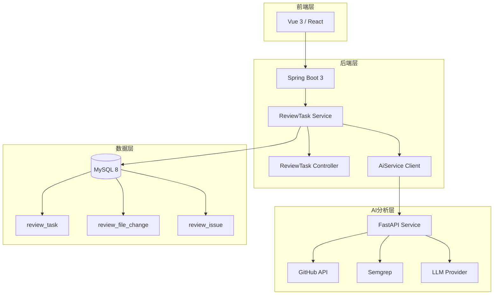
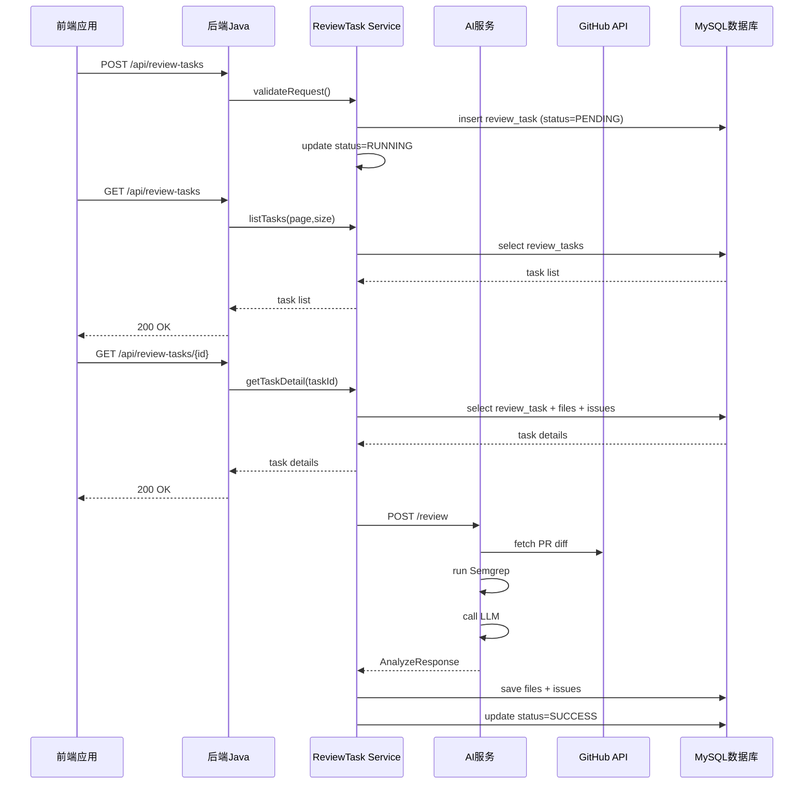
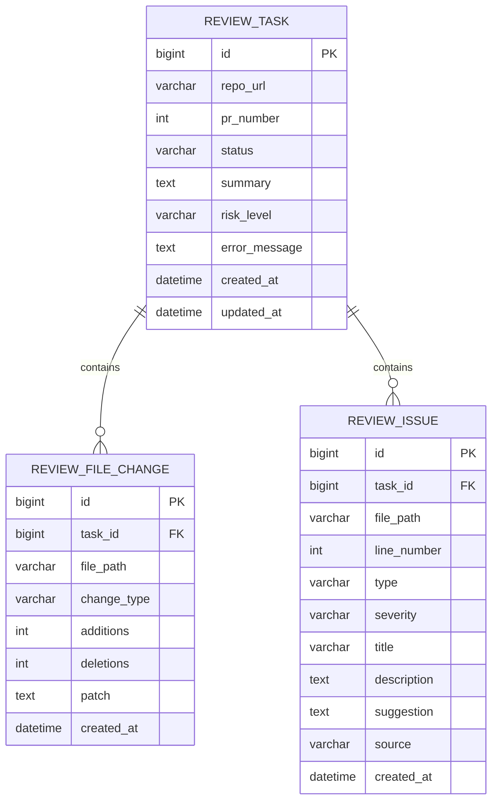
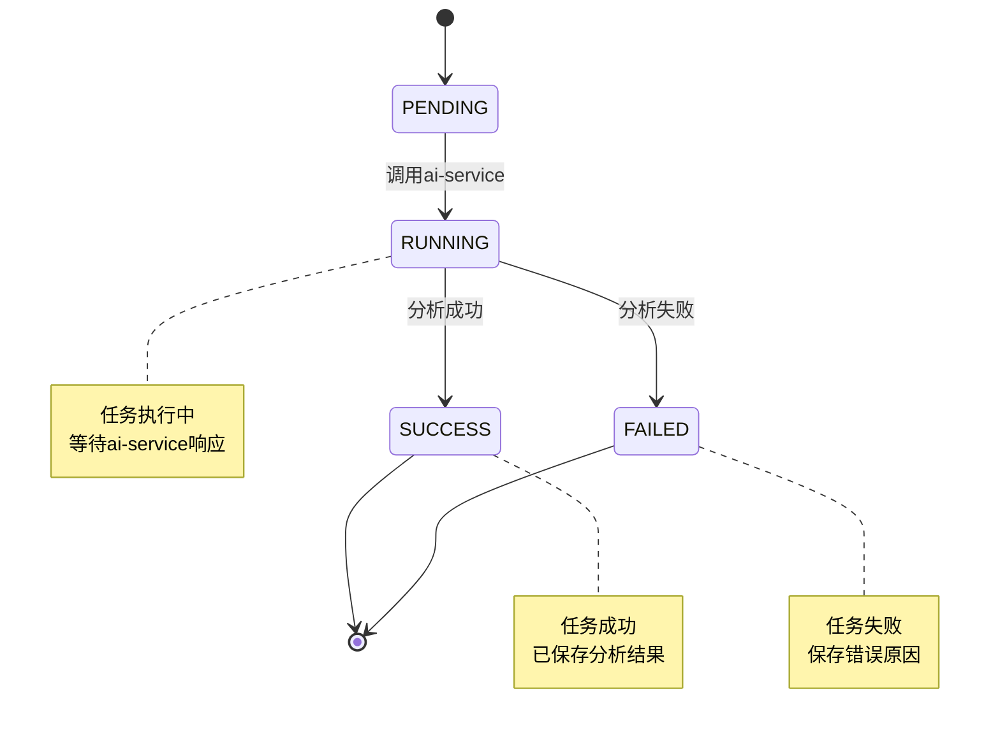

# 后端服务API

<cite>
**本文档引用的文件**
- [README.md](file://README.md)
- [docs/API.md](file://docs/API.md)
- [docs/PRD.md](file://docs/PRD.md)
- [docs/ARCHITECTURE.md](file://docs/ARCHITECTURE.md)
- [docs/DATABASE.md](file://docs/DATABASE.md)
- [docker-compose.yml](file://docker-compose.yml)
- [backend-java/README.md](file://backend-java/README.md)
- [ai-service/README.md](file://ai-service/README.md)
</cite>

## 目录
1. [简介](#简介)
2. [项目结构](#项目结构)
3. [核心组件](#核心组件)
4. [架构概览](#架构概览)
5. [详细组件分析](#详细组件分析)
6. [依赖关系分析](#依赖关系分析)
7. [性能考虑](#性能考虑)
8. [故障排除指南](#故障排除指南)
9. [结论](#结论)

## 简介

CodeReviewX是一个面向GitHub Pull Request的智能代码审查与修复建议代理系统。该系统允许用户输入GitHub仓库URL和PR编号，自动获取PR diff，结合静态分析工具和LLM生成结构化Review报告，帮助开发者发现潜在Bug、安全风险、性能问题和测试缺失问题。

### MVP目标

1. 用户输入GitHub仓库URL和PR编号
2. `backend-java`创建Review任务
3. `backend-java`调用`ai-service`
4. `ai-service`获取GitHub PR diff
5. `ai-service`运行Semgrep
6. `ai-service`调用mock或真实LLM
7. `ai-service`返回结构化Review JSON
8. `backend-java`存储结果
9. `frontend`显示摘要、风险等级和问题列表

## 项目结构

CodeReviewX采用模块化架构，包含四个主要模块：

```mermaid
graph TB
subgraph "前端模块"
FE[frontend<br/>Vue 3 / React]
end
subgraph "后端Java模块"
BE[backend-java<br/>Spring Boot 3 + Java 17]
end
subgraph "AI服务模块"
AI[ai-service<br/>Python + FastAPI]
end
subgraph "数据库模块"
DB[(MySQL 8)]
end
subgraph "外部服务"
GH[GitHub API]
LLM[LLM API]
end
FE --> BE
BE --> AI
AI --> GH
AI --> LLM
BE --> DB
```



**图表来源**
- [docs/ARCHITECTURE.md:19-52](file://docs/ARCHITECTURE.md#L19-L52)
- [docs/PRD.md:26-52](file://docs/PRD.md#L26-L52)

**章节来源**
- [README.md:58-82](file://README.md#L58-L82)
- [docs/ARCHITECTURE.md:19-52](file://docs/ARCHITECTURE.md#L19-L52)

## 核心组件

### 后端Java服务（backend-java）

后端Java服务是系统的业务编排中心，负责：
- 对前端提供统一REST API
- 创建ReviewTask并管理状态流转
- 调用ai-service执行代码分析
- 持久化ReviewFileChange和ReviewIssue
- 统一处理业务异常和响应格式

### AI服务（ai-service）

AI服务专注于代码分析：
- 解析GitHub仓库URL
- 调用GitHub API获取PR信息和diff
- 标准化文件变更
- 执行Semgrep静态分析
- 组织LLM prompt并校验JSON输出
- 合并Semgrep与LLM的问题

### 数据库（MySQL）

数据库存储所有业务数据：
- ReviewTask主表
- ReviewFileChange文件变更表
- ReviewIssue问题表

**章节来源**
- [backend-java/README.md:19-25](file://backend-java/README.md#L19-L25)
- [ai-service/README.md:19-26](file://ai-service/README.md#L19-L26)
- [docs/DATABASE.md:22-134](file://docs/DATABASE.md#L22-L134)

## 架构概览

### 系统总体架构



**图表来源**
- [docs/ARCHITECTURE.md:19-52](file://docs/ARCHITECTURE.md#L19-L52)
- [docs/ARCHITECTURE.md:183-230](file://docs/ARCHITECTURE.md#L183-L230)

### 调用链路



**图表来源**
- [docs/ARCHITECTURE.md:137-180](file://docs/ARCHITECTURE.md#L137-L180)
- [docs/API.md:54-241](file://docs/API.md#L54-L241)

## 详细组件分析

### API通用规范

#### 基础URL配置

| 环境 | backend-java | ai-service |
|---|---|---|
| 本地开发 | `http://localhost:8080` | `http://localhost:8000` |
| Docker Compose | `http://backend-java:8080` | `http://ai-service:8000` |

#### 请求格式

- Content-Type: `application/json`
- 字符集: UTF-8

#### 统一响应格式

**成功响应格式：**
```json
{
  "data": { }
}
```

**错误响应格式：**
```json
{
  "code": "ERROR_CODE",
  "message": "人类可读的错误信息",
  "details": null
}
```

**章节来源**
- [docs/API.md:11-39](file://docs/API.md#L11-L39)

### 后端Java API（供前端调用）

#### 2.1 创建Review任务

**HTTP方法和URL：**
```http
POST /api/review-tasks
```

**请求体参数：**

| 字段 | 类型 | 必填 | 说明 |
|---|---|---|---|
| `repoUrl` | string | 是 | GitHub仓库地址，格式：`https://github.com/{owner}/{repo}` |
| `prNumber` | integer | 是 | Pull Request编号，必须为正整数 |

**请求示例：**
```json
{
  "repoUrl": "https://github.com/owner/repo",
  "prNumber": 12
}
```

**响应格式（201 Created）：**
```json
{
  "taskId": 1,
  "status": "PENDING"
}
```

**成功响应示例：**
```json
{
  "data": {
    "taskId": 1,
    "status": "PENDING"
  }
}
```

**错误响应示例：**
```json
{
  "code": "INVALID_REQUEST",
  "message": "repoUrl必须是有效的GitHub URL",
  "details": null
}
```

**章节来源**
- [docs/API.md:56-96](file://docs/API.md#L56-L96)

#### 2.2 查询任务列表

**HTTP方法和URL：**
```http
GET /api/review-tasks
```

**查询参数（可选）：**

| 参数 | 类型 | 说明 |
|---|---|---|
| `page` | integer | 页码，从0开始，默认0 |
| `size` | integer | 每页数量，默认20 |

**响应格式（200 OK）：**
```json
{
  "items": [
    {
      "taskId": 1,
      "repoUrl": "https://github.com/owner/repo",
      "prNumber": 12,
      "status": "SUCCESS",
      "riskLevel": "MEDIUM",
      "createdAt": "2026-06-19T10:00:00"
    }
  ],
  "total": 1
}
```

**items字段说明：**

| 字段 | 类型 | 说明 |
|---|---|---|
| `taskId` | long | 任务ID |
| `repoUrl` | string | GitHub仓库地址 |
| `prNumber` | integer | PR编号 |
| `status` | string | `PENDING` / `RUNNING` / `SUCCESS` / `FAILED` |
| `riskLevel` | string | `LOW` / `MEDIUM` / `HIGH` / null（未完成时） |
| `createdAt` | string | ISO 8601格式时间 |

**章节来源**
- [docs/API.md:99-143](file://docs/API.md#L99-L143)

#### 2.3 查询任务详情

**HTTP方法和URL：**
```http
GET /api/review-tasks/{id}
```

**路径参数：**

| 参数 | 类型 | 说明 |
|---|---|---|
| `id` | long | 任务ID |

**响应格式（200 OK）：**
```json
{
  "taskId": 1,
  "repoUrl": "https://github.com/owner/repo",
  "prNumber": 12,
  "status": "SUCCESS",
  "summary": "此PR包含几个中等风险问题。",
  "riskLevel": "MEDIUM",
  "errorMessage": null,
  "createdAt": "2026-06-19T10:00:00",
  "updatedAt": "2026-06-19T10:01:30",
  "files": [
    {
      "filePath": "src/main/java/example/UserService.java",
      "changeType": "modified",
      "additions": 20,
      "deletions": 5
    }
  ],
  "issues": [
    {
      "type": "BUG",
      "severity": "MEDIUM",
      "filePath": "src/main/java/example/UserService.java",
      "line": 42,
      "title": "潜在的空指针异常",
      "description": "变量在使用前可能为空。",
      "suggestion": "在访问字段前添加空值检查。",
      "source": "LLM"
    }
  ]
}
```

**响应字段说明：**

| 字段 | 类型 | 说明 |
|---|---|---|
| `taskId` | long | 任务ID |
| `repoUrl` | string | GitHub仓库地址 |
| `prNumber` | integer | PR编号 |
| `status` | string | 任务状态 |
| `summary` | string | Review总结（任务成功后填充） |
| `riskLevel` | string | 风险等级（任务成功后填充） |
| `errorMessage` | string | 失败原因（FAILED状态时填充） |
| `files` | array | 变更文件列表 |
| `issues` | array | Review问题列表 |

**files项字段：**

| 字段 | 类型 | 说明 |
|---|---|---|
| `filePath` | string | 文件路径 |
| `changeType` | string | `added` / `modified` / `deleted` |
| `additions` | integer | 新增行数 |
| `deletions` | integer | 删除行数 |

**issues项字段：**

| 字段 | 类型 | 说明 |
|---|---|---|
| `type` | string | `BUG` / `SECURITY` / `PERFORMANCE` / `TEST` / `STYLE` |
| `severity` | string | `LOW` / `MEDIUM` / `HIGH` |
| `filePath` | string | 问题所在文件路径 |
| `line` | integer | 问题行号 |
| `title` | string | 问题标题 |
| `description` | string | 问题描述 |
| `suggestion` | string | 修复建议 |
| `source` | string | `LLM` / `SEMGREP` |

**错误响应（任务不存在）：**
```json
{
  "code": "TASK_NOT_FOUND",
  "message": "找不到ID为999的Review任务",
  "details": null
}
```

**章节来源**
- [docs/API.md:145-241](file://docs/API.md#L145-L241)

### AI服务API（供后端Java调用）

#### 3.1 执行PR分析

**HTTP方法和URL：**
```http
POST /review
```

**请求体参数：**
```json
{
  "repoUrl": "https://github.com/owner/repo",
  "prNumber": 12
}
```

**响应格式（200 OK）：**
```json
{
  "summary": "此PR在用户认证逻辑中引入了潜在风险。",
  "riskLevel": "MEDIUM",
  "files": [
    {
      "filePath": "src/main/java/example/UserService.java",
      "changeType": "modified",
      "additions": 20,
      "deletions": 5,
      "patch": "@@ -1,5 +1,10 @@\n-old line\n+new line"
    }
  ],
  "issues": [
    {
      "type": "BUG",
      "severity": "MEDIUM",
      "filePath": "src/main/java/example/UserService.java",
      "line": 42,
      "title": "潜在的空指针异常",
      "description": "变量在使用前可能为空。",
      "suggestion": "在访问字段前添加空值检查。",
      "source": "LLM"
    },
    {
      "type": "SECURITY",
      "severity": "HIGH",
      "filePath": "src/main/java/example/AuthController.java",
      "line": 15,
      "title": "检测到硬编码密钥",
      "description": "源代码中发现了硬编码令牌。",
      "suggestion": "将此值移动到环境变量中。",
      "source": "SEMGREP"
    }
  ]
}
```

**响应字段说明：**

| 字段 | 类型 | 说明 |
|---|---|---|
| `summary` | string | Review总结 |
| `riskLevel` | string | `LOW` / `MEDIUM` / `HIGH` |
| `files` | array | PR变更文件列表（含patch） |
| `issues` | array | 所有Review问题（合并LLM + Semgrep） |

**错误响应（GitHub拉取失败）：**
```json
{
  "errorCode": "GITHUB_FETCH_FAILED",
  "message": "获取Pull Request失败：仓库不存在或无访问权限",
  "recoverable": false
}
```

**AI服务错误码：**

| 错误码 | 场景 |
|---|---|
| `GITHUB_FETCH_FAILED` | GitHub API请求失败 |
| `PR_NOT_FOUND` | PR不存在 |
| `SEMGREP_FAILED` | Semgrep执行失败（通常降级处理） |
| `LLM_FAILED` | LLM调用失败（通常降级为mock） |
| `INVALID_REQUEST` | 请求参数错误 |

**章节来源**
- [docs/API.md:243-332](file://docs/API.md#L243-L332)

### 错误码定义

#### 后端Java错误码

| 错误码 | HTTP状态 | 场景 |
|---|---|---|
| `INVALID_REQUEST` | 400 | 请求参数错误或校验失败 |
| `TASK_NOT_FOUND` | 404 | 任务不存在 |
| `AI_SERVICE_ERROR` | 502 | ai-service调用失败 |
| `GITHUB_FETCH_FAILED` | 502 | GitHub数据获取失败 |
| `DATABASE_ERROR` | 500 | 数据库操作失败 |
| `INTERNAL_ERROR` | 500 | 未知系统错误 |

#### AI服务错误码

| 错误码 | 场景 |
|---|---|
| `GITHUB_FETCH_FAILED` | GitHub API请求失败 |
| `PR_NOT_FOUND` | PR不存在 |
| `SEMGREP_FAILED` | Semgrep执行失败 |
| `LLM_FAILED` | LLM调用失败 |
| `INVALID_REQUEST` | 请求参数错误 |

**章节来源**
- [docs/API.md:41-51](file://docs/API.md#L41-L51)
- [docs/API.md:323-332](file://docs/API.md#L323-L332)

## 依赖关系分析

### 数据库实体关系



**图表来源**
- [docs/DATABASE.md:22-134](file://docs/DATABASE.md#L22-L134)

### 状态流转图



**图表来源**
- [docs/ARCHITECTURE.md:110-134](file://docs/ARCHITECTURE.md#L110-L134)
- [docs/DATABASE.md:205-213](file://docs/DATABASE.md#L205-L213)

### 枚举值定义

#### TaskStatus（任务状态）

| 值 | 含义 |
|---|---|
| `PENDING` | 任务已创建，尚未执行 |
| `RUNNING` | 任务执行中 |
| `SUCCESS` | 任务执行成功 |
| `FAILED` | 任务执行失败 |

#### RiskLevel（风险等级）

| 值 | 含义 |
|---|---|
| `LOW` | 低风险 |
| `MEDIUM` | 中风险 |
| `HIGH` | 高风险 |

#### IssueType（问题类型）

| 值 | 含义 |
|---|---|
| `BUG` | 潜在Bug |
| `SECURITY` | 安全风险 |
| `PERFORMANCE` | 性能问题 |
| `TEST` | 测试缺失 |
| `STYLE` | 代码风格 |

#### IssueSeverity（问题严重程度）

| 值 | 含义 |
|---|---|
| `LOW` | 低严重程度 |
| `MEDIUM` | 中严重程度 |
| `HIGH` | 高严重程度 |

#### IssueSource（问题来源）

| 值 | 含义 |
|---|---|
| `LLM` | 来自LLM分析 |
| `SEMGREP` | 来自Semgrep静态分析 |

**章节来源**
- [docs/API.md:335-378](file://docs/API.md#L335-L378)
- [docs/DATABASE.md:205-254](file://docs/DATABASE.md#L205-L254)

## 性能考虑

### 系统设计原则

1. **模块职责分离**：Java后端只做业务编排和数据持久化，AI服务只做代码分析
2. **本地可运行**：所有服务优先保证本地可运行、可调试、可演示
3. **Mock优先**：AI能力必须先有mock fallback，再接入真实LLM
4. **简单优先**：第一阶段不引入Redis、消息队列、Kubernetes等复杂架构

### 部署配置

| 服务 | 端口 | 环境变量 |
|---|---|---|
| frontend | 3000 | VITE_API_BASE_URL=http://localhost:8080 |
| backend-java | 8080 | SPRING_DATASOURCE_URL, SPRING_DATASOURCE_USERNAME, SPRING_DATASOURCE_PASSWORD, AI_SERVICE_BASE_URL |
| ai-service | 8000 | GITHUB_TOKEN, LLM_PROVIDER, LLM_API_KEY, SEMGREP_TIMEOUT_SECONDS |
| mysql | 3306 | 数据库连接参数 |

**章节来源**
- [docs/ARCHITECTURE.md:345-381](file://docs/ARCHITECTURE.md#L345-L381)

## 故障排除指南

### 常见错误场景及处理

#### GitHub API失败
- **症状**：任务状态变为FAILED，保存error_message
- **处理**：检查GITHUB_TOKEN配置，确认仓库访问权限
- **恢复**：修复凭据后重新触发任务

#### Semgrep失败
- **症状**：任务仍为SUCCESS，但issues中包含warning
- **处理**：降级为warning记录，不影响整体分析结果
- **恢复**：修复Semgrep配置或网络连接

#### LLM失败
- **症状**：使用mock fallback或返回空issues
- **处理**：优先使用mock fallback，fallback失败后才将任务置为FAILED
- **恢复**：检查LLM API密钥和网络连接

#### 数据库保存失败
- **症状**：任务状态变为FAILED
- **处理**：检查数据库连接和表结构
- **恢复**：修复数据库配置后重试

**章节来源**
- [docs/ARCHITECTURE.md:170-180](file://docs/ARCHITECTURE.md#L170-L180)

### 调试建议

1. **启用详细日志**：在开发环境中开启DEBUG级别日志
2. **监控指标**：关注任务成功率、响应时间和错误率
3. **健康检查**：定期检查各服务的可用性
4. **缓存策略**：合理设置缓存过期时间，避免陈旧数据

## 结论

CodeReviewX后端服务API设计遵循了清晰的模块化架构原则，通过统一的API规范和错误处理机制，为前端提供了稳定可靠的代码审查服务接口。系统采用前后端分离的设计，后端Java服务专注于业务编排和数据持久化，AI服务专注于代码分析，这种分工明确的架构有利于系统的扩展和维护。

API文档涵盖了所有必要的接口定义、参数说明、响应格式和错误处理机制，为前端开发者提供了完整的集成指南。通过标准化的数据格式和错误码体系，确保了系统的易用性和可靠性。

随着项目的推进，这些API设计将在后续Round中逐步实现，为用户提供完整的代码审查解决方案。