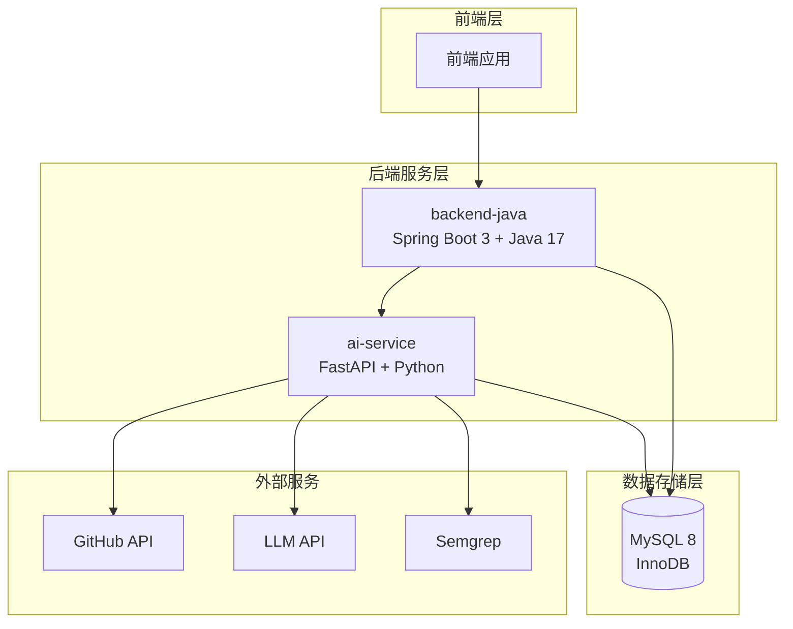
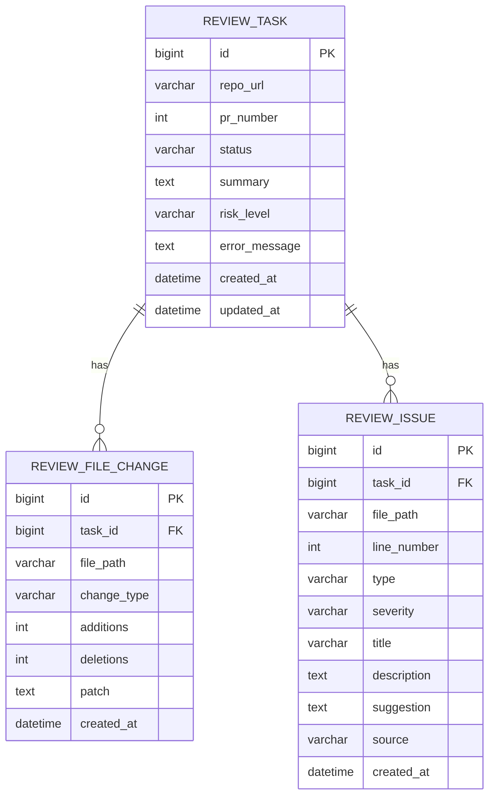

# 数据模型定义

<cite>
**本文引用的文件**
- [API.md](file://docs/API.md)
- [DATABASE.md](file://docs/DATABASE.md)
- [ARCHITECTURE.md](file://docs/ARCHITECTURE.md)
- [PRD.md](file://docs/PRD.md)
- [03-qoder-independent-review.md](file://tasks/round-01/03-qoder-independent-review.md)
</cite>

## 目录
1. [简介](#简介)
2. [项目结构](#项目结构)
3. [核心数据实体](#核心数据实体)
4. [API数据模型](#api数据模型)
5. [数据库模型](#数据库模型)
6. [枚举值定义](#枚举值定义)
7. [JSON Schema规范](#json-schema规范)
8. [字段约束说明](#字段约束说明)
9. [使用示例](#使用示例)
10. [最佳实践](#最佳实践)
11. [故障排除指南](#故障排除指南)
12. [总结](#总结)

## 简介

CodeReviewX是一个面向GitHub Pull Request的智能代码审查系统。本文档详细定义了系统中使用的核心数据模型，包括ReviewTask、ReviewFileChange、ReviewIssue等实体的字段定义、类型约束、业务含义和使用场景。

该系统采用前后端分离架构，后端Java服务负责任务编排和数据持久化，AI服务负责GitHub数据获取、静态分析和LLM分析。数据模型设计遵循MVP阶段的需求，重点关注任务管理、文件变更跟踪和问题识别。

## 项目结构

系统采用模块化设计，主要包含以下组件：



**图表来源**
- [ARCHITECTURE.md:19-52](file://docs/ARCHITECTURE.md#L19-L52)

**章节来源**
- [ARCHITECTURE.md:1-52](file://docs/ARCHITECTURE.md#L1-L52)
- [PRD.md:26-52](file://docs/PRD.md#L26-L52)

## 核心数据实体

### ReviewTask实体

ReviewTask是代码审查任务的主实体，保存任务元信息、状态和审查结果摘要。

| 字段名 | 类型 | 必填 | 默认值 | 说明 |
|--------|------|------|--------|------|
| id | BIGINT | 是 | 自增 | 任务ID，主键 |
| repo_url | VARCHAR(500) | 是 | 无 | GitHub仓库地址 |
| pr_number | INT | 是 | 无 | Pull Request编号 |
| status | VARCHAR(20) | 是 | PENDING | 任务状态，见TaskStatus枚举 |
| summary | TEXT | 否 | null | 审查总结，任务成功后填充 |
| risk_level | VARCHAR(10) | 否 | null | 风险等级，任务成功后填充 |
| error_message | TEXT | 否 | null | 失败原因，FAILED状态时填充 |
| created_at | DATETIME | 是 | 当前时间 | 创建时间 |
| updated_at | DATETIME | 是 | 当前时间 | 更新时间 |

### ReviewFileChange实体

ReviewFileChange实体保存每个任务涉及的文件变更信息。

| 字段名 | 类型 | 必填 | 默认值 | 说明 |
|--------|------|------|--------|------|
| id | BIGINT | 是 | 自增 | 文件变更ID，主键 |
| task_id | BIGINT | 是 | 无 | 关联ReviewTask.id |
| file_path | VARCHAR(500) | 是 | 无 | 文件路径 |
| change_type | VARCHAR(20) | 是 | 无 | 变更类型，见ChangeType枚举 |
| additions | INT | 是 | 0 | 新增行数 |
| deletions | INT | 是 | 0 | 删除行数 |
| patch | TEXT | 否 | null | diff片段，MVP阶段使用TEXT |
| created_at | DATETIME | 是 | 当前时间 | 创建时间 |

### ReviewIssue实体

ReviewIssue实体保存LLM和Semgrep分析出的所有问题。

| 字段名 | 类型 | 必填 | 默认值 | 说明 |
|--------|------|------|--------|------|
| id | BIGINT | 是 | 自增 | Issue ID，主键 |
| task_id | BIGINT | 是 | 无 | 关联ReviewTask.id |
| file_path | VARCHAR(500) | 是 | 无 | 问题所在文件路径 |
| line_number | INT | 否 | null | 问题行号（Semgrep通常有，LLM可能没有） |
| type | VARCHAR(20) | 是 | 无 | 问题类型，见IssueType枚举 |
| severity | VARCHAR(10) | 是 | 无 | 严重程度，见IssueSeverity枚举 |
| title | VARCHAR(255) | 是 | 无 | 问题标题 |
| description | TEXT | 是 | 无 | 问题描述 |
| suggestion | TEXT | 否 | null | 修复建议 |
| source | VARCHAR(20) | 是 | 无 | 来源，见IssueSource枚举 |
| created_at | DATETIME | 是 | 当前时间 | 创建时间 |

**章节来源**
- [DATABASE.md:22-134](file://docs/DATABASE.md#L22-L134)
- [PRD.md:125-169](file://docs/PRD.md#L125-L169)

## API数据模型

### 任务创建请求

任务创建请求用于启动新的代码审查任务。

**请求体字段**

| 字段名 | 类型 | 必填 | 说明 |
|--------|------|------|------|
| repoUrl | string | 是 | GitHub仓库地址，格式：`https://github.com/{owner}/{repo}` |
| prNumber | integer | 是 | Pull Request编号，必须为正整数 |

**响应字段**

| 字段名 | 类型 | 必填 | 说明 |
|--------|------|------|------|
| taskId | long | 是 | 任务ID |
| status | string | 是 | 任务状态，初始为PENDING |

**章节来源**
- [API.md:64-85](file://docs/API.md#L64-L85)

### 任务列表查询

**查询参数**

| 参数名 | 类型 | 说明 |
|--------|------|------|
| page | integer | 页码，从0开始，默认0 |
| size | integer | 每页数量，默认20 |

**响应字段**

| 字段名 | 类型 | 说明 |
|--------|------|------|
| items | array | 任务列表 |
| total | integer | 总任务数 |

**items数组项字段**

| 字段名 | 类型 | 说明 |
|--------|------|------|
| taskId | long | 任务ID |
| repoUrl | string | GitHub仓库地址 |
| prNumber | integer | PR编号 |
| status | string | 任务状态 |
| riskLevel | string | 风险等级（任务成功后填充） |
| createdAt | string | ISO 8601格式时间 |

**章节来源**
- [API.md:107-131](file://docs/API.md#L107-L131)

### 任务详情查询

**路径参数**

| 参数名 | 类型 | 说明 |
|--------|------|------|
| id | long | 任务ID |

**响应字段**

| 字段名 | 类型 | 说明 |
|--------|------|------|
| taskId | long | 任务ID |
| repoUrl | string | GitHub仓库地址 |
| prNumber | integer | PR编号 |
| status | string | 任务状态 |
| summary | string | Review总结（任务成功后填充） |
| riskLevel | string | 风险等级（任务成功后填充） |
| errorMessage | string | 失败原因（FAILED状态时填充） |
| createdAt | string | ISO 8601格式时间 |
| updatedAt | string | ISO 8601格式时间 |
| files | array | 变更文件列表 |
| issues | array | Review问题列表 |

**files数组项字段**

| 字段名 | 类型 | 说明 |
|--------|------|------|
| filePath | string | 文件路径 |
| changeType | string | 变更类型：added / modified / deleted |
| additions | integer | 新增行数 |
| deletions | integer | 删除行数 |

**issues数组项字段**

| 字段名 | 类型 | 说明 |
|--------|------|------|
| type | string | 问题类型：BUG / SECURITY / PERFORMANCE / TEST / STYLE |
| severity | string | 严重程度：LOW / MEDIUM / HIGH |
| filePath | string | 问题所在文件路径 |
| line | integer | 问题行号 |
| title | string | 问题标题 |
| description | string | 问题描述 |
| suggestion | string | 修复建议 |
| source | string | 来源：LLM / SEMGREP |

**章节来源**
- [API.md:159-239](file://docs/API.md#L159-L239)

### AI服务分析请求

**请求体字段**

| 字段名 | 类型 | 必填 | 说明 |
|--------|------|------|------|
| repoUrl | string | 是 | GitHub仓库地址 |
| prNumber | integer | 是 | Pull Request编号 |

**响应字段**

| 字段名 | 类型 | 说明 |
|--------|------|------|
| summary | string | Review总结 |
| riskLevel | string | 风险等级：LOW / MEDIUM / HIGH |
| files | array | PR变更文件列表（含patch） |
| issues | array | 所有Review问题（合并LLM + Semgrep） |

**章节来源**
- [API.md:255-302](file://docs/API.md#L255-L302)

## 数据库模型

### 实体关系图



**图表来源**
- [DATABASE.md:27-116](file://docs/DATABASE.md#L27-L116)

### 索引设计

| 表名 | 索引名 | 类型 | 列 |
|------|--------|------|----|
| review_task | idx_status | 普通索引 | status |
| review_task | idx_created_at | 普通索引 | created_at |
| review_file_change | idx_task_id | 普通索引 | task_id |
| review_issue | idx_task_id | 普通索引 | task_id |
| review_issue | idx_severity | 普通索引 | severity |
| review_issue | idx_type | 普通索引 | type |

**章节来源**
- [DATABASE.md:37-116](file://docs/DATABASE.md#L37-L116)

## 枚举值定义

### TaskStatus枚举

| 值 | 含义 | 业务场景 |
|----|------|----------|
| PENDING | 任务已创建，尚未执行 | 任务刚创建时的状态 |
| RUNNING | 任务执行中 | 调用ai-service进行分析时 |
| SUCCESS | 任务执行成功 | 分析完成且结果保存成功 |
| FAILED | 任务执行失败 | 任何关键步骤失败时 |

### RiskLevel枚举

| 值 | 含义 | 业务含义 |
|----|------|----------|
| LOW | 低风险 | 对系统影响较小的问题 |
| MEDIUM | 中风险 | 需要关注但不紧急的问题 |
| HIGH | 高风险 | 可能导致严重后果的问题 |

### IssueType枚举

| 值 | 含义 | 问题类型 |
|----|------|----------|
| BUG | 潜在Bug | 逻辑错误或运行时异常 |
| SECURITY | 安全风险 | 注入、密钥泄露、未授权访问等 |
| PERFORMANCE | 性能问题 | N+1查询、不必要的循环、内存泄露风险 |
| TEST | 测试缺失 | 测试覆盖不足或缺少测试 |
| STYLE | 代码风格 | 可读性或风格问题 |

### IssueSeverity枚举

| 值 | 含义 | 严重程度 |
|----|------|----------|
| LOW | 低严重程度 | 影响最小的问题 |
| MEDIUM | 中严重程度 | 需要关注的问题 |
| HIGH | 高严重程度 | 需要立即处理的问题 |

### ChangeType枚举

| 值 | 含义 | 变更类型 |
|----|------|----------|
| added | 新增文件 | 文件被添加到仓库 |
| modified | 修改文件 | 文件内容被修改 |
| deleted | 删除文件 | 文件从仓库中移除 |

### IssueSource枚举

| 值 | 含义 | 来源说明 |
|----|------|----------|
| LLM | 来自LLM分析 | 由语言模型分析生成的问题 |
| SEMGREP | 来自Semgrep静态分析 | 由Semgrep静态分析工具生成的问题 |

**章节来源**
- [API.md:335-378](file://docs/API.md#L335-L378)
- [DATABASE.md:203-254](file://docs/DATABASE.md#L203-L254)

## JSON Schema规范

### ReviewTask JSON Schema

```json
{
  "$schema": "http://json-schema.org/draft-07/schema#",
  "type": "object",
  "title": "ReviewTask",
  "required": ["id", "repoUrl", "prNumber", "status"],
  "properties": {
    "id": {
      "type": "integer",
      "minimum": 1
    },
    "repoUrl": {
      "type": "string",
      "format": "uri",
      "pattern": "^https://github\\.com/.+/.+$"
    },
    "prNumber": {
      "type": "integer",
      "minimum": 1
    },
    "status": {
      "type": "string",
      "enum": ["PENDING", "RUNNING", "SUCCESS", "FAILED"]
    },
    "summary": {
      "type": "string"
    },
    "riskLevel": {
      "type": "string",
      "enum": ["LOW", "MEDIUM", "HIGH"]
    },
    "errorMessage": {
      "type": "string"
    },
    "createdAt": {
      "type": "string",
      "format": "date-time"
    },
    "updatedAt": {
      "type": "string",
      "format": "date-time"
    }
  }
}
```

### ReviewIssue JSON Schema

```json
{
  "$schema": "http://json-schema.org/draft-07/schema#",
  "type": "object",
  "title": "ReviewIssue",
  "required": ["type", "severity", "filePath", "title", "description", "source"],
  "properties": {
    "type": {
      "type": "string",
      "enum": ["BUG", "SECURITY", "PERFORMANCE", "TEST", "STYLE"]
    },
    "severity": {
      "type": "string",
      "enum": ["LOW", "MEDIUM", "HIGH"]
    },
    "filePath": {
      "type": "string",
      "maxLength": 500
    },
    "lineNumber": {
      "type": "integer"
    },
    "title": {
      "type": "string",
      "maxLength": 255
    },
    "description": {
      "type": "string"
    },
    "suggestion": {
      "type": "string"
    },
    "source": {
      "type": "string",
      "enum": ["LLM", "SEMGREP"]
    }
  }
}
```

## 字段约束说明

### 必填性约束

**ReviewTask实体**
- 必填字段：id, repoUrl, prNumber, status
- 可选字段：summary, riskLevel, errorMessage

**ReviewFileChange实体**
- 必填字段：id, taskId, filePath, changeType, additions, deletions
- 可选字段：patch

**ReviewIssue实体**
- 必填字段：id, taskId, filePath, type, severity, title, description, source
- 可选字段：lineNumber, suggestion

### 取值范围约束

**数值类型**
- prNumber: 正整数，必须大于0
- additions: 非负整数，>= 0
- deletions: 非负整数，>= 0
- lineNumber: 整数，可为空

**字符串类型**
- repoUrl: 最大长度500字符，必须符合GitHub URL格式
- file_path: 最大长度500字符
- title: 最大长度255字符
- status: 必须为TaskStatus枚举值之一

**日期时间**
- created_at, updated_at: ISO 8601格式的时间戳

### 业务约束

**状态流转约束**
- 任务状态只能单向流转：PENDING → RUNNING → (SUCCESS | FAILED)
- FAILED状态必须同时保存error_message字段

**风险等级约束**
- riskLevel字段仅在任务成功时填充
- 未完成的任务riskLevel为null

**来源约束**
- IssueSource枚举值必须为LLM或SEMGREP之一
- 不同来源的问题具有不同的业务含义和处理方式

**章节来源**
- [ARCHITECTURE.md:110-134](file://docs/ARCHITECTURE.md#L110-L134)
- [DATABASE.md:288-294](file://docs/DATABASE.md#L288-L294)

## 使用示例

### 创建审查任务

**请求示例**
```json
{
  "repoUrl": "https://github.com/example/repo",
  "prNumber": 123
}
```

**响应示例**
```json
{
  "taskId": 1,
  "status": "PENDING"
}
```

### 查询任务详情

**响应示例**
```json
{
  "taskId": 1,
  "repoUrl": "https://github.com/example/repo",
  "prNumber": 123,
  "status": "SUCCESS",
  "summary": "This PR has several medium risk issues.",
  "riskLevel": "MEDIUM",
  "files": [
    {
      "filePath": "src/main/java/example/UserService.java",
      "changeType": "modified",
      "additions": 20,
      "deletions": 5
    }
  ],
  "issues": [
    {
      "type": "BUG",
      "severity": "MEDIUM",
      "filePath": "src/main/java/example/UserService.java",
      "line": 42,
      "title": "Potential null pointer exception",
      "description": "The variable may be null before use.",
      "suggestion": "Add a null check before accessing the field.",
      "source": "LLM"
    }
  ]
}
```

### AI服务分析响应

**响应示例**
```json
{
  "summary": "This PR introduces potential risks in user authentication logic.",
  "riskLevel": "MEDIUM",
  "files": [
    {
      "filePath": "src/main/java/example/UserService.java",
      "changeType": "modified",
      "additions": 20,
      "deletions": 5,
      "patch": "@@ -1,5 +1,10 @@\\n-old line\\n+new line"
    }
  ],
  "issues": [
    {
      "type": "BUG",
      "severity": "MEDIUM",
      "filePath": "src/main/java/example/UserService.java",
      "line": 42,
      "title": "Potential null pointer exception",
      "description": "The variable may be null before use.",
      "suggestion": "Add a null check before accessing the field.",
      "source": "LLM"
    },
    {
      "type": "SECURITY",
      "severity": "HIGH",
      "filePath": "src/main/java/example/AuthController.java",
      "line": 15,
      "title": "Hardcoded secret detected",
      "description": "A hardcoded token was found in the source code.",
      "suggestion": "Move this value to environment variables.",
      "source": "SEMGREP"
    }
  ]
}
```

**章节来源**
- [API.md:66-193](file://docs/API.md#L66-L193)
- [API.md:257-302](file://docs/API.md#L257-L302)

## 最佳实践

### 数据完整性保证

1. **外键约束**：所有子表都通过外键关联到ReviewTask，确保数据一致性
2. **索引优化**：为常用查询字段建立索引，提高查询性能
3. **默认值设置**：合理设置字段默认值，减少NULL值的使用

### 错误处理策略

1. **状态机设计**：严格控制任务状态流转，防止状态回退
2. **错误信息记录**：FAILED状态下必须记录详细的错误信息
3. **降级处理**：Semgrep失败时进行降级处理，不影响整体流程

### 性能优化建议

1. **分页查询**：任务列表查询支持分页，避免一次性加载大量数据
2. **索引利用**：合理使用索引，特别是status和created_at字段
3. **数据截断**：patch字段使用TEXT类型，注意大数据量时的性能影响

### 安全考虑

1. **输入验证**：严格验证GitHub URL格式和PR编号的有效性
2. **SQL注入防护**：使用ORM框架自动处理SQL注入防护
3. **敏感信息保护**：避免在日志中记录敏感的错误信息

## 故障排除指南

### 常见错误及解决方案

**任务不存在 (TASK_NOT_FOUND)**
- 现象：查询特定任务ID返回404
- 原因：任务ID无效或已被清理
- 解决：确认任务ID正确性，检查任务是否存在

**请求参数错误 (INVALID_REQUEST)**
- 现象：创建任务时返回400错误
- 原因：repoUrl格式不正确或prNumber非正整数
- 解决：验证URL格式，确保PR编号为正整数

**AI服务调用失败 (AI_SERVICE_ERROR)**
- 现象：调用ai-service返回502错误
- 原因：ai-service服务不可用或超时
- 解决：检查ai-service服务状态，重试请求

**GitHub数据获取失败 (GITHUB_FETCH_FAILED)**
- 现象：拉取PR数据失败
- 原因：仓库不存在、权限不足或网络问题
- 解决：检查GitHub访问令牌，确认仓库可见性

### 调试建议

1. **日志记录**：详细记录API调用和数据库操作日志
2. **状态监控**：监控任务状态变化和错误率
3. **性能监控**：监控数据库查询性能和API响应时间

**章节来源**
- [API.md:41-51](file://docs/API.md#L41-L51)
- [API.md:323-332](file://docs/API.md#L323-L332)

## 总结

CodeReviewX的数据模型设计简洁而实用，充分考虑了MVP阶段的需求和限制。通过ReviewTask、ReviewFileChange、ReviewIssue三个核心实体，系统能够完整地描述代码审查的全过程。

数据模型的关键特点包括：

1. **清晰的层次结构**：任务-文件-问题的三层嵌套关系
2. **严格的枚举约束**：通过枚举值确保数据的一致性和可读性
3. **完善的错误处理**：通过状态机和错误码机制保证系统的健壮性
4. **合理的性能设计**：通过索引和分页查询优化系统性能

这些设计使得API使用者能够准确理解和使用数据模型，为后续的功能扩展和系统演进奠定了坚实的基础。