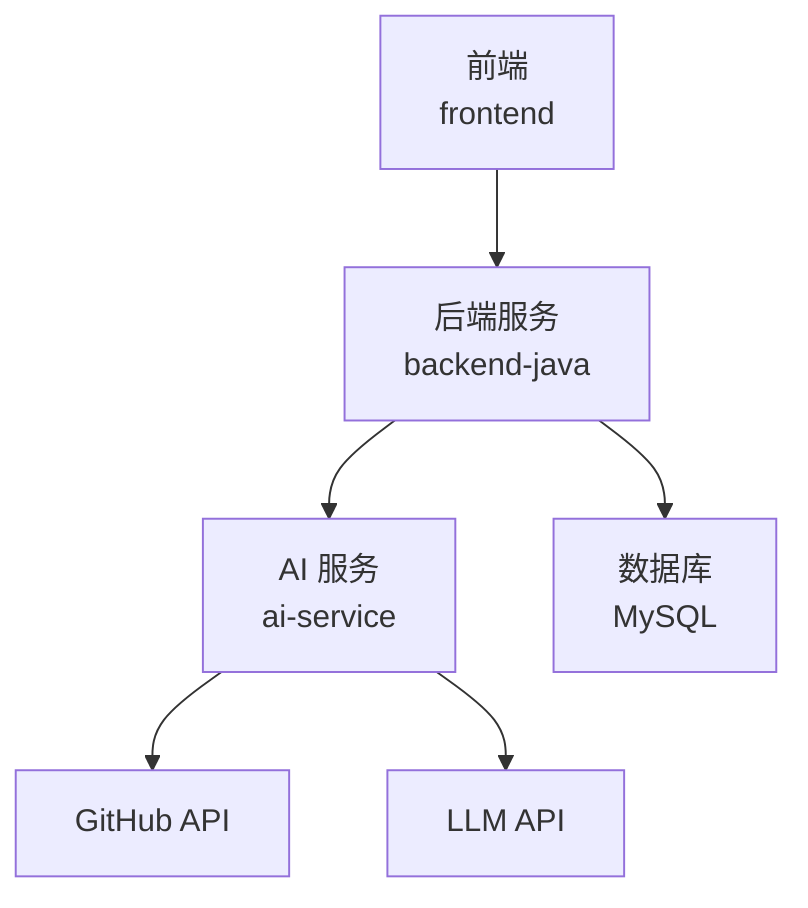
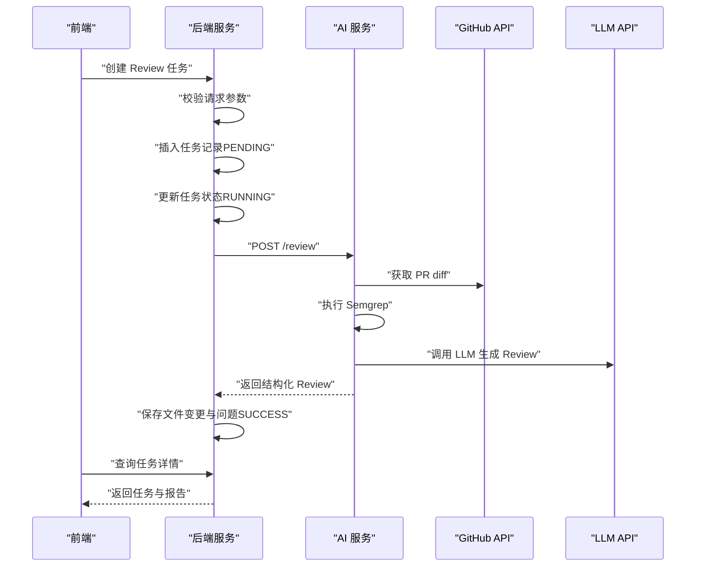
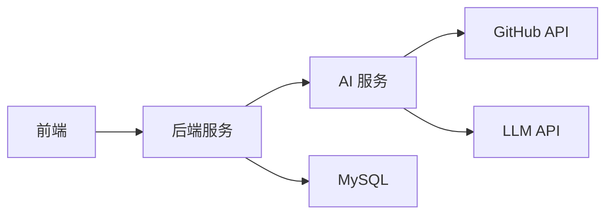

# 错误码参考

<cite>
**本文引用的文件**
- [README.md](file://README.md)
- [docs/API.md](file://docs/API.md)
- [docs/ARCHITECTURE.md](file://docs/ARCHITECTURE.md)
- [docs/DATABASE.md](file://docs/DATABASE.md)
- [docs/PRD.md](file://docs/PRD.md)
- [docker-compose.yml](file://docker-compose.yml)
- [tasks/round-01/01-cursor-repository-foundation.md](file://tasks/round-01/01-cursor-repository-foundation.md)
- [tasks/round-01/03-qoder-independent-review.md](file://tasks/round-01/03-qoder-independent-review.md)
</cite>

## 目录
1. [简介](#简介)
2. [项目结构](#项目结构)
3. [核心组件](#核心组件)
4. [架构总览](#架构总览)
5. [详细组件分析](#详细组件分析)
6. [依赖关系分析](#依赖关系分析)
7. [性能考量](#性能考量)
8. [故障排查指南](#故障排查指南)
9. [结论](#结论)
10. [附录](#附录)

## 简介
本文件为 CodeReviewX 系统的错误码参考文档，覆盖后端服务（backend-java）与 AI 服务（ai-service）的统一错误响应格式、错误码定义、HTTP 状态映射、触发场景与处理建议。文档基于 Round 01 的设计文档与 API 规划，帮助开发者快速识别与处理常见错误，提升系统的可维护性与用户体验。

## 项目结构
- 后端服务（backend-java）：负责对外提供 REST API、任务生命周期编排、调用 AI 服务、持久化数据。
- AI 服务（ai-service）：负责拉取 GitHub PR diff、执行 Semgrep、调用 LLM、返回结构化 Review 结果。
- 前端（frontend）：通过后端 API 获取任务与报告，不直接调用 AI 服务或外部 API。
- 数据库（MySQL）：存储任务、文件变更与问题记录。

图表来源
- [docs/ARCHITECTURE.md:19-52](file://docs/ARCHITECTURE.md#L19-L52)
- [docs/ARCHITECTURE.md:373-381](file://docs/ARCHITECTURE.md#L373-L381)

章节来源
- [README.md:58-82](file://README.md#L58-L82)
- [docs/ARCHITECTURE.md:19-52](file://docs/ARCHITECTURE.md#L19-L52)

## 核心组件
- 统一错误响应格式（后端服务）：包含 code、message、details 字段，便于前端与监控系统统一处理。
- 统一错误响应格式（AI 服务）：包含 errorCode、message、recoverable 字段，便于区分可恢复与不可恢复错误。
- 错误码与 HTTP 状态映射：INVALID_REQUEST（400）、TASK_NOT_FOUND（404）、AI_SERVICE_ERROR（502）、GITHUB_FETCH_FAILED（502）、DATABASE_ERROR（500）、INTERNAL_ERROR（500）。

章节来源
- [docs/API.md:31-39](file://docs/API.md#L31-L39)
- [docs/API.md:41-51](file://docs/API.md#L41-L51)
- [docs/ARCHITECTURE.md:314-341](file://docs/ARCHITECTURE.md#L314-L341)

## 架构总览
后端服务与 AI 服务之间的调用链如下：

图表来源
- [docs/ARCHITECTURE.md:139-168](file://docs/ARCHITECTURE.md#L139-L168)
- [docs/API.md:54-95](file://docs/API.md#L54-L95)
- [docs/API.md:243-332](file://docs/API.md#L243-L332)

章节来源
- [docs/ARCHITECTURE.md:139-180](file://docs/ARCHITECTURE.md#L139-L180)
- [docs/PRD.md:32-52](file://docs/PRD.md#L32-L52)

## 详细组件分析

### 后端服务错误码与处理建议
- INVALID_REQUEST（400）
  - 触发场景：请求参数校验失败（如 repoUrl 格式不正确、prNumber 非正整数）。
  - 处理建议：立即返回错误，提示用户修正输入；不更新任务状态。
  - 参考示例：[docs/API.md:87-95](file://docs/API.md#L87-L95)

- TASK_NOT_FOUND（404）
  - 触发场景：查询任务详情时任务不存在。
  - 处理建议：提示用户检查任务 ID；若为重试机制，建议指数退避。
  - 参考示例：[docs/API.md:231-239](file://docs/API.md#L231-L239)

- AI_SERVICE_ERROR（502）
  - 触发场景：调用 AI 服务失败（网络超时、服务不可达、AI 服务内部错误）。
  - 处理建议：记录详细日志与上游错误；可进行有限次重试；必要时降级为部分可用结果。
  - 参考示例：[docs/API.md:46-47](file://docs/API.md#L46-L47)

- GITHUB_FETCH_FAILED（502）
  - 触发场景：AI 服务拉取 GitHub PR diff 失败（仓库不存在、无访问权限、API 限流）。
  - 处理建议：提示用户检查仓库 URL 与访问令牌；可引导重试或切换镜像源。
  - 参考示例：[docs/API.md:47-48](file://docs/API.md#L47-L48)

- DATABASE_ERROR（500）
  - 触发场景：数据库写入或查询失败（连接异常、锁等待、约束冲突）。
  - 处理建议：重试幂等操作；记录 SQL 与参数；必要时回滚事务。
  - 参考示例：[docs/API.md:48-49](file://docs/API.md#L48-L49)

- INTERNAL_ERROR（500）
  - 触发场景：未预期的系统异常（空指针、资源泄漏、第三方 SDK 异常）。
  - 处理建议：记录堆栈与上下文；快速熔断与告警；隔离故障域。
  - 参考示例：[docs/API.md:49-50](file://docs/API.md#L49-L50)

章节来源
- [docs/API.md:41-51](file://docs/API.md#L41-L51)
- [docs/API.md:87-95](file://docs/API.md#L87-L95)
- [docs/API.md:231-239](file://docs/API.md#L231-L239)
- [docs/ARCHITECTURE.md:324-331](file://docs/ARCHITECTURE.md#L324-L331)

### AI 服务错误码与处理建议
- GITHUB_FETCH_FAILED
  - 触发场景：GitHub API 请求失败（仓库不存在、无访问权限、API 限流）。
  - 处理建议：返回不可恢复标记，前端引导用户检查仓库与令牌；可记录重试策略。
  - 参考示例：[docs/API.md:313-321](file://docs/API.md#L313-L321)

- PR_NOT_FOUND
  - 触发场景：PR 编号无效或不存在。
  - 处理建议：提示用户检查 PR 编号；支持自动重试与上限控制。
  - 参考示例：[docs/API.md:327](file://docs/API.md#L327)

- SEMGREP_FAILED
  - 触发场景：Semgrep 执行失败（超时、配置错误、扫描文件过大）。
  - 处理建议：降级为 warning，保留 LLM 结果；记录失败原因与耗时。
  - 参考示例：[docs/API.md:329](file://docs/API.md#L329)

- LLM_FAILED
  - 触发场景：LLM 调用失败（鉴权失败、模型不可用、JSON 校验失败）。
  - 处理建议：优先使用 mock fallback；fallback 失败则将任务置为 FAILED 并记录错误。
  - 参考示例：[docs/ARCHITECTURE.md:176](file://docs/ARCHITECTURE.md#L176)

- INVALID_REQUEST
  - 触发场景：请求参数错误（repoUrl、prNumber 校验失败）。
  - 处理建议：返回人类可读错误信息；不执行任何副作用。
  - 参考示例：[docs/API.md:331](file://docs/API.md#L331)

章节来源
- [docs/API.md:323-332](file://docs/API.md#L323-L332)
- [docs/ARCHITECTURE.md:170-180](file://docs/ARCHITECTURE.md#L170-L180)

### 错误码使用场景与最佳实践
- 统一错误响应格式
  - 后端服务：使用 code、message、details 字段，便于前端一致化处理与国际化扩展。
  - AI 服务：使用 errorCode、message、recoverable 字段，明确错误可恢复性。
- HTTP 状态码映射
  - 400：INVALID_REQUEST（参数校验失败）
  - 404：TASK_NOT_FOUND（资源不存在）
  - 502：AI_SERVICE_ERROR、GITHUB_FETCH_FAILED（上游服务异常）
  - 500：DATABASE_ERROR、INTERNAL_ERROR（系统内部错误）
- 失败链路处理
  - GitHub API 失败：任务置为 FAILED，保存 error_message。
  - Semgrep 失败：降级为 warning，不导致任务失败。
  - LLM 失败：优先使用 mock fallback；fallback 失败后任务置为 FAILED。
  - LLM JSON 校验失败：记录原始输出摘要，不返回未校验结构。
  - 后端数据库保存失败：任务置为 FAILED。
  - AI 服务超时：任务置为 FAILED，保存超时原因。
- 最佳实践
  - 前端：根据 code/ errorCode 与 HTTP 状态码组合判断错误类型，提供友好提示与重试入口。
  - 后端：在全局异常处理器中统一包装错误响应；记录 traceId 与上下文参数。
  - AI 服务：对可恢复错误进行指数退避重试；对不可恢复错误返回 recoverable=false 并引导用户修复。
  - 日志与监控：为每类错误码建立告警阈值与趋势分析；记录错误发生频率与根因分布。

章节来源
- [docs/ARCHITECTURE.md:170-180](file://docs/ARCHITECTURE.md#L170-L180)
- [docs/ARCHITECTURE.md:314-341](file://docs/ARCHITECTURE.md#L314-L341)

## 依赖关系分析
- 后端服务依赖
  - 调用 AI 服务：POST /review，期望返回结构化 Review。
  - 访问 MySQL：持久化任务、文件变更与问题。
- AI 服务依赖
  - GitHub API：获取 PR diff 与变更文件列表。
  - LLM API：生成结构化 Review JSON。
  - Semgrep：静态分析变更文件，产出问题列表。
- 前端依赖
  - 后端 API：创建任务、查询任务列表与详情。

图表来源
- [docs/ARCHITECTURE.md:19-52](file://docs/ARCHITECTURE.md#L19-L52)
- [docker-compose.yml:7-13](file://docker-compose.yml#L7-L13)

章节来源
- [docs/ARCHITECTURE.md:19-52](file://docs/ARCHITECTURE.md#L19-L52)
- [docker-compose.yml:7-13](file://docker-compose.yml#L7-L13)

## 性能考量
- 超时与重试
  - AI 服务超时：建议设置合理超时阈值与重试次数，避免阻塞后端请求。
  - GitHub API 限流：实现速率限制与退避策略，必要时使用缓存与镜像源。
- 资源隔离
  - 数据库连接池：限制并发与超时，防止雪崩效应。
  - LLM 调用：对第三方 API 实施熔断与降级策略。
- 监控与可观测性
  - 为每类错误码建立指标与告警；记录错误率、延迟与成功率。
  - 记录 traceId 与关键上下文，便于定位问题。

## 故障排查指南
- INVALID_REQUEST
  - 检查请求参数格式与必填项；确认 repoUrl 与 prNumber 合法。
  - 参考：[docs/API.md:64-77](file://docs/API.md#L64-L77)
- TASK_NOT_FOUND
  - 确认任务 ID 是否正确；检查数据库是否存在对应记录。
  - 参考：[docs/API.md:145-193](file://docs/API.md#L145-L193)
- AI_SERVICE_ERROR
  - 检查 AI 服务健康状态与网络连通性；查看上游错误日志。
  - 参考：[docs/API.md:46-47](file://docs/API.md#L46-L47)
- GITHUB_FETCH_FAILED
  - 校验 GitHub 令牌与仓库可见性；确认 PR 编号有效。
  - 参考：[docs/API.md:47-48](file://docs/API.md#L47-L48)、[docs/API.md:313-321](file://docs/API.md#L313-L321)
- DATABASE_ERROR
  - 检查数据库连接、SQL 语句与约束冲突；必要时回滚事务。
  - 参考：[docs/DATABASE.md:22-41](file://docs/DATABASE.md#L22-L41)
- INTERNAL_ERROR
  - 捕获并记录堆栈信息；隔离故障域，快速恢复。
  - 参考：[docs/ARCHITECTURE.md:129-133](file://docs/ARCHITECTURE.md#L129-L133)

章节来源
- [docs/API.md:41-51](file://docs/API.md#L41-L51)
- [docs/API.md:64-77](file://docs/API.md#L64-L77)
- [docs/API.md:145-193](file://docs/API.md#L145-L193)
- [docs/API.md:313-321](file://docs/API.md#L313-L321)
- [docs/DATABASE.md:22-41](file://docs/DATABASE.md#L22-L41)
- [docs/ARCHITECTURE.md:129-133](file://docs/ARCHITECTURE.md#L129-L133)

## 结论
本错误码参考文档基于 Round 01 的设计文档，明确了后端与 AI 服务的错误响应格式、错误码定义与处理策略。建议在后续 Round 中严格遵循统一错误响应格式与 HTTP 状态映射，完善失败链路处理与监控告警，持续优化用户体验与系统稳定性。

## 附录
- 数据库字段与错误记录
  - review_task.error_message：FAILED 状态时记录可读错误原因。
  - 参考：[docs/DATABASE.md:33-35](file://docs/DATABASE.md#L33-L35)、[tasks/round-01/01-cursor-repository-foundation.md:290](file://tasks/round-01/01-cursor-repository-foundation.md#L290)、[tasks/round-01/03-qoder-independent-review.md:355](file://tasks/round-01/03-qoder-independent-review.md#L355)
- 环境变量与部署端口
  - 后端服务：8080；AI 服务：8000；数据库：3306。
  - 参考：[docs/ARCHITECTURE.md:375-380](file://docs/ARCHITECTURE.md#L375-L380)、[docker-compose.yml:7-13](file://docker-compose.yml#L7-L13)