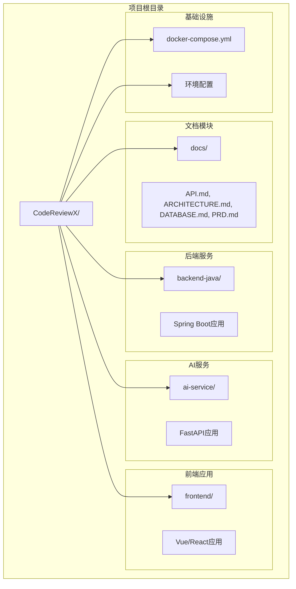
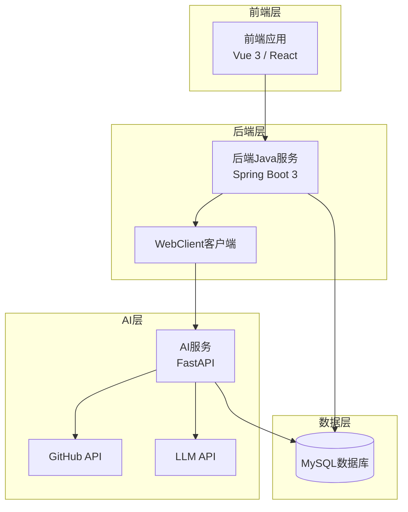
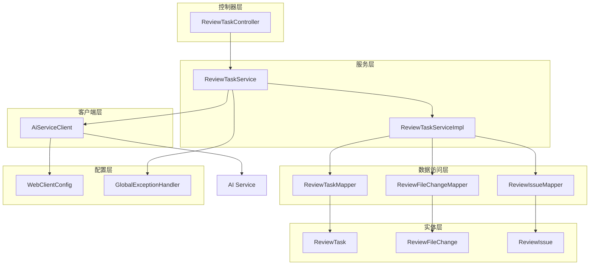
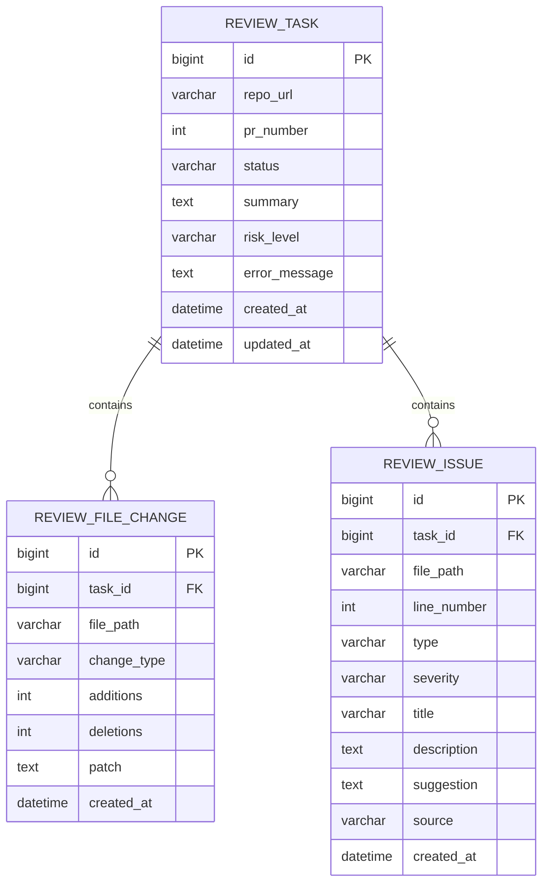
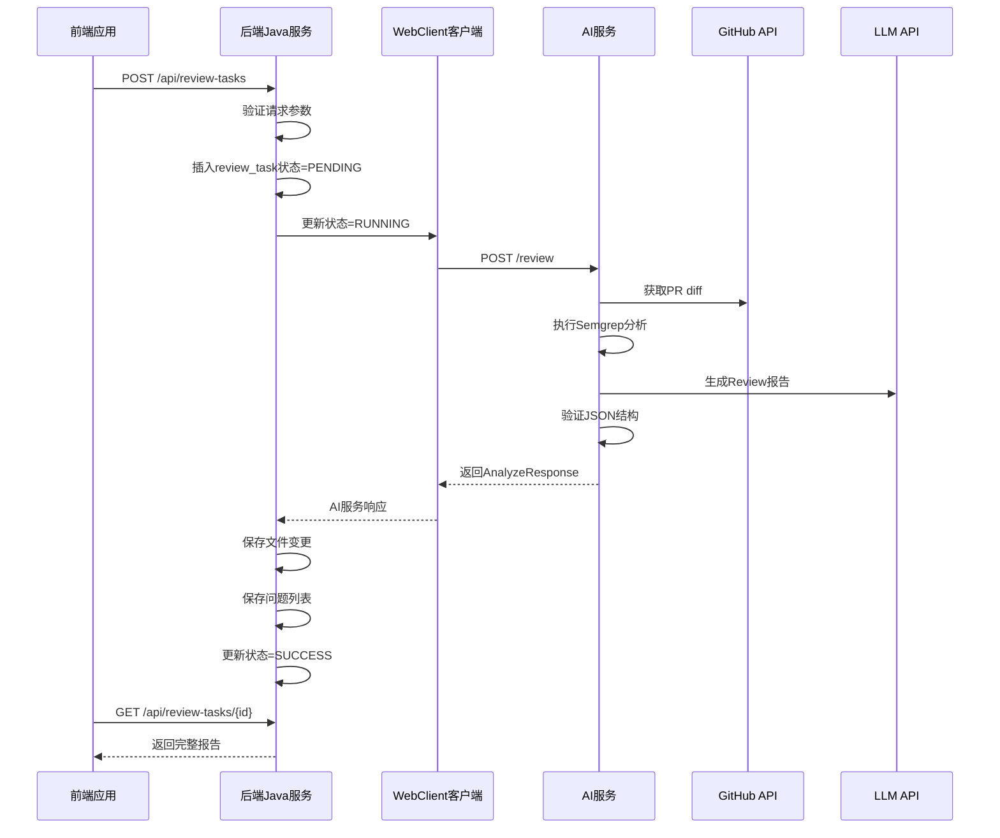
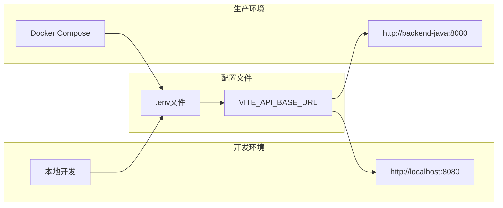

# API接口集成

<cite>
**本文档引用的文件**
- [API.md](file://docs/API.md)
- [ARCHITECTURE.md](file://docs/ARCHITECTURE.md)
- [DATABASE.md](file://docs/DATABASE.md)
- [PRD.md](file://docs/PRD.md)
- [README.md](file://README.md)
- [frontend/README.md](file://frontend/README.md)
- [backend-java/README.md](file://backend-java/README.md)
- [docker-compose.yml](file://docker-compose.yml)
</cite>

## 目录
1. [简介](#简介)
2. [项目结构](#项目结构)
3. [核心组件](#核心组件)
4. [架构概览](#架构概览)
5. [详细组件分析](#详细组件分析)
6. [依赖关系分析](#依赖关系分析)
7. [性能考虑](#性能考虑)
8. [故障排除指南](#故障排除指南)
9. [结论](#结论)

## 简介

CodeReviewX是一个面向GitHub Pull Request的智能代码审查系统。该系统通过前后端分离架构实现，前端负责用户界面展示，后端Java服务处理业务逻辑，AI服务执行代码分析。

根据当前的设计文档，系统采用三层架构模式：
- **前端应用**：Vue 3或React框架，负责用户交互和数据展示
- **后端Java服务**：Spring Boot 3 + Java 17，提供REST API和业务逻辑
- **AI服务**：Python + FastAPI，执行GitHub数据获取、静态分析和LLM分析

## 项目结构

项目采用模块化组织结构，每个主要组件都有独立的目录：



**图表来源**
- [README.md:58-82](file://README.md#L58-L82)
- [docs/ARCHITECTURE.md:19-52](file://docs/ARCHITECTURE.md#L19-L52)

**章节来源**
- [README.md:58-82](file://README.md#L58-L82)
- [docs/ARCHITECTURE.md:19-52](file://docs/ARCHITECTURE.md#L19-L52)

## 核心组件

### 前端应用组件

前端应用采用模块化设计，主要包含以下组件：

- **任务创建组件**：用户输入GitHub仓库URL和PR编号的表单
- **任务列表组件**：显示所有提交的审查任务及其状态
- **任务详情组件**：展示完整的审查报告，包括摘要、风险等级和问题列表
- **问题列表组件**：渲染每个审查问题的详细信息

### 后端Java服务组件

后端Java服务采用分层架构设计：

- **控制器层**：处理HTTP请求和响应
- **服务层**：实现业务逻辑和事务管理
- **客户端层**：调用AI服务的HTTP客户端
- **数据访问层**：MyBatis-Plus实现的数据持久化
- **配置层**：WebClient配置和全局异常处理

### AI服务组件

AI服务专注于代码分析功能：

- **API层**：定义HTTP端点
- **服务层**：实现分析流程
- **GitHub服务**：处理GitHub API调用
- **Semgrep服务**：执行静态分析
- **LLM服务**：处理语言模型调用
- **验证器**：JSON模式验证

**章节来源**
- [frontend/README.md:25-39](file://frontend/README.md#L25-L39)
- [backend-java/README.md:19-46](file://backend-java/README.md#L19-L46)
- [docs/ARCHITECTURE.md:183-266](file://docs/ARCHITECTURE.md#L183-L266)

## 架构概览

系统采用分布式微服务架构，各组件通过HTTP协议进行通信：



**图表来源**
- [docs/ARCHITECTURE.md:19-52](file://docs/ARCHITECTURE.md#L19-L52)
- [docs/ARCHITECTURE.md:137-180](file://docs/ARCHITECTURE.md#L137-L180)

### 通信协议和格式

系统采用RESTful API设计，遵循以下规范：

- **HTTP方法**：POST、GET、PUT、DELETE
- **Content-Type**：application/json
- **字符集**：UTF-8
- **响应格式**：统一的成功和错误响应格式

**章节来源**
- [docs/API.md:9-41](file://docs/API.md#L9-L41)
- [docs/ARCHITECTURE.md:345-370](file://docs/ARCHITECTURE.md#L345-L370)

## 详细组件分析

### API设计规范

#### 基础URL配置

系统支持多种部署环境，具有灵活的基础URL配置：

| 环境 | backend-java | ai-service |
|---|---|---|
| 本地开发 | `http://localhost:8080` | `http://localhost:8000` |
| Docker Compose | `http://backend-java:8080` | `http://ai-service:8000` |

#### 统一响应格式

**成功响应格式**：
```json
{
  "data": { ... }
}
```

**错误响应格式**：
```json
{
  "code": "ERROR_CODE",
  "message": "Human readable error message",
  "details": null
}
```

#### 错误码定义

| 错误码 | HTTP状态 | 场景 |
|---|---|---|
| `INVALID_REQUEST` | 400 | 请求参数错误或校验失败 |
| `TASK_NOT_FOUND` | 404 | 任务不存在 |
| `AI_SERVICE_ERROR` | 502 | ai-service调用失败 |
| `GITHUB_FETCH_FAILED` | 502 | GitHub数据获取失败 |
| `DATABASE_ERROR` | 500 | 数据库操作失败 |
| `INTERNAL_ERROR` | 500 | 未知系统错误 |

**章节来源**
- [docs/API.md:11-51](file://docs/API.md#L11-L51)
- [docs/API.md:31-50](file://docs/API.md#L31-L50)

### 前端API接口设计

#### 任务管理接口

**创建Review任务**
- **方法**：POST
- **路径**：`/api/review-tasks`
- **请求体**：
  ```json
  {
    "repoUrl": "https://github.com/owner/repo",
    "prNumber": 12
  }
  ```
- **响应**：201 Created，包含`taskId`和初始状态

**查询任务列表**
- **方法**：GET
- **路径**：`/api/review-tasks`
- **查询参数**：
  - `page`: 页码（从0开始，默认0）
  - `size`: 每页数量（默认20）

**查询任务详情**
- **方法**：GET
- **路径**：`/api/review-tasks/{id}`
- **路径参数**：`id` - 任务ID

#### 前端通信约定

前端应用通过`VITE_API_BASE_URL`环境变量控制后端基础URL，确保开发和生产环境的灵活切换。

**章节来源**
- [docs/API.md:56-240](file://docs/API.md#L56-L240)
- [frontend/README.md:52-63](file://frontend/README.md#L52-L63)

### 后端Java服务架构

#### 分层设计

后端Java服务采用经典的三层架构：



**图表来源**
- [docs/ARCHITECTURE.md:183-230](file://docs/ARCHITECTURE.md#L183-L230)

#### 数据模型设计

系统使用三个核心数据表：



**图表来源**
- [docs/DATABASE.md:22-134](file://docs/DATABASE.md#L22-L134)

**章节来源**
- [docs/ARCHITECTURE.md:183-230](file://docs/ARCHITECTURE.md#L183-L230)
- [docs/DATABASE.md:22-134](file://docs/DATABASE.md#L22-L134)

### AI服务集成

#### 调用链路

后端Java服务通过WebClient调用AI服务，实现完整的代码审查流程：



**图表来源**
- [docs/ARCHITECTURE.md:137-180](file://docs/ARCHITECTURE.md#L137-L180)

#### 错误处理策略

AI服务调用采用容错设计：

| 失败场景 | 处理策略 |
|---|---|
| GitHub API失败 | 任务状态FAILED，保存error_message |
| Semgrep失败 | 降级为warning，不导致任务失败 |
| LLM失败 | 使用mock fallback或返回空issues |
| LLM JSON schema校验失败 | 记录原始输出摘要，不返回未校验结构 |
| 后端数据库保存失败 | 任务状态FAILED |
| AI服务超时 | 任务状态FAILED，保存超时原因 |

**章节来源**
- [docs/ARCHITECTURE.md:170-180](file://docs/ARCHITECTURE.md#L170-L180)

## 依赖关系分析

### 环境配置管理

系统采用多环境配置策略：



**图表来源**
- [docs/ARCHITECTURE.md:345-370](file://docs/ARCHITECTURE.md#L345-L370)

### 依赖注入和模块边界

各模块间通过明确的接口进行通信，避免紧耦合：

- **前端**：仅与后端Java服务通信，不直接访问AI服务、GitHub API或LLM
- **后端**：仅调用AI服务，不直接处理GitHub数据或执行LLM逻辑
- **AI服务**：专注于分析逻辑，不直接访问数据库或管理任务状态

**章节来源**
- [docs/ARCHITECTURE.md:56-107](file://docs/ARCHITECTURE.md#L56-L107)
- [frontend/README.md:34-39](file://frontend/README.md#L34-L39)

## 性能考虑

### 缓存策略

系统建议采用多层缓存机制：

1. **前端缓存**：浏览器缓存和状态管理缓存
2. **后端缓存**：Redis缓存热门数据（MVP阶段暂不引入）
3. **数据库缓存**：MySQL查询缓存

### 并发处理

- **任务并发**：使用线程池管理AI服务调用
- **数据库连接**：连接池优化数据库访问
- **API限流**：防止恶意请求和资源耗尽

### 监控指标

建议监控以下关键指标：
- API响应时间
- 任务执行成功率
- AI服务调用成功率
- 数据库连接池使用率

## 故障排除指南

### 常见错误诊断

**网络连接问题**
- 检查后端Java服务是否正常运行
- 验证AI服务可达性
- 确认防火墙和端口配置

**认证和授权问题**
- 检查GitHub API令牌配置
- 验证AI服务访问权限
- 确认数据库连接凭证

**数据一致性问题**
- 检查数据库连接状态
- 验证事务处理完整性
- 确认数据迁移脚本执行

### 日志记录

系统建议实现分级日志记录：

- **错误日志**：所有异常和错误信息
- **访问日志**：API请求和响应记录
- **业务日志**：关键业务事件跟踪
- **调试日志**：开发和测试期间的详细信息

**章节来源**
- [docs/ARCHITECTURE.md:312-342](file://docs/ARCHITECTURE.md#L312-L342)

## 结论

CodeReviewX的API接口集成为整个系统的数据交换核心。通过清晰的接口设计、严格的错误处理机制和灵活的配置管理，系统实现了前后端的有效分离和各服务间的稳定通信。

### 关键优势

1. **清晰的接口规范**：统一的请求响应格式和错误码定义
2. **灵活的部署配置**：支持多种环境的基础URL配置
3. **健壮的错误处理**：完善的容错机制和降级策略
4. **模块化架构**：明确的服务边界和职责划分
5. **可扩展性设计**：支持未来功能扩展和性能优化

### 发展建议

随着系统的发展，建议重点关注：

1. **API版本管理**：建立API版本控制机制
2. **安全增强**：添加认证、授权和数据加密
3. **性能优化**：实施缓存策略和负载均衡
4. **监控完善**：建立全面的监控和告警系统
5. **文档更新**：保持API文档与实际实现同步

通过持续的优化和完善，CodeReviewX将成为一个高效、可靠、易用的代码审查平台。