# UI组件与样式

<cite>
**本文档引用的文件**
- [README.md](file://README.md)
- [frontend/README.md](file://frontend/README.md)
- [docs/PRD.md](file://docs/PRD.md)
- [docs/ARCHITECTURE.md](file://docs/ARCHITECTURE.md)
- [docs/API.md](file://docs/API.md)
- [docs/DATABASE.md](file://docs/DATABASE.md)
- [.github/workflows/ci.yml](file://.github/workflows/ci.yml)
- [docker-compose.yml](file://docker-compose.yml)
- [.env.example](file://.env.example)
</cite>

## 目录
1. [简介](#简介)
2. [项目结构](#项目结构)
3. [核心组件](#核心组件)
4. [架构概览](#架构概览)
5. [详细组件分析](#详细组件分析)
6. [依赖关系分析](#依赖关系分析)
7. [性能考虑](#性能考虑)
8. [故障排除指南](#故障排除指南)
9. [结论](#结论)
10. [附录](#附录)

## 简介

CodeReviewX是一个面向GitHub Pull Request的智能代码审查与修复建议Agent系统。本项目专注于为用户提供直观、高效的代码审查体验，通过现代化的前端技术栈实现任务创建、列表展示和详情查看等功能。

在Round 01阶段，项目建立了完整的仓库结构和文档体系，为后续的前端实现奠定了坚实基础。本文档将详细阐述UI组件和样式系统的综合设计方案，包括任务创建表单、任务列表展示、任务详情页面的UI设计和交互实现。

## 项目结构

基于现有的项目结构，前端模块位于`frontend/`目录下，采用文档驱动的开发方式，确保所有功能都建立在完善的PRD、架构设计和API规范基础上。

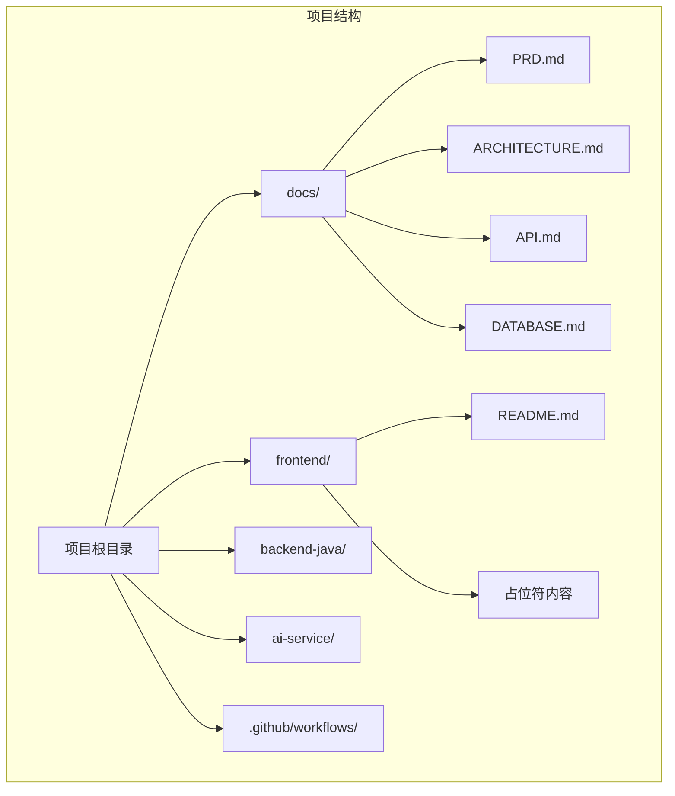

**图表来源**
- [README.md:58-82](file://README.md#L58-L82)
- [frontend/README.md:1-63](file://frontend/README.md#L1-L63)

**章节来源**
- [README.md:58-82](file://README.md#L58-L82)
- [frontend/README.md:1-63](file://frontend/README.md#L1-L63)

## 核心组件

根据PRD和API设计，前端系统需要实现以下核心组件：

### 页面组件架构

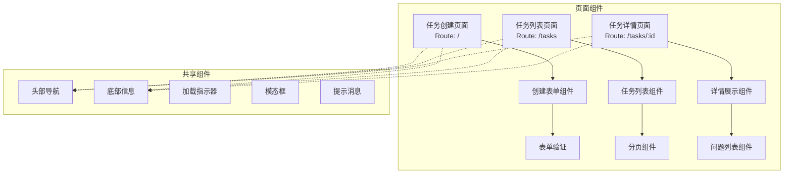

**图表来源**
- [frontend/README.md:42-49](file://frontend/README.md#L42-L49)
- [docs/API.md:54-241](file://docs/API.md#L54-L241)

### 数据流设计

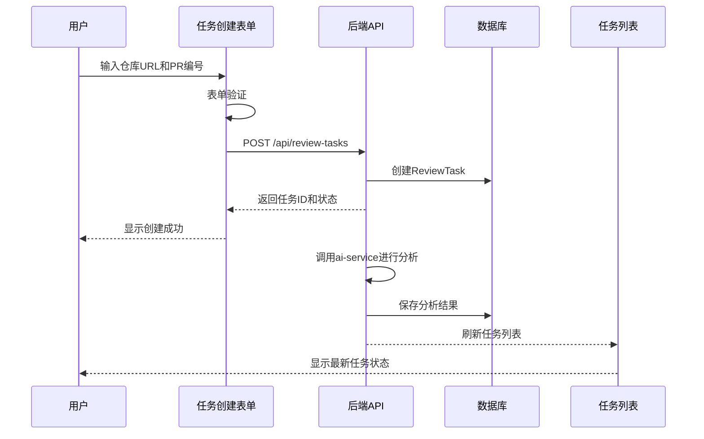

**图表来源**
- [docs/ARCHITECTURE.md:139-168](file://docs/ARCHITECTURE.md#L139-L168)
- [docs/API.md:56-96](file://docs/API.md#L56-L96)

**章节来源**
- [frontend/README.md:25-49](file://frontend/README.md#L25-L49)
- [docs/PRD.md:125-169](file://docs/PRD.md#L125-L169)
- [docs/API.md:54-241](file://docs/API.md#L54-L241)

## 架构概览

前端系统采用现代化的单页应用(SPA)架构，基于Vue 3或React框架构建，确保良好的用户体验和开发效率。

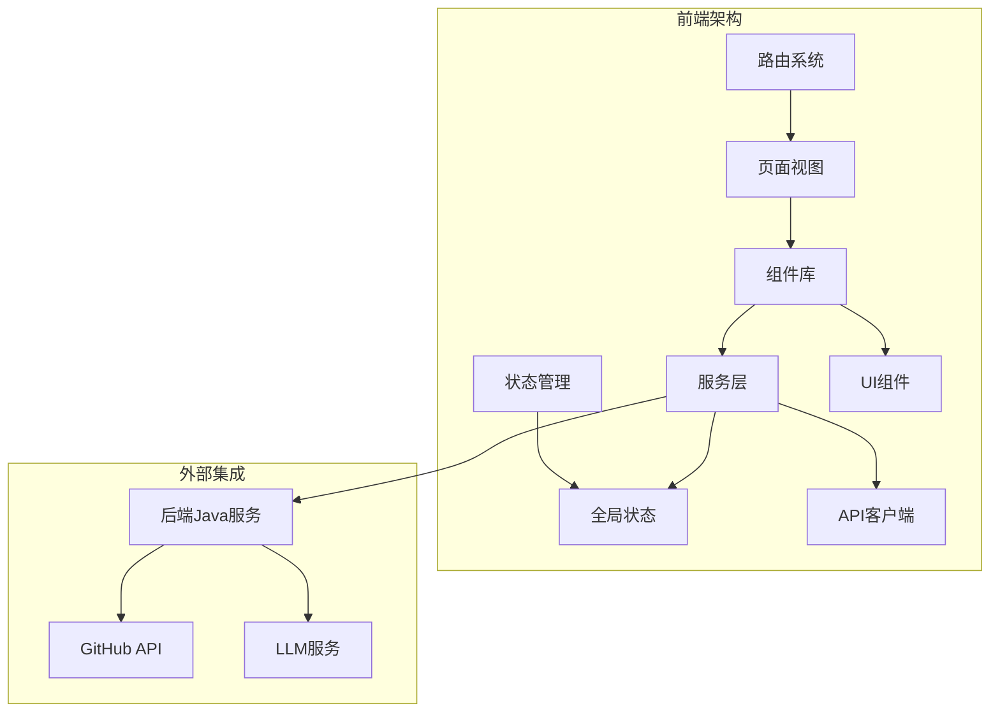

**图表来源**
- [docs/ARCHITECTURE.md:19-52](file://docs/ARCHITECTURE.md#L19-L52)
- [docs/PRD.md:29-43](file://docs/PRD.md#L29-L43)

### 技术栈选择

根据项目规划，前端框架将在Vue 3和React之间选择，两者都支持TypeScript，具备优秀的生态和社区支持。

**章节来源**
- [frontend/README.md:19-22](file://frontend/README.md#L19-L22)
- [docs/ARCHITECTURE.md:22-25](file://docs/ARCHITECTURE.md#L22-L25)

## 详细组件分析

### 任务创建表单组件

任务创建表单是用户交互的核心入口，需要提供直观的输入界面和完善的错误处理机制。

#### 表单设计规范

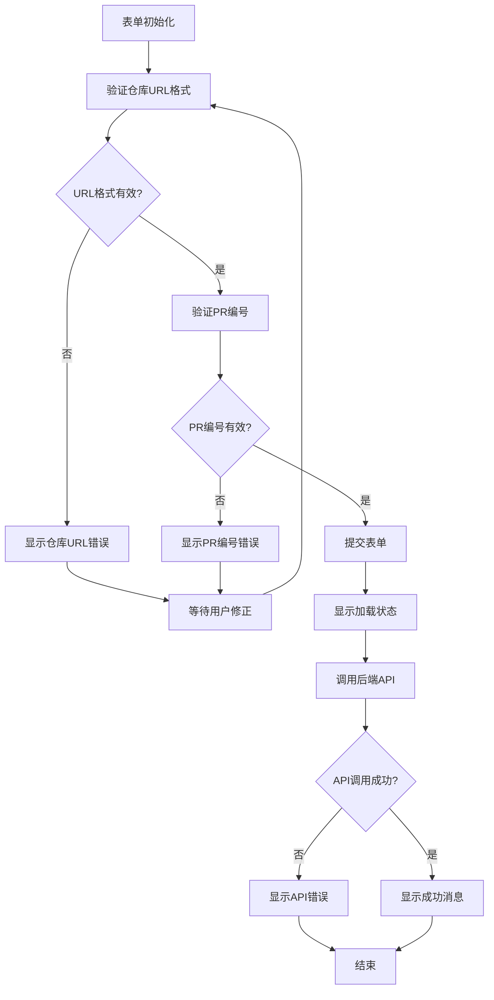

**图表来源**
- [docs/API.md:64-96](file://docs/API.md#L64-L96)
- [frontend/README.md:27-29](file://frontend/README.md#L27-L29)

#### 表单字段设计

| 字段名 | 类型 | 必填 | 验证规则 | 描述 |
|--------|------|------|----------|------|
| repoUrl | string | 是 | GitHub URL格式 | GitHub仓库地址，格式：`https://github.com/{owner}/{repo}` |
| prNumber | integer | 是 | 正整数，大于0 | Pull Request编号 |

#### 表单验证策略

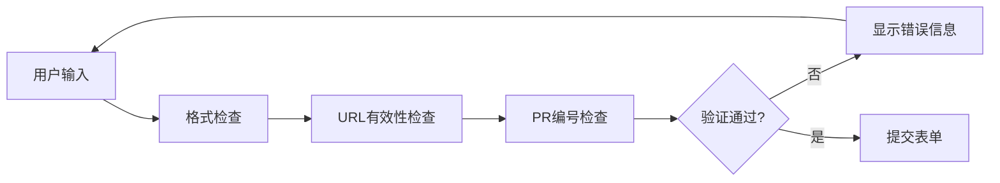

**图表来源**
- [docs/API.md:73-77](file://docs/API.md#L73-L77)
- [docs/API.md:43-51](file://docs/API.md#L43-L51)

**章节来源**
- [frontend/README.md:27-29](file://frontend/README.md#L27-L29)
- [docs/API.md:64-96](file://docs/API.md#L64-L96)

### 任务列表展示组件

任务列表组件需要展示用户的任务历史，提供状态筛选、分页浏览和快速跳转功能。

#### 列表数据结构

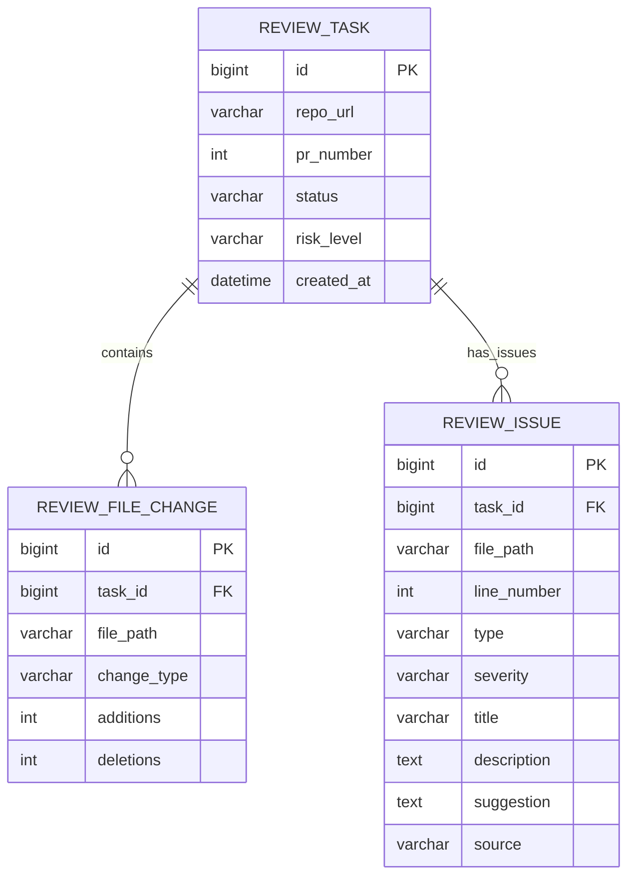

**图表来源**
- [docs/DATABASE.md:22-134](file://docs/DATABASE.md#L22-L134)
- [docs/PRD.md:127-169](file://docs/PRD.md#L127-L169)

#### 列表展示设计

| 字段 | 显示内容 | 样式要求 | 功能特性 |
|------|----------|----------|----------|
| taskId | 任务ID | 数字样式，灰色字体 | 点击查看详情 |
| repoUrl | 仓库链接 | 蓝色超链接，下划线 | 外部链接跳转 |
| prNumber | PR编号 | 粗体，突出显示 | 点击查看详情 |
| status | 任务状态 | 状态标签，彩色标识 | 实时状态更新 |
| riskLevel | 风险等级 | 风险徽章，颜色区分 | 高亮显示 |
| createdAt | 创建时间 | 相对时间格式 | 格式化显示 |

**章节来源**
- [docs/API.md:114-142](file://docs/API.md#L114-L142)
- [docs/DATABASE.md:22-56](file://docs/DATABASE.md#L22-L56)

### 任务详情页面组件

任务详情页面是整个系统的核心，需要清晰展示审查报告的各个方面。

#### 详情页面布局

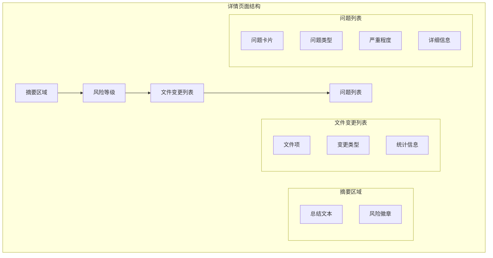

**图表来源**
- [docs/API.md:159-193](file://docs/API.md#L159-L193)
- [docs/PRD.md:104-122](file://docs/PRD.md#L104-L122)

#### 问题展示组件

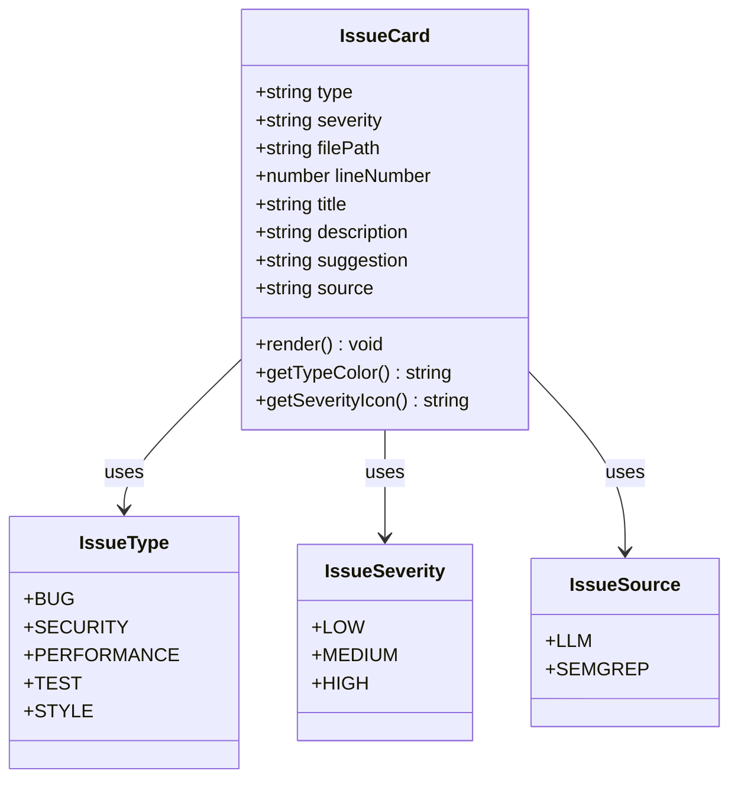

**图表来源**
- [docs/PRD.md:104-122](file://docs/PRD.md#L104-L122)
- [docs/API.md:218-230](file://docs/API.md#L218-L230)

**章节来源**
- [docs/API.md:159-193](file://docs/API.md#L159-L193)
- [docs/PRD.md:104-122](file://docs/PRD.md#L104-L122)

## 依赖关系分析

前端系统的依赖关系相对简单，主要依赖于后端API提供的数据和服务。

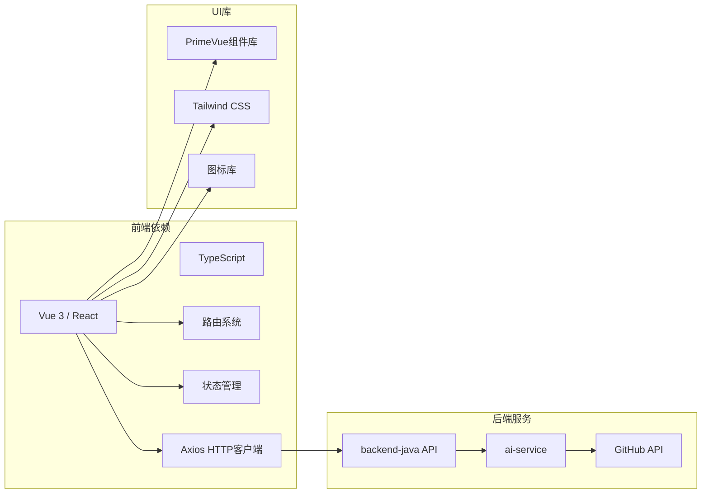

**图表来源**
- [docs/ARCHITECTURE.md:19-52](file://docs/ARCHITECTURE.md#L19-L52)
- [frontend/README.md:19-22](file://frontend/README.md#L19-L22)

### 组件耦合度分析

前端组件遵循低耦合高内聚的设计原则：

- **页面组件**：独立负责特定页面的渲染和交互
- **共享组件**：提供跨页面复用的功能组件
- **服务层**：封装API调用和数据处理逻辑
- **状态管理**：集中管理应用状态

**章节来源**
- [docs/ARCHITECTURE.md:56-72](file://docs/ARCHITECTURE.md#L56-L72)
- [frontend/README.md:34-39](file://frontend/README.md#L34-L39)

## 性能考虑

### 加载性能优化

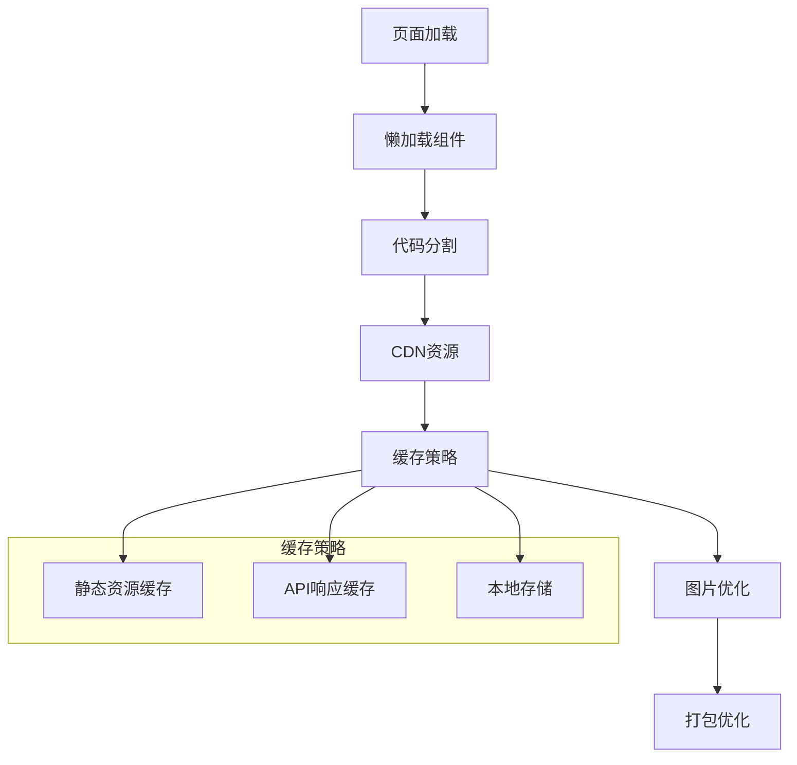

### 渲染性能优化

- **虚拟滚动**：对于大量任务列表使用虚拟滚动技术
- **防抖节流**：搜索和过滤操作使用防抖节流
- **组件懒加载**：非关键组件按需加载
- **图片懒加载**：详情页图片使用懒加载

### 网络性能优化

- **HTTP缓存**：合理设置缓存头
- **请求合并**：多个小请求合并为批量请求
- **错误重试**：网络错误自动重试机制
- **离线支持**：基本功能离线可用

## 故障排除指南

### 常见问题诊断

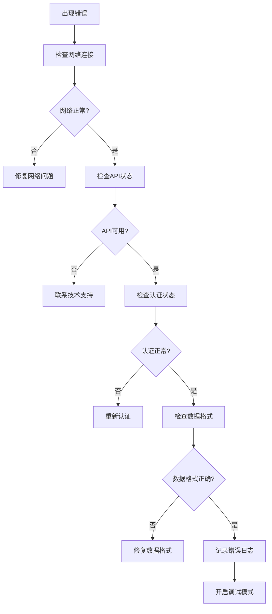

### 错误处理策略

| 错误类型 | 处理策略 | 用户提示 |
|----------|----------|----------|
| 网络错误 | 自动重试3次，显示重试按钮 | "网络连接失败，请检查网络设置" |
| API错误 | 显示具体错误信息，提供重试选项 | "服务器暂时不可用，请稍后再试" |
| 数据错误 | 清晰的错误描述，引导用户修正 | "输入格式不正确，请按照要求填写" |
| 超时错误 | 显示加载状态，提供取消选项 | "请求超时，请检查网络或稍后重试" |

**章节来源**
- [docs/API.md:31-51](file://docs/API.md#L31-L51)
- [docs/ARCHITECTURE.md:170-180](file://docs/ARCHITECTURE.md#L170-L180)

## 结论

CodeReviewX的前端UI组件和样式系统设计充分体现了现代Web应用的最佳实践。通过文档驱动的开发方式，确保了所有功能都建立在完善的需求分析和架构设计基础上。

该系统具有以下优势：

1. **清晰的组件架构**：模块化设计便于维护和扩展
2. **完善的错误处理**：多层防护确保用户体验
3. **性能优化策略**：从加载到渲染的全方位优化
4. **可访问性支持**：符合WCAG标准的无障碍设计
5. **跨浏览器兼容**：支持主流浏览器的稳定运行

随着后续Round的推进，这些设计原则将继续指导前端代码的实现，确保最终交付的产品既美观又实用。

## 附录

### 开发环境配置

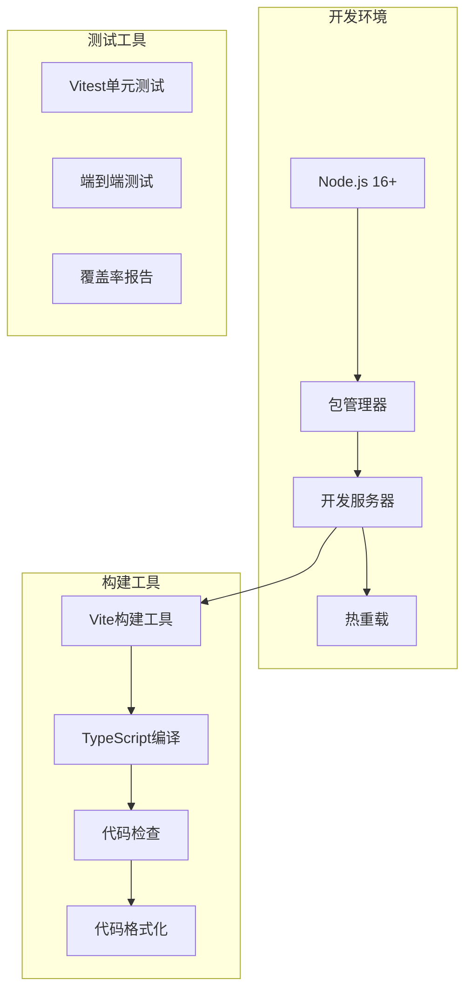

### 最佳实践清单

- **组件设计**：单一职责，可复用性强
- **样式管理**：CSS-in-JS或CSS Modules，避免样式冲突
- **状态管理**：集中式状态管理，易于调试
- **路由设计**：清晰的路由结构，支持SEO
- **国际化**：预留国际化支持
- **主题系统**：深色/浅色主题切换
- **响应式设计**：移动端优先的响应式布局