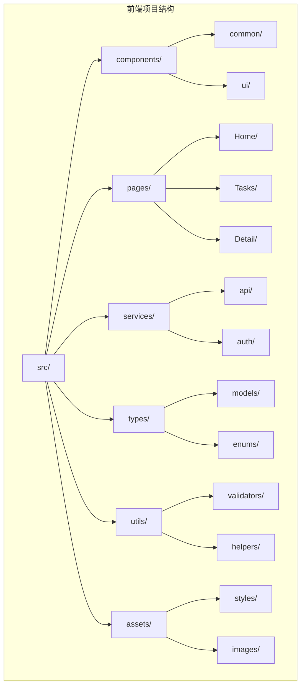
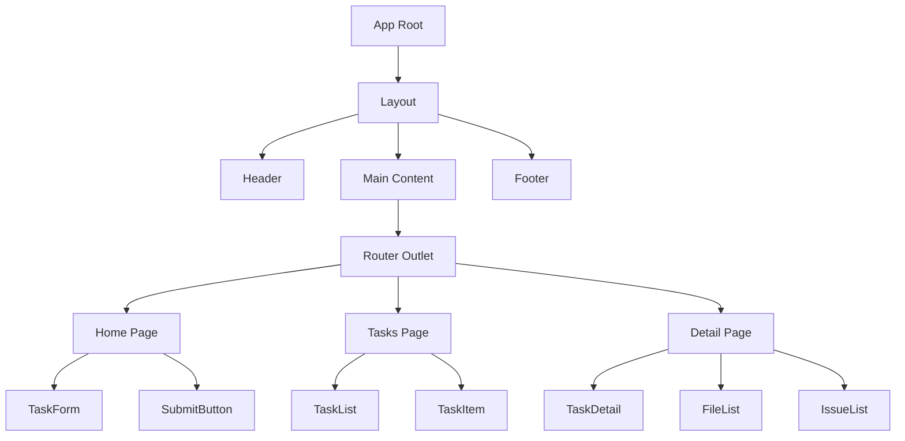
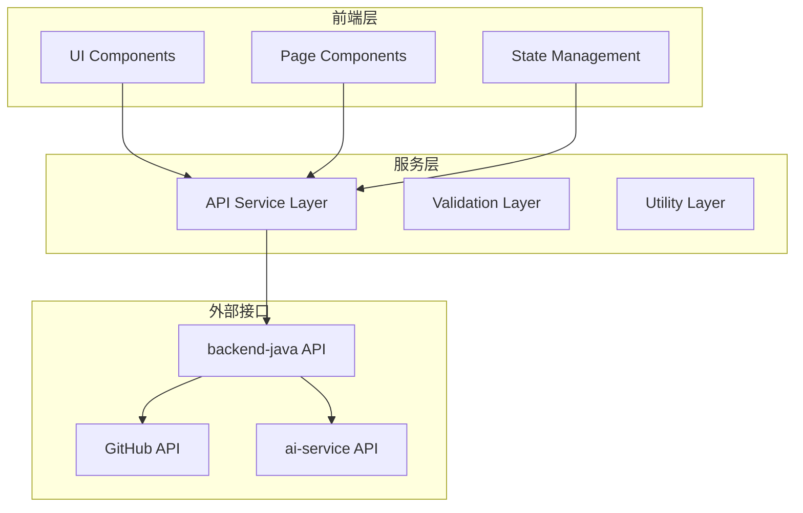
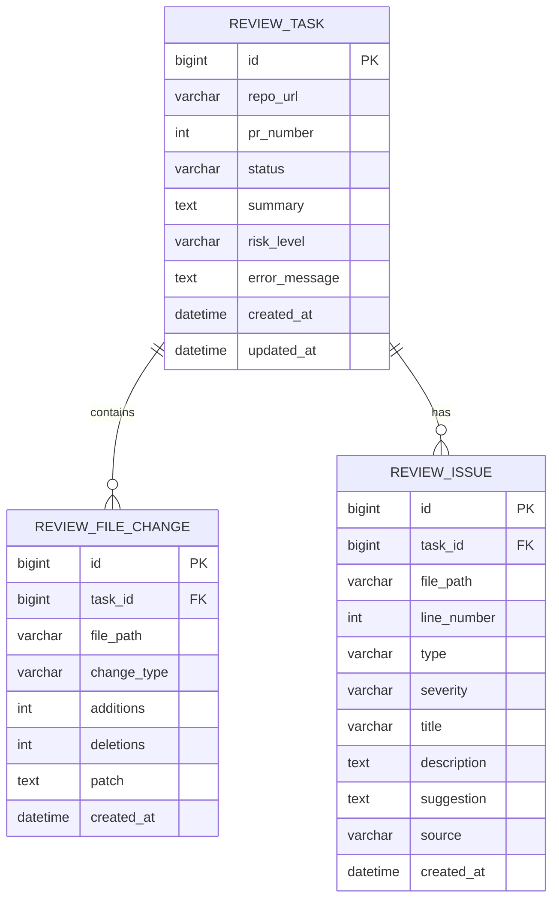
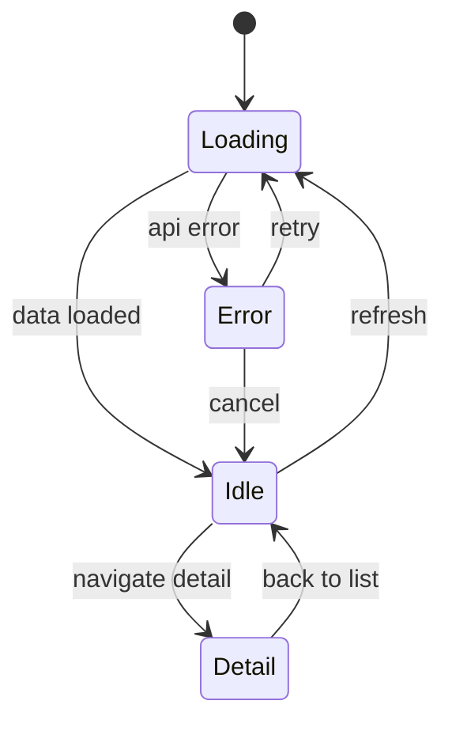
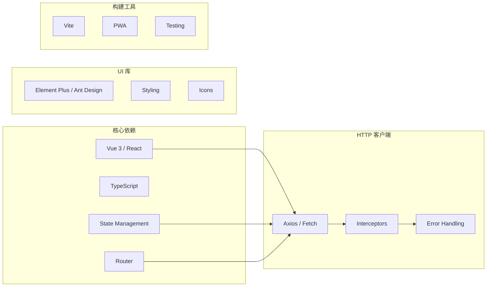
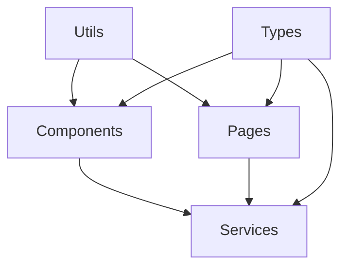
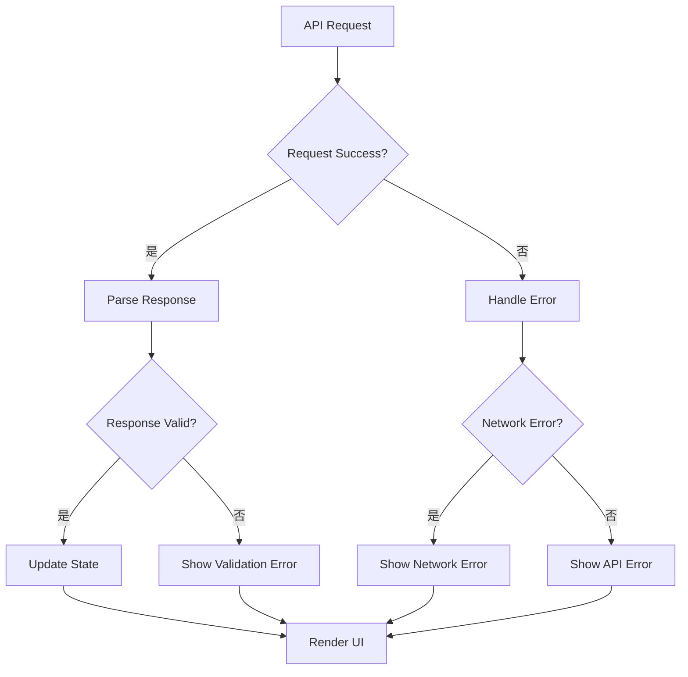

# 前端应用模块

<cite>
**本文引用的文件**
- [frontend/README.md](file://frontend/README.md)
- [README.md](file://README.md)
- [docker-compose.yml](file://docker-compose.yml)
- [docs/PRD.md](file://docs/PRD.md)
- [docs/ARCHITECTURE.md](file://docs/ARCHITECTURE.md)
- [docs/API.md](file://docs/API.md)
- [docs/DATABASE.md](file://docs/DATABASE.md)
</cite>

## 目录
1. [简介](#简介)
2. [项目结构](#项目结构)
3. [核心组件](#核心组件)
4. [架构概览](#架构概览)
5. [详细组件分析](#详细组件分析)
6. [依赖关系分析](#依赖关系分析)
7. [性能考虑](#性能考虑)
8. [故障排除指南](#故障排除指南)
9. [结论](#结论)
10. [附录](#附录)

## 简介

CodeReviewX 是一个面向 GitHub Pull Request 的智能代码审查与修复建议代理系统。前端模块作为用户界面层，负责与用户交互并展示来自后端 Java 服务的代码审查结果。

### 项目定位
- **系统角色**：面向 GitHub Pull Request 的智能代码审查与修复建议 Agent
- **当前阶段**：MVP 需求定义阶段
- **技术栈**：Vue 3 或 React（TypeScript）
- **开发状态**：Round 01 占位符状态，无实际前端代码实现

### 核心工作流
```text
用户输入 repoUrl + prNumber
        ↓
backend-java 创建 ReviewTask
        ↓
backend-java 调用 ai-service
        ↓
ai-service 拉取 GitHub PR diff
        ↓
ai-service 解析 PR 文件变更
        ↓
ai-service 调用 Semgrep 进行静态分析
        ↓
ai-service 调用 mock LLM 或真实 LLM 生成 Review 结果
        ↓
backend-java 保存 Review 结果
        ↓
用户在 frontend 查看报告
```

**章节来源**
- [README.md:31-56](file://README.md#L31-L56)
- [docs/PRD.md:37-57](file://docs/PRD.md#L37-L57)

## 项目结构

前端模块采用模块化的项目结构，遵循现代前端开发的最佳实践。以下是推荐的项目组织方式：



**图表来源**
- [frontend/README.md:42-49](file://frontend/README.md#L42-L49)

### 目录结构说明

- **src/**: 源代码根目录
  - **components/**: 可复用的 UI 组件
  - **pages/**: 页面级组件
  - **services/**: API 服务和业务逻辑
  - **types/**: TypeScript 类型定义
  - **utils/**: 工具函数和辅助方法
  - **assets/**: 静态资源文件

**章节来源**
- [frontend/README.md:42-49](file://frontend/README.md#L42-L49)

## 核心组件

### 页面组件架构

前端应用将包含以下核心页面组件：

#### 1. 任务创建页面 (`Home`)
- **功能**：提供 GitHub 仓库 URL 和 PR 编号输入表单
- **验证**：URL 格式验证、PR 编号有效性检查
- **提交**：调用后端 API 创建 Review 任务

#### 2. 任务列表页面 (`Tasks`)
- **功能**：显示所有提交的任务列表
- **内容**：任务 ID、仓库地址、PR 编号、状态、风险等级、创建时间
- **交互**：分页加载、状态筛选、排序功能

#### 3. 任务详情页面 (`Detail`)
- **功能**：展示单个任务的完整审查报告
- **内容**：任务摘要、风险等级、变更文件列表、问题列表
- **展示**：Markdown 渲染、代码高亮、问题分类

### 组件层次结构



**图表来源**
- [frontend/README.md:25-31](file://frontend/README.md#L25-L31)

**章节来源**
- [frontend/README.md:25-31](file://frontend/README.md#L25-L31)

## 架构概览

前端应用采用分层架构设计，严格遵循模块边界和职责分离原则：



**图表来源**
- [docs/ARCHITECTURE.md:19-52](file://docs/ARCHITECTURE.md#L19-L52)

### 架构原则

1. **单一职责原则**：前端只负责展示数据、提供用户输入表单、渲染审查报告
2. **边界清晰**：不直接调用 ai-service、GitHub API 或 LLM
3. **数据一致性**：通过后端 API 统一数据源
4. **错误隔离**：前端不处理业务状态，只展示结果

**章节来源**
- [docs/ARCHITECTURE.md:56-72](file://docs/ARCHITECTURE.md#L56-L72)

## 详细组件分析

### API 通信层

前端与后端的通信遵循严格的 REST API 规范：

#### 核心 API 端点

| 动作 | HTTP 方法 | 端点 | 描述 |
|------|-----------|------|------|
| 创建任务 | POST | `/api/review-tasks` | 创建新的代码审查任务 |
| 获取任务列表 | GET | `/api/review-tasks` | 获取所有任务列表 |
| 获取任务详情 | GET | `/api/review-tasks/{id}` | 获取指定任务的详细信息 |

#### 数据模型



**图表来源**
- [docs/DATABASE.md:22-134](file://docs/DATABASE.md#L22-L134)

### 状态管理策略

#### Redux/Zustand 状态管理



**状态类型定义**：

- **TaskState**: 任务列表状态管理
- **DetailState**: 任务详情状态管理  
- **FormState**: 表单输入状态管理
- **UIState**: 用户界面状态管理

### 路由配置

```mermaid
flowchart TD
A[/] --> B[Home Page]
B --> C[Task Creation Form]
C --> D[POST /api/review-tasks]
A --> E[/tasks] --> F[Task List Page]
F --> G[GET /api/review-tasks]
F --> H[/tasks/:id] --> I[Task Detail Page]
I --> J[GET /api/review-tasks/{id}]
```

**路由配置**：

- **根路径** (`/`): 任务创建页面
- **任务列表** (`/tasks`): 显示所有任务
- **任务详情** (`/tasks/:id`): 显示特定任务详情

**章节来源**
- [frontend/README.md:42-49](file://frontend/README.md#L42-L49)

## 依赖关系分析

### 外部依赖



**图表来源**
- [frontend/README.md:19-21](file://frontend/README.md#L19-L21)

### 内部模块依赖



**依赖关系**：
- 组件依赖服务层进行数据获取
- 页面组件依赖组件库构建用户界面
- 工具模块为各层提供通用功能
- 类型定义确保类型安全

**章节来源**
- [docs/ARCHITECTURE.md:109-153](file://docs/ARCHITECTURE.md#L109-L153)

## 性能考虑

### 加载优化

1. **代码分割**：按路由拆分代码，实现懒加载
2. **图片优化**：使用现代格式和适当的尺寸
3. **缓存策略**：合理设置 HTTP 缓存头
4. **CDN 使用**：静态资源通过 CDN 加速

### 渲染优化

1. **虚拟滚动**：大量数据列表使用虚拟滚动
2. **防抖节流**：搜索和过滤操作添加防抖
3. **组件缓存**：合理使用 keep-alive 缓存
4. **异步渲染**：大数据量渲染采用异步策略

### 网络优化

1. **请求合并**：多个小请求合并为批量请求
2. **增量更新**：支持部分数据更新
3. **离线支持**：提供基本的离线功能
4. **重试机制**：网络异常自动重试

## 故障排除指南

### 常见问题及解决方案

#### API 调用失败

**症状**：网络请求超时或返回错误状态码

**排查步骤**：
1. 检查 VITE_API_BASE_URL 环境变量配置
2. 验证后端服务是否正常运行
3. 查看网络面板确认请求响应
4. 检查 CORS 配置

#### 数据格式错误

**症状**：API 响应格式不符合预期

**排查步骤**：
1. 验证 API 响应结构
2. 检查数据转换逻辑
3. 确认 TypeScript 类型定义
4. 添加数据验证中间件

#### 状态管理异常

**症状**：组件状态不同步或更新延迟

**排查步骤**：
1. 检查状态更新的原子性
2. 验证副作用的正确清理
3. 确认订阅关系的正确建立
4. 添加状态日志追踪

### 错误处理策略



**章节来源**
- [docs/API.md:31-50](file://docs/API.md#L31-L50)

## 结论

前端模块作为 CodeReviewX 系统的用户界面层，承担着重要的用户体验责任。基于现有的架构设计和 API 规范，前端开发应该重点关注以下方面：

1. **严格遵守模块边界**：不直接调用 ai-service、GitHub API 或 LLM
2. **实现响应式设计**：支持多种设备和屏幕尺寸
3. **提供良好的错误处理**：确保用户在各种异常情况下的体验
4. **保持代码质量**：使用 TypeScript 和现代前端开发工具
5. **关注性能优化**：实现快速加载和流畅的用户交互

随着后续 Round 的推进，前端模块将逐步完善其功能实现，为用户提供完整的代码审查体验。

## 附录

### 开发环境配置

#### 环境变量

```env
# 基础配置
VITE_APP_NAME=CodeReviewX
VITE_APP_VERSION=1.0.0

# API 配置
VITE_API_BASE_URL=http://localhost:8080
VITE_API_TIMEOUT=30000

# 功能开关
VITE_ENABLE_MOCK=false
VITE_DEBUG_MODE=false
```

#### 依赖安装命令

```bash
# 使用 npm
npm install

# 使用 yarn  
yarn install

# 使用 pnpm
pnpm install
```

### 开发工具推荐

1. **IDE**: VS Code + TypeScript Vue/React 插件
2. **调试**: Chrome DevTools + React DevTools/Vue DevTools
3. **代码格式化**: Prettier + ESLint
4. **Git 工具**: GitLens + GitHub Extension
5. **API 测试**: Postman 或 Insomnia

### 最佳实践清单

- 使用语义化 HTML 和 ARIA 属性
- 实现键盘导航和焦点管理
- 提供加载状态和进度指示
- 实现错误边界和降级策略
- 编写单元测试和集成测试
- 使用版本控制和代码审查流程
- 维护文档和开发指南