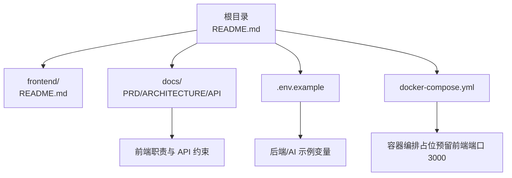
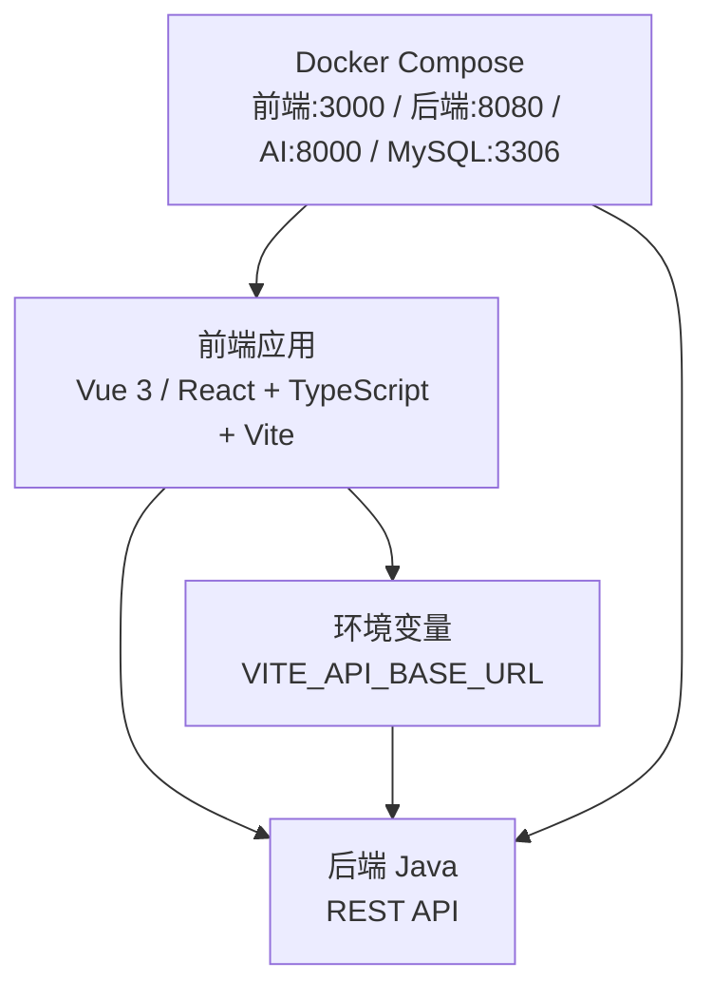
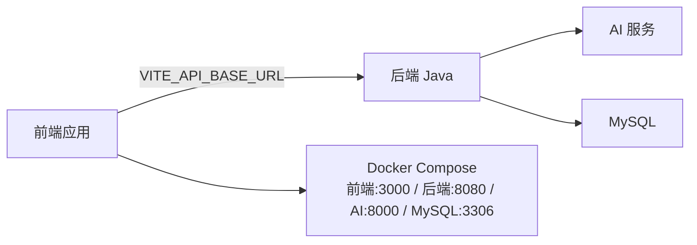

# 框架选择与项目配置

<cite>
**本文引用的文件**
- [README.md](file://README.md)
- [frontend/README.md](file://frontend/README.md)
- [.env.example](file://.env.example)
- [docker-compose.yml](file://docker-compose.yml)
- [docs/ARCHITECTURE.md](file://docs/ARCHITECTURE.md)
- [docs/PRD.md](file://docs/PRD.md)
- [docs/API.md](file://docs/API.md)
</cite>

## 目录
1. [简介](#简介)
2. [项目结构](#项目结构)
3. [核心组件](#核心组件)
4. [架构总览](#架构总览)
5. [详细组件分析](#详细组件分析)
6. [依赖关系分析](#依赖关系分析)
7. [性能考虑](#性能考虑)
8. [故障排查指南](#故障排查指南)
9. [结论](#结论)
10. [附录](#附录)

## 简介
本文件围绕前端框架选择与项目配置展开，目标是为 CodeReviewX 前端模块（Vue 3 或 React）提供技术选型依据、初始化步骤、TypeScript 集成、包管理器与构建工具（Vite）配置、开发服务器设置、环境变量（尤其是 VITE_API_BASE_URL）使用方式、以及代码规范（ESLint 与 Prettier）落地建议。当前仓库处于 Round 01，前端页面代码尚未实现，但已明确前端职责边界与 API 约束，便于在后续轮次中高效落地。

## 项目结构
- 顶层 README 提供项目概述、模块规划与开发原则。
- frontend 目录为前端模块占位，当前仅包含 README，未包含任何前端源码或配置文件。
- docs 子目录包含 PRD、架构设计、API 设计等文档，明确了前端职责边界与对外 API。
- .env.example 提供后端与 AI 服务的示例环境变量，前端环境变量在 ARCHITECTURE.md 中定义。
- docker-compose.yml 为容器编排占位，预留前端服务端口 3000。

图表来源
- [README.md:1-120](file://README.md#L1-L120)
- [frontend/README.md:1-63](file://frontend/README.md#L1-L63)
- [.env.example:1-29](file://.env.example#L1-L29)
- [docker-compose.yml:1-14](file://docker-compose.yml#L1-L14)
- [docs/PRD.md:1-218](file://docs/PRD.md#L1-L218)
- [docs/ARCHITECTURE.md:1-417](file://docs/ARCHITECTURE.md#L1-L417)
- [docs/API.md:1-378](file://docs/API.md#L1-L378)

章节来源
- [README.md:58-82](file://README.md#L58-L82)
- [frontend/README.md:1-63](file://frontend/README.md#L1-L63)
- [.env.example:1-29](file://.env.example#L1-L29)
- [docker-compose.yml:1-14](file://docker-compose.yml#L1-L14)
- [docs/PRD.md:1-218](file://docs/PRD.md#L1-L218)
- [docs/ARCHITECTURE.md:1-417](file://docs/ARCHITECTURE.md#L1-L417)
- [docs/API.md:1-378](file://docs/API.md#L1-L378)

## 核心组件
- 前端职责边界
  - 仅与后端 Java 交互，不直接调用 AI 服务、GitHub API 或 LLM。
  - 负责任务创建表单、任务列表、任务详情与报告展示。
- API 约束
  - 前端通过后端提供的 REST API 完成任务创建、列表查询与详情获取。
  - VITE_API_BASE_URL 控制后端基础 URL，支持本地与容器网络两种模式。
- 环境变量
  - 后端与 AI 服务示例变量位于 .env.example。
  - 前端变量 VITE_API_BASE_URL 位于 ARCHITECTURE.md 的“配置与环境变量”章节。

章节来源
- [frontend/README.md:25-62](file://frontend/README.md#L25-L62)
- [docs/ARCHITECTURE.md:345-370](file://docs/ARCHITECTURE.md#L345-L370)
- [.env.example:1-29](file://.env.example#L1-L29)

## 架构总览
前端采用 Vue 3 或 React，TypeScript 开发，Vite 作为构建与开发服务器工具，通过 VITE_API_BASE_URL 与后端 Java 通信。容器编排中前端服务监听 3000 端口。

图表来源
- [docs/ARCHITECTURE.md:19-52](file://docs/ARCHITECTURE.md#L19-L52)
- [docs/ARCHITECTURE.md:365-370](file://docs/ARCHITECTURE.md#L365-L370)
- [docker-compose.yml:7-13](file://docker-compose.yml#L7-L13)

章节来源
- [docs/ARCHITECTURE.md:19-52](file://docs/ARCHITECTURE.md#L19-L52)
- [docs/ARCHITECTURE.md:365-370](file://docs/ARCHITECTURE.md#L365-L370)
- [docker-compose.yml:7-13](file://docker-compose.yml#L7-L13)

## 详细组件分析

### 前端框架选型：Vue 3 vs React
- Vue 3 优势
  - 组件化与模板语法易学，适合快速搭建页面与数据展示。
  - Composition API 支持更好的逻辑复用与类型推断，配合 TypeScript 使用体验良好。
  - 生态完善，与 Vite 集成顺畅，热更新与开发体验佳。
- React 优势
  - 函数组件 + Hooks 逻辑清晰，适合复杂交互与状态管理。
  - 社区成熟，生态丰富，TypeScript 与 Vite 配置成熟。
  - 易于扩展至多页面应用与路由场景。
- 选择标准
  - 团队熟悉度与历史经验。
  - 项目规模与迭代节奏（MVP 阶段建议降低学习成本，Vue 3 可更快上手）。
  - 是否需要强状态管理（React + 状态库可能更合适）。
  - 与后端 API 的对接复杂度（两者均可胜任）。

章节来源
- [frontend/README.md:19-22](file://frontend/README.md#L19-L22)

### TypeScript 集成
- 在 Vue 3 或 React 项目中启用 TypeScript，确保类型安全与开发体验。
- 建议在 Vite 配置中开启严格模式与合理的 tsconfig 设置，提升类型检查质量。
- 与后端 API 的 DTO/Schema 对齐，尽量生成或共享类型定义，减少耦合。

章节来源
- [frontend/README.md:19-22](file://frontend/README.md#L19-L22)

### 包管理器选择
- 推荐使用 npm 或 pnpm（相比 yarn 更快且节省磁盘空间）。
- 保持与团队一致的包管理器，避免 lockfile 冲突。
- 在 CI 中固定 Node.js 与包管理器版本，确保一致性。

章节来源
- [frontend/README.md:13-15](file://frontend/README.md#L13-L15)

### 构建工具与开发服务器：Vite
- Vite 作为开发服务器与打包工具，具备极快的冷启动与热更新能力。
- 建议启用预构建依赖缓存、按需加载与产物压缩，优化开发与生产体验。
- 与 TypeScript、Vue/React 生态无缝衔接，推荐使用官方模板起步。

章节来源
- [frontend/README.md:13-15](file://frontend/README.md#L13-L15)

### 环境变量配置：VITE_API_BASE_URL
- VITE_API_BASE_URL 用于控制后端基础 URL，支持本地开发与容器网络两种模式。
- 本地开发：http://localhost:8080
- 容器网络：http://backend-java:8080
- 建议在不同环境（dev/stage/prod）分别配置该变量，避免硬编码。

章节来源
- [frontend/README.md:62](file://frontend/README.md#L62)
- [docs/ARCHITECTURE.md:365-370](file://docs/ARCHITECTURE.md#L365-L370)
- [docs/API.md:11-17](file://docs/API.md#L11-L17)

### 项目初始化步骤
- 初始化前端目录与基础文件（入口 HTML、入口 TS/JS、组件目录、路由与状态管理目录）。
- 安装依赖：框架核心库、TypeScript、Vite、路由与状态管理（如需要）、ESLint、Prettier。
- 配置 Vite：开发服务器端口、代理（如需跨域）、TypeScript 支持、插件（如 Vue/React 插件）。
- 配置环境变量：复制 .env.example 并设置 VITE_API_BASE_URL。
- 编写基础页面：任务创建表单、任务列表、任务详情页。
- 编写 API 客户端：封装后端 REST API 调用，统一错误处理与重试策略。
- 编写基础样式与主题：统一字体、颜色、间距与组件样式。
- 编写代码规范：ESLint 与 Prettier 配置，CI 中执行校验。

章节来源
- [frontend/README.md:13-15](file://frontend/README.md#L13-L15)
- [docs/API.md:54-241](file://docs/API.md#L54-L241)

### 基本项目结构说明
- src/
  - components/：可复用 UI 组件
  - pages/：页面级组件（创建任务、任务列表、任务详情）
  - router/：路由配置
  - store/：状态管理（可选）
  - services/：API 客户端与业务服务
  - assets/：静态资源
  - styles/：全局样式与主题
  - main.ts/js：应用入口
- public/index.html：HTML 模板
- vite.config.ts：Vite 配置
- tsconfig.json：TypeScript 配置
- .env / .env.local：环境变量文件

章节来源
- [frontend/README.md:13-15](file://frontend/README.md#L13-L15)

### 代码规范：ESLint 与 Prettier
- ESLint
  - 选择合适的规则集（如 @typescript-eslint、eslint-plugin-react 或 @volar/eslint-plugin）。
  - 配置与 TypeScript/框架语法兼容，开启严格模式。
  - 在 CI 中执行 lint 校验，失败则阻止合并。
- Prettier
  - 统一缩进、引号、尾逗号等格式规则。
  - 与 ESLint 配合，必要时使用 eslint-config-prettier 关闭冲突规则。
  - 在提交前自动格式化，或在 CI 中检查格式一致性。

章节来源
- [frontend/README.md:13-15](file://frontend/README.md#L13-L15)

## 依赖关系分析
- 前端仅依赖后端 Java 提供的 REST API，不直接依赖 AI 服务、GitHub API 或 LLM。
- VITE_API_BASE_URL 决定前端与后端的通信路径，贯穿开发与部署。
- 容器编排中，前端服务端口 3000，后端服务端口 8080，AI 服务端口 8000，MySQL 端口 3306。

图表来源
- [docs/ARCHITECTURE.md:365-370](file://docs/ARCHITECTURE.md#L365-L370)
- [docker-compose.yml:7-13](file://docker-compose.yml#L7-L13)

章节来源
- [docs/ARCHITECTURE.md:365-370](file://docs/ARCHITECTURE.md#L365-L370)
- [docker-compose.yml:7-13](file://docker-compose.yml#L7-L13)

## 性能考虑
- Vite 开发服务器
  - 启用依赖预构建与按需加载，减少冷启动时间。
  - 合理拆分代码与懒加载页面，优化首屏加载。
- 构建优化
  - 启用产物压缩与 Tree Shaking，移除未使用代码。
  - 使用 CDN 或外部化不常变动的依赖，降低包体积。
- 网络请求
  - 合理缓存后端响应，避免重复请求。
  - 对长列表进行虚拟滚动，减少 DOM 渲染压力。
- 环境变量
  - 在不同环境设置合适的 API 基础 URL，避免不必要的网络跳转。

章节来源
- [frontend/README.md:13-15](file://frontend/README.md#L13-L15)
- [docs/API.md:11-17](file://docs/API.md#L11-L17)

## 故障排查指南
- 环境变量未生效
  - 确认 .env 文件命名与内容正确，VITE_ 前缀仅在 Vite 中生效。
  - 检查 VITE_API_BASE_URL 是否与后端实际端口一致。
- 开发服务器无法访问
  - 检查 Vite 端口占用与防火墙设置。
  - 确认浏览器代理与 CORS 配置（如有）。
- 容器网络不通
  - 确认 docker-compose 中服务端口映射与容器网络配置。
  - 检查 VITE_API_BASE_URL 在容器网络中的可达性（使用服务名而非 localhost）。
- API 调用失败
  - 核对后端 API 路径与方法，确认鉴权与参数格式。
  - 检查统一错误响应格式与错误码含义。

章节来源
- [frontend/README.md:62](file://frontend/README.md#L62)
- [docs/API.md:31-51](file://docs/API.md#L31-L51)
- [docker-compose.yml:7-13](file://docker-compose.yml#L7-L13)

## 结论
在 CodeReviewX 的 MVP 阶段，前端采用 Vue 3 或 React 均可满足需求。建议优先考虑团队熟悉度与快速交付，结合 TypeScript 与 Vite 提升开发效率与质量。通过 VITE_API_BASE_URL 灵活适配本地与容器网络，严格遵循前端职责边界，确保与后端 API 的稳定对接。配合 ESLint 与 Prettier 的代码规范，保障代码一致性与可维护性。

## 附录
- 相关文档索引
  - PRD：产品需求与范围
  - ARCHITECTURE：系统架构与职责边界
  - API：后端 API 设计与错误码
- 建议的后续步骤
  - 在 Round 06 中完成前端实现与 Docker + CI + 文档完善。
  - 按照本文档的初始化步骤与规范要求落地前端工程。

章节来源
- [docs/PRD.md:1-218](file://docs/PRD.md#L1-L218)
- [docs/ARCHITECTURE.md:1-417](file://docs/ARCHITECTURE.md#L1-L417)
- [docs/API.md:1-378](file://docs/API.md#L1-L378)