# 组件架构设计

<cite>
**本文档引用的文件**
- [README.md](file://README.md)
- [frontend/README.md](file://frontend/README.md)
- [docs/ARCHITECTURE.md](file://docs/ARCHITECTURE.md)
- [docs/PRD.md](file://docs/PRD.md)
- [docs/API.md](file://docs/API.md)
- [docs/DATABASE.md](file://docs/DATABASE.md)
- [docker-compose.yml](file://docker-compose.yml)
</cite>

## 目录
1. [简介](#简介)
2. [项目结构](#项目结构)
3. [核心组件](#核心组件)
4. [架构概览](#架构概览)
5. [详细组件分析](#详细组件分析)
6. [依赖关系分析](#依赖关系分析)
7. [性能考虑](#性能考虑)
8. [故障排除指南](#故障排除指南)
9. [结论](#结论)
10. [附录](#附录)

## 简介

CodeReviewX是一个面向GitHub Pull Request的智能代码审查与修复建议Agent系统。该项目采用前后端分离架构，前端负责用户界面展示和用户交互，后端负责业务逻辑处理和数据持久化。

根据项目规划，前端将使用Vue 3或React框架，提供以下核心页面组件：
- Create Task表单组件：用户输入GitHub仓库URL和PR编号的任务创建页面
- Task List列表组件：显示所有提交的审查任务及其状态
- Task Detail详情组件：展示已完成任务的完整审查报告

## 项目结构

基于当前仓库结构，前端组件架构将遵循以下组织方式：

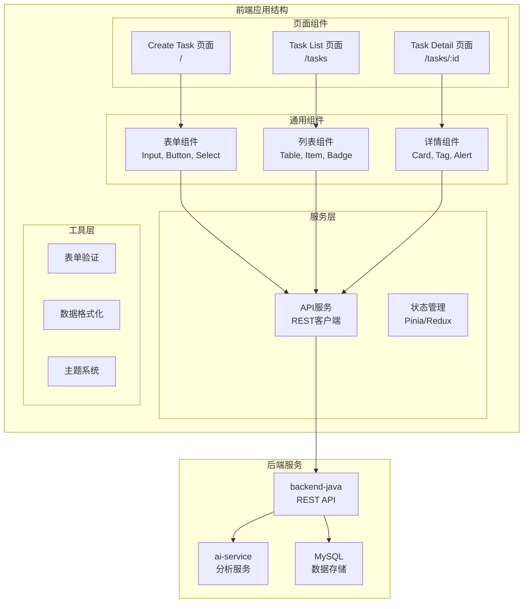

**图表来源**
- [frontend/README.md:42-63](file://frontend/README.md#L42-L63)
- [docs/ARCHITECTURE.md:19-52](file://docs/ARCHITECTURE.md#L19-L52)

**章节来源**
- [frontend/README.md:1-63](file://frontend/README.md#L1-L63)
- [docs/ARCHITECTURE.md:56-72](file://docs/ARCHITECTURE.md#L56-L72)

## 核心组件

### 组件设计原则

基于PRD和架构文档，前端组件设计遵循以下核心原则：

1. **单一职责原则**：每个组件专注于特定的功能领域
2. **可复用性**：通用组件设计为可跨页面使用的独立单元
3. **数据驱动**：组件通过props接收数据，通过事件向上通信
4. **状态隔离**：页面级状态集中管理，组件内部保持无状态
5. **错误处理**：完善的错误边界和用户友好的错误提示

### 组件层次结构

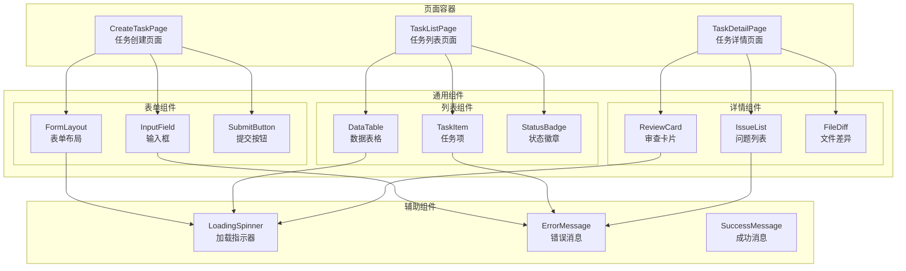

**图表来源**
- [docs/PRD.md:25-31](file://docs/PRD.md#L25-L31)
- [frontend/README.md:25-31](file://frontend/README.md#L25-L31)

**章节来源**
- [docs/PRD.md:104-122](file://docs/PRD.md#L104-L122)
- [frontend/README.md:25-31](file://frontend/README.md#L25-L31)

## 架构概览

前端组件架构采用MVVM模式，结合现代前端框架的最佳实践：

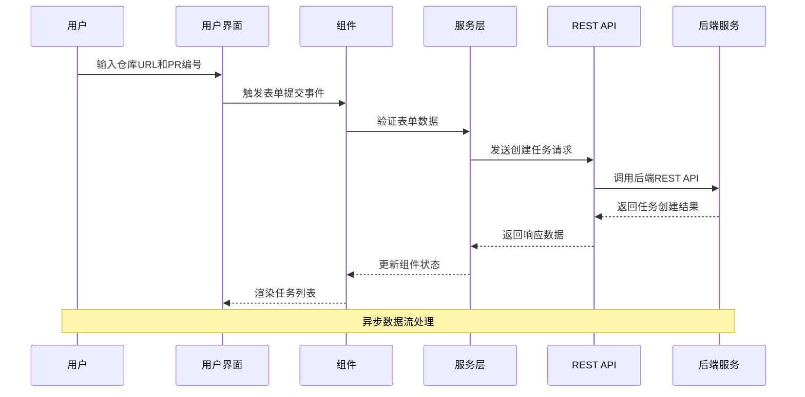

**图表来源**
- [docs/API.md:54-96](file://docs/API.md#L54-L96)
- [docs/ARCHITECTURE.md:137-168](file://docs/ARCHITECTURE.md#L137-L168)

### 状态管理模式

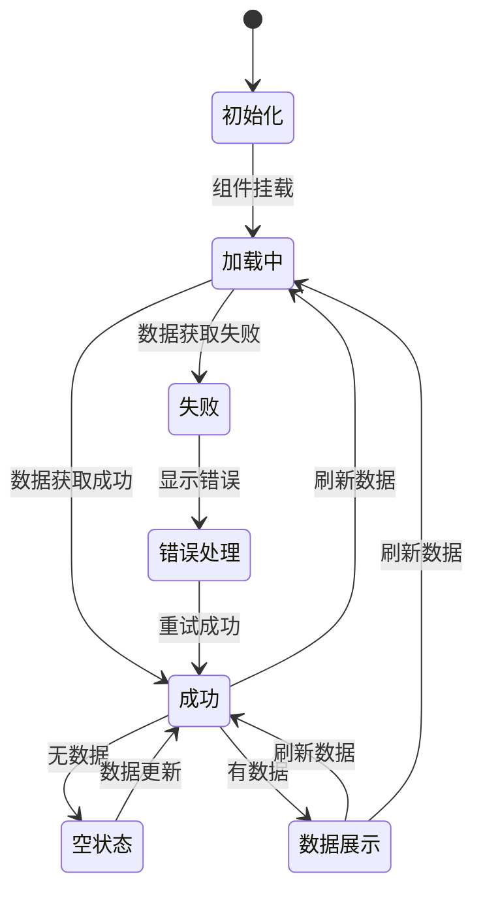

**图表来源**
- [docs/API.md:145-193](file://docs/API.md#L145-L193)
- [docs/ARCHITECTURE.md:110-134](file://docs/ARCHITECTURE.md#L110-L134)

## 详细组件分析

### Create Task表单组件

#### 组件架构设计

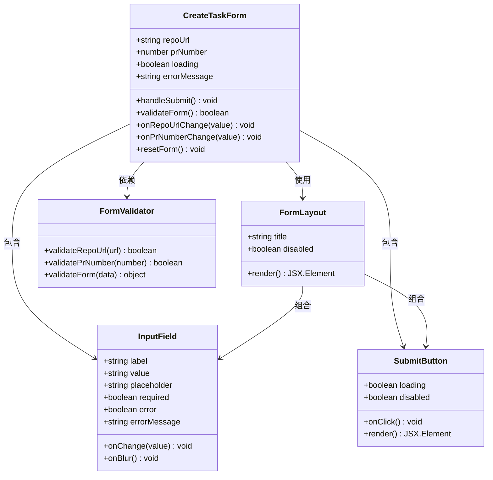

**图表来源**
- [frontend/README.md:25-31](file://frontend/README.md#L25-L31)
- [docs/API.md:54-96](file://docs/API.md#L54-L96)

#### Props传递机制

| 组件 | Props名称 | 类型 | 必填 | 描述 |
|------|-----------|------|------|------|
| CreateTaskForm | repoUrl | string | 否 | GitHub仓库URL |
| CreateTaskForm | prNumber | number | 否 | PR编号 |
| FormLayout | title | string | 否 | 表单标题 |
| FormLayout | disabled | boolean | 否 | 是否禁用表单 |
| InputField | label | string | 是 | 输入框标签 |
| InputField | value | string | 是 | 输入框值 |
| InputField | required | boolean | 否 | 是否必填 |
| SubmitButton | loading | boolean | 否 | 加载状态 |
| SubmitButton | disabled | boolean | 否 | 按钮禁用状态 |

#### 事件处理机制

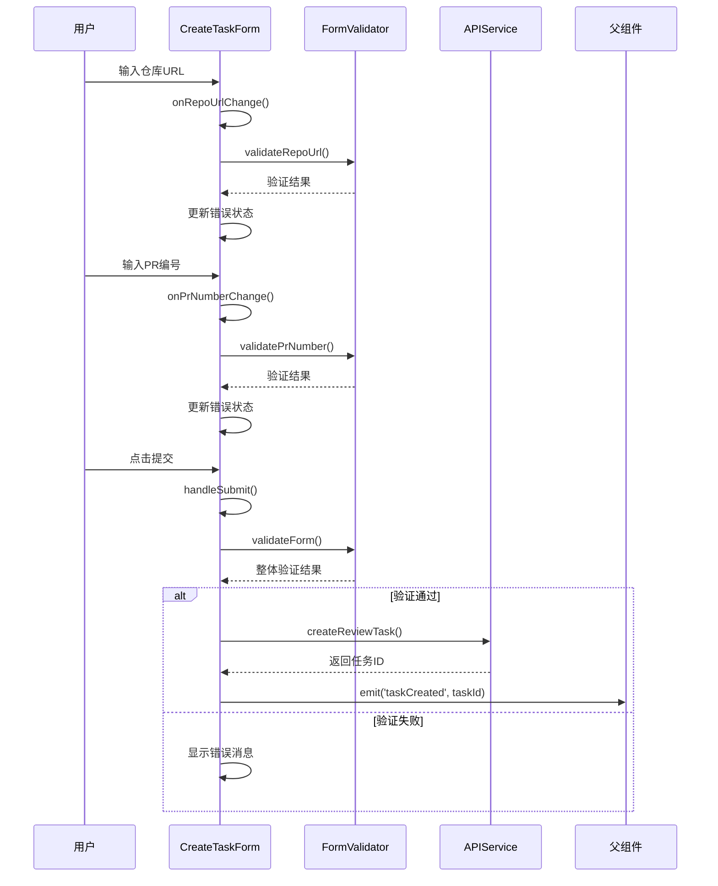

**图表来源**
- [docs/API.md:54-96](file://docs/API.md#L54-L96)
- [frontend/README.md:25-31](file://frontend/README.md#L25-L31)

**章节来源**
- [docs/API.md:54-96](file://docs/API.md#L54-L96)
- [frontend/README.md:25-31](file://frontend/README.md#L25-L31)

### Task List列表组件

#### 组件架构设计

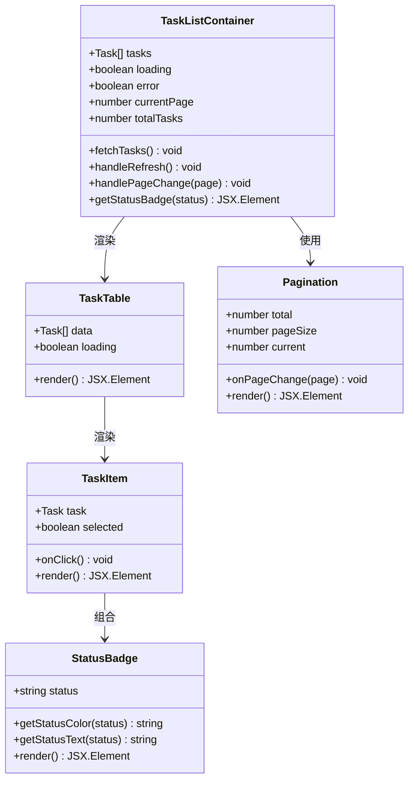

**图表来源**
- [docs/API.md:99-143](file://docs/API.md#L99-L143)
- [docs/PRD.md:127-140](file://docs/PRD.md#L127-L140)

#### 数据流设计

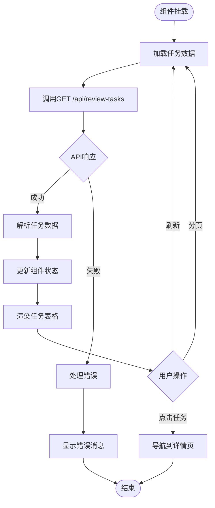

**图表来源**
- [docs/API.md:99-143](file://docs/API.md#L99-L143)
- [docs/ARCHITECTURE.md:110-134](file://docs/ARCHITECTURE.md#L110-L134)

**章节来源**
- [docs/API.md:99-143](file://docs/API.md#L99-L143)
- [docs/PRD.md:127-140](file://docs/PRD.md#L127-L140)

### Task Detail详情组件

#### 组件架构设计

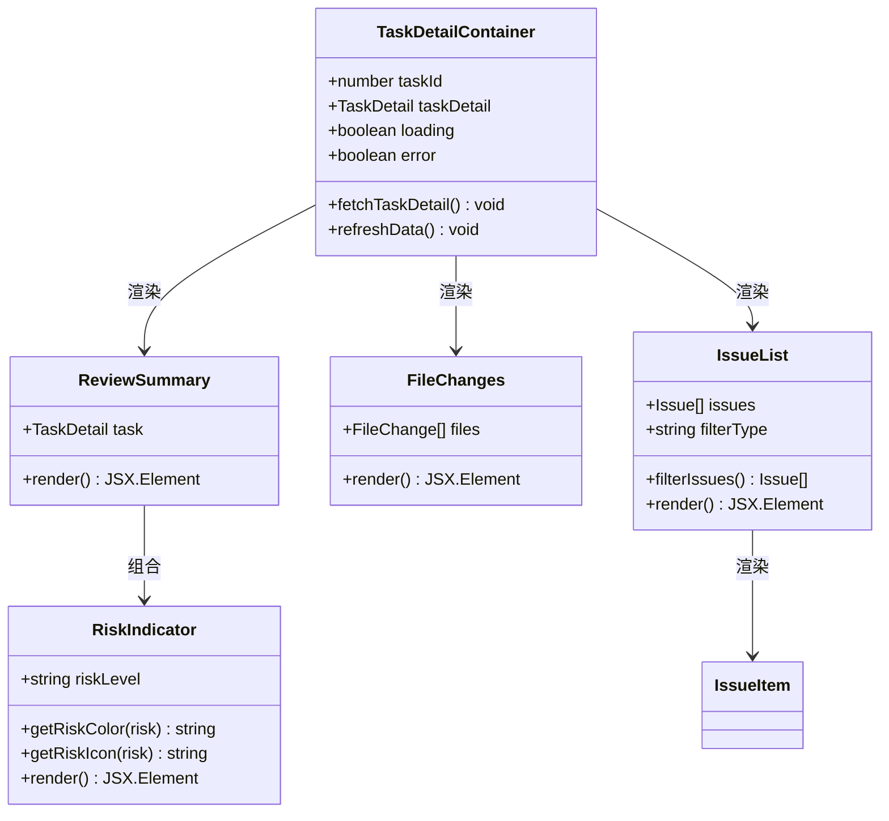

**图表来源**
- [docs/API.md:145-193](file://docs/API.md#L145-L193)
- [docs/PRD.md:141-169](file://docs/PRD.md#L141-L169)

#### 详情页面数据结构

| 字段 | 类型 | 描述 |
|------|------|------|
| taskId | long | 任务ID |
| repoUrl | string | GitHub仓库地址 |
| prNumber | integer | PR编号 |
| status | string | 任务状态 |
| summary | string | Review总结 |
| riskLevel | string | 风险等级 |
| errorMessage | string | 失败原因 |
| createdAt | string | 创建时间 |
| updatedAt | string | 更新时间 |
| files | array | 变更文件列表 |
| issues | array | Review问题列表 |

**章节来源**
- [docs/API.md:145-193](file://docs/API.md#L145-L193)
- [docs/PRD.md:141-169](file://docs/PRD.md#L141-L169)

## 依赖关系分析

### 组件间通信模式

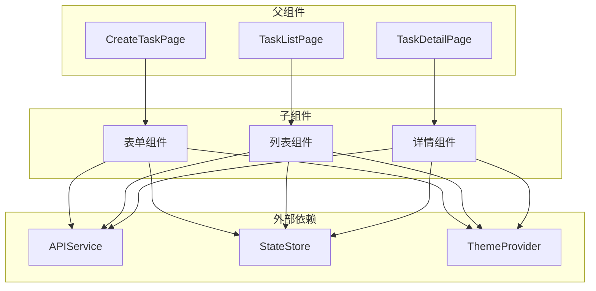

**图表来源**
- [docs/API.md:54-241](file://docs/API.md#L54-L241)
- [frontend/README.md:34-39](file://frontend/README.md#L34-L39)

### 组件复用策略

#### 通用组件库设计

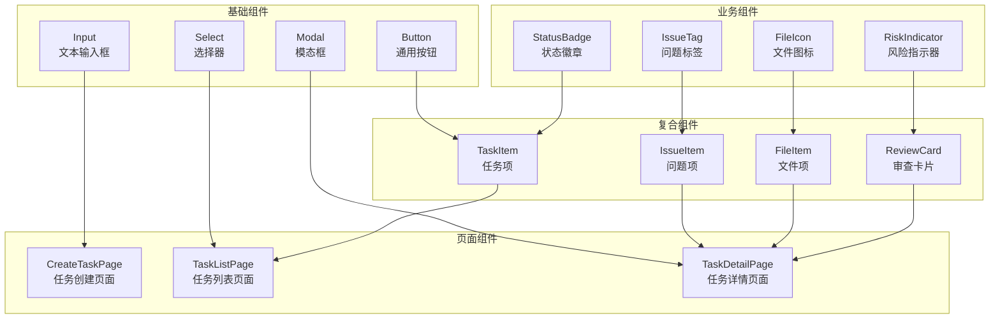

**图表来源**
- [docs/PRD.md:25-31](file://docs/PRD.md#L25-L31)
- [frontend/README.md:25-31](file://frontend/README.md#L25-L31)

**章节来源**
- [docs/PRD.md:25-31](file://docs/PRD.md#L25-L31)
- [frontend/README.md:25-31](file://frontend/README.md#L25-L31)

## 性能考虑

### 组件优化策略

1. **懒加载和代码分割**
   - 页面组件按路由懒加载
   - 大型组件按需加载
   - 图片和媒体资源延迟加载

2. **虚拟滚动**
   - 任务列表使用虚拟滚动处理大量数据
   - 详情页面的问题列表支持分页加载

3. **缓存策略**
   - API响应缓存
   - 组件状态缓存
   - 本地存储缓存

4. **渲染优化**
   - React.memo和PureComponent
   - key属性优化
   - 避免不必要的重渲染

### 网络性能优化

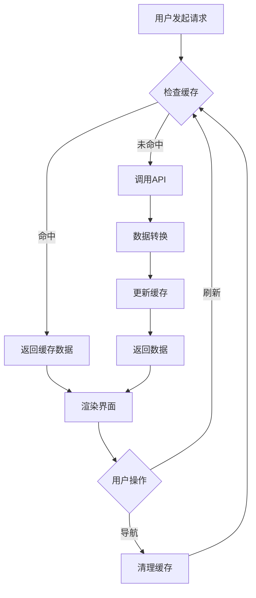

## 故障排除指南

### 常见错误处理

| 错误类型 | 错误码 | 处理策略 | 用户提示 |
|----------|--------|----------|----------|
| 网络错误 | NETWORK_ERROR | 重试机制，离线缓存 | 网络连接失败，请检查网络 |
| 参数错误 | INVALID_REQUEST | 表单验证，实时反馈 | 请输入有效的仓库URL和PR编号 |
| 任务不存在 | TASK_NOT_FOUND | 导航到列表页 | 任务不存在或已被删除 |
| 服务器错误 | SERVER_ERROR | 错误日志，重试按钮 | 服务器暂时不可用，请稍后重试 |
| 超时错误 | TIMEOUT_ERROR | 超时重试，进度指示 | 请求超时，请检查网络连接 |

### 调试技巧

1. **组件调试**
   - 使用浏览器开发者工具检查组件树
   - 监控组件渲染次数和性能
   - 检查props和state变化

2. **网络调试**
   - 监控API请求和响应
   - 检查请求头和响应状态码
   - 分析网络延迟和错误

3. **状态调试**
   - 使用Redux DevTools或Vue DevTools
   - 检查全局状态变化
   - 调试异步状态更新

**章节来源**
- [docs/API.md:312-332](file://docs/API.md#L312-L332)
- [docs/ARCHITECTURE.md:170-180](file://docs/ARCHITECTURE.md#L170-L180)

## 结论

CodeReviewX前端组件架构设计遵循了现代化前端开发的最佳实践，通过清晰的组件层次结构、标准化的数据流设计和完善的错误处理机制，为用户提供了一个高效、可靠的代码审查界面。

该架构具有以下优势：
- **可扩展性**：模块化的组件设计便于功能扩展
- **可维护性**：清晰的职责分离和状态管理
- **用户体验**：流畅的交互和及时的反馈
- **性能优化**：合理的缓存策略和渲染优化

随着项目的推进，这套组件架构将为后续的功能开发和性能优化提供坚实的基础。

## 附录

### 开发规范

#### 命名约定
- 组件文件：`[ComponentName].vue` 或 `[ComponentName].tsx`
- 组件导出：`export default ComponentName`
- Props命名：驼峰命名法
- 事件命名：`on[EventName]`

#### 目录结构
```
src/
├── components/          # 通用组件
│   ├── base/           # 基础组件
│   ├── business/       # 业务组件
│   └── layout/         # 布局组件
├── pages/              # 页面组件
├── services/           # API服务
├── store/              # 状态管理
├── styles/             # 样式文件
└── utils/              # 工具函数
```

#### 组件开发流程
1. 设计组件接口和数据结构
2. 实现基础功能和样式
3. 添加类型定义和文档注释
4. 编写单元测试和集成测试
5. 进行性能测试和优化
6. 代码审查和文档更新