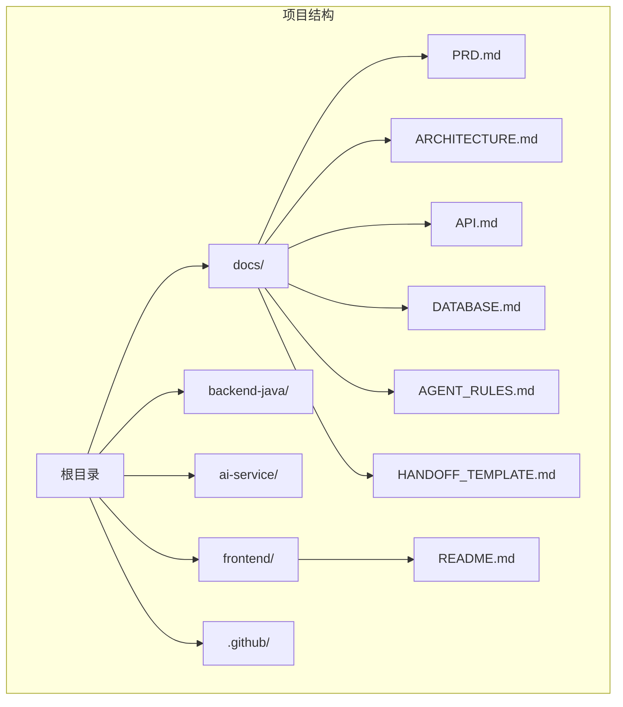
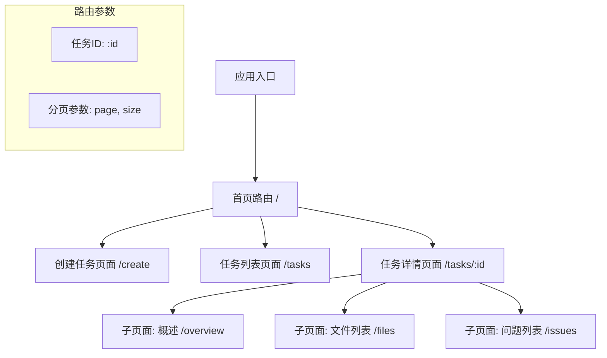
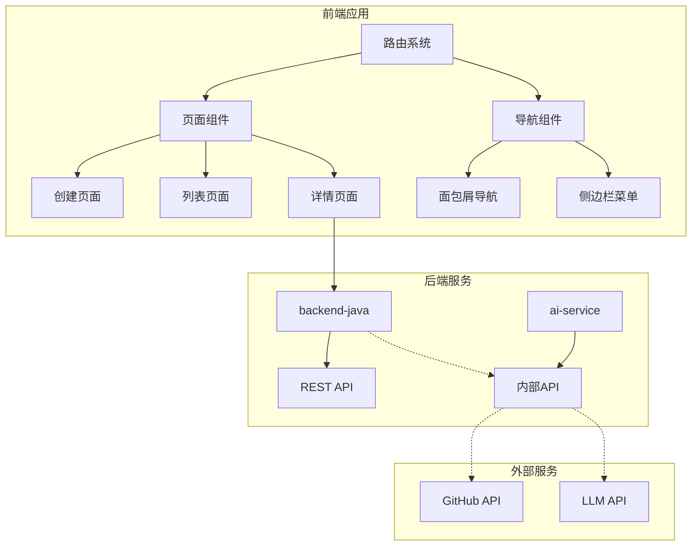
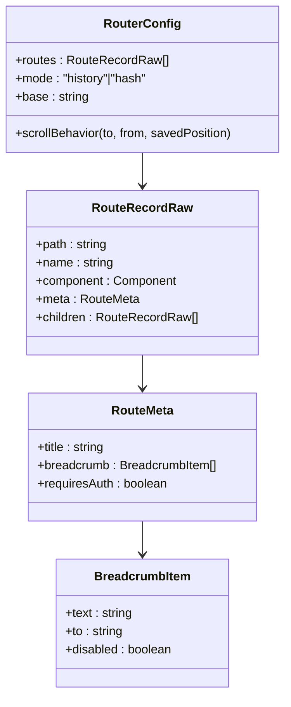
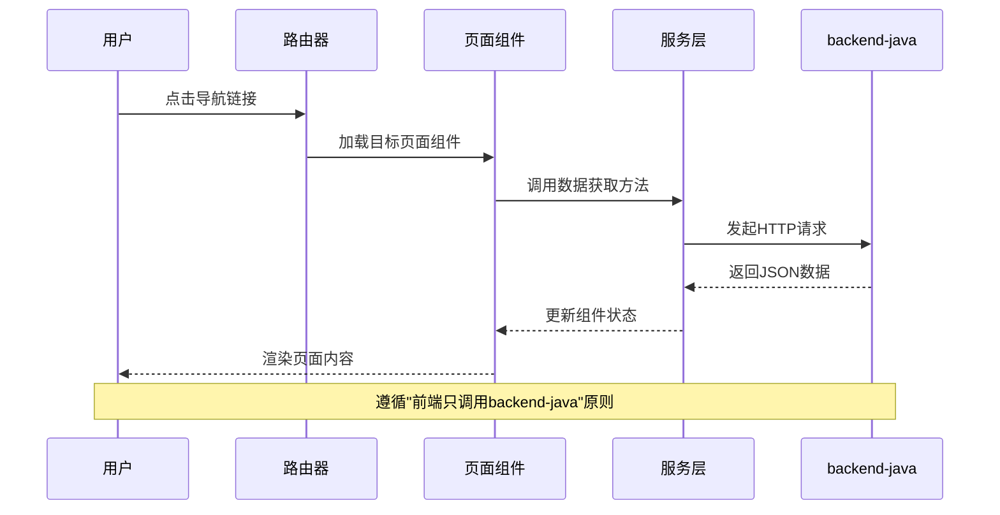
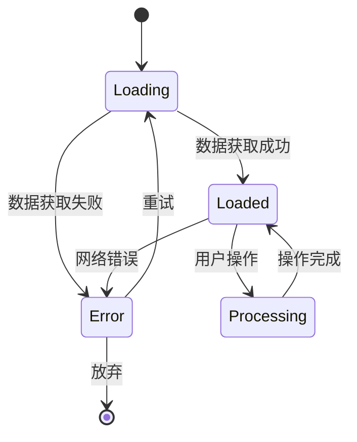
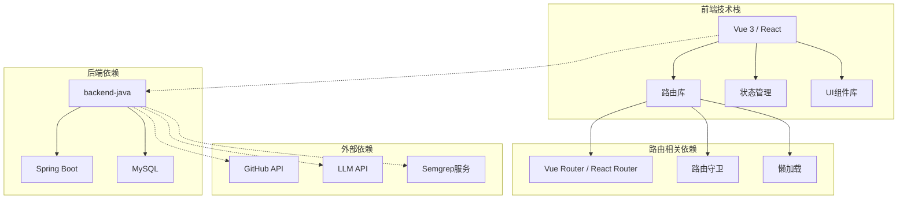
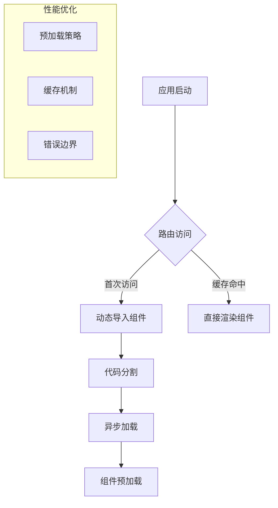
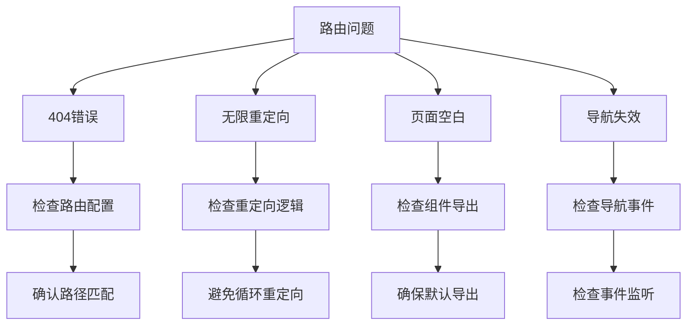
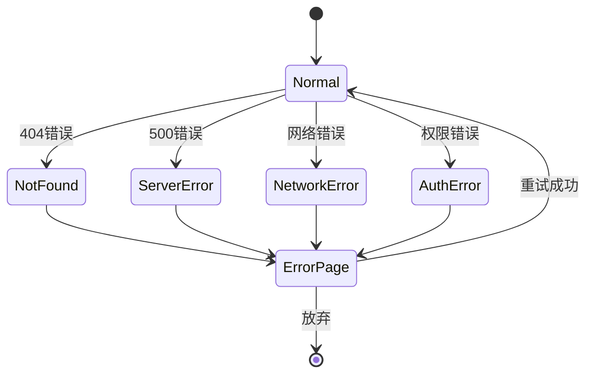

# 路由与导航

<cite>
**本文引用的文件**
- [README.md](file://README.md)
- [docs/ARCHITECTURE.md](file://docs/ARCHITECTURE.md)
- [docs/API.md](file://docs/API.md)
- [docs/PRD.md](file://docs/PRD.md)
</cite>

## 目录
1. [简介](#简介)
2. [项目结构](#项目结构)
3. [核心组件](#核心组件)
4. [架构总览](#架构总览)
5. [详细组件分析](#详细组件分析)
6. [依赖关系分析](#依赖关系分析)
7. [性能考虑](#性能考虑)
8. [故障排除指南](#故障排除指南)
9. [结论](#结论)
10. [附录](#附录)

## 简介

CodeReviewX 是一个面向 GitHub Pull Request 的智能代码审查与修复建议系统。该项目采用前后端分离架构，前端负责用户界面展示和交互，后端提供 REST API 服务。

根据项目规划，前端将使用 Vue 3 或 React 技术栈，实现以下核心页面：
- ReviewTask 创建页面
- ReviewTask 列表页面  
- ReviewTask 详情页面

前端系统遵循"只调用 backend-java，不直接调用 ai-service、GitHub API 或 LLM"的设计原则，确保了清晰的模块边界和可维护性。

## 项目结构



**图表来源**
- [README.md:58-82](file://README.md#L58-L82)

**章节来源**
- [README.md:58-82](file://README.md#L58-L82)

## 核心组件

### 页面路由定义

根据 PRD 和架构设计，前端需要实现以下核心路由：



**图表来源**
- [docs/PRD.md:56-71](file://docs/PRD.md#L56-L71)
- [docs/API.md:54-241](file://docs/API.md#L54-L241)

### 动态路由参数处理

系统需要支持以下动态路由参数：

| 参数名 | 类型 | 必填 | 说明 | 示例 |
|--------|------|------|------|------|
| taskId | long | 是 | 任务ID | 12345 |
| page | integer | 否 | 页码，从0开始 | 0 |
| size | integer | 否 | 每页数量，默认20 | 20 |

**章节来源**
- [docs/API.md:107-113](file://docs/API.md#L107-L113)
- [docs/API.md:153-158](file://docs/API.md#L153-L158)

## 架构总览



**图表来源**
- [docs/ARCHITECTURE.md:19-52](file://docs/ARCHITECTURE.md#L19-L52)

## 详细组件分析

### 路由配置策略

#### Vue Router 配置方案



**图表来源**
- [docs/PRD.md:56-71](file://docs/PRD.md#L56-L71)

#### React Router 配置方案

```mermaid
flowchart TD
A[BrowserRouter] --> B[Routes]
B --> C[Route path="/" element={<Home/>}>
B --> D[Route path="/create" element={<CreateTask/>}>
B --> E[Route path="/tasks" element={<TaskList/>}>
B --> F[Route path="/tasks/:id" element={<TaskDetail/>}>
F --> G[Routes children]
G --> H[Route path="overview" element={<Overview/>}>
G --> I[Route path="files" element={<Files/>}>
G --> J[Route path="issues" element={<Issues/>}>
```

**图表来源**
- [docs/PRD.md:56-71](file://docs/PRD.md#L56-L71)

### 页面跳转机制



**图表来源**
- [docs/ARCHITECTURE.md:58-72](file://docs/ARCHITECTURE.md#L58-L72)

### 面包屑导航设计

```mermaid
flowchart LR
A[首页] --> B[任务列表]
B --> C[任务详情]
C --> D[概述]
C --> E[文件列表]
C --> F[问题列表]
subgraph "面包屑层级"
G[/]
H[/tasks]
I[/tasks/:id]
J[/tasks/:id/overview]
end
```

**图表来源**
- [docs/PRD.md:56-71](file://docs/PRD.md#L56-L71)

### 页面状态保持



**图表来源**
- [docs/API.md:312-342](file://docs/API.md#L312-L342)

## 依赖关系分析

### 技术栈依赖



**图表来源**
- [docs/ARCHITECTURE.md:24-46](file://docs/ARCHITECTURE.md#L24-L46)

### 组件耦合度分析

| 组件 | 内聚性 | 耦合度 | 说明 |
|------|--------|--------|------|
| 路由系统 | 高 | 低 | 专注于导航逻辑 |
| 页面组件 | 高 | 中 | 负责具体业务展示 |
| 服务层 | 中 | 高 | 与后端API交互 |
| 导航组件 | 高 | 低 | 与路由系统解耦 |

**章节来源**
- [docs/ARCHITECTURE.md:58-72](file://docs/ARCHITECTURE.md#L58-L72)

## 性能考虑

### 路由懒加载策略



### 代码分割最佳实践

1. **按路由分割**: 每个页面组件独立打包
2. **按功能分割**: 业务模块独立打包  
3. **第三方库分割**: vendor chunk分离
4. **懒加载策略**: 非关键路由延迟加载

### 性能监控指标

- 首屏加载时间
- 路由切换延迟
- 组件渲染性能
- API响应时间
- 错误率统计

## 故障排除指南

### 常见路由问题



### 错误页面处理



**图表来源**
- [docs/API.md:41-51](file://docs/API.md#L41-L51)

**章节来源**
- [docs/API.md:312-342](file://docs/API.md#L312-L342)

## 结论

CodeReviewX 的前端路由与导航系统设计遵循了清晰的架构原则和最佳实践。通过合理的路由配置、动态参数处理、状态管理和性能优化策略，能够为用户提供流畅的导航体验。

关键设计要点包括：
- 明确的页面职责划分
- 健壮的错误处理机制  
- 高效的性能优化策略
- 用户友好的导航体验

这些设计为后续的功能扩展和维护奠定了坚实的基础。

## 附录

### API端点映射

| 页面 | 路由路径 | API端点 | 方法 | 用途 |
|------|----------|---------|------|------|
| 创建页面 | `/create` | `/api/review-tasks` | POST | 创建新任务 |
| 列表页面 | `/tasks` | `/api/review-tasks` | GET | 获取任务列表 |
| 详情页面 | `/tasks/:id` | `/api/review-tasks/:id` | GET | 获取任务详情 |
| 概述子页 | `/tasks/:id/overview` | `/api/review-tasks/:id` | GET | 获取汇总信息 |
| 文件子页 | `/tasks/:id/files` | `/api/review-tasks/:id` | GET | 获取文件变更 |
| 问题子页 | `/tasks/:id/issues` | `/api/review-tasks/:id` | GET | 获取问题列表 |

**章节来源**
- [docs/API.md:54-241](file://docs/API.md#L54-L241)