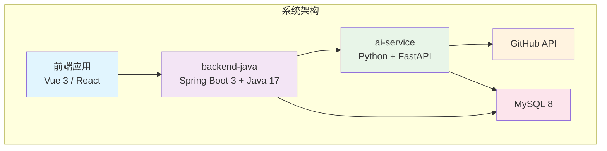
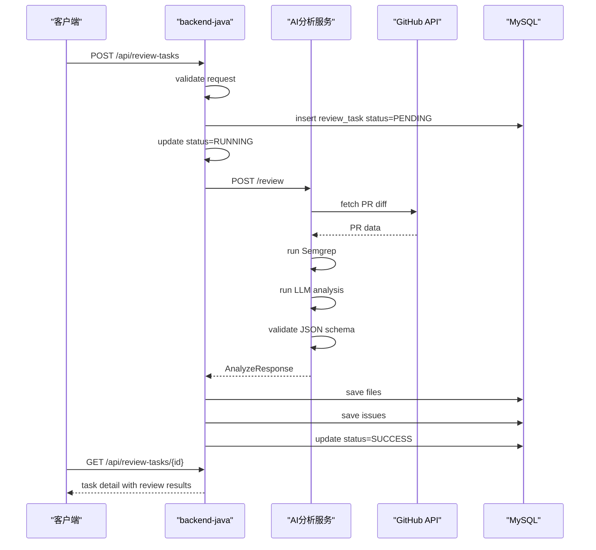
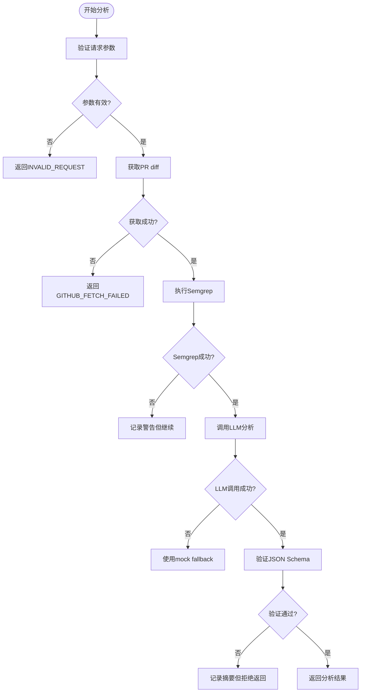
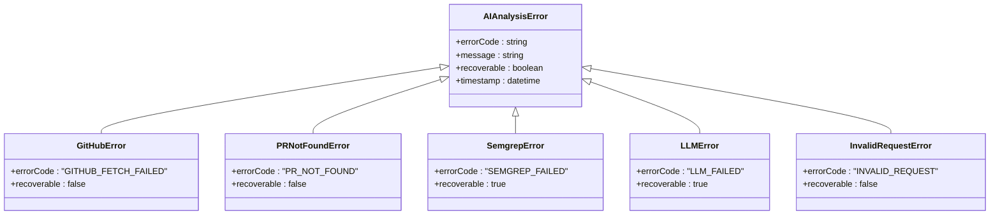
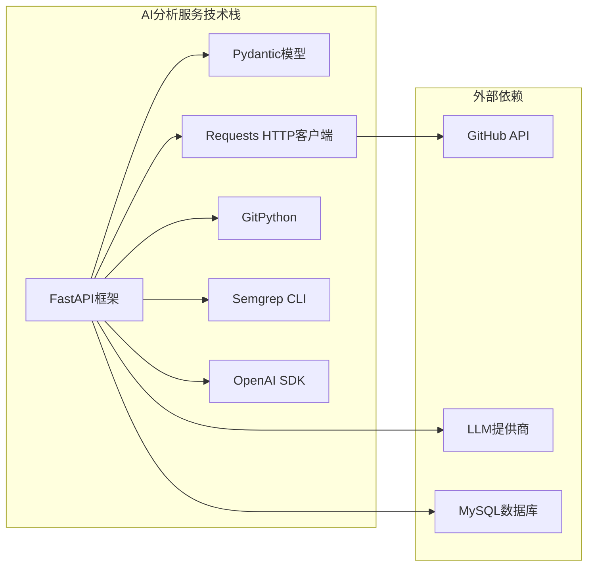
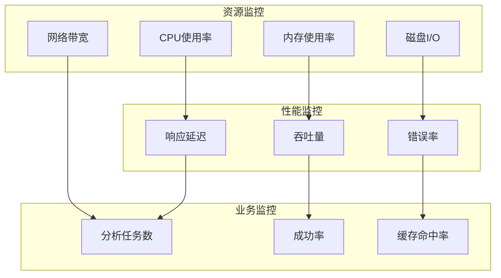

# AI分析服务API规范

<cite>
**本文档引用的文件**
- [README.md](file://README.md)
- [docs/API.md](file://docs/API.md)
- [docs/ARCHITECTURE.md](file://docs/ARCHITECTURE.md)
- [docs/DATABASE.md](file://docs/DATABASE.md)
- [backend-java/README.md](file://backend-java/README.md)
</cite>

## 目录
1. [简介](#简介)
2. [项目结构](#项目结构)
3. [核心组件](#核心组件)
4. [架构概览](#架构概览)
5. [详细组件分析](#详细组件分析)
6. [依赖关系分析](#依赖关系分析)
7. [性能考虑](#性能考虑)
8. [故障排除指南](#故障排除指南)
9. [结论](#结论)

## 简介

AI分析服务API是CodeReviewX项目的核心组件之一，专门负责执行GitHub Pull Request的智能代码分析。该服务采用模块化设计，通过内部API接口为backend-java提供专业的代码审查能力。

### 项目概述

CodeReviewX是一个面向GitHub Pull Request的智能代码审查系统，旨在为开发者提供自动化的代码质量检测和改进建议。系统通过整合静态分析工具和大型语言模型，为用户提供全面的代码审查报告。

### 核心特性

- **多层分析能力**：结合Semgrep静态分析和LLM智能分析
- **标准化输出**：统一的JSON格式输出，便于前端展示
- **错误处理机制**：完善的错误码定义和降级策略
- **内部API设计**：专为内部调用优化的接口规范

## 项目结构



**图表来源**
- [docs/ARCHITECTURE.md:19-52](file://docs/ARCHITECTURE.md#L19-L52)
- [docs/ARCHITECTURE.md:373-381](file://docs/ARCHITECTURE.md#L373-L381)

### 模块职责划分

| 模块 | 技术栈 | 核心职责 | 禁止事项 |
|------|--------|----------|----------|
| **backend-java** | Spring Boot 3 + Java 17 | ReviewTask编排、REST API、MySQL持久化、调用ai-service | 执行Semgrep、编写LLM提示、解析复杂diff、直接调用LLM |
| **ai-service** | Python + FastAPI | GitHub数据获取、Semgrep执行、LLM分析、结构化JSON输出 | 直接写MySQL、管理ReviewTask状态、对前端暴露业务API |
| **前端** | Vue 3 / React | 任务创建UI、任务列表UI、任务详情UI | 业务流程编排、持久化、AI审查生成 |

**章节来源**
- [docs/ARCHITECTURE.md:56-107](file://docs/ARCHITECTURE.md#L56-L107)
- [backend-java/README.md:19-46](file://backend-java/README.md#L19-L46)

## 核心组件

### AI分析服务API

AI分析服务API是系统的核心分析引擎，专门负责执行Pull Request的深度代码分析。该服务通过内部API接口为backend-java提供专业的代码审查能力。

#### 接口规范

**端点定义**
- **HTTP方法**: POST
- **路径**: `/review`
- **内容类型**: application/json
- **字符集**: UTF-8

**请求参数**

| 参数名 | 类型 | 必填 | 描述 |
|--------|------|------|------|
| `repoUrl` | string | 是 | GitHub仓库地址，格式：`https://github.com/{owner}/{repo}` |
| `prNumber` | integer | 是 | Pull Request编号，必须为正整数 |

**响应格式**

成功的响应包含以下结构：

```json
{
  "summary": "This PR introduces potential risks in user authentication logic.",
  "riskLevel": "MEDIUM",
  "files": [
    {
      "filePath": "src/main/java/example/UserService.java",
      "changeType": "modified",
      "additions": 20,
      "deletions": 5,
      "patch": "@@ -1,5 +1,10 @@\n-old line\n+new line"
    }
  ],
  "issues": [
    {
      "type": "BUG",
      "severity": "MEDIUM",
      "filePath": "src/main/java/example/UserService.java",
      "line": 42,
      "title": "Potential null pointer exception",
      "description": "The variable may be null before use.",
      "suggestion": "Add a null check before accessing the field.",
      "source": "LLM"
    },
    {
      "type": "SECURITY",
      "severity": "HIGH",
      "filePath": "src/main/java/example/AuthController.java",
      "line": 15,
      "title": "Hardcoded secret detected",
      "description": "A hardcoded token was found in the source code.",
      "suggestion": "Move this value to environment variables.",
      "source": "SEMGREP"
    }
  ]
}
```

**错误响应**

AI分析服务API支持多种错误场景，每种都有特定的错误码和处理策略：

| 错误码 | HTTP状态 | 场景描述 | 处理策略 |
|--------|----------|----------|----------|
| `GITHUB_FETCH_FAILED` | 502 | GitHub API请求失败 | 任务状态FAILED，保存error_message |
| `PR_NOT_FOUND` | 404 | PR不存在 | 任务状态FAILED，保存error_message |
| `SEMGREP_FAILED` | 500 | Semgrep执行失败 | 降级为warning，不导致任务失败 |
| `LLM_FAILED` | 500 | LLM调用失败 | 使用mock fallback或返回空issues |
| `INVALID_REQUEST` | 400 | 请求参数错误 | 任务状态FAILED，保存error_message |

**章节来源**
- [docs/API.md:243-332](file://docs/API.md#L243-L332)
- [docs/ARCHITECTURE.md:312-341](file://docs/ARCHITECTURE.md#L312-L341)

### 数据模型

AI分析服务API遵循严格的JSON Schema定义，确保数据的一致性和完整性。

#### 文件变更模型

| 字段名 | 类型 | 必填 | 描述 |
|--------|------|------|------|
| `filePath` | string | 是 | 文件路径 |
| `changeType` | string | 是 | `added` / `modified` / `deleted` |
| `additions` | integer | 是 | 新增行数 |
| `deletions` | integer | 是 | 删除行数 |
| `patch` | string | 否 | diff片段 |

#### 问题模型

| 字段名 | 类型 | 必填 | 描述 |
|--------|------|------|------|
| `type` | string | 是 | `BUG` / `SECURITY` / `PERFORMANCE` / `TEST` / `STYLE` |
| `severity` | string | 是 | `LOW` / `MEDIUM` / `HIGH` |
| `filePath` | string | 是 | 问题所在文件路径 |
| `line` | integer | 否 | 问题行号 |
| `title` | string | 是 | 问题标题 |
| `description` | string | 是 | 问题描述 |
| `suggestion` | string | 是 | 修复建议 |
| `source` | string | 是 | `LLM` / `SEMGREP` |

**章节来源**
- [docs/API.md:209-229](file://docs/API.md#L209-L229)
- [docs/API.md:270-301](file://docs/API.md#L270-L301)

## 架构概览



**图表来源**
- [docs/ARCHITECTURE.md:137-168](file://docs/ARCHITECTURE.md#L137-L168)
- [docs/ARCHITECTURE.md:170-179](file://docs/ARCHITECTURE.md#L170-L179)

### 调用链路设计

AI分析服务API在整个系统中扮演着关键的分析引擎角色，其调用链路设计体现了微服务架构的最佳实践。

#### 核心流程

1. **请求接收**: backend-java通过HTTP客户端调用AI分析服务
2. **数据获取**: AI服务调用GitHub API获取PR的diff数据
3. **静态分析**: 执行Semgrep进行代码静态分析
4. **智能分析**: 调用LLM生成结构化的代码审查报告
5. **结果验证**: 验证JSON Schema确保输出格式正确
6. **响应返回**: 返回统一格式的分析结果给backend-java

#### 错误处理策略

AI分析服务API实现了多层次的错误处理机制：



**图表来源**
- [docs/ARCHITECTURE.md:170-179](file://docs/ARCHITECTURE.md#L170-L179)

**章节来源**
- [docs/ARCHITECTURE.md:137-182](file://docs/ARCHITECTURE.md#L137-L182)

## 详细组件分析

### AI分析服务核心功能

AI分析服务API的核心功能围绕Pull Request的深度代码分析展开，通过多维度的技术手段确保分析结果的准确性和实用性。

#### GitHub数据获取

AI分析服务负责与GitHub API进行交互，获取PR的相关数据：

- **仓库信息**: 获取仓库的基本信息和权限状态
- **PR元数据**: 获取PR的标题、描述、作者信息
- **diff数据**: 获取PR的完整diff，包括新增、修改、删除的文件
- **评论和审查**: 获取现有的代码审查评论

#### Semgrep集成

Semgrep作为静态代码分析工具，在AI分析服务中发挥重要作用：

- **规则匹配**: 应用预定义的安全和质量规则
- **快速扫描**: 对代码进行快速的静态分析
- **结果聚合**: 将分析结果标准化为统一格式
- **性能优化**: 通过并行处理提高分析效率

#### LLM智能分析

大型语言模型提供智能化的代码审查能力：

- **上下文理解**: 理解PR的整体意图和代码变更的上下文
- **模式识别**: 识别潜在的设计模式和架构问题
- **建议生成**: 为发现的问题提供具体的修复建议
- **风险评估**: 评估代码变更可能带来的风险

### 数据持久化设计

AI分析服务API产生的分析结果需要与backend-java协同工作，通过统一的数据模型进行持久化存储。

#### 数据模型映射

| AI分析服务字段 | 数据库表 | 字段映射 | 说明 |
|----------------|----------|----------|------|
| `summary` | review_task.summary | summary | Review总结 |
| `riskLevel` | review_task.risk_level | risk_level | 风险等级 |
| `files[].filePath` | review_file_change.file_path | file_path | 文件路径 |
| `files[].changeType` | review_file_change.change_type | change_type | 变更类型 |
| `files[].additions` | review_file_change.additions | additions | 新增行数 |
| `files[].deletions` | review_file_change.deletions | deletions | 删除行数 |
| `issues[].type` | review_issue.type | type | 问题类型 |
| `issues[].severity` | review_issue.severity | severity | 严重程度 |
| `issues[].filePath` | review_issue.file_path | file_path | 文件路径 |
| `issues[].line` | review_issue.line_number | line_number | 行号 |
| `issues[].title` | review_issue.title | title | 标题 |
| `issues[].description` | review_issue.description | description | 描述 |
| `issues[].suggestion` | review_issue.suggestion | suggestion | 建议 |
| `issues[].source` | review_issue.source | source | 来源 |

**章节来源**
- [docs/DATABASE.md:22-134](file://docs/DATABASE.md#L22-L134)
- [docs/API.md:264-302](file://docs/API.md#L264-L302)

### 错误处理机制

AI分析服务API实现了完善的错误处理机制，确保系统的稳定性和可靠性。

#### 错误分类



**图表来源**
- [docs/API.md:323-332](file://docs/API.md#L323-L332)
- [docs/ARCHITECTURE.md:333-341](file://docs/ARCHITECTURE.md#L333-L341)

#### 降级策略

AI分析服务API采用渐进式的降级策略，确保即使部分组件失败也能提供基本功能：

1. **Semgrep降级**: 当Semgrep失败时，记录警告但继续执行LLM分析
2. **LLM降级**: 当LLM调用失败时，使用mock模式返回基础分析结果
3. **数据验证降级**: 当JSON Schema验证失败时，记录原始输出摘要但拒绝返回

**章节来源**
- [docs/ARCHITECTURE.md:131-133](file://docs/ARCHITECTURE.md#L131-L133)
- [docs/ARCHITECTURE.md:175-177](file://docs/ARCHITECTURE.md#L175-L177)

## 依赖关系分析

### 技术依赖

AI分析服务API的技术栈设计体现了现代微服务架构的最佳实践：



**图表来源**
- [docs/ARCHITECTURE.md:233-266](file://docs/ARCHITECTURE.md#L233-L266)

### 模块耦合度

AI分析服务API与其他模块的耦合度设计遵循了松耦合的原则：

| 模块 | 耦合类型 | 依赖关系 | 影响范围 |
|------|----------|----------|----------|
| **backend-java** | 单向依赖 | HTTP客户端调用 | 仅限于分析结果消费 |
| **GitHub API** | 外部依赖 | 读取权限 | 仅限于PR数据获取 |
| **Semgrep** | 工具依赖 | 执行权限 | 仅限于静态分析 |
| **LLM提供商** | 外部依赖 | 调用权限 | 仅限于智能分析 |
| **MySQL** | 数据依赖 | 读写权限 | 仅限于配置和日志 |

**章节来源**
- [docs/ARCHITECTURE.md:233-266](file://docs/ARCHITECTURE.md#L233-L266)

### 循环依赖风险

AI分析服务API的设计避免了循环依赖的风险：

1. **单向数据流**: 数据流向始终从AI分析服务到backend-java
2. **无状态设计**: AI分析服务不维护会话状态
3. **独立部署**: 可以独立于其他服务进行部署和扩展
4. **标准化接口**: 通过JSON Schema确保接口稳定性

## 性能考虑

### 并发处理

AI分析服务API采用异步处理机制，通过以下方式优化性能：

- **并发限制**: 通过配置文件控制同时执行的分析任务数量
- **资源池管理**: 管理GitHub API、LLM调用和数据库连接的资源池
- **超时控制**: 为每个外部调用设置合理的超时时间
- **重试机制**: 对临时性错误实施指数退避重试

### 缓存策略

为了提高响应速度，AI分析服务API实现了多层缓存机制：

- **GitHub API缓存**: 缓存常用的PR元数据和文件列表
- **Semgrep结果缓存**: 缓存重复的静态分析结果
- **LLM响应缓存**: 缓存相似问题的LLM分析结果
- **配置缓存**: 缓存分析规则和配置信息

### 监控指标

AI分析服务API提供了丰富的监控指标：

- **请求延迟**: 分析任务的平均处理时间和99百分位延迟
- **错误率**: 各种错误类型的发生频率
- **资源利用率**: CPU、内存、网络带宽的使用情况
- **吞吐量**: 每秒处理的分析任务数量

## 故障排除指南

### 常见问题诊断

#### GitHub API相关问题

**症状**: `GITHUB_FETCH_FAILED`错误频繁出现

**诊断步骤**:
1. 检查GitHub Token的有效性和权限范围
2. 验证网络连接和防火墙设置
3. 确认目标仓库的可见性和访问权限
4. 检查GitHub API的速率限制

**解决方案**:
- 更新有效的GitHub Token
- 实施请求重试和退避策略
- 使用GitHub API的缓存机制
- 监控API使用情况

#### Semgrep执行问题

**症状**: `SEMGREP_FAILED`错误

**诊断步骤**:
1. 检查Semgrep CLI的安装和版本
2. 验证分析规则文件的完整性
3. 确认代码文件的可读性
4. 检查磁盘空间和内存使用情况

**解决方案**:
- 更新Semgrep到最新版本
- 优化分析规则以减少执行时间
- 实施超时控制和资源限制
- 使用增量分析减少重复工作

#### LLM调用问题

**症状**: `LLM_FAILED`错误

**诊断步骤**:
1. 检查LLM提供商的API密钥和配额
2. 验证网络连接和DNS解析
3. 确认请求格式和参数的正确性
4. 检查LLM服务的可用性和负载

**解决方案**:
- 实施mock模式作为降级方案
- 使用请求重试和超时控制
- 实施负载均衡和故障转移
- 监控LLM服务的性能指标

### 日志分析

AI分析服务API提供了详细的日志记录机制：

#### 日志级别

| 日志级别 | 用途 | 示例内容 |
|----------|------|----------|
| **DEBUG** | 详细的操作跟踪 | 请求参数、响应数据、内部状态 |
| **INFO** | 正常操作记录 | 成功的分析任务、状态变化 |
| **WARNING** | 潜在问题警告 | 超时、重试、降级操作 |
| **ERROR** | 错误事件记录 | API调用失败、异常情况 |

#### 关键监控指标



**图表来源**
- [docs/ARCHITECTURE.md:345-370](file://docs/ARCHITECTURE.md#L345-L370)

### 故障恢复策略

AI分析服务API实现了多层次的故障恢复机制：

1. **自动重试**: 对临时性错误实施指数退避重试
2. **降级处理**: 在部分组件失效时提供基本功能
3. **快速失败**: 对永久性错误立即终止并返回错误信息
4. **健康检查**: 定期检查依赖服务的可用性

**章节来源**
- [docs/ARCHITECTURE.md:170-179](file://docs/ARCHITECTURE.md#L170-L179)

## 结论

AI分析服务API作为CodeReviewX项目的核心组件，通过精心设计的架构和严格的接口规范，为整个系统提供了可靠的代码分析能力。其内部API设计确保了系统的模块化和可维护性，而完善的错误处理机制则保证了系统的稳定性和可靠性。

### 设计优势

1. **模块化设计**: 清晰的职责分离和接口定义
2. **错误处理**: 多层次的错误处理和降级策略
3. **性能优化**: 并发处理和缓存机制
4. **监控完善**: 全面的日志记录和指标监控
5. **扩展性强**: 支持新的分析工具和LLM提供商

### 发展方向

随着项目的演进，AI分析服务API将继续优化和完善：

1. **分析精度提升**: 通过改进分析算法提高准确性
2. **性能持续优化**: 通过缓存和并行处理提升性能
3. **功能扩展**: 支持更多的代码分析工具和语言
4. **用户体验改善**: 提供更丰富的可视化和交互功能

该API规范为后续的实现和维护提供了清晰的指导，确保CodeReviewX项目能够持续发展并满足用户的需求。