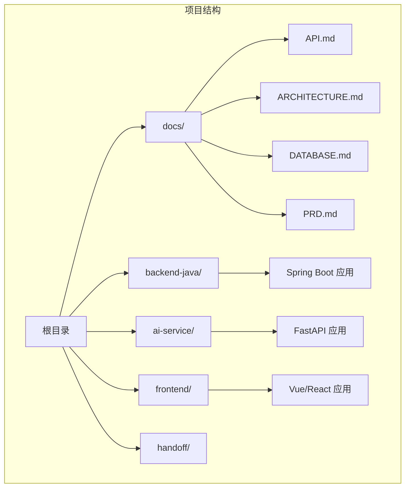
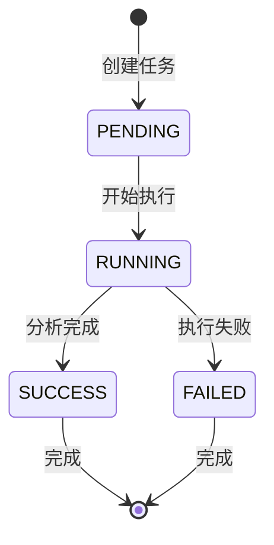
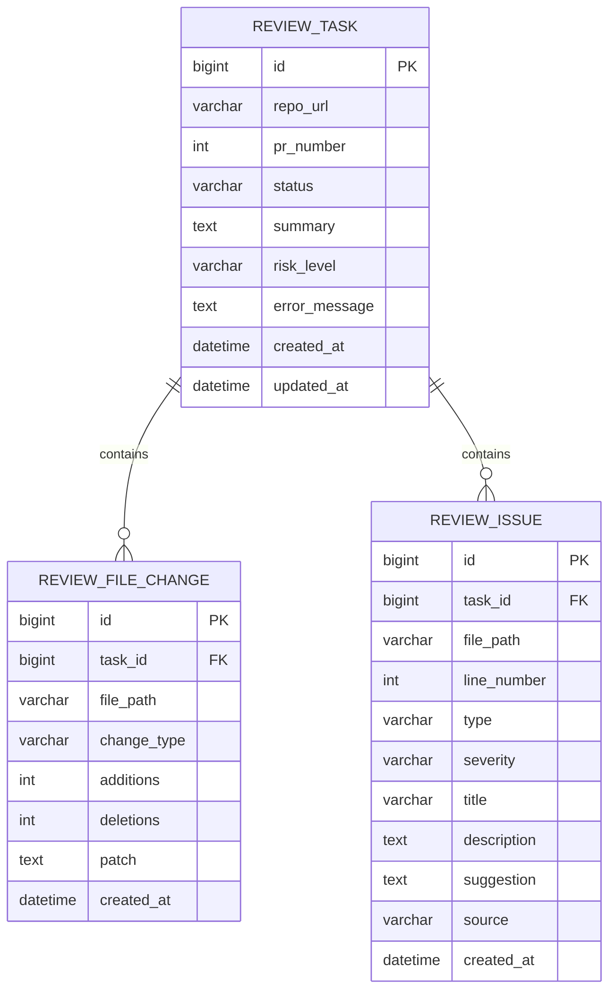
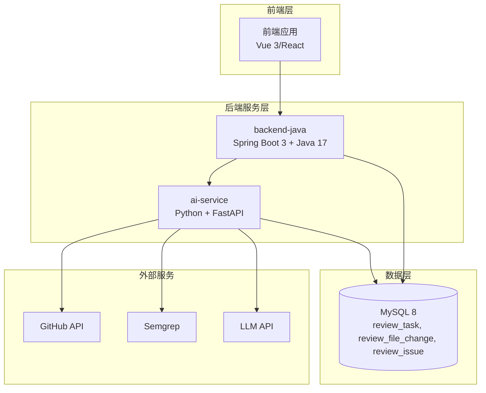
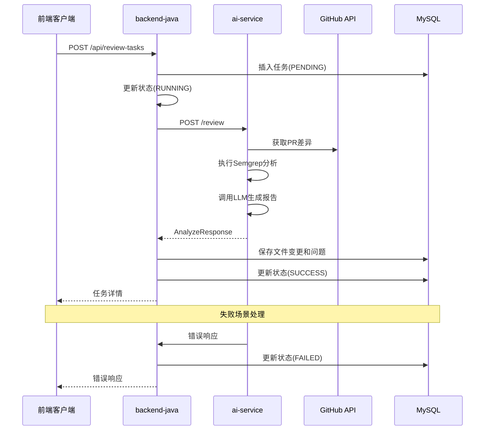
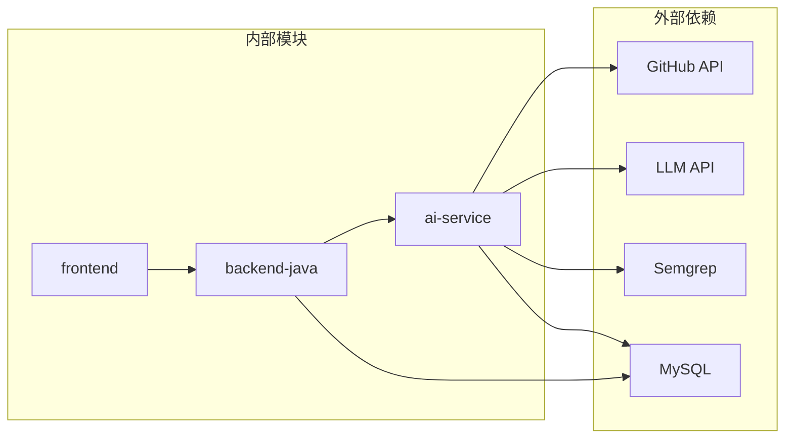
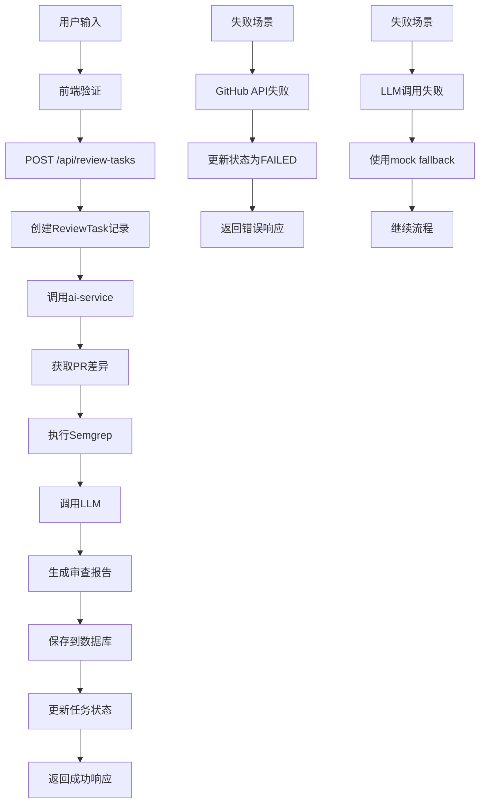

# API接口文档

<cite>
**本文档引用的文件**
- [API.md](file://docs/API.md)
- [ARCHITECTURE.md](file://docs/ARCHITECTURE.md)
- [DATABASE.md](file://docs/DATABASE.md)
- [README.md](file://README.md)
- [frontend/README.md](file://frontend/README.md)
</cite>

## 目录
1. [简介](#简介)
2. [项目结构](#项目结构)
3. [核心组件](#核心组件)
4. [架构概览](#架构概览)
5. [详细组件分析](#详细组件分析)
6. [依赖关系分析](#依赖关系分析)
7. [性能考虑](#性能考虑)
8. [故障排除指南](#故障排除指南)
9. [结论](#结论)

## 简介

CodeReviewX是一个智能代码审查和修复建议代理系统，专门用于GitHub Pull Requests的自动化审查。该系统通过获取PR差异、运行Semgrep静态分析、通过LLM生成结构化审查报告，并在Web界面中展示结果。

本项目采用微服务架构，分为三个主要模块：
- **backend-java**: Spring Boot后端服务，提供REST API、任务生命周期管理和MySQL持久化
- **ai-service**: Python + FastAPI AI服务，负责GitHub数据获取、静态分析和LLM分析
- **frontend**: Vue 3/React前端应用，提供用户界面

## 项目结构



**图表来源**
- [README.md:58-82](file://README.md#L58-L82)
- [docs/ARCHITECTURE.md:19-52](file://docs/ARCHITECTURE.md#L19-L52)

**章节来源**
- [README.md:58-82](file://README.md#L58-L82)
- [docs/ARCHITECTURE.md:19-52](file://docs/ARCHITECTURE.md#L19-L52)

## 核心组件

### ReviewTask 任务系统

ReviewTask是系统的核心实体，代表一次代码审查任务的完整生命周期。系统通过以下状态进行管理：



**图表来源**
- [docs/ARCHITECTURE.md:110-134](file://docs/ARCHITECTURE.md#L110-L134)

### 数据模型关系



**图表来源**
- [docs/DATABASE.md:22-134](file://docs/DATABASE.md#L22-L134)

**章节来源**
- [docs/DATABASE.md:22-134](file://docs/DATABASE.md#L22-L134)
- [docs/ARCHITECTURE.md:110-134](file://docs/ARCHITECTURE.md#L110-L134)

## 架构概览



**图表来源**
- [docs/ARCHITECTURE.md:19-52](file://docs/ARCHITECTURE.md#L19-L52)
- [docs/ARCHITECTURE.md:233-266](file://docs/ARCHITECTURE.md#L233-L266)

### 调用链路



**图表来源**
- [docs/ARCHITECTURE.md:137-181](file://docs/ARCHITECTURE.md#L137-L181)

**章节来源**
- [docs/ARCHITECTURE.md:137-181](file://docs/ARCHITECTURE.md#L137-L181)

## 详细组件分析

### ReviewTask API 接口

#### POST /api/review-tasks - 创建审查任务

**接口说明**
- **HTTP方法**: POST
- **URL模式**: `/api/review-tasks`
- **功能**: 创建新的代码审查任务
- **请求头**: `Content-Type: application/json`
- **字符集**: UTF-8

**请求参数**

| 参数名 | 类型 | 必填 | 说明 |
|--------|------|------|------|
| repoUrl | string | 是 | GitHub仓库地址，格式：`https://github.com/{owner}/{repo}` |
| prNumber | integer | 是 | Pull Request编号，必须为正整数 |

**请求示例**
```json
{
  "repoUrl": "https://github.com/apache/spark",
  "prNumber": 12345
}
```

**响应格式**

**成功响应 (201 Created)**:
```json
{
  "taskId": 1,
  "status": "PENDING"
}
```

**错误响应 (400 Bad Request)**:
```json
{
  "code": "INVALID_REQUEST",
  "message": "repoUrl must be a valid GitHub URL",
  "details": null
}
```

**使用场景**
- 用户在前端界面输入GitHub仓库URL和PR编号
- 系统验证参数有效性
- 创建ReviewTask记录，初始状态为PENDING
- 后台服务开始执行审查流程

**章节来源**
- [docs/API.md:56-95](file://docs/API.md#L56-L95)

#### GET /api/review-tasks - 查询任务列表

**接口说明**
- **HTTP方法**: GET
- **URL模式**: `/api/review-tasks`
- **功能**: 获取审查任务列表
- **请求头**: `Content-Type: application/json`

**查询参数**

| 参数名 | 类型 | 默认值 | 说明 |
|--------|------|--------|------|
| page | integer | 0 | 页码，从0开始
| size | integer | 20 | 每页数量

**响应格式**

**成功响应 (200 OK)**:
```json
{
  "items": [
    {
      "taskId": 1,
      "repoUrl": "https://github.com/apache/spark",
      "prNumber": 12345,
      "status": "SUCCESS",
      "riskLevel": "MEDIUM",
      "createdAt": "2026-06-19T10:00:00"
    }
  ],
  "total": 1
}
```

**响应字段说明**

| 字段名 | 类型 | 说明 |
|--------|------|------|
| taskId | long | 任务ID |
| repoUrl | string | GitHub仓库地址 |
| prNumber | integer | PR编号 |
| status | string | 任务状态：`PENDING` / `RUNNING` / `SUCCESS` / `FAILED` |
| riskLevel | string | 风险等级：`LOW` / `MEDIUM` / `HIGH` / null（未完成时） |
| createdAt | string | ISO 8601格式时间 |

**使用场景**
- 前端展示任务历史列表
- 支持分页加载大量任务
- 显示任务的基本状态信息

**章节来源**
- [docs/API.md:99-142](file://docs/API.md#L99-L142)

#### GET /api/review-tasks/{id} - 获取任务详情

**接口说明**
- **HTTP方法**: GET
- **URL模式**: `/api/review-tasks/{id}`
- **功能**: 获取指定审查任务的详细信息
- **请求头**: `Content-Type: application/json`

**路径参数**

| 参数名 | 类型 | 说明 |
|--------|------|------|
| id | long | 任务ID |

**响应格式**

**成功响应 (200 OK)**:
```json
{
  "taskId": 1,
  "repoUrl": "https://github.com/apache/spark",
  "prNumber": 12345,
  "status": "SUCCESS",
  "summary": "This PR has several medium risk issues.",
  "riskLevel": "MEDIUM",
  "errorMessage": null,
  "createdAt": "2026-06-19T10:00:00",
  "updatedAt": "2026-06-19T10:01:30",
  "files": [
    {
      "filePath": "src/main/java/org/apache/spark/SparkContext.java",
      "changeType": "modified",
      "additions": 20,
      "deletions": 5
    }
  ],
  "issues": [
    {
      "type": "BUG",
      "severity": "MEDIUM",
      "filePath": "src/main/java/org/apache/spark/SparkContext.java",
      "line": 42,
      "title": "Potential null pointer exception",
      "description": "The variable may be null before use.",
      "suggestion": "Add a null check before accessing the field.",
      "source": "LLM"
    }
  ]
}
```

**响应字段说明**

| 字段名 | 类型 | 说明 |
|--------|------|------|
| taskId | long | 任务ID |
| repoUrl | string | GitHub仓库地址 |
| prNumber | integer | PR编号 |
| status | string | 任务状态 |
| summary | string | Review总结（任务成功后填充） |
| riskLevel | string | 风险等级（任务成功后填充） |
| errorMessage | string | 失败原因（FAILED状态时填充） |
| files | array | 变更文件列表 |
| issues | array | Review问题列表 |

**files数组项字段**:

| 字段名 | 类型 | 说明 |
|--------|------|------|
| filePath | string | 文件路径 |
| changeType | string | `added` / `modified` / `deleted` |
| additions | integer | 新增行数 |
| deletions | integer | 删除行数 |

**issues数组项字段**:

| 字段名 | 类型 | 说明 |
|--------|------|------|
| type | string | `BUG` / `SECURITY` / `PERFORMANCE` / `TEST` / `STYLE` |
| severity | string | `LOW` / `MEDIUM` / `HIGH` |
| filePath | string | 问题所在文件路径 |
| line | integer | 问题行号 |
| title | string | 问题标题 |
| description | string | 问题描述 |
| suggestion | string | 修复建议 |
| source | string | `LLM` / `SEMGREP` |

**错误响应 (404 Not Found)**:
```json
{
  "code": "TASK_NOT_FOUND",
  "message": "Review task with id 999 not found",
  "details": null
}
```

**使用场景**
- 用户点击查看任务详情
- 展示审查结果摘要和详细信息
- 显示文件变更和具体问题

**章节来源**
- [docs/API.md:145-240](file://docs/API.md#L145-L240)

### 错误处理机制

系统采用统一的错误响应格式，包含标准化的错误码和人类可读的消息：

**统一错误响应格式**:
```json
{
  "code": "ERROR_CODE",
  "message": "Human readable error message",
  "details": null
}
```

**错误码定义**

| 错误码 | HTTP状态 | 场景 |
|--------|----------|------|
| `INVALID_REQUEST` | 400 | 请求参数错误或校验失败 |
| `TASK_NOT_FOUND` | 404 | 任务不存在 |
| `AI_SERVICE_ERROR` | 502 | ai-service调用失败 |
| `GITHUB_FETCH_FAILED` | 502 | GitHub数据获取失败 |
| `DATABASE_ERROR` | 500 | 数据库操作失败 |
| `INTERNAL_ERROR` | 500 | 未知系统错误 |

**章节来源**
- [docs/API.md:31-51](file://docs/API.md#L31-L51)
- [docs/ARCHITECTURE.md:312-341](file://docs/ARCHITECTURE.md#L312-L341)

## 依赖关系分析

### 模块间依赖



**图表来源**
- [docs/ARCHITECTURE.md:19-52](file://docs/ARCHITECTURE.md#L19-L52)

### 数据流依赖



**图表来源**
- [docs/ARCHITECTURE.md:137-181](file://docs/ARCHITECTURE.md#L137-L181)

**章节来源**
- [docs/ARCHITECTURE.md:137-181](file://docs/ARCHITECTURE.md#L137-L181)

## 性能考虑

### 状态流转规则

系统遵循严格的状态流转规则以确保数据一致性：

1. **单向流转**: 状态只能向前转换，不能回退
2. **失败处理**: FAILED状态必须保存错误信息
3. **降级策略**: Semgrep失败不强制任务失败，可降级为warning
4. **LLM降级**: LLM失败优先使用mock fallback

### 并发处理

- **任务隔离**: 每个ReviewTask独立处理，互不影响
- **数据库事务**: 关键操作使用事务保证数据一致性
- **重试机制**: 对外部服务调用实现合理的重试策略

### 缓存策略

- **临时缓存**: 对频繁访问的任务状态进行短期缓存
- **结果缓存**: 对已完成的审查结果进行缓存
- **配置缓存**: 对外部服务配置进行缓存

## 故障排除指南

### 常见问题及解决方案

**1. 任务创建失败**
- 检查repoUrl格式是否正确
- 验证prNumber是否为正整数
- 确认GitHub仓库可访问性

**2. 任务状态长时间为PENDING**
- 检查ai-service服务状态
- 验证GitHub API凭据配置
- 查看数据库连接状态

**3. 审查结果为空**
- 检查Semgrep执行日志
- 验证LLM服务可用性
- 确认PR确实存在变更

**4. 数据库连接问题**
- 检查MySQL服务状态
- 验证连接字符串配置
- 查看防火墙设置

### 日志监控

系统建议收集以下级别的日志：
- **INFO**: 正常业务流程
- **WARN**: 可恢复的警告
- **ERROR**: 严重错误和异常
- **DEBUG**: 详细的调试信息

**章节来源**
- [docs/ARCHITECTURE.md:170-180](file://docs/ARCHITECTURE.md#L170-L180)

## 结论

CodeReviewX的ReviewTask API设计遵循了清晰的RESTful原则，提供了完整的任务生命周期管理。通过标准化的错误处理机制和统一的响应格式，确保了系统的可靠性和易用性。

### 设计优势

1. **清晰的职责分离**: 前端、后端、AI服务各司其职
2. **标准化的数据格式**: 统一的请求响应格式
3. **完善的错误处理**: 标准化的错误码和人类可读消息
4. **可扩展的架构**: 支持未来功能扩展和集成

### 发展建议

1. **API版本控制**: 为API添加版本号以便向后兼容
2. **速率限制**: 实现API调用频率限制防止滥用
3. **认证授权**: 添加用户认证和权限控制
4. **监控告警**: 建立完整的监控和告警系统

该API设计为CodeReviewX项目的后续开发奠定了坚实的基础，确保了前后端的良好协作和系统的稳定运行。