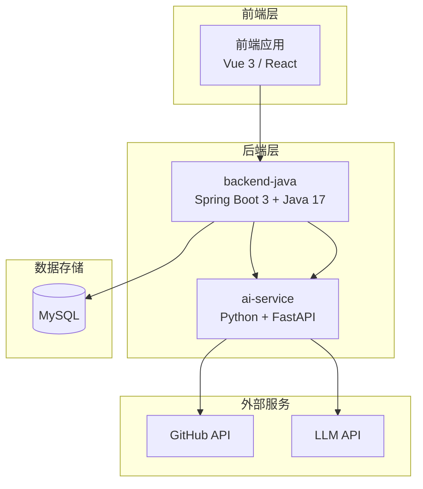
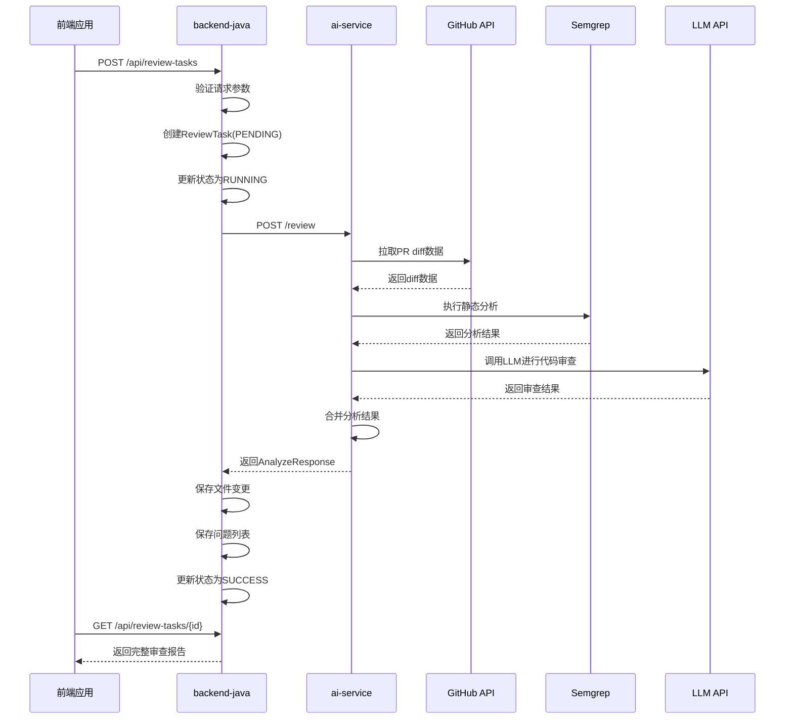
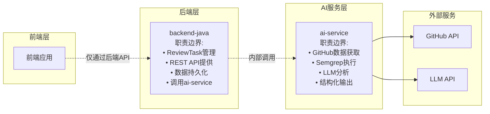
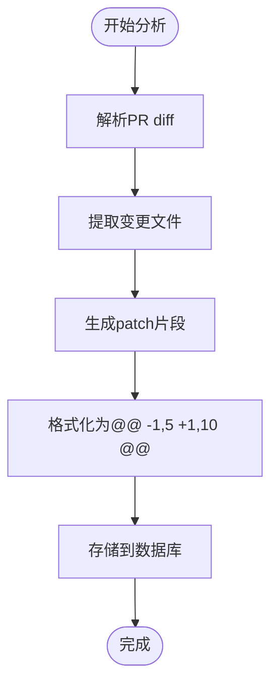
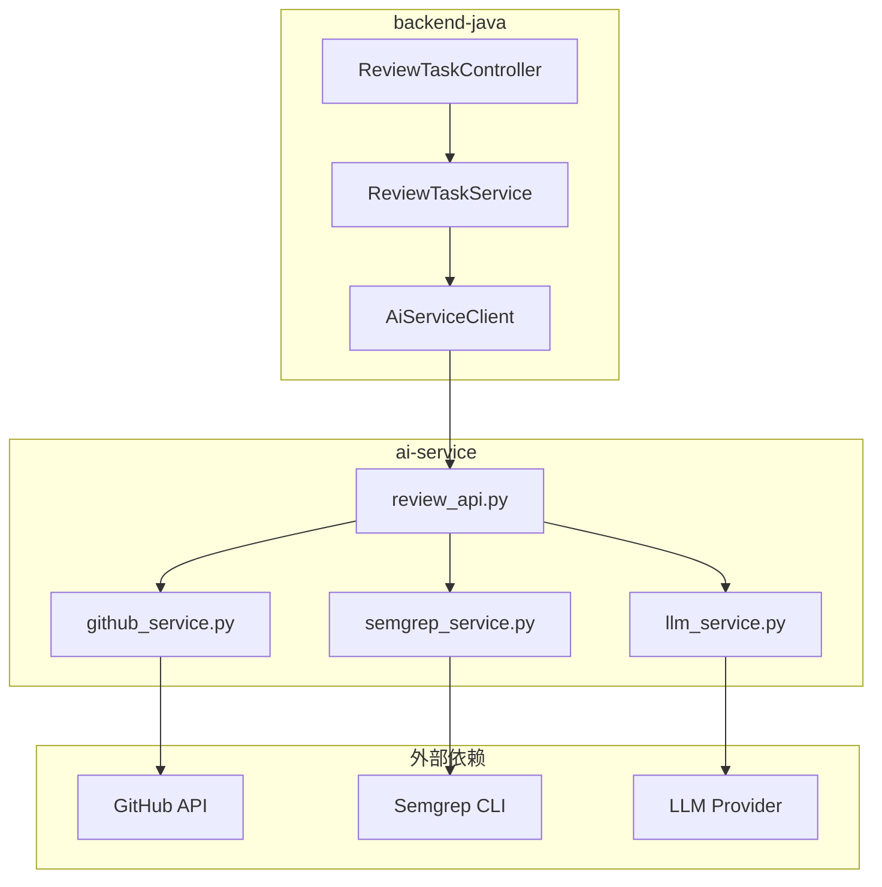

# AI服务集成接口

<cite>
**本文档引用的文件**
- [API.md](file://docs/API.md)
- [ARCHITECTURE.md](file://docs/ARCHITECTURE.md)
- [DATABASE.md](file://docs/DATABASE.md)
- [ai-service/README.md](file://ai-service/README.md)
- [backend-java/README.md](file://backend-java/README.md)
</cite>

## 目录
1. [简介](#简介)
2. [项目结构](#项目结构)
3. [核心组件](#核心组件)
4. [架构概览](#架构概览)
5. [详细组件分析](#详细组件分析)
6. [依赖关系分析](#依赖关系分析)
7. [性能考虑](#性能考虑)
8. [故障排除指南](#故障排除指南)
9. [结论](#结论)

## 简介

AI服务集成接口（POST /review）是CodeReviewX系统中backend-java内部调用的专用接口，专门用于触发AI驱动的代码审查分析。该接口仅供backend-java内部使用，不直接暴露给前端应用。

该接口的核心职责是从GitHub拉取Pull Request的diff数据，执行Semgrep静态分析，并通过LLM进行智能代码审查，最终返回标准化的审查报告。整个过程严格遵循模块边界分离原则，确保前端只能通过后端API间接访问AI能力。

## 项目结构

CodeReviewX采用三层架构设计，明确划分了各模块的职责边界：

**图表来源**
- [ARCHITECTURE.md:19-52](file://docs/ARCHITECTURE.md#L19-L52)
- [ARCHITECTURE.md:73-106](file://docs/ARCHITECTURE.md#L73-L106)

**章节来源**
- [ARCHITECTURE.md:7-16](file://docs/ARCHITECTURE.md#L7-L16)
- [ARCHITECTURE.md:19-52](file://docs/ARCHITECTURE.md#L19-L52)

## 核心组件

### 接口概述

- **HTTP方法**: POST
- **端点路径**: `/review`
- **目标服务**: ai-service
- **调用方**: backend-java内部
- **响应格式**: JSON
- **内容类型**: application/json

### 请求参数

| 参数名 | 类型 | 必填 | 描述 |
|--------|------|------|------|
| `repoUrl` | string | 是 | GitHub仓库URL，格式：`https://github.com/{owner}/{repo}` |
| `prNumber` | integer | 是 | Pull Request编号，必须为正整数 |

### 响应结构

| 字段名 | 类型 | 描述 |
|--------|------|------|
| `summary` | string | 整体审查总结 |
| `riskLevel` | string | 风险等级：`LOW` / `MEDIUM` / `HIGH` |
| `files` | array | 变更文件列表 |
| `issues` | array | 审查发现的问题列表 |

**章节来源**
- [API.md:247-332](file://docs/API.md#L247-L332)

## 架构概览

### 调用链路

**图表来源**
- [ARCHITECTURE.md:137-168](file://docs/ARCHITECTURE.md#L137-L168)

### 模块边界

**图表来源**
- [ARCHITECTURE.md:56-106](file://docs/ARCHITECTURE.md#L56-L106)

**章节来源**
- [ARCHITECTURE.md:56-106](file://docs/ARCHITECTURE.md#L56-L106)

## 详细组件分析

### 请求体参数详解

#### repoUrl参数
- **格式要求**: `https://github.com/{owner}/{repo}`
- **验证规则**: 必须是有效的GitHub仓库URL
- **用途**: 标识要分析的代码仓库

#### prNumber参数
- **类型**: 正整数
- **验证规则**: 必须大于0
- **用途**: 指定具体的Pull Request编号

### 响应体结构详解

#### files数组中的patch字段

patch字段是文件变更的diff片段，采用标准的Git diff格式：

**图表来源**
- [ARCHITECTURE.md:269-308](file://docs/ARCHITECTURE.md#L269-L308)

patch字段的作用：
1. **精确标识变更位置**: 通过行号范围精确定位代码变更
2. **支持可视化展示**: 前端可以基于patch渲染差异视图
3. **便于审计追踪**: 完整保留代码变更历史
4. **辅助修复建议**: LLM可以基于patch上下文提供精准建议

#### issues数组中的问题来源

问题来源分为两类：

| 来源类型 | 描述 | 识别标记 |
|----------|------|----------|
| `LLM` | 通过大语言模型分析发现的问题 | `source: "LLM"` |
| `SEMGREP` | 通过Semgrep静态分析工具发现的问题 | `source: "SEMGREP"` |

**章节来源**
- [API.md:279-301](file://docs/API.md#L279-L301)
- [ARCHITECTURE.md:269-308](file://docs/ARCHITECTURE.md#L269-L308)

### 错误码定义

#### ai-service错误码

| 错误码 | HTTP状态 | 场景描述 | 处理策略 |
|--------|----------|----------|----------|
| `GITHUB_FETCH_FAILED` | 502 | GitHub API请求失败 | 任务状态FAILED，保存具体错误原因 |
| `PR_NOT_FOUND` | 502 | 指定的PR不存在 | 任务状态FAILED，提示PR不存在 |
| `SEMGREP_FAILED` | 500 | Semgrep执行失败 | 降级处理，不影响整体任务完成 |
| `LLM_FAILED` | 500 | LLM调用失败 | 使用mock fallback，返回空issues |
| `INVALID_REQUEST` | 400 | 请求参数格式错误 | 任务状态FAILED，返回参数验证错误 |

#### backend-java错误码

| 错误码 | HTTP状态 | 场景描述 | 处理策略 |
|--------|----------|----------|----------|
| `INVALID_REQUEST` | 400 | 请求参数验证失败 | 返回具体参数错误信息 |
| `TASK_NOT_FOUND` | 404 | ReviewTask不存在 | 返回任务不存在错误 |
| `AI_SERVICE_ERROR` | 502 | ai-service调用失败 | 任务状态FAILED，保存调用错误 |
| `GITHUB_FETCH_FAILED` | 502 | GitHub数据获取失败 | 任务状态FAILED，保存错误原因 |
| `DATABASE_ERROR` | 500 | 数据库操作失败 | 任务状态FAILED，保存数据库错误 |
| `INTERNAL_ERROR` | 500 | 未知系统错误 | 任务状态FAILED，保存内部错误 |

**章节来源**
- [API.md:41-50](file://docs/API.md#L41-L50)
- [API.md:323-331](file://docs/API.md#L323-L331)
- [ARCHITECTURE.md:170-179](file://docs/ARCHITECTURE.md#L170-L179)

## 依赖关系分析

### 模块间依赖

**图表来源**
- [ARCHITECTURE.md:183-266](file://docs/ARCHITECTURE.md#L183-L266)

### 数据流依赖

| 组件 | 依赖关系 | 说明 |
|------|----------|------|
| backend-java | ai-service | 通过HTTP客户端调用 |
| ai-service | GitHub API | 拉取PR diff数据 |
| ai-service | Semgrep | 执行静态代码分析 |
| ai-service | LLM Provider | 获取智能代码审查结果 |
| backend-java | MySQL | 存储审查结果 |

**章节来源**
- [ARCHITECTURE.md:183-266](file://docs/ARCHITECTURE.md#L183-L266)

## 性能考虑

### 并发处理
- ai-service应支持并发请求处理
- 合理配置连接池大小
- 实施请求限流防止资源耗尽

### 缓存策略
- GitHub API响应可适当缓存
- 避免重复的Semgrep执行
- LLM调用结果可缓存常用模式

### 超时配置
- GitHub API超时: 30秒
- Semgrep执行超时: 60秒
- LLM调用超时: 120秒
- ai-service整体超时: 180秒

### 错误重试
- 网络异常自动重试2次
- LLM调用失败使用mock回退
- Semgrep失败不影响整体流程

## 故障排除指南

### 常见错误场景

#### GitHub API错误
**症状**: `GITHUB_FETCH_FAILED`
**可能原因**:
- 仓库URL格式错误
- PR编号不存在
- GitHub访问令牌无效
- 网络连接问题

**解决步骤**:
1. 验证repoUrl格式正确性
2. 确认prNumber为有效正整数
3. 检查GitHub访问令牌配置
4. 确认网络连通性

#### Semgrep执行失败
**症状**: `SEMGREP_FAILED`
**处理策略**: 降级为warning，不影响任务完成
**解决步骤**:
1. 检查Semgrep版本兼容性
2. 验证代码文件可读性
3. 查看Semgrep日志输出

#### LLM调用失败
**症状**: `LLM_FAILED`
**处理策略**: 使用mock回退
**解决步骤**:
1. 检查LLM API密钥配置
2. 验证网络连接
3. 查看LLM服务可用性

### 日志监控

建议启用以下级别的日志：
- **INFO**: 正常请求处理流程
- **WARN**: 可恢复的错误（如Semgrep失败）
- **ERROR**: 严重错误（如GitHub API失败）

**章节来源**
- [ARCHITECTURE.md:170-179](file://docs/ARCHITECTURE.md#L170-L179)

## 结论

AI服务集成接口（POST /review）作为CodeReviewX系统的核心组件，成功实现了以下目标：

1. **清晰的模块边界**: 通过严格的职责分离，确保前端只能通过后端API间接访问AI能力
2. **标准化的数据格式**: 统一的请求响应格式便于前后端协作
3. **完善的错误处理**: 详细的错误码定义和处理策略
4. **可扩展的架构设计**: 支持mock回退和多种AI服务提供商

该接口为后续的代码审查自动化奠定了坚实基础，通过合理的架构设计和错误处理机制，确保了系统的稳定性和可靠性。