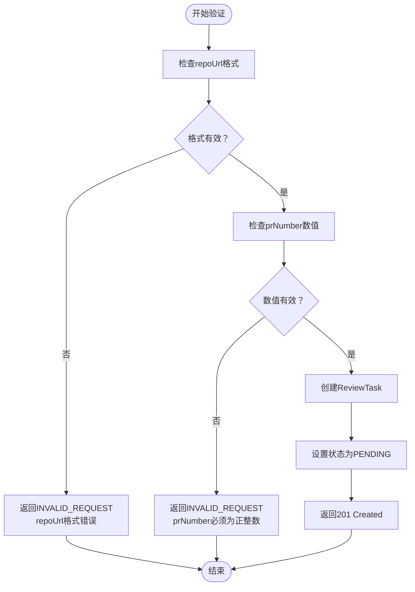
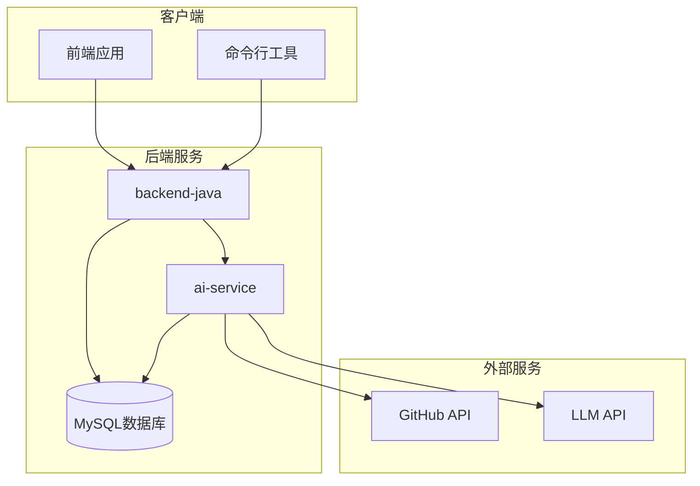
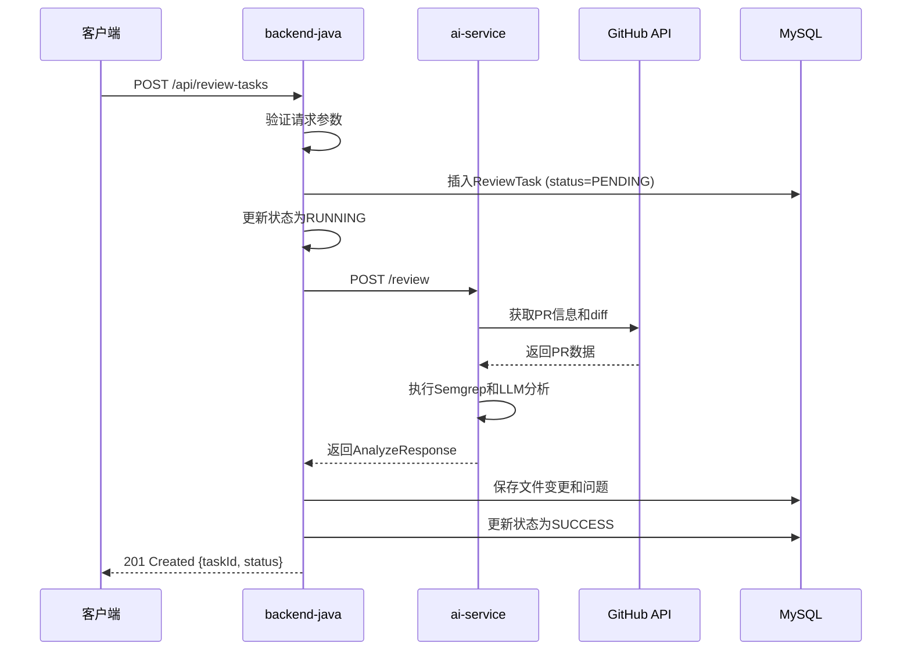

# 创建Review任务接口

<cite>
**本文档引用的文件**
- [API.md](file://docs/API.md)
- [ARCHITECTURE.md](file://docs/ARCHITECTURE.md)
- [DATABASE.md](file://docs/DATABASE.md)
- [PRD.md](file://docs/PRD.md)
- [03-qoder-review.md](file://handoff/round-01/03-qoder-review.md)
- [03-qoder-independent-review.md](file://tasks/round-01/03-qoder-independent-review.md)
</cite>

## 目录
1. [简介](#简介)
2. [接口概述](#接口概述)
3. [请求参数规范](#请求参数规范)
4. [请求体格式](#请求体格式)
5. [响应格式](#响应格式)
6. [HTTP状态码](#http状态码)
7. [错误响应示例](#错误响应示例)
8. [接口状态说明](#接口状态说明)
9. [请求响应示例](#请求响应示例)
10. [字段详细说明](#字段详细说明)
11. [验证规则和格式要求](#验证规则和格式要求)
12. [架构设计说明](#架构设计说明)
13. [最佳实践](#最佳实践)

## 简介

本文档详细说明了CodeReviewX项目中创建Review任务的REST API接口。该接口用于接收用户的GitHub仓库地址和Pull Request编号，创建相应的代码审查任务。

**重要说明**：当前为Round 01计划阶段，该接口尚未实现，仅作为MVP需求设计的一部分。

## 接口概述

### 基本信息
- **方法**：POST
- **路径**：`/api/review-tasks`
- **协议**：HTTP/HTTPS
- **当前状态**：Planned only. Not implemented in Round 01
- **目标用户**：需要进行代码审查的开发者和项目展示者

### 基础URL配置
| 环境 | Base URL |
|---|---|
| 本地开发 | `http://localhost:8080` |
| Docker Compose | `http://backend-java:8080` |

## 请求参数规范

### Content-Type要求
- **Content-Type**: `application/json`
- **字符集**: UTF-8

### 请求头参数
- **Accept**: `application/json`
- **Content-Type**: `application/json`

## 请求体格式

### 基本结构
```json
{
  "repoUrl": "https://github.com/owner/repo",
  "prNumber": 12
}
```

### 字段定义

| 字段名 | 类型 | 必填 | 默认值 | 说明 |
|---|---|---|---|---|
| `repoUrl` | string | 是 | 无 | GitHub仓库地址，格式：`https://github.com/{owner}/{repo}` |
| `prNumber` | integer | 是 | 无 | Pull Request编号，必须为正整数 |

### 字段验证规则

#### repoUrl字段验证
- **格式要求**：必须为有效的GitHub仓库URL
- **协议限制**：必须以`https://`开头
- **域名验证**：必须为`github.com`
- **路径格式**：必须遵循`/{owner}/{repo}`格式
- **长度限制**：不超过500字符

#### prNumber字段验证
- **数值类型**：必须为整数
- **范围限制**：必须为正整数（> 0）
- **精度要求**：不能包含小数部分

## 响应格式

### 成功响应（201 Created）

当请求参数验证通过且任务创建成功时，返回以下JSON结构：

```json
{
  "taskId": 1,
  "status": "PENDING"
}
```

### 响应字段说明

| 字段名 | 类型 | 说明 |
|---|---|---|
| `taskId` | long | 新创建的任务ID，用于后续查询任务状态 |
| `status` | string | 任务初始状态，固定为`PENDING` |

## HTTP状态码

### 成功状态码
- **201 Created**：任务创建成功

### 错误状态码
- **400 Bad Request**：请求参数验证失败
- **404 Not Found**：任务不存在（查询任务详情时）
- **500 Internal Server Error**：服务器内部错误
- **502 Bad Gateway**：上游服务调用失败

## 错误响应示例

### 参数验证错误
```json
{
  "code": "INVALID_REQUEST",
  "message": "repoUrl must be a valid GitHub URL",
  "details": null
}
```

### 任务不存在错误
```json
{
  "code": "TASK_NOT_FOUND",
  "message": "Review task with id 999 not found",
  "details": null
}
```

### 服务器内部错误
```json
{
  "code": "INTERNAL_ERROR",
  "message": "An unexpected error occurred",
  "details": null
}
```

## 接口状态说明

### Round 01状态
根据项目文档，该接口当前处于以下状态：

- **当前状态**：Planned only. Not implemented in Round 01
- **实现阶段**：MVP需求设计阶段
- **功能范围**：ReviewTask创建功能
- **依赖关系**：需要backend-java服务支持

### 功能范围
根据PRD文档，该接口属于以下MVP功能范围：
- **F1**：ReviewTask创建
- **F2**：ReviewTask查询
- **F3**：GitHub PR diff拉取
- **F4**：PR文件变更保存

## 请求响应示例

### 成功请求示例

**请求**：
```http
POST /api/review-tasks
Host: localhost:8080
Content-Type: application/json

{
  "repoUrl": "https://github.com/example/project",
  "prNumber": 42
}
```

**响应**：
```http
HTTP/1.1 201 Created
Content-Type: application/json

{
  "taskId": 1001,
  "status": "PENDING"
}
```

### 错误请求示例

**请求**：
```http
POST /api/review-tasks
Host: localhost:8080
Content-Type: application/json

{
  "repoUrl": "invalid-url",
  "prNumber": -5
}
```

**响应**：
```http
HTTP/1.1 400 Bad Request
Content-Type: application/json

{
  "code": "INVALID_REQUEST",
  "message": "repoUrl must be a valid GitHub URL and prNumber must be positive",
  "details": null
}
```

## 字段详细说明

### 请求体字段详解

#### repoUrl字段
- **必填性**：必须提供
- **格式要求**：必须为完整的GitHub仓库URL
- **验证规则**：
  - 必须以`https://github.com/`开头
  - 必须包含有效的用户名和仓库名
  - 不能包含特殊字符（除了URL允许的字符）
  - 长度不能超过500字符

#### prNumber字段
- **必填性**：必须提供
- **数值要求**：必须为整数
- **范围要求**：必须大于0
- **验证规则**：
  - 不能为负数
  - 不能为零
  - 不能包含小数部分

### 响应体字段详解

#### taskId字段
- **类型**：长整型（long）
- **生成方式**：由系统自动生成
- **唯一性**：在整个系统中唯一
- **用途**：用于查询任务详情和状态

#### status字段
- **类型**：字符串（string）
- **取值范围**：固定为`PENDING`
- **含义**：表示任务已创建但尚未开始执行
- **生命周期**：任务创建后立即为`PENDING`

## 验证规则和格式要求

### 参数验证流程



**图表来源**
- [API.md:56-95](file://docs/API.md#L56-L95)

### 验证规则矩阵

| 字段 | 验证类型 | 具体规则 | 错误码 |
|---|---|---|---|
| `repoUrl` | 格式验证 | 必须为有效的GitHub URL | `INVALID_REQUEST` |
| `repoUrl` | 长度验证 | 不超过500字符 | `INVALID_REQUEST` |
| `prNumber` | 数值验证 | 必须为整数 | `INVALID_REQUEST` |
| `prNumber` | 范围验证 | 必须大于0 | `INVALID_REQUEST` |

## 架构设计说明

### 系统架构图



**图表来源**
- [ARCHITECTURE.md:19-52](file://docs/ARCHITECTURE.md#L19-L52)

### 接口调用流程



**图表来源**
- [ARCHITECTURE.md:137-168](file://docs/ARCHITECTURE.md#L137-L168)

## 最佳实践

### 请求参数最佳实践

1. **URL格式标准化**
   - 始终使用`https://github.com/{owner}/{repo}`格式
   - 避免使用SSH格式或其他变体
   - 确保URL末尾不包含多余的斜杠

2. **PR编号规范**
   - 使用实际存在的PR编号
   - 避免使用0或负数
   - 确保PR编号对应正确的仓库

3. **错误处理策略**
   - 对于400错误，检查请求参数格式
   - 对于500错误，重试请求并记录日志
   - 对于502错误，检查上游服务可用性

### 响应处理建议

1. **状态码处理**
   - 201状态码表示任务创建成功
   - 400状态码表示请求参数错误
   - 5xx状态码表示服务器错误

2. **数据验证**
   - 验证taskId的有效性
   - 监控status字段的变化
   - 实现适当的重试机制

### 安全注意事项

1. **输入验证**
   - 始终验证repoUrl格式
   - 验证prNumber的数值范围
   - 防止恶意输入攻击

2. **错误信息**
   - 不要暴露敏感的系统信息
   - 使用通用的错误消息
   - 记录详细的错误日志

### 性能优化建议

1. **并发处理**
   - 实现适当的请求限流
   - 使用异步处理机制
   - 优化数据库连接池

2. **缓存策略**
   - 缓存常见的GitHub API响应
   - 实现任务状态缓存
   - 优化查询性能

## 结论

创建Review任务接口（POST /api/review-tasks）是CodeReviewX项目的核心API之一，为用户提供便捷的代码审查入口。虽然当前仍处于Round 01计划阶段，但其设计已经充分考虑了MVP阶段的功能需求和架构约束。

随着项目的推进，该接口将逐步实现完整的功能，包括参数验证、任务创建、状态管理和错误处理等各个方面。开发者在使用该接口时，应遵循本文档提供的最佳实践和验证规则，确保系统的稳定性和可靠性。