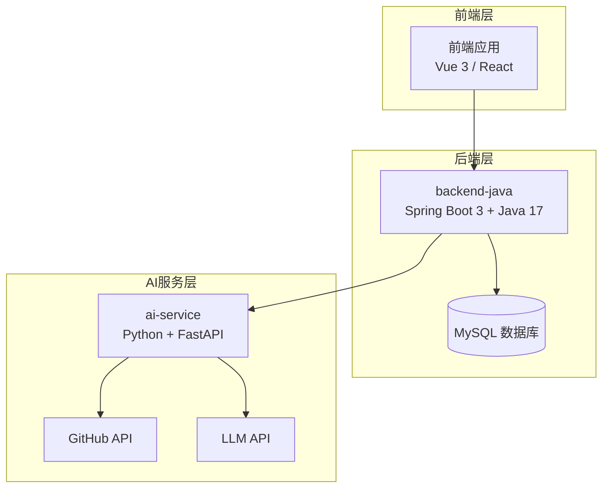
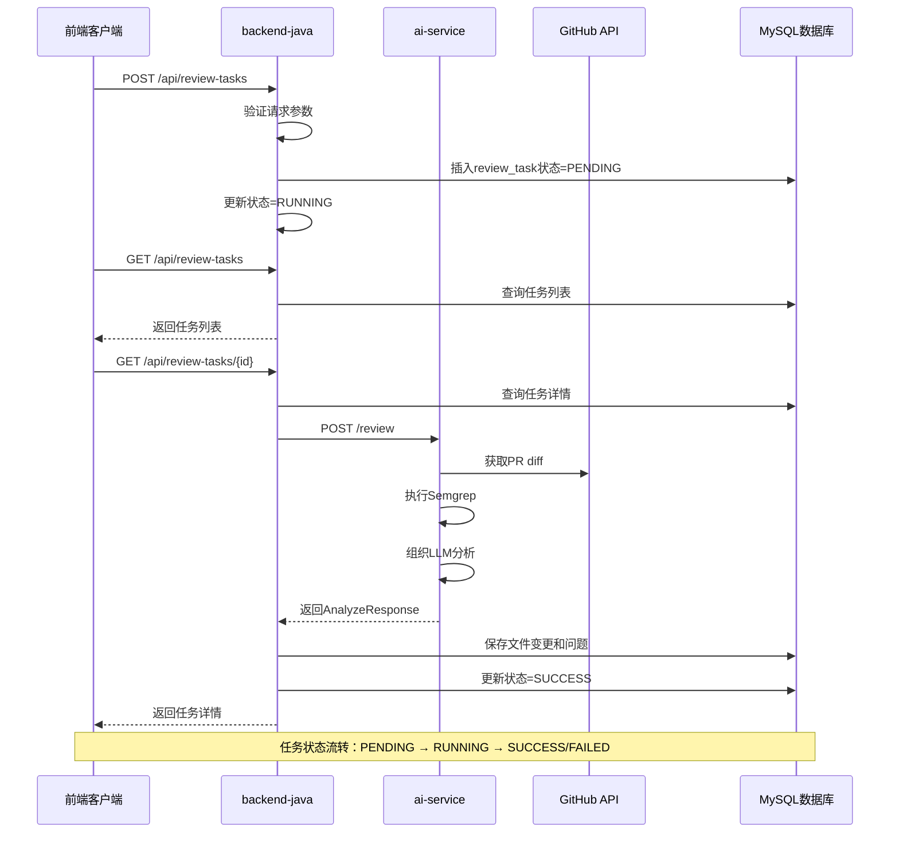
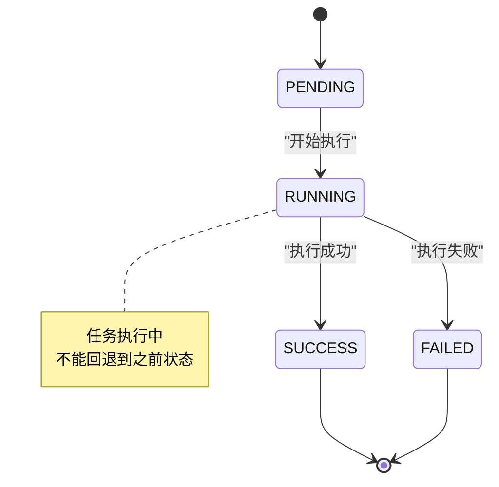

# 后端服务API规范

<cite>
**本文档引用的文件**
- [API.md](file://docs/API.md)
- [PRD.md](file://docs/PRD.md)
- [ARCHITECTURE.md](file://docs/ARCHITECTURE.md)
- [DATABASE.md](file://docs/DATABASE.md)
- [frontend/README.md](file://frontend/README.md)
- [backend-java/README.md](file://backend-java/README.md)
- [03-qoder-review.md](file://handoff/round-01/03-qoder-review.md)
</cite>

## 目录
1. [简介](#简介)
2. [项目结构](#项目结构)
3. [核心组件](#核心组件)
4. [架构概览](#架构概览)
5. [详细接口规范](#详细接口规范)
6. [数据模型](#数据模型)
7. [错误处理机制](#错误处理机制)
8. [性能考虑](#性能考虑)
9. [故障排除指南](#故障排除指南)
10. [结论](#结论)

## 简介

本文档为 CodeReviewX 项目的后端服务API规范，专注于前端调用的三个核心接口。CodeReviewX 是一个面向 GitHub Pull Request 的智能代码审查与修复建议 Agent 系统，当前处于 MVP 需求定义阶段（Round 01）。

**重要说明**：当前为 Round 01 计划阶段，以下所有 API 均未实现，仅提供设计规范和契约定义。

## 项目结构



**图表来源**
- [ARCHITECTURE.md:19-52](file://docs/ARCHITECTURE.md#L19-L52)
- [ARCHITECTURE.md:56-107](file://docs/ARCHITECTURE.md#L56-L107)

**章节来源**
- [ARCHITECTURE.md:1-52](file://docs/ARCHITECTURE.md#L1-L52)
- [PRD.md:26-52](file://docs/PRD.md#L26-L52)

## 核心组件

### 模块职责边界

| 模块 | 职责 | 禁止职责 |
|---|---|---|
| **frontend** | 任务创建UI、任务列表UI、任务详情UI | 直接调用ai-service、GitHub API、保存业务状态、处理LLM提示或Semgrep输出 |
| **backend-java** | 对前端提供统一REST API、创建ReviewTask、管理任务状态流转、调用ai-service、保存ReviewFileChange和ReviewIssue | 执行Semgrep、直接编写LLM prompt、解析复杂diff、绕过ai-service调用LLM |
| **ai-service** | 解析GitHub repoUrl、调用GitHub API获取PR信息和diff、标准化文件变更、执行Semgrep、组织LLM prompt、校验LLM JSON、合并Semgrep与LLM issues | 直接写MySQL、管理ReviewTask状态、对前端暴露为公开业务API |

**章节来源**
- [ARCHITECTURE.md:56-107](file://docs/ARCHITECTURE.md#L56-L107)
- [backend-java/README.md:19-46](file://backend-java/README.md#L19-L46)
- [frontend/README.md:25-38](file://frontend/README.md#L25-L38)

## 架构概览

### 核心调用链路



**图表来源**
- [ARCHITECTURE.md:137-181](file://docs/ARCHITECTURE.md#L137-L181)
- [API.md:54-241](file://docs/API.md#L54-L241)

### 失败链路处理

| 失败场景 | 处理策略 |
|---|---|
| GitHub API失败 | 任务状态FAILED，保存error_message |
| Semgrep失败 | 降级为warning，不导致任务失败 |
| LLM失败 | 使用mock fallback或返回空issues |
| LLM JSON schema校验失败 | 记录原始输出摘要，不返回未校验结构 |
| 数据库保存失败 | 任务状态FAILED |
| ai-service超时 | 任务状态FAILED，保存超时原因 |

**章节来源**
- [ARCHITECTURE.md:170-180](file://docs/ARCHITECTURE.md#L170-L180)

## 详细接口规范

### 通用规范

#### 基础URL配置

| 环境 | backend-java | ai-service |
|---|---|---|
| 本地开发 | `http://localhost:8080` | `http://localhost:8000` |
| Docker Compose | `http://backend-java:8080` | `http://ai-service:8000` |

#### 请求格式
- Content-Type: `application/json`
- 字符集: UTF-8

#### 统一响应格式

**成功响应格式**：
```json
{
  "data": { }
}
```

**统一错误响应格式**：
```json
{
  "code": "ERROR_CODE",
  "message": "Human readable error message",
  "details": null
}
```

**章节来源**
- [API.md:11-51](file://docs/API.md#L11-L51)

### 接口一：创建 Review 任务

#### 端点定义
```http
POST /api/review-tasks
```

**当前状态**：Planned only. Not implemented in Round 01.

#### 请求参数

**请求体**：
```json
{
  "repoUrl": "https://github.com/owner/repo",
  "prNumber": 12
}
```

| 字段 | 类型 | 必填 | 说明 |
|---|---|---|---|
| `repoUrl` | string | 是 | GitHub 仓库地址，格式：`https://github.com/{owner}/{repo}` |
| `prNumber` | integer | 是 | Pull Request 编号，必须为正整数 |

**验证规则**：
- `repoUrl` 必须为有效的 GitHub URL 格式
- `prNumber` 必须为正整数
- URL 格式必须符合 `https://github.com/{owner}/{repo}` 模式

#### 响应格式

**成功响应（201 Created）**：
```json
{
  "taskId": 1,
  "status": "PENDING"
}
```

| 字段 | 类型 | 说明 |
|---|---|---|
| `taskId` | long | 任务 ID |
| `status` | string | 任务初始状态，固定为 `PENDING` |

#### 错误响应

**错误响应示例**：
```json
{
  "code": "INVALID_REQUEST",
  "message": "repoUrl must be a valid GitHub URL",
  "details": null
}
```

**错误码定义**：
- `INVALID_REQUEST` (400): 请求参数错误或校验失败

**使用场景**：
- 用户在前端输入 GitHub 仓库地址和 PR 编号
- 系统需要异步处理复杂的代码审查任务
- 需要支持批量创建多个 Review 任务

**章节来源**
- [API.md:56-95](file://docs/API.md#L56-L95)

### 接口二：查询任务列表

#### 端点定义
```http
GET /api/review-tasks
```

**当前状态**：Planned only. Not implemented in Round 01.

#### 查询参数

| 参数 | 类型 | 说明 |
|---|---|---|
| `page` | integer | 页码，从 0 开始，默认 0 |
| `size` | integer | 每页数量，默认 20 |

#### 响应格式

**成功响应（200 OK）**：
```json
{
  "items": [
    {
      "taskId": 1,
      "repoUrl": "https://github.com/owner/repo",
      "prNumber": 12,
      "status": "SUCCESS",
      "riskLevel": "MEDIUM",
      "createdAt": "2026-06-19T10:00:00"
    }
  ],
  "total": 1
}
```

**items 字段说明**：

| 字段 | 类型 | 说明 |
|---|---|---|
| `taskId` | long | 任务 ID |
| `repoUrl` | string | GitHub 仓库地址 |
| `prNumber` | integer | PR 编号 |
| `status` | string | `PENDING` / `RUNNING` / `SUCCESS` / `FAILED` |
| `riskLevel` | string | `LOW` / `MEDIUM` / `HIGH` / null（未完成时） |
| `createdAt` | string | ISO 8601 格式时间 |

**使用场景**：
- 展示用户历史任务记录
- 支持分页浏览大量任务
- 实时显示任务状态变化

**章节来源**
- [API.md:99-142](file://docs/API.md#L99-L142)

### 接口三：获取任务详情

#### 端点定义
```http
GET /api/review-tasks/{id}
```

**当前状态**：Planned only. Not implemented in Round 01.

#### 路径参数

| 参数 | 类型 | 说明 |
|---|---|---|
| `id` | long | 任务 ID |

#### 响应格式

**成功响应（200 OK）**：
```json
{
  "taskId": 1,
  "repoUrl": "https://github.com/owner/repo",
  "prNumber": 12,
  "status": "SUCCESS",
  "summary": "This PR has several medium risk issues.",
  "riskLevel": "MEDIUM",
  "errorMessage": null,
  "createdAt": "2026-06-19T10:00:00",
  "updatedAt": "2026-06-19T10:01:30",
  "files": [
    {
      "filePath": "src/main/java/example/UserService.java",
      "changeType": "modified",
      "additions": 20,
      "deletions": 5
    }
  ],
  "issues": [
    {
      "type": "BUG",
      "severity": "MEDIUM",
      "filePath": "src/main/java/example/UserService.java",
      "line": 42,
      "title": "Potential null pointer exception",
      "description": "The variable may be null before use.",
      "suggestion": "Add a null check before accessing the field.",
      "source": "LLM"
    }
  ]
}
```

**响应字段说明**：

| 字段 | 类型 | 说明 |
|---|---|---|
| `taskId` | long | 任务 ID |
| `repoUrl` | string | GitHub 仓库地址 |
| `prNumber` | integer | PR 编号 |
| `status` | string | 任务状态 |
| `summary` | string | Review 总结（任务成功后填充） |
| `riskLevel` | string | 风险等级（任务成功后填充） |
| `errorMessage` | string | 失败原因（FAILED 状态时填充） |
| `files` | array | 变更文件列表 |
| `issues` | array | Review 问题列表 |

**files 项字段**：

| 字段 | 类型 | 说明 |
|---|---|---|
| `filePath` | string | 文件路径 |
| `changeType` | string | `added` / `modified` / `deleted` |
| `additions` | integer | 新增行数 |
| `deletions` | integer | 删除行数 |

**issues 项字段**：

| 字段 | 类型 | 说明 |
|---|---|---|
| `type` | string | `BUG` / `SECURITY` / `PERFORMANCE` / `TEST` / `STYLE` |
| `severity` | string | `LOW` / `MEDIUM` / `HIGH` |
| `filePath` | string | 问题所在文件路径 |
| `line` | integer | 问题行号 |
| `title` | string | 问题标题 |
| `description` | string | 问题描述 |
| `suggestion` | string | 修复建议 |
| `source` | string | `LLM` / `SEMGREP` |

#### 错误响应

**错误响应（任务不存在）**：
```json
{
  "code": "TASK_NOT_FOUND",
  "message": "Review task with id 999 not found",
  "details": null
}
```

**错误码定义**：
- `TASK_NOT_FOUND` (404): 任务不存在

**使用场景**：
- 用户点击任务查看详情
- 展示完整的代码审查报告
- 提供问题修复建议和上下文信息

**章节来源**
- [API.md:145-239](file://docs/API.md#L145-L239)

## 数据模型

### ReviewTask 主表

| 字段 | 类型 | 必填 | 说明 |
|---|---|---|---|
| `id` | BIGINT AUTO_INCREMENT | 是 | 主键 |
| `repo_url` | VARCHAR(500) | 是 | GitHub 仓库地址 |
| `pr_number` | INT | 是 | PR 编号 |
| `status` | VARCHAR(20) | 是 | 任务状态，见枚举 |
| `summary` | TEXT | 否 | Review 总结，任务成功后填充 |
| `risk_level` | VARCHAR(10) | 否 | 风险等级，任务成功后填充 |
| `error_message` | TEXT | 否 | 失败原因，FAILED 状态时填充 |
| `created_at` | DATETIME | 是 | 创建时间，自动填充 |
| `updated_at` | DATETIME | 是 | 更新时间，自动维护 |

### ReviewFileChange 文件变更表

| 字段 | 类型 | 必填 | 说明 |
|---|---|---|---|
| `id` | BIGINT AUTO_INCREMENT | 是 | 主键 |
| `task_id` | BIGINT | 是 | 关联 review_task.id |
| `file_path` | VARCHAR(500) | 是 | 文件路径 |
| `change_type` | VARCHAR(20) | 是 | `added` / `modified` / `deleted` |
| `additions` | INT | 是 | 新增行数 |
| `deletions` | INT | 是 | 删除行数 |
| `patch` | TEXT | 否 | diff 片段，MVP 阶段使用 TEXT |
| `created_at` | DATETIME | 是 | 创建时间 |

### ReviewIssue 问题表

| 字段 | 类型 | 必填 | 说明 |
|---|---|---|---|
| `id` | BIGINT AUTO_INCREMENT | 是 | 主键 |
| `task_id` | BIGINT | 是 | 关联 review_task.id |
| `file_path` | VARCHAR(500) | 是 | 问题所在文件路径 |
| `line_number` | INT | 否 | 问题行号（Semgrep 通常有，LLM 可能没有） |
| `type` | VARCHAR(20) | 是 | 问题类型，见枚举 |
| `severity` | VARCHAR(10) | 是 | 严重程度，见枚举 |
| `title` | VARCHAR(255) | 是 | 问题标题 |
| `description` | TEXT | 是 | 问题描述 |
| `suggestion` | TEXT | 否 | 修复建议 |
| `source` | VARCHAR(20) | 是 | 来源：`LLM` / `SEMGREP` |
| `created_at` | DATETIME | 是 | 创建时间 |

**章节来源**
- [DATABASE.md:22-134](file://docs/DATABASE.md#L22-L134)

## 错误处理机制

### 错误码定义

| 错误码 | HTTP状态 | 场景 |
|---|---|---|
| `INVALID_REQUEST` | 400 | 请求参数错误或校验失败 |
| `TASK_NOT_FOUND` | 404 | 任务不存在 |
| `AI_SERVICE_ERROR` | 502 | ai-service 调用失败 |
| `GITHUB_FETCH_FAILED` | 502 | GitHub 数据获取失败 |
| `DATABASE_ERROR` | 500 | 数据库操作失败 |
| `INTERNAL_ERROR` | 500 | 未知系统错误 |

### 统一错误响应格式

```json
{
  "code": "ERROR_CODE",
  "message": "Human readable error message",
  "details": null
}
```

### 失败链路处理策略

1. **GitHub API失败**：任务状态FAILED，保存error_message
2. **Semgrep失败**：降级为warning，不导致任务失败
3. **LLM失败**：使用mock fallback或返回空issues
4. **LLM JSON schema校验失败**：记录原始输出摘要，不返回未校验结构
5. **数据库保存失败**：任务状态FAILED
6. **ai-service超时**：任务状态FAILED，保存超时原因

**章节来源**
- [API.md:41-51](file://docs/API.md#L41-L51)
- [ARCHITECTURE.md:170-180](file://docs/ARCHITECTURE.md#L170-L180)

## 性能考虑

### 状态流转规则



**图表来源**
- [ARCHITECTURE.md:110-134](file://docs/ARCHITECTURE.md#L110-L134)

### 枚举值定义

**TaskStatus**：
- `PENDING`: 任务已创建，尚未执行
- `RUNNING`: 任务执行中  
- `SUCCESS`: 任务执行成功
- `FAILED`: 任务执行失败

**RiskLevel**：
- `LOW`: 低风险
- `MEDIUM`: 中风险
- `HIGH`: 高风险

**IssueType**：
- `BUG`: 潜在 Bug
- `SECURITY`: 安全风险
- `PERFORMANCE`: 性能问题
- `TEST`: 测试缺失
- `STYLE`: 代码风格

**IssueSeverity**：
- `LOW`: 低严重程度
- `MEDIUM`: 中严重程度
- `HIGH`: 高严重程度

**ChangeType**：
- `added`: 新增文件
- `modified`: 修改文件
- `deleted`: 删除文件

**IssueSource**：
- `LLM`: 来自 LLM 分析
- `SEMGREP`: 来自 Semgrep 静态分析

**章节来源**
- [API.md:335-378](file://docs/API.md#L335-L378)
- [DATABASE.md:203-254](file://docs/DATABASE.md#L203-L254)

## 故障排除指南

### 常见问题诊断

1. **任务创建失败**
   - 检查 `repoUrl` 是否为有效的 GitHub URL 格式
   - 确认 `prNumber` 为正整数
   - 验证网络连接和 GitHub API 可达性

2. **任务列表为空**
   - 检查分页参数 `page` 和 `size`
   - 确认数据库连接正常
   - 验证任务状态过滤条件

3. **任务详情查询失败**
   - 确认任务 ID 存在且有效
   - 检查数据库中是否存在对应记录
   - 验证 ai-service 调用状态

### 调试建议

1. **启用详细日志**：在开发环境中开启 Spring Boot 日志级别为 DEBUG
2. **监控数据库连接**：确保 MySQL 连接池配置正确
3. **验证外部服务**：检查 ai-service 和 GitHub API 的可用性
4. **测试网络连通性**：确认容器间的网络通信正常

**章节来源**
- [ARCHITECTURE.md:312-341](file://docs/ARCHITECTURE.md#L312-L341)

## 结论

CodeReviewX 的后端服务API规范为 Round 01 计划阶段提供了完整的设计蓝图。虽然当前所有接口均未实现，但详细的契约定义、数据模型和错误处理机制为后续实现奠定了坚实基础。

**关键要点**：
- 所有接口均标记为 "Planned only. Not implemented in Round 01"
- 明确的模块职责边界确保了系统的可维护性
- 完整的错误处理机制和状态流转规则
- 详细的请求响应示例和字段说明
- 与前端和 AI 服务的清晰交互边界

这些规范将指导 Round 02 的实现工作，确保系统能够按时完成 MVP 目标，为用户提供高质量的代码审查服务。