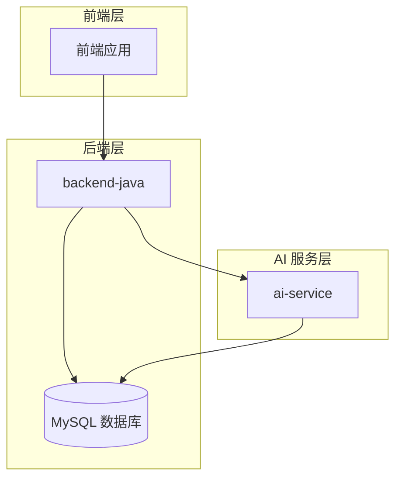
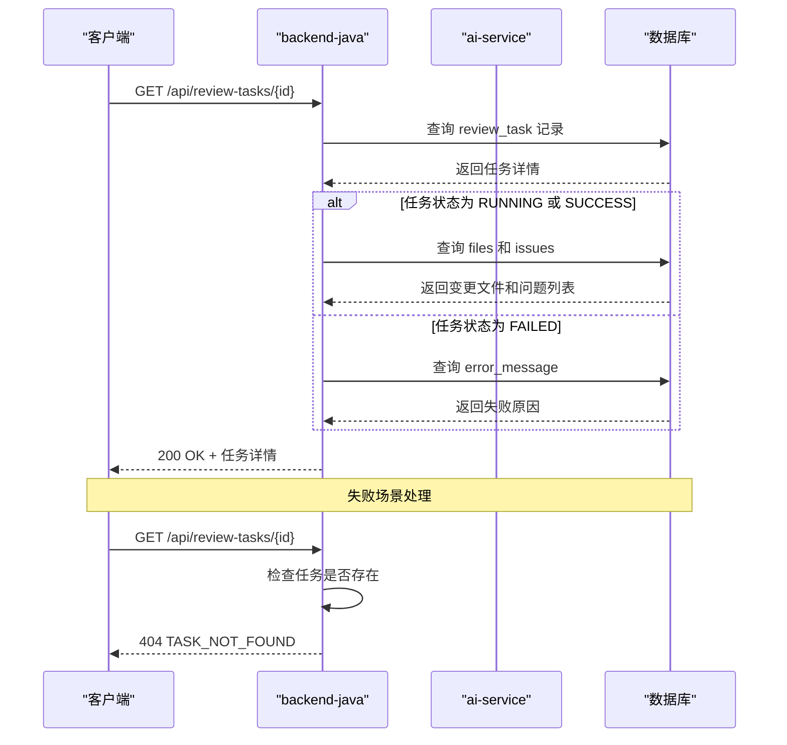
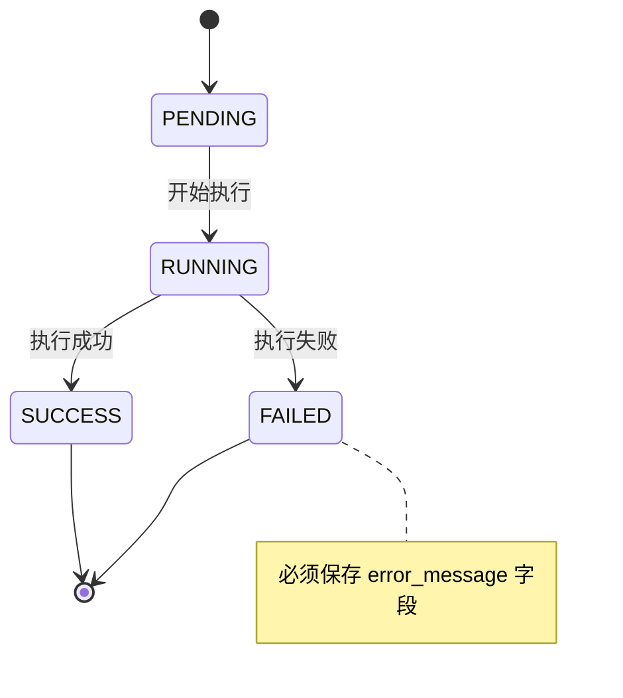

# 获取任务详情接口

<cite>
**本文档引用的文件**
- [API.md](file://docs/API.md)
- [ARCHITECTURE.md](file://docs/ARCHITECTURE.md)
- [DATABASE.md](file://docs/DATABASE.md)
- [README.md](file://frontend/README.md)
- [backend-java/README.md](file://backend-java/README.md)
- [ReviewTaskStatus.java](file://backend-java/src/main/java/com/codereviewx/backend/review/enums/ReviewTaskStatus.java)
- [IssueType.java](file://backend-java/src/main/java/com/codereviewx/backend/review/enums/IssueType.java)
- [IssueSeverity.java](file://backend-java/src/main/java/com/codereviewx/backend/review/enums/IssueSeverity.java)
- [RiskLevel.java](file://backend-java/src/main/java/com/codereviewx/backend/review/enums/RiskLevel.java)
- [IssueSource.java](file://backend-java/src/main/java/com/codereviewx/backend/review/enums/IssueSource.java)
- [ReviewIssueResponse.java](file://backend-java/src/main/java/com/codereviewx/backend/review/dto/ReviewIssueResponse.java)
- [CreateReviewTaskRequest.java](file://backend-java/src/main/java/com/codereviewx/backend/review/dto/CreateReviewTaskRequest.java)
</cite>

## 目录
1. [简介](#简介)
2. [接口概述](#接口概述)
3. [请求参数](#请求参数)
4. [响应结构](#响应结构)
5. [枚举类型定义](#枚举类型定义)
6. [请求响应示例](#请求响应示例)
7. [错误处理](#错误处理)
8. [实现状态说明](#实现状态说明)
9. [架构流程图](#架构流程图)
10. [最佳实践](#最佳实践)

## 简介

本文档详细说明了 CodeReviewX 项目中获取任务详情的 API 接口。该接口用于查询指定任务的详细信息，包括任务基本信息、变更文件列表和审查问题列表等完整数据结构。

**重要提示**：当前为 Round 01 计划阶段，该接口尚未实现，仅提供设计文档。

## 接口概述

### 基本信息

- **HTTP 方法**：GET
- **端点路径**：`/api/review-tasks/{id}`
- **功能描述**：根据任务 ID 获取任务的完整详情信息
- **当前状态**：Planned only. Not implemented in Round 01

### 基础配置

- **基础 URL**：
  - 本地开发：`http://localhost:8080`
  - Docker Compose：`http://backend-java:8080`
- **内容类型**：`application/json`
- **字符集**：UTF-8

**章节来源**
- [API.md:11-17](file://docs/API.md#L11-L17)
- [API.md:145-151](file://docs/API.md#L145-L151)

## 请求参数

### 路径参数

| 参数名 | 类型 | 必填 | 说明 |
|--------|------|------|------|
| id | long | 是 | 任务 ID |

### 参数验证要求

- **id 参数**：
  - 类型：长整型（long）
  - 范围：必须为正整数
  - 格式：数字字符串
  - 验证：必须存在且有效

**章节来源**
- [API.md:153-157](file://docs/API.md#L153-L157)

## 响应结构

### 成功响应（200 OK）

#### 基本信息字段

| 字段名 | 类型 | 必填 | 说明 |
|--------|------|------|------|
| taskId | long | 是 | 任务 ID |
| repoUrl | string | 是 | GitHub 仓库地址 |
| prNumber | integer | 是 | Pull Request 编号 |
| status | string | 是 | 任务状态 |
| summary | string | 否 | Review 总结（任务成功后填充） |
| riskLevel | string | 否 | 风险等级（任务成功后填充） |
| errorMessage | string | 否 | 失败原因（FAILED 状态时填充） |
| createdAt | string | 是 | ISO 8601 格式创建时间 |
| updatedAt | string | 是 | ISO 8601 格式更新时间 |

#### files 数组字段

每个文件对象包含以下字段：

| 字段名 | 类型 | 必填 | 说明 |
|--------|------|------|------|
| filePath | string | 是 | 文件路径 |
| changeType | string | 是 | 变更类型 |
| additions | integer | 是 | 新增行数 |
| deletions | integer | 是 | 删除行数 |

#### issues 数组字段

每个问题对象包含以下字段：

| 字段名 | 类型 | 必填 | 说明 |
|--------|------|------|------|
| type | string | 是 | 问题类型 |
| severity | string | 是 | 严重程度 |
| filePath | string | 是 | 问题所在文件路径 |
| line | integer | 是 | 问题行号 |
| title | string | 是 | 问题标题 |
| description | string | 是 | 问题描述 |
| suggestion | string | 是 | 修复建议 |
| source | string | 是 | 问题来源 |

**章节来源**
- [API.md:159-193](file://docs/API.md#L159-L193)
- [API.md:195-230](file://docs/API.md#L195-L230)

## 枚举类型定义

### TaskStatus（任务状态）

| 值 | 含义 |
|----|-----|
| `PENDING` | 任务已创建，尚未执行 |
| `RUNNING` | 任务执行中 |
| `SUCCESS` | 任务执行成功 |
| `FAILED` | 任务执行失败 |

### RiskLevel（风险等级）

| 值 | 含义 |
|----|-----|
| `LOW` | 低风险 |
| `MEDIUM` | 中风险 |
| `HIGH` | 高风险 |

### IssueType（问题类型）

| 值 | 含义 |
|----|-----|
| `BUG` | 潜在 Bug |
| `SECURITY` | 安全风险 |
| `PERFORMANCE` | 性能问题 |
| `TEST` | 测试缺失 |
| `STYLE` | 代码风格 |

### IssueSeverity（问题严重程度）

| 值 | 含义 |
|----|-----|
| `LOW` | 低严重程度 |
| `MEDIUM` | 中严重程度 |
| `HIGH` | 高严重程度 |

### ChangeType（变更类型）

| 值 | 含义 |
|----|-----|
| `added` | 新增文件 |
| `modified` | 修改文件 |
| `deleted` | 删除文件 |

### IssueSource（问题来源）

| 值 | 含义 |
|----|-----|
| `LLM` | 来自 LLM 分析 |
| `SEMGREP` | 来自 Semgrep 静态分析 |

**章节来源**
- [API.md:335-378](file://docs/API.md#L335-L378)
- [DATABASE.md:203-254](file://docs/DATABASE.md#L203-L254)

## 请求响应示例

### 成功请求示例

**请求**
```http
GET /api/review-tasks/123
Host: localhost:8080
Content-Type: application/json
```

**响应**
```json
{
  "taskId": 123,
  "repoUrl": "https://github.com/example/repo",
  "prNumber": 456,
  "status": "SUCCESS",
  "summary": "This PR has several medium risk issues.",
  "riskLevel": "MEDIUM",
  "errorMessage": null,
  "createdAt": "2026-06-19T10:00:00",
  "updatedAt": "2026-06-19T10:01:30",
  "files": [
    {
      "filePath": "src/main/java/example/UserService.java",
      "changeType": "modified",
      "additions": 20,
      "deletions": 5
    }
  ],
  "issues": [
    {
      "type": "BUG",
      "severity": "MEDIUM",
      "filePath": "src/main/java/example/UserService.java",
      "line": 42,
      "title": "Potential null pointer exception",
      "description": "The variable may be null before use.",
      "suggestion": "Add a null check before accessing the field.",
      "source": "LLM"
    }
  ]
}
```

### 错误响应示例

**任务不存在**
```json
{
  "code": "TASK_NOT_FOUND",
  "message": "Review task with id 999 not found",
  "details": null
}
```

**无效请求**
```json
{
  "code": "INVALID_REQUEST",
  "message": "Invalid task ID format",
  "details": null
}
```

**章节来源**
- [API.md:159-193](file://docs/API.md#L159-L193)
- [API.md:231-239](file://docs/API.md#L231-L239)

## 错误处理

### 错误码定义

| 错误码 | HTTP 状态 | 场景 |
|--------|-----------|------|
| `INVALID_REQUEST` | 400 | 请求参数错误或校验失败 |
| `TASK_NOT_FOUND` | 404 | 任务不存在 |
| `AI_SERVICE_ERROR` | 502 | ai-service 调用失败 |
| `GITHUB_FETCH_FAILED` | 502 | GitHub 数据获取失败 |
| `DATABASE_ERROR` | 500 | 数据库操作失败 |
| `INTERNAL_ERROR` | 500 | 未知系统错误 |

### 错误响应格式

所有错误响应遵循统一格式：

```json
{
  "code": "ERROR_CODE",
  "message": "Human readable error message",
  "details": null
}
```

**章节来源**
- [API.md:41-51](file://docs/API.md#L41-L51)
- [API.md:31-39](file://docs/API.md#L31-L39)

## 实现状态说明

### 当前状态

- **Round 01 状态**：Planned only. Not implemented in Round 01
- **实现进度**：仅提供 API 设计文档，实际业务代码尚未实现
- **技术栈规划**：Spring Boot 3 + Java 17 + MyBatis-Plus

### 计划功能

- **ReviewTask 管理**：创建任务、管理状态转换（PENDING → RUNNING → SUCCESS / FAILED）、存储结果
- **REST API 提供**：`POST /api/review-tasks`、`GET /api/review-tasks`、`GET /api/review-tasks/{id}`
- **持久化存储**：通过 MySQL 存储 `review_task`、`review_file_change`、`review_issue` 记录
- **AI 服务集成**：调用 `POST /review` 获取结构化 Review JSON 响应

### 依赖关系



**图表来源**
- [ARCHITECTURE.md:137-168](file://docs/ARCHITECTURE.md#L137-L168)

**章节来源**
- [backend-java/README.md:3-16](file://backend-java/README.md#L3-L16)
- [backend-java/README.md:19-25](file://backend-java/README.md#L19-L25)

## 架构流程图

### 完整调用链路



**图表来源**
- [ARCHITECTURE.md:137-182](file://docs/ARCHITECTURE.md#L137-L182)

### 状态流转规则



**图表来源**
- [ARCHITECTURE.md:128-134](file://docs/ARCHITECTURE.md#L128-L134)

## 最佳实践

### 前端集成指南

1. **基础 URL 配置**：通过 `VITE_API_BASE_URL` 环境变量控制后端基础 URL
2. **错误处理**：实现统一的错误处理机制，区分网络错误和业务错误
3. **缓存策略**：对相同任务 ID 的请求进行缓存，避免重复请求
4. **重试机制**：对临时性错误（如网络超时）实现指数退避重试

### 后端实现建议

1. **参数验证**：严格验证路径参数 id 的有效性
2. **状态检查**：确保只返回已完成的任务详情
3. **数据一致性**：使用事务保证 files 和 issues 数据的一致性
4. **性能优化**：对频繁查询的字段建立适当的数据库索引

### 数据库设计考虑

- `review_task` 表的 `status` 字段需要索引支持
- `created_at` 字段用于排序和分页
- `updated_at` 字段自动更新机制

**章节来源**
- [README.md:52-61](file://frontend/README.md#L52-L61)
- [DATABASE.md:27-40](file://docs/DATABASE.md#L27-L40)