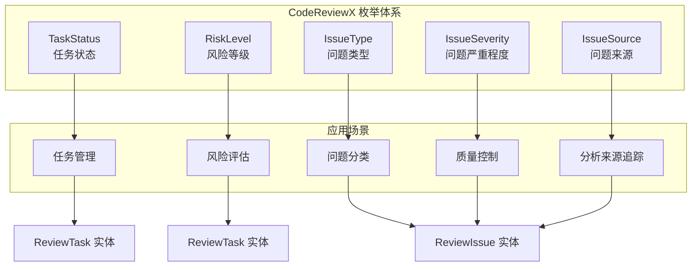
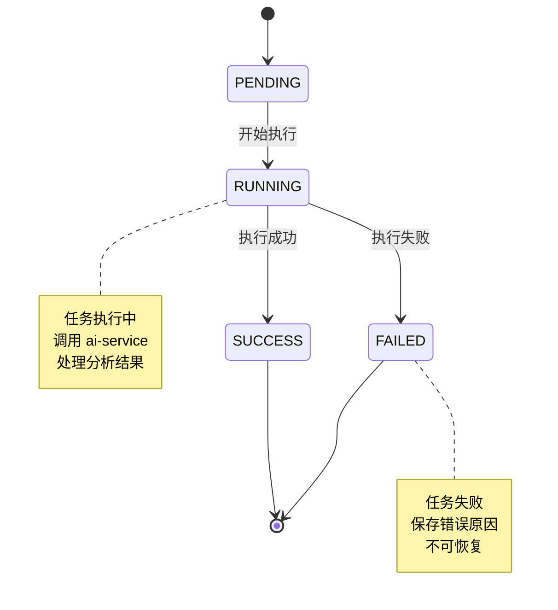
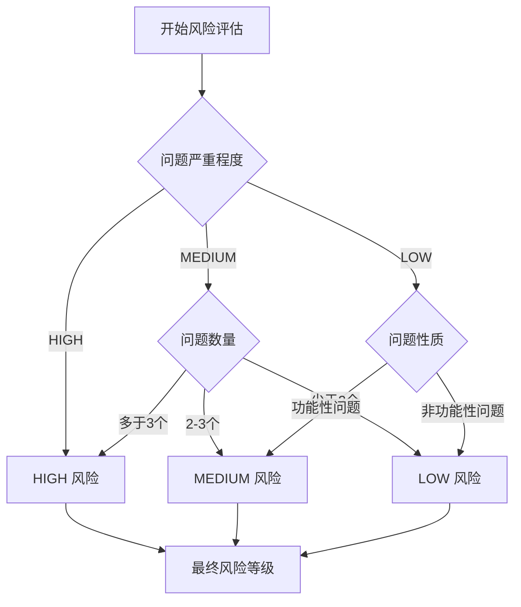
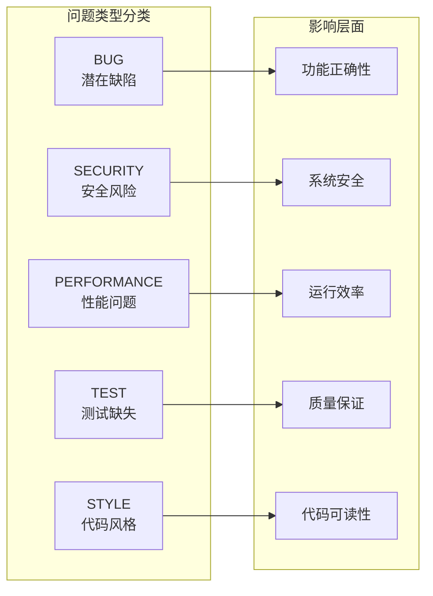
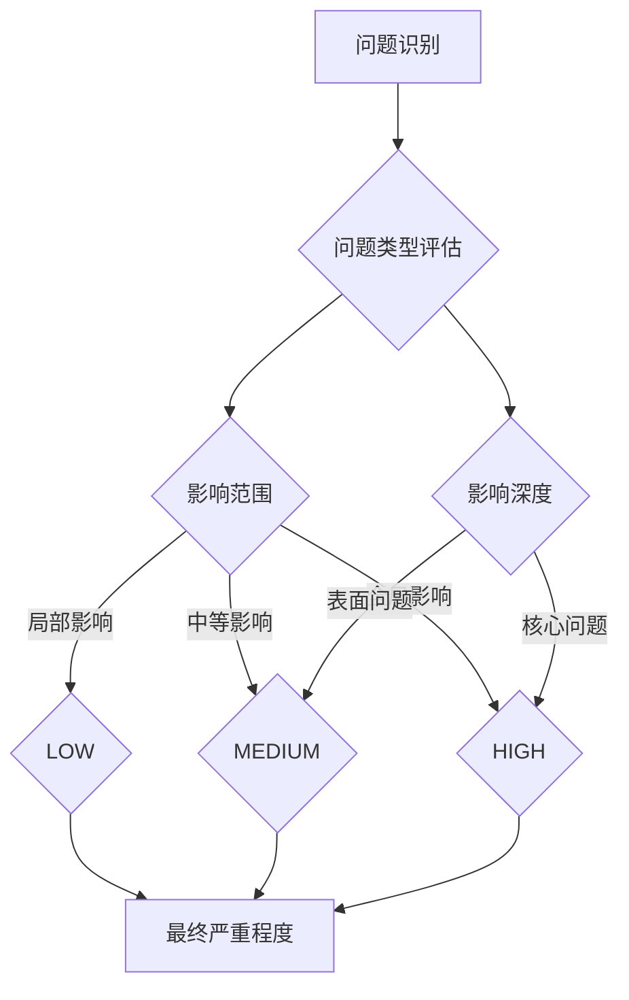
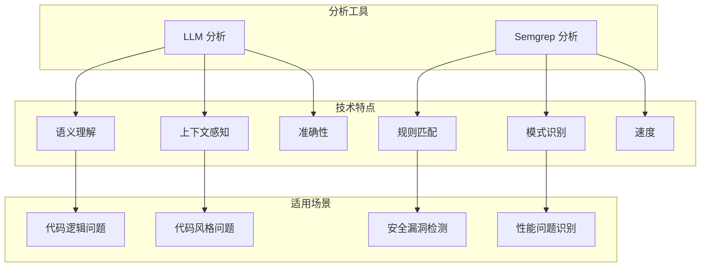
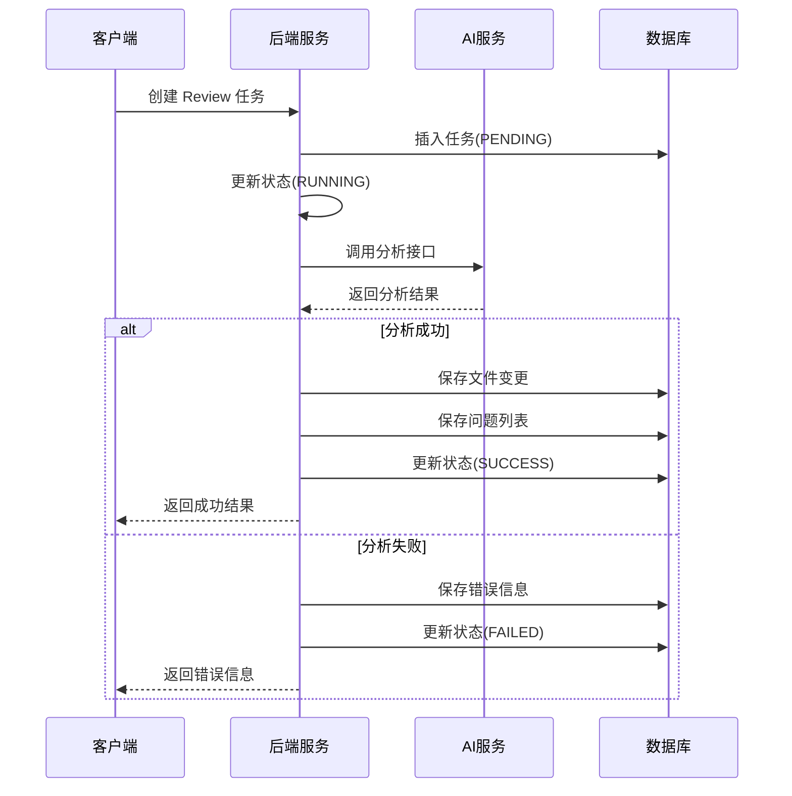

# 枚举类型定义

<cite>
**本文档引用的文件**
- [API.md](file://docs/API.md)
- [DATABASE.md](file://docs/DATABASE.md)
- [ARCHITECTURE.md](file://docs/ARCHITECTURE.md)
</cite>

## 目录
1. [简介](#简介)
2. [枚举类型概览](#枚举类型概览)
3. [TaskStatus 任务状态枚举](#taskstatus-任务状态枚举)
4. [RiskLevel 风险等级枚举](#risklevel-风险等级枚举)
5. [IssueType 问题类型枚举](#issuetype-问题类型枚举)
6. [IssueSeverity 问题严重程度枚举](#isseverity-问题严重程度枚举)
7. [IssueSource 问题来源枚举](#issuesource-问题来源枚举)
8. [使用场景与业务含义](#使用场景与业务含义)
9. [状态流转图](#状态流转图)
10. [最佳实践建议](#最佳实践建议)

## 简介

CodeReviewX 系统通过精心设计的枚举类型来确保数据的一致性和业务逻辑的清晰性。这些枚举类型贯穿整个系统，从任务状态管理到问题分类，为开发者提供了标准化的数据表示方式。

本文档详细说明了 CodeReviewX 系统中使用的所有枚举类型，包括它们的含义、取值范围和具体应用场景。通过理解这些枚举的设计理念和使用模式，开发者可以更好地理解和使用 CodeReviewX 系统的各项功能。

## 枚举类型概览

CodeReviewX 系统主要使用以下五种核心枚举类型：

**图表来源**
- [ARCHITECTURE.md:210-214](file://docs/ARCHITECTURE.md#L210-L214)
- [DATABASE.md:205-253](file://docs/DATABASE.md#L205-L253)

## TaskStatus 任务状态枚举

TaskStatus 枚举用于描述 ReviewTask 任务在整个生命周期内的状态变化。

### 枚举值定义

| 值 | 含义 | 业务场景 |
|---|---|---|
| `PENDING` | 任务已创建，尚未执行 | 任务刚创建时的状态，等待执行 |
| `RUNNING` | 任务执行中 | 后端调用 ai-service 过程中的中间状态 |
| `SUCCESS` | 任务执行成功 | 所有分析完成且结果保存成功的最终状态 |
| `FAILED` | 任务执行失败 | 任何关键步骤失败时的终止状态 |

### 状态流转规则

**图表来源**
- [ARCHITECTURE.md:114-133](file://docs/ARCHITECTURE.md#L114-L133)

### 使用场景

- **前端展示**：实时显示任务执行进度
- **后端控制**：控制任务执行流程和状态转换
- **错误处理**：记录和展示失败原因
- **数据分析**：统计任务成功率和失败率

**章节来源**
- [API.md:337-344](file://docs/API.md#L337-L344)
- [DATABASE.md:205-212](file://docs/DATABASE.md#L205-L212)
- [ARCHITECTURE.md:119-133](file://docs/ARCHITECTURE.md#L119-L133)

## RiskLevel 风险等级枚举

RiskLevel 枚举用于量化 PR Review 的整体风险水平，帮助团队确定审查的优先级和关注重点。

### 枚举值定义

| 值 | 含义 | 风险特征 |
|---|---|---|
| `LOW` | 低风险 | 基本无重大问题，可能是一些小的改进或优化 |
| `MEDIUM` | 中风险 | 存在一些需要注意的问题，需要仔细审查 |
| `HIGH` | 高风险 | 存在严重问题，可能影响系统稳定性或安全性 |

### 风险评估标准

**图表来源**
- [DATABASE.md:214-220](file://docs/DATABASE.md#L214-L220)

### 应用场景

- **审查优先级**：高风险 PR 优先审查
- **决策支持**：为合并决策提供风险参考
- **质量监控**：跟踪项目整体质量趋势
- **报告生成**：生成风险分析报告

**章节来源**
- [API.md:346-352](file://docs/API.md#L346-L352)
- [DATABASE.md:214-220](file://docs/DATABASE.md#L214-L220)

## IssueType 问题类型枚举

IssueType 枚举用于分类 PR 中发现的各种问题类型，帮助开发者快速识别和处理不同类型的问题。

### 枚举值定义

| 值 | 含义 | 问题特征 |
|---|---|---|
| `BUG` | 潜在 Bug | 可能导致程序错误或异常行为的问题 |
| `SECURITY` | 安全风险 | 可能被恶意利用的安全漏洞或风险点 |
| `PERFORMANCE` | 性能问题 | 影响系统性能或用户体验的问题 |
| `TEST` | 测试缺失 | 缺少必要的单元测试或集成测试 |
| `STYLE` | 代码风格 | 违反团队代码规范或风格指南的问题 |

### 问题分类矩阵

**图表来源**
- [DATABASE.md:222-230](file://docs/DATABASE.md#L222-L230)

### 应用场景

- **问题筛选**：按类型筛选和排序问题
- **修复优先级**：根据类型确定修复优先级
- **统计分析**：统计各类问题的数量和分布
- **质量报告**：生成不同类型问题的质量报告

**章节来源**
- [API.md:354-362](file://docs/API.md#L354-L362)
- [DATABASE.md:222-230](file://docs/DATABASE.md#L222-L230)

## IssueSeverity 问题严重程度枚举

IssueSeverity 枚举用于量化单个问题的严重程度，帮助团队合理分配资源和确定修复优先级。

### 枚举值定义

| 值 | 含义 | 严重程度特征 |
|---|---|---|
| `LOW` | 低严重程度 | 对系统影响较小，通常是小的改进或优化建议 |
| `MEDIUM` | 中严重程度 | 对系统有一定影响，需要关注和处理的问题 |
| `HIGH` | 高严重程度 | 对系统有重大影响，需要立即处理的关键问题 |

### 严重程度评估流程

**图表来源**
- [DATABASE.md:232-238](file://docs/DATABASE.md#L232-L238)

### 应用场景

- **修复优先级**：高严重程度问题优先修复
- **资源分配**：根据严重程度合理分配开发资源
- **风险控制**：重点关注高严重程度问题
- **质量门禁**：设置不同严重程度的准入标准

**章节来源**
- [API.md:364-370](file://docs/API.md#L364-L370)
- [DATABASE.md:232-238](file://docs/DATABASE.md#L232-L238)

## IssueSource 问题来源枚举

IssueSource 枚举用于标识问题是由哪种分析工具产生的，帮助团队了解问题的可信度和来源可靠性。

### 枚举值定义

| 值 | 含义 | 技术实现 |
|---|---|---|
| `LLM` | 来自 LLM 分析 | 通过大型语言模型进行语义分析和代码理解 |
| `SEMGREP` | 来自 Semgrep 静态分析 | 通过 Semgrep 工具进行规则匹配和静态代码分析 |

### 分析工具对比

**图表来源**
- [DATABASE.md:248-253](file://docs/DATABASE.md#L248-L253)

### 应用场景

- **问题验证**：结合多种来源提高问题准确性
- **信任度评估**：根据来源评估问题可信度
- **分析效果对比**：比较不同工具的分析效果
- **质量控制**：确保分析结果的多样性和完整性

**章节来源**
- [API.md:372-377](file://docs/API.md#L372-L377)
- [DATABASE.md:248-253](file://docs/DATABASE.md#L248-L253)

## 使用场景与业务含义

### 任务状态管理

TaskStatus 枚举确保了任务执行流程的可控性和可追踪性。通过明确的状态定义，系统能够：

- **防止状态倒退**：状态只能单向流转，避免逻辑混乱
- **提供错误恢复**：失败状态可以记录详细的错误信息
- **支持并发控制**：避免同一任务的重复执行
- **便于监控分析**：统计各状态的任务数量和执行时间

### 风险评估体系

RiskLevel 枚举建立了统一的风险评估标准，为团队提供了：

- **客观的风险判断**：基于问题类型和严重程度的量化评估
- **优先级决策支持**：帮助确定审查和修复的优先级
- **质量趋势监控**：跟踪项目整体质量的变化趋势
- **资源配置依据**：为人员和时间资源的分配提供参考

### 问题分类与治理

IssueType 和 IssueSeverity 枚举共同构成了完整的问题治理体系：

- **问题分类**：将不同类型的问题进行有效分类和管理
- **优先级排序**：结合严重程度确定处理优先级
- **质量改进**：通过持续的问题分析推动代码质量提升
- **知识积累**：建立问题类型和解决方案的知识库

### 分析质量保障

IssueSource 枚举确保了分析结果的可靠性和多样性：

- **交叉验证**：通过多种分析工具的结果交叉验证
- **可信度评估**：根据分析来源评估问题的可信度
- **技术互补**：LLM 和 Semgrep 各自的优势互补
- **质量控制**：确保分析结果的准确性和完整性

## 状态流转图

**图表来源**
- [ARCHITECTURE.md:139-168](file://docs/ARCHITECTURE.md#L139-L168)

## 最佳实践建议

### 枚举使用规范

1. **统一命名约定**：使用大写字母和下划线分隔的命名方式
2. **保持枚举稳定**：避免频繁修改现有枚举值
3. **添加文档注释**：为每个枚举值添加清晰的业务含义说明
4. **使用常量定义**：在代码中定义常量而非硬编码字符串

### 状态管理最佳实践

1. **状态转换验证**：每次状态转换前验证转换的有效性
2. **错误处理完善**：为每种失败场景提供清晰的错误信息
3. **日志记录完整**：记录状态转换的时间和原因
4. **监控告警机制**：对异常状态转换及时告警

### 问题管理最佳实践

1. **问题分类准确性**：确保问题类型分类的准确性
2. **严重程度评估一致性**：建立统一的严重程度评估标准
3. **来源标注完整性**：完整标注问题的分析来源
4. **修复跟踪机制**：建立问题修复的跟踪和验证机制

### 数据一致性保障

1. **数据库约束**：在数据库层面设置枚举值约束
2. **应用层验证**：在应用层进行枚举值验证
3. **API 层保护**：在 API 层面限制枚举值范围
4. **前端展示优化**：在前端提供友好的枚举值展示

通过遵循这些最佳实践，可以确保 CodeReviewX 系统中枚举类型的使用既规范又高效，为系统的稳定运行和持续发展奠定坚实基础。