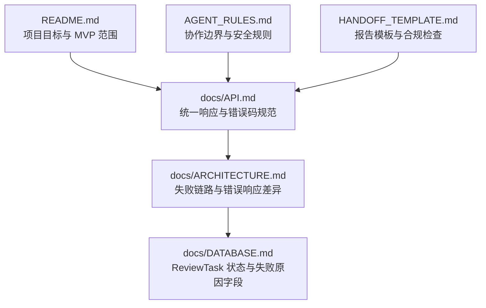
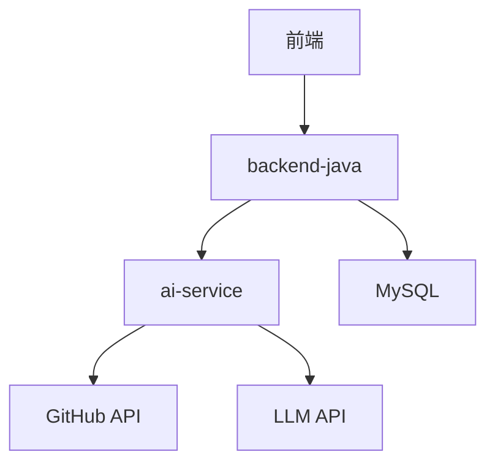
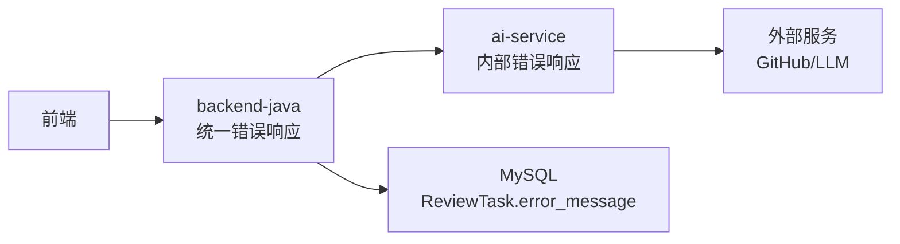

# 错误码参考手册

<cite>
**本文引用的文件**
- [API.md](file://docs/API.md)
- [ARCHITECTURE.md](file://docs/ARCHITECTURE.md)
- [DATABASE.md](file://docs/DATABASE.md)
- [README.md](file://README.md)
- [AGENT_RULES.md](file://docs/AGENT_RULES.md)
- [HANDOFF_TEMPLATE.md](file://docs/HANDOFF_TEMPLATE.md)
</cite>

## 目录
1. [简介](#简介)
2. [项目结构](#项目结构)
3. [核心组件](#核心组件)
4. [架构概览](#架构概览)
5. [详细组件分析](#详细组件分析)
6. [依赖关系分析](#依赖关系分析)
7. [性能考量](#性能考量)
8. [故障排查指南](#故障排查指南)
9. [结论](#结论)
10. [附录](#附录)

## 简介
本手册面向前后端开发者与使用者，提供 CodeReviewX 系统的完整错误码参考与统一响应格式说明。内容覆盖：
- 统一成功与错误响应结构
- 错误码定义与 HTTP 状态映射
- 错误消息格式与 details 字段用途
- 具体错误响应示例
- 常见错误场景与解决方案
- 与系统架构、数据库设计的对应关系

## 项目结构
围绕错误处理与 API 规范，相关文档分布如下：
- docs/API.md：定义统一响应格式、错误码与 HTTP 状态映射、错误响应示例
- docs/ARCHITECTURE.md：定义失败链路处理策略、错误响应格式差异（backend-java vs ai-service）
- docs/DATABASE.md：定义 ReviewTask 状态与失败原因字段，支撑错误场景落地
- README.md：项目背景与 MVP 目标，帮助理解错误码的上下文
- AGENT_RULES.md 与 HANDOFF_TEMPLATE.md：定义协作边界与错误处理的合规要求

图表来源
- [API.md:1-378](file://docs/API.md#L1-L378)
- [ARCHITECTURE.md:1-417](file://docs/ARCHITECTURE.md#L1-L417)
- [DATABASE.md:1-294](file://docs/DATABASE.md#L1-L294)
- [README.md:1-120](file://README.md#L1-L120)
- [AGENT_RULES.md:1-160](file://docs/AGENT_RULES.md#L1-L160)
- [HANDOFF_TEMPLATE.md:1-128](file://docs/HANDOFF_TEMPLATE.md#L1-L128)

章节来源
- [API.md:1-378](file://docs/API.md#L1-L378)
- [ARCHITECTURE.md:1-417](file://docs/ARCHITECTURE.md#L1-L417)
- [DATABASE.md:1-294](file://docs/DATABASE.md#L1-L294)
- [README.md:1-120](file://README.md#L1-L120)
- [AGENT_RULES.md:1-160](file://docs/AGENT_RULES.md#L1-L160)
- [HANDOFF_TEMPLATE.md:1-128](file://docs/HANDOFF_TEMPLATE.md#L1-L128)

## 核心组件
- 统一响应格式
  - 成功响应：包含 data 字段，承载业务数据
  - 错误响应：包含 code、message、details 字段
- 错误码与 HTTP 状态映射
  - INVALID_REQUEST → 400
  - TASK_NOT_FOUND → 404
  - AI_SERVICE_ERROR → 502
  - GITHUB_FETCH_FAILED → 502
  - DATABASE_ERROR → 500
  - INTERNAL_ERROR → 500
- 错误响应差异
  - backend-java：统一错误响应格式（code、message、details）
  - ai-service：内部错误响应格式（errorCode、message、recoverable）

章节来源
- [API.md:23-51](file://docs/API.md#L23-L51)
- [ARCHITECTURE.md:312-341](file://docs/ARCHITECTURE.md#L312-L341)

## 架构概览
系统采用三层边界：前端仅调用 backend-java，backend-java 调用 ai-service，ai-service 调用外部服务（GitHub API、LLM）。错误处理遵循“mock fallback 优先”的原则，并在数据库层面记录失败原因。

图表来源
- [ARCHITECTURE.md:19-52](file://docs/ARCHITECTURE.md#L19-L52)
- [ARCHITECTURE.md:137-180](file://docs/ARCHITECTURE.md#L137-L180)

章节来源
- [ARCHITECTURE.md:19-52](file://docs/ARCHITECTURE.md#L19-L52)
- [ARCHITECTURE.md:137-180](file://docs/ARCHITECTURE.md#L137-L180)

## 详细组件分析

### 统一响应格式与错误码定义
- 成功响应结构
  - data：承载业务数据对象或数组
- 错误响应结构（backend-java）
  - code：错误码字符串
  - message：人类可读的错误信息
  - details：扩展细节，当前为 null
- 错误码与 HTTP 状态映射
  - INVALID_REQUEST：400（请求参数错误或校验失败）
  - TASK_NOT_FOUND：404（任务不存在）
  - AI_SERVICE_ERROR：502（ai-service 调用失败）
  - GITHUB_FETCH_FAILED：502（GitHub 数据获取失败）
  - DATABASE_ERROR：500（数据库操作失败）
  - INTERNAL_ERROR：500（未知系统错误）

章节来源
- [API.md:23-51](file://docs/API.md#L23-L51)
- [API.md:87-95](file://docs/API.md#L87-L95)
- [API.md:231-239](file://docs/API.md#L231-L239)

### ai-service 错误响应格式
- 字段
  - errorCode：错误码字符串
  - message：人类可读的错误信息
  - recoverable：是否可恢复（布尔）
- 示例场景
  - GITHUB_FETCH_FAILED：GitHub API 请求失败
  - PR_NOT_FOUND：PR 不存在
  - SEMGREP_FAILED：Semgrep 执行失败（通常降级处理）
  - LLM_FAILED：LLM 调用失败（通常降级为 mock）
  - INVALID_REQUEST：请求参数错误

章节来源
- [API.md:313-331](file://docs/API.md#L313-L331)
- [ARCHITECTURE.md:333-341](file://docs/ARCHITECTURE.md#L333-L341)

### 失败链路处理策略
- GitHub API 失败：任务状态 FAILED，保存 error_message
- Semgrep 失败：降级为 warning，不导致任务失败
- LLM 失败：使用 mock fallback 或返回空 issues
- LLM JSON schema 校验失败：记录原始输出摘要，不返回未校验结构
- backend 数据库保存失败：任务状态 FAILED
- ai-service 超时：任务状态 FAILED，保存超时原因

章节来源
- [ARCHITECTURE.md:170-179](file://docs/ARCHITECTURE.md#L170-L179)

### 数据库层支持
- ReviewTask 表包含 status、error_message 字段，用于记录失败原因与状态
- 失败场景下，error_message 用于前端展示失败原因

章节来源
- [DATABASE.md:22-41](file://docs/DATABASE.md#L22-L41)
- [DATABASE.md:203-212](file://docs/DATABASE.md#L203-L212)

### 错误响应示例
- INVALID_REQUEST 示例
  - code："INVALID_REQUEST"
  - message：针对具体参数的可读错误信息
  - details：null
- TASK_NOT_FOUND 示例
  - code："TASK_NOT_FOUND"
  - message：包含任务 ID 的可读错误信息
  - details：null
- GITHUB_FETCH_FAILED 示例（ai-service）
  - errorCode："GITHUB_FETCH_FAILED"
  - message：GitHub API 请求失败的可读信息
  - recoverable：false

章节来源
- [API.md:87-95](file://docs/API.md#L87-L95)
- [API.md:231-239](file://docs/API.md#L231-L239)
- [API.md:313-321](file://docs/API.md#L313-L321)

### 错误码与 HTTP 状态对照表
- INVALID_REQUEST → 400
- TASK_NOT_FOUND → 404
- AI_SERVICE_ERROR → 502
- GITHUB_FETCH_FAILED → 502
- DATABASE_ERROR → 500
- INTERNAL_ERROR → 500

章节来源
- [API.md:41-50](file://docs/API.md#L41-L50)

## 依赖关系分析
- 前端依赖 backend-java 的统一错误响应格式
- backend-java 依赖 ai-service 的内部错误响应格式
- 数据库层通过 ReviewTask.error_message 存储失败原因
- 失败链路策略指导错误码的使用与降级处理

图表来源
- [ARCHITECTURE.md:137-180](file://docs/ARCHITECTURE.md#L137-L180)
- [DATABASE.md:22-41](file://docs/DATABASE.md#L22-L41)

章节来源
- [ARCHITECTURE.md:137-180](file://docs/ARCHITECTURE.md#L137-L180)
- [DATABASE.md:22-41](file://docs/DATABASE.md#L22-L41)

## 性能考量
- 错误码与 HTTP 状态映射遵循 REST 最佳实践，便于缓存与网关层处理
- details 字段当前为 null，减少不必要的序列化开销
- ai-service 的 recoverable 字段用于快速判断是否可重试，有助于优化重试策略

## 故障排查指南
- INVALID_REQUEST
  - 现象：400 响应，code 为 INVALID_REQUEST
  - 排查：检查请求参数类型、必填字段、URL 格式等
  - 解决：修正参数后重试
- TASK_NOT_FOUND
  - 现象：404 响应，code 为 TASK_NOT_FOUND
  - 排查：确认任务 ID 是否正确，是否存在该任务
  - 解决：重新创建任务或使用正确的 ID
- AI_SERVICE_ERROR
  - 现象：502 响应，code 为 AI_SERVICE_ERROR
  - 排查：检查 ai-service 是否可达、网络连接、超时设置
  - 解决：重试或检查 ai-service 日志
- GITHUB_FETCH_FAILED
  - 现象：502 响应，code 为 GITHUB_FETCH_FAILED（backend-java）或 errorCode 为 GITHUB_FETCH_FAILED（ai-service）
  - 排查：检查 GitHub 凭据、仓库权限、PR 是否存在
  - 解决：修正凭据或权限后重试
- DATABASE_ERROR
  - 现象：500 响应，code 为 DATABASE_ERROR
  - 排查：检查数据库连接、SQL 语句、索引与锁
  - 解决：修复数据库问题或调整查询
- INTERNAL_ERROR
  - 现象：500 响应，code 为 INTERNAL_ERROR
  - 排查：查看应用日志、堆栈信息
  - 解决：修复代码逻辑或资源配置

章节来源
- [API.md:41-50](file://docs/API.md#L41-L50)
- [ARCHITECTURE.md:170-179](file://docs/ARCHITECTURE.md#L170-L179)

## 结论
本手册基于文档化的 API 规范与架构设计，提供了统一的错误响应格式与错误码清单。通过明确的 HTTP 状态映射、错误响应差异与失败链路策略，确保前后端在错误处理上保持一致，提升系统的可观测性与可维护性。实际实现中，请严格遵循文档规范与协作边界，确保错误码与响应格式的一致性。

## 附录
- 术语说明
  - details：扩展细节字段，当前为 null，预留用于携带结构化错误上下文
- 合规与安全
  - 严禁在代码中提交凭据与密钥
  - 错误响应中不得泄露敏感信息
- 任务与协作
  - 各 Agent 仅在允许范围内进行修改，错误处理需符合整体架构与 API 规范

章节来源
- [AGENT_RULES.md:152-160](file://docs/AGENT_RULES.md#L152-L160)
- [HANDOFF_TEMPLATE.md:47-61](file://docs/HANDOFF_TEMPLATE.md#L47-L61)