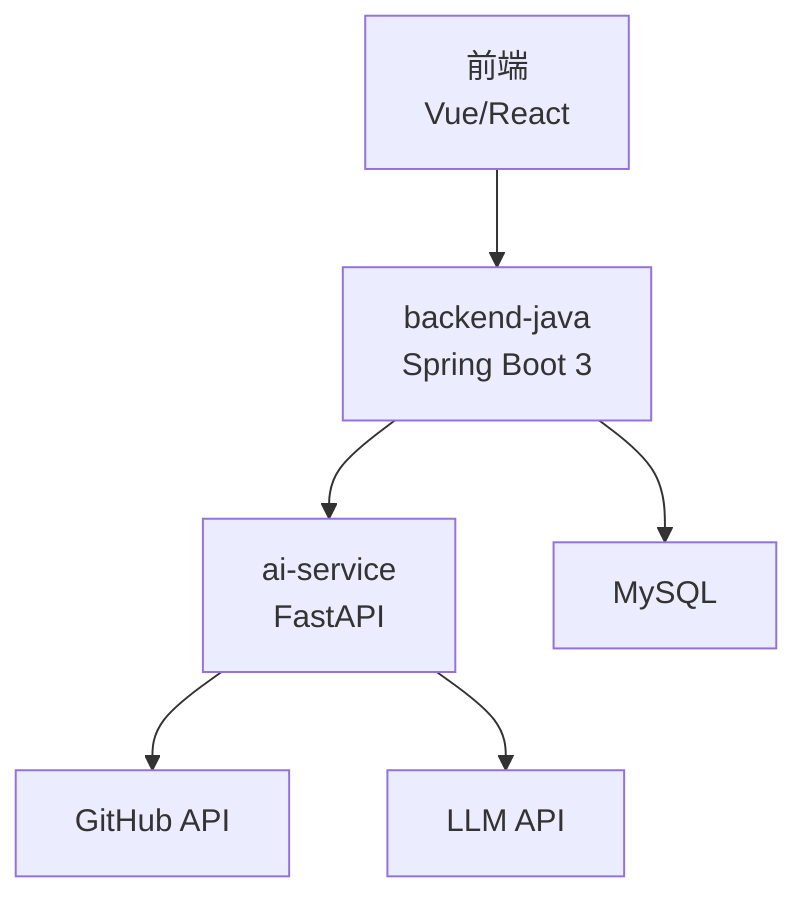
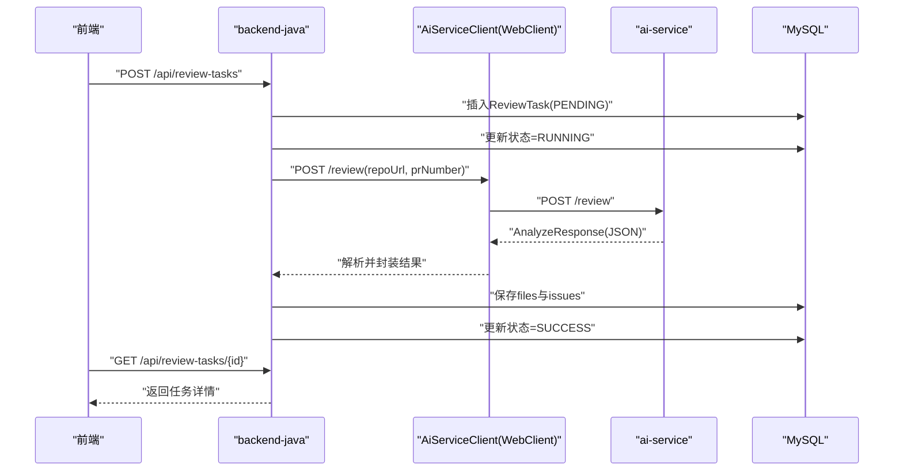
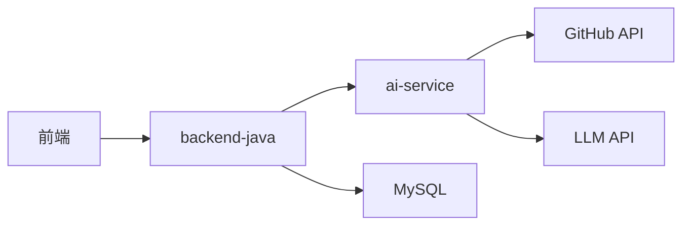

# AI服务客户端集成

<cite>
**本文引用的文件**
- [README.md](file://README.md)
- [ARCHITECTURE.md](file://docs/ARCHITECTURE.md)
- [API.md](file://docs/API.md)
- [docker-compose.yml](file://docker-compose.yml)
- [backend-java/README.md](file://backend-java/README.md)
- [ai-service/README.md](file://ai-service/README.md)
</cite>

## 目录
1. [简介](#简介)
2. [项目结构](#项目结构)
3. [核心组件](#核心组件)
4. [架构总览](#架构总览)
5. [详细组件分析](#详细组件分析)
6. [依赖关系分析](#依赖关系分析)
7. [性能考虑](#性能考虑)
8. [故障排查指南](#故障排查指南)
9. [结论](#结论)
10. [附录](#附录)

## 简介
本文件面向“AI服务客户端集成”的技术目标，围绕Spring WebClient在backend-java中的配置与使用进行系统化说明，涵盖HTTP客户端初始化、超时设置、连接池配置、与ai-service的通信协议（POST /review）、请求参数与响应解析、异步处理与错误重试策略、超时处理、负载均衡与熔断降级、日志与监控指标等主题。由于Round 01仍处于工程骨架阶段，本文基于已有的架构设计文档与API规范进行落地化指导，便于后续Round 02及以后的实现参考。

## 项目结构
- backend-java：Spring Boot 3 + Java 17后端服务，负责任务编排、持久化与调用ai-service。
- ai-service：Python + FastAPI服务，负责拉取GitHub PR diff、Semgrep分析与LLM Review。
- 前端：仅通过backend-java暴露的REST API交互，不直接调用ai-service。
- 数据库：MySQL 8，存储任务、文件变更与问题。

图表来源
- [ARCHITECTURE.md:19-52](file://docs/ARCHITECTURE.md#L19-L52)
- [docker-compose.yml:1-14](file://docker-compose.yml#L1-L14)

章节来源
- [README.md:58-82](file://README.md#L58-L82)
- [ARCHITECTURE.md:19-52](file://docs/ARCHITECTURE.md#L19-L52)
- [docker-compose.yml:1-14](file://docker-compose.yml#L1-L14)

## 核心组件
- HTTP客户端：Spring WebClient（用于调用ai-service的内部HTTP接口）
- 调用端：backend-java的client层（AiServiceClient）
- 服务端：ai-service的FastAPI接口（POST /review）
- 数据层：MyBatis-Plus + MySQL（ReviewTask、ReviewFileChange、ReviewIssue）

章节来源
- [ARCHITECTURE.md:183-232](file://docs/ARCHITECTURE.md#L183-L232)
- [backend-java/README.md:19-46](file://backend-java/README.md#L19-L46)
- [ai-service/README.md:19-47](file://ai-service/README.md#L19-L47)

## 架构总览
backend-java与ai-service之间的调用链路如下：
1) 前端调用backend-java的REST API创建ReviewTask
2) backend-java创建任务并更新状态为RUNNING
3) backend-java通过WebClient调用ai-service的POST /review
4) ai-service执行GitHub数据获取、Semgrep与LLM分析，返回AnalyzeResponse
5) backend-java保存文件变更与问题，更新任务状态为SUCCESS

图表来源
- [ARCHITECTURE.md:137-181](file://docs/ARCHITECTURE.md#L137-L181)
- [API.md:54-241](file://docs/API.md#L54-L241)
- [API.md:243-333](file://docs/API.md#L243-L333)

## 详细组件分析

### Spring WebClient配置与使用
- 初始化位置：client层（AiServiceClient），通过WebClient.Builder构建，避免在多处重复配置
- 基础URL：从环境变量读取（AI_SERVICE_BASE_URL），支持本地与容器网络
- 超时设置：
  - connectTimeout：连接建立超时（建议10-30秒）
  - responseTimeout：响应等待超时（建议60-120秒，视ai-service处理耗时而定）
- 连接池配置：
  - maxIdleTime与maxConnections：根据并发与资源限制设定
  - keepAliveDuration：维持长连接的活跃时长
- 编解码与字符集：默认UTF-8，Content-Type为application/json
- 日志：开启DEBUG级别可观察HTTP请求/响应细节

章节来源
- [ARCHITECTURE.md:345-354](file://docs/ARCHITECTURE.md#L345-L354)
- [backend-java/README.md:36](file://backend-java/README.md#L36)

### 与ai-service的通信协议
- 端点：POST /review
- 请求体：包含repoUrl与prNumber
- 成功响应：AnalyzeResponse（summary、riskLevel、files、issues）
- 错误响应：ai-service返回errorCode、message、recoverable字段
- 错误码映射：AI_SERVICE_ERROR（502）对应ai-service内部错误

章节来源
- [API.md:243-333](file://docs/API.md#L243-L333)
- [ARCHITECTURE.md:312-342](file://docs/ARCHITECTURE.md#L312-L342)

### 异步处理机制
- 采用WebClient的响应式/非阻塞特性，结合Spring @Async或Reactive编程模型，避免阻塞主线程
- 对ai-service的调用应异步化，以便快速返回任务创建响应给前端
- 使用CompletableFuture或Mono/Flux组合结果，减少线程占用

章节来源
- [ARCHITECTURE.md:137-181](file://docs/ARCHITECTURE.md#L137-L181)

### 错误重试策略与超时处理
- 重试策略：
  - 对临时性错误（网络抖动、ai-service短暂不可用）进行指数退避重试（如1s、2s、4s）
  - 最大重试次数建议3次，避免雪崩
  - 对ai-service返回的recoverable=false的错误（如GITHUB_FETCH_FAILED）不重试
- 超时处理：
  - 连接超时connectTimeout与响应超时responseTimeout分别设置
  - 超时后统一转为AI_SERVICE_ERROR（502），并记录原因
- 失败降级：
  - LLM失败时使用mock fallback
  - Semgrep失败降级为warning，不影响任务最终状态

章节来源
- [ARCHITECTURE.md:170-180](file://docs/ARCHITECTURE.md#L170-L180)
- [ARCHITECTURE.md:324-342](file://docs/ARCHITECTURE.md#L324-L342)

### 负载均衡、熔断器与降级策略
- 负载均衡：在容器环境中通过服务名（ai-service）访问，由编排平台（如Docker Compose或Kubernetes）实现多实例轮询
- 熔断器：推荐使用Resilience4j或Spring Cloud Circuit Breaker，针对ai-service的错误率与延迟触发熔断
- 降级策略：
  - 熔断后返回mock Review JSON或空issues
  - 记录降级事件，便于后续恢复与审计

章节来源
- [ARCHITECTURE.md:107-15](file://docs/ARCHITECTURE.md#L10-L15)

### 日志记录与监控指标
- 日志：
  - 记录WebClient请求/响应摘要（URL、方法、状态码、耗时）
  - 记录重试与熔断事件
- 指标：
  - HTTP调用量、成功率、P95/P99延迟
  - ai-service错误码分布、重试次数
  - 任务状态流转指标（PENDING/RUNNING/SUCCESS/FAILED）
- 建议使用Micrometer + Prometheus + Grafana采集与可视化

章节来源
- [ARCHITECTURE.md:107-15](file://docs/ARCHITECTURE.md#L10-L15)

## 依赖关系分析
- backend-java依赖ai-service提供的内部REST接口
- ai-service依赖GitHub API与LLM API
- 数据持久化依赖MySQL
- 前端仅依赖backend-java的公共API

图表来源
- [ARCHITECTURE.md:19-52](file://docs/ARCHITECTURE.md#L19-L52)

章节来源
- [ARCHITECTURE.md:19-52](file://docs/ARCHITECTURE.md#L19-L52)

## 性能考虑
- 连接池大小与并发：根据峰值QPS与ai-service处理能力调整maxConnections
- 超时参数：connectTimeout与responseTimeout需平衡用户体验与系统稳定性
- 序列化开销：尽量复用对象与字符串，避免频繁GC
- 缓存：对稳定不变的数据（如枚举值）进行缓存
- 监控：持续观测延迟与错误率，动态优化超时与重试策略

## 故障排查指南
- ai-service不可达：
  - 检查AI_SERVICE_BASE_URL配置与容器网络连通性
  - 查看WebClient日志与超时错误
- 响应超时：
  - 提升responseTimeout或优化ai-service处理逻辑
  - 检查ai-service内部依赖（GitHub/LLM）是否超时
- 错误码处理：
  - GITHUB_FETCH_FAILED：检查repoUrl与权限
  - LLM_FAILED：启用mock fallback并记录原始输出摘要
- 数据库写入失败：
  - 检查事务与约束冲突，必要时重试或补偿

章节来源
- [ARCHITECTURE.md:312-342](file://docs/ARCHITECTURE.md#L312-L342)

## 结论
本文基于现有架构与API设计，给出了Spring WebClient在backend-java中的配置要点、与ai-service的通信协议、异步与重试策略、超时与降级处理、以及可观测性的实施建议。这些实践将确保系统在MVP阶段具备稳定的内部通信能力，并为后续引入负载均衡、熔断与监控提供清晰的实现路径。

## 附录
- 环境变量与部署端口
  - backend-java：8080
  - ai-service：8000
  - MySQL：3306
  - 前端：3000

章节来源
- [ARCHITECTURE.md:373-381](file://docs/ARCHITECTURE.md#L373-L381)
- [docker-compose.yml:7-13](file://docker-compose.yml#L7-L13)