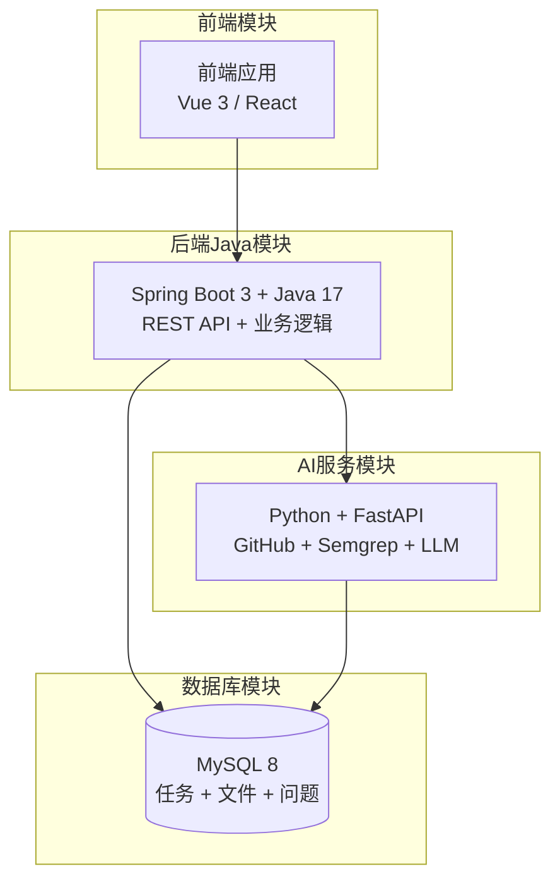
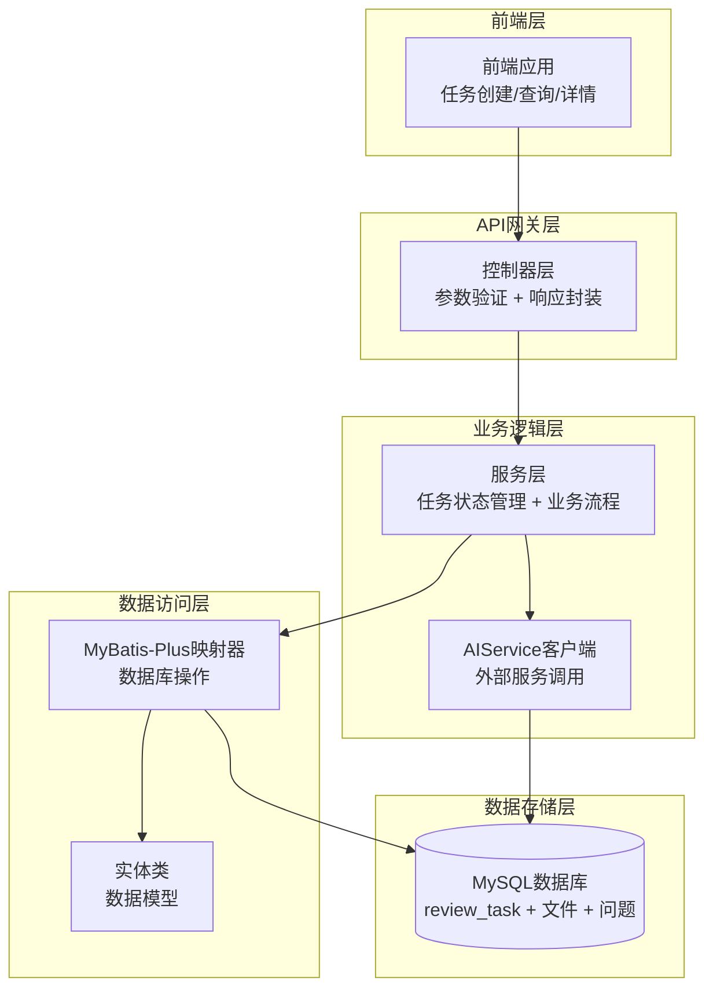
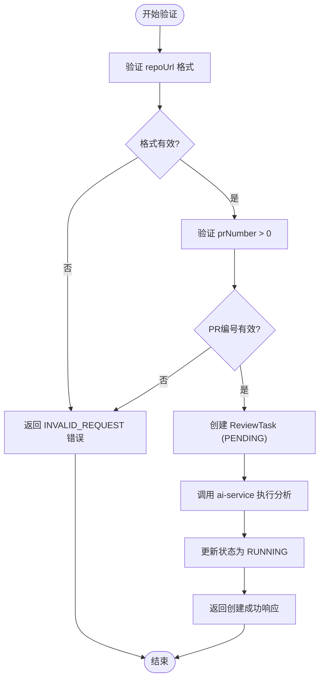
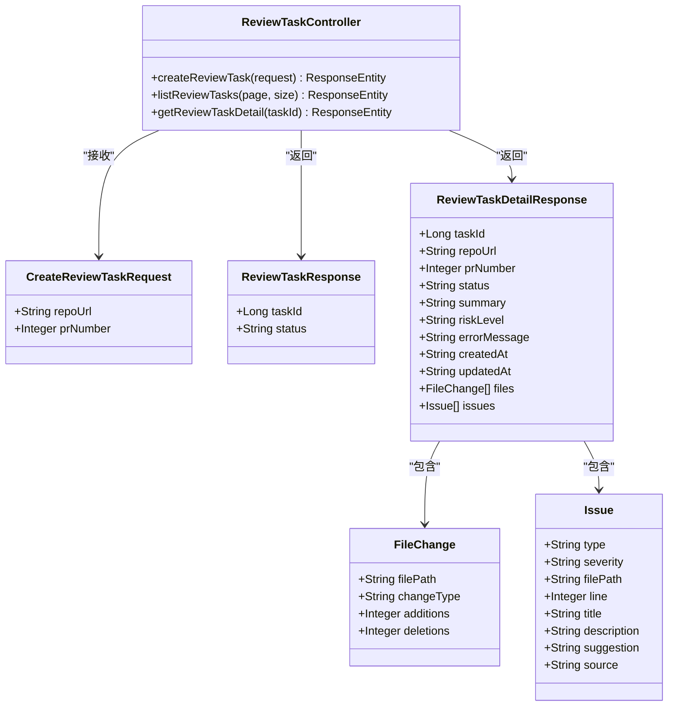
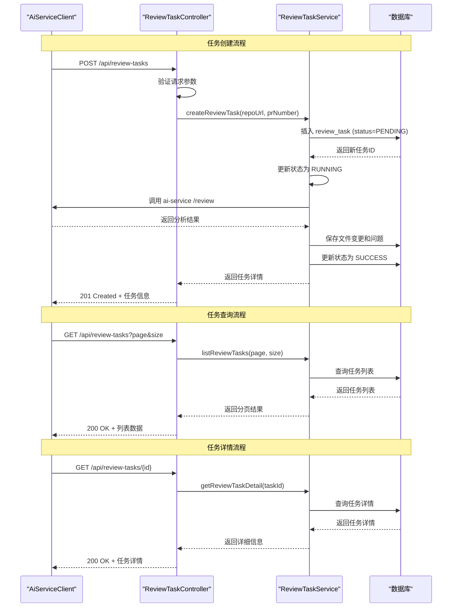
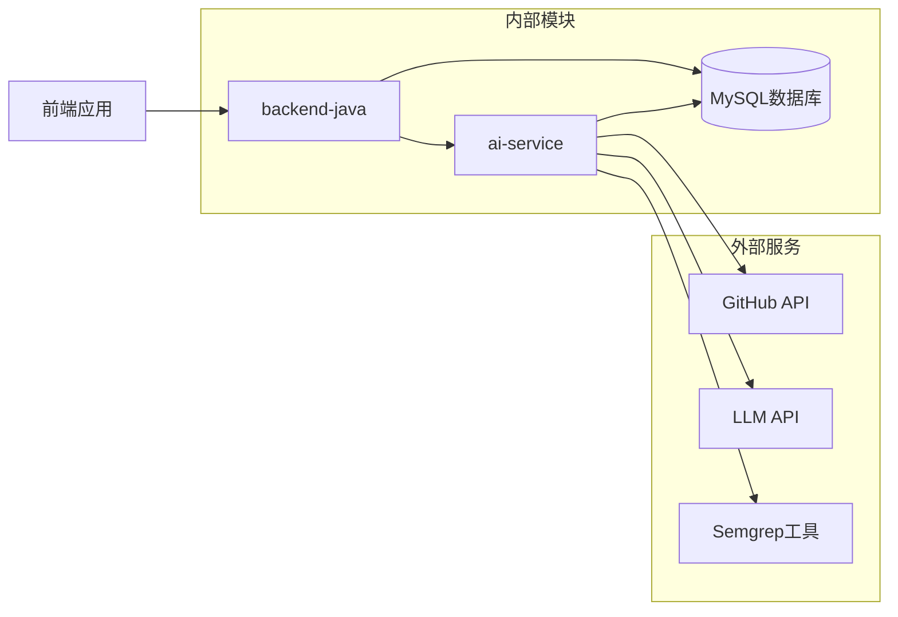
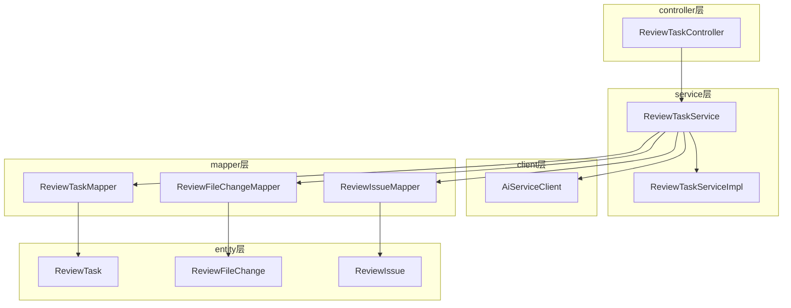
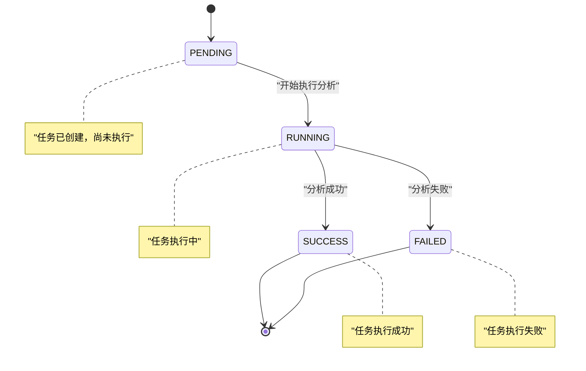

# REST API接口集成

<cite>
**本文档引用的文件**
- [README.md](file://README.md)
- [docs/API.md](file://docs/API.md)
- [docs/ARCHITECTURE.md](file://docs/ARCHITECTURE.md)
- [docs/DATABASE.md](file://docs/DATABASE.md)
- [docker-compose.yml](file://docker-compose.yml)
- [backend-java/README.md](file://backend-java/README.md)
</cite>

## 目录
1. [简介](#简介)
2. [项目结构](#项目结构)
3. [核心组件](#核心组件)
4. [架构概览](#架构概览)
5. [详细组件分析](#详细组件分析)
6. [依赖关系分析](#依赖关系分析)
7. [性能考虑](#性能考虑)
8. [故障排除指南](#故障排除指南)
9. [结论](#结论)

## 简介

CodeReviewX是一个智能的GitHub Pull Request代码审查和修复建议代理系统。本项目旨在为用户提供完整的代码审查解决方案，包括任务创建、状态管理和结果展示等功能。

根据项目规划，我们将实现三个核心REST API端点：
- POST `/api/review-tasks` - 任务创建
- GET `/api/review-tasks` - 任务查询  
- GET `/api/review-tasks/{id}` - 任务详情

这些API将采用统一的响应格式和错误处理机制，确保前后端交互的一致性和可靠性。

## 项目结构

项目采用多模块架构设计，主要分为四个核心模块：



**图表来源**
- [docs/ARCHITECTURE.md:19-52](file://docs/ARCHITECTURE.md#L19-L52)
- [docs/ARCHITECTURE.md:73-106](file://docs/ARCHITECTURE.md#L73-L106)

**章节来源**
- [README.md:58-82](file://README.md#L58-L82)
- [docs/ARCHITECTURE.md:19-52](file://docs/ARCHITECTURE.md#L19-L52)

## 核心组件

### API设计规范

所有API遵循统一的设计规范，确保一致的用户体验和开发体验：

**基础配置**
- **Base URL**: `http://localhost:8080` (本地开发)
- **Content-Type**: `application/json`
- **字符集**: UTF-8

**统一响应格式**
```json
{
  "data": { }
}
```

**统一错误响应格式**
```json
{
  "code": "ERROR_CODE",
  "message": "Human readable error message",
  "details": null
}
```

**错误码定义**
| 错误码 | HTTP状态 | 场景 |
|---|---|---|
| `INVALID_REQUEST` | 400 | 请求参数错误或校验失败 |
| `TASK_NOT_FOUND` | 404 | 任务不存在 |
| `AI_SERVICE_ERROR` | 502 | ai-service 调用失败 |
| `GITHUB_FETCH_FAILED` | 502 | GitHub 数据获取失败 |
| `DATABASE_ERROR` | 500 | 数据库操作失败 |
| `INTERNAL_ERROR` | 500 | 未知系统错误 |

**章节来源**
- [docs/API.md:9-51](file://docs/API.md#L9-L51)
- [docs/ARCHITECTURE.md:314-332](file://docs/ARCHITECTURE.md#L314-L332)

## 架构概览

系统采用分层架构设计，明确各模块职责边界：



**图表来源**
- [docs/ARCHITECTURE.md:183-230](file://docs/ARCHITECTURE.md#L183-L230)
- [docs/DATABASE.md:22-134](file://docs/DATABASE.md#L22-L134)

**章节来源**
- [docs/ARCHITECTURE.md:7-16](file://docs/ARCHITECTURE.md#L7-L16)
- [docs/ARCHITECTURE.md:183-230](file://docs/ARCHITECTURE.md#L183-L230)

## 详细组件分析

### 任务创建接口 (POST /api/review-tasks)

#### 接口规范

**请求方法**: `POST`
**请求路径**: `/api/review-tasks`
**请求头**: `Content-Type: application/json`

**请求体参数**
| 字段 | 类型 | 必填 | 说明 |
|---|---|---|---|
| `repoUrl` | string | 是 | GitHub 仓库地址，格式：`https://github.com/{owner}/{repo}` |
| `prNumber` | integer | 是 | Pull Request 编号，必须为正整数 |

**请求示例**
```json
{
  "repoUrl": "https://github.com/example/project",
  "prNumber": 123
}
```

**响应格式 (201 Created)**
```json
{
  "taskId": 1,
  "status": "PENDING"
}
```

**响应字段说明**
| 字段 | 类型 | 说明 |
|---|---|---|
| `taskId` | long | 创建的任务ID |
| `status` | string | 任务初始状态，固定为 `PENDING` |

**错误响应示例**
```json
{
  "code": "INVALID_REQUEST",
  "message": "repoUrl must be a valid GitHub URL",
  "details": null
}
```

#### 参数验证逻辑



**图表来源**
- [docs/ARCHITECTURE.md:139-168](file://docs/ARCHITECTURE.md#L139-L168)

**章节来源**
- [docs/API.md:56-96](file://docs/API.md#L56-L96)
- [docs/ARCHITECTURE.md:139-168](file://docs/ARCHITECTURE.md#L139-L168)

### 任务查询接口 (GET /api/review-tasks)

#### 接口规范

**请求方法**: `GET`
**请求路径**: `/api/review-tasks`

**查询参数**
| 参数 | 类型 | 说明 |
|---|---|---|
| `page` | integer | 页码，从 0 开始，默认 0 |
| `size` | integer | 每页数量，默认 20 |

**响应格式 (200 OK)**
```json
{
  "items": [
    {
      "taskId": 1,
      "repoUrl": "https://github.com/owner/repo",
      "prNumber": 12,
      "status": "SUCCESS",
      "riskLevel": "MEDIUM",
      "createdAt": "2026-06-19T10:00:00"
    }
  ],
  "total": 1
}
```

**items 字段说明**
| 字段 | 类型 | 说明 |
|---|---|---|
| `taskId` | long | 任务 ID |
| `repoUrl` | string | GitHub 仓库地址 |
| `prNumber` | integer | PR 编号 |
| `status` | string | `PENDING` / `RUNNING` / `SUCCESS` / `FAILED` |
| `riskLevel` | string | `LOW` / `MEDIUM` / `HIGH` / null（未完成时） |
| `createdAt` | string | ISO 8601 格式时间 |

**章节来源**
- [docs/API.md:99-143](file://docs/API.md#L99-L143)

### 任务详情接口 (GET /api/review-tasks/{id})

#### 接口规范

**请求方法**: `GET`
**请求路径**: `/api/review-tasks/{id}`

**路径参数**
| 参数 | 类型 | 说明 |
|---|---|---|
| `id` | long | 任务 ID |

**响应格式 (200 OK)**
```json
{
  "taskId": 1,
  "repoUrl": "https://github.com/owner/repo",
  "prNumber": 12,
  "status": "SUCCESS",
  "summary": "This PR has several medium risk issues.",
  "riskLevel": "MEDIUM",
  "errorMessage": null,
  "createdAt": "2026-06-19T10:00:00",
  "updatedAt": "2026-06-19T10:01:30",
  "files": [
    {
      "filePath": "src/main/java/example/UserService.java",
      "changeType": "modified",
      "additions": 20,
      "deletions": 5
    }
  ],
  "issues": [
    {
      "type": "BUG",
      "severity": "MEDIUM",
      "filePath": "src/main/java/example/UserService.java",
      "line": 42,
      "title": "Potential null pointer exception",
      "description": "The variable may be null before use.",
      "suggestion": "Add a null check before accessing the field.",
      "source": "LLM"
    }
  ]
}
```

**响应字段说明**
| 字段 | 类型 | 说明 |
|---|---|---|
| `taskId` | long | 任务 ID |
| `repoUrl` | string | GitHub 仓库地址 |
| `prNumber` | integer | PR 编号 |
| `status` | string | 任务状态 |
| `summary` | string | Review 总结（任务成功后填充） |
| `riskLevel` | string | 风险等级（任务成功后填充） |
| `errorMessage` | string | 失败原因（FAILED 状态时填充） |
| `files` | array | 变更文件列表 |
| `issues` | array | Review 问题列表 |

**files 项字段**
| 字段 | 类型 | 说明 |
|---|---|---|
| `filePath` | string | 文件路径 |
| `changeType` | string | `added` / `modified` / `deleted` |
| `additions` | integer | 新增行数 |
| `deletions` | integer | 删除行数 |

**issues 项字段**
| 字段 | 类型 | 说明 |
|---|---|---|
| `type` | string | `BUG` / `SECURITY` / `PERFORMANCE` / `TEST` / `STYLE` |
| `severity` | string | `LOW` / `MEDIUM` / `HIGH` |
| `filePath` | string | 问题所在文件路径 |
| `line` | integer | 问题行号 |
| `title` | string | 问题标题 |
| `description` | string | 问题描述 |
| `suggestion` | string | 修复建议 |
| `source` | string | `LLM` / `SEMGREP` |

**错误响应 (任务不存在)**
```json
{
  "code": "TASK_NOT_FOUND",
  "message": "Review task with id 999 not found",
  "details": null
}
```

**章节来源**
- [docs/API.md:145-240](file://docs/API.md#L145-L240)

### 控制器层实现模式

#### 参数绑定和DTO使用



**图表来源**
- [docs/ARCHITECTURE.md:188-210](file://docs/ARCHITECTURE.md#L188-L210)

#### API调用序列图



**图表来源**
- [docs/ARCHITECTURE.md:139-180](file://docs/ARCHITECTURE.md#L139-L180)

**章节来源**
- [docs/ARCHITECTURE.md:188-230](file://docs/ARCHITECTURE.md#L188-L230)

### 数据传输对象(DTO)设计

#### 请求DTO

**CreateReviewTaskRequest**
- 用于接收前端传入的任务创建请求
- 包含 `repoUrl` 和 `prNumber` 字段
- 支持参数验证注解

#### 响应DTO

**ReviewTaskResponse**
- 用于任务创建后的响应
- 包含 `taskId` 和 `status` 字段

**ReviewTaskDetailResponse**
- 用于任务详情查询的响应
- 包含完整的任务信息、文件变更和问题列表

**章节来源**
- [docs/ARCHITECTURE.md:204-210](file://docs/ARCHITECTURE.md#L204-L210)

## 依赖关系分析

### 外部依赖



**图表来源**
- [docs/ARCHITECTURE.md:37-46](file://docs/ARCHITECTURE.md#L37-L46)
- [docs/ARCHITECTURE.md:233-256](file://docs/ARCHITECTURE.md#L233-L256)

### 内部模块依赖



**图表来源**
- [docs/ARCHITECTURE.md:188-220](file://docs/ARCHITECTURE.md#L188-L220)

**章节来源**
- [docs/ARCHITECTURE.md:183-230](file://docs/ARCHITECTURE.md#L183-L230)

## 性能考虑

### 状态管理策略

系统采用有限状态机管理任务状态，确保状态转换的正确性和一致性：



**图表来源**
- [docs/ARCHITECTURE.md:110-134](file://docs/ARCHITECTURE.md#L110-L134)

### 错误处理策略

系统采用分级错误处理策略，区分可恢复和不可恢复错误：

| 错误类型 | 处理策略 | 影响范围 |
|---|---|---|
| 参数验证错误 | 立即返回 400 | 仅影响当前请求 |
| GitHub API 失败 | 标记为 FAILED，保存错误信息 | 影响单个任务 |
| Semgrep 失败 | 降级为 warning，不影响任务状态 | 仅影响分析质量 |
| LLM 失败 | 使用 mock fallback | 保持任务继续执行 |
| 数据库错误 | 回滚事务，标记为 FAILED | 影响数据一致性 |

**章节来源**
- [docs/ARCHITECTURE.md:170-180](file://docs/ARCHITECTURE.md#L170-L180)

## 故障排除指南

### 常见问题诊断

**任务创建失败**
1. 检查 `repoUrl` 是否为有效的 GitHub URL 格式
2. 验证 `prNumber` 是否为正整数
3. 确认数据库连接正常
4. 检查 ai-service 服务可用性

**任务查询无结果**
1. 验证分页参数是否合理
2. 检查数据库中是否存在对应任务
3. 确认查询条件过滤逻辑

**任务详情为空**
1. 验证任务ID是否存在
2. 检查任务状态是否已完成
3. 确认数据库中是否有相关文件和问题记录

### 错误码对照表

| 错误码 | HTTP状态 | 原因 | 解决方案 |
|---|---|---|---|
| `INVALID_REQUEST` | 400 | 参数格式错误 | 修正请求参数格式 |
| `TASK_NOT_FOUND` | 404 | 任务ID不存在 | 检查任务ID有效性 |
| `AI_SERVICE_ERROR` | 502 | ai-service 调用失败 | 检查服务连通性 |
| `GITHUB_FETCH_FAILED` | 502 | GitHub API 调用失败 | 检查认证令牌 |
| `DATABASE_ERROR` | 500 | 数据库操作失败 | 检查数据库连接 |
| `INTERNAL_ERROR` | 500 | 系统内部错误 | 查看服务日志 |

**章节来源**
- [docs/API.md:41-51](file://docs/API.md#L41-L51)
- [docs/ARCHITECTURE.md:324-332](file://docs/ARCHITECTURE.md#L324-L332)

## 结论

CodeReviewX的REST API接口集成为整个系统的数据交互提供了标准化的接口规范。通过统一的响应格式、完善的参数验证和健壮的错误处理机制，确保了前后端交互的一致性和可靠性。

该API设计充分考虑了系统的可扩展性和维护性，为后续的功能扩展和性能优化奠定了坚实的基础。通过明确的模块职责划分和清晰的调用链路，系统能够稳定地处理各种复杂的代码审查场景。

随着项目的推进，我们将持续完善API文档和实现细节，确保为开发者提供最佳的开发体验和最可靠的系统稳定性。