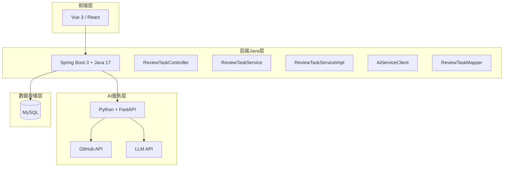
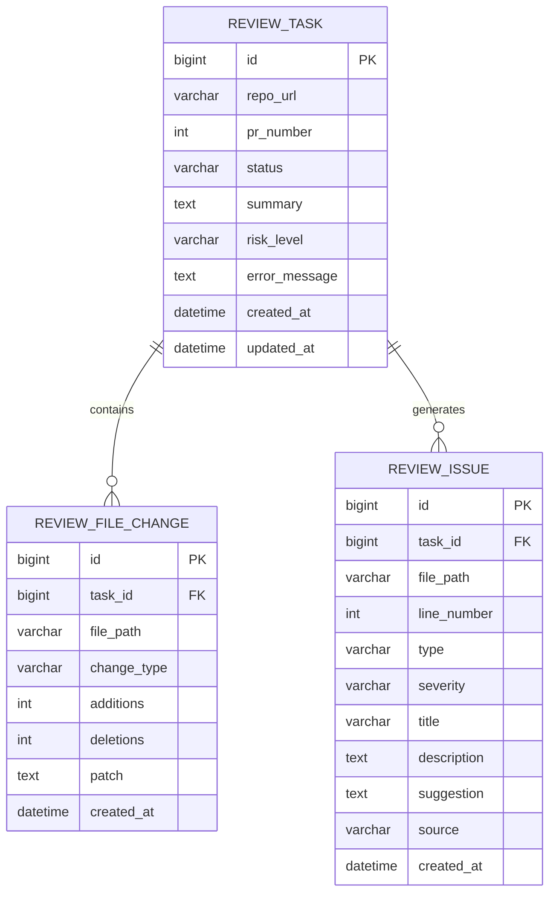
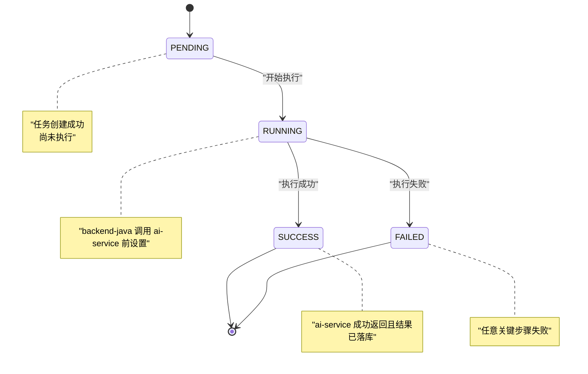
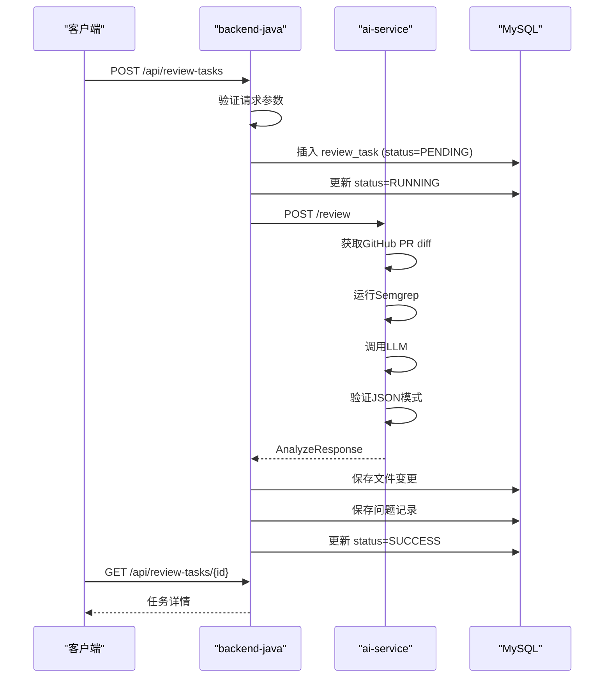
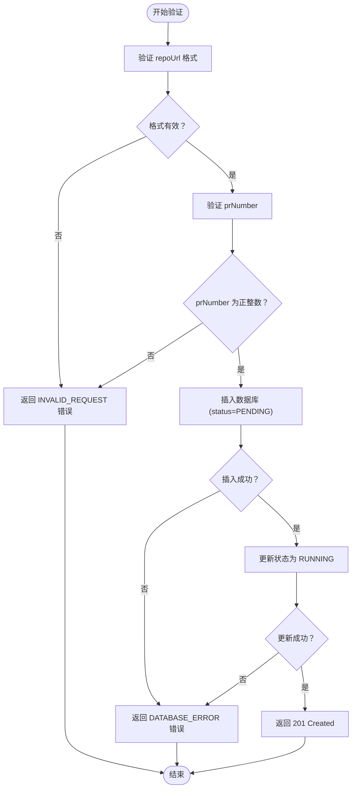
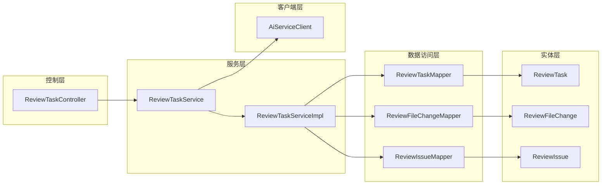

# ReviewTask生命周期管理

<cite>
**本文档引用的文件**
- [ARCHITECTURE.md](file://docs/ARCHITECTURE.md)
- [DATABASE.md](file://docs/DATABASE.md)
- [API.md](file://docs/API.md)
- [README.md](file://backend-java/README.md)
- [README.md](file://ai-service/README.md)
- [04-cursor-doc-alignment-handoff.md](file://handoff/round-01/04-cursor-doc-alignment-handoff.md)
</cite>

## 目录
1. [简介](#简介)
2. [项目结构](#项目结构)
3. [核心组件](#核心组件)
4. [架构概览](#架构概览)
5. [详细组件分析](#详细组件分析)
6. [依赖关系分析](#依赖关系分析)
7. [性能考虑](#性能考虑)
8. [故障排除指南](#故障排除指南)
9. [结论](#结论)

## 简介

ReviewTask生命周期管理系统是CodeReviewX项目的核心组件，负责管理代码审查任务从创建到完成的整个生命周期。该系统采用严格的有限状态机设计，确保任务状态的正确性和一致性。

本系统遵循MVP（最小可行产品）原则，在第一阶段实现了基础的状态管理和数据持久化功能。系统支持四种核心状态：PENDING（待处理）、RUNNING（执行中）、SUCCESS（成功）和FAILED（失败），并通过严格的单向状态转换规则确保系统的可靠性。

## 项目结构

CodeReviewX项目采用清晰的分层架构设计，将不同职责的功能模块分离：

**图表来源**
- [ARCHITECTURE.md:19-52](file://docs/ARCHITECTURE.md#L19-L52)
- [ARCHITECTURE.md:183-220](file://docs/ARCHITECTURE.md#L183-L220)

**章节来源**
- [ARCHITECTURE.md:19-52](file://docs/ARCHITECTURE.md#L19-L52)
- [ARCHITECTURE.md:183-220](file://docs/ARCHITECTURE.md#L183-L220)

## 核心组件

### 状态枚举定义

系统使用强类型的枚举来定义任务状态，确保状态值的一致性和安全性：

| 状态值 | 描述 | 默认值 |
|--------|------|--------|
| `PENDING` | 任务已创建，尚未执行 | 是 |
| `RUNNING` | 任务执行中 | 否 |
| `SUCCESS` | 任务执行成功 | 否 |
| `FAILED` | 任务执行失败 | 否 |

### 数据模型设计

ReviewTask实体类采用MyBatis-Plus注解进行数据库映射：

**图表来源**
- [DATABASE.md:26-41](file://docs/DATABASE.md#L26-L41)
- [DATABASE.md:98-117](file://docs/DATABASE.md#L98-L117)

**章节来源**
- [DATABASE.md:26-41](file://docs/DATABASE.md#L26-L41)
- [DATABASE.md:98-117](file://docs/DATABASE.md#L98-L117)

## 架构概览

### 状态机设计

ReviewTask状态机采用严格的单向转换规则，确保系统的确定性行为：

**图表来源**
- [ARCHITECTURE.md:110-134](file://docs/ARCHITECTURE.md#L110-L134)

### 核心调用链路

系统遵循清晰的调用链路，确保各组件职责分离：

**图表来源**
- [ARCHITECTURE.md:139-168](file://docs/ARCHITECTURE.md#L139-L168)

**章节来源**
- [ARCHITECTURE.md:139-168](file://docs/ARCHITECTURE.md#L139-L168)

## 详细组件分析

### 状态转换规则

#### 1. PENDING → RUNNING 转换

**触发条件：**
- 任务创建成功
- 请求参数验证通过
- 数据库插入成功

**前置检查：**
- 验证 repoUrl 格式（必须为有效的GitHub URL）
- 验证 prNumber 为正整数
- 检查数据库连接状态

**后置处理：**
- 更新任务状态为 RUNNING
- 记录状态变更时间戳
- 准备调用 ai-service 的参数

#### 2. RUNNING → SUCCESS 转换

**触发条件：**
- ai-service 返回成功的 AnalyzeResponse
- 数据库批量保存成功
- JSON模式验证通过

**前置检查：**
- 验证 ai-service 响应格式
- 检查文件变更数据完整性
- 验证问题记录的有效性

**后置处理：**
- 更新任务状态为 SUCCESS
- 填充 summary 和 riskLevel
- 清理临时数据

#### 3. RUNNING → FAILED 转换

**触发条件：**
- 任意关键步骤失败
- 数据库保存失败
- ai-service 超时

**失败场景及处理策略：**

| 失败场景 | 处理策略 | 影响范围 |
|----------|----------|----------|
| GitHub API 失败 | 状态设为 FAILED，保存 error_message | 任务终止 |
| Semgrep 失败 | 降级为 warning，不导致任务失败 | 任务继续 |
| LLM 失败 | 使用 mock fallback 或返回空 issues | 任务继续 |
| LLM JSON 校验失败 | 记录原始输出摘要，不返回未校验结构 | 任务继续 |
| 数据库保存失败 | 状态设为 FAILED | 任务终止 |
| ai-service 超时 | 状态设为 FAILED，保存超时原因 | 任务终止 |

### 数据验证和初始化

#### 请求参数验证

**CreateReviewTaskRequest 验证规则：**

**图表来源**
- [ARCHITECTURE.md:145-148](file://docs/ARCHITECTURE.md#L145-L148)

#### 默认值设置

**ReviewTask 默认值：**

| 字段 | 默认值 | 说明 |
|------|--------|------|
| `status` | `"PENDING"` | 任务初始状态 |
| `created_at` | `CURRENT_TIMESTAMP` | 自动设置创建时间 |
| `updated_at` | `CURRENT_TIMESTAMP` | 自动维护更新时间 |
| `summary` | `null` | 成功后填充 |
| `risk_level` | `null` | 成功后填充 |
| `error_message` | `null` | 失败时填充 |

### 异常处理和回滚机制

#### 错误码定义

系统定义了标准化的错误码，便于前端和监控系统处理：

| 错误码 | HTTP状态 | 场景 |
|--------|----------|------|
| `INVALID_REQUEST` | 400 | 请求参数错误或校验失败 |
| `TASK_NOT_FOUND` | 404 | 任务不存在 |
| `AI_SERVICE_ERROR` | 502 | ai-service 调用失败 |
| `GITHUB_FETCH_FAILED` | 502 | GitHub 数据获取失败 |
| `DATABASE_ERROR` | 500 | 数据库操作失败 |
| `INTERNAL_ERROR` | 500 | 未知系统错误 |

#### 回滚策略

**事务管理：**
- 使用 Spring @Transactional 确保数据库操作的原子性
- 在状态更新和数据保存之间建立事务边界
- 发生异常时自动回滚所有未提交的更改

**补偿机制：**
- 失败状态下自动清理临时文件
- 记录详细的错误日志便于排查
- 保持任务状态的最终一致性

**章节来源**
- [ARCHITECTURE.md:128-134](file://docs/ARCHITECTURE.md#L128-L134)
- [ARCHITECTURE.md:170-180](file://docs/ARCHITECTURE.md#L170-L180)
- [ARCHITECTURE.md:312-341](file://docs/ARCHITECTURE.md#L312-L341)

## 依赖关系分析

### 组件耦合度

系统采用松耦合设计，各组件间通过明确定义的接口交互：

**图表来源**
- [ARCHITECTURE.md:188-219](file://docs/ARCHITECTURE.md#L188-L219)

### 外部依赖

**技术栈依赖：**

| 组件 | 技术 | 版本 | 用途 |
|------|------|------|------|
| 后端框架 | Spring Boot | 3.x | Web框架 |
| 运行时 | Java | 17 | 运行时环境 |
| ORM框架 | MyBatis-Plus | 3.5.x | 数据库映射 |
| HTTP客户端 | Spring WebClient | — | 调用ai-service |
| 数据库驱动 | MySQL Connector | 8.x | 数据库连接 |
| 测试框架 | JUnit 5 | — | 单元测试 |

**章节来源**
- [README.md:28-39](file://backend-java/README.md#L28-L39)
- [README.md:29-40](file://ai-service/README.md#L29-L40)

## 性能考虑

### 状态查询优化

**索引策略：**
- 在 `status` 字段上建立索引，支持按状态查询
- 在 `created_at` 字段上建立索引，支持时间范围查询
- 在 `task_id` 字段上建立索引，支持关联查询

**查询优化：**
- 使用分页查询避免大量数据传输
- 实现缓存机制减少重复查询
- 优化批量操作提升数据导入效率

### 并发控制

**乐观锁机制：**
- 使用版本号字段防止并发更新冲突
- 实现重试机制处理短暂的并发冲突
- 提供超时控制避免长时间阻塞

**线程安全：**
- 状态转换操作使用原子操作
- 避免共享可变状态
- 使用线程池管理异步任务

## 故障排除指南

### 常见问题诊断

**任务状态异常：**
- 检查数据库连接状态
- 验证 ai-service 是否正常运行
- 查看应用日志中的错误信息

**性能问题：**
- 监控数据库查询性能
- 检查网络延迟
- 分析内存使用情况

**集成问题：**
- 验证 API 端点可达性
- 检查认证配置
- 确认防火墙设置

### 调试工具

**日志分析：**
- 启用详细日志级别
- 监控关键操作的执行时间
- 记录异常堆栈信息

**监控指标：**
- 任务完成率统计
- 平均执行时间
- 失败率分析

**章节来源**
- [ARCHITECTURE.md:312-341](file://docs/ARCHITECTURE.md#L312-L341)

## 结论

ReviewTask生命周期管理系统通过严谨的状态机设计和清晰的分层架构，为CodeReviewX项目提供了可靠的代码审查能力。系统遵循MVP原则，在保证功能完整性的同时，保持了良好的可扩展性和可维护性。

关键设计亮点包括：
- 严格的单向状态转换规则确保系统确定性
- 清晰的职责分离便于团队协作开发
- 完善的异常处理和回滚机制提升系统稳定性
- 标准化的错误码和API设计便于集成和监控

随着项目的演进，可以在现有基础上添加更多高级特性，如异步处理、分布式协调、更丰富的监控指标等，但核心的状态机设计原则将保持不变。