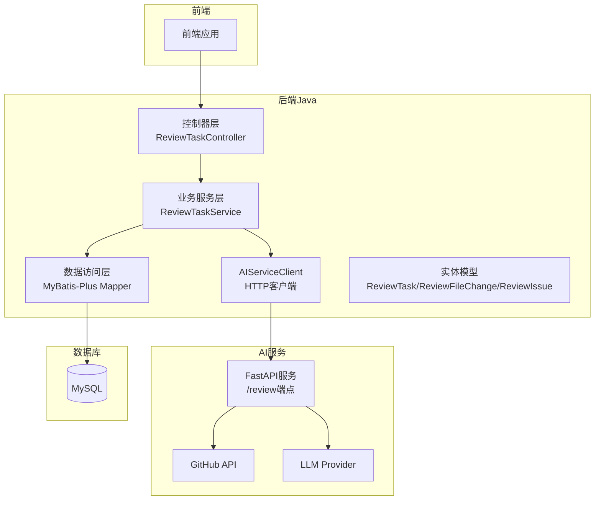
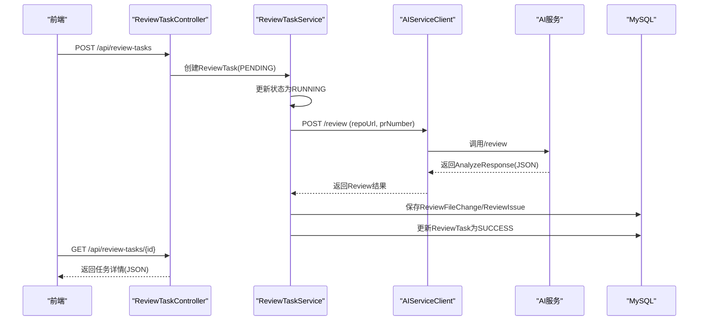
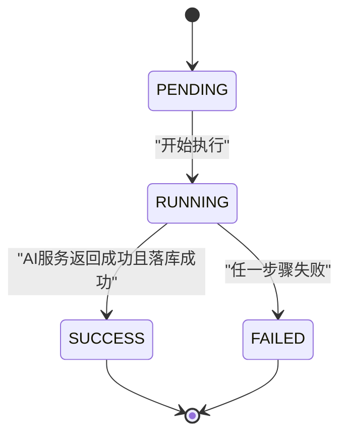
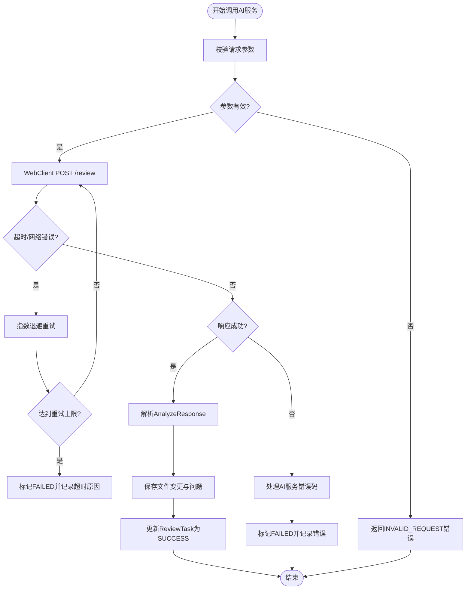
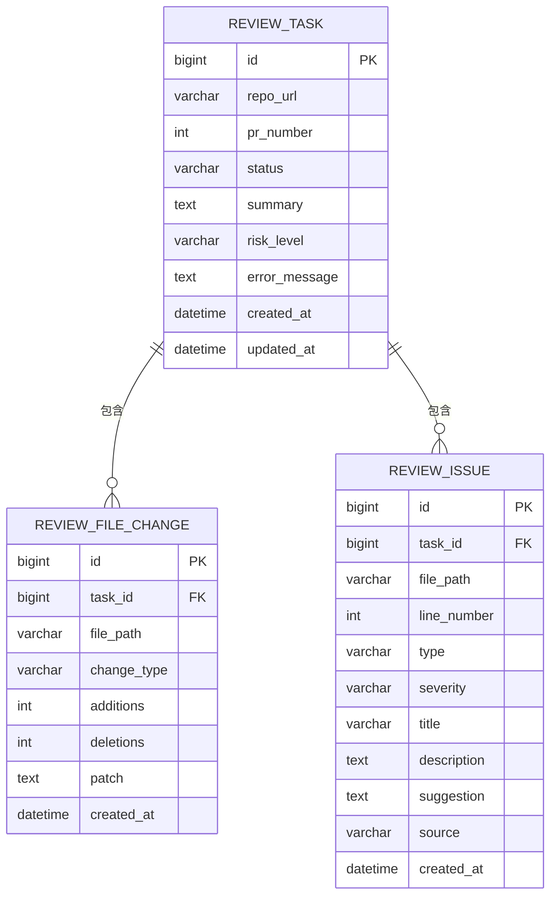
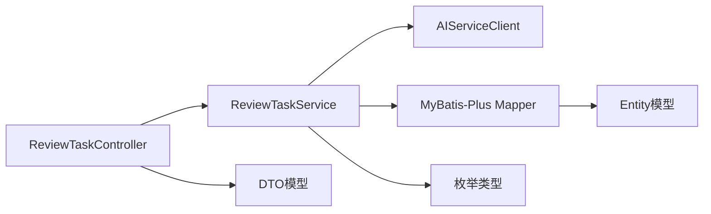

# 业务逻辑实现

<cite>
**本文引用的文件**
- [README.md](file://README.md)
- [docs/PRD.md](file://docs/PRD.md)
- [docs/ARCHITECTURE.md](file://docs/ARCHITECTURE.md)
- [docs/API.md](file://docs/API.md)
- [docs/DATABASE.md](file://docs/DATABASE.md)
- [backend-java/README.md](file://backend-java/README.md)
- [ai-service/README.md](file://ai-service/README.md)
- [docker-compose.yml](file://docker-compose.yml)
</cite>

## 目录
1. [简介](#简介)
2. [项目结构](#项目结构)
3. [核心组件](#核心组件)
4. [架构总览](#架构总览)
5. [详细组件分析](#详细组件分析)
6. [依赖关系分析](#依赖关系分析)
7. [性能考量](#性能考量)
8. [故障排查指南](#故障排查指南)
9. [结论](#结论)
10. [附录](#附录)

## 简介
本文件面向后端Java服务模块的ReviewTask生命周期管理实现，基于CodeReviewX项目的设计文档，系统性阐述任务创建、状态转换（PENDING → RUNNING → SUCCESS/FAILED）的业务规则与状态机设计，以及与AI服务的集成机制（HTTP客户端调用、异步处理与错误重试策略）。文档提供业务流程图与代码示例路径，帮助开发者快速理解核心业务逻辑的实现方式。

## 项目结构
CodeReviewX采用多模块架构，后端Java模块负责ReviewTask生命周期编排、REST API提供、MySQL持久化与AI服务调用。根据设计文档，模块边界清晰：后端仅做业务编排与数据持久化，AI服务负责GitHub数据获取、静态分析与LLM分析，前端仅调用后端API。

图表来源
- [docs/ARCHITECTURE.md: 183-230:183-230](file://docs/ARCHITECTURE.md#L183-L230)
- [docs/ARCHITECTURE.md: 233-266:233-266](file://docs/ARCHITECTURE.md#L233-L266)
- [backend-java/README.md: 19-46:19-46](file://backend-java/README.md#L19-L46)

章节来源
- [README.md: 29-56:29-56](file://README.md#L29-L56)
- [docs/ARCHITECTURE.md: 19-52:19-52](file://docs/ARCHITECTURE.md#L19-L52)
- [backend-java/README.md: 1-74:1-74](file://backend-java/README.md#L1-L74)

## 核心组件
- ReviewTask生命周期管理：负责任务创建、状态流转（PENDING → RUNNING → SUCCESS/FAILED）、结果存储与查询。
- REST API：提供任务创建、列表查询、详情查询接口，统一响应与错误处理。
- 数据持久化：基于MyBatis-Plus的实体与Mapper，存储ReviewTask、ReviewFileChange、ReviewIssue三张表。
- AI服务集成：通过WebClient调用AI服务的/review端点，处理结构化Review JSON并落库。

章节来源
- [docs/PRD.md: 125-178:125-178](file://docs/PRD.md#L125-L178)
- [docs/API.md: 54-241:54-241](file://docs/API.md#L54-L241)
- [docs/DATABASE.md: 20-134:20-134](file://docs/DATABASE.md#L20-L134)
- [backend-java/README.md: 19-25:19-25](file://backend-java/README.md#L19-L25)

## 架构总览
后端Java模块遵循"业务编排 + 数据持久化"的原则，通过HTTP客户端调用AI服务，AI服务内部协调GitHub API与LLM进行分析，最终返回结构化Review JSON。后端负责状态管理、数据落库与对外API。

图表来源
- [docs/ARCHITECTURE.md: 137-180:137-180](file://docs/ARCHITECTURE.md#L137-L180)
- [docs/API.md: 56-241:56-241](file://docs/API.md#L56-L241)
- [docs/DATABASE.md: 20-134:20-134](file://docs/DATABASE.md#L20-L134)

## 详细组件分析

### ReviewTask状态机设计
ReviewTask的状态流转严格遵循单向规则：PENDING → RUNNING → SUCCESS/FAILED。状态转换触发条件与业务规则如下：
- PENDING：任务创建成功，尚未执行。
- RUNNING：后端调用AI服务前设置，表示任务正在执行。
- SUCCESS：AI服务成功返回且结果已落库。
- FAILED：任一关键步骤失败（GitHub拉取失败、AI服务超时、数据库写入失败等），必须同时保存error_message。

图表来源
- [docs/PRD.md: 172-178:172-178](file://docs/PRD.md#L172-L178)
- [docs/ARCHITECTURE.md: 110-134:110-134](file://docs/ARCHITECTURE.md#L110-L134)

章节来源
- [docs/PRD.md: 172-178:172-178](file://docs/PRD.md#L172-L178)
- [docs/ARCHITECTURE.md: 110-134:110-134](file://docs/ARCHITECTURE.md#L110-L134)

### ReviewTask生命周期管理实现要点
- 任务创建：接收repoUrl与prNumber，校验参数合法性，插入数据库并设置初始状态为PENDING。
- 状态更新：创建后立即更新为RUNNING，确保前端轮询能正确反映执行中状态。
- 结果落库：解析AI服务返回的AnalyzeResponse，分别保存ReviewFileChange与ReviewIssue，随后更新ReviewTask为SUCCESS。
- 失败处理：捕获GitHub API失败、AI服务超时、数据库写入异常等，统一置为FAILED并记录error_message。

章节来源
- [docs/ARCHITECTURE.md: 139-168:139-168](file://docs/ARCHITECTURE.md#L139-L168)
- [docs/API.md: 56-96:56-96](file://docs/API.md#L56-L96)

### AI服务集成机制
- HTTP客户端：使用Spring WebClient发起POST /review请求，设置合理的连接与读取超时。
- 异步处理：在MVP阶段可采用同步调用；若扩展为异步，建议引入消息队列或简单后台线程池。
- 错误重试策略：对临时性错误（如网络抖动、AI服务瞬时超时）进行指数退避重试；对不可恢复错误（如参数非法、资源不存在）直接失败并记录。

图表来源
- [docs/ARCHITECTURE.md: 170-180:170-180](file://docs/ARCHITECTURE.md#L170-L180)
- [docs/API.md: 243-332:243-332](file://docs/API.md#L243-L332)

章节来源
- [docs/ARCHITECTURE.md: 170-180:170-180](file://docs/ARCHITECTURE.md#L170-L180)
- [docs/API.md: 243-332:243-332](file://docs/API.md#L243-L332)

### 数据模型与持久化
ReviewTask、ReviewFileChange、ReviewIssue三张表构成Review结果的数据模型。字段设计遵循MyBatis-Plus命名映射规则，使用注解进行显式映射。

图表来源
- [docs/DATABASE.md: 22-134:22-134](file://docs/DATABASE.md#L22-L134)

章节来源
- [docs/DATABASE.md: 22-134:22-134](file://docs/DATABASE.md#L22-L134)

### REST API设计与错误处理
- 统一响应格式：成功返回"data"字段，错误返回"code"、"message"、"details"。
- 错误码定义：INVALID_REQUEST、TASK_NOT_FOUND、AI_SERVICE_ERROR、GITHUB_FETCH_FAILED、DATABASE_ERROR、INTERNAL_ERROR。
- 前端调用：创建任务、查询列表、查询详情三个核心接口，支持分页与状态过滤。

章节来源
- [docs/API.md: 9-51:9-51](file://docs/API.md#L9-L51)
- [docs/API.md: 54-241:54-241](file://docs/API.md#L54-L241)

## 依赖关系分析
后端Java模块的分层设计清晰：controller仅负责参数接收与响应封装，service负责业务流程与事务控制，client负责调用AI服务，mapper负责数据库访问，entity对应表结构，dto用于API入参与出参，enum集中管理状态与类型。

图表来源
- [docs/ARCHITECTURE.md: 183-230:183-230](file://docs/ARCHITECTURE.md#L183-L230)

章节来源
- [docs/ARCHITECTURE.md: 183-230:183-230](file://docs/ARCHITECTURE.md#L183-L230)

## 性能考量
- 数据库层面：为status、created_at建立索引，优化任务列表查询；review_issue表按severity与type建立索引，便于筛选与统计。
- HTTP调用层面：合理设置WebClient超时与重试策略，避免阻塞主线程；对AI服务响应进行缓存（如短期内重复任务）。
- 并发与扩展：MVP阶段采用同步调用即可满足演示需求；若需要扩展，建议引入消息队列或限流策略。

## 故障排查指南
- 任务状态异常：检查状态转换规则与数据库更新逻辑，确认FAILED状态是否正确记录error_message。
- AI服务调用失败：验证AI_SERVICE_BASE_URL配置、网络连通性与超时设置；查看AI服务返回的错误码与recoverable标志。
- 数据库写入失败：检查字段长度（如patch字段可能需要MEDIUMTEXT）、外键约束与事务一致性。
- 前端无法获取结果：确认API响应格式与错误码处理，核对任务ID与鉴权（如有）。

章节来源
- [docs/ARCHITECTURE.md: 312-342:312-342](file://docs/ARCHITECTURE.md#L312-L342)
- [docs/DATABASE.md: 288-294:288-294](file://docs/DATABASE.md#L288-L294)

## 结论
本设计文档基于CodeReviewX的PRD与架构文档，明确了后端Java模块在ReviewTask生命周期管理中的职责边界与实现要点。通过清晰的状态机设计、严格的错误处理与统一的API规范，后端能够可靠地编排AI服务调用并将结果持久化。随着后续Round的推进，模块将逐步实现具体代码，本文档为其提供坚实的理论基础与实践指导。

## 附录
- 部署与环境：后端Java默认监听8080端口，AI服务8000端口，MySQL3306端口；Docker Compose在后续Round完善服务定义。
- Agent协作：遵循"文档先行、MVP优先、Mock优先"原则，确保各模块职责边界清晰，避免scope creep。

章节来源
- [docs/ARCHITECTURE.md: 373-381:373-381](file://docs/ARCHITECTURE.md#L373-L381)
- [docker-compose.yml: 1-14:1-14](file://docker-compose.yml#L1-L14)