# 数据库持久化实现

<cite>
**本文档引用的文件**
- [DATABASE.md](file://docs/DATABASE.md)
- [ARCHITECTURE.md](file://docs/ARCHITECTURE.md)
- [API.md](file://docs/API.md)
- [README.md](file://README.md)
- [backend-java/README.md](file://backend-java/README.md)
- [docker-compose.yml](file://docker-compose.yml)
</cite>

## 目录
1. [简介](#简介)
2. [项目结构](#项目结构)
3. [核心组件](#核心组件)
4. [架构概览](#架构概览)
5. [详细组件分析](#详细组件分析)
6. [依赖关系分析](#依赖关系分析)
7. [性能考虑](#性能考虑)
8. [故障排除指南](#故障排除指南)
9. [结论](#结论)

## 简介

本文件详细说明CodeReviewX项目的数据库持久化实现方案，重点涵盖MyBatis-Plus的配置与使用、实体类定义、Mapper接口设计、Service层实现，以及三个核心表(review_task、review_file_change、review_issue)的映射关系和外键约束。文档还阐述了数据访问模式、批量操作、事务管理、分页查询、排序过滤策略，以及数据一致性和并发控制机制。

## 项目结构

根据架构文档，backend-java模块采用标准的分层架构设计：

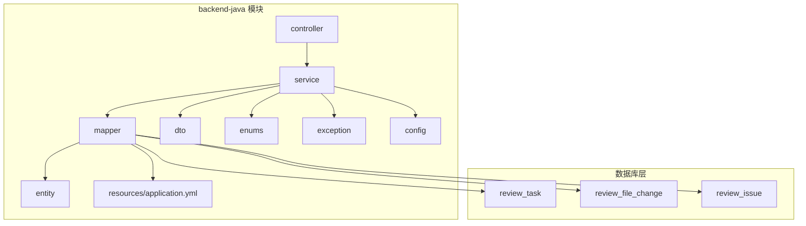

**图表来源**
- [ARCHITECTURE.md:183-232](file://docs/ARCHITECTURE.md#L183-L232)

**章节来源**
- [ARCHITECTURE.md:183-232](file://docs/ARCHITECTURE.md#L183-L232)
- [backend-java/README.md:49-71](file://backend-java/README.md#L49-L71)

## 核心组件

### 数据库设计概述

根据数据库设计文档，系统包含三个核心表，采用MySQL 8作为持久化存储，字符集为utf8mb4，排序规则为utf8mb4_unicode_ci。

**章节来源**
- [DATABASE.md:9-16](file://docs/DATABASE.md#L9-L16)
- [DATABASE.md:22-41](file://docs/DATABASE.md#L22-L41)
- [DATABASE.md:59-91](file://docs/DATABASE.md#L59-L91)
- [DATABASE.md:94-134](file://docs/DATABASE.md#L94-L134)

### 实体类映射规则

backend-java使用MyBatis-Plus作为ORM框架，遵循明确的命名映射规则：

- 数据库字段：snake_case（如 `task_id`）
- Java属性：camelCase（如 `taskId`）
- 使用注解进行显式映射：`@TableName`、`@TableId`、`@TableField`

**章节来源**
- [DATABASE.md:257-284](file://docs/DATABASE.md#L257-L284)

## 架构概览

系统采用分层架构，数据库持久化通过MyBatis-Plus实现：

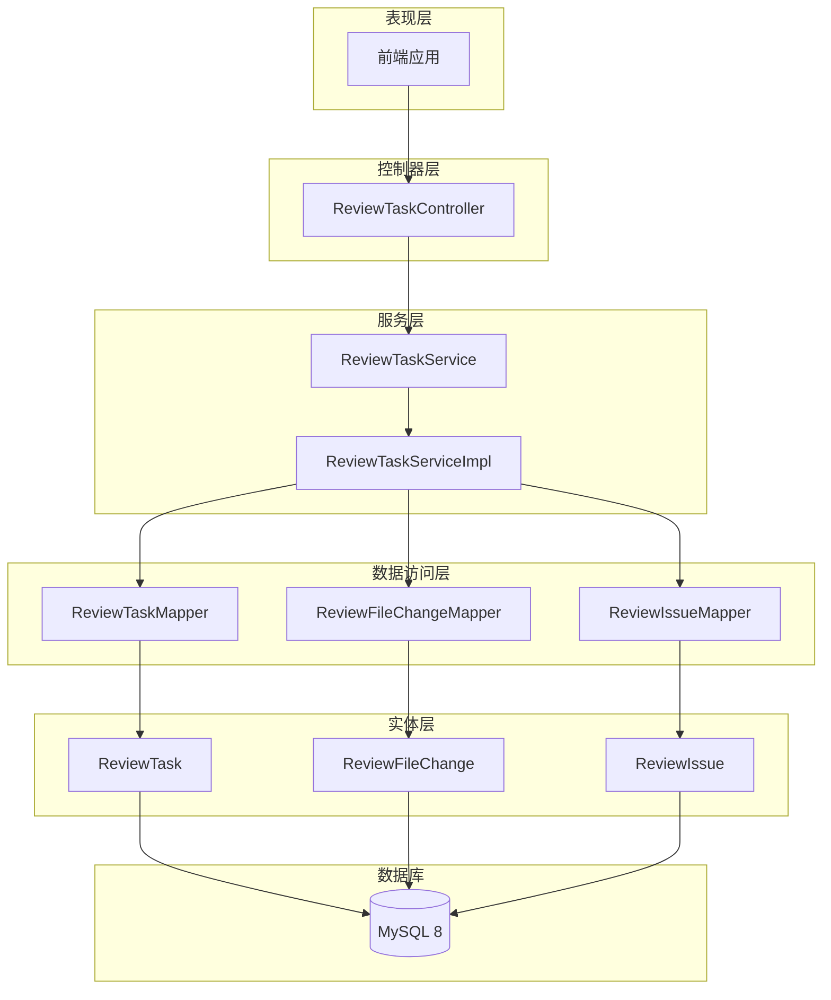

**图表来源**
- [ARCHITECTURE.md:183-232](file://docs/ARCHITECTURE.md#L183-L232)
- [DATABASE.md:257-284](file://docs/DATABASE.md#L257-L284)

## 详细组件分析

### 核心表关系设计

三个核心表之间存在清晰的外键关系：

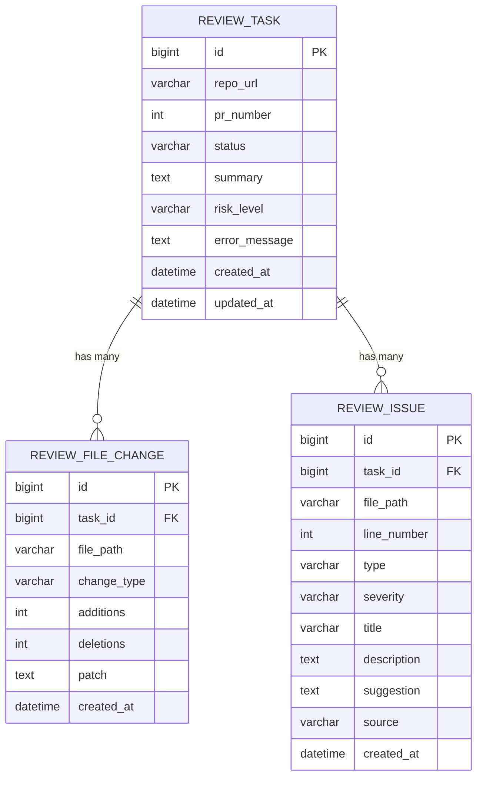

**图表来源**
- [DATABASE.md:27-41](file://docs/DATABASE.md#L27-L41)
- [DATABASE.md:64-77](file://docs/DATABASE.md#L64-L77)
- [DATABASE.md:99-117](file://docs/DATABASE.md#L99-L117)

### 实体类设计

#### ReviewTask实体类

ReviewTask作为任务主表，包含以下关键字段：

- 主键：`id` (Long, 自增)
- 仓库信息：`repoUrl` (String)
- PR编号：`prNumber` (Integer)
- 状态管理：`status` (String, 使用TaskStatus枚举)
- 结果摘要：`summary` (String)
- 风险等级：`riskLevel` (String, 使用RiskLevel枚举)
- 错误信息：`errorMessage` (String)
- 时间戳：`createdAt`、`updatedAt` (LocalDateTime)

**章节来源**
- [DATABASE.md:266-284](file://docs/DATABASE.md#L266-L284)

#### ReviewFileChange实体类

ReviewFileChange表保存文件变更信息：

- 主键：`id` (Long, 自增)
- 关联任务：`taskId` (Long, 外键)
- 文件路径：`filePath` (String)
- 变更类型：`changeType` (String, 使用ChangeType枚举)
- 统计信息：`additions`、`deletions` (Integer)
- 差异内容：`patch` (String)
- 创建时间：`createdAt` (LocalDateTime)

**章节来源**
- [DATABASE.md:63-77](file://docs/DATABASE.md#L63-L77)

#### ReviewIssue实体类

ReviewIssue表存储分析发现的问题：

- 主键：`id` (Long, 自增)
- 关联任务：`taskId` (Long, 外键)
- 问题位置：`filePath` (String)、`lineNumber` (Integer)
- 问题分类：`type` (String, 使用IssueType枚举)
- 严重程度：`severity` (String, 使用IssueSeverity枚举)
- 描述信息：`title`、`description`、`suggestion` (String)
- 来源标识：`source` (String, 使用IssueSource枚举)
- 创建时间：`createdAt` (LocalDateTime)

**章节来源**
- [DATABASE.md:98-117](file://docs/DATABASE.md#L98-L117)

### Mapper接口设计

每个实体类对应一个Mapper接口，采用MyBatis-Plus的标准CRUD操作：

#### ReviewTaskMapper接口

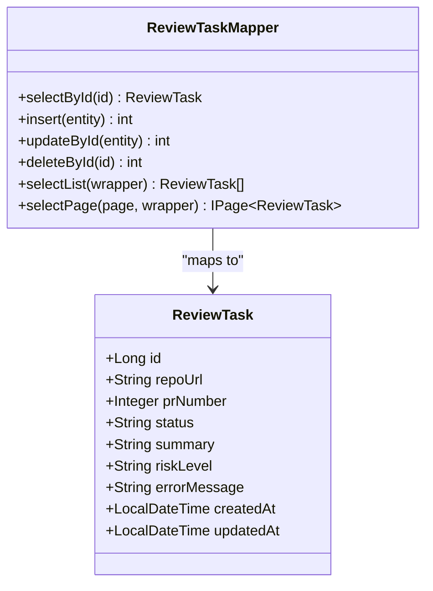

**图表来源**
- [ARCHITECTURE.md:196-198](file://docs/ARCHITECTURE.md#L196-L198)

#### ReviewFileChangeMapper接口

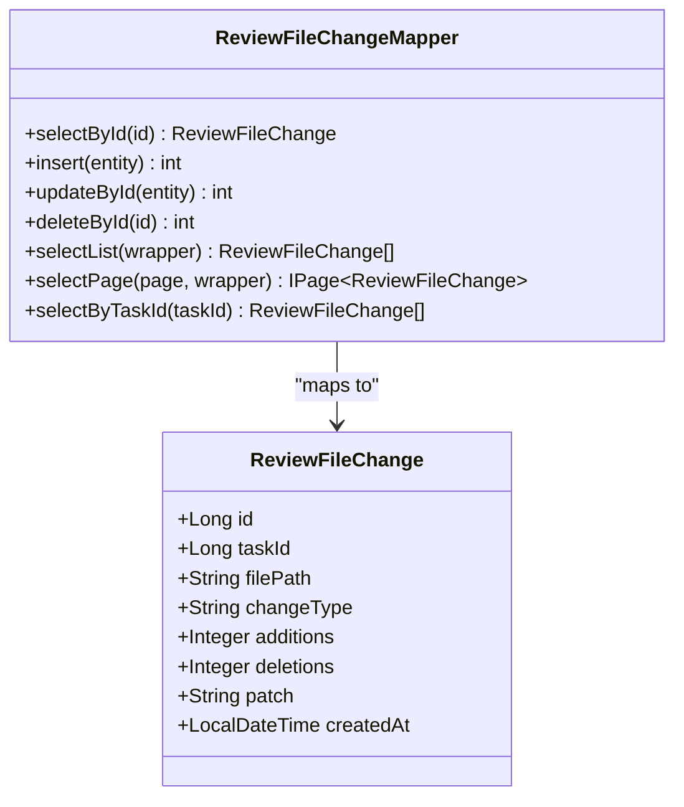

**图表来源**
- [ARCHITECTURE.md:198-199](file://docs/ARCHITECTURE.md#L198-L199)

#### ReviewIssueMapper接口

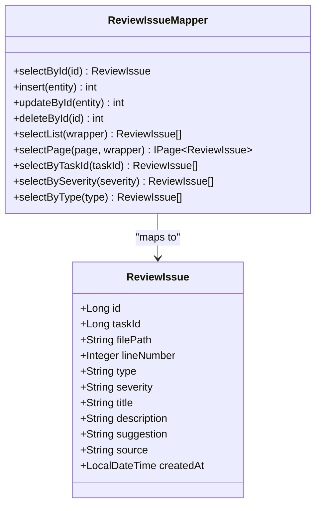

**图表来源**
- [ARCHITECTURE.md:199-200](file://docs/ARCHITECTURE.md#L199-L200)

### Service层实现

Service层负责业务流程和事务管理，采用MyBatis-Plus的批量操作能力：

#### ReviewTaskService接口

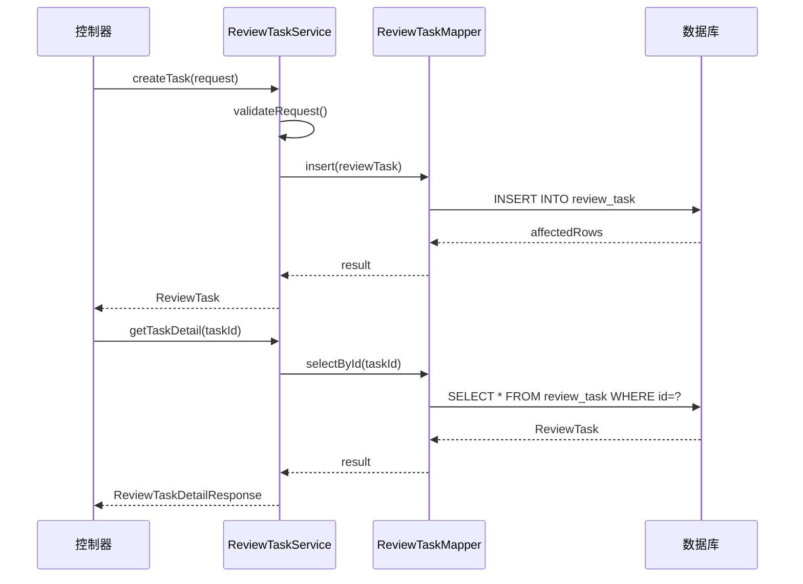

**图表来源**
- [ARCHITECTURE.md:190-194](file://docs/ARCHITECTURE.md#L190-L194)

### 数据访问模式

#### 单表查询模式

MyBatis-Plus支持多种查询模式：

1. **条件查询**：使用Wrapper构建查询条件
2. **分页查询**：使用IPage接口实现分页
3. **批量操作**：使用批量插入、更新、删除
4. **聚合查询**：使用聚合函数统计

#### 复杂查询实现

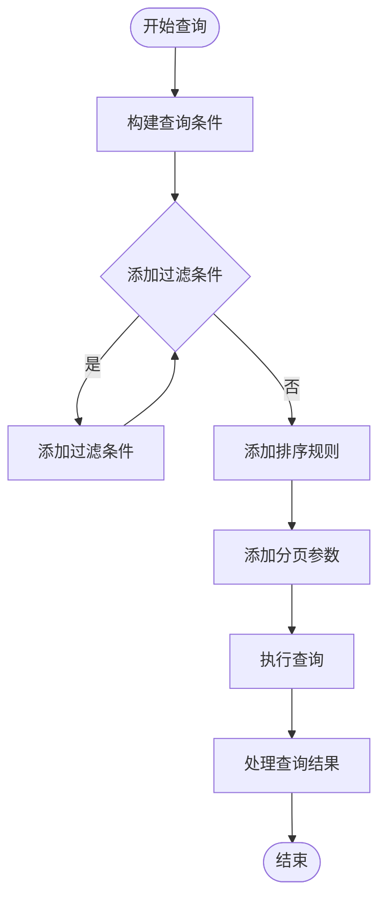

**图表来源**
- [DATABASE.md:137-199](file://docs/DATABASE.md#L137-L199)

### 批量操作实现

MyBatis-Plus提供了高效的批量操作能力：

#### 批量插入文件变更

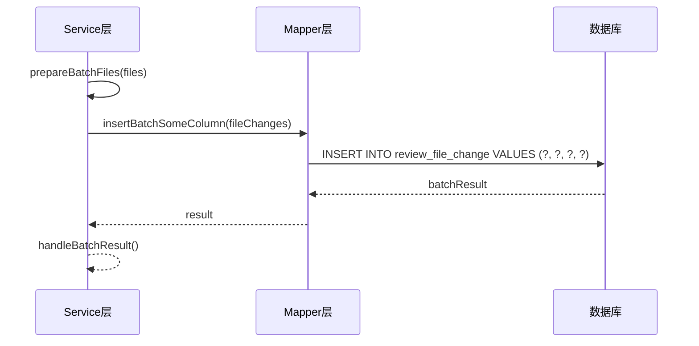

**图表来源**
- [ARCHITECTURE.md:192-194](file://docs/ARCHITECTURE.md#L192-L194)

### 事务管理

系统采用声明式事务管理，确保数据一致性：

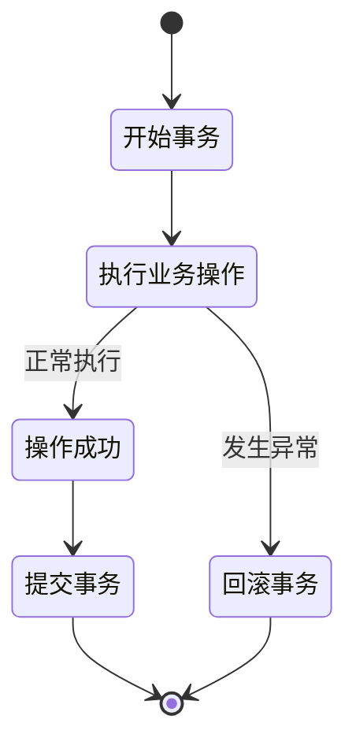

**图表来源**
- [ARCHITECTURE.md:222-229](file://docs/ARCHITECTURE.md#L222-L229)

## 依赖关系分析

### 外键约束设计

三个核心表之间的外键关系确保了数据完整性：

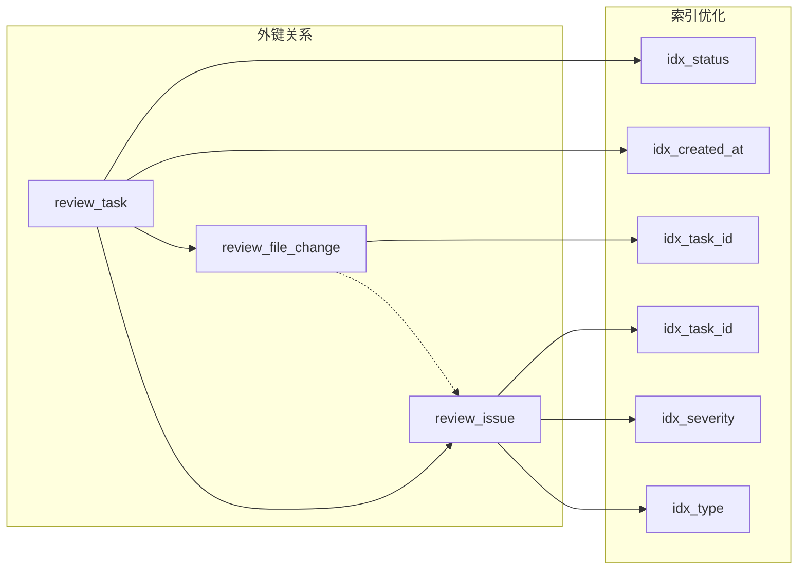

**图表来源**
- [DATABASE.md:37-40](file://docs/DATABASE.md#L37-L40)
- [DATABASE.md:74-76](file://docs/DATABASE.md#L74-L76)
- [DATABASE.md:112-116](file://docs/DATABASE.md#L112-L116)

### 依赖注入关系

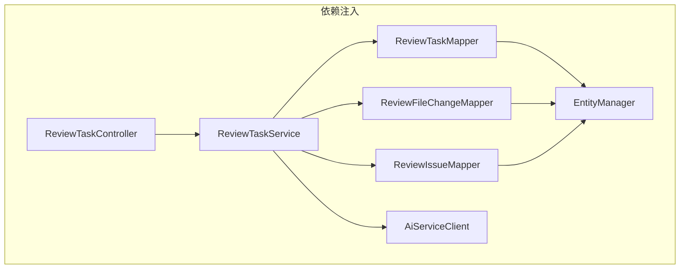

**图表来源**
- [ARCHITECTURE.md:188-219](file://docs/ARCHITECTURE.md#L188-L219)

**章节来源**
- [DATABASE.md:290-294](file://docs/DATABASE.md#L290-L294)

## 性能考虑

### 索引优化策略

1. **主键索引**：所有表的主键自动建立唯一索引
2. **业务索引**：
   - review_task：status、created_at索引
   - review_file_change：task_id索引
   - review_issue：task_id、severity、type索引

### 查询性能优化

1. **分页查询**：使用LIMIT和OFFSET实现高效分页
2. **批量操作**：减少数据库往返次数
3. **连接池配置**：合理配置连接池大小
4. **缓存策略**：对热点数据进行缓存

### 并发控制机制

1. **乐观锁**：使用version字段实现乐观锁
2. **悲观锁**：使用SELECT FOR UPDATE实现悲观锁
3. **事务隔离**：合理设置事务隔离级别
4. **死锁预防**：按固定顺序访问资源

**章节来源**
- [DATABASE.md:288-294](file://docs/DATABASE.md#L288-L294)

## 故障排除指南

### 常见数据库问题

#### 连接问题

**症状**：应用启动时报数据库连接失败
**解决方案**：
1. 检查数据库服务是否启动
2. 验证连接字符串配置
3. 确认网络连通性
4. 检查防火墙设置

#### 索引失效

**症状**：查询性能下降
**解决方案**：
1. 使用EXPLAIN分析查询计划
2. 检查WHERE条件是否使用索引
3. 重新评估索引设计
4. 考虑复合索引

#### 死锁问题

**症状**：事务执行过程中出现死锁异常
**解决方案**：
1. 减少事务持有时间
2. 统一事务内资源访问顺序
3. 降低事务隔离级别
4. 实现死锁检测和重试机制

### MyBatis-Plus使用注意事项

1. **实体类注解**：确保正确使用@TableId、@TableField注解
2. **枚举类型**：使用@EnumValue和@EnumName注解处理枚举
3. **批量操作**：注意批量操作的性能影响
4. **分页查询**：合理设置分页参数，避免大数据量查询

**章节来源**
- [ARCHITECTURE.md:312-342](file://docs/ARCHITECTURE.md#L312-L342)

## 结论

CodeReviewX项目的数据库持久化实现基于MyBatis-Plus框架，采用了清晰的分层架构和规范的数据访问模式。通过合理的表结构设计、外键约束和索引优化，确保了数据完整性和查询性能。批量操作和事务管理机制保证了数据一致性，而并发控制策略有效防止了数据竞争问题。

该实现方案为后续的功能扩展奠定了坚实的基础，能够支持CodeReviewX系统在MVP阶段的需求，并为未来的功能增强提供了良好的可扩展性。