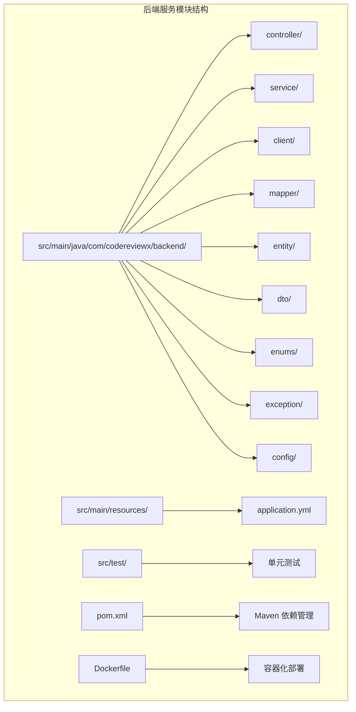
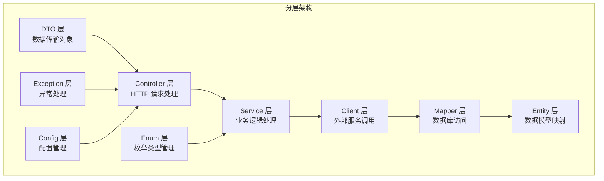
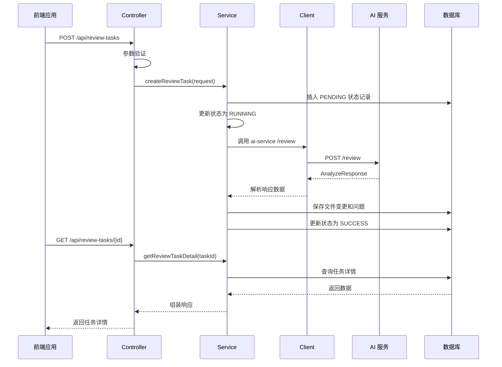
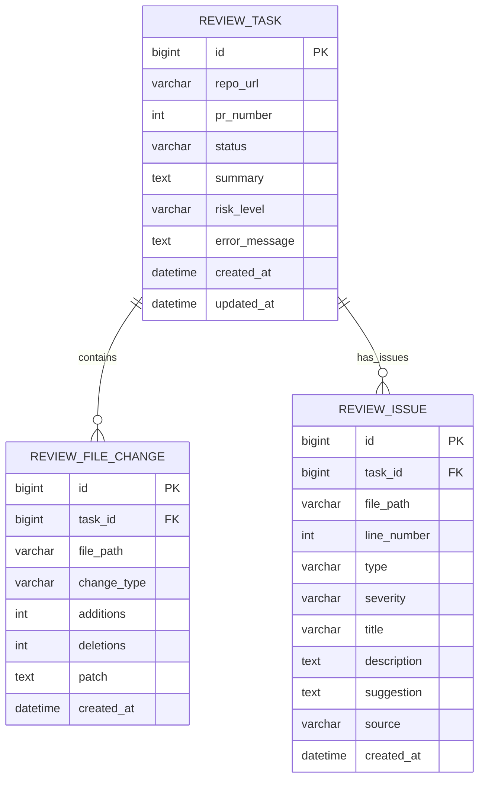
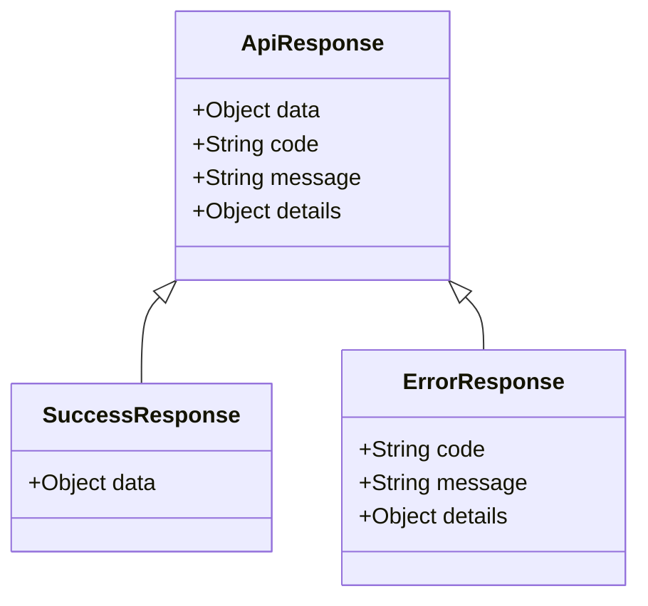
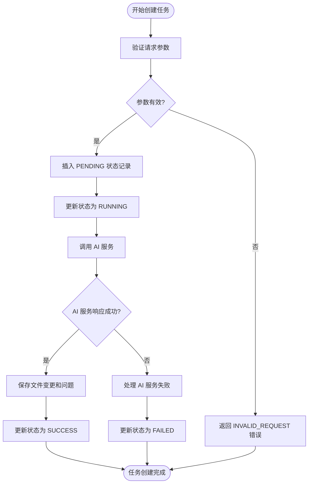
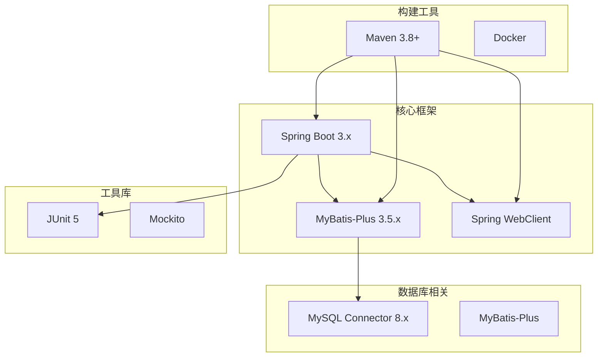
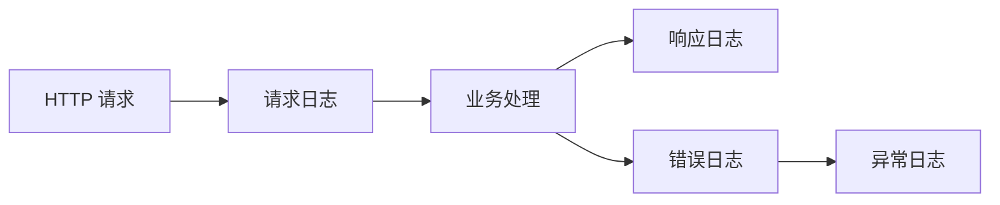

# 后端服务模块

<cite>
**本文档引用的文件**
- [backend-java/README.md](file://backend-java/README.md)
- [docs/ARCHITECTURE.md](file://docs/ARCHITECTURE.md)
- [docs/DATABASE.md](file://docs/DATABASE.md)
- [docs/API.md](file://docs/API.md)
- [docker-compose.yml](file://docker-compose.yml)
- [tasks/round-01/01-cursor-repository-foundation.md](file://tasks/round-01/01-cursor-repository-foundation.md)
- [handoff/round-01/01-cursor-handoff.md](file://handoff/round-01/01-cursor-handoff.md)
</cite>

## 目录
1. [简介](#简介)
2. [项目结构](#项目结构)
3. [核心组件](#核心组件)
4. [架构概览](#架构概览)
5. [详细组件分析](#详细组件分析)
6. [依赖关系分析](#依赖关系分析)
7. [性能考虑](#性能考虑)
8. [故障排除指南](#故障排除指南)
9. [结论](#结论)
10. [附录](#附录)

## 简介

后端服务模块是 CodeReviewX 项目的核心组件，采用 Spring Boot 3 + Java 17 技术栈构建，负责 ReviewTask 生命周期管理、REST API 提供、数据持久化以及与 ai-service 的集成调用。该模块遵循严格的分层架构设计，确保业务逻辑清晰分离和代码可维护性。

### 技术栈选择原因

**Spring Boot 3 + Java 17 的优势：**
- **现代化特性**：支持最新的 Java 语言特性和 Spring 生态系统的最新版本
- **性能优化**：JVM 性能改进和启动速度提升
- **安全性增强**：内置的安全特性和漏洞防护机制
- **云原生支持**：更好的容器化和微服务部署能力

**MyBatis-Plus 的选择理由：**
- **简化 ORM 开发**：减少样板代码，提高开发效率
- **强大的 CRUD 支持**：内置丰富的查询条件和分页功能
- **灵活的 SQL 控制**：既支持注解也支持 XML 配置
- **良好的社区支持**：活跃的社区和完善的文档

## 项目结构

后端服务模块采用标准的 Maven 项目结构，遵循分层架构设计原则：



**图表来源**
- [backend-java/README.md:50-71](file://backend-java/README.md#L50-L71)

### 目录结构说明

- **controller**：处理 HTTP 请求和响应，负责参数验证和结果封装
- **service**：实现核心业务逻辑，管理事务和业务流程
- **client**：封装对外部服务的调用，特别是 ai-service 的 HTTP 客户端
- **mapper**：数据访问层，负责与数据库的交互
- **entity**：数据库实体映射，使用 MyBatis-Plus 注解进行字段映射
- **dto**：数据传输对象，用于 API 请求和响应的数据结构
- **enums**：集中管理所有枚举类型，确保类型安全
- **exception**：全局异常处理和业务异常定义
- **config**：Spring Boot 配置类，包括 WebFlux 配置和 Bean 定义

**章节来源**
- [backend-java/README.md:49-71](file://backend-java/README.md#L49-L71)

## 核心组件

### 分层架构设计

后端服务模块严格遵循分层架构设计，每层都有明确的职责和边界：



**图表来源**
- [docs/ARCHITECTURE.md:156-203](file://docs/ARCHITECTURE.md#L156-L203)

### 核心职责边界

- **Controller 层**：只负责参数接收、响应返回和基础验证
- **Service 层**：负责复杂的业务流程、事务管理和状态转换
- **Client 层**：专门处理 ai-service 的 HTTP 调用和响应解析
- **Mapper 层**：专注于数据库 CRUD 操作和数据持久化
- **Entity 层**：提供与数据库表结构对应的 Java 对象映射

**章节来源**
- [docs/ARCHITECTURE.md:73-106](file://docs/ARCHITECTURE.md#L73-L106)

## 架构概览

### 系统整体架构

```mermaid
graph TB
subgraph "前端层"
FE[Vue 3 / React<br/>前端应用]
end
subgraph "后端服务层"
BE[Spring Boot 3 + Java 17<br/>后端服务]
CTRL[Controller 层]
SVC[Service 层]
CLIENT[Client 层]
end
subgraph "AI 服务层"
AI[Python + FastAPI<br/>AI 分析服务]
end
subgraph "数据存储层"
DB[(MySQL 8)<br/>ReviewTask 数据库]
end
FE --> BE
BE --> CTRL
CTRL --> SVC
SVC --> CLIENT
CLIENT --> AI
SVC --> DB
DB --> SVC
```

**图表来源**
- [docs/ARCHITECTURE.md:19-52](file://docs/ARCHITECTURE.md#L19-L52)

### 调用链路设计

系统采用严格的调用链路设计，确保各组件职责清晰：



**图表来源**
- [docs/ARCHITECTURE.md:110-141](file://docs/ARCHITECTURE.md#L110-L141)

**章节来源**
- [docs/ARCHITECTURE.md:109-153](file://docs/ARCHITECTURE.md#L109-L153)

## 详细组件分析

### 实体设计与数据库映射

#### ReviewTask 实体设计

ReviewTask 是核心业务实体，代表一次代码审查任务的完整生命周期：



**图表来源**
- [docs/DATABASE.md:22-134](file://docs/DATABASE.md#L22-L134)

#### 字段设计原则

- **主键设计**：使用自增 BIGINT 类型，支持大规模数据存储
- **索引策略**：为常用查询字段建立索引，优化查询性能
- **状态管理**：使用枚举值控制状态转换，确保数据一致性
- **时间戳管理**：自动维护创建和更新时间，便于审计追踪

**章节来源**
- [docs/DATABASE.md:203-254](file://docs/DATABASE.md#L203-L254)

### REST API 接口规范

#### 统一响应格式

系统采用统一的响应格式，确保前后端交互的一致性：



**图表来源**
- [docs/API.md:23-51](file://docs/API.md#L23-L51)

#### 错误码设计

| 错误码 | HTTP 状态 | 场景描述 |
|--------|-----------|----------|
| INVALID_REQUEST | 400 | 请求参数验证失败 |
| TASK_NOT_FOUND | 404 | 任务不存在 |
| AI_SERVICE_ERROR | 502 | AI 服务调用失败 |
| GITHUB_FETCH_FAILED | 502 | GitHub 数据获取失败 |
| DATABASE_ERROR | 500 | 数据库操作失败 |
| INTERNAL_ERROR | 500 | 未知系统错误 |

**章节来源**
- [docs/API.md:41-51](file://docs/API.md#L41-L51)

### 业务流程实现

#### 任务创建流程



**图表来源**
- [docs/ARCHITECTURE.md:112-138](file://docs/ARCHITECTURE.md#L112-L138)

#### 失败处理策略

| 失败场景 | 处理策略 | 影响范围 |
|----------|----------|----------|
| GitHub API 失败 | 设置 FAILED 状态，保存错误信息 | 任务失败 |
| Semgrep 失败 | 降级为 warning，不影响任务完成 | 任务成功 |
| LLM 失败 | 使用 mock fallback 或返回空 issues | 任务成功 |
| 数据库保存失败 | 设置 FAILED 状态 | 任务失败 |
| AI 服务超时 | 设置 FAILED 状态，保存超时原因 | 任务失败 |

**章节来源**
- [docs/ARCHITECTURE.md:143-153](file://docs/ARCHITECTURE.md#L143-L153)

## 依赖关系分析

### 技术栈依赖



**图表来源**
- [backend-java/README.md:28-39](file://backend-java/README.md#L28-L39)

### 外部服务集成

后端服务主要依赖以下外部服务：

- **ai-service**：提供代码分析和 LLM 能力
- **GitHub API**：获取 PR 信息和 diff 数据
- **MySQL 数据库**：存储业务数据和分析结果

**章节来源**
- [docs/ARCHITECTURE.md:318-343](file://docs/ARCHITECTURE.md#L318-L343)

## 性能考虑

### 数据库性能优化

- **索引策略**：为 status 和 created_at 字段建立复合索引，优化查询性能
- **连接池配置**：合理配置数据库连接池大小，避免连接泄漏
- **批量操作**：对于大量数据的插入和更新，使用批量操作提高性能
- **缓存策略**：对于频繁读取但不经常变化的数据，考虑使用缓存

### API 性能优化

- **分页查询**：对于列表查询，实现分页机制避免一次性加载过多数据
- **异步处理**：对于耗时较长的操作，考虑使用异步处理机制
- **压缩传输**：启用 GZIP 压缩减少网络传输数据量
- **CDN 加速**：静态资源使用 CDN 加速

### 容器化部署优化

- **镜像优化**：使用多阶段构建减少镜像体积
- **资源限制**：为容器设置合理的 CPU 和内存限制
- **健康检查**：配置健康检查确保服务可用性
- **日志管理**：统一日志收集和管理，避免磁盘空间占用

## 故障排除指南

### 常见问题诊断

#### 数据库连接问题

**症状**：应用启动时报数据库连接失败

**排查步骤**：
1. 检查数据库服务是否正常运行
2. 验证连接字符串和认证信息
3. 确认防火墙和网络配置
4. 查看数据库连接池配置

#### AI 服务调用失败

**症状**：任务执行过程中 AI 服务调用失败

**排查步骤**：
1. 检查 AI 服务是否正常运行
2. 验证网络连通性和端口开放情况
3. 查看 AI 服务的错误日志
4. 确认请求格式和参数正确性

#### API 响应异常

**症状**：API 返回格式不符合预期

**排查步骤**：
1. 检查请求参数和格式
2. 验证响应序列化配置
3. 查看异常处理逻辑
4. 确认错误码映射正确

### 日志分析

系统采用统一的日志格式，便于问题定位和分析：



**章节来源**
- [docs/ARCHITECTURE.md:285-305](file://docs/ARCHITECTURE.md#L285-L305)

## 结论

后端服务模块采用 Spring Boot 3 + Java 17 技术栈，结合 MyBatis-Plus ORM 框架，实现了清晰的分层架构设计和完善的业务流程管理。通过严格的模块边界划分和统一的错误处理机制，确保了系统的可维护性和可扩展性。

该模块的设计充分考虑了 MVP 阶段的需求，采用渐进式开发策略，为后续的功能扩展奠定了坚实的基础。通过合理的性能优化和故障排除机制，确保了系统的稳定性和可靠性。

## 附录

### 配置文件示例

#### application.yml 配置模板

```yaml
spring:
  datasource:
    url: ${SPRING_DATASOURCE_URL:jdbc:mysql://localhost:3306/codereviewx}
    username: ${SPRING_DATASOURCE_USERNAME:codereviewx}
    password: ${SPRING_DATASOURCE_PASSWORD:codereviewx}
    hikari:
      maximum-pool-size: 20
      minimum-idle: 5
      connection-timeout: 30000
  
  application:
    name: backend-java

server:
  port: 8080

logging:
  level:
    com.codereviewx.backend: DEBUG
    org.springframework.web: DEBUG
```

#### Docker 配置模板

```dockerfile
FROM openjdk:17-jdk-slim

WORKDIR /app

COPY target/backend-java-*.jar app.jar

EXPOSE 8080

ENTRYPOINT ["java", "-jar", "app.jar"]
```

### 最佳实践建议

1. **代码组织**：严格遵循分层架构，保持每层职责单一
2. **异常处理**：使用统一的异常处理机制，确保错误信息一致
3. **日志记录**：为关键业务流程添加详细的日志记录
4. **测试覆盖**：实现充分的单元测试和集成测试
5. **文档维护**：及时更新技术文档和 API 文档
6. **安全防护**：实施必要的安全措施，保护敏感数据
7. **监控告警**：建立完善的监控和告警机制
8. **性能优化**：持续关注性能指标，及时发现和解决性能瓶颈