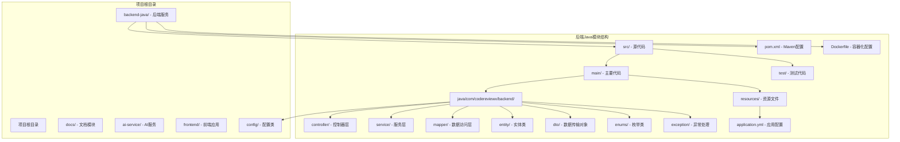
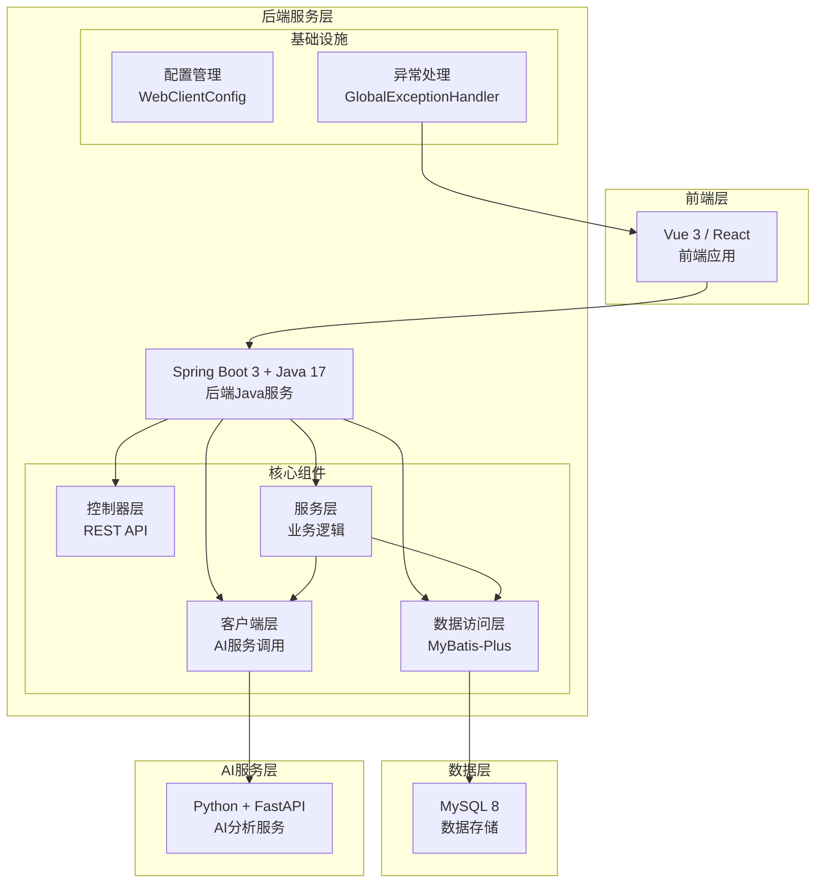
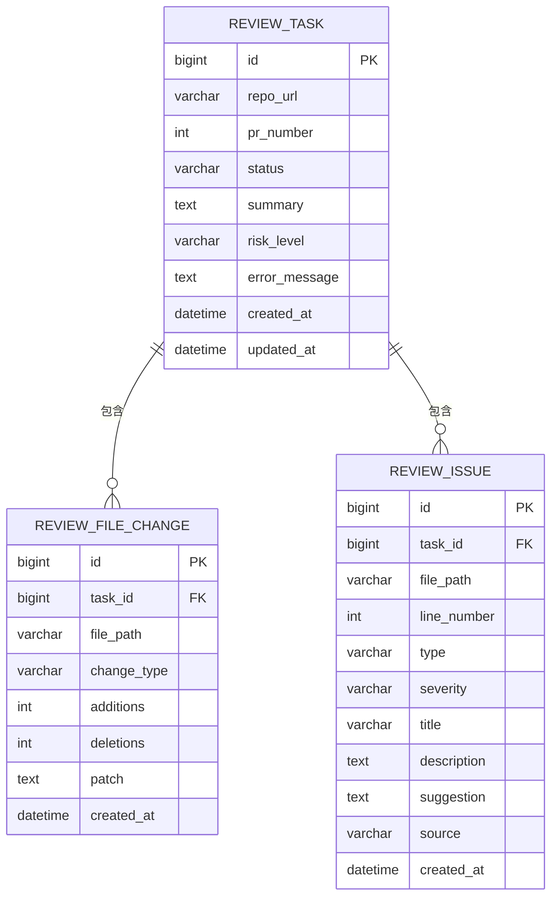
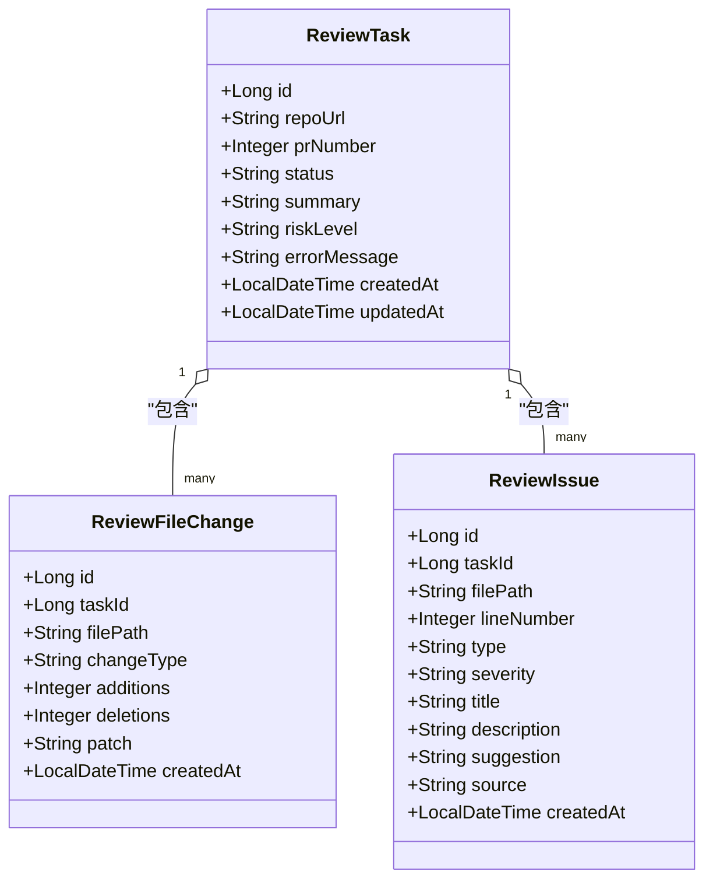
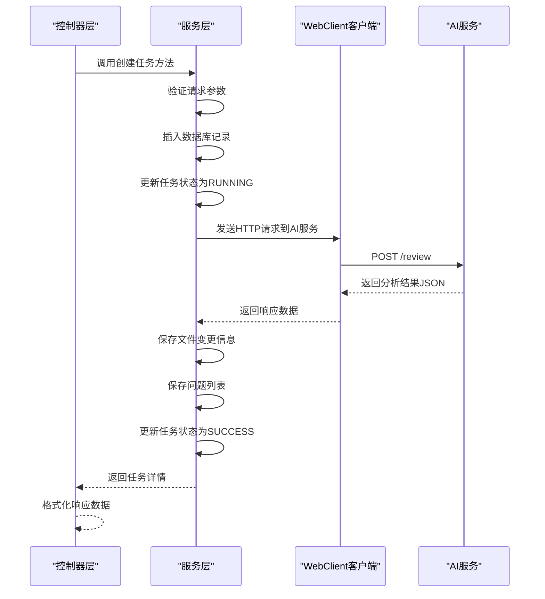
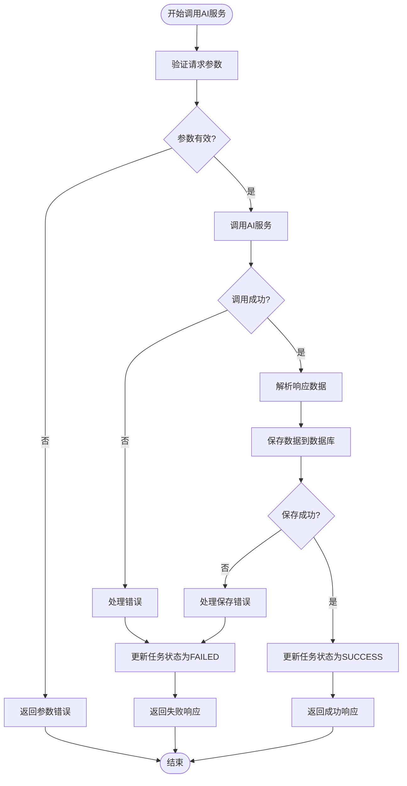
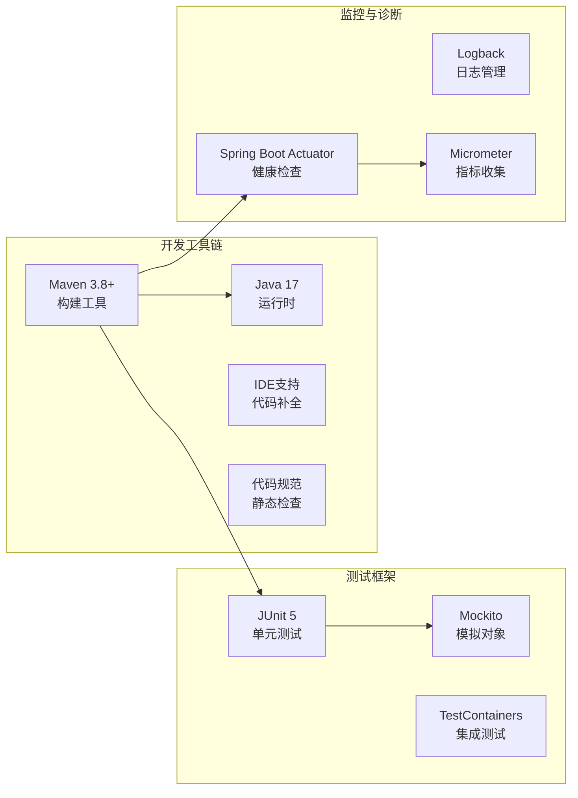
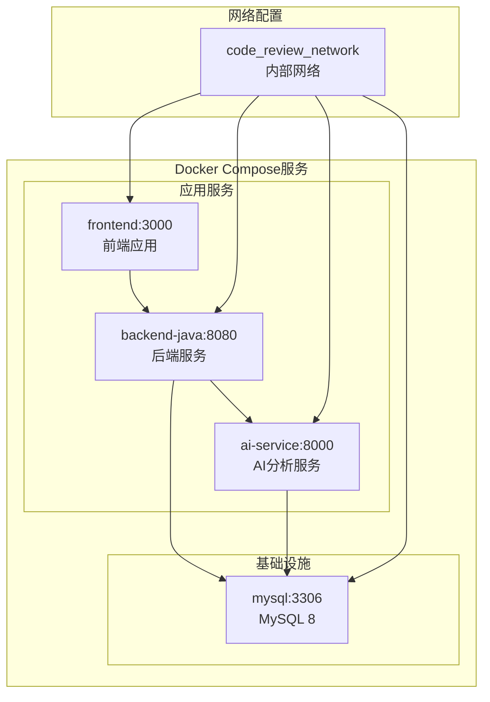

# 技术栈介绍

<cite>
**本文档引用的文件**
- [README.md](file://README.md)
- [backend-java/README.md](file://backend-java/README.md)
- [docs/ARCHITECTURE.md](file://docs/ARCHITECTURE.md)
- [docs/DATABASE.md](file://docs/DATABASE.md)
- [docker-compose.yml](file://docker-compose.yml)
- [.github/workflows/ci.yml](file://.github/workflows/ci.yml)
</cite>

## 目录
1. [简介](#简介)
2. [项目结构](#项目结构)
3. [核心组件](#核心组件)
4. [架构概览](#架构概览)
5. [详细组件分析](#详细组件分析)
6. [依赖关系分析](#依赖关系分析)
7. [性能考虑](#性能考虑)
8. [故障排除指南](#故障排除指南)
9. [结论](#结论)

## 简介

CodeReviewX是一个智能的GitHub Pull Request代码审查系统，采用多模块架构设计。本项目专注于后端Java服务模块的技术栈选择和集成，该模块将作为整个系统的中枢，负责任务编排、数据持久化和外部服务调用。

根据项目规划，后端Java模块将在Round 02开始实现，采用Spring Boot 3 + Java 17作为核心技术栈，配合MyBatis-Plus进行ORM操作，使用MySQL 8进行数据持久化，并通过Docker容器化部署。

## 项目结构

项目采用模块化组织方式，后端Java服务位于独立的`backend-java`目录中，遵循标准的Maven项目结构：

**图表来源**
- [backend-java/README.md:50-71](file://backend-java/README.md#L50-L71)

**章节来源**
- [README.md:58-82](file://README.md#L58-L82)
- [backend-java/README.md:50-71](file://backend-java/README.md#L50-L71)

## 核心组件

### 技术栈概述

后端Java服务采用以下核心技术栈组合：

| 技术组件 | 版本要求 | 选择原因 | 主要功能 |
|---------|---------|---------|---------|
| **Java** | 17 | LTS版本，性能稳定，支持最新语言特性 | 运行时环境，类型安全 |
| **Spring Boot** | 3.x | 现代化框架，自动配置，微服务友好 | Web框架，依赖注入，配置管理 |
| **MyBatis-Plus** | 3.5.x | 简化ORM操作，增强功能丰富 | 数据持久化，SQL映射 |
| **MySQL Connector** | 8.x | 官方驱动，性能优化 | 数据库连接，JDBC操作 |
| **Spring WebClient** | 内置 | 响应式HTTP客户端 | 调用AI服务，异步通信 |
| **JUnit 5** | 最新版本 | 测试框架，现代化API | 单元测试，集成测试 |
| **Maven** | 3.8+ | 构建工具，依赖管理 | 项目构建，依赖管理 |

### 技术选型背景

选择这些技术的原因基于以下考量：

1. **稳定性与支持周期**：Java 17提供长期支持，确保系统稳定性
2. **现代化特性**：Spring Boot 3.x支持最新的Java特性，提高开发效率
3. **开发体验**：MyBatis-Plus简化了ORM操作，减少样板代码
4. **性能考虑**：MySQL 8提供更好的性能和安全性
5. **生态完善**：各组件都有活跃的社区支持和丰富的文档

**章节来源**
- [backend-java/README.md:28-39](file://backend-java/README.md#L28-L39)
- [docs/ARCHITECTURE.md:7-16](file://docs/ARCHITECTURE.md#L7-L16)

## 架构概览

后端Java服务在整个系统架构中扮演着核心编排者的角色：

**图表来源**
- [docs/ARCHITECTURE.md:19-52](file://docs/ARCHITECTURE.md#L19-L52)
- [docs/ARCHITECTURE.md:183-230](file://docs/ARCHITECTURE.md#L183-L230)

### 核心职责边界

根据架构设计，后端Java服务的职责边界非常清晰：

**应该做的：**
- ReviewTask生命周期管理
- 提供REST API接口
- 数据持久化操作
- 调用AI服务进行分析

**不应该做的：**
- 执行Semgrep静态分析
- 编写LLM提示词
- 解析复杂的diff内容
- 直接调用LLM或GitHub API
- 暴露业务API给公网

**章节来源**
- [docs/ARCHITECTURE.md:73-107](file://docs/ARCHITECTURE.md#L73-L107)

## 详细组件分析

### 数据库设计与集成

#### 表结构设计

系统采用三张核心表来存储代码审查相关的数据：

**图表来源**
- [docs/DATABASE.md:22-134](file://docs/DATABASE.md#L22-L134)

#### 数据库配置

数据库采用MySQL 8，配置了UTF-8字符集和Unicode排序规则，确保国际化支持：

- **数据库名**：`codereviewx`
- **字符集**：`utf8mb4`
- **排序规则**：`utf8mb4_unicode_ci`
- **存储引擎**：InnoDB
- **索引设计**：为常用查询字段建立索引

**章节来源**
- [docs/DATABASE.md:9-17](file://docs/DATABASE.md#L9-L17)
- [docs/DATABASE.md:22-134](file://docs/DATABASE.md#L22-L134)

### MyBatis-Plus集成

#### 实体类映射规则

MyBatis-Plus采用严格的命名映射规则，确保Java代码与数据库表结构的一致性：

**图表来源**
- [docs/DATABASE.md:266-284](file://docs/DATABASE.md#L266-L284)

#### 枚举类型设计

系统使用枚举类来确保数据一致性：

| 枚举类型 | 可能值 | 用途 |
|---------|--------|------|
| TaskStatus | PENDING, RUNNING, SUCCESS, FAILED | 任务状态管理 |
| RiskLevel | LOW, MEDIUM, HIGH | 风险等级评估 |
| IssueType | BUG, SECURITY, PERFORMANCE, TEST, STYLE | 问题类型分类 |
| IssueSeverity | LOW, MEDIUM, HIGH | 问题严重程度 |
| ChangeType | added, modified, deleted | 文件变更类型 |
| IssueSource | LLM, SEMGREP | 问题来源标识 |

**章节来源**
- [docs/DATABASE.md:203-254](file://docs/DATABASE.md#L203-L254)

### Spring WebClient集成

#### HTTP客户端配置

后端服务使用Spring WebClient作为HTTP客户端，专门用于调用AI服务：

**图表来源**
- [docs/ARCHITECTURE.md:139-168](file://docs/ARCHITECTURE.md#L139-L168)

#### 错误处理机制

系统实现了完善的错误处理机制，确保服务的健壮性：

**图表来源**
- [docs/ARCHITECTURE.md:170-180](file://docs/ARCHITECTURE.md#L170-L180)

**章节来源**
- [docs/ARCHITECTURE.md:137-180](file://docs/ARCHITECTURE.md#L137-L180)

## 依赖关系分析

### 开发工具链

项目采用现代化的开发工具链，确保开发效率和代码质量：

### 容器化部署

Docker Compose提供了完整的部署解决方案：

**图表来源**
- [docker-compose.yml:7-13](file://docker-compose.yml#L7-L13)
- [docs/ARCHITECTURE.md:373-381](file://docs/ARCHITECTURE.md#L373-L381)

**章节来源**
- [docker-compose.yml:1-14](file://docker-compose.yml#L1-L14)
- [docs/ARCHITECTURE.md:373-381](file://docs/ARCHITECTURE.md#L373-L381)

## 性能考虑

### 数据库性能优化

1. **索引策略**：为常用查询字段建立索引，包括状态字段和创建时间字段
2. **连接池配置**：合理配置数据库连接池大小，避免连接泄漏
3. **查询优化**：使用MyBatis-Plus的分页插件，避免一次性加载大量数据
4. **缓存策略**：对于频繁读取但不经常变化的数据，考虑使用Redis缓存

### 应用性能优化

1. **异步处理**：对于耗时的AI服务调用，使用异步处理避免阻塞主线程
2. **资源管理**：合理管理WebClient实例，避免资源泄露
3. **内存优化**：注意大文件diff的处理，避免内存溢出
4. **并发控制**：使用信号量控制同时进行的任务数量

### 监控与诊断

1. **健康检查**：通过Spring Boot Actuator提供健康检查端点
2. **性能指标**：使用Micrometer收集应用性能指标
3. **日志管理**：使用结构化日志，便于问题排查
4. **告警机制**：设置合理的告警阈值，及时发现性能问题

## 故障排除指南

### 常见问题及解决方案

#### 数据库连接问题

**症状**：应用启动时报数据库连接失败
**解决方案**：
1. 检查数据库服务是否正常运行
2. 验证连接字符串配置正确
3. 确认数据库用户权限设置
4. 检查防火墙设置

#### AI服务调用失败

**症状**：调用AI服务超时或返回错误
**解决方案**：
1. 检查AI服务是否正常运行
2. 验证网络连接和端口开放
3. 查看AI服务的日志输出
4. 调整超时时间和重试策略

#### 数据持久化异常

**症状**：保存数据时报错
**解决方案**：
1. 检查数据库表结构是否正确
2. 验证实体类映射配置
3. 查看具体的SQL错误信息
4. 确认数据库事务配置

### 调试技巧

1. **启用详细日志**：在开发环境中启用DEBUG级别日志
2. **使用Postman**：手动测试API接口
3. **数据库监控**：使用数据库管理工具监控查询性能
4. **性能分析**：使用JProfiler等工具分析应用性能

**章节来源**
- [docs/ARCHITECTURE.md:312-342](file://docs/ARCHITECTURE.md#L312-L342)

## 结论

CodeReviewX后端Java服务的技术栈选择体现了现代软件开发的最佳实践：

1. **技术成熟度**：所有技术组件都是经过市场验证的成熟技术
2. **开发效率**：Spring Boot的自动配置和MyBatis-Plus的简化操作显著提高了开发效率
3. **可维护性**：清晰的分层架构和严格的职责边界确保了代码的可维护性
4. **扩展性**：模块化的架构设计为未来的功能扩展奠定了基础
5. **可靠性**：完善的错误处理机制和监控体系确保了系统的稳定性

这套技术栈组合为CodeReviewX项目提供了一个坚实的技术基础，能够支持从MVP到生产环境的各种需求。随着项目的推进，这套技术栈将继续发挥重要作用，支撑整个代码审查系统的稳定运行。