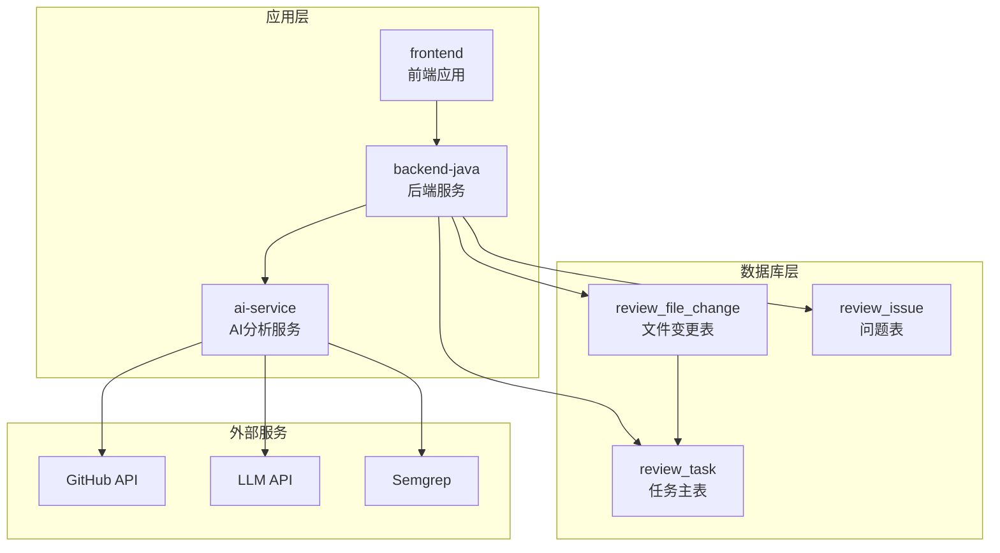
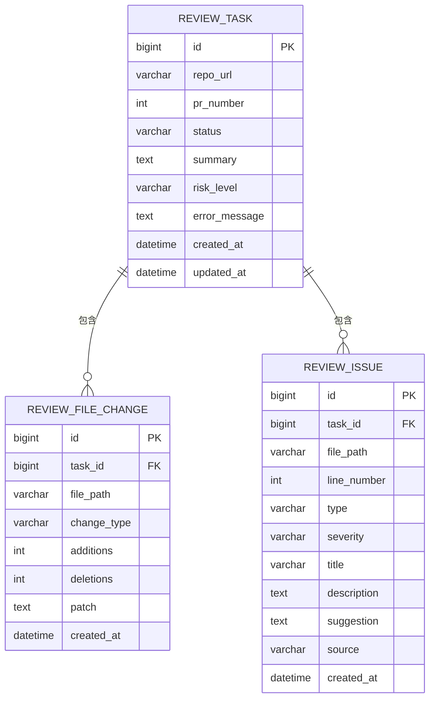
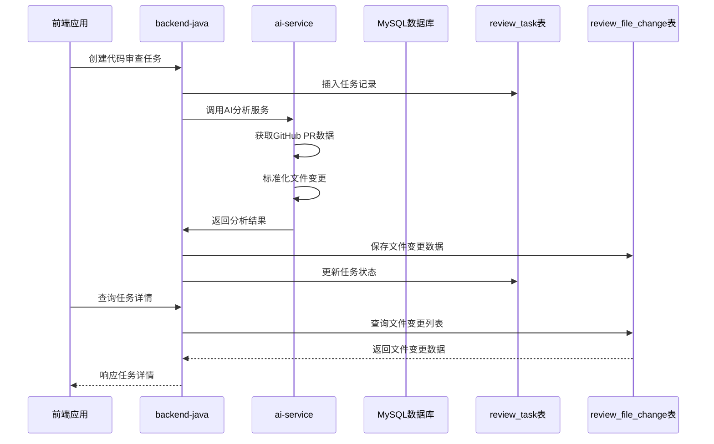
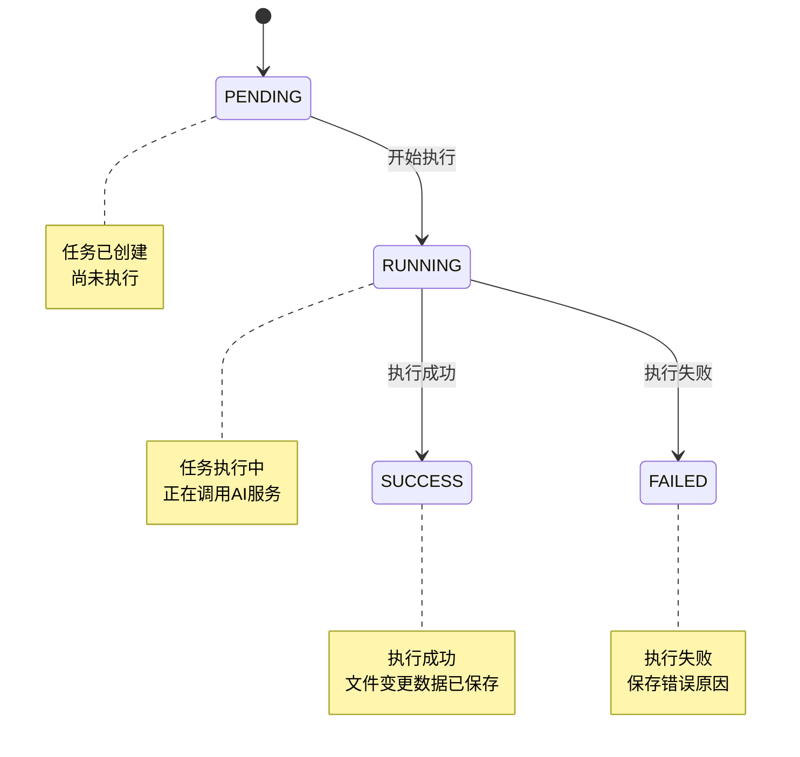
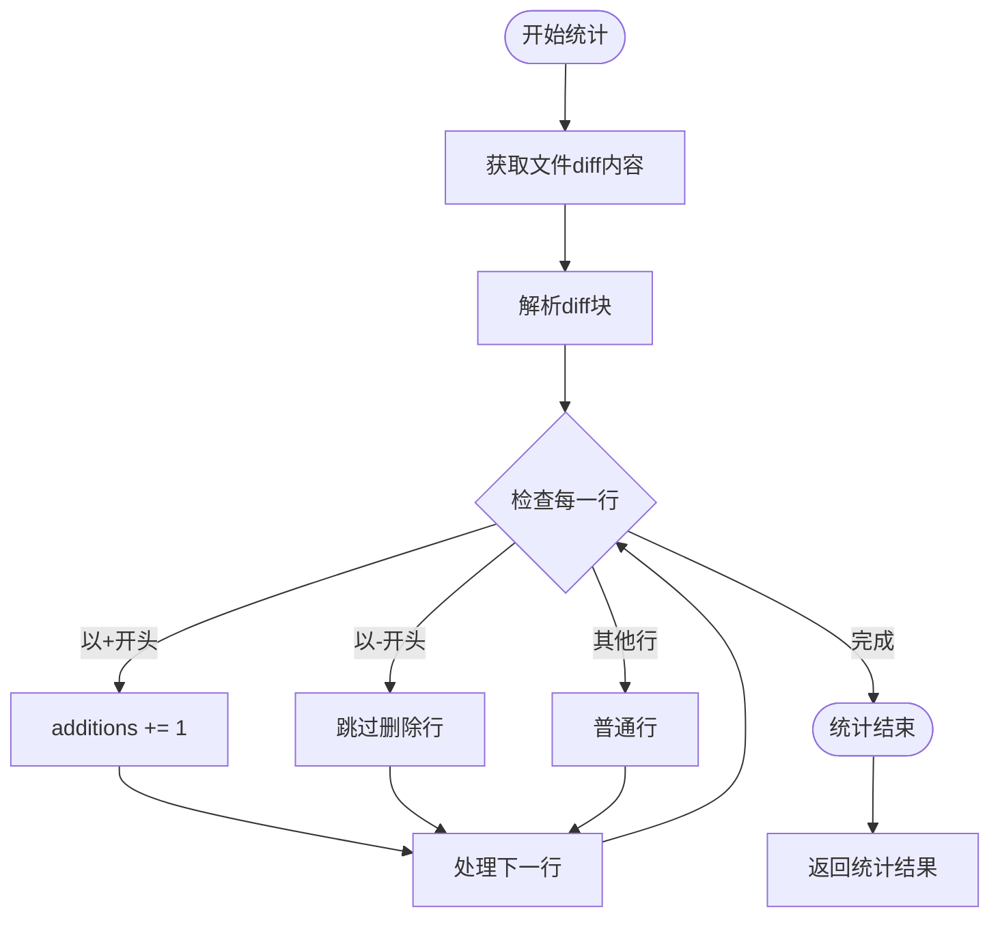
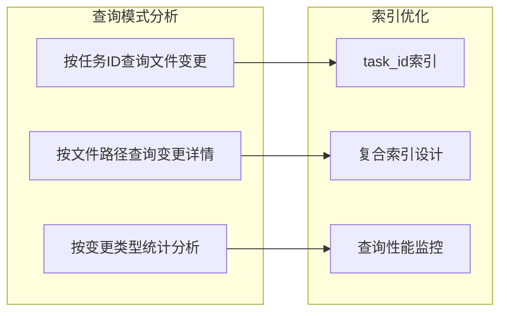
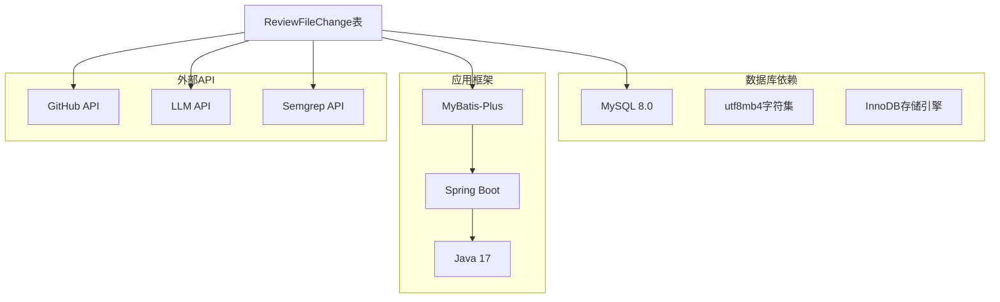

# ReviewFileChange文件变更表

<cite>
**本文档引用的文件**
- [DATABASE.md](file://docs/DATABASE.md)
- [ARCHITECTURE.md](file://docs/ARCHITECTURE.md)
- [docker-compose.yml](file://docker-compose.yml)
</cite>

## 目录
1. [简介](#简介)
2. [项目结构](#项目结构)
3. [核心组件](#核心组件)
4. [架构概览](#架构概览)
5. [详细组件分析](#详细组件分析)
6. [依赖分析](#依赖分析)
7. [性能考虑](#性能考虑)
8. [故障排除指南](#故障排除指南)
9. [结论](#结论)

## 简介

ReviewFileChange是CodeReviewX系统中用于存储Pull Request文件变更信息的核心数据表。该表采用MySQL 8数据库，使用utf8mb4字符集和InnoDB引擎，专门设计用于记录和追踪代码审查过程中涉及的文件变更详情。

该表在系统架构中扮演着承上启下的关键角色，既承接来自ai-service的标准化文件变更数据，又为前端展示和后续的问题分析提供基础数据支持。通过与ReviewTask表建立一对一的关系映射，确保了文件变更数据的完整性和可追溯性。

## 项目结构

基于当前代码库的文档信息，ReviewFileChange表位于数据库设计文档中，与ReviewTask表共同构成代码审查数据模型的核心部分：

**图表来源**
- [ARCHITECTURE.md:19-52](file://docs/ARCHITECTURE.md#L19-L52)
- [DATABASE.md:22-41](file://docs/DATABASE.md#L22-L41)

**章节来源**
- [ARCHITECTURE.md:1-52](file://docs/ARCHITECTURE.md#L1-L52)
- [DATABASE.md:1-17](file://docs/DATABASE.md#L1-L17)

## 核心组件

### 数据表结构定义

ReviewFileChange表采用标准的数据库设计规范，包含以下核心字段：

| 字段名称 | 数据类型 | 约束条件 | 描述 |
|---------|---------|---------|------|
| id | BIGINT | 主键, 自增 | 文件变更记录唯一标识符 |
| task_id | BIGINT | 外键, 非空 | 关联到ReviewTask表的主键 |
| file_path | VARCHAR(500) | 非空 | 文件的完整路径信息 |
| change_type | VARCHAR(20) | 非空 | 文件变更类型标识 |
| additions | INT | 非空, 默认0 | 新增代码行数统计 |
| deletions | INT | 非空, 默认0 | 删除代码行数统计 |
| patch | TEXT | 可空 | 完整的diff片段内容 |
| created_at | DATETIME | 非空, 默认当前时间 | 记录创建时间戳 |

### 外键关系设计

表间关系采用严格的外键约束机制，确保数据一致性和完整性：

**图表来源**
- [DATABASE.md:27-40](file://docs/DATABASE.md#L27-L40)
- [DATABASE.md:64-76](file://docs/DATABASE.md#L64-L76)
- [DATABASE.md:99-116](file://docs/DATABASE.md#L99-L116)

**章节来源**
- [DATABASE.md:59-91](file://docs/DATABASE.md#L59-L91)

## 架构概览

### 数据流向设计

ReviewFileChange表在整个系统架构中处于数据持久化的关键位置，其数据流向遵循以下模式：

**图表来源**
- [ARCHITECTURE.md:139-168](file://docs/ARCHITECTURE.md#L139-L168)
- [DATABASE.md:165-178](file://docs/DATABASE.md#L165-L178)

### 状态管理模式

ReviewTask表的状态流转直接影响ReviewFileChange表的数据写入时机：

**图表来源**
- [ARCHITECTURE.md:110-134](file://docs/ARCHITECTURE.md#L110-L134)

**章节来源**
- [ARCHITECTURE.md:110-134](file://docs/ARCHITECTURE.md#L110-L134)

## 详细组件分析

### 文件变更类型分类标准

ReviewFileChange表支持三种标准的文件变更类型，每种类型都有明确的业务含义和应用场景：

#### 1. added（新增文件）
- **定义**：在本次PR中首次添加的新文件
- **应用场景**：新功能模块引入、新工具配置文件添加
- **统计特征**：deletions字段通常为0，additions可能较大
- **业务意义**：代表代码库的扩展和新能力的引入

#### 2. modified（修改文件）
- **定义**：在本次PR中进行了内容修改的现有文件
- **应用场景**：bug修复、功能增强、代码重构
- **统计特征**：additions和deletions都可能大于0
- **业务意义**：代表代码库的演进和质量改进

#### 3. deleted（删除文件）
- **定义**：在本次PR中被移除的文件
- **应用场景**：废弃功能清理、文件合并、依赖移除
- **统计特征**：additions字段通常为0，deletions可能较大
- **业务意义**：代表代码库的精简和优化

**章节来源**
- [DATABASE.md:240-247](file://docs/DATABASE.md#L240-L247)

### 统计字段逻辑分析

#### additions字段统计逻辑

additions字段用于精确记录文件中新增的代码行数，其统计逻辑遵循以下原则：

**图表来源**
- [DATABASE.md:69-69](file://docs/DATABASE.md#L69-L69)

#### deletions字段统计逻辑

deletions字段与additions字段采用相同的统计方法，但针对删除的代码行：

- **统计范围**：仅统计以减号(-)开头的行
- **计算方式**：每遇到一个删除行，deletions计数器加1
- **业务价值**：帮助评估代码重构的规模和影响范围

#### patch字段作用机制

patch字段存储完整的diff片段，具有以下重要作用：

- **数据完整性**：保留原始diff信息，便于审计和追溯
- **可视化支持**：为前端展示代码差异提供基础数据
- **分析能力**：支持后续的深度分析和模式识别
- **存储策略**：MVP阶段使用TEXT类型，最大支持65535字节

**章节来源**
- [DATABASE.md:89-89](file://docs/DATABASE.md#L89-L89)
- [DATABASE.md:288-290](file://docs/DATABASE.md#L288-L290)

### 索引设计原理

ReviewFileChange表采用了合理的索引策略来优化查询性能：

#### 主键索引
- **字段**：id（自增主键）
- **作用**：确保记录唯一性，支持快速定位
- **性能特点**：B+树结构，查询效率高

#### 外键索引
- **字段**：task_id（关联review_task.id）
- **作用**：加速父子表关联查询
- **设计考虑**：外键字段建立索引，提升JOIN性能

#### 索引选择策略

**图表来源**
- [DATABASE.md:74-74](file://docs/DATABASE.md#L74-L74)

**章节来源**
- [DATABASE.md:74-76](file://docs/DATABASE.md#L74-L76)

## 依赖分析

### 外部依赖关系

ReviewFileChange表的实现依赖于多个外部组件和服务：

**图表来源**
- [ARCHITECTURE.md:38-46](file://docs/ARCHITECTURE.md#L38-L46)
- [DATABASE.md:1-5](file://docs/DATABASE.md#L1-L5)

### 内部耦合关系

表间关系体现了清晰的层次结构和职责分离：

#### 1. 与ReviewTask的关联
- **关系类型**：一对多（1:N）
- **实现方式**：外键约束引用
- **业务意义**：一个任务可以包含多个文件的变更

#### 2. 与ReviewIssue的独立性
- **关系类型**：各自独立的文件级实体
- **设计优势**：降低表间复杂度，提高查询灵活性

**章节来源**
- [DATABASE.md:75-75](file://docs/DATABASE.md#L75-L75)

## 性能考虑

### 存储容量规划

基于MVP阶段的设计考虑，需要合理规划存储容量：

#### patch字段容量限制
- **当前限制**：TEXT类型最大65535字节
- **潜在风险**：大型PR可能导致diff内容截断
- **解决方案**：考虑升级为MEDIUMTEXT类型

#### 数据增长预测
- **增长率**：根据项目规模和PR频率估算
- **备份策略**：定期备份重要数据
- **归档机制**：历史数据的归档和清理策略

### 查询性能优化

#### 索引使用建议
- **高频查询**：按task_id查询文件变更列表
- **复合查询**：结合change_type进行过滤统计
- **排序优化**：按created_at时间戳排序展示

#### 缓存策略
- **热点数据**：近期活跃任务的文件变更
- **预加载机制**：任务详情页的批量数据加载
- **失效策略**：基于时间或事件的缓存更新

## 故障排除指南

### 常见问题诊断

#### 1. 外键约束冲突
**症状**：插入数据时报外键约束错误
**原因分析**：
- 父表记录不存在
- 数据类型不匹配
- 约束检查未启用

**解决步骤**：
1. 验证父表是否存在对应记录
2. 检查task_id字段的数据类型
3. 确认外键约束状态

#### 2. 存储空间不足
**症状**：patch字段数据丢失或截断
**原因分析**：
- TEXT类型容量限制
- 数据库存储空间不足
- 字符集编码占用

**解决步骤**：
1. 检查数据库可用空间
2. 考虑升级为MEDIUMTEXT
3. 实施数据压缩策略

#### 3. 查询性能问题
**症状**：文件变更列表加载缓慢
**原因分析**：
- 缺少必要的索引
- 查询条件不当
- 数据量过大

**解决步骤**：
1. 添加task_id索引
2. 优化查询条件
3. 实施分页查询

**章节来源**
- [DATABASE.md:288-294](file://docs/DATABASE.md#L288-L294)

### 数据一致性保障

#### 事务处理策略
- **原子性**：文件变更数据的插入采用事务
- **一致性**：确保数据在任何时刻都保持一致状态
- **隔离性**：不同任务间的并发操作互不影响
- **持久性**：数据变更永久保存到磁盘

#### 错误恢复机制
- **自动重试**：网络异常时的智能重试
- **降级策略**：服务不可用时的功能降级
- **数据校验**：入库前的数据完整性检查

## 结论

ReviewFileChange表作为CodeReviewX系统的核心数据组件，通过精心设计的字段结构、严格的外键约束和合理的索引策略，为代码审查功能提供了坚实的数据基础。其与ReviewTask表的一对多关系映射，确保了文件变更数据的完整性和可追溯性。

在系统架构层面，该表遵循了清晰的职责分离原则，既满足了MVP阶段的功能需求，又为未来的功能扩展预留了足够的空间。通过合理的性能优化和故障排除机制，能够有效支撑代码审查业务的稳定运行。

随着系统的不断发展，建议持续关注数据增长趋势，适时调整存储策略，并根据实际使用情况优化查询性能，确保系统能够长期稳定地服务于代码质量管理需求。