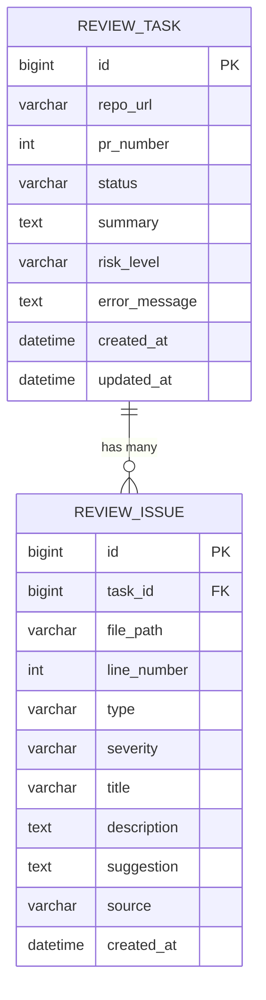
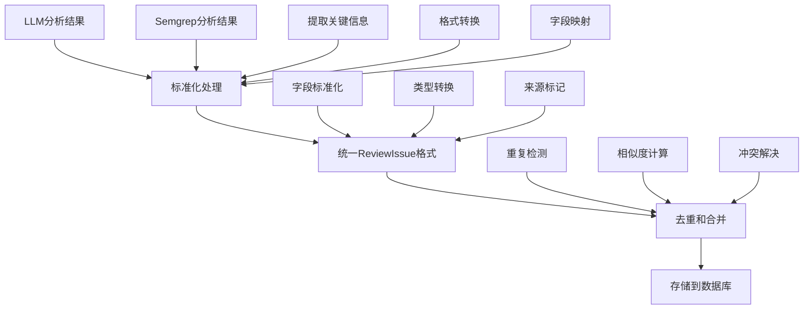
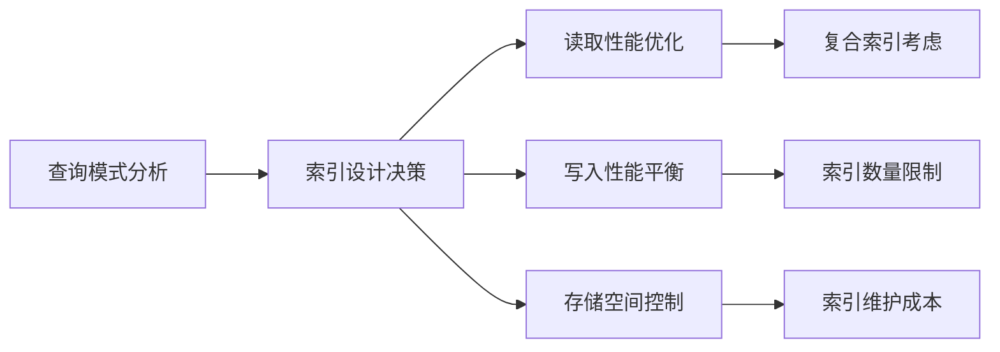
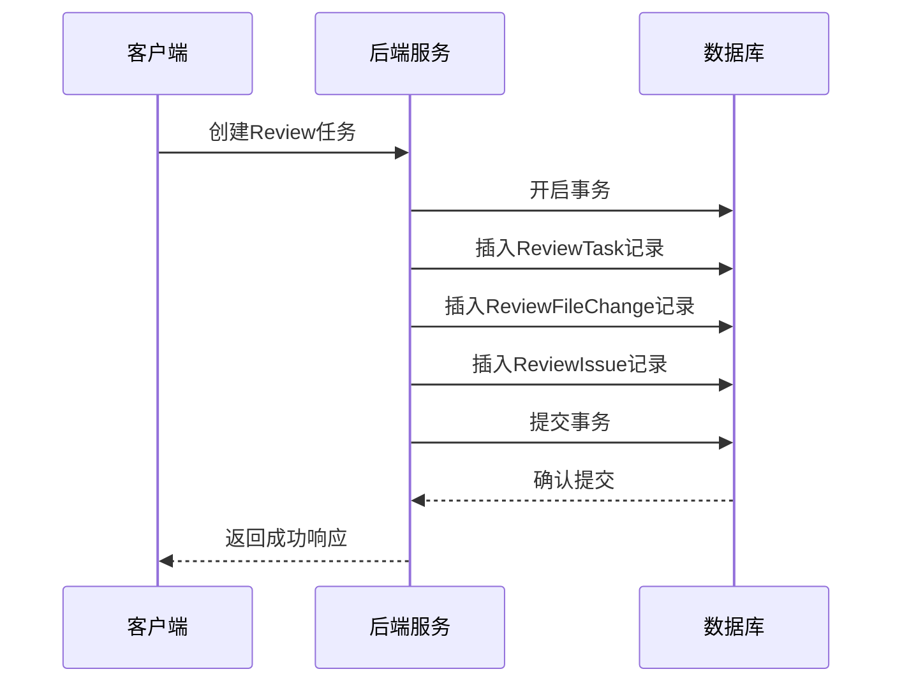
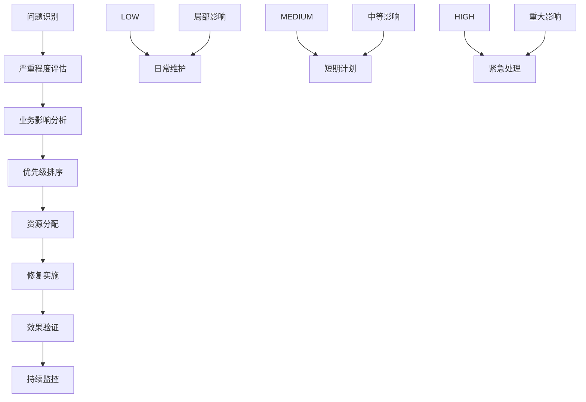

# ReviewIssue问题表

<cite>
**本文档引用的文件**
- [DATABASE.md](file://docs/DATABASE.md)
- [PRD.md](file://docs/PRD.md)
- [ARCHITECTURE.md](file://docs/ARCHITECTURE.md)
- [API.md](file://docs/API.md)
</cite>

## 目录
1. [简介](#简介)
2. [表结构概述](#表结构概述)
3. [字段定义详解](#字段定义详解)
4. [问题分类体系](#问题分类体系)
5. [严重程度评估机制](#严重程度评估机制)
6. [问题来源与数据整合](#问题来源与数据整合)
7. [SQL建表语句](#sql建表语句)
8. [索引设计原理](#索引设计原理)
9. [查询优化建议](#查询优化建议)
10. [与ReviewTask表的关联关系](#与reviewtask表的关联关系)
11. [数据一致性保证机制](#数据一致性保证机制)
12. [业务影响分析](#业务影响分析)
13. [总结](#总结)

## 简介

ReviewIssue问题是CodeReviewX系统的核心数据实体之一，用于存储LLM和Semgrep静态分析工具检测到的所有代码问题。该表承载着系统智能化代码审查的关键信息，为开发者提供结构化的缺陷报告和修复建议。

## 表结构概述

ReviewIssue表采用MySQL 8数据库，使用utf8mb4字符集和InnoDB存储引擎，专门设计用于存储代码审查过程中发现的各种问题类型。



**图表来源**
- [DATABASE.md:94-134](file://docs/DATABASE.md#L94-L134)
- [DATABASE.md:22-41](file://docs/DATABASE.md#L22-L41)

**章节来源**
- [DATABASE.md:94-134](file://docs/DATABASE.md#L94-L134)

## 字段定义详解

### 核心字段

| 字段名 | 类型 | 必填 | 默认值 | 描述 |
|--------|------|------|--------|------|
| `id` | BIGINT | 是 | 自增 | 主键标识符 |
| `task_id` | BIGINT | 是 | 无 | 关联的ReviewTask任务ID |
| `file_path` | VARCHAR(500) | 是 | 无 | 问题所在文件的完整路径 |
| `line_number` | INT | 否 | NULL | 问题在文件中的具体行号 |
| `title` | VARCHAR(255) | 是 | 无 | 问题的简要标题 |

### 问题描述字段

| 字段名 | 类型 | 必填 | 默认值 | 描述 |
|--------|------|------|--------|------|
| `description` | TEXT | 是 | 无 | 详细的问题描述信息 |
| `suggestion` | TEXT | 否 | NULL | 针对问题的具体修复建议 |

### 分类与来源字段

| 字段名 | 类型 | 必填 | 默认值 | 描述 |
|--------|------|------|--------|------|
| `type` | VARCHAR(20) | 是 | 无 | 问题类型分类（BUG/SECURITY/PERFORMANCE/TEST/STYLE） |
| `severity` | VARCHAR(10) | 是 | 无 | 严重程度评估（LOW/MEDIUM/HIGH） |
| `source` | VARCHAR(20) | 是 | 无 | 问题来源（LLM/SEMGREP） |

### 时间戳字段

| 字段名 | 类型 | 必填 | 默认值 | 描述 |
|--------|------|------|--------|------|
| `created_at` | DATETIME | 是 | CURRENT_TIMESTAMP | 记录创建时间 |

**章节来源**
- [DATABASE.md:119-134](file://docs/DATABASE.md#L119-L134)

## 问题分类体系

### 五种核心问题类型

系统采用标准化的问题分类体系，每种类型都有明确的定义标准和判断依据：

#### 1. BUG（潜在Bug）
- **定义**：潜在的逻辑错误或运行时异常
- **典型特征**：可能导致程序崩溃、数据不一致或功能异常
- **判断依据**：代码逻辑缺陷、边界条件处理不当、资源管理问题

#### 2. SECURITY（安全风险）
- **定义**：安全漏洞和风险暴露
- **典型特征**：注入攻击风险、敏感信息泄露、认证授权问题
- **判断依据**：硬编码凭据、SQL注入点、跨站脚本(XSS)、不安全的API调用

#### 3. PERFORMANCE（性能问题）
- **定义**：影响系统性能和资源使用的代码问题
- **典型特征**：N+1查询、内存泄漏、CPU密集型操作
- **判断依据**：数据库查询效率、内存使用模式、算法复杂度

#### 4. TEST（测试缺失）
- **定义**：缺乏必要的测试覆盖或测试质量不足
- **典型特征**：单元测试缺失、边界条件未覆盖、集成测试不足
- **判断依据**：测试覆盖率统计、测试用例完整性

#### 5. STYLE（代码风格）
- **定义**：代码可读性和风格问题
- **典型特征**：命名不规范、代码结构混乱、注释缺失
- **判断依据**：编码规范违反、可读性问题、维护性考虑

**章节来源**
- [PRD.md:104-122](file://docs/PRD.md#L104-L122)
- [DATABASE.md:222-231](file://docs/DATABASE.md#L222-L231)

## 严重程度评估机制

### 三级严重程度标准

系统采用三层严重程度评估体系，为问题优先级排序和风险管控提供量化标准：

#### LOW（低严重程度）
- **影响范围**：局部、临时性问题
- **业务影响**：轻微影响，可快速修复
- **风险评估**：低风险，不会导致系统故障
- **处理优先级**：日常维护任务

#### MEDIUM（中严重程度）
- **影响范围**：中等范围的功能问题
- **业务影响**：可能影响用户体验或数据完整性
- **风险评估**：中等风险，需要及时关注
- **处理优先级**：短期修复计划

#### HIGH（高严重程度）
- **影响范围**：关键功能或系统性问题
- **业务影响**：严重影响系统稳定性或安全性
- **风险评估**：高风险，需要立即处理
- **处理优先级**：最高优先级紧急修复

**章节来源**
- [DATABASE.md:232-239](file://docs/DATABASE.md#L232-L239)

## 问题来源与数据整合

### 两种分析引擎

系统支持两种不同的问题检测方式，每种来源都有其独特的优势和适用场景：

#### LLM（大语言模型）来源
- **技术特点**：基于自然语言理解和上下文分析
- **优势**：能够理解代码意图、提供语义层面的建议
- **局限性**：可能缺乏精确的语法和语义细节
- **适用场景**：代码结构、设计模式、业务逻辑分析

#### SEMGREP（静态分析）来源
- **技术特点**：基于预定义规则和模式匹配
- **优势**：精确的语法分析、可靠的漏洞检测
- **局限性**：依赖规则库的完备性
- **适用场景**：安全漏洞、性能问题、编码规范检查

### 数据整合策略

系统采用统一的数据模型整合来自不同来源的问题：



**图表来源**
- [ARCHITECTURE.md:96-100](file://docs/ARCHITECTURE.md#L96-L100)

**章节来源**
- [PRD.md:116-122](file://docs/PRD.md#L116-L122)
- [ARCHITECTURE.md:90-107](file://docs/ARCHITECTURE.md#L90-L107)

## SQL建表语句

### 完整建表语句

```sql
CREATE TABLE review_issue (
    id BIGINT NOT NULL AUTO_INCREMENT COMMENT 'issue ID',
    task_id BIGINT NOT NULL COMMENT '关联任务 ID',
    file_path VARCHAR(500) NOT NULL COMMENT '问题所在文件路径',
    line_number INT COMMENT '问题行号',
    type VARCHAR(20) NOT NULL COMMENT '问题类型: BUG/SECURITY/PERFORMANCE/TEST/STYLE',
    severity VARCHAR(10) NOT NULL COMMENT '严重程度: LOW/MEDIUM/HIGH',
    title VARCHAR(255) NOT NULL COMMENT '问题标题',
    description TEXT NOT NULL COMMENT '问题描述',
    suggestion TEXT COMMENT '修复建议',
    source VARCHAR(20) NOT NULL COMMENT '来源: LLM/SEMGREP',
    created_at DATETIME NOT NULL DEFAULT CURRENT_TIMESTAMP COMMENT '创建时间',
    PRIMARY KEY (id),
    INDEX idx_task_id (task_id),
    INDEX idx_severity (severity),
    INDEX idx_type (type),
    CONSTRAINT fk_issue_task FOREIGN KEY (task_id) REFERENCES review_task(id)
) ENGINE=InnoDB DEFAULT CHARSET=utf8mb4 COMMENT='Review 问题表';
```

### 数据库初始化脚本

```sql
-- 创建数据库
CREATE DATABASE IF NOT EXISTS codereviewx
    CHARACTER SET utf8mb4
    COLLATE utf8mb4_unicode_ci;

USE codereviewx;

-- review_issue表
CREATE TABLE IF NOT EXISTS review_issue (
    id BIGINT NOT NULL AUTO_INCREMENT,
    task_id BIGINT NOT NULL,
    file_path VARCHAR(500) NOT NULL,
    line_number INT,
    type VARCHAR(20) NOT NULL,
    severity VARCHAR(10) NOT NULL,
    title VARCHAR(255) NOT NULL,
    description TEXT NOT NULL,
    suggestion TEXT,
    source VARCHAR(20) NOT NULL,
    created_at DATETIME NOT NULL DEFAULT CURRENT_TIMESTAMP,
    PRIMARY KEY (id),
    INDEX idx_task_id (task_id),
    INDEX idx_severity (severity),
    INDEX idx_type (type),
    CONSTRAINT fk_issue_task FOREIGN KEY (task_id) REFERENCES review_task(id)
) ENGINE=InnoDB DEFAULT CHARSET=utf8mb4;
```

**章节来源**
- [DATABASE.md:98-117](file://docs/DATABASE.md#L98-L117)
- [DATABASE.md:180-199](file://docs/DATABASE.md#L180-L199)

## 索引设计原理

### 核心索引策略

系统采用多维度索引设计，平衡查询性能和写入开销：

#### 主键索引
- **作用**：确保每条问题记录的唯一性
- **类型**：聚簇索引（InnoDB主键自动创建）
- **性能影响**：读取和更新操作高效

#### 外键索引
- **idx_task_id**：加速按任务查询问题列表
- **设计理由**：ReviewIssue与ReviewTask的一对多关系频繁查询

#### 业务查询索引
- **idx_severity**：支持按严重程度过滤
- **idx_type**：支持按问题类型过滤

### 索引选择原则



**图表来源**
- [DATABASE.md:112-116](file://docs/DATABASE.md#L112-L116)

**章节来源**
- [DATABASE.md:112-116](file://docs/DATABASE.md#L112-L116)

## 查询优化建议

### 常见查询场景优化

#### 1. 按任务查询问题列表
```sql
-- 优化的查询
SELECT * FROM review_issue 
WHERE task_id = ? 
ORDER BY severity DESC, created_at DESC
LIMIT 50 OFFSET 0;
```

#### 2. 按严重程度统计
```sql
-- 高效的聚合查询
SELECT severity, COUNT(*) as count 
FROM review_issue 
WHERE task_id = ?
GROUP BY severity
ORDER BY FIELD(severity, 'HIGH', 'MEDIUM', 'LOW');
```

#### 3. 多条件组合查询
```sql
-- 使用合适的索引组合
SELECT * FROM review_issue 
WHERE task_id = ? 
  AND type IN ('BUG', 'SECURITY')
  AND severity IN ('HIGH', 'MEDIUM')
ORDER BY severity DESC, line_number;
```

### 性能优化要点

1. **索引选择性**：type和severity字段具有良好的选择性，适合建立单独索引
2. **查询条件顺序**：WHERE子句中的条件应按照选择性从高到低排列
3. **LIMIT使用**：对于列表查询，合理使用LIMIT限制结果集大小
4. **排序优化**：避免在大数据集上进行昂贵的排序操作

## 与ReviewTask表的关联关系

### 外键约束设计

ReviewIssue表通过外键约束与ReviewTask表建立强关联关系：


**图表来源**
- [DATABASE.md:115](file://docs/DATABASE.md#L115)

### 关联查询示例

```sql
-- 查询特定任务及其所有问题
SELECT t.repo_url, t.pr_number, i.type, i.severity, i.title
FROM review_task t
LEFT JOIN review_issue i ON t.id = i.task_id
WHERE t.id = ?
ORDER BY i.severity DESC, i.created_at ASC;
```

**章节来源**
- [DATABASE.md:115](file://docs/DATABASE.md#L115)

## 数据一致性保证机制

### 事务处理策略

系统采用严格的事务管理确保数据一致性：



**图表来源**
- [ARCHITECTURE.md:161-164](file://docs/ARCHITECTURE.md#L161-L164)

### 失败处理机制

系统设计了完善的错误处理和恢复机制：

| 失败场景 | 处理策略 | 数据状态 |
|----------|----------|----------|
| GitHub API失败 | 标记任务FAILED，保存错误信息 | 部分数据可用 |
| Semgrep执行失败 | 降级处理，不影响整体流程 | 保留LLM结果 |
| LLM调用失败 | 使用mock回退，继续流程 | 保留Semgrep结果 |
| 数据库写入失败 | 回滚事务，保持数据一致 | 原始状态不变 |

**章节来源**
- [ARCHITECTURE.md:170-180](file://docs/ARCHITECTURE.md#L170-L180)

## 业务影响分析

### 问题类型对业务的影响

#### 高风险问题的业务影响

| 问题类型 | 业务影响 | 处理优先级 | 影响范围 |
|----------|----------|------------|----------|
| SECURITY | 数据泄露、合规风险、法律后果 | 最高优先级 | 整体系统 |
| HIGH严重程度 | 系统不稳定、用户体验下降 | 高优先级 | 关键功能 |
| CRITICAL缺陷 | 业务中断、收入损失 | 紧急处理 | 核心业务 |

#### 低风险问题的业务价值

| 问题类型 | 业务价值 | 处理建议 | 改进效果 |
|----------|----------|----------|----------|
| STYLE | 代码可维护性提升 | 日常维护 | 开发效率提高 |
| TEST | 质量保障 | 持续改进 | 缺陷率降低 |

### ROI评估框架

系统采用基于严重程度和业务影响的ROI评估模型：



## 总结

ReviewIssue问题表作为CodeReviewX系统的核心数据结构，通过标准化的问题分类、严格的严重程度评估和多源数据整合机制，为智能化代码审查提供了坚实的数据基础。其设计充分考虑了查询性能、数据一致性和业务实用性，在MVP阶段展现了良好的扩展性和维护性。

该表的成功实施不仅提升了代码质量审查的自动化水平，更为后续的功能扩展和性能优化奠定了重要基础。通过持续的监控和优化，ReviewIssue表将成为CodeReviewX系统的重要价值驱动器。