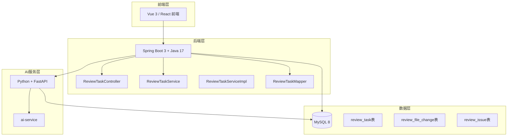
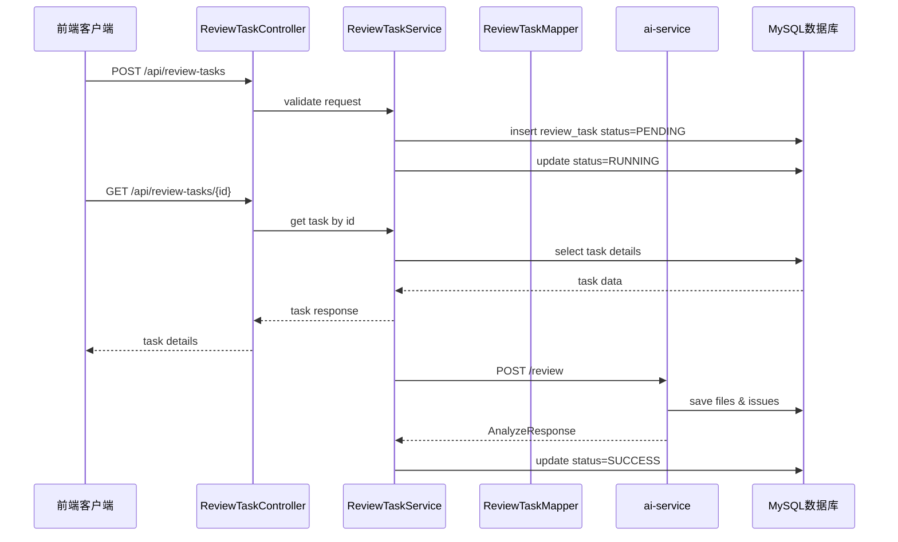
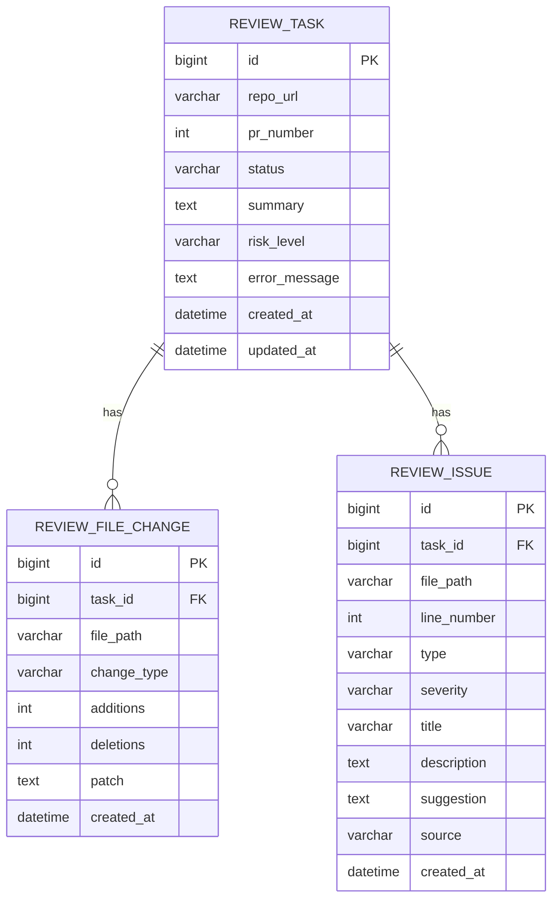
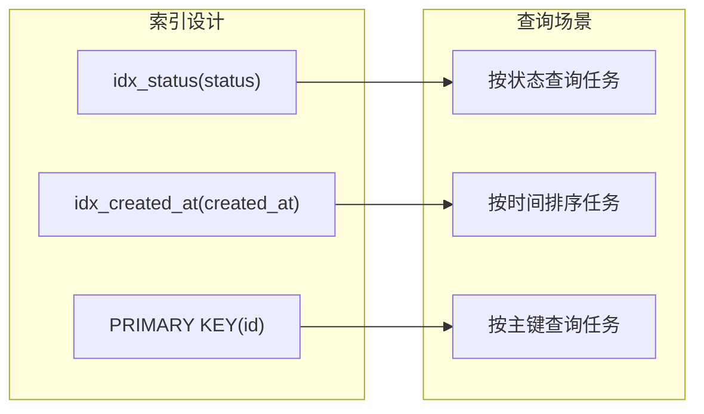
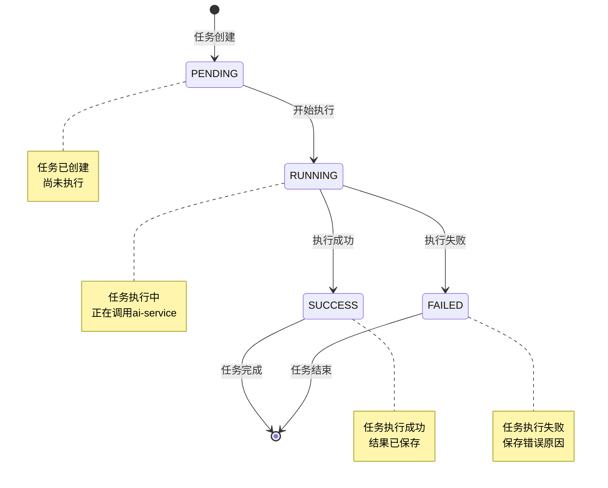
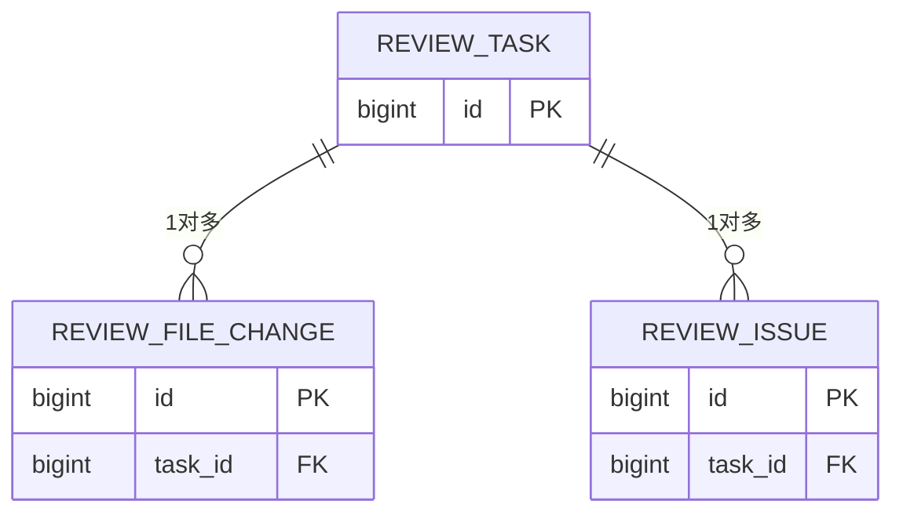
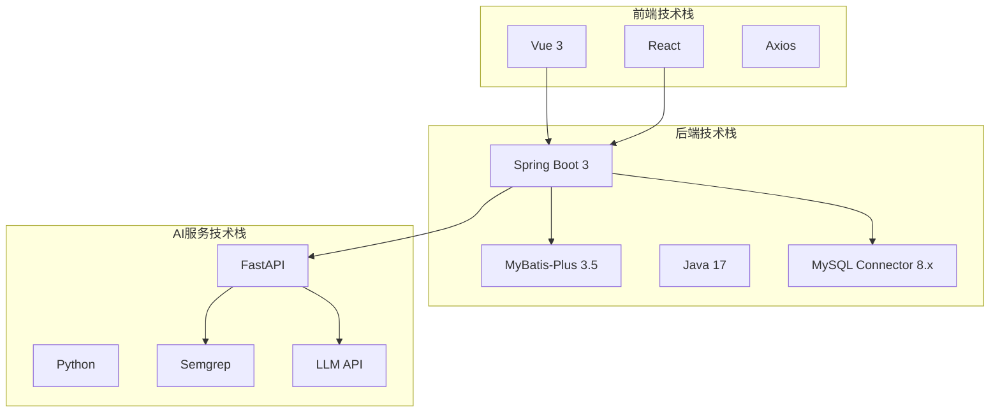
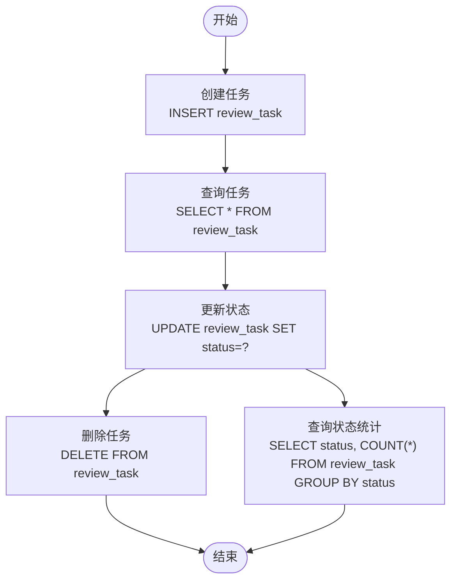
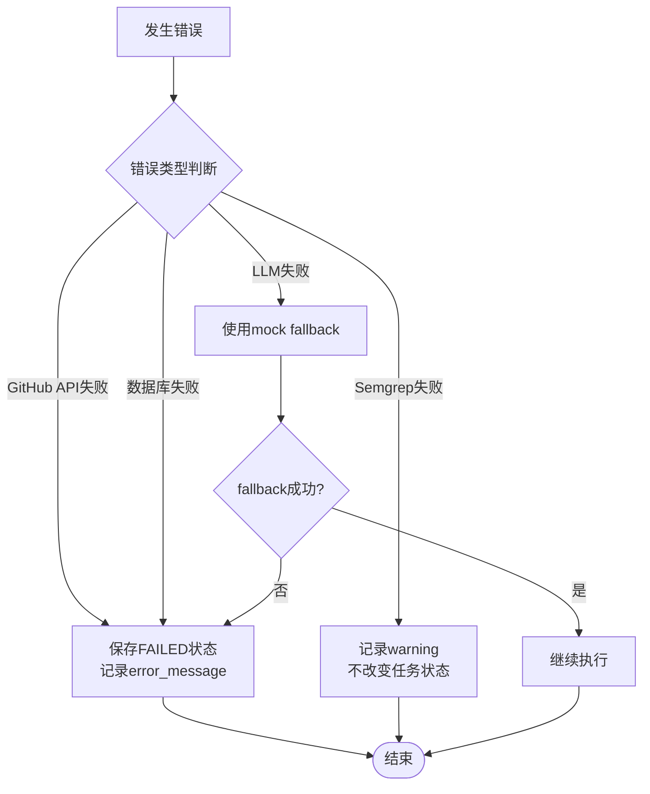

# ReviewTask任务表

<cite>
**本文档引用的文件**
- [DATABASE.md](file://docs/DATABASE.md)
- [ARCHITECTURE.md](file://docs/ARCHITECTURE.md)
- [README.md](file://README.md)
</cite>

## 目录
1. [简介](#简介)
2. [项目结构](#项目结构)
3. [核心组件](#核心组件)
4. [架构概览](#架构概览)
5. [详细组件分析](#详细组件分析)
6. [依赖关系分析](#依赖关系分析)
7. [性能考虑](#性能考虑)
8. [故障排除指南](#故障排除指南)
9. [结论](#结论)

## 简介

ReviewTask任务表是CodeReviewX系统的核心数据表，用于存储代码审查任务的元信息、状态管理和审查结果摘要。该表采用MySQL 8数据库，使用utf8mb4字符集，支持完整的任务生命周期管理。

本表设计遵循MVP（最小可行产品）原则，专注于核心功能实现，为后续的功能扩展奠定了坚实的基础。

## 项目结构

CodeReviewX项目采用分层架构设计，ReviewTask任务表位于数据库层，与前后端应用通过REST API进行交互。

**图表来源**
- [ARCHITECTURE.md: 19-52:19-52](file://docs/ARCHITECTURE.md#L19-L52)
- [ARCHITECTURE.md: 183-231:183-231](file://docs/ARCHITECTURE.md#L183-L231)

**章节来源**
- [ARCHITECTURE.md: 1-L52:1-52](file://docs/ARCHITECTURE.md#L1-L52)
- [README.md: 1-L20:1-20](file://README.md#L1-L20)

## 核心组件

ReviewTask任务表包含以下核心字段：

### 基础信息字段
- **id**: BIGINT AUTO_INCREMENT 主键，唯一标识每个任务
- **repo_url**: VARCHAR(500) 非空，存储GitHub仓库地址
- **pr_number**: INT 非空，存储Pull Request编号

### 状态管理字段
- **status**: VARCHAR(20) 非空，默认值为'PENDING'，任务状态字段
- **error_message**: TEXT 可空，失败原因描述

### 结果摘要字段
- **summary**: TEXT 可空，Review总结内容
- **risk_level**: VARCHAR(10) 可空，风险等级(Low/Medium/High)

### 时间戳字段
- **created_at**: DATETIME 非空，默认当前时间，任务创建时间
- **updated_at**: DATETIME 非空，默认当前时间，自动更新时间

**章节来源**
- [DATABASE.md: 22-L56:22-56](file://docs/DATABASE.md#L22-L56)

## 架构概览

ReviewTask任务表在整个系统架构中扮演着核心协调者的角色，负责管理任务的完整生命周期。

**图表来源**
- [ARCHITECTURE.md: 139-L168:139-168](file://docs/ARCHITECTURE.md#L139-L168)

## 详细组件分析

### 数据库表结构

ReviewTask任务表采用标准的关系型数据库设计，确保数据一致性和完整性。

**图表来源**
- [DATABASE.md: 27-L40:27-40](file://docs/DATABASE.md#L27-L40)
- [DATABASE.md: 64-L76:64-76](file://docs/DATABASE.md#L64-L76)
- [DATABASE.md: 99-L116:99-116](file://docs/DATABASE.md#L99-L116)

### 字段详细说明

#### 核心业务字段

| 字段名 | 数据类型 | 约束条件 | 业务含义 | 使用场景 |
|--------|----------|----------|----------|----------|
| id | BIGINT | PRIMARY KEY, AUTO_INCREMENT | 任务唯一标识 | 数据库主键，系统内部引用 |
| repo_url | VARCHAR(500) | NOT NULL | GitHub仓库URL | 识别PR所属的代码仓库 |
| pr_number | INT | NOT NULL | Pull Request编号 | 标识具体的PR变更 |
| status | VARCHAR(20) | NOT NULL, DEFAULT 'PENDING' | 任务执行状态 | 状态机流转控制 |
| summary | TEXT | NULLABLE | 审查结果摘要 | 展示给用户的结果概述 |
| risk_level | VARCHAR(10) | NULLABLE | 风险等级 | 评估代码质量风险 |
| error_message | TEXT | NULLABLE | 失败原因描述 | FAILED状态时的错误信息 |

#### 时间戳字段

| 字段名 | 数据类型 | 约束条件 | 自动行为 | 业务用途 |
|--------|----------|----------|----------|----------|
| created_at | DATETIME | NOT NULL, DEFAULT CURRENT_TIMESTAMP | 自动插入 | 任务创建时间追踪 |
| updated_at | DATETIME | NOT NULL, DEFAULT CURRENT_TIMESTAMP ON UPDATE CURRENT_TIMESTAMP | 自动更新 | 最后修改时间追踪 |

#### 索引设计

**图表来源**
- [DATABASE.md: 37-L40:37-40](file://docs/DATABASE.md#L37-L40)

**章节来源**
- [DATABASE.md: 26-L41:26-41](file://docs/DATABASE.md#L26-L41)

### 任务状态管理机制

ReviewTask任务采用严格的有限状态机设计，确保任务状态的有序流转。

**图表来源**
- [ARCHITECTURE.md: 110-L134:110-134](file://docs/ARCHITECTURE.md#L110-L134)

#### 状态流转规则

1. **单向流转原则**: 状态只能向前流转，不可回退
2. **错误处理规则**: 
   - FAILED状态必须保存error_message
   - Semgrep失败可降级为warning
   - LLM失败使用mock fallback
3. **数据完整性**: 成功状态必须包含summary和risk_level

**章节来源**
- [ARCHITECTURE.md: 119-L134:119-134](file://docs/ARCHITECTURE.md#L119-L134)

### 数据完整性约束

#### 枚举值设计

| 枚举类型 | 可选值 | 业务含义 |
|----------|--------|----------|
| TaskStatus | PENDING, RUNNING, SUCCESS, FAILED | 任务执行状态 |
| RiskLevel | LOW, MEDIUM, HIGH | 代码风险等级 |
| IssueType | BUG, SECURITY, PERFORMANCE, TEST, STYLE | 问题类型分类 |
| IssueSeverity | LOW, MEDIUM, HIGH | 问题严重程度 |
| ChangeType | added, modified, deleted | 文件变更类型 |
| IssueSource | LLM, SEMGREP | 问题来源类型 |

#### 外键关系

ReviewTask表与其他表建立清晰的关联关系：

**图表来源**
- [DATABASE.md: 75](file://docs/DATABASE.md#L75)
- [DATABASE.md: 115](file://docs/DATABASE.md#L115)

**章节来源**
- [DATABASE.md: 203-L254:203-254](file://docs/DATABASE.md#L203-L254)

## 依赖关系分析

### 技术栈依赖

**图表来源**
- [ARCHITECTURE.md: 28-L46:28-46](file://docs/ARCHITECTURE.md#L28-L46)
- [backend-java/README.md: 28-L39:28-39](file://backend-java/README.md#L28-L39)

### 数据访问模式

ReviewTask表采用标准的CRUD操作模式：

**图表来源**
- [ARCHITECTURE.md: 139-L168:139-168](file://docs/ARCHITECTURE.md#L139-L168)

**章节来源**
- [ARCHITECTURE.md: 183-L231:183-231](file://docs/ARCHITECTURE.md#L183-L231)

## 性能考虑

### 查询优化策略

1. **索引优化**
   - status字段索引支持状态过滤查询
   - created_at字段索引支持时间排序
   - 主键索引确保唯一性约束

2. **数据类型选择**
   - 使用VARCHAR(500)存储repo_url，满足GitHub URL长度需求
   - 使用TEXT类型存储summary和error_message，支持长文本内容
   - 使用DATETIME类型存储时间戳，精度满足业务需求

3. **存储引擎选择**
   - InnoDB引擎提供ACID特性
   - 支持外键约束和事务处理

### 扩展性考虑

1. **未来可能的优化方向**
   - 考虑添加复合索引以优化常用查询
   - 根据实际数据量调整字段长度
   - 考虑分区表策略以支持大数据量

2. **监控指标**
   - 任务执行成功率
   - 平均执行时间
   - 失败率统计

## 故障排除指南

### 常见问题及解决方案

#### 状态流转异常
- **问题**: 任务状态无法从RUNNING变为SUCCESS
- **原因**: ai-service调用失败或数据库保存异常
- **解决**: 检查ai-service日志，验证数据库连接，确认JSON校验通过

#### 数据一致性问题
- **问题**: summary或risk_level字段为空
- **原因**: ai-service返回数据格式不符合预期
- **解决**: 验证AnalyzeResponse结构，检查JSON schema校验

#### 性能问题
- **问题**: 查询速度慢
- **原因**: 缺少必要的索引或查询条件不当
- **解决**: 添加适当的索引，优化WHERE条件

**章节来源**
- [ARCHITECTURE.md: 170-L180:170-180](file://docs/ARCHITECTURE.md#L170-L180)

### 错误处理机制

**图表来源**
- [ARCHITECTURE.md: 170-L180:170-180](file://docs/ARCHITECTURE.md#L170-L180)

## 结论

ReviewTask任务表作为CodeReviewX系统的核心数据结构，采用了精心设计的架构和约束机制。其主要特点包括：

1. **清晰的状态管理**: 严格的有限状态机设计确保任务执行的可控性
2. **完整的数据完整性**: 通过外键关系和枚举值约束保证数据一致性
3. **良好的扩展性**: 支持未来的功能扩展和性能优化
4. **完善的错误处理**: 提供多层次的错误处理和降级机制

该设计为CodeReviewX系统的稳定运行提供了坚实的数据基础，支持从简单的代码审查到复杂的多维度分析需求。随着系统的演进，ReviewTask表将继续发挥核心作用，支撑更多高级功能的实现。