# 实体映射说明

<cite>
**本文引用的文件**
- [DATABASE.md](file://docs/DATABASE.md)
- [ARCHITECTURE.md](file://docs/ARCHITECTURE.md)
- [API.md](file://docs/API.md)
</cite>

## 目录
1. [简介](#简介)
2. [项目结构](#项目结构)
3. [核心组件](#核心组件)
4. [架构概览](#架构概览)
5. [详细组件分析](#详细组件分析)
6. [依赖分析](#依赖分析)
7. [性能考虑](#性能考虑)
8. [故障排除指南](#故障排除指南)
9. [结论](#结论)

## 简介

本文件详细说明了CodeReviewX项目中MyBatis-Plus实体映射的设计与实现。该项目采用Spring Boot 3 + Java 17技术栈，使用MyBatis-Plus作为ORM框架，通过注解驱动的方式实现数据库表与Java实体类之间的精确映射。

项目的核心目标是为GitHub Pull Request提供智能代码审查和修复建议，因此实体映射设计需要支持复杂的多表关联关系和丰富的业务状态管理。

## 项目结构

基于架构文档，backend-java模块采用标准的分层架构设计：

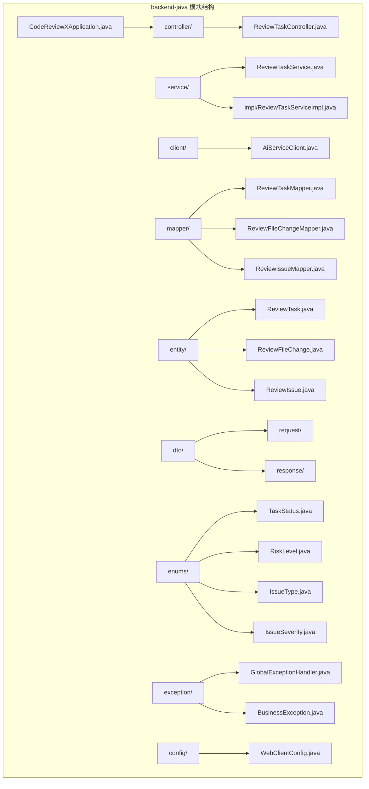

**图表来源**
- [ARCHITECTURE.md: 183-220:183-220](file://docs/ARCHITECTURE.md#L183-L220)

**章节来源**
- [ARCHITECTURE.md: 183-220:183-220](file://docs/ARCHITECTURE.md#L183-L220)

## 核心组件

### 数据库表设计概述

项目采用三层数据库设计，支持完整的代码审查工作流：

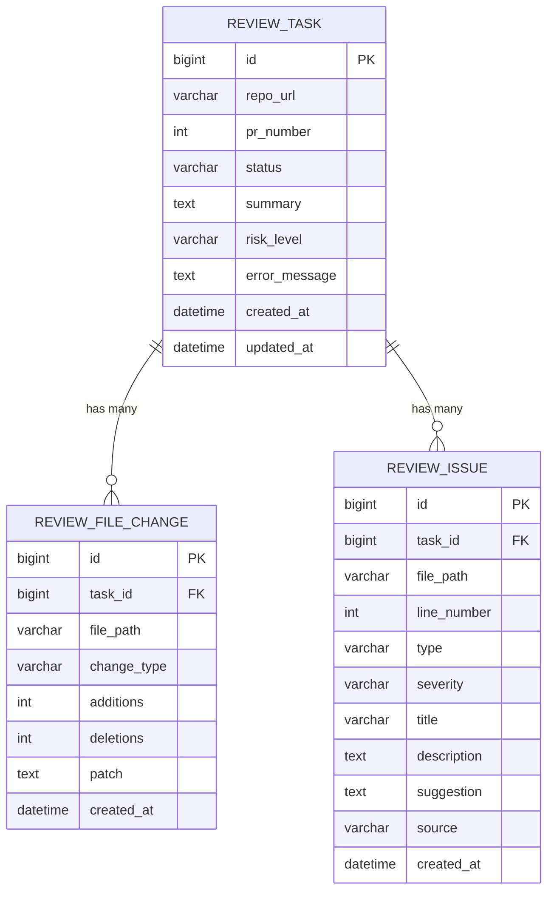

**图表来源**
- [DATABASE.md: 22-117:22-117](file://docs/DATABASE.md#L22-L117)

### 命名映射规则

MyBatis-Plus采用严格的命名转换规则确保数据库schema与Java代码的一致性：

- **数据库字段**: snake_case（如 `task_id`, `repo_url`）
- **Java属性**: camelCase（如 `taskId`, `repoUrl`）
- **表名映射**: 使用 `@TableName` 注解显式声明
- **字段映射**: 使用 `@TableId` 和 `@TableField` 注解精确控制

**章节来源**
- [DATABASE.md: 257-286:257-286](file://docs/DATABASE.md#L257-L286)

## 架构概览

### 整体系统架构

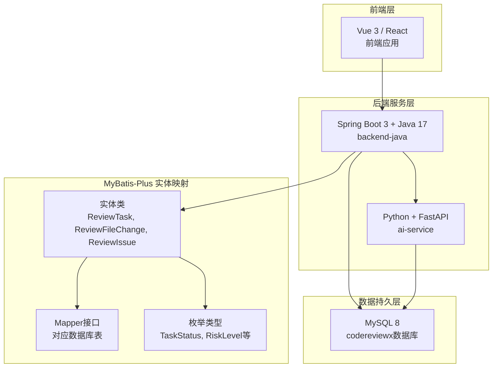

**图表来源**
- [ARCHITECTURE.md: 19-52:19-52](file://docs/ARCHITECTURE.md#L19-L52)

### 数据流设计

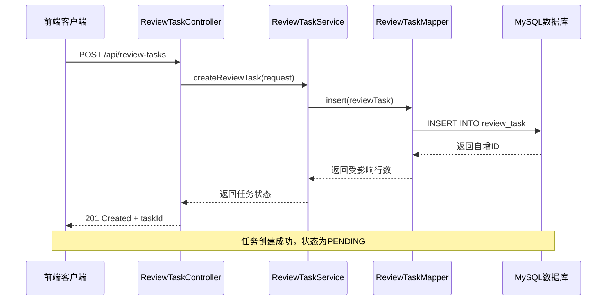

**图表来源**
- [ARCHITECTURE.md: 139-168:139-168](file://docs/ARCHITECTURE.md#L139-L168)

## 详细组件分析

### ReviewTask 实体映射

ReviewTask是系统的核心实体，代表一次代码审查任务的完整生命周期。

#### 基础映射配置

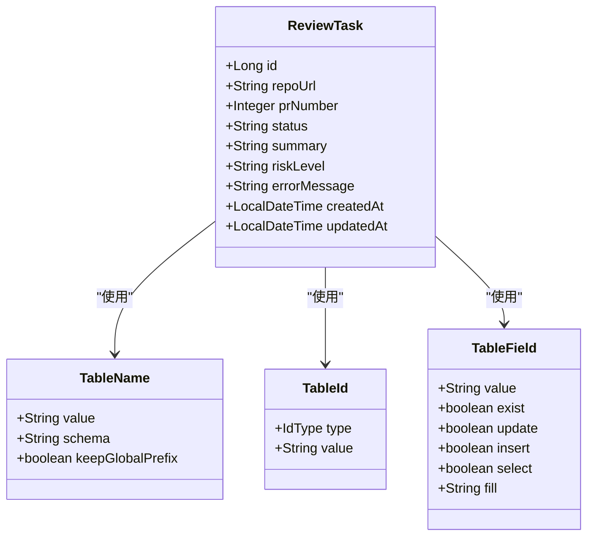

**图表来源**
- [DATABASE.md: 266-284:266-284](file://docs/DATABASE.md#L266-L284)

#### 字段映射策略

| 数据库字段 | Java属性 | 注解配置 | 映射策略 | 备注 |
|------------|----------|----------|----------|------|
| `id` | `id` | `@TableId(type = IdType.AUTO)` | 主键自增 | 自动递增 |
| `repo_url` | `repoUrl` | `@TableField("repo_url")` | 显式映射 | snake_case转camelCase |
| `pr_number` | `prNumber` | `@TableField("pr_number")` | 显式映射 | 数字类型映射 |
| `status` | `status` | `@TableField("status")` | 枚举转换 | 使用TaskStatus枚举 |
| `summary` | `summary` | `@TableField("summary")` | 文本映射 | 支持null |
| `risk_level` | `riskLevel` | `@TableField("risk_level")` | 枚举转换 | 使用RiskLevel枚举 |
| `error_message` | `errorMessage` | `@TableField("error_message")` | 文本映射 | 失败时填充 |
| `created_at` | `createdAt` | `@TableField("created_at")` | 时间戳映射 | 自动填充 |
| `updated_at` | `updatedAt` | `@TableField("updated_at")` | 时间戳映射 | 自动更新 |

**章节来源**
- [DATABASE.md: 266-284:266-284](file://docs/DATABASE.md#L266-L284)

### ReviewFileChange 实体映射

ReviewFileChange实体处理PR变更文件的详细信息。

#### 外键关联设计

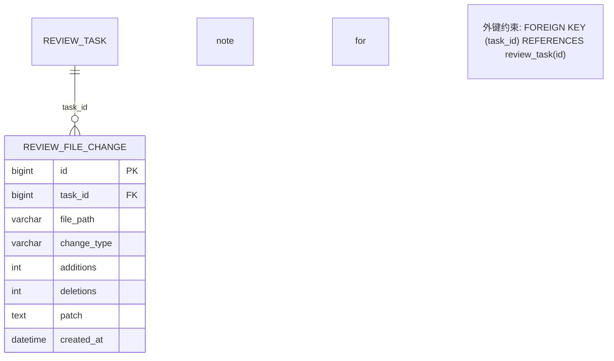

**图表来源**
- [DATABASE.md: 59-91:59-91](file://docs/DATABASE.md#L59-L91)

#### 字段映射配置

| 数据库字段 | Java属性 | 注解配置 | 映射策略 | 备注 |
|------------|----------|----------|----------|------|
| `id` | `id` | `@TableId` | 主键自增 | 自动递增 |
| `task_id` | `taskId` | `@TableField("task_id")` | 外键映射 | 关联ReviewTask |
| `file_path` | `filePath` | `@TableField("file_path")` | 路径映射 | 文件绝对路径 |
| `change_type` | `changeType` | `@TableField("change_type")` | 枚举转换 | 使用ChangeType枚举 |
| `additions` | `additions` | `@TableField("additions")` | 数值映射 | 新增行数统计 |
| `deletions` | `deletions` | `@TableField("deletions")` | 数值映射 | 删除行数统计 |
| `patch` | `patch` | `@TableField("patch")` | 文本映射 | diff片段内容 |
| `created_at` | `createdAt` | `@TableField("created_at")` | 时间戳映射 | 自动填充 |

**章节来源**
- [DATABASE.md: 59-91:59-91](file://docs/DATABASE.md#L59-L91)

### ReviewIssue 实体映射

ReviewIssue实体存储LLM和Semgrep分析产生的具体问题。

#### 复杂字段映射

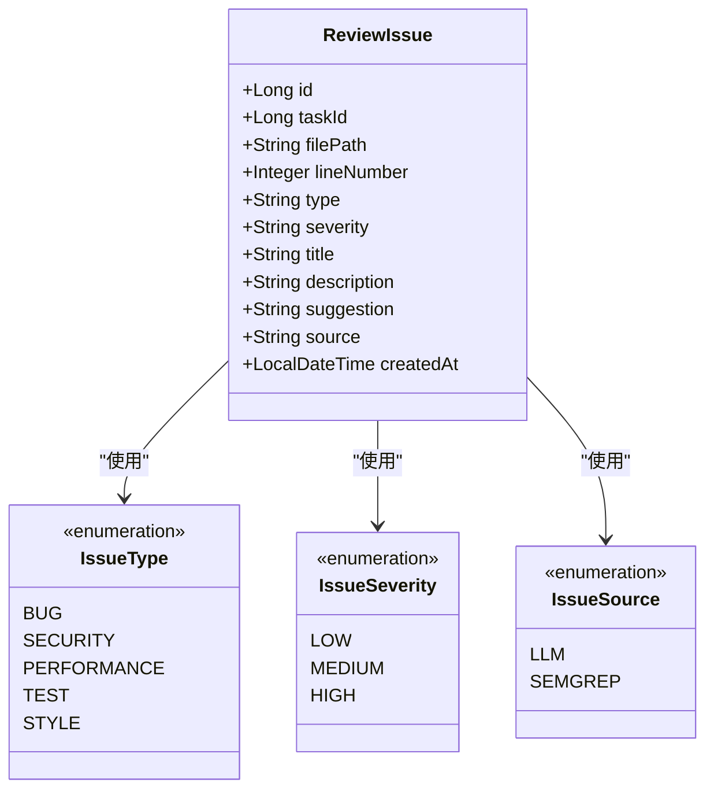

**图表来源**
- [DATABASE.md: 94-134:94-134](file://docs/DATABASE.md#L94-L134)

#### 字段映射策略

| 数据库字段 | Java属性 | 注解配置 | 映射策略 | 备注 |
|------------|----------|----------|----------|------|
| `id` | `id` | `@TableId` | 主键自增 | 自动递增 |
| `task_id` | `taskId` | `@TableField("task_id")` | 外键映射 | 关联ReviewTask |
| `file_path` | `filePath` | `@TableField("file_path")` | 路径映射 | 问题文件路径 |
| `line_number` | `lineNumber` | `@TableField("line_number")` | 数值映射 | 问题行号 |
| `type` | `type` | `@TableField("type")` | 枚举转换 | 使用IssueType枚举 |
| `severity` | `severity` | `@TableField("severity")` | 枚举转换 | 使用IssueSeverity枚举 |
| `title` | `title` | `@TableField("title")` | 文本映射 | 问题标题 |
| `description` | `description` | `@TableField("description")` | 文本映射 | 详细描述 |
| `suggestion` | `suggestion` | `@TableField("suggestion")` | 文本映射 | 修复建议 |
| `source` | `source` | `@TableField("source")` | 枚举转换 | 使用IssueSource枚举 |
| `created_at` | `createdAt` | `@TableField("created_at")` | 时间戳映射 | 自动填充 |

**章节来源**
- [DATABASE.md: 94-134:94-134](file://docs/DATABASE.md#L94-L134)

### 枚举类型处理机制

系统采用统一的枚举类型管理策略，确保数据库字符串值与Java枚举对象之间的自动转换。

#### 枚举类型定义

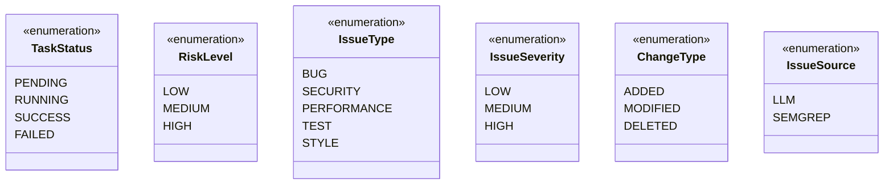

**图表来源**
- [ARCHITECTURE.md: 210-215:210-215](file://docs/ARCHITECTURE.md#L210-L215)

#### 枚举转换机制

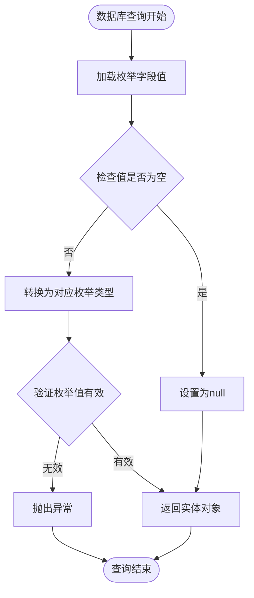

**图表来源**
- [DATABASE.md: 203-254:203-254](file://docs/DATABASE.md#L203-L254)

**章节来源**
- [DATABASE.md: 203-254:203-254](file://docs/DATABASE.md#L203-L254)

## 依赖分析

### 组件耦合关系

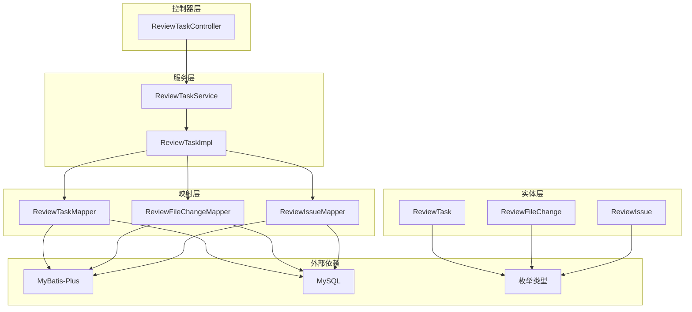

**图表来源**
- [ARCHITECTURE.md: 183-220:183-220](file://docs/ARCHITECTURE.md#L183-L220)

### 数据访问模式

系统采用Repository模式，每个实体都有对应的Mapper接口：

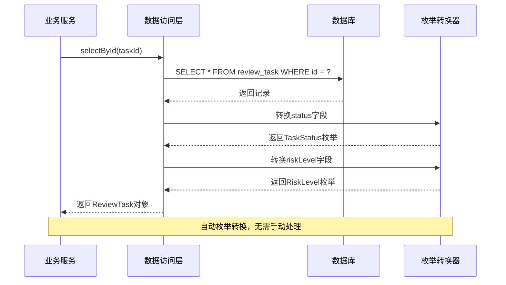

**图表来源**
- [ARCHITECTURE.md: 183-220:183-220](file://docs/ARCHITECTURE.md#L183-L220)

**章节来源**
- [ARCHITECTURE.md: 183-220:183-220](file://docs/ARCHITECTURE.md#L183-L220)

## 性能考虑

### 查询优化策略

1. **索引利用**
   - `review_task`: `idx_status`, `idx_created_at`
   - `review_file_change`: `idx_task_id`
   - `review_issue`: `idx_task_id`, `idx_severity`, `idx_type`

2. **批量操作**
   - 使用MyBatis-Plus的批量插入和更新功能
   - 避免N+1查询问题

3. **懒加载策略**
   - 对于大型文本字段（如patch、description）采用延迟加载
   - 仅在需要时查询详细内容

### 内存优化

1. **实体大小控制**
   - 避免在ReviewTask中直接嵌套大量ReviewIssue对象
   - 使用分页查询减少内存占用

2. **枚举缓存**
   - 利用JVM缓存机制，避免重复创建枚举实例

## 故障排除指南

### 常见映射问题

1. **字段名称不匹配**
   ```java
   // ❌ 错误：字段名与数据库不一致
   @TableField("repo_url")
   private String repositoryUrl;
   
   // ✅ 正确：使用驼峰命名
   @TableField("repo_url")
   private String repoUrl;
   ```

2. **主键类型错误**
   ```java
   // ❌ 错误：使用Integer作为主键
   @TableId
   private Integer id;
   
   // ✅ 正确：使用Long类型
   @TableId
   private Long id;
   ```

3. **枚举转换异常**
   ```java
   // ❌ 错误：数据库值不在枚举范围内
   // 数据库值: "UNKNOWN_STATUS"
   
   // ✅ 正确：确保数据库值与枚举定义一致
   // 数据库值: "PENDING", "RUNNING", "SUCCESS", "FAILED"
   ```

### 调试技巧

1. **开启SQL日志**
   ```yaml
   logging:
     level:
       org.apache.ibatis: debug
       com.yourpackage.mapper: debug
   ```

2. **验证映射配置**
   ```java
   @Test
   public void testEntityMapping() {
       // 验证实体类与数据库表结构一致性
       MetaObjectHandler metaObjectHandler = new MyMetaObjectHandler();
       // 检查自动填充字段
   }
   ```

**章节来源**
- [DATABASE.md: 288-294:288-294](file://docs/DATABASE.md#L288-L294)

## 结论

CodeReviewX项目的MyBatis-Plus实体映射设计体现了现代Java企业应用的最佳实践。通过严格的命名约定、完善的枚举转换机制和清晰的分层架构，系统实现了数据库schema与Java代码的高度一致性。

关键设计要点包括：
- 明确的命名转换规则（snake_case ↔ camelCase）
- 基于注解的精确字段映射
- 统一的枚举类型管理
- 清晰的外键关系设计
- 完善的索引策略

这些设计为后续的功能扩展和性能优化奠定了坚实的基础，确保系统能够稳定支持复杂的代码审查工作流。