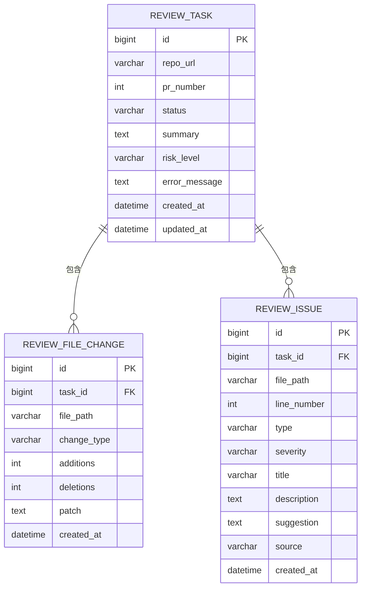
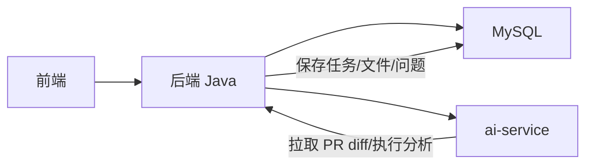
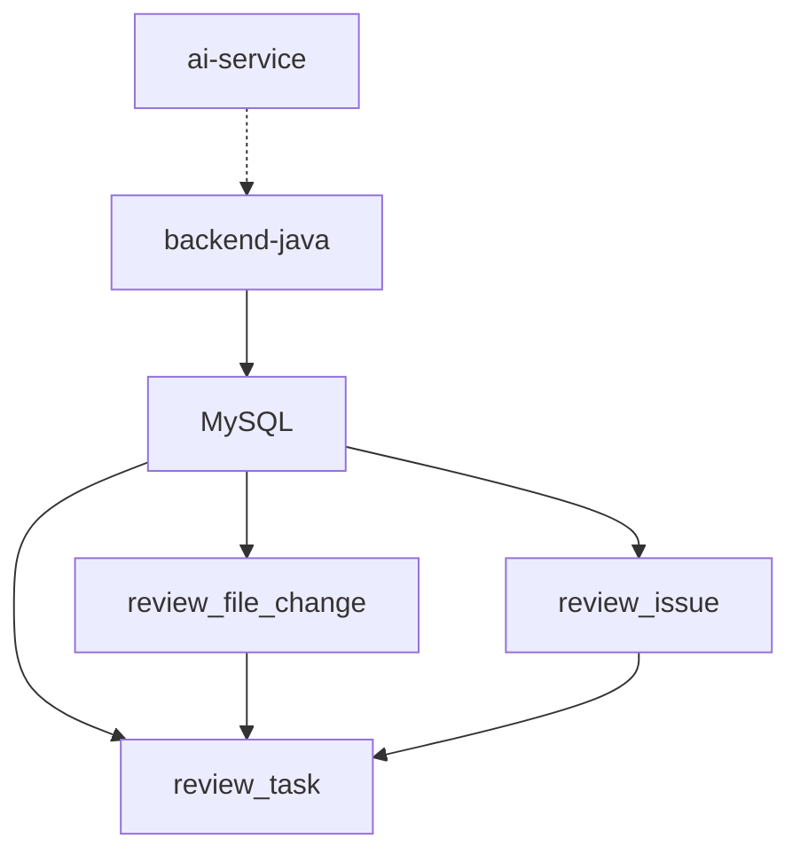

# 数据库概览

<cite>
**本文引用的文件**
- [docs/DATABASE.md](file://docs/DATABASE.md)
- [docs/ARCHITECTURE.md](file://docs/ARCHITECTURE.md)
- [docs/PRD.md](file://docs/PRD.md)
- [docker-compose.yml](file://docker-compose.yml)
- [tasks/round-01/01-cursor-repository-foundation.md](file://tasks/round-01/01-cursor-repository-foundation.md)
- [handoff/round-01/02-codex-handoff.md](file://handoff/round-01/02-codex-handoff.md)
</cite>

## 目录
1. [简介](#简介)
2. [项目结构](#项目结构)
3. [核心组件](#核心组件)
4. [架构总览](#架构总览)
5. [详细组件分析](#详细组件分析)
6. [依赖分析](#依赖分析)
7. [性能考虑](#性能考虑)
8. [故障排查指南](#故障排查指南)
9. [结论](#结论)
10. [附录](#附录)

## 简介
本章节面向数据库概览，系统阐述 CodeReviewX 项目的数据库设计理念与实现蓝图。项目采用 MySQL 8 作为核心存储，字符集统一为 utf8mb4，排序规则为 utf8mb4_unicode_ci，存储引擎统一为 InnoDB。数据库整体遵循“逻辑 schema 设计优先”的原则，当前 Round 01 阶段不包含实际迁移脚本，所有 SQL 仅作为后续实现的参考。

数据库围绕三张核心表展开：review_task（任务主表）、review_file_change（文件变更明细表）、review_issue（问题明细表）。三者通过外键关联形成清晰的一对多关系，支持按任务维度聚合 PR 的变更与问题。索引策略围绕高频查询与过滤条件进行设计，兼顾查询性能与写入开销。此外，文档还明确了枚举值约束、MyBatis-Plus 实体映射规则以及 MVP 阶段的注意事项。

章节来源
- [docs/DATABASE.md:1-294](file://docs/DATABASE.md#L1-L294)

## 项目结构
从数据库视角，项目结构的关键点如下：
- 数据库：MySQL 8
- 字符集：utf8mb4
- 排序规则：utf8mb4_unicode_ci
- 存储引擎：InnoDB
- 逻辑设计：三张核心表 review_task、review_file_change、review_issue
- 环境与部署：docker-compose.yml 为占位文件，预留 mysql 服务定义位置

```mermaid
graph TB
subgraph "数据库层"
T["review_task<br/>任务主表"]
C["review_file_change<br/>文件变更明细表"]
I["review_issue<br/>问题明细表"]
end
subgraph "应用层"
BE["backend-java<br/>业务编排与持久化"]
AI["ai-service<br/>GitHub/静态分析/LLM"]
FE["frontend<br/>前端展示"]
end
FE --> BE
BE --> AI
BE --> T
T <- --> C
T <- --> I
```

图表来源
- [docs/DATABASE.md:22-116](file://docs/DATABASE.md#L22-L116)
- [docs/ARCHITECTURE.md:19-52](file://docs/ARCHITECTURE.md#L19-L52)

章节来源
- [docs/DATABASE.md:9-17](file://docs/DATABASE.md#L9-L17)
- [docker-compose.yml:1-14](file://docker-compose.yml#L1-L14)

## 核心组件
本节聚焦数据库层面的三张核心表及其职责与关系：

- review_task（任务主表）
  - 职责：保存任务元信息、状态与 Review 结果摘要
  - 关键字段：repo_url、pr_number、status、summary、risk_level、error_message、created_at、updated_at
  - 索引：idx_status、idx_created_at
  - 外键：无（独立主表）

- review_file_change（文件变更明细表）
  - 职责：记录每个任务涉及的文件变更信息（新增/修改/删除）
  - 关键字段：task_id（关联 review_task）、file_path、change_type、additions、deletions、patch、created_at
  - 索引：idx_task_id
  - 外键：fk_file_change_task(task_id → review_task.id)

- review_issue（问题明细表）
  - 职责：记录 LLM 与 Semgrep 分析出的问题
  - 关键字段：task_id（关联 review_task）、file_path、line_number、type、severity、title、description、suggestion、source、created_at
  - 索引：idx_task_id、idx_severity、idx_type
  - 外键：fk_issue_task(task_id → review_task.id)



图表来源
- [docs/DATABASE.md:27-40](file://docs/DATABASE.md#L27-L40)
- [docs/DATABASE.md:64-76](file://docs/DATABASE.md#L64-L76)
- [docs/DATABASE.md:99-116](file://docs/DATABASE.md#L99-L116)

章节来源
- [docs/DATABASE.md:22-134](file://docs/DATABASE.md#L22-L134)

## 架构总览
数据库在整体架构中的定位与职责：
- 仅作为业务数据存储，不承担分析逻辑
- 与后端 Java 服务紧密耦合，通过 MyBatis-Plus 进行 ORM 映射
- 与 ai-service 的交互以数据落库为主，不直接参与 AI 分析过程
- 前端通过后端 API 访问数据库中的任务、文件变更与问题数据



图表来源
- [docs/ARCHITECTURE.md:7-16](file://docs/ARCHITECTURE.md#L7-L16)
- [docs/ARCHITECTURE.md:48-51](file://docs/ARCHITECTURE.md#L48-L51)

章节来源
- [docs/ARCHITECTURE.md:7-16](file://docs/ARCHITECTURE.md#L7-L16)

## 详细组件分析

### 数据库初始化与环境要求
- 数据库名称：codereviewx
- 字符集与排序规则：utf8mb4、utf8mb4_unicode_ci
- 存储引擎：InnoDB
- Docker Compose 占位：预留 mysql 服务定义位置（Round 01 未实现真实服务）
- 环境变量示例：backend-java 使用 jdbc:mysql://mysql:3306/codereviewx，用户名/密码在 PRD/任务文档中有示例

章节来源
- [docs/DATABASE.md:9-17](file://docs/DATABASE.md#L9-L17)
- [docs/DATABASE.md:142-145](file://docs/DATABASE.md#L142-L145)
- [docs/ARCHITECTURE.md:349-354](file://docs/ARCHITECTURE.md#L349-L354)
- [tasks/round-01/01-cursor-repository-foundation.md:441-445](file://tasks/round-01/01-cursor-repository-foundation.md#L441-L445)

### 表结构与索引策略
- review_task
  - 主键：id
  - 索引：idx_status（便于按状态筛选任务）、idx_created_at（便于按时间倒序）
  - 设计要点：状态字段默认 PENDING，便于批量调度与清理

- review_file_change
  - 主键：id
  - 索引：idx_task_id（按任务查询文件变更）
  - 外键：task_id → review_task.id
  - 设计要点：patch 字段在 MVP 阶段使用 TEXT，注意超大 diff 的容量与截断策略

- review_issue
  - 主键：id
  - 索引：idx_task_id（按任务查询问题）、idx_severity（按严重程度筛选）、idx_type（按问题类型筛选）
  - 外键：task_id → review_task.id
  - 设计要点：type/severity/source 采用枚举值，确保数据一致性与查询效率

章节来源
- [docs/DATABASE.md:27-40](file://docs/DATABASE.md#L27-L40)
- [docs/DATABASE.md:64-76](file://docs/DATABASE.md#L64-L76)
- [docs/DATABASE.md:99-116](file://docs/DATABASE.md#L99-L116)

### 枚举值与约束
- TaskStatus：PENDING、RUNNING、SUCCESS、FAILED
- RiskLevel：LOW、MEDIUM、HIGH
- IssueType：BUG、SECURITY、PERFORMANCE、TEST、STYLE
- IssueSeverity：LOW、MEDIUM、HIGH
- ChangeType：added、modified、deleted
- IssueSource：LLM、SEMGREP

章节来源
- [docs/DATABASE.md:205-254](file://docs/DATABASE.md#L205-L254)

### MyBatis-Plus 实体映射说明
- 命名映射：数据库 snake_case → Java camelCase
- 显式注解：@TableName、@TableId、@TableField
- 示例：ReviewTask 实体字段与数据库字段一一对应，状态与严重程度使用枚举转换

章节来源
- [docs/DATABASE.md:257-284](file://docs/DATABASE.md#L257-L284)

### 初始化 SQL（参考）
- 创建数据库与字符集/排序规则
- 创建三张表及索引
- 定义外键约束（不启用 ON DELETE CASCADE，避免误删）

章节来源
- [docs/DATABASE.md:137-199](file://docs/DATABASE.md#L137-L199)

## 依赖分析
- 应用层依赖
  - backend-java 通过 JDBC 连接 MySQL，使用 MyBatis-Plus 进行 ORM
  - ai-service 不直接写库，仅提供分析结果供后端落库
- 数据层依赖
  - review_file_change 与 review_issue 均依赖 review_task 的存在
  - 外键约束采用级联检查，避免误删
- 部署依赖
  - docker-compose.yml 为占位文件，预留 mysql 服务定义位置



图表来源
- [docs/ARCHITECTURE.md:349-354](file://docs/ARCHITECTURE.md#L349-L354)
- [docs/DATABASE.md:75-76](file://docs/DATABASE.md#L75-L76)
- [docs/DATABASE.md:115-116](file://docs/DATABASE.md#L115-L116)

章节来源
- [docs/ARCHITECTURE.md:349-354](file://docs/ARCHITECTURE.md#L349-L354)
- [docker-compose.yml:11-11](file://docker-compose.yml#L11-L11)

## 性能考虑
- 字符集与排序规则：utf8mb4_unicode_ci 支持完整的 Unicode，适合国际化与多语言文本
- 存储引擎：InnoDB 提供事务、行级锁与崩溃恢复能力，适合高并发写入场景
- 索引策略：
  - review_task：按 status 与 created_at 建立索引，支持任务调度与时间维度查询
  - review_file_change：按 task_id 建立索引，支持按任务查询文件变更
  - review_issue：按 task_id、severity、type 建立索引，支持按任务、严重程度与类型筛选
- 外键约束：采用级联检查，避免误删；不启用 ON DELETE CASCADE，降低误操作风险
- 时间字段：统一使用数据库服务器时区，避免跨时区问题
- MVP 阶段：不启用分区表或分库分表，简化部署与运维

章节来源
- [docs/DATABASE.md:9-17](file://docs/DATABASE.md#L9-L17)
- [docs/DATABASE.md:290-293](file://docs/DATABASE.md#L290-L293)

## 故障排查指南
- SQL 片段误解：文档明确标注 SQL 为“参考而非迁移”，避免在 Round 01 执行
- patch 字段容量：MVP 阶段使用 TEXT（最大约 64KB），遇到超大 diff 时需考虑截断或改用 MEDIUMTEXT
- 外键行为：当前使用级联检查，不启用 ON DELETE CASCADE，避免误删
- 时区与时间：统一数据库服务器时区，必要时在 docker-compose.yml 中统一配置
- Docker Compose：当前为占位文件，mysql 服务未定义，需在后续轮次完善

章节来源
- [handoff/round-01/02-codex-handoff.md:109-109](file://handoff/round-01/02-codex-handoff.md#L109-L109)
- [docs/DATABASE.md:290-293](file://docs/DATABASE.md#L290-L293)
- [docker-compose.yml:1-14](file://docker-compose.yml#L1-L14)

## 结论
CodeReviewX 的数据库设计以“逻辑 schema 优先、MVP 简化落地”为核心思想。通过 MySQL 8 的 utf8mb4 字符集与 InnoDB 引擎，配合三张核心表与合理的索引策略，满足任务、文件变更与问题的存储与查询需求。配合后端 Java 的 ORM 映射与 ai-service 的分析结果落库，形成清晰的数据流与职责边界。当前 Round 01 阶段不包含实际迁移脚本，开发者可基于文档快速理解数据库架构布局，并在后续轮次中逐步完善部署与迁移。

## 附录
- 数据库信息汇总
  - 数据库名：codereviewx
  - 字符集：utf8mb4
  - 排序规则：utf8mb4_unicode_ci
  - 存储引擎：InnoDB
- 环境变量示例（backend-java）
  - SPRING_DATASOURCE_URL：jdbc:mysql://mysql:3306/codereviewx
  - SPRING_DATASOURCE_USERNAME：codereviewx
  - SPRING_DATASOURCE_PASSWORD：codereviewx
- Docker Compose 预留服务
  - mysql（端口 3306），占位文件未定义真实服务

章节来源
- [docs/DATABASE.md:9-17](file://docs/DATABASE.md#L9-L17)
- [docs/ARCHITECTURE.md:349-354](file://docs/ARCHITECTURE.md#L349-L354)
- [docker-compose.yml:11-11](file://docker-compose.yml#L11-L11)