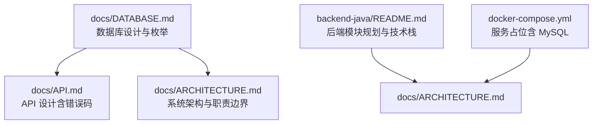
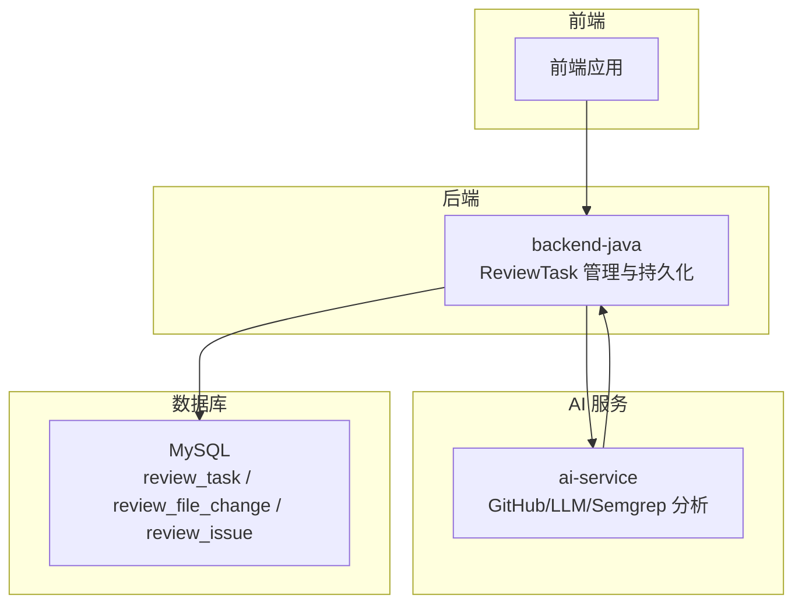
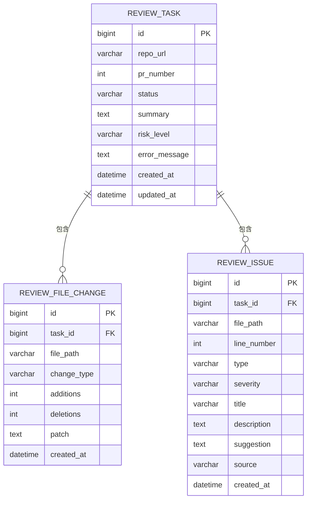
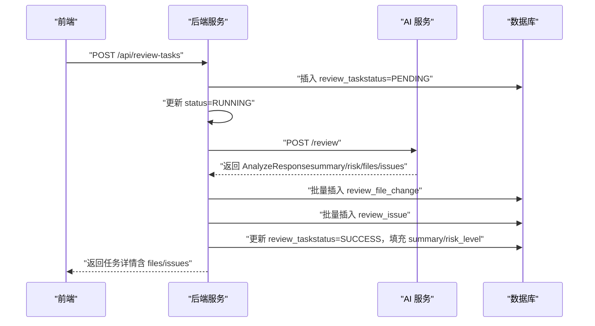

# 数据库设计

<cite>
**本文引用的文件**
- [docs/DATABASE.md](file://docs/DATABASE.md)
- [docs/API.md](file://docs/API.md)
- [docs/ARCHITECTURE.md](file://docs/ARCHITECTURE.md)
- [backend-java/README.md](file://backend-java/README.md)
- [docker-compose.yml](file://docker-compose.yml)
</cite>

## 目录
1. [简介](#简介)
2. [项目结构](#项目结构)
3. [核心组件](#核心组件)
4. [架构总览](#架构总览)
5. [详细组件分析](#详细组件分析)
6. [依赖分析](#依赖分析)
7. [性能考虑](#性能考虑)
8. [故障排查指南](#故障排查指南)
9. [结论](#结论)
10. [附录](#附录)

## 简介
本文件面向后端服务模块的数据库设计，基于 MVP 阶段的逻辑 schema，系统性说明 review_task、review_file_change、review_issue 三张表的字段定义、数据类型、主外键关系与约束，并阐述实体关系模型的设计理念与业务逻辑映射。同时提供数据库初始化脚本示例与数据访问模式说明，帮助开发者理解数据存储策略与性能优化要点。

## 项目结构
数据库设计文档位于 docs/DATABASE.md，配套的 API 设计与架构文档提供了调用链路与职责边界，backend-java/README.md 描述了后端模块的职责与技术栈，docker-compose.yml 为后续服务编排预留占位。

图表来源
- [docs/DATABASE.md:1-294](file://docs/DATABASE.md#L1-L294)
- [docs/API.md:1-378](file://docs/API.md#L1-L378)
- [docs/ARCHITECTURE.md:1-417](file://docs/ARCHITECTURE.md#L1-L417)
- [backend-java/README.md:1-74](file://backend-java/README.md#L1-L74)
- [docker-compose.yml:1-14](file://docker-compose.yml#L1-L14)

章节来源
- [docs/DATABASE.md:1-294](file://docs/DATABASE.md#L1-L294)
- [docs/API.md:1-378](file://docs/API.md#L1-L378)
- [docs/ARCHITECTURE.md:1-417](file://docs/ARCHITECTURE.md#L1-L417)
- [backend-java/README.md:1-74](file://backend-java/README.md#L1-L74)
- [docker-compose.yml:1-14](file://docker-compose.yml#L1-L14)

## 核心组件
本节概述三张核心表及其在 ReviewTask 生命周期中的作用与关系。

- review_task：任务主表，保存任务元信息、状态与 Review 结果摘要，支持按状态与创建时间检索。
- review_file_change：PR 变更文件表，记录每个任务涉及的文件变更信息，包含变更类型、新增/删除行数与 diff 片段。
- review_issue：Review 问题表，保存 LLM 与 Semgrep 分析出的问题，包含类型、严重程度、来源与修复建议。

章节来源
- [docs/DATABASE.md:22-134](file://docs/DATABASE.md#L22-L134)

## 架构总览
数据库作为业务数据存储，遵循“后端编排 + AI 分析 + 前端展示”的分层设计。后端负责任务生命周期管理、调用 AI 服务并持久化结果；AI 服务负责拉取 GitHub Diff、执行 Semgrep 与 LLM 分析；前端通过后端暴露的 REST API 查询任务与结果。

图表来源
- [docs/ARCHITECTURE.md:19-52](file://docs/ARCHITECTURE.md#L19-L52)
- [docs/API.md:54-241](file://docs/API.md#L54-L241)
- [docs/DATABASE.md:22-134](file://docs/DATABASE.md#L22-L134)

章节来源
- [docs/ARCHITECTURE.md:1-417](file://docs/ARCHITECTURE.md#L1-L417)
- [docs/API.md:1-378](file://docs/API.md#L1-L378)
- [docs/DATABASE.md:1-294](file://docs/DATABASE.md#L1-L294)

## 详细组件分析

### review_task 表
- 用途：保存 Review 任务的元信息、状态与结果摘要。
- 主键：id（BIGINT 自增）。
- 关键字段与约束：
  - repo_url（VARCHAR(500)，NOT NULL）
  - pr_number（INT，NOT NULL）
  - status（VARCHAR(20)，默认 PENDING）
  - summary（TEXT，可空）
  - risk_level（VARCHAR(10)，可空）
  - error_message（TEXT，可空）
  - created_at（DATETIME，NOT NULL，默认当前时间）
  - updated_at（DATETIME，NOT NULL，默认当前时间，更新时自动维护）
- 索引：
  - idx_status(status)
  - idx_created_at(created_at)
- 业务映射：对应 ReviewTask 实体，承载任务状态机（PENDING → RUNNING → SUCCESS/FAILED）。

章节来源
- [docs/DATABASE.md:22-41](file://docs/DATABASE.md#L22-L41)
- [docs/DATABASE.md:203-221](file://docs/DATABASE.md#L203-L221)

### review_file_change 表
- 用途：保存每个任务涉及的文件变更信息。
- 主键：id（BIGINT 自增）。
- 外键：task_id → review_task(id)。
- 关键字段与约束：
  - task_id（BIGINT，NOT NULL）
  - file_path（VARCHAR(500)，NOT NULL）
  - change_type（VARCHAR(20)，NOT NULL，取值 added/modified/deleted）
  - additions（INT，默认 0）
  - deletions（INT，默认 0）
  - patch（TEXT，可空，MVP 阶段可能受限于 TEXT 大小）
  - created_at（DATETIME，默认当前时间）
- 索引：idx_task_id(task_id)。
- 业务映射：对应 ReviewFileChange 实体，记录每个文件的变更类型与统计信息。

章节来源
- [docs/DATABASE.md:59-77](file://docs/DATABASE.md#L59-L77)
- [docs/DATABASE.md:240-247](file://docs/DATABASE.md#L240-L247)

### review_issue 表
- 用途：保存 LLM 与 Semgrep 分析出的问题。
- 主键：id（BIGINT 自增）。
- 外键：task_id → review_task(id)。
- 关键字段与约束：
  - task_id（BIGINT，NOT NULL）
  - file_path（VARCHAR(500)，NOT NULL）
  - line_number（INT，可空）
  - type（VARCHAR(20)，NOT NULL，取值 BUG/SECURITY/PERFORMANCE/TEST/STYLE）
  - severity（VARCHAR(10)，NOT NULL，取值 LOW/MEDIUM/HIGH）
  - title（VARCHAR(255)，NOT NULL）
  - description（TEXT，NOT NULL）
  - suggestion（TEXT，可空）
  - source（VARCHAR(20)，NOT NULL，取值 LLM/SEMGREP）
  - created_at（DATETIME，默认当前时间）
- 索引：
  - idx_task_id(task_id)
  - idx_severity(severity)
  - idx_type(type)
- 业务映射：对应 ReviewIssue 实体，承载问题分类、严重程度与来源。

章节来源
- [docs/DATABASE.md:94-117](file://docs/DATABASE.md#L94-L117)
- [docs/DATABASE.md:222-254](file://docs/DATABASE.md#L222-L254)

### 实体关系图（ER）

图表来源
- [docs/DATABASE.md:22-117](file://docs/DATABASE.md#L22-L117)

### 数据访问模式与初始化脚本
- 初始化脚本要点：
  - 创建数据库 codereviewx，字符集 utf8mb4，排序规则 utf8mb4_unicode_ci。
  - 依次创建 review_task、review_file_change、review_issue 表，建立必要索引与外键约束。
  - 注意 review_file_change.patch 与 review_issue.description/suggestion 的字段大小限制，必要时评估 MEDIUMTEXT。
- 数据访问模式：
  - MyBatis-Plus 命名映射：数据库 snake_case → Java camelCase，使用注解显式映射。
  - 实体类与枚举集中管理（TaskStatus、RiskLevel、IssueType、IssueSeverity、ChangeType、IssueSource）。
  - 后端模块职责包括：创建任务、管理状态流转、调用 ai-service、持久化文件变更与问题、提供 REST API。

章节来源
- [docs/DATABASE.md:137-199](file://docs/DATABASE.md#L137-L199)
- [docs/DATABASE.md:257-284](file://docs/DATABASE.md#L257-L284)
- [backend-java/README.md:19-46](file://backend-java/README.md#L19-L46)

### API 工作流（序列图）
以下序列图展示前端创建任务到后端调用 AI 服务并落库的关键步骤，体现 review_task、review_file_change、review_issue 的写入顺序与状态流转。

图表来源
- [docs/API.md:54-241](file://docs/API.md#L54-L241)
- [docs/DATABASE.md:22-117](file://docs/DATABASE.md#L22-L117)
- [docs/ARCHITECTURE.md:137-180](file://docs/ARCHITECTURE.md#L137-L180)

## 依赖分析
- 外键关系：
  - review_file_change.task_id → review_task.id
  - review_issue.task_id → review_task.id
- 索引策略：
  - review_task：按 status、created_at 建立索引，便于状态筛选与分页。
  - review_file_change：按 task_id 建立索引，便于按任务查询文件变更。
  - review_issue：按 task_id、severity、type 建立索引，便于按任务、严重程度与类型查询。
- 枚举约束：
  - TaskStatus、RiskLevel、IssueType、IssueSeverity、ChangeType、IssueSource 的取值在数据库层面通过约束与应用层枚举共同保障一致性。

章节来源
- [docs/DATABASE.md:37-40](file://docs/DATABASE.md#L37-L40)
- [docs/DATABASE.md:74-76](file://docs/DATABASE.md#L74-L76)
- [docs/DATABASE.md:112-116](file://docs/DATABASE.md#L112-L116)
- [docs/DATABASE.md:203-254](file://docs/DATABASE.md#L203-L254)

## 性能考虑
- 字段大小与存储：
  - patch、description、suggestion 使用 TEXT/MEDIUMTEXT 时需关注最大字节数，避免超限导致写入失败。
- 索引与查询：
  - 按状态与创建时间过滤任务、按任务 ID 查询文件变更与问题，索引覆盖常见查询路径。
- 外键与删除策略：
  - 当前使用级联检查，MVP 阶段不启用 ON DELETE CASCADE，避免误删。
- 时间与时区：
  - 统一数据库服务器时区，确保 created_at/updated_at 的一致性。

章节来源
- [docs/DATABASE.md:288-294](file://docs/DATABASE.md#L288-L294)

## 故障排查指南
- 常见错误与定位：
  - INVALID_REQUEST：请求参数校验失败（如 repoUrl 格式不正确）。
  - TASK_NOT_FOUND：查询任务详情时任务不存在。
  - AI_SERVICE_ERROR/GITHUB_FETCH_FAILED：后端调用 AI 服务或 GitHub 失败。
  - DATABASE_ERROR：数据库写入或查询异常。
  - INTERNAL_ERROR：未知系统错误。
- 状态与错误信息：
  - FAILED 状态必须同时保存 error_message，便于前端展示可读错误原因。
  - Semgrep 失败可降级为 warning，不强制导致任务失败；LLM 失败优先使用 mock fallback。

章节来源
- [docs/API.md:41-51](file://docs/API.md#L41-L51)
- [docs/ARCHITECTURE.md:170-180](file://docs/ARCHITECTURE.md#L170-L180)
- [docs/DATABASE.md:137-199](file://docs/DATABASE.md#L137-L199)

## 结论
该数据库设计以 ReviewTask 为核心，围绕任务生命周期组织 review_task、review_file_change、review_issue 三张表，通过明确的主外键关系与索引策略支撑常见的查询与写入场景。配合后端模块的状态机与 API 设计，能够满足 MVP 阶段的任务创建、执行与结果展示需求。后续可在字段大小、索引覆盖与事务边界等方面持续优化。

## 附录
- 初始化脚本（摘自数据库设计文档）：
  - 创建数据库与表、索引与外键约束的完整 SQL 示例。
- 技术栈与目录结构（来自后端模块规划）：
  - Spring Boot 3 + Java 17、MyBatis-Plus、MySQL Connector、WebClient、JUnit 5。
  - 计划目录结构（entity/mapper/service/controller/dto/enums/config 等）。

章节来源
- [docs/DATABASE.md:137-199](file://docs/DATABASE.md#L137-L199)
- [backend-java/README.md:28-71](file://backend-java/README.md#L28-L71)