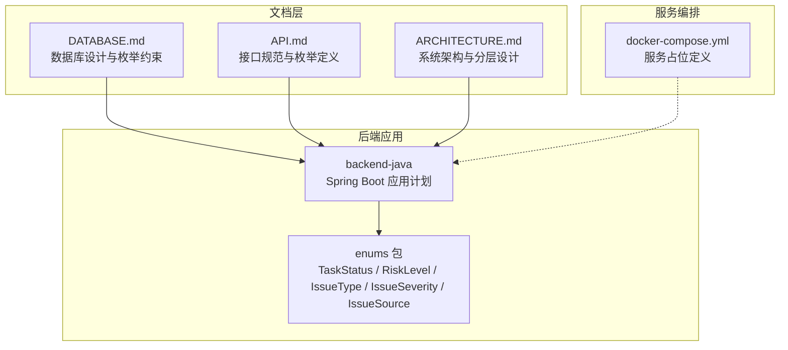
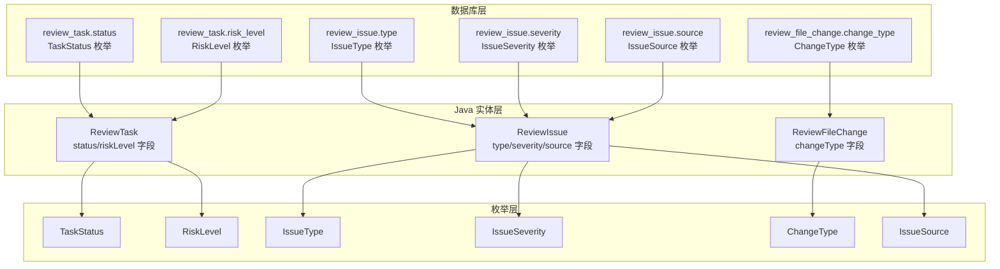
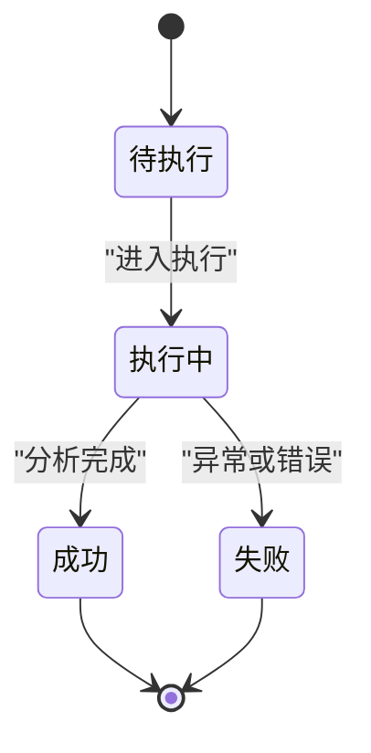
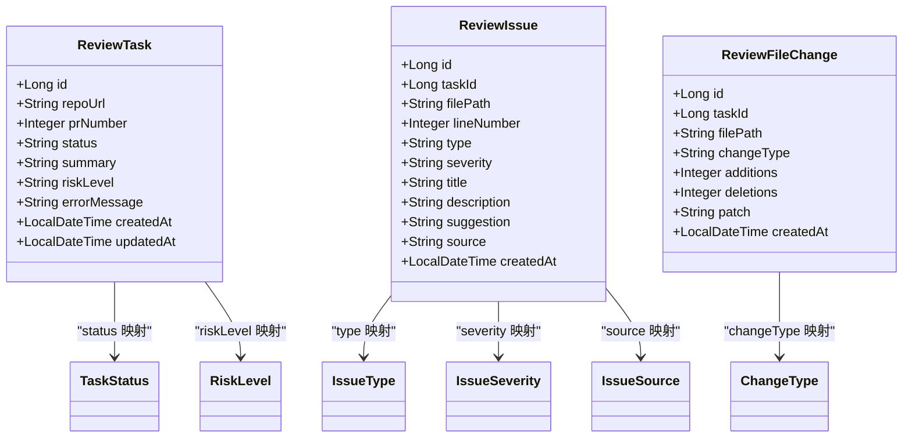
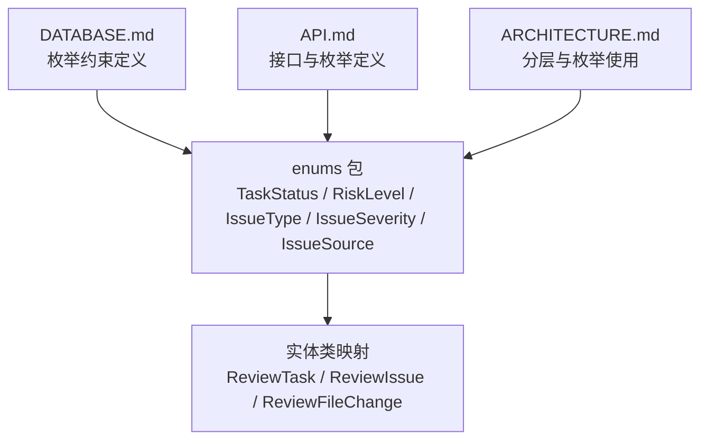

# 枚举值约束

<cite>
**本文档引用的文件**
- [DATABASE.md](file://docs/DATABASE.md)
- [API.md](file://docs/API.md)
- [ARCHITECTURE.md](file://docs/ARCHITECTURE.md)
- [README.md](file://README.md)
- [docker-compose.yml](file://docker-compose.yml)
</cite>

## 目录
1. [简介](#简介)
2. [项目结构](#项目结构)
3. [核心组件](#核心组件)
4. [架构概览](#架构概览)
5. [详细组件分析](#详细组件分析)
6. [依赖分析](#依赖分析)
7. [性能考虑](#性能考虑)
8. [故障排除指南](#故障排除指南)
9. [结论](#结论)

## 简介
本文件系统性梳理 CodeReviewX 项目中数据库层面的枚举值约束设计，覆盖任务状态(TaskStatus)、风险等级(RiskLevel)、问题类型(IssueType)、问题严重程度(IssueSeverity)、变更类型(ChangeType)以及问题来源(IssueSource)等关键枚举。文档基于 Round 01 的数据库设计文档与架构文档，明确各枚举的业务含义、取值范围、相互关系及在 Java 实体类中的映射方式与转换机制，并总结最佳实践与扩展策略，帮助开发者正确使用与维护这些约束条件。

## 项目结构
- 本项目采用多模块结构：
  - backend-java：后端 Spring Boot 应用（计划模块，当前为占位）
  - ai-service：AI 服务（计划模块，当前为占位）
  - frontend：前端界面（计划模块，当前为占位）
  - docs：文档中心，包含数据库设计、API 规范、架构说明等
- 枚举值约束主要体现在数据库设计文档中，Java 层的映射与转换在架构文档中规划。

**图表来源**
- [DATABASE.md:203-254](file://docs/DATABASE.md#L203-L254)
- [API.md:335-377](file://docs/API.md#L335-L377)
- [ARCHITECTURE.md:183-232](file://docs/ARCHITECTURE.md#L183-L232)
- [docker-compose.yml:7-13](file://docker-compose.yml#L7-L13)

**章节来源**
- [README.md:58-82](file://README.md#L58-L82)
- [ARCHITECTURE.md:183-232](file://docs/ARCHITECTURE.md#L183-L232)
- [docker-compose.yml:7-13](file://docker-compose.yml#L7-L13)

## 核心组件
本节对六大枚举进行逐一说明，包括业务含义、取值范围与相互关系，并给出在 Java 实体类中的映射与转换建议。

- TaskStatus（任务状态）
  - 业务含义：表示 Review 任务的生命周期状态，用于跟踪任务从创建到结束的流转过程。
  - 取值范围：PENDING（待执行）、RUNNING（执行中）、SUCCESS（成功）、FAILED（失败）
  - 相互关系：遵循单向流转规则，不可逆向回退；FAILED 状态需伴随错误信息字段。
  - 在 Java 中的映射：实体类字段使用字符串存储，通过枚举进行转换与校验。

- RiskLevel（风险等级）
  - 业务含义：对任务整体风险进行评级，便于用户快速识别任务影响面。
  - 取值范围：LOW（低风险）、MEDIUM（中风险）、HIGH（高风险）
  - 相互关系：与任务结果关联，在任务成功后填充；支持按风险等级筛选与统计。
  - 在 Java 中的映射：实体类字段使用字符串存储，通过枚举进行转换与校验。

- IssueType（问题类型）
  - 业务含义：对分析发现的问题进行分类，便于用户聚焦不同维度的问题。
  - 取值范围：BUG（潜在缺陷）、SECURITY（安全风险）、PERFORMANCE（性能问题）、TEST（测试缺失）、STYLE（代码风格）
  - 相互关系：与问题来源共同决定问题的定位与处理策略。
  - 在 Java 中的映射：实体类字段使用字符串存储，通过枚举进行转换与校验。

- IssueSeverity（问题严重程度）
  - 业务含义：对问题的影响程度进行分级，辅助优先级排序与处置。
  - 取值范围：LOW（低）、MEDIUM（中）、HIGH（高）
  - 相互关系：与问题类型并列，共同构成问题的综合评估维度。
  - 在 Java 中的映射：实体类字段使用字符串存储，通过枚举进行转换与校验。

- ChangeType（变更类型）
  - 业务含义：描述 PR 文件变更的性质，支撑差异分析与影响评估。
  - 取值范围：added（新增）、modified（修改）、deleted（删除）
  - 相互关系：与文件路径、新增/删除行数等字段配合使用。
  - 在 Java 中的映射：实体类字段使用字符串存储，通过枚举进行转换与校验。

- IssueSource（问题来源）
  - 业务含义：标识问题由哪种分析引擎产生，便于溯源与质量评估。
  - 取值范围：LLM（大模型分析）、SEMGREP（静态分析）
  - 相互关系：与问题类型、严重程度共同决定问题的可信度与处理策略。
  - 在 Java 中的映射：实体类字段使用字符串存储，通过枚举进行转换与校验。

**章节来源**
- [DATABASE.md:205-253](file://docs/DATABASE.md#L205-L253)
- [API.md:337-377](file://docs/API.md#L337-L377)
- [ARCHITECTURE.md:209-214](file://docs/ARCHITECTURE.md#L209-L214)

## 架构概览
下图展示枚举值在系统中的分布与使用位置，强调数据库层的约束与 Java 层的映射关系。

**图表来源**
- [DATABASE.md:27-40](file://docs/DATABASE.md#L27-L40)
- [DATABASE.md:64-76](file://docs/DATABASE.md#L64-L76)
- [DATABASE.md:99-116](file://docs/DATABASE.md#L99-L116)
- [ARCHITECTURE.md:209-214](file://docs/ARCHITECTURE.md#L209-L214)

## 详细组件分析

### TaskStatus（任务状态）分析
- 业务含义：贯穿任务生命周期的状态机，确保状态流转的确定性与可审计性。
- 取值范围与规则：
  - PENDING → RUNNING → SUCCESS 或 FAILED
  - FAILED 必须附带错误信息
  - 状态不可逆向回退
- 在 Java 中的映射与转换：
  - 实体类字段使用字符串存储，通过 TaskStatus 枚举进行转换与校验
  - 控制器与服务层在状态更新时严格遵循状态机规则

**图表来源**
- [ARCHITECTURE.md:128-133](file://docs/ARCHITECTURE.md#L128-L133)

**章节来源**
- [DATABASE.md:205-212](file://docs/DATABASE.md#L205-L212)
- [ARCHITECTURE.md:128-133](file://docs/ARCHITECTURE.md#L128-L133)
- [ARCHITECTURE.md:209](file://docs/ARCHITECTURE.md#L209)

### RiskLevel（风险等级）分析
- 业务含义：对任务整体风险进行量化评级，便于用户快速决策。
- 取值范围：LOW/MEDIUM/HIGH
- 在 Java 中的映射与转换：
  - 实体类字段使用字符串存储，通过 RiskLevel 枚举进行转换与校验
  - 支持按风险等级进行筛选与统计

**章节来源**
- [DATABASE.md:214-220](file://docs/DATABASE.md#L214-L220)
- [ARCHITECTURE.md:210](file://docs/ARCHITECTURE.md#L210)

### IssueType（问题类型）分析
- 业务含义：对问题进行分类，便于用户聚焦不同维度的问题（缺陷、安全、性能、测试、风格）。
- 取值范围：BUG/SECURITY/PERFORMANCE/TEST/STYLE
- 在 Java 中的映射与转换：
  - 实体类字段使用字符串存储，通过 IssueType 枚举进行转换与校验

**章节来源**
- [DATABASE.md:222-230](file://docs/DATABASE.md#L222-L230)
- [API.md:354-362](file://docs/API.md#L354-L362)
- [ARCHITECTURE.md:211](file://docs/ARCHITECTURE.md#L211)

### IssueSeverity（问题严重程度）分析
- 业务含义：对问题的影响程度进行分级，辅助优先级排序与处置。
- 取值范围：LOW/MEDIUM/HIGH
- 在 Java 中的映射与转换：
  - 实体类字段使用字符串存储，通过 IssueSeverity 枚举进行转换与校验

**章节来源**
- [DATABASE.md:232-238](file://docs/DATABASE.md#L232-L238)
- [API.md:364-370](file://docs/API.md#L364-L370)
- [ARCHITECTURE.md:211](file://docs/ARCHITECTURE.md#L211)

### ChangeType（变更类型）分析
- 业务含义：描述 PR 文件变更的性质，支撑差异分析与影响评估。
- 取值范围：added/modified/deleted
- 在 Java 中的映射与转换：
  - 实体类字段使用字符串存储，通过 ChangeType 枚举进行转换与校验

**章节来源**
- [DATABASE.md:240-246](file://docs/DATABASE.md#L240-L246)
- [ARCHITECTURE.md:211](file://docs/ARCHITECTURE.md#L211)

### IssueSource（问题来源）分析
- 业务含义：标识问题由哪种分析引擎产生，便于溯源与质量评估。
- 取值范围：LLM/SEMGREP
- 在 Java 中的映射与转换：
  - 实体类字段使用字符串存储，通过 IssueSource 枚举进行转换与校验

**章节来源**
- [DATABASE.md:248-253](file://docs/DATABASE.md#L248-L253)
- [API.md:372-377](file://docs/API.md#L372-L377)
- [ARCHITECTURE.md:214](file://docs/ARCHITECTURE.md#L214)

### Java 实体类映射与转换机制
- 映射规则
  - 数据库字段命名：snake_case（如 task_id）
  - Java 字段命名：camelCase（如 taskId）
  - 使用注解进行显式映射（@TableName、@TableId、@TableField）
- 示例映射
  - ReviewTask：status、riskLevel 字段映射至 TaskStatus、RiskLevel 枚举
  - ReviewIssue：type、severity、source 字段映射至 IssueType、IssueSeverity、IssueSource 枚举
  - ReviewFileChange：changeType 字段映射至 ChangeType 枚举
- 转换机制
  - 在实体类中保留字符串字段，通过枚举进行序列化/反序列化转换
  - 在 DTO 层进行输入校验与输出格式化
  - 在服务层进行状态机与业务规则校验

**图表来源**
- [DATABASE.md:26-40](file://docs/DATABASE.md#L26-L40)
- [DATABASE.md:64-76](file://docs/DATABASE.md#L64-L76)
- [DATABASE.md:99-116](file://docs/DATABASE.md#L99-L116)
- [DATABASE.md:266-284](file://docs/DATABASE.md#L266-L284)
- [ARCHITECTURE.md:209-214](file://docs/ARCHITECTURE.md#L209-L214)

**章节来源**
- [DATABASE.md:257-284](file://docs/DATABASE.md#L257-L284)
- [ARCHITECTURE.md:183-232](file://docs/ARCHITECTURE.md#L183-L232)

## 依赖分析
- 组件耦合
  - 数据库层的枚举约束是系统行为的基础，Java 层通过实体类与枚举进行强约束映射
  - 控制器与服务层依赖枚举进行输入校验与状态机控制
- 外部依赖
  - MyBatis-Plus 提供 ORM 能力，支持注解驱动的字段映射
  - docker-compose 用于服务编排，当前为占位定义

**图表来源**
- [DATABASE.md:203-254](file://docs/DATABASE.md#L203-L254)
- [API.md:335-377](file://docs/API.md#L335-L377)
- [ARCHITECTURE.md:183-232](file://docs/ARCHITECTURE.md#L183-L232)

**章节来源**
- [DATABASE.md:203-254](file://docs/DATABASE.md#L203-L254)
- [API.md:335-377](file://docs/API.md#L335-L377)
- [ARCHITECTURE.md:183-232](file://docs/ARCHITECTURE.md#L183-L232)

## 性能考虑
- 枚举字段长度与索引
  - 枚举字段采用较短定长字符串，有利于索引效率与存储开销控制
  - 建议对常用过滤字段（如 status、severity、type）建立索引以提升查询性能
- 序列化与转换成本
  - 枚举转换在 DTO 层集中处理，减少重复计算
  - 建议缓存常用枚举映射，降低运行时转换开销
- 存储与迁移
  - 枚举值变更需谨慎评估，避免破坏历史数据一致性
  - 迁移时建议采用向后兼容策略，逐步替换旧值

## 故障排除指南
- 常见问题
  - 枚举值不在允许范围内：检查输入是否符合枚举定义，必要时进行白名单校验
  - 状态流转异常：确认状态机规则，确保 FAILED 状态附带错误信息
  - 数据库约束冲突：核对字段类型与长度，确保与枚举定义一致
- 排查步骤
  - 核对数据库层枚举定义与 Java 层映射是否一致
  - 检查 DTO 层的输入校验逻辑
  - 验证服务层的状态机与业务规则实现
- 相关规则
  - FAILED 状态必须同时保存错误信息字段
  - Semgrep 单独失败不强制导致任务 FAILED，可降级为 warning 记录
  - LLM 失败优先使用 mock fallback，fallback 失败后才将任务置为 FAILED

**章节来源**
- [ARCHITECTURE.md:128-133](file://docs/ARCHITECTURE.md#L128-L133)
- [ARCHITECTURE.md:170-179](file://docs/ARCHITECTURE.md#L170-L179)

## 结论
本文件基于 Round 01 的数据库设计与架构规划，系统梳理了 CodeReviewX 项目中的六大枚举值约束及其在 Java 实体类中的映射与转换机制。通过明确的业务含义、取值范围与相互关系，结合状态机规则与最佳实践，有助于开发者在后续开发中正确使用与维护这些约束条件，确保系统的稳定性与可维护性。随着 Round 02+ 的推进，建议逐步完善 Java 层的枚举实现与转换逻辑，并持续优化性能与扩展性。