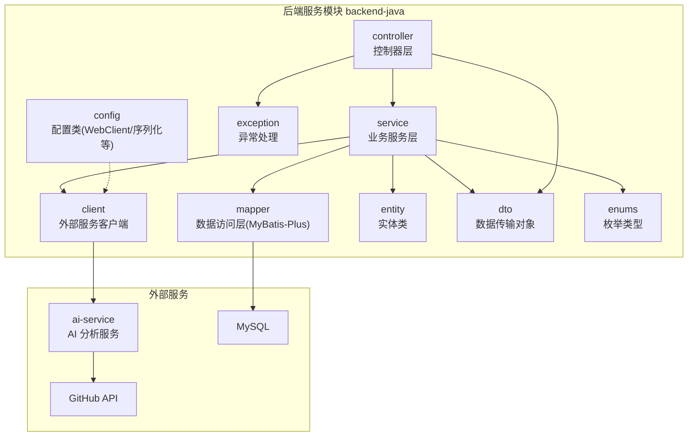
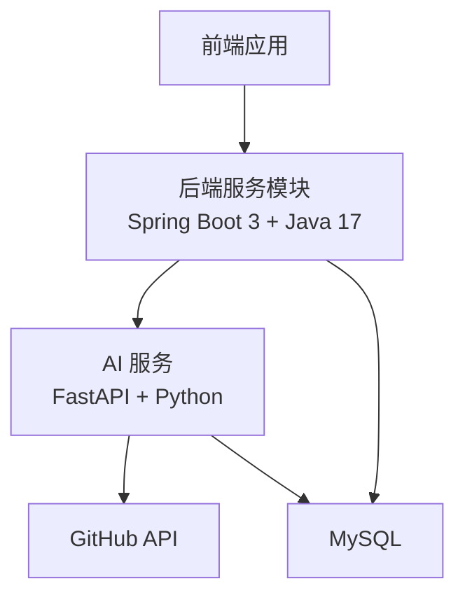
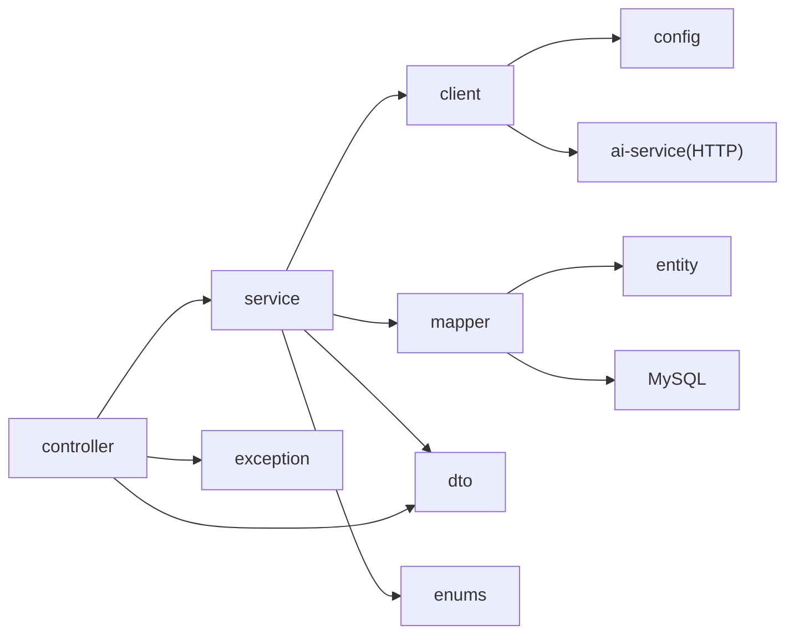

# 项目目录结构

<cite>
**本文引用的文件**
- [README.md](file://README.md)
- [ARCHITECTURE.md](file://docs/ARCHITECTURE.md)
- [API.md](file://docs/API.md)
- [DATABASE.md](file://docs/DATABASE.md)
- [PRD.md](file://docs/PRD.md)
- [AGENT_RULES.md](file://docs/AGENT_RULES.md)
- [HANDOFF_TEMPLATE.md](file://docs/HANDOFF_TEMPLATE.md)
- [.github/workflows/ci.yml](file://.github/workflows/ci.yml)
- [.env.example](file://.env.example)
- [.gitignore](file://.gitignore)
- [docker-compose.yml](file://docker-compose.yml)
- [backend-java/README.md](file://backend-java/README.md)
- [ai-service/README.md](file://ai-service/README.md)
- [frontend/README.md](file://frontend/README.md)
</cite>

## 目录
1. [简介](#简介)
2. [项目结构](#项目结构)
3. [核心组件](#核心组件)
4. [架构总览](#架构总览)
5. [详细组件分析](#详细组件分析)
6. [依赖关系分析](#依赖关系分析)
7. [性能考量](#性能考量)
8. [故障排查指南](#故障排查指南)
9. [结论](#结论)
10. [附录](#附录)

## 简介
本文件面向后端服务模块（backend-java）的目录结构与分层设计，基于计划的包结构（controller、service、client、mapper、entity、dto、enums、exception、config）进行系统化说明。文档解释各包的职责边界、组织原则与协作方式，阐明分层架构的设计理念与模块边界划分，为后续代码实现提供清晰的指导框架。

## 项目结构
- 仓库采用多模块布局，后端服务位于 backend-java，AI 服务位于 ai-service，前端位于 frontend，文档集中于 docs 目录，CI 配置于 .github/workflows，容器编排位于 docker-compose.yml。
- 后端服务模块遵循“控制器-服务-客户端-持久层”的分层结构，配合 DTO、枚举、异常与配置模块，形成清晰的职责边界与可演进的代码组织。

图表来源
- [ARCHITECTURE.md:183-231](file://docs/ARCHITECTURE.md#L183-L231)
- [API.md:54-241](file://docs/API.md#L54-L241)
- [DATABASE.md:20-134](file://docs/DATABASE.md#L20-L134)

章节来源
- [README.md:58-82](file://README.md#L58-L82)
- [ARCHITECTURE.md:183-231](file://docs/ARCHITECTURE.md#L183-L231)
- [API.md:54-241](file://docs/API.md#L54-L241)
- [DATABASE.md:20-134](file://docs/DATABASE.md#L20-L134)

## 核心组件
- 控制器层（controller）：仅负责参数接收、请求校验与响应封装，不包含业务逻辑。
- 业务服务层（service）：编排业务流程、协调外部调用与持久化、处理事务与异常。
- 客户端层（client）：封装对外部服务（ai-service）的 HTTP 调用，统一错误处理与重试策略。
- 数据访问层（mapper）：基于 MyBatis-Plus 的 DAO 层，专注数据库 CRUD。
- 实体层（entity）：与数据库表一一对应，遵循驼峰命名映射。
- DTO 层（dto）：API 请求与响应的数据载体，保持与接口契约一致。
- 枚举层（enums）：集中管理状态、类型、严重程度等枚举值，确保一致性。
- 异常层（exception）：全局异常处理器与业务异常基类，统一错误响应格式。
- 配置层（config）：WebClient、Jackson 序列化、跨域等基础设施配置。

章节来源
- [ARCHITECTURE.md:183-231](file://docs/ARCHITECTURE.md#L183-L231)
- [DATABASE.md:257-284](file://docs/DATABASE.md#L257-L284)

## 架构总览
后端服务模块严格遵循“业务编排 + 数据持久化”的职责边界，通过统一的 REST API 对接前端，内部通过客户端调用 ai-service 获取分析结果，最终将任务、文件变更与问题写入 MySQL。

图表来源
- [ARCHITECTURE.md:19-52](file://docs/ARCHITECTURE.md#L19-L52)
- [API.md:54-241](file://docs/API.md#L54-L241)
- [DATABASE.md:20-134](file://docs/DATABASE.md#L20-L134)

## 详细组件分析

### 控制器层（controller）
- 职责
  - 接收前端请求，进行参数校验与入参 DTO 转换。
  - 调用业务服务执行任务生命周期管理。
  - 统一封装响应，按 API 规范返回数据或错误。
- 设计要点
  - 保持“薄控制器”，所有业务逻辑下沉至 service。
  - 使用 DTO 与 API 文档保持一致，避免直接暴露领域模型。
- 示例参考
  - [创建 Review 任务:56-96](file://docs/API.md#L56-L96)
  - [查询任务列表:99-143](file://docs/API.md#L99-L143)
  - [查询任务详情:145-240](file://docs/API.md#L145-L240)

章节来源
- [API.md:54-241](file://docs/API.md#L54-L241)

### 业务服务层（service）
- 职责
  - 定义并执行 ReviewTask 生命周期内的业务流程。
  - 调用 ai-service 客户端发起分析请求。
  - 将分析结果持久化到数据库，维护任务状态与摘要。
- 设计要点
  - 事务边界明确，异常时回滚并标记 FAILED 状态。
  - 与客户端协作，统一错误处理与降级策略。
- 示例参考
  - [ReviewTask 状态流:110-134](file://docs/ARCHITECTURE.md#L110-L134)
  - [统一错误响应格式:312-332](file://docs/ARCHITECTURE.md#L312-L332)

章节来源
- [ARCHITECTURE.md:110-134](file://docs/ARCHITECTURE.md#L110-L134)
- [ARCHITECTURE.md:312-332](file://docs/ARCHITECTURE.md#L312-L332)

### 客户端层（client）
- 职责
  - 封装 ai-service 的 HTTP 调用，包括请求构建、超时控制与重试。
  - 统一处理网络异常与非 2xx 响应，转换为业务异常。
- 设计要点
  - 使用 WebClient 配置与超时策略，避免阻塞。
  - 与全局异常处理协同，保证错误语义一致。
- 示例参考
  - [ai-service API 设计:243-332](file://docs/API.md#L243-L332)
  - [WebClient 配置](file://docs/ARCHITECTURE.md#L218)

章节来源
- [API.md:243-332](file://docs/API.md#L243-L332)
- [ARCHITECTURE.md](file://docs/ARCHITECTURE.md#L218)

### 数据访问层（mapper）
- 职责
  - 提供 ReviewTask、ReviewFileChange、ReviewIssue 的 CRUD 能力。
  - 与 MyBatis-Plus 注解配合，实现数据库字段与 Java 字段的命名映射。
- 设计要点
  - 使用注解显式映射，避免隐式规则带来的维护成本。
  - 依据数据库索引设计查询条件，保证查询性能。
- 示例参考
  - [表结构与索引:22-134](file://docs/DATABASE.md#L22-L134)
  - [MyBatis-Plus 映射说明:257-284](file://docs/DATABASE.md#L257-L284)

章节来源
- [DATABASE.md:22-134](file://docs/DATABASE.md#L22-L134)
- [DATABASE.md:257-284](file://docs/DATABASE.md#L257-L284)

### 实体层（entity）
- 职责
  - 与数据库表字段一一对应，承载持久化对象。
  - 使用枚举类型表示状态与分类，确保数据一致性。
- 设计要点
  - 字段命名遵循驼峰规则，配合 MyBatis-Plus 注解映射。
  - 时间字段统一使用数据库默认值与自动更新。
- 示例参考
  - [ReviewTask 实体示例:266-284](file://docs/DATABASE.md#L266-L284)

章节来源
- [DATABASE.md:266-284](file://docs/DATABASE.md#L266-L284)

### DTO 层（dto）
- 职责
  - API 请求体与响应体的数据载体，与接口契约保持一致。
  - request 包含入参校验，response 包含对外输出结构。
- 设计要点
  - 与 API 文档严格对齐，避免字段遗漏或冗余。
  - 使用嵌套结构组织复杂响应，提升前端消费体验。
- 示例参考
  - [创建 Review 任务请求体:64-71](file://docs/API.md#L64-L71)
  - [任务详情响应体:159-193](file://docs/API.md#L159-L193)

章节来源
- [API.md:64-71](file://docs/API.md#L64-L71)
- [API.md:159-193](file://docs/API.md#L159-L193)

### 枚举层（enums）
- 职责
  - 集中管理 TaskStatus、RiskLevel、IssueType、IssueSeverity 等枚举值。
  - 为实体与 DTO 提供类型安全的取值范围。
- 设计要点
  - 与数据库枚举值或字符串字段保持一致映射。
  - 通过转换器或注解实现序列化与反序列化的一致性。
- 示例参考
  - [TaskStatus 枚举:337-344](file://docs/API.md#L337-L344)
  - [RiskLevel 枚举:346-353](file://docs/API.md#L346-L353)
  - [IssueType 枚举:354-363](file://docs/API.md#L354-L363)
  - [IssueSeverity 枚举:364-371](file://docs/API.md#L364-L371)

章节来源
- [API.md:335-378](file://docs/API.md#L335-L378)

### 异常层（exception）
- 职责
  - 全局异常处理器统一捕获业务异常与系统异常。
  - 返回统一的错误响应格式，包含错误码、消息与细节。
- 设计要点
  - 业务异常与系统异常区分明确，便于前端与监控处理。
  - 错误码集合与 API 文档保持一致，避免歧义。
- 示例参考
  - [统一错误响应格式:312-332](file://docs/ARCHITECTURE.md#L312-L332)
  - [错误码定义:41-51](file://docs/API.md#L41-L51)

章节来源
- [ARCHITECTURE.md:312-332](file://docs/ARCHITECTURE.md#L312-L332)
- [API.md:41-51](file://docs/API.md#L41-L51)

### 配置层（config）
- 职责
  - 提供 WebClient 配置、Jackson 序列化与反序列化策略。
  - 统一跨域策略与响应包装配置。
- 设计要点
  - 将外部服务基础地址与超时等配置集中管理，便于切换与测试。
  - 与环境变量配合，支持本地与容器化部署。
- 示例参考
  - [WebClient 配置](file://docs/ARCHITECTURE.md#L218)
  - [环境变量示例:6-28](file://.env.example#L6-L28)

章节来源
- [ARCHITECTURE.md](file://docs/ARCHITECTURE.md#L218)
- [.env.example:6-28](file://.env.example#L6-L28)

## 依赖关系分析
- 分层内聚与耦合
  - 控制器仅依赖业务服务；业务服务依赖客户端与持久层；客户端依赖配置与异常；持久层依赖实体与枚举。
- 外部依赖
  - 业务服务依赖 ai-service 的 HTTP 接口；持久层依赖 MySQL；异常处理依赖全局异常处理器。
- 循环依赖规避
  - 通过严格的单向依赖（controller → service → client/mapper → db）避免循环依赖。

图表来源
- [ARCHITECTURE.md:183-231](file://docs/ARCHITECTURE.md#L183-L231)
- [API.md:54-241](file://docs/API.md#L54-L241)
- [DATABASE.md:20-134](file://docs/DATABASE.md#L20-L134)

章节来源
- [ARCHITECTURE.md:183-231](file://docs/ARCHITECTURE.md#L183-L231)
- [API.md:54-241](file://docs/API.md#L54-L241)
- [DATABASE.md:20-134](file://docs/DATABASE.md#L20-L134)

## 性能考量
- 网络调用
  - ai-service 调用应设置合理超时与重试策略，避免阻塞业务线程。
- 数据库访问
  - 基于索引的查询条件设计，减少全表扫描；批量插入与更新时注意事务大小与锁竞争。
- 序列化与反序列化
  - DTO 与枚举的序列化开销较小，但应避免在高频路径上重复构造大型对象。
- 并发与资源
  - 控制并发调用 ai-service 的数量，避免外部服务过载；合理配置连接池与超时时间。

## 故障排查指南
- 常见错误与定位
  - 请求参数错误：检查 DTO 字段与 API 文档一致性，确认必填字段与格式。
  - ai-service 调用失败：检查 WebClient 配置、基础地址与超时设置；查看统一错误响应。
  - 数据库写入失败：检查实体映射、索引与外键约束；确认事务边界与回滚策略。
  - 任务状态异常：核对状态流转规则与错误信息字段，确保 FAILED 状态包含可读错误原因。
- 日志与监控
  - 统一异常处理器输出结构化日志，便于检索与告警。
  - 对 ai-service 调用进行链路追踪，标注请求 ID 与耗时。

章节来源
- [ARCHITECTURE.md:312-332](file://docs/ARCHITECTURE.md#L312-L332)
- [API.md:41-51](file://docs/API.md#L41-L51)

## 结论
后端服务模块的目录结构与分层设计明确了“控制器-服务-客户端-持久层”的职责边界，配合 DTO、枚举、异常与配置模块，形成清晰、可演进且易于维护的代码组织方式。遵循该结构可在后续实现中快速落地业务逻辑，同时保证与前端、AI 服务与数据库的协作顺畅。

## 附录
- 相关文档与规范
  - [产品需求文档（PRD）](file://docs/PRD.md)
  - [系统架构设计](file://docs/ARCHITECTURE.md)
  - [REST API 设计](file://docs/API.md)
  - [数据库设计](file://docs/DATABASE.md)
  - [Agent 协作规则](file://docs/AGENT_RULES.md)
  - [CI 流水线（占位）](file://.github/workflows/ci.yml)
  - [环境变量示例](file://.env.example)
  - [Git 忽略规则](file://.gitignore)
  - [Docker Compose（占位）](file://docker-compose.yml)
  - [后端服务模块 README（占位）](file://backend-java/README.md)
  - [AI 服务模块 README（占位）](file://ai-service/README.md)
  - [前端模块 README（占位）](file://frontend/README.md)