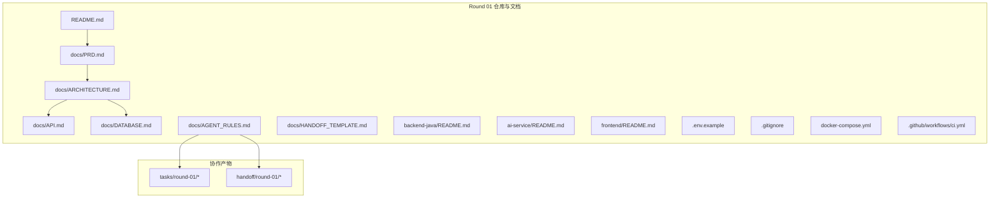
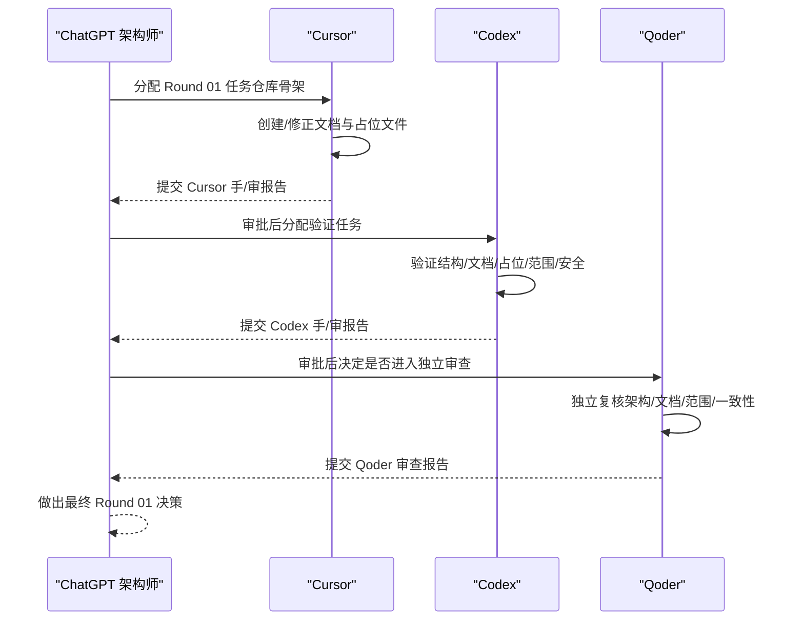
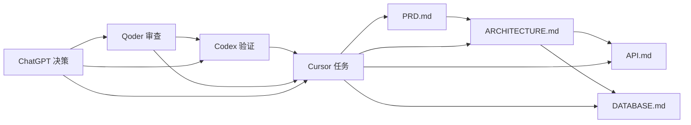

# Agent角色与职责

<cite>
**本文引用的文件**
- [AGENT_RULES.md](file://docs/AGENT_RULES.md)
- [01-cursor-repository-foundation.md](file://tasks/round-01/01-cursor-repository-foundation.md)
- [02-codex-repository-validation.md](file://tasks/round-01/02-codex-repository-validation.md)
- [03-qoder-independent-review.md](file://tasks/round-01/03-qoder-independent-review.md)
- [01-cursor-handoff.md](file://handoff/round-01/01-cursor-handoff.md)
- [02-codex-handoff.md](file://handoff/round-01/02-codex-handoff.md)
- [03-qoder-review.md](file://handoff/round-01/03-qoder-review.md)
- [README.md](file://README.md)
- [PRD.md](file://docs/PRD.md)
- [ARCHITECTURE.md](file://docs/ARCHITECTURE.md)
- [API.md](file://docs/API.md)
- [DATABASE.md](file://docs/DATABASE.md)
</cite>

## 目录
1. [简介](#简介)
2. [项目结构](#项目结构)
3. [核心组件](#核心组件)
4. [架构总览](#架构总览)
5. [详细组件分析](#详细组件分析)
6. [依赖关系分析](#依赖关系分析)
7. [性能考量](#性能考量)
8. [故障排查指南](#故障排查指南)
9. [结论](#结论)
10. [附录](#附录)

## 简介
本文件系统化梳理 CodeReviewX 项目中各 Agent 的角色边界、权限范围与协作流程，围绕“ChatGPT 架构师、Cursor 编码执行、Codex 仓库验证、Qoder 独立审查”四个角色展开，结合 Round 01 的任务文档与手/审报告，明确职责、权限与限制，确保团队协作有序、可审计、可追溯。

## 项目结构
- 项目采用“文档驱动 + Agent 协作”的工程化方式，围绕 PRD、架构、API、数据库四大文档建立共识，配合 Agent 角色与轮次流程，形成“文档—任务—验证—审查—决策”的闭环。
- Round 01 的目标是建立仓库骨架、文档体系、协作规则与占位配置，不引入任何业务实现与真实依赖。

图表来源
- [README.md:58-82](file://README.md#L58-L82)
- [PRD.md:1-218](file://docs/PRD.md#L1-L218)
- [ARCHITECTURE.md:1-417](file://docs/ARCHITECTURE.md#L1-L417)
- [API.md:1-378](file://docs/API.md#L1-L378)
- [DATABASE.md:1-294](file://docs/DATABASE.md#L1-L294)
- [AGENT_RULES.md:1-160](file://docs/AGENT_RULES.md#L1-L160)

章节来源
- [README.md:58-82](file://README.md#L58-L82)
- [AGENT_RULES.md:1-160](file://docs/AGENT_RULES.md#L1-L160)

## 核心组件
- ChatGPT 架构师：项目统筹者，负责需求边界、架构规则、审查标准与最终决策。
- Cursor：主要编码执行 Agent，负责单文件/模块代码生成、小 bug 修复与独立页面创建。
- Codex：仓库级验证 Agent，负责仓库级修改、运行测试、修复 CI 与最小化针对性修复。
- Qoder：独立审查 Agent，负责架构审查、代码审查、风险识别与方案比较。

章节来源
- [AGENT_RULES.md:11-18](file://docs/AGENT_RULES.md#L11-L18)
- [01-cursor-repository-foundation.md:29-38](file://tasks/round-01/01-cursor-repository-foundation.md#L29-L38)
- [02-codex-repository-validation.md:30-42](file://tasks/round-01/02-codex-repository-validation.md#L30-L42)
- [03-qoder-independent-review.md:32-44](file://tasks/round-01/03-qoder-independent-review.md#L32-L44)

## 架构总览
Agent 协作遵循“文档先行、MVP 先行、Mock 先行、单 Agent 修改”的原则，轮次转换严格受 ChatGPT 架构师控制，确保范围可控、过程透明、结果可审。

图表来源
- [AGENT_RULES.md:35-59](file://docs/AGENT_RULES.md#L35-L59)
- [01-cursor-repository-foundation.md:14-26](file://tasks/round-01/01-cursor-repository-foundation.md#L14-L26)
- [02-codex-repository-validation.md:13-27](file://tasks/round-01/02-codex-repository-validation.md#L13-L27)
- [03-qoder-independent-review.md:14-29](file://tasks/round-01/03-qoder-independent-review.md#L14-L29)

## 详细组件分析

### ChatGPT 架构师（项目统筹者）
- 核心职责
  - 需求分析：明确 MVP 范围、目标用户、问题陈述与成功标准。
  - 架构设计：定义模块边界、调用链、分层设计与不引入复杂架构的理由。
  - 审查标准：制定文档覆盖率、API/数据库契约一致性、占位配置安全性的验收准则。
  - 最终决策：基于 Cursor/Codex/Qoder 的报告，决定是否进入下一轮或要求修正。
- 权限范围
  - 更新 PRD、ARCHITECTURE 等关键文档。
  - 决定 Agent 下一步任务与轮次转换。
  - 对 Agent 的越权行为进行纠偏与仲裁。
- 工作限制
  - 不直接修改业务代码或占位配置以外的文件。
  - 不越权分配 Cursor/Codex 的具体实现任务（仅决定轮次与方向）。

章节来源
- [PRD.md:1-218](file://docs/PRD.md#L1-L218)
- [ARCHITECTURE.md:1-417](file://docs/ARCHITECTURE.md#L1-L417)
- [AGENT_RULES.md:11-18](file://docs/AGENT_RULES.md#L11-L18)
- [03-qoder-independent-review.md:32-44](file://tasks/round-01/03-qoder-independent-review.md#L32-L44)

### Cursor（主要编码执行 Agent）
- 职责范围
  - 创建/修正仓库骨架与文档：README、PRD、ARCHITECTURE、API、DATABASE、AGENT_RULES、HANDOFF_TEMPLATE。
  - 创建模块占位文档：backend-java/README.md、ai-service/README.md、frontend/README.md。
  - 创建安全配置占位：.env.example、.gitignore、docker-compose.yml、ci.yml。
  - 严格遵守“文档先行、MVP 先行、Mock 先行、单 Agent 修改”的原则。
- 权限与限制
  - 可创建/修改的任务文件限定在任务文档允许范围内。
  - 禁止引入业务代码、依赖构建文件、真实密钥、真实 Docker 服务、真实 CI 构建、Redis/Kafka/Kubernetes 等未批准技术。
  - 不得直接将仓库交给 Codex 或 Qoder，必须先交由 ChatGPT 审批。
- 职责边界
  - 仅负责“仓库骨架与占位”，不负责“业务实现”。
  - 仅负责“文档与配置”，不负责“验证与审查”。

章节来源
- [01-cursor-repository-foundation.md:29-38](file://tasks/round-01/01-cursor-repository-foundation.md#L29-L38)
- [01-cursor-repository-foundation.md:117-163](file://tasks/round-01/01-cursor-repository-foundation.md#L117-L163)
- [01-cursor-handoff.md:14-78](file://handoff/round-01/01-cursor-handoff.md#L14-L78)
- [AGENT_RULES.md:63-78](file://docs/AGENT_RULES.md#L63-L78)

### Codex（仓库级验证 Agent）
- 职责范围
  - 验证 Cursor 是否正确完成 Round 01 任务：结构、文档、占位配置、范围合规、安全。
  - 最小化修正：仅在明显不符合验收标准时进行必要的、最小的修正（如添加“未实现”状态、修正占位 YAML、移除真实构建步骤）。
  - 不引入新框架、不实现业务逻辑、不扩大项目范围。
- 权限与限制
  - 可读取整个仓库，仅可创建自己的手/审报告。
  - 可修正允许范围内的文件，但不得删除预存规划文件（除非明确指示）。
  - 不得直接进入 Qoder 或推进到 Round 02。
- 职责边界
  - 仅负责“验证与最小修正”，不负责“编码实现”。
  - 仅负责“仓库级合规”，不负责“独立架构审查”。

章节来源
- [02-codex-repository-validation.md:30-42](file://tasks/round-01/02-codex-repository-validation.md#L30-L42)
- [02-codex-repository-validation.md:133-194](file://tasks/round-01/02-codex-repository-validation.md#L133-L194)
- [02-codex-handoff.md:13-75](file://handoff/round-01/02-codex-handoff.md#L13-L75)
- [AGENT_RULES.md:79-89](file://docs/AGENT_RULES.md#L79-L89)

### Qoder（独立审查 Agent）
- 职责范围
  - 独立复核：仓库结构、文档质量、模块边界、API/数据库契约一致性、占位安全与范围合规。
  - 风险识别：识别架构歧义、文档不一致、手/审报告一致性问题与仓库卫生问题。
  - 方案比较：对比不同实现方案的优劣，提出非侵入性改进建议。
- 权限与限制
  - 仅可读取，不可修改任何文件。
  - 不得直接分配任务给 Cursor/Codex 或进入 Round 02。
  - 不得引入新的技术或架构扩展。
- 职责边界
  - 仅负责“独立审查”，不负责“编码与验证”。
  - 仅负责“质量与一致性”，不负责“实现与修复”。

章节来源
- [03-qoder-independent-review.md:32-44](file://tasks/round-01/03-qoder-independent-review.md#L32-L44)
- [03-qoder-independent-review.md:441-458](file://tasks/round-01/03-qoder-independent-review.md#L441-L458)
- [03-qoder-review.md:15-22](file://handoff/round-01/03-qoder-review.md#L15-L22)
- [AGENT_RULES.md:90-94](file://docs/AGENT_RULES.md#L90-L94)

## 依赖关系分析
- 文档驱动：PRD、ARCHITECTURE、API、DATABASE 为 Cursor/Codex/Qoder 的共同输入，确保三方理解一致。
- Agent 顺序：Cursor → Codex → Qoder → ChatGPT 决策，每一步都以报告为依据，避免越权与重复劳动。
- 范围控制：通过“占位配置 + 安全规则 + 禁止项清单”确保 Round 01 不引入真实实现与未批准技术。

图表来源
- [PRD.md:1-218](file://docs/PRD.md#L1-L218)
- [ARCHITECTURE.md:1-417](file://docs/ARCHITECTURE.md#L1-L417)
- [API.md:1-378](file://docs/API.md#L1-L378)
- [DATABASE.md:1-294](file://docs/DATABASE.md#L1-L294)
- [01-cursor-repository-foundation.md:14-26](file://tasks/round-01/01-cursor-repository-foundation.md#L14-L26)
- [02-codex-repository-validation.md:13-27](file://tasks/round-01/02-codex-repository-validation.md#L13-L27)
- [03-qoder-independent-review.md:14-29](file://tasks/round-01/03-qoder-independent-review.md#L14-L29)

章节来源
- [AGENT_RULES.md:22-32](file://docs/AGENT_RULES.md#L22-L32)
- [01-cursor-repository-foundation.md:117-163](file://tasks/round-01/01-cursor-repository-foundation.md#L117-L163)
- [02-codex-repository-validation.md:133-194](file://tasks/round-01/02-codex-repository-validation.md#L133-L194)
- [03-qoder-independent-review.md:441-458](file://tasks/round-01/03-qoder-independent-review.md#L441-L458)

## 性能考量
- Round 01 不涉及真实构建与运行，因此性能关注点在于“验证效率与一致性”。Codex 的最小修正策略与 Qoder 的独立复核，能在不引入真实负载的前提下，快速收敛问题并提升文档质量。
- 占位配置的安全性与语法正确性（如 docker-compose.yml、ci.yml）直接影响后续轮次的可执行性，建议在后续轮次中逐步替换为真实配置。

## 故障排查指南
- Cursor 未按任务范围执行
  - 现象：引入了 Spring Boot/FastAPI 源码、前端页面、数据库迁移、真实密钥、真实 Docker 服务或 CI 构建。
  - 排查：对照任务文档的“Allowed Scope”与“Forbidden Actions”，核对 Cursor 手/审报告与实际文件。
  - 处理：Codex 应拒绝通过并要求 Cursor 修正；ChatGPT 审批后再进入验证。
- Codex 修正过度或越权
  - 现象：Codex 修改了 PRD/ARCHITECTURE 等应由 ChatGPT 更新的文档。
  - 排查：检查 Codex 手/审报告中的“修正文件清单”与“最小修正政策”。
  - 处理：ChatGPT 应纠正 Codex 的越权行为，并重申 PRD/ARCHITECTURE 的更新权限归属。
- Qoder 报告与事实不符
  - 现象：Qoder 报告中提及的旧规划文件在当前工作区不存在。
  - 排查：核对 Cursor/Codex 手/审报告与实际文件树，确认工作区基线一致性。
  - 处理：ChatGPT 应澄清工作区基线，避免后续轮次出现基线漂移。
- 占位配置不安全或不合规
  - 现象：.env.example 包含真实密钥、docker-compose.yml 定义真实服务、ci.yml 执行真实构建。
  - 排查：使用任务文档提供的“建议命令”进行扫描与验证。
  - 处理：Codex 应最小化修正为占位配置；若发现真实密钥，应立即要求 Cursor 重新生成占位文件。

章节来源
- [01-cursor-repository-foundation.md:144-163](file://tasks/round-01/01-cursor-repository-foundation.md#L144-L163)
- [02-codex-repository-validation.md:486-516](file://tasks/round-01/02-codex-repository-validation.md#L486-L516)
- [03-qoder-independent-review.md:441-458](file://tasks/round-01/03-qoder-independent-review.md#L441-L458)
- [02-codex-handoff.md:117-124](file://handoff/round-01/02-codex-handoff.md#L117-L124)
- [03-qoder-review.md:146-151](file://handoff/round-01/03-qoder-review.md#L146-L151)

## 结论
- ChatGPT 架构师通过 PRD/ARCHITECTURE/AGENT_RULES 等文档确立需求边界与协作规则，确保各 Agent 各司其职。
- Cursor 专注于“仓库骨架与占位”，Codex 专注于“验证与最小修正”，Qoder 专注于“独立审查与一致性复核”，ChatGPT 作为最终决策者把控轮次转换与范围变更。
- Round 01 的成功关键在于：文档质量、范围控制、占位安全与三方报告的一致性。后续轮次应在确保这些前提下，逐步替换为真实实现。

## 附录
- 术语
  - MVP：最小可行产品，强调核心链路与可演示性。
  - 占位：Round 01 中的占位配置与文档，明确“计划但未实现”，避免真实依赖。
  - 轮次：Round 01/02/…，每轮围绕特定任务与产出物推进。
- 参考文件
  - [AGENT_RULES.md:1-160](file://docs/AGENT_RULES.md#L1-L160)
  - [01-cursor-repository-foundation.md:1-712](file://tasks/round-01/01-cursor-repository-foundation.md#L1-L712)
  - [02-codex-repository-validation.md:1-649](file://tasks/round-01/02-codex-repository-validation.md#L1-L649)
  - [03-qoder-independent-review.md:1-667](file://tasks/round-01/03-qoder-independent-review.md#L1-L667)
  - [01-cursor-handoff.md:1-202](file://handoff/round-01/01-cursor-handoff.md#L1-L202)
  - [02-codex-handoff.md:1-138](file://handoff/round-01/02-codex-handoff.md#L1-L138)
  - [03-qoder-review.md:1-229](file://handoff/round-01/03-qoder-review.md#L1-L229)