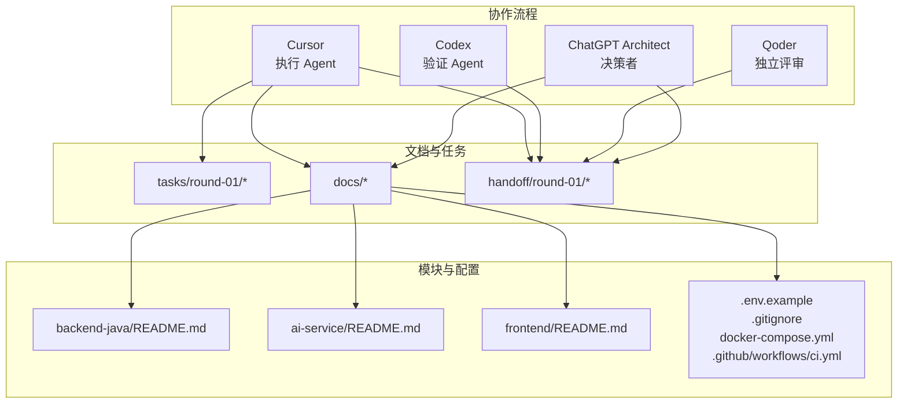
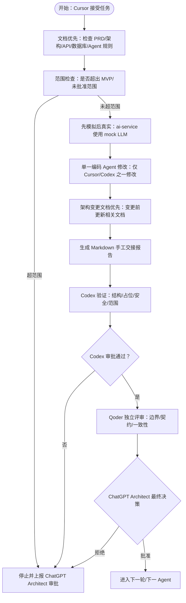
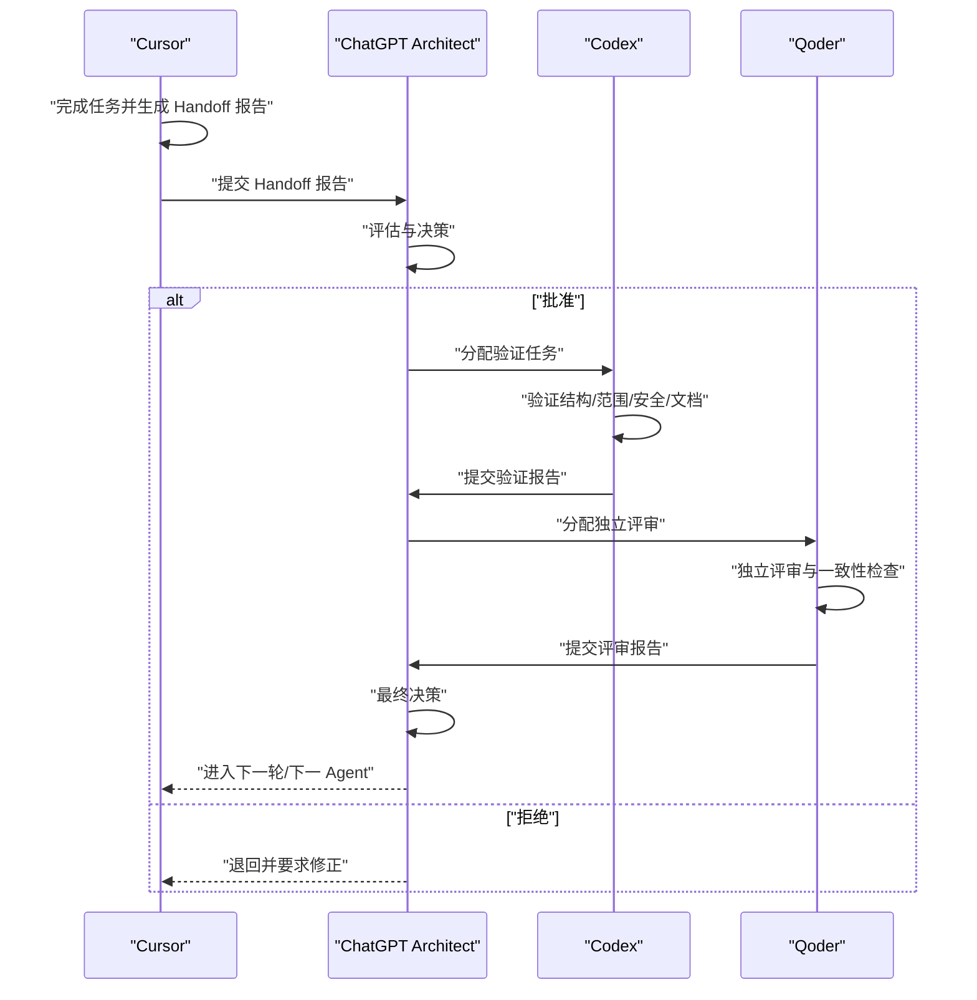
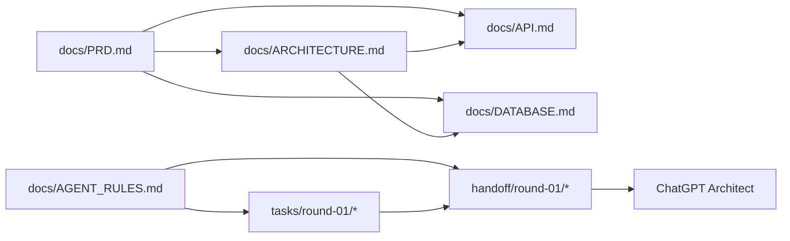

# 协作原则与规范

<cite>
**本文档引用的文件**
- [README.md](file://README.md)
- [docs/AGENT_RULES.md](file://docs/AGENT_RULES.md)
- [docs/HANDOFF_TEMPLATE.md](file://docs/HANDOFF_TEMPLATE.md)
- [docs/PRD.md](file://docs/PRD.md)
- [docs/ARCHITECTURE.md](file://docs/ARCHITECTURE.md)
- [tasks/round-01/01-cursor-repository-foundation.md](file://tasks/round-01/01-cursor-repository-foundation.md)
- [tasks/round-01/02-codex-repository-validation.md](file://tasks/round-01/02-codex-repository-validation.md)
- [tasks/round-01/03-qoder-independent-review.md](file://tasks/round-01/03-qoder-independent-review.md)
- [handoff/round-01/01-cursor-handoff.md](file://handoff/round-01/01-cursor-handoff.md)
- [handoff/round-01/02-codex-handoff.md](file://handoff/round-01/02-codex-handoff.md)
- [handoff/round-01/03-qoder-review.md](file://handoff/round-01/03-qoder-review.md)
</cite>

## 目录
1. [简介](#简介)
2. [项目结构](#项目结构)
3. [核心组件](#核心组件)
4. [架构总览](#架构总览)
5. [详细组件分析](#详细组件分析)
6. [依赖关系分析](#依赖关系分析)
7. [性能考虑](#性能考虑)
8. [故障排查指南](#故障排查指南)
9. [结论](#结论)
10. [附录](#附录)

## 简介
本文件为 CodeReviewX 多 Agent 协作的“七大协作原则”与“规范”的权威说明，基于 Round 01 的仓库基础建设实践，总结并固化了从 Cursor（执行）、Codex（验证）、Qoder（独立评审）到 ChatGPT Architect（决策）的协作流程与质量保障机制。文档不仅阐述原则与规则，还提供实施指导、例外与违规后果、冲突解决与决策流程、以及绩效评估标准，帮助团队建立清晰的行为准则与最佳实践。

## 项目结构
CodeReviewX 采用“文档驱动 + 任务驱动 + 手工交接”的协作模式，围绕 Round 01 的仓库基础建设形成完整的协作闭环：
- 任务文档：定义每轮任务的目标、范围、验收与检查清单
- 手工交接报告：标准化的 Markdown 报告，确保信息可追溯、可审计
- 文档系统：PRD、架构、API、数据库、Agent 规则、交接模板
- 模块 README：明确职责边界与 Round 01 状态
- 占位配置：安全的 .env.example、.gitignore、docker-compose.yml、CI 工作流

图表来源
- [docs/AGENT_RULES.md:35-57](file://docs/AGENT_RULES.md#L35-L57)
- [tasks/round-01/01-cursor-repository-foundation.md:87-113](file://tasks/round-01/01-cursor-repository-foundation.md#L87-L113)
- [README.md:58-82](file://README.md#L58-L82)

章节来源
- [README.md:58-82](file://README.md#L58-L82)
- [docs/AGENT_RULES.md:35-57](file://docs/AGENT_RULES.md#L35-L57)
- [tasks/round-01/01-cursor-repository-foundation.md:87-113](file://tasks/round-01/01-cursor-repository-foundation.md#L87-L113)

## 核心组件
- Cursor：主要的功能编码 Agent，负责单文件/单模块的实现与最小修复，不得引入未批准的技术或业务逻辑
- Codex：仓库级验证与最小修正 Agent，负责范围合规、占位配置正确性与安全检查
- Qoder：独立评审 Agent，负责跨文档一致性、模块边界与契约一致性审查
- ChatGPT Architect：最终决策者，负责角色边界、变更审批、轮次推进与最终放行

章节来源
- [docs/AGENT_RULES.md:9-18](file://docs/AGENT_RULES.md#L9-L18)
- [tasks/round-01/01-cursor-repository-foundation.md:29-38](file://tasks/round-01/01-cursor-repository-foundation.md#L29-L38)
- [tasks/round-01/02-codex-repository-validation.md:30-41](file://tasks/round-01/02-codex-repository-validation.md#L30-L41)
- [tasks/round-01/03-qoder-independent-review.md:1-229](file://tasks/round-01/03-qoder-independent-review.md#L1-L229)

## 架构总览
协作原则与规范的落地依赖于以下架构要素：
- 文档优先：PRD、架构、API、数据库、Agent 规则、交接模板先行
- MVP 优先：超出 MVP 的功能不得在未更新 PRD 的情况下实现
- 先模拟后真实：ai-service 必须先支持 mock LLM，再接入真实 LLM
- 单一编码 Agent 修改：同一模块的并发修改禁止
- 架构变更文档优先：模块边界与 API 合同变更需先更新文档再编码
- 未批准范围扩展禁止：未在 PRD 中定义的功能、依赖、模块不得引入
- 手交文件 Markdown 格式：Agent 间传递的文件必须为 Markdown

图表来源
- [docs/AGENT_RULES.md:22-31](file://docs/AGENT_RULES.md#L22-L31)
- [docs/PRD.md:109-116](file://docs/PRD.md#L109-L116)
- [docs/ARCHITECTURE.md:7-16](file://docs/ARCHITECTURE.md#L7-L16)
- [tasks/round-01/01-cursor-repository-foundation.md:144-162](file://tasks/round-01/01-cursor-repository-foundation.md#L144-L162)
- [tasks/round-01/02-codex-repository-validation.md:173-194](file://tasks/round-01/02-codex-repository-validation.md#L173-L194)
- [tasks/round-01/03-qoder-independent-review.md:156-190](file://tasks/round-01/03-qoder-independent-review.md#L156-L190)

## 详细组件分析

### 文档优先原则
- 定义：在任何业务代码实现之前，必须完成 PRD、架构设计、API 设计、数据库设计与 Agent 规则的文档化与评审
- 实施要点
  - Cursor 在 Round 01 中创建并完善 PRD、ARCHITECTURE、API、DATABASE、AGENT_RULES、HANDOFF_TEMPLATE
  - Codex 在 Round 01 中验证文档完整性与一致性，确保 PRD 的 MVP 范围、API 的“Planned only”状态、数据库为逻辑设计
  - Qoder 在 Round 01 中独立复核文档一致性与边界清晰度
- 例外与违规后果
  - 例外：文档修订需经 ChatGPT Architect 授权；PRD/ARCHITECTURE 的重大变更需先更新文档再编码
  - 违规后果：引入业务代码或真实配置即视为违反“文档优先”，需回滚并重新走文档修订流程

章节来源
- [docs/AGENT_RULES.md:22-25](file://docs/AGENT_RULES.md#L22-L25)
- [tasks/round-01/01-cursor-repository-foundation.md:166-188](file://tasks/round-01/01-cursor-repository-foundation.md#L166-L188)
- [tasks/round-01/02-codex-repository-validation.md:248-367](file://tasks/round-01/02-codex-repository-validation.md#L248-L367)
- [tasks/round-01/03-qoder-independent-review.md:89-105](file://tasks/round-01/03-qoder-independent-review.md#L89-L105)

### MVP 优先原则
- 定义：超出 PRD 中定义的 MVP 范围的功能不得引入，除非 PRD 已更新
- 实施要点
  - Round 01 中明确“无业务逻辑”“无真实 CI/构建/依赖/密钥”
  - Codex 的验收清单中明确“无 Spring Boot/FastAPI/前端页面/数据库迁移/GitHub API/Semgrep/LLM 集成”
- 例外与违规后果
  - 例外：ChatGPT Architect 授权的 PRD 变更
  - 违规后果：立即停止并退回上一 Agent，重新走变更流程

章节来源
- [docs/AGENT_RULES.md:25-26](file://docs/AGENT_RULES.md#L25-L26)
- [tasks/round-01/01-cursor-repository-foundation.md:144-162](file://tasks/round-01/01-cursor-repository-foundation.md#L144-L162)
- [tasks/round-01/02-codex-repository-validation.md:518-544](file://tasks/round-01/02-codex-repository-validation.md#L518-L544)

### 先模拟后真实原则
- 定义：ai-service 必须先与 mock LLM 工作，再接入真实 LLM
- 实施要点
  - ARCHITECTURE 明确“所有 AI 能力必须先有 mock fallback，再接入真实 LLM”
  - Round 01 中 ai-service 的 Review JSON 为“Planned only”
- 例外与违规后果
  - 例外：ChatGPT Architect 授权的 LLM 方案变更
  - 违规后果：退回并要求先实现 mock 能力并通过验收

章节来源
- [docs/AGENT_RULES.md:26-27](file://docs/AGENT_RULES.md#L26-L27)
- [docs/ARCHITECTURE.md:7-16](file://docs/ARCHITECTURE.md#L7-L16)
- [tasks/round-01/01-cursor-repository-foundation.md:520-556](file://tasks/round-01/01-cursor-repository-foundation.md#L520-L556)

### 单一编码 Agent 修改原则
- 定义：同一模块的并发修改禁止，避免冲突与状态不一致
- 实施要点
  - Cursor/Codex/Qoder 的文件范围与职责边界明确
  - Round 01 中 Cursor 的任务范围限定为“per-task scope”，Codex 的修正范围限定为“最小修正”
- 例外与违规后果
  - 例外：ChatGPT Architect 授权的跨模块联调
  - 违规后果：冲突回滚、责任划分与绩效评估扣分

章节来源
- [docs/AGENT_RULES.md:27-28](file://docs/AGENT_RULES.md#L27-L28)
- [tasks/round-01/01-cursor-repository-foundation.md:63-78](file://tasks/round-01/01-cursor-repository-foundation.md#L63-L78)
- [tasks/round-01/02-codex-repository-validation.md:133-142](file://tasks/round-01/02-codex-repository-validation.md#L133-L142)

### 架构变更文档优先原则
- 定义：模块边界或 API 合同变更需先更新相关文档，再进行编码
- 实施要点
  - AGENT_RULES 明确“架构变更更新文档优先”
  - PRD/ARCHITECTURE 的更新需经 ChatGPT Architect 评估
- 例外与违规后果
  - 例外：紧急修复且 ChatGPT Architect 紧急授权
  - 违规后果：回滚变更并补签文档修订流程

章节来源
- [docs/AGENT_RULES.md:28-29](file://docs/AGENT_RULES.md#L28-L29)
- [docs/PRD.md:209-217](file://docs/PRD.md#L209-L217)

### 未批准范围扩展禁止原则
- 定义：未在 PRD 中定义的功能、依赖、模块不得引入
- 实施要点
  - Round 01 的“Forbidden Actions”清单明确禁止引入未批准依赖与真实实现
  - Codex 的“Minimal Fix Policy”强调“任何修改必须在 Round 01 范围内”
- 例外与违规后果
  - 例外：ChatGPT Architect 授权的 PRD 变更
  - 违规后果：立即停止并退回上一 Agent

章节来源
- [docs/AGENT_RULES.md:29-30](file://docs/AGENT_RULES.md#L29-L30)
- [tasks/round-01/01-cursor-repository-foundation.md:144-162](file://tasks/round-01/01-cursor-repository-foundation.md#L144-L162)
- [tasks/round-01/02-codex-repository-validation.md:486-515](file://tasks/round-01/02-codex-repository-validation.md#L486-L515)

### 手交文件 Markdown 格式原则
- 定义：Agent 间传递的所有文件必须使用 Markdown 格式
- 实施要点
  - HANDOFF_TEMPLATE 提供标准 10 节结构
  - AGENT_RULES 明确“所有手交文件使用 Markdown”
- 例外与违规后果
  - 例外：外部归档可导出 PDF（非 Agent 使用）
  - 违规后果：退回并要求按模板重写

章节来源
- [docs/AGENT_RULES.md:30-31](file://docs/AGENT_RULES.md#L30-L31)
- [docs/HANDOFF_TEMPLATE.md:1-128](file://docs/HANDOFF_TEMPLATE.md#L1-L128)

### Agent 间沟通协议、协作边界与质量保证流程
- 沟通协议
  - 严禁 Agent 直接相互交接；所有交接必须经 ChatGPT Architect 决策
  - 交接流程：Cursor → Architect → Codex → Architect → Qoder → Architect
- 协作边界
  - Cursor：单文件/单模块实现与最小修复
  - Codex：仓库级验证与最小修正
  - Qoder：独立评审与一致性检查
  - Architect：最终决策与变更审批
- 质量保证
  - 结构检查：14 个必需文件是否存在
  - 范围检查：无业务代码、无真实密钥、无真实 Docker/CI
  - 安全检查：.env.example 仅占位、.gitignore 正确保护
  - 文档一致性：PRD/ARCHITECTURE/API/DATABASE/AGENT_RULES 之间的一致性

图表来源
- [docs/AGENT_RULES.md:35-57](file://docs/AGENT_RULES.md#L35-L57)
- [tasks/round-01/01-cursor-repository-foundation.md:13-26](file://tasks/round-01/01-cursor-repository-foundation.md#L13-L26)
- [tasks/round-01/02-codex-repository-validation.md:13-27](file://tasks/round-01/02-codex-repository-validation.md#L13-L27)
- [tasks/round-01/03-qoder-independent-review.md:1-229](file://tasks/round-01/03-qoder-independent-review.md#L1-L229)

### 冲突解决机制与决策流程
- 冲突解决
  - Cursor 与 Codex 的不一致：以 Codex 的最小修正为准，Qoder 独立复核
  - 文档与任务的不一致：以最新 PRD/ARCHITECTURE 为准，ChatGPT Architect 仲裁
- 决策流程
  - ChatGPT Architect 依据 Handoff 报告与独立评审意见做出最终决定
  - 重大变更需重新走 PRD 更新与评审流程

章节来源
- [tasks/round-01/03-qoder-independent-review.md:127-154](file://tasks/round-01/03-qoder-independent-review.md#L127-L154)
- [docs/PRD.md:209-217](file://docs/PRD.md#L209-L217)

### 绩效评估标准
- 评估维度
  - 范围控制：是否引入未批准范围
  - 文档质量：是否遵循文档优先与一致性
  - 安全合规：是否暴露真实密钥或敏感信息
  - 交接质量：Handoff 报告是否完整、准确、可追溯
- 评估方式
  - Codex 的验收清单与最小修正记录
  - Qoder 的独立评审结论与改进建议
  - ChatGPT Architect 的最终决策与变更记录

章节来源
- [tasks/round-01/02-codex-repository-validation.md:518-561](file://tasks/round-01/02-codex-repository-validation.md#L518-L561)
- [tasks/round-01/03-qoder-independent-review.md:156-225](file://tasks/round-01/03-qoder-independent-review.md#L156-L225)

## 依赖关系分析
- 文档与任务的依赖
  - PRD 决定 MVP 范围与成功标准
  - ARCHITECTURE 定义模块边界与调用链
  - API/DATABASE 为后续实现提供契约与数据模型
  - AGENT_RULES 与 HANDOFF_TEMPLATE 为协作提供规范与工具
- Agent 间的依赖
  - Cursor 依赖任务文档与 Agent 规则
  - Codex 依赖 Cursor 的 Handoff 报告与任务文档
  - Qoder 依赖 Codex 的验证结论与独立评审模板
  - Architect 依赖三份报告与变更管理流程

图表来源
- [docs/PRD.md:1-218](file://docs/PRD.md#L1-L218)
- [docs/ARCHITECTURE.md:1-417](file://docs/ARCHITECTURE.md#L1-L417)
- [docs/AGENT_RULES.md:1-160](file://docs/AGENT_RULES.md#L1-L160)
- [docs/HANDOFF_TEMPLATE.md:1-128](file://docs/HANDOFF_TEMPLATE.md#L1-L128)

章节来源
- [docs/PRD.md:1-218](file://docs/PRD.md#L1-L218)
- [docs/ARCHITECTURE.md:1-417](file://docs/ARCHITECTURE.md#L1-L417)
- [docs/AGENT_RULES.md:1-160](file://docs/AGENT_RULES.md#L1-L160)
- [docs/HANDOFF_TEMPLATE.md:1-128](file://docs/HANDOFF_TEMPLATE.md#L1-L128)

## 性能考虑
- 协作效率
  - 严格的轮次与交接顺序减少上下文切换与返工
  - 标准化 Handoff 模板降低沟通成本
- 质量保障
  - 多轮验证与独立评审降低缺陷流入下一阶段的概率
  - 文档优先与范围控制避免“技术债”积累

## 故障排查指南
- 常见问题
  - 未按 Handoff 模板填写：退回并要求按模板重写
  - 引入未批准范围：立即停止并退回上一 Agent
  - 文档与任务不一致：以最新 PRD/ARCHITECTURE 为准，ChatGPT Architect 仲裁
- 排查步骤
  - 结构检查：确认 14 个必需文件是否存在
  - 范围检查：扫描业务源码、依赖/构建文件、密钥
  - 安全检查：确认 .env.example 仅占位、.gitignore 正确保护
  - 文档一致性：交叉比对 PRD/ARCHITECTURE/API/DATABASE/AGENT_RULES

章节来源
- [tasks/round-01/02-codex-repository-validation.md:429-484](file://tasks/round-01/02-codex-repository-validation.md#L429-L484)
- [tasks/round-01/03-qoder-independent-review.md:108-125](file://tasks/round-01/03-qoder-independent-review.md#L108-L125)

## 结论
CodeReviewX 的多 Agent 协作以“七大协作原则”为核心，辅以严格的文档优先、范围控制、安全合规与标准化交接流程，形成了可复制、可审计、可演进的协作范式。通过 Cursor 的执行、Codex 的验证、Qoder 的独立评审与 ChatGPT Architect 的最终决策，团队能够在 Round 01 基础上稳健推进后续轮次，确保系统设计与实现的一致性与可维护性。

## 附录
- 术语
  - MVP：最小可行产品，定义在 PRD 中
  - 占位配置：Round 01 中的安全占位文件，非真实实现
  - Handoff 报告：标准化的 Markdown 交接文档
- 参考文件
  - [docs/PRD.md](file://docs/PRD.md)
  - [docs/ARCHITECTURE.md](file://docs/ARCHITECTURE.md)
  - [docs/AGENT_RULES.md](file://docs/AGENT_RULES.md)
  - [docs/HANDOFF_TEMPLATE.md](file://docs/HANDOFF_TEMPLATE.md)
  - [tasks/round-01/01-cursor-repository-foundation.md](file://tasks/round-01/01-cursor-repository-foundation.md)
  - [tasks/round-01/02-codex-repository-validation.md](file://tasks/round-01/02-codex-repository-validation.md)
  - [tasks/round-01/03-qoder-independent-review.md](file://tasks/round-01/03-qoder-independent-review.md)
  - [handoff/round-01/01-cursor-handoff.md](file://handoff/round-01/01-cursor-handoff.md)
  - [handoff/round-01/02-codex-handoff.md](file://handoff/round-01/02-codex-handoff.md)
  - [handoff/round-01/03-qoder-review.md](file://handoff/round-01/03-qoder-review.md)