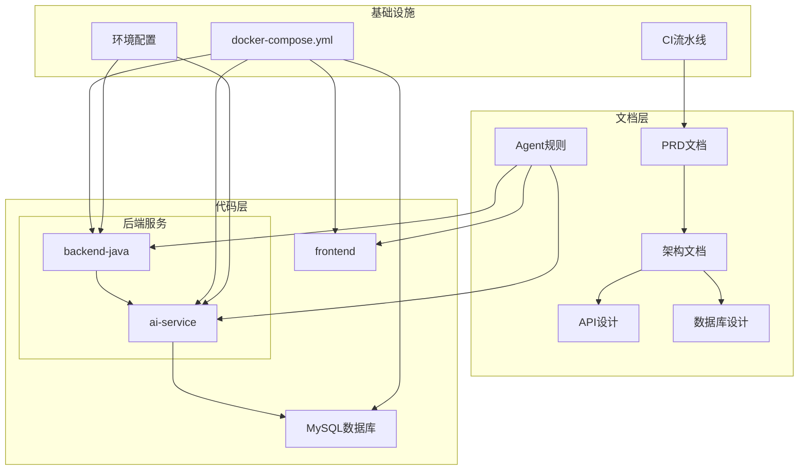
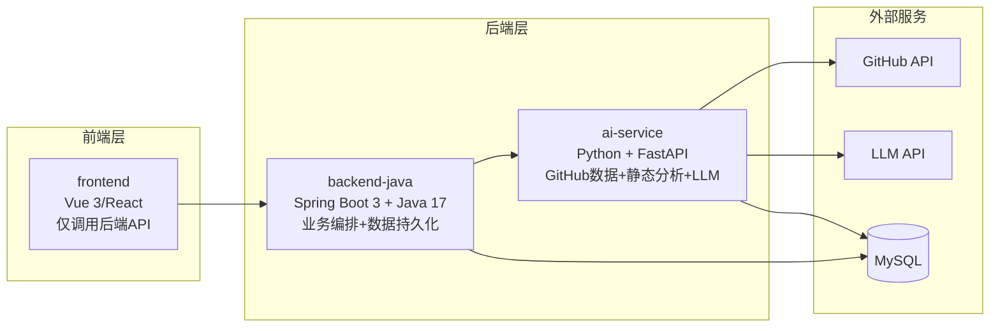
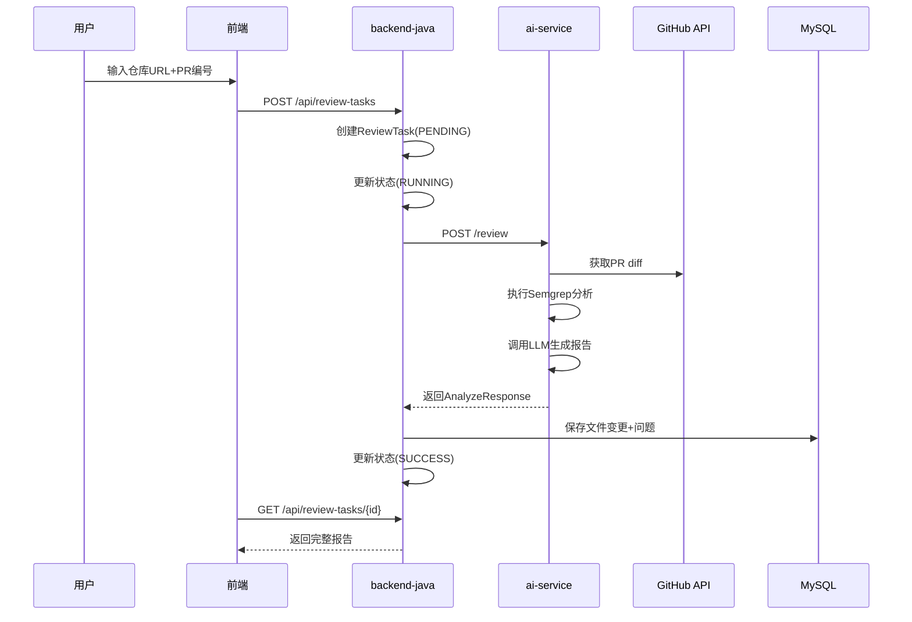
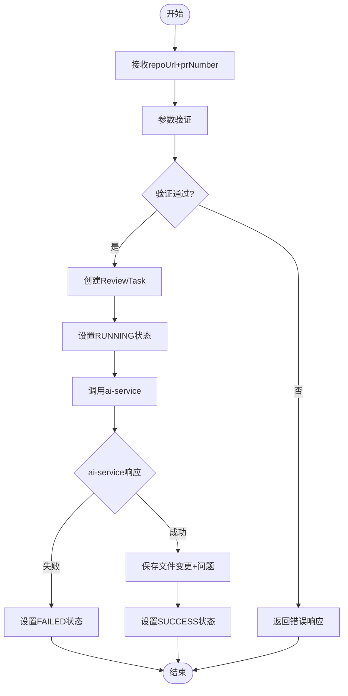
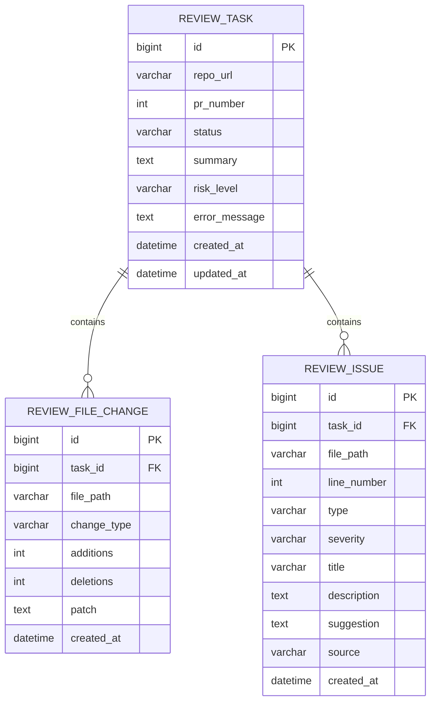
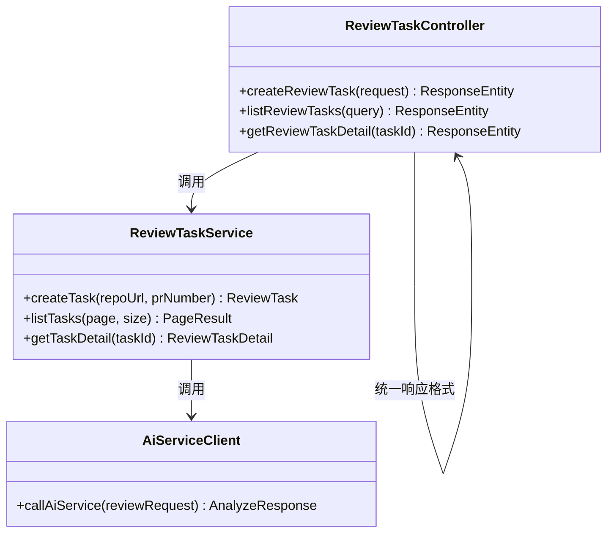
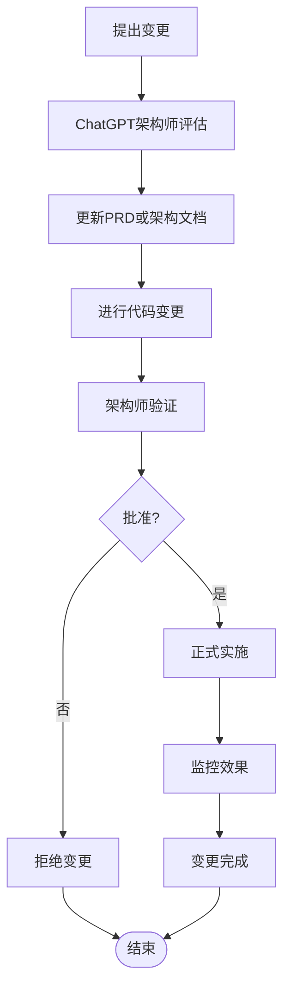
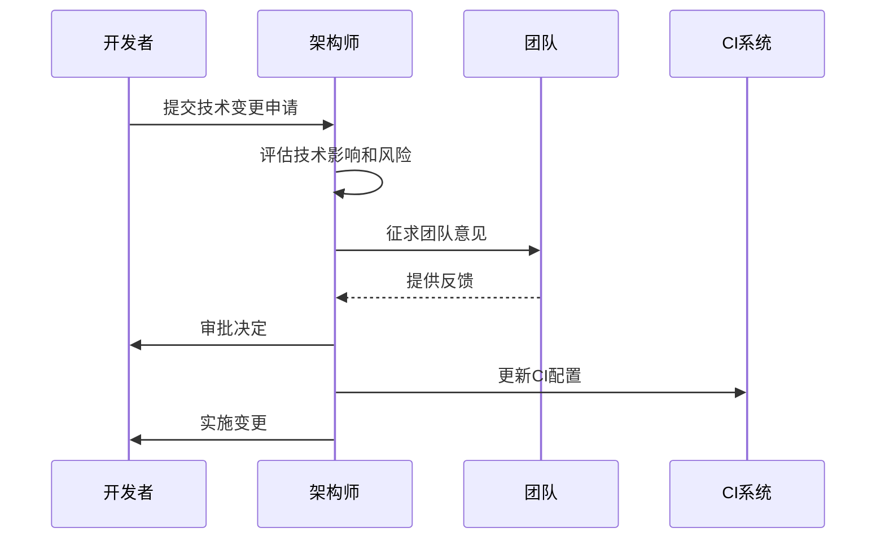

# 变更管理与安全规则

<cite>
**本文档引用的文件**
- [PRD.md](file://docs/PRD.md)
- [ARCHITECTURE.md](file://docs/ARCHITECTURE.md)
- [AGENT_RULES.md](file://docs/AGENT_RULES.md)
- [API.md](file://docs/API.md)
- [DATABASE.md](file://docs/DATABASE.md)
- [HANDOFF_TEMPLATE.md](file://docs/HANDOFF_TEMPLATE.md)
- [README.md](file://README.md)
- [ci.yml](file://.github/workflows/ci.yml)
- [docker-compose.yml](file://docker-compose.yml)
- [01-cursor-repository-foundation.md](file://tasks/round-01/01-cursor-repository-foundation.md)
- [01-cursor-handoff.md](file://handoff/round-01/01-cursor-handoff.md)
</cite>

## 目录
1. [简介](#简介)
2. [项目结构](#项目结构)
3. [核心组件](#核心组件)
4. [架构概览](#架构概览)
5. [详细组件分析](#详细组件分析)
6. [变更管理流程](#变更管理流程)
7. [技术变更审批要求](#技术变更审批要求)
8. [安全规则](#安全规则)
9. [实施指导](#实施指导)
10. [违规后果](#违规后果)
11. [故障排除指南](#故障排除指南)
12. [结论](#结论)

## 简介

CodeReviewX是一个面向GitHub Pull Request的智能代码审查与修复建议Agent系统。本项目采用多Agent协作机制，通过严格的变更管理和安全规则确保系统的稳定性和安全性。本文档详细说明了变更管理流程、技术变更审批要求以及安全规则，为项目的持续演进提供规范指导。

## 项目结构

CodeReviewX项目采用模块化设计，主要包含以下核心组件：



**图表来源**
- [README.md:58-82](file://README.md#L58-L82)
- [ARCHITECTURE.md:19-52](file://docs/ARCHITECTURE.md#L19-L52)

**章节来源**
- [README.md:58-82](file://README.md#L58-L82)
- [ARCHITECTURE.md:19-52](file://docs/ARCHITECTURE.md#L19-L52)

## 核心组件

### Agent协作机制

CodeReviewX采用四Agent协作模式，每个Agent都有明确的角色边界和职责分工：

| Agent | 角色 | 核心职责 | 技术专长 |
|-------|------|----------|----------|
| **ChatGPT** | 项目架构师 | 需求定义、架构决策、最终裁决 | 系统架构、技术规划 |
| **Cursor** | 主要编程执行Agent | 单文件/模块代码生成、小bug修复、独立页面创建 | 快速实现、细节优化 |
| **Codex** | 仓库级验证Agent | 仓库级修改、运行测试、修复CI、最小化修复 | 质量保证、稳定性 |
| **Qoder** | 独立审查员 | 架构审查、代码审查、风险识别、方案对比 | 质量控制、最佳实践 |

### 模块职责边界

系统采用严格的服务边界划分：



**图表来源**
- [ARCHITECTURE.md:56-107](file://docs/ARCHITECTURE.md#L56-L107)

**章节来源**
- [AGENT_RULES.md:9-18](file://docs/AGENT_RULES.md#L9-L18)
- [ARCHITECTURE.md:56-107](file://docs/ARCHITECTURE.md#L56-L107)

## 架构概览

### 系统总体架构

CodeReviewX采用分层架构设计，确保各组件职责清晰、边界明确：



**图表来源**
- [ARCHITECTURE.md:139-168](file://docs/ARCHITECTURE.md#L139-L168)
- [PRD.md:34-52](file://docs/PRD.md#L34-L52)

### 数据流设计

系统采用标准化的数据流设计，确保数据的一致性和完整性：



**图表来源**
- [ARCHITECTURE.md:110-134](file://docs/ARCHITECTURE.md#L110-L134)

**章节来源**
- [ARCHITECTURE.md:139-180](file://docs/ARCHITECTURE.md#L139-L180)
- [PRD.md:172-177](file://docs/PRD.md#L172-L177)

## 详细组件分析

### 数据库设计

CodeReviewX采用三层数据模型设计，支持完整的代码审查流程：



**图表来源**
- [DATABASE.md:22-134](file://docs/DATABASE.md#L22-L134)

#### 核心数据实体

| 实体 | 描述 | 主要字段 |
|------|------|----------|
| **ReviewTask** | 任务主表，保存任务元信息和状态 | id, repo_url, pr_number, status, summary, risk_level |
| **ReviewFileChange** | PR变更文件表，保存文件变更信息 | id, task_id, file_path, change_type, additions, deletions |
| **ReviewIssue** | Review问题表，保存分析出的问题 | id, task_id, file_path, type, severity, title, description |

**章节来源**
- [DATABASE.md:22-134](file://docs/DATABASE.md#L22-L134)

### API设计

系统采用RESTful API设计，前后端分离架构：



**图表来源**
- [API.md:54-241](file://docs/API.md#L54-L241)

**章节来源**
- [API.md:54-241](file://docs/API.md#L54-L241)

## 变更管理流程

### 需求变更类型

根据项目规范，以下变更类型需要PRD更新：

#### 新增功能
- **定义**：在现有MVP范围之外增加新的功能特性
- **影响**：可能改变用户交互流程、数据模型或系统架构
- **示例**：自动修复PR、团队协作功能、复杂权限管理

#### 移除功能
- **定义**：从MVP范围中删除已定义的功能
- **影响**：可能影响现有用户流程和数据完整性
- **示例**：删除前端展示功能、移除特定分析能力

#### 模块职责变更
- **定义**：改变现有模块的职责边界或功能范围
- **影响**：可能破坏现有架构一致性
- **示例**：前端直接调用GitHub API、后端执行Semgrep

#### 核心数据库结构变更
- **定义**：修改核心数据表结构或关系
- **影响**：可能影响数据迁移和兼容性
- **示例**：新增表、修改字段类型、调整外键关系

#### API契约变更
- **定义**：修改API接口的请求/响应格式
- **影响**：可能破坏客户端兼容性
- **示例**：修改请求参数、调整响应字段、变更HTTP状态码

#### 引入新中间件
- **定义**：引入新的技术中间件或服务
- **影响**：增加系统复杂性和运维成本
- **示例**：消息队列、Redis缓存、Kubernetes集群

#### 部署方式变更
- **定义**：改变现有的部署架构或容器化策略
- **影响**：可能影响开发环境一致性
- **示例**：从Docker Compose迁移到Kubernetes

#### Agent分配变更
- **定义**：改变Agent的职责范围或协作方式
- **影响**：可能影响团队协作效率
- **示例**：重新分配任务给不同Agent、调整协作顺序

#### Agent文件格式约定变更
- **定义**：修改Agent间文件传递的标准格式
- **影响**：可能影响自动化流程
- **示例**：改变Handoff报告格式、调整任务文档模板

### 变更流程



**图表来源**
- [PRD.md:209-217](file://docs/PRD.md#L209-L217)
- [AGENT_RULES.md:133-137](file://docs/AGENT_RULES.md#L133-L137)

**章节来源**
- [PRD.md:209-217](file://docs/PRD.md#L209-L217)
- [AGENT_RULES.md:117-137](file://docs/AGENT_RULES.md#L117-L137)

## 技术变更审批要求

某些技术变更需要架构师特别批准，这些变更可能对系统产生重大影响：

### 需要架构师批准的技术变更

| 变更类型 | 说明 | 影响范围 |
|----------|------|----------|
| **消息队列添加** | RabbitMQ、Kafka等异步处理系统 | 增加系统复杂性、需要运维支持 |
| **Redis添加** | 缓存和会话管理 | 数据一致性、内存管理 |
| **Kubernetes添加** | 容器编排和微服务部署 | 部署复杂性、运维成本 |
| **向量数据库添加** | RAG和语义搜索能力 | 存储和计算资源需求 |
| **微服务添加** | 系统拆分和服务化 | 服务治理、网络通信 |
| **Java/Python服务边界变更** | 改变现有模块职责 | 可能破坏现有架构一致性 |
| **LLM调用方式变更** | 改变AI服务集成模式 | 性能和成本影响 |
| **数据库技术变更** | 改变数据存储方案 | 数据迁移和兼容性问题 |

### 审批流程



**图表来源**
- [AGENT_RULES.md:139-148](file://docs/AGENT_RULES.md#L139-L148)

**章节来源**
- [AGENT_RULES.md:139-148](file://docs/AGENT_RULES.md#L139-L148)

## 安全规则

### 禁止行为清单

CodeReviewX实施严格的安全规则，防止敏感信息泄露：

#### 1. GitHub Token硬编码禁止
- **禁止内容**：在任何源代码文件中硬编码GitHub Token
- **违规后果**：立即阻止合并、代码审查、安全审计
- **替代方案**：使用环境变量、密钥管理服务

#### 2. LLM API密钥提交禁止
- **禁止内容**：提交LLM API密钥到版本控制系统
- **违规后果**：触发安全警报、临时禁用账户、法律后果
- **替代方案**：使用配置文件、环境变量、密钥轮换

#### 3. .env文件提交禁止
- **禁止内容**：提交包含真实凭据的.env文件
- **违规后果**：代码冻结、安全审查、团队处罚
- **允许内容**：仅提交.env.example文件，包含占位符

#### 4. 凭证日志输出禁止
- **禁止内容**：在日志中输出完整Token或API Key
- **违规后果**：日志审查、安全事件调查
- **替代方案**：使用脱敏日志、摘要信息

#### 5. 代码注释中凭证禁止
- **禁止内容**：在代码注释中包含敏感信息
- **违规后果**：代码审查扣分、安全培训
- **替代方案**：使用文档、内部wiki

### 安全实施指导

#### 环境变量管理
```bash
# 正确的做法
export GITHUB_TOKEN=your_token_here
export LLM_API_KEY=your_api_key_here

# 错误的做法
GITHUB_TOKEN="hardcoded_token"
```

#### 密钥轮换策略
- 定期更换API密钥
- 使用短期有效的临时令牌
- 实施密钥撤销机制

#### 日志脱敏
```python
# 正确的日志记录
logger.info(f"API call to {endpoint} with masked token")

# 错误的日志记录
logger.info(f"API call failed with token: {token}")
```

**章节来源**
- [AGENT_RULES.md:152-159](file://docs/AGENT_RULES.md#L152-L159)

## 实施指导

### 变更管理实施步骤

#### 1. 变更提案准备
- 详细描述变更内容和动机
- 分析变更的影响范围
- 提供替代方案和风险评估

#### 2. 架构师评估
- 评估技术可行性
- 分析架构一致性
- 评估实施成本和风险

#### 3. 文档更新
- 更新相关设计文档
- 修订API契约
- 更新数据库设计

#### 4. 代码变更实施
- 按照批准的方案实施
- 进行单元测试和集成测试
- 更新相关文档

### 安全规则实施步骤

#### 1. 环境配置
- 创建.env.example文件
- 配置.gitignore排除敏感文件
- 设置环境变量访问权限

#### 2. 代码审查
- 集成安全扫描工具
- 实施代码审查检查清单
- 建立安全问题报告机制

#### 3. 监控和审计
- 实施日志监控
- 定期安全审计
- 建立应急响应机制

## 违规后果

### 严重违规后果

| 违规类型 | 处罚措施 | 影响期限 |
|----------|----------|----------|
| **GitHub Token泄露** | 立即禁用账户、安全审查、团队培训 | 30天 |
| **API密钥泄露** | 法律责任、公司内部处分、行业黑名单 | 永久 |
| **生产环境凭据泄露** | 系统停机、数据恢复、赔偿损失 | 90天 |
| **违反Agent协作规则** | 任务重做、团队培训、绩效影响 | 1个月 |
| **破坏架构一致性** | 代码重构、架构审查、技术指导 | 2周 |

### 预防措施

#### 1. 自动化检测
- 集成Secret Detection工具
- 实施CI/CD安全检查
- 建立自动化扫描流程

#### 2. 团队培训
- 定期安全培训
- 最佳实践分享
- 案例分析学习

#### 3. 监督机制
- 架构师定期审查
- 同行代码审查
- 外部安全审计

## 故障排除指南

### 常见变更问题

#### 1. 变更被拒绝
**症状**：架构师拒绝变更申请
**解决方案**：
- 重新评估变更影响
- 寻求替代方案
- 收集更多证据支持

#### 2. 文档更新滞后
**症状**：代码变更后文档未及时更新
**解决方案**：
- 建立文档更新提醒机制
- 将文档更新纳入变更流程
- 实施文档版本控制

#### 3. 安全违规检测
**症状**：CI/CD流水线检测到安全违规
**解决方案**：
- 立即移除敏感信息
- 通知相关人员
- 加强安全培训

### 安全问题排查

#### 1. 环境变量问题
**症状**：应用无法获取环境变量
**排查步骤**：
- 检查.env文件格式
- 验证环境变量名称
- 确认加载顺序

#### 2. 权限问题
**症状**：应用无法访问外部服务
**排查步骤**：
- 检查API密钥有效性
- 验证服务访问权限
- 确认网络连接

#### 3. 日志问题
**症状**：日志中出现敏感信息
**排查步骤**：
- 检查日志格式
- 验证脱敏规则
- 审查日志级别

**章节来源**
- [ci.yml:14-57](file://.github/workflows/ci.yml#L14-L57)
- [HANDOFF_TEMPLATE.md:71-81](file://docs/HANDOFF_TEMPLATE.md#L71-L81)

## 结论

CodeReviewX的多Agent协作机制通过严格的变更管理和安全规则确保了系统的稳定性和安全性。通过明确的职责边界、标准化的协作流程和严格的安全控制，项目能够在保持高效开发的同时确保质量标准。

### 关键要点总结

1. **变更管理**：所有变更必须经过架构师评估和文档更新
2. **技术审批**：重大技术变更需要架构师特别批准
3. **安全第一**：严格的安全规则防止敏感信息泄露
4. **协作规范**：明确的Agent职责和协作流程
5. **质量保证**：完善的测试和审查机制

### 未来发展方向

随着项目的演进，建议持续优化以下方面：
- 自动化变更审批流程
- 增强安全监控和检测能力
- 完善团队协作和知识共享机制
- 优化性能监控和故障诊断

通过坚持这些原则和流程，CodeReviewX将继续保持高质量的发展轨迹，为用户提供可靠的智能代码审查服务。