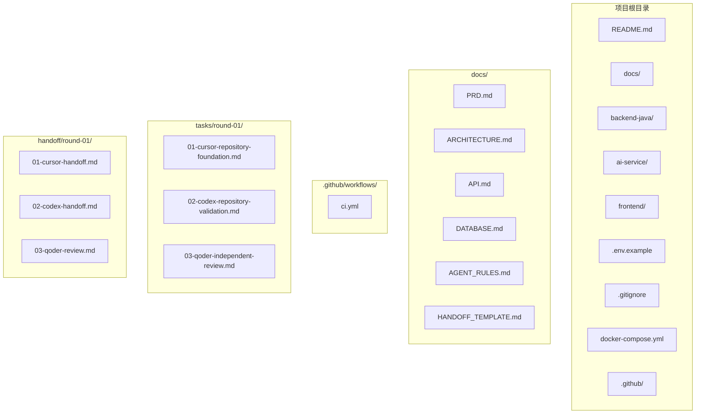
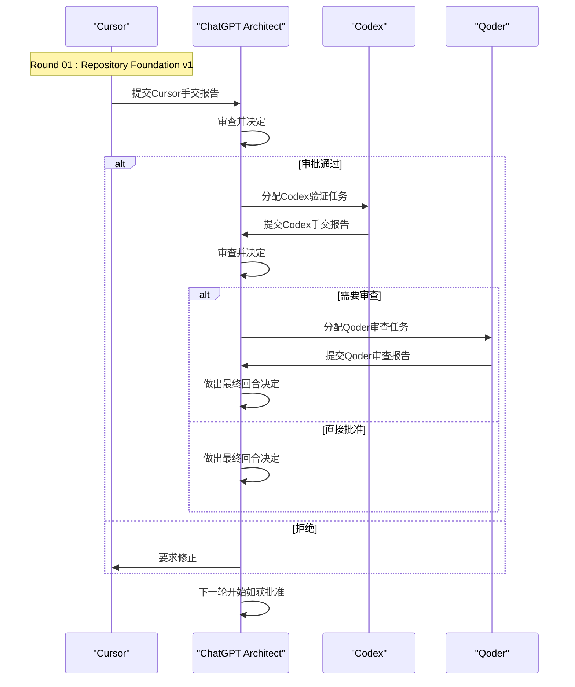
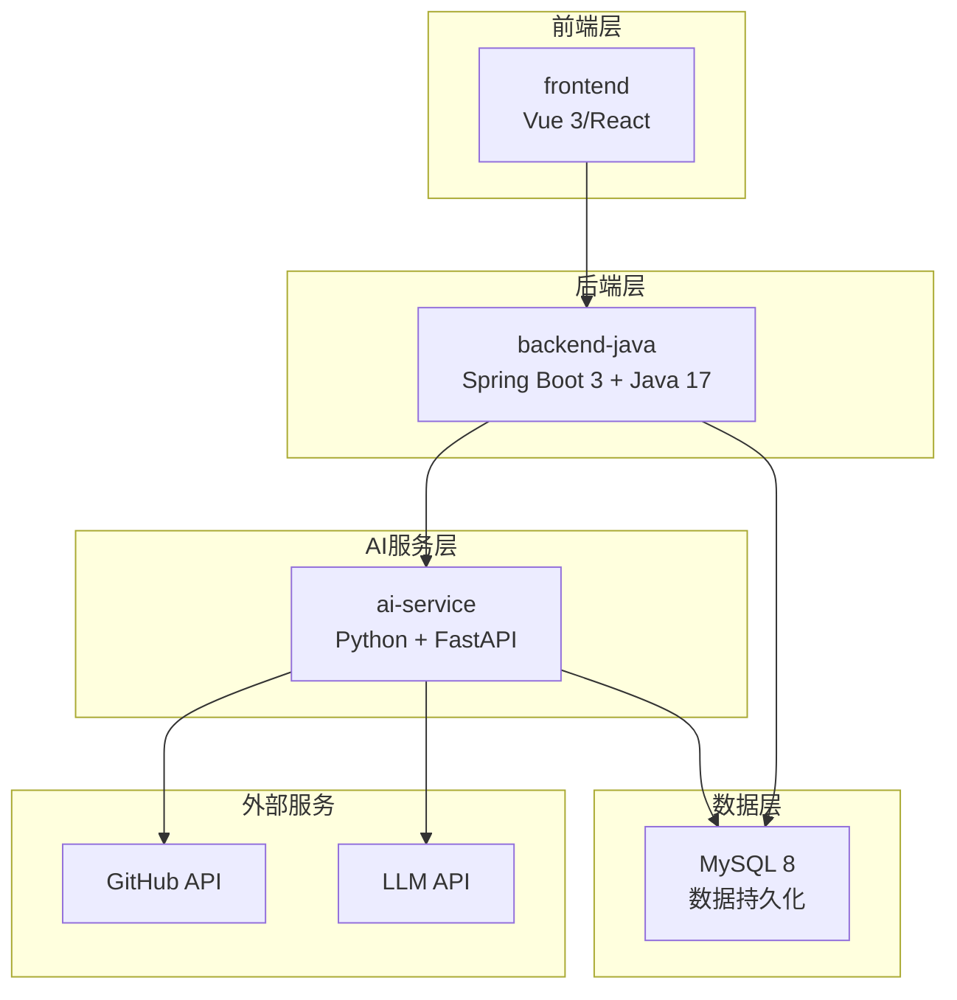
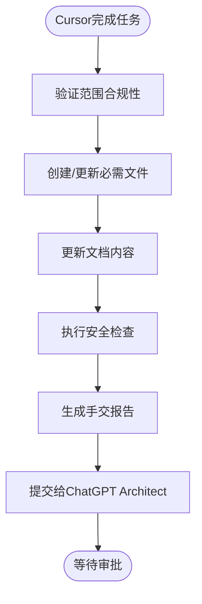
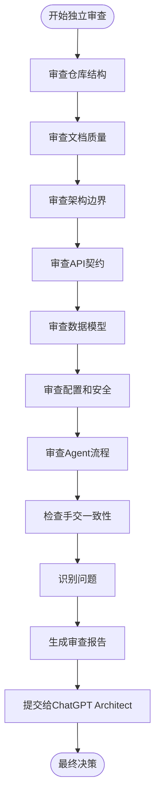
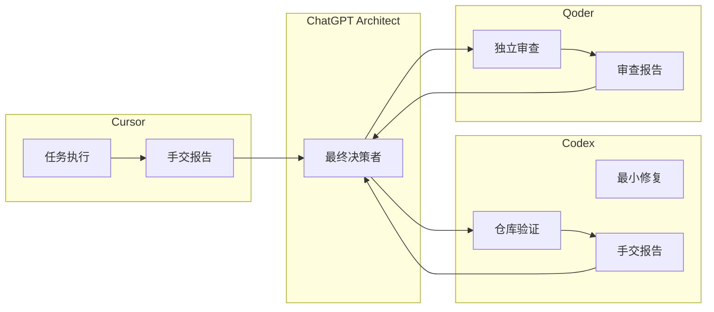

# 回合过渡工作流程

<cite>
**本文档引用的文件**
- [HANDOFF_TEMPLATE.md](file://docs/HANDOFF_TEMPLATE.md)
- [AGENT_RULES.md](file://docs/AGENT_RULES.md)
- [01-cursor-handoff.md](file://handoff/round-01/01-cursor-handoff.md)
- [02-codex-handoff.md](file://handoff/round-01/02-codex-handoff.md)
- [03-qoder-review.md](file://handoff/round-01/03-qoder-review.md)
- [01-cursor-repository-foundation.md](file://tasks/round-01/01-cursor-repository-foundation.md)
- [02-codex-repository-validation.md](file://tasks/round-01/02-codex-repository-validation.md)
- [03-qoder-independent-review.md](file://tasks/round-01/03-qoder-independent-review.md)
- [README.md](file://README.md)
- [ARCHITECTURE.md](file://docs/ARCHITECTURE.md)
- [PRD.md](file://docs/PRD.md)
</cite>

## 目录
1. [简介](#简介)
2. [项目结构](#项目结构)
3. [核心组件](#核心组件)
4. [架构概览](#架构概览)
5. [详细组件分析](#详细组件分析)
6. [依赖关系分析](#依赖关系分析)
7. [性能考虑](#性能考虑)
8. [故障排除指南](#故障排除指南)
9. [结论](#结论)

## 简介

CodeReviewX是一个多Agent协作的智能代码审查系统，采用严格的回合制工作流程确保项目质量。本文档详细描述了从Cursor完成任务到Qoder审查的完整回合过渡工作流程，包括每个环节的具体要求、检查要点和质量标准。

## 项目结构

CodeReviewX项目采用模块化设计，包含以下核心目录结构：

**图表来源**
- [README.md:1-120](file://README.md#L1-L120)
- [ARCHITECTURE.md:1-417](file://docs/ARCHITECTURE.md#L1-L417)

## 核心组件

### Agent角色定义

CodeReviewX系统包含四个核心Agent，每个都有明确的角色边界和职责：

| Agent | 角色 | 核心职责 | 文件范围 |
|-------|------|----------|----------|
| **ChatGPT** | 项目架构师 | 需求、架构、审查标准、最终决策 | 所有文档更新 |
| **Cursor** | 主要编码执行Agent | 单文件/模块代码生成、小bug修复、单页创建 | 任务指定范围 |
| **Codex** | 仓库级验证Agent | 仓库级修改、运行测试、修复CI、最小化修复 | 任务指定范围 |
| **Qoder** | 独立审查Agent | 架构审查、代码审查、风险识别、对比方案 | 仅读取审查 |

### 回合过渡规则

**图表来源**
- [HANDOFF_TEMPLATE.md:107-128](file://docs/HANDOFF_TEMPLATE.md#L107-L128)
- [AGENT_RULES.md:35-57](file://docs/AGENT_RULES.md#L35-L57)

## 架构概览

### 系统架构设计

**图表来源**
- [ARCHITECTURE.md:19-52](file://docs/ARCHITECTURE.md#L19-L52)
- [ARCHITECTURE.md:56-107](file://docs/ARCHITECTURE.md#L56-L107)

### 模块职责边界

| 模块 | 技术栈 | 计划职责 | 禁止职责 |
|------|--------|----------|----------|
| `backend-java` | Spring Boot 3 + Java 17 | REST API、任务生命周期管理、MySQL持久化、调用ai-service | LLM提示词、Semgrep执行、复杂diff解析 |
| `ai-service` | Python + FastAPI | GitHub diff获取、文件变更解析、Semgrep、LLM/mock、Review JSON生成 | MySQL持久化、前端渲染、任务生命周期 |
| `frontend` | Vue 3/React | 任务创建表单、任务列表、任务详情和报告展示 | 业务编排、持久化、AI审查生成 |

## 详细组件分析

### Cursor任务执行流程

#### 任务要求与范围

Cursor在Round 01中的Repository Foundation v1任务具有严格的要求：

**必须创建的文件：**
- `README.md` - 项目根文档
- `docs/PRD.md` - 产品需求文档
- `docs/ARCHITECTURE.md` - 系统架构文档
- `docs/API.md` - API设计文档
- `docs/DATABASE.md` - 数据库设计文档
- `docs/AGENT_RULES.md` - Agent协作规则
- `docs/HANDOFF_TEMPLATE.md` - 手交模板
- `backend-java/README.md` - 后端模块说明
- `ai-service/README.md` - AI服务模块说明
- `frontend/README.md` - 前端模块说明
- `.env.example` - 环境变量示例
- `.gitignore` - 忽略文件配置
- `docker-compose.yml` - Docker Compose配置
- `.github/workflows/ci.yml` - GitHub Actions CI

**禁止的操作：**
- 不创建Spring Boot业务代码
- 不创建FastAPI业务代码
- 不创建前端页面代码
- 不创建数据库迁移脚本
- 不实现GitHub API集成
- 不实现Semgrep执行
- 不实现LLM调用

#### Cursor手交报告模板

**图表来源**
- [01-cursor-repository-foundation.md:665-697](file://tasks/round-01/01-cursor-repository-foundation.md#L665-L697)
- [HANDOFF_TEMPLATE.md:11-103](file://docs/HANDOFF_TEMPLATE.md#L11-L103)

### Codex验证流程

#### 验证检查清单

Codex在验证阶段需要检查以下方面：

**仓库结构验证：**
- 14个必需文件是否存在
- 任务文档和手交文件是否存在
- 预存在的规划文件状态

**文档质量验证：**
- README.md包含项目名称、MVP目标、当前轮次状态
- PRD定义产品定位、目标用户、MVP范围
- ARCHITECTURE定义模块边界、核心流程
- API文档标记所有API为计划状态
- DATABASE文档标记schema为逻辑设计
- AGENT_RULES定义角色边界和手交规则

**配置安全性验证：**
- .env.example仅包含占位符
- .gitignore保护本地密钥和生成文件
- docker-compose.yml为占位符YAML
- ci.yml为占位符工作流YAML

#### Codex最小修复政策

Codex只能进行最小化修复，包括：

**允许的修复：**
- 添加缺失的"未在Round 01实现"状态
- 修正损坏的Markdown标题
- 替换无效的占位符YAML语法
- 移除意外的真实构建步骤
- 修正不准确的文档声明

**禁止的修复：**
- 创建Spring Boot文件
- 创建FastAPI文件
- 创建前端应用文件
- 添加SQL迁移
- 安装依赖
- 重新组织整个文档系统

### Qoder独立审查流程

#### 审查目标

Qoder的独立审查需要回答以下关键问题：

1. **仓库结构完整性**：Round 01仓库基础结构是否完整？
2. **文档充分性**：文档是否足以指导Round 02实现？
3. **模块边界清晰性**：模块边界是否足够清晰？
4. **Agent协作模型**：Agent协作模型是否清晰且可执行？
5. **手交报告可信度**：Cursor和Codex手交报告是否可信且一致？
6. **范围控制**：Cursor和Codex是否引入范围蔓延？
7. **占位文件安全性**：占位文件是否安全且正确范围？

#### Qoder审查报告结构

**图表来源**
- [03-qoder-independent-review.md:181-195](file://tasks/round-01/03-qoder-independent-review.md#L181-L195)
- [03-qoder-independent-review.md:540-634](file://tasks/round-01/03-qoder-independent-review.md#L540-L634)

## 依赖关系分析

### Agent协作依赖图

**图表来源**
- [AGENT_RULES.md:35-57](file://docs/AGENT_RULES.md#L35-L57)
- [HANDOFF_TEMPLATE.md:107-128](file://docs/HANDOFF_TEMPLATE.md#L107-L128)

### 文档依赖关系

| 文档 | 依赖其他文档 | 作用 |
|------|-------------|------|
| `README.md` | PRD、ARCHITECTURE、API、DATABASE | 项目概述和当前状态 |
| `docs/PRD.md` | ARCHITECTURE、API、DATABASE | 产品需求和范围定义 |
| `docs/ARCHITECTURE.md` | PRD、API、DATABASE | 系统架构和模块边界 |
| `docs/API.md` | ARCHITECTURE、DATABASE | API设计和契约 |
| `docs/DATABASE.md` | ARCHITECTURE、API | 数据库设计和实体 |
| `docs/AGENT_RULES.md` | 所有文档 | Agent协作规则和边界 |

## 性能考虑

### 回合效率优化

1. **并行检查**：各Agent可以在本地并行执行安全检查命令
2. **增量验证**：Codex和Qoder可以跳过已完成的验证步骤
3. **最小化修改**：遵循最小修复原则，减少不必要的文件修改
4. **标准化流程**：使用统一的手交模板和审查报告格式

### 质量保证措施

1. **多层验证**：通过多个Agent的独立验证确保质量
2. **范围控制**：严格的范围限制防止功能膨胀
3. **文档驱动**：所有实现都基于预先定义的文档
4. **安全优先**：始终优先考虑安全性和合规性

## 故障排除指南

### 常见问题及解决方案

**问题1：手交报告格式不正确**
- 检查是否使用了标准手交模板
- 确认所有必填部分都已填写
- 验证检查清单的完整性

**问题2：范围违规**
- 重新检查禁止操作列表
- 确认没有引入新的依赖
- 验证占位符配置的正确性

**问题3：文档不一致**
- 对比任务文档和实际实现
- 检查各文档之间的引用关系
- 确认API契约的一致性

**问题4：安全漏洞**
- 执行秘密扫描命令
- 检查.env.example文件
- 验证.gitignore配置

### 质量标准检查清单

| 检查项目 | 检查方法 | 通过标准 |
|---------|---------|---------|
| 范围合规性 | 执行业务代码扫描 | 无业务源码、无依赖文件 |
| 文档完整性 | 检查必需文件存在 | 14个必需文件全部存在 |
| 配置安全性 | 执行秘密扫描 | 无真实密钥、仅占位符 |
| 架构一致性 | 对比各文档内容 | 模块边界、API契约一致 |
| Agent协作 | 检查手交流程 | 严格遵循回合过渡规则 |

## 结论

CodeReviewX的多Agent协作机制通过严格的回合过渡工作流程确保了项目的高质量交付。每个Agent都有明确的职责边界，遵循统一的协作规则，通过多层验证和独立审查确保范围控制和质量保证。

Round 01的成功完成标志着项目具备了进入后续轮次的基础条件。通过Cursor的仓库基础建设、Codex的仓库验证和Qoder的独立审查，系统建立了可靠的质量控制体系，为后续的功能实现奠定了坚实基础。

这种协作机制的优势在于：
1. **明确的责任分工**：每个Agent专注于自己的职责领域
2. **严格的质量控制**：多层验证确保质量标准
3. **透明的协作流程**：标准化的手交和审查流程
4. **可扩展的架构**：为后续轮次的扩展预留空间