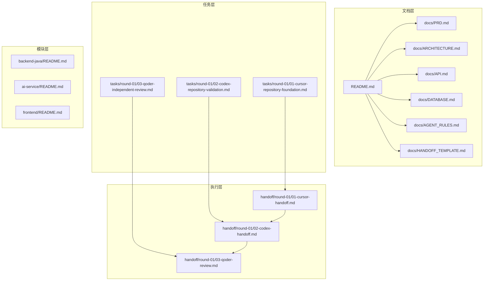
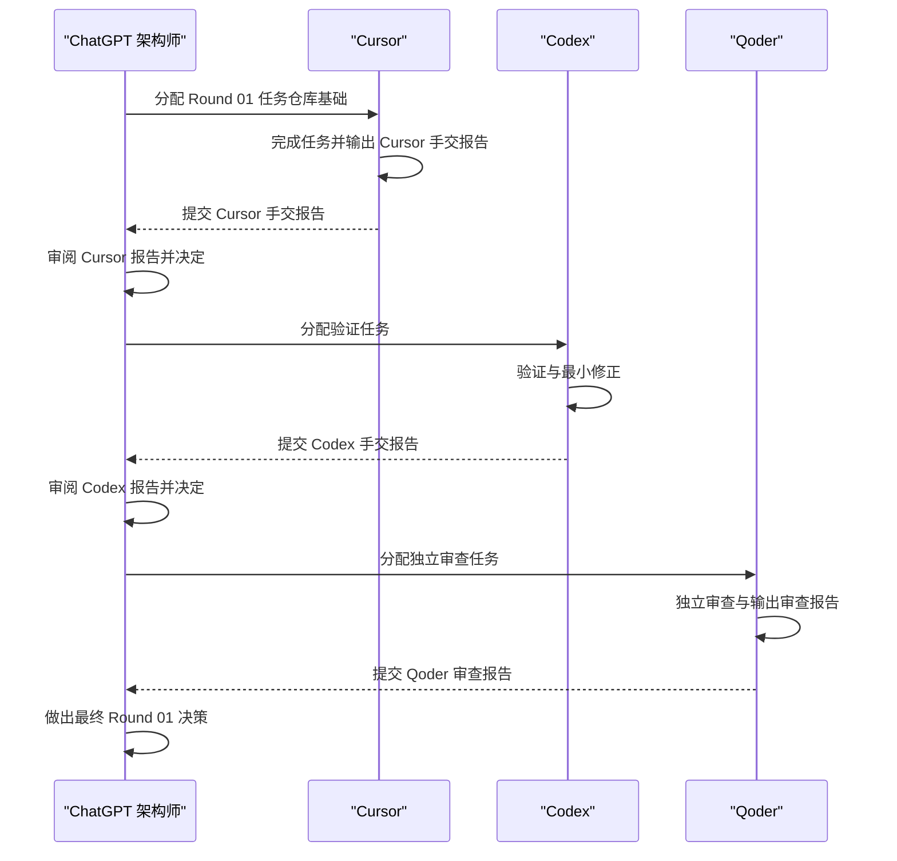
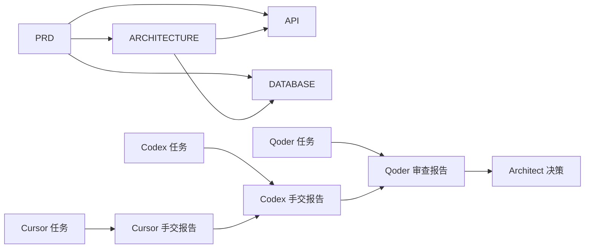

# 多Agent协作机制

<cite>
**本文引用的文件**
- [docs/AGENT_RULES.md](file://docs/AGENT_RULES.md)
- [docs/HANDOFF_TEMPLATE.md](file://docs/HANDOFF_TEMPLATE.md)
- [docs/PRD.md](file://docs/PRD.md)
- [docs/ARCHITECTURE.md](file://docs/ARCHITECTURE.md)
- [docs/API.md](file://docs/API.md)
- [docs/DATABASE.md](file://docs/DATABASE.md)
- [README.md](file://README.md)
- [tasks/round-01/01-cursor-repository-foundation.md](file://tasks/round-01/01-cursor-repository-foundation.md)
- [tasks/round-01/02-codex-repository-validation.md](file://tasks/round-01/02-codex-repository-validation.md)
- [tasks/round-01/03-qoder-independent-review.md](file://tasks/round-01/03-qoder-independent-review.md)
- [handoff/round-01/01-cursor-handoff.md](file://handoff/round-01/01-cursor-handoff.md)
- [handoff/round-01/02-codex-handoff.md](file://handoff/round-01/02-codex-handoff.md)
- [handoff/round-01/03-qoder-review.md](file://handoff/round-01/03-qoder-review.md)
</cite>

## 目录
1. [简介](#简介)
2. [项目结构](#项目结构)
3. [核心组件](#核心组件)
4. [架构总览](#架构总览)
5. [详细组件分析](#详细组件分析)
6. [依赖关系分析](#依赖关系分析)
7. [性能考量](#性能考量)
8. [故障排查指南](#故障排查指南)
9. [结论](#结论)
10. [附录](#附录)

## 简介
本文件系统化阐述 CodeReviewX 多 Agent 协作机制，围绕 ChatGPT 架构师的统筹职责与决策流程，详细说明 Cursor 的编码执行规则、Codex 的验证测试流程、Qoder 的独立审查标准，明确 Agent 间的协作边界、沟通协议与工作流规范，并提供手交报告模板与标准格式，确保知识传递的一致性与完整性。文档还包含冲突解决机制、质量保证流程与绩效评估标准，为团队协作提供清晰的指导原则与最佳实践。

## 项目结构
CodeReviewX 采用“文档驱动 + 任务轮次”的协作范式，围绕 Round 01 的仓库基础建设形成完整的协作闭环：
- 文档层：PRD、ARCHITECTURE、API、DATABASE、AGENT_RULES、HANDOFF_TEMPLATE
- 任务层：tasks/round-01 下的三份任务文档，分别定义 Cursor、Codex、Qoder 的职责与验收标准
- 执行层：handoff/round-01 下的三份手交报告，记录每轮执行与验证结果
- 模块层：backend-java、ai-service、frontend 的占位 README，明确模块边界与非实现状态

图表来源
- [README.md:1-120](file://README.md#L1-L120)
- [docs/PRD.md:1-218](file://docs/PRD.md#L1-L218)
- [docs/ARCHITECTURE.md:1-390](file://docs/ARCHITECTURE.md#L1-L390)
- [docs/API.md:1-378](file://docs/API.md#L1-L378)
- [docs/DATABASE.md:1-294](file://docs/DATABASE.md#L1-L294)
- [docs/AGENT_RULES.md:1-160](file://docs/AGENT_RULES.md#L1-L160)
- [docs/HANDOFF_TEMPLATE.md:1-128](file://docs/HANDOFF_TEMPLATE.md#L1-L128)
- [tasks/round-01/01-cursor-repository-foundation.md:1-712](file://tasks/round-01/01-cursor-repository-foundation.md#L1-L712)
- [tasks/round-01/02-codex-repository-validation.md:1-649](file://tasks/round-01/02-codex-repository-validation.md#L1-L649)
- [tasks/round-01/03-qoder-independent-review.md:1-667](file://tasks/round-01/03-qoder-independent-review.md#L1-L667)
- [handoff/round-01/01-cursor-handoff.md:1-202](file://handoff/round-01/01-cursor-handoff.md#L1-L202)
- [handoff/round-01/02-codex-handoff.md:1-138](file://handoff/round-01/02-codex-handoff.md#L1-L138)
- [handoff/round-01/03-qoder-review.md:1-229](file://handoff/round-01/03-qoder-review.md#L1-L229)

章节来源
- [README.md:1-120](file://README.md#L1-L120)
- [docs/PRD.md:1-218](file://docs/PRD.md#L1-L218)
- [docs/ARCHITECTURE.md:1-390](file://docs/ARCHITECTURE.md#L1-L390)
- [docs/API.md:1-378](file://docs/API.md#L1-L378)
- [docs/DATABASE.md:1-294](file://docs/DATABASE.md#L1-L294)
- [docs/AGENT_RULES.md:1-160](file://docs/AGENT_RULES.md#L1-L160)
- [docs/HANDOFF_TEMPLATE.md:1-128](file://docs/HANDOFF_TEMPLATE.md#L1-L128)
- [tasks/round-01/01-cursor-repository-foundation.md:1-712](file://tasks/round-01/01-cursor-repository-foundation.md#L1-L712)
- [tasks/round-01/02-codex-repository-validation.md:1-649](file://tasks/round-01/02-codex-repository-validation.md#L1-L649)
- [tasks/round-01/03-qoder-independent-review.md:1-667](file://tasks/round-01/03-qoder-independent-review.md#L1-L667)
- [handoff/round-01/01-cursor-handoff.md:1-202](file://handoff/round-01/01-cursor-handoff.md#L1-L202)
- [handoff/round-01/02-codex-handoff.md:1-138](file://handoff/round-01/02-codex-handoff.md#L1-L138)
- [handoff/round-01/03-qoder-review.md:1-229](file://handoff/round-01/03-qoder-review.md#L1-L229)

## 核心组件
- ChatGPT 架构师（统筹者与决策者）
  - 职责：定义需求边界、制定架构规则、审核 Agent 手交报告、决定下一轮 Agent 与任务分配、审批变更与范围扩展
  - 决策依据：PRD、ARCHITECTURE、AGENT_RULES、各轮手交报告与审查报告
- Cursor（主执行 Agent）
  - 职责：单文件/单模块代码生成、小缺陷修复、单页面创建；严格限制业务逻辑与真实集成
  - 范围：单 controller/service/mapper/entity/DTO 文件、单前端页面组件、单测试文件、特定 docs/ 文件
- Codex（仓库级验证 Agent）
  - 职责：仓库结构与文档完整性验证、最小化修正、安全与范围合规检查
  - 范围：仓库级修改、运行测试与修复失败、最小修正（如 API 状态对齐、数据库设计说明澄清）
- Qoder（独立审查 Agent）
  - 职责：独立架构与仓库审查、跨文档一致性核验、非侵入式风险识别与建议
  - 范围：只读审查，不修改代码或配置

章节来源
- [docs/AGENT_RULES.md:9-18](file://docs/AGENT_RULES.md#L9-L18)
- [tasks/round-01/01-cursor-repository-foundation.md:29-38](file://tasks/round-01/01-cursor-repository-foundation.md#L29-L38)
- [tasks/round-01/02-codex-repository-validation.md:30-42](file://tasks/round-01/02-codex-repository-validation.md#L30-L42)
- [tasks/round-01/03-qoder-independent-review.md:32-44](file://tasks/round-01/03-qoder-independent-review.md#L32-L44)

## 架构总览
多 Agent 协作遵循“文档先行、MVP 优先、Mock 先行、单 Agent 修改”的原则，通过标准化的任务与手交报告实现严格的协作边界与质量控制。

图表来源
- [docs/AGENT_RULES.md:35-57](file://docs/AGENT_RULES.md#L35-L57)
- [tasks/round-01/01-cursor-repository-foundation.md:14-25](file://tasks/round-01/01-cursor-repository-foundation.md#L14-L25)
- [tasks/round-01/02-codex-repository-validation.md:13-27](file://tasks/round-01/02-codex-repository-validation.md#L13-L27)
- [tasks/round-01/03-qoder-independent-review.md:14-29](file://tasks/round-01/03-qoder-independent-review.md#L14-L29)

## 详细组件分析

### ChatGPT 架构师的统筹职责与决策流程
- 统筹职责
  - 审核 PRD 与 ARCHITECTURE，确保模块边界与 API 合同一致
  - 审阅 Agent 手交报告与审查报告，判断是否满足 Round 01 验收标准
  - 决定下一轮 Agent 与任务分配，必要时要求修正或拒绝进入下一轮
  - 审批范围扩展与变更，确保变更流程合规
- 决策流程
  - Cursor 完成任务 → Cursor 提交手交报告 → Architect 审阅 → 若通过则分配 Codex 验证 → Codex 提交手交报告 → Architect 审阅 → 若通过则分配 Qoder 审查 → Qoder 提交审查报告 → Architect 做出最终 Round 01 决策
- 决策依据
  - 任务文档中的验收标准与检查清单
  - 手交报告与审查报告中的结构、文档质量、范围合规、安全与一致性核验结果

章节来源
- [docs/AGENT_RULES.md:35-57](file://docs/AGENT_RULES.md#L35-L57)
- [tasks/round-01/01-cursor-repository-foundation.md:592-642](file://tasks/round-01/01-cursor-repository-foundation.md#L592-L642)
- [tasks/round-01/02-codex-repository-validation.md:518-561](file://tasks/round-01/02-codex-repository-validation.md#L518-L561)
- [tasks/round-01/03-qoder-independent-review.md:638-652](file://tasks/round-01/03-qoder-independent-review.md#L638-L652)

### Cursor 的编码执行规则
- 角色定位
  - 主执行 Agent，负责单文件/单模块的代码生成与小缺陷修复
- 允许范围
  - 单 controller/service/mapper/entity/DTO 文件
  - 单前端页面组件
  - 单测试文件
  - 特定 docs/ 文件（按任务定义）
- 禁止范围
  - Spring Boot、FastAPI 业务代码
  - 前端页面代码
  - 数据库迁移
  - GitHub API、Semgrep、LLM 集成
  - 真实 Docker 服务与 CI 构建
  - 新增未批准的技术栈与依赖
- 执行规范
  - 严格遵守任务文档的文件内容指南与验收标准
  - 输出标准手交报告，包含执行摘要、创建/修改文件清单、范围合规确认、验收检查清单、执行命令与结果、已知问题与偏差、推荐下一步
- 质量保障
  - 通过 Cursor 手交报告与 Codex 验证报告的交叉核验，确保无业务逻辑与安全风险

章节来源
- [docs/AGENT_RULES.md:63-95](file://docs/AGENT_RULES.md#L63-L95)
- [tasks/round-01/01-cursor-repository-foundation.md:117-163](file://tasks/round-01/01-cursor-repository-foundation.md#L117-L163)
- [tasks/round-01/01-cursor-repository-foundation.md:592-642](file://tasks/round-01/01-cursor-repository-foundation.md#L592-L642)
- [handoff/round-01/01-cursor-handoff.md:14-78](file://handoff/round-01/01-cursor-handoff.md#L14-L78)

### Codex 的验证测试流程
- 角色定位
  - 仓库级验证与最小修正 Agent，负责结构、文档、配置与范围合规的验证
- 验证范围
  - 必需文件清单核验
  - 文档覆盖率与一致性核验（PRD、ARCHITECTURE、API、DATABASE、AGENT_RULES、HANDOFF_TEMPLATE、模块 README）
  - 配置安全性与占位符有效性（.env.example、.gitignore、docker-compose.yml、ci.yml）
  - 业务代码与依赖文件扫描
  - Cursor 手交报告与实际仓库状态一致性核验
- 最小修正原则
  - 仅在明显违反 Round 01 接受标准时进行最小化修正（如添加“未实现”状态、修正 API 路径、移除真实构建步骤等）
  - 不引入新技术、不实现业务逻辑、不扩大范围
- 输出规范
  - Codex 手交报告包含验证摘要、检查文件清单、最小修正列表、剩余风险与限制、推荐下一步

章节来源
- [docs/AGENT_RULES.md:79-89](file://docs/AGENT_RULES.md#L79-L89)
- [tasks/round-01/02-codex-repository-validation.md:73-88](file://tasks/round-01/02-codex-repository-validation.md#L73-L88)
- [tasks/round-01/02-codex-repository-validation.md:197-246](file://tasks/round-01/02-codex-repository-validation.md#L197-L246)
- [tasks/round-01/02-codex-repository-validation.md:486-516](file://tasks/round-01/02-codex-repository-validation.md#L486-L516)
- [handoff/round-01/02-codex-handoff.md:13-83](file://handoff/round-01/02-codex-handoff.md#L13-L83)

### Qoder 的独立审查标准
- 角色定位
  - 独立审查 Agent，负责跨文档一致性、模块边界清晰度、API 合同与数据模型可对接性、范围合规与仓库卫生的独立评估
- 审查维度
  - 仓库结构完整性与任务文档一致性
  - 文档质量与对 Round 02 的指导性
  - 模块边界与职责分离的清晰度
  - API 合同与数据模型的合理性与一致性
  - 配置与安全（占位符、敏感信息扫描、依赖文件检查）
  - Agent 流程遵循情况与角色边界
- 输出规范
  - 独立审查报告包含审查元数据、执行摘要、审查文件清单、架构审查、文档审查、范围合规审查、手交报告一致性审查、发现分级（阻断性/非阻断性/仓库卫生）、建议与最终推荐

章节来源
- [docs/AGENT_RULES.md:90-94](file://docs/AGENT_RULES.md#L90-L94)
- [tasks/round-01/03-qoder-independent-review.md:181-195](file://tasks/round-01/03-qoder-independent-review.md#L181-L195)
- [tasks/round-01/03-qoder-independent-review.md:415-459](file://tasks/round-01/03-qoder-independent-review.md#L415-L459)
- [tasks/round-01/03-qoder-independent-review.md:540-634](file://tasks/round-01/03-qoder-independent-review.md#L540-L634)
- [handoff/round-01/03-qoder-review.md:15-22](file://handoff/round-01/03-qoder-review.md#L15-L22)

### 协作边界、沟通协议与工作流规范
- 协作边界
  - Cursor：仅限单文件/单模块编码与小缺陷修复
  - Codex：仅限仓库级验证与最小修正
  - Qoder：仅限独立审查，不修改代码或配置
  - ChatGPT：唯一有权分配下一轮 Agent 与任务、审批变更与范围扩展
- 沟通协议
  - 所有 Agent 间文件使用 Markdown 格式
  - Agent 不得直接相互移交，必须经 ChatGPT 审批后方可进入下一轮
  - 手交报告与审查报告必须包含标准化结构与检查清单
- 工作流规范
  - Cursor → Codex → Qoder → Architect 决策
  - 每轮完成后必须输出对应报告，未通过不得进入下一轮

章节来源
- [docs/AGENT_RULES.md:22-32](file://docs/AGENT_RULES.md#L22-L32)
- [docs/AGENT_RULES.md:108-114](file://docs/AGENT_RULES.md#L108-L114)
- [docs/HANDOFF_TEMPLATE.md:107-128](file://docs/HANDOFF_TEMPLATE.md#L107-L128)

### 手交报告模板与标准格式
- 模板结构
  - 任务元数据、执行摘要、创建文件清单、修改文件清单、范围合规确认、验收检查清单、执行命令与结果、已知问题与限制、偏差说明、推荐下一步
- 标准格式
  - 所有 Agent 输出必须使用 Markdown
  - 严格遵循模板结构，不得遗漏关键检查项
- 示例参考
  - Cursor 手交报告、Codex 手交报告、Qoder 审查报告均体现了模板的完整结构与检查清单

章节来源
- [docs/HANDOFF_TEMPLATE.md:9-104](file://docs/HANDOFF_TEMPLATE.md#L9-L104)
- [handoff/round-01/01-cursor-handoff.md:14-102](file://handoff/round-01/01-cursor-handoff.md#L14-L102)
- [handoff/round-01/02-codex-handoff.md:582-634](file://handoff/round-01/02-codex-handoff.md#L582-L634)
- [handoff/round-01/03-qoder-review.md:552-634](file://handoff/round-01/03-qoder-review.md#L552-L634)

### 冲突解决机制
- 冲突类型
  - 文档不一致（如 API 路径与状态标记不一致）
  - 手交报告与实际仓库状态不一致
  - 仓库卫生问题（如遗留旧规划文件、未清理的占位文件）
- 解决流程
  - Codex 进行最小修正，仅针对明显违反接受标准的问题
  - Qoder 独立审查并指出非阻断性问题与仓库卫生注意项
  - ChatGPT 架构师综合评估，决定是否批准进入下一轮或要求进一步修正

章节来源
- [tasks/round-01/02-codex-repository-validation.md:486-516](file://tasks/round-01/02-codex-repository-validation.md#L486-L516)
- [handoff/round-01/03-qoder-review.md:146-153](file://handoff/round-01/03-qoder-review.md#L146-L153)

### 质量保证流程
- 文档质量
  - PRD、ARCHITECTURE、API、DATABASE、AGENT_RULES、HANDOFF_TEMPLATE、模块 README 必须完整且一致
- 范围控制
  - 严格禁止业务代码、真实集成、真实 Docker 服务与 CI 构建、未批准技术栈与依赖
- 安全控制
  - 禁止提交密钥、令牌与密码；.env.example 仅允许占位符；.gitignore 保护敏感文件
- 一致性核验
  - Cursor 手交报告与 Codex 验证报告、Qoder 审查报告之间进行交叉核验

章节来源
- [docs/AGENT_RULES.md:117-160](file://docs/AGENT_RULES.md#L117-L160)
- [tasks/round-01/01-cursor-repository-foundation.md:613-642](file://tasks/round-01/01-cursor-repository-foundation.md#L613-L642)
- [tasks/round-01/02-codex-repository-validation.md:518-561](file://tasks/round-01/02-codex-repository-validation.md#L518-L561)
- [handoff/round-01/02-codex-handoff.md:58-131](file://handoff/round-01/02-codex-handoff.md#L58-L131)

### 绩效评估标准
- Cursor
  - 是否按任务文档完成单文件/单模块编码
  - 是否严格遵守范围限制与安全规则
  - 手交报告是否完整、准确、可追溯
- Codex
  - 验证覆盖面是否全面
  - 最小修正是否必要且合规
  - 是否识别并报告仓库卫生问题
- Qoder
  - 是否独立、客观地评估架构边界与文档一致性
  - 是否区分阻断性与非阻断性问题
  - 是否提供务实的改进建议
- ChatGPT
  - 是否基于事实与证据做出决策
  - 是否确保变更流程合规与范围控制

章节来源
- [tasks/round-01/01-cursor-repository-foundation.md:696-712](file://tasks/round-01/01-cursor-repository-foundation.md#L696-L712)
- [tasks/round-01/02-codex-repository-validation.md:637-649](file://tasks/round-01/02-codex-repository-validation.md#L637-L649)
- [tasks/round-01/03-qoder-independent-review.md:655-667](file://tasks/round-01/03-qoder-independent-review.md#L655-L667)

## 依赖关系分析
- 文档驱动依赖
  - PRD 定义产品定位、目标用户、MVP 问题陈述、成功标准与范围
  - ARCHITECTURE 定义模块边界、调用链、失败处理与分层设计
  - API 与 DATABASE 定义契约与数据模型，确保 Round 02 实现可对接
- 任务与报告依赖
  - 任务文档为 Cursor/Codex/Qoder 提供明确的验收标准与检查清单
  - 手交报告与审查报告为 ChatGPT 决策提供事实依据
- Agent 间依赖
  - Cursor → Codex → Qoder → Architect 决策的单向依赖链
  - ChatGPT 作为唯一协调者，决定下一轮 Agent 与任务

图表来源
- [docs/PRD.md:1-218](file://docs/PRD.md#L1-L218)
- [docs/ARCHITECTURE.md:1-390](file://docs/ARCHITECTURE.md#L1-L390)
- [docs/API.md:1-378](file://docs/API.md#L1-L378)
- [docs/DATABASE.md:1-294](file://docs/DATABASE.md#L1-L294)
- [tasks/round-01/01-cursor-repository-foundation.md:1-712](file://tasks/round-01/01-cursor-repository-foundation.md#L1-L712)
- [tasks/round-01/02-codex-repository-validation.md:1-649](file://tasks/round-01/02-codex-repository-validation.md#L1-L649)
- [tasks/round-01/03-qoder-independent-review.md:1-667](file://tasks/round-01/03-qoder-independent-review.md#L1-L667)
- [handoff/round-01/01-cursor-handoff.md:1-202](file://handoff/round-01/01-cursor-handoff.md#L1-L202)
- [handoff/round-01/02-codex-handoff.md:1-138](file://handoff/round-01/02-codex-handoff.md#L1-L138)
- [handoff/round-01/03-qoder-review.md:1-229](file://handoff/round-01/03-qoder-review.md#L1-L229)

## 性能考量
- 文档先行与占位符策略降低实现成本，避免早期过度工程化
- 严格的范围控制与最小修正原则减少无效工作与返工
- 任务轮次与标准化报告提升协作效率与可追溯性
- 仓库卫生与安全规则减少后期维护成本与风险

## 故障排查指南
- 常见问题
  - 业务代码或依赖文件意外引入
  - .env.example 包含真实密钥或占位符不正确
  - docker-compose.yml 或 ci.yml 包含真实服务或构建步骤
  - API 文档与 ARCHITECTURE 文档不一致
- 排查步骤
  - 使用任务文档提供的检查清单逐项核验
  - 执行只读扫描命令确认业务代码、依赖文件、密钥与占位符
  - 对照 Cursor 手交报告与 Codex 验证报告，定位不一致项
  - 必要时进行最小修正并记录在 Codex 手交报告中

章节来源
- [tasks/round-01/01-cursor-repository-foundation.md:645-662](file://tasks/round-01/01-cursor-repository-foundation.md#L645-L662)
- [tasks/round-01/02-codex-repository-validation.md:429-484](file://tasks/round-01/02-codex-repository-validation.md#L429-L484)
- [handoff/round-01/02-codex-handoff.md:84-99](file://handoff/round-01/02-codex-handoff.md#L84-L99)

## 结论
CodeReviewX 的多 Agent 协作机制通过“文档驱动 + 任务轮次 + 标准化报告”的方式，实现了严格的范围控制、质量保证与知识传递一致性。ChatGPT 架构师作为唯一的协调者，确保变更流程合规与决策透明；Cursor、Codex、Qoder 各司其职，在各自的职责范围内提供高质量的执行、验证与独立审查。该机制为后续 Round 的顺利推进奠定了坚实基础，也为团队协作提供了清晰的指导原则与最佳实践。

## 附录
- 变更管理流程
  - 提出变更 → ChatGPT 架构师评估 → 更新 PRD/ARCHITECTURE 文档 → 再进入编码
- 安全规则
  - 禁止在源码中硬编码 GitHub Token、LLM API Key
  - .env 不得提交；仅允许 .env.example 作为占位
  - 日志输出不得包含完整令牌或 API Key
  - 代码注释中不得出现凭据信息

章节来源
- [docs/AGENT_RULES.md:117-160](file://docs/AGENT_RULES.md#L117-L160)