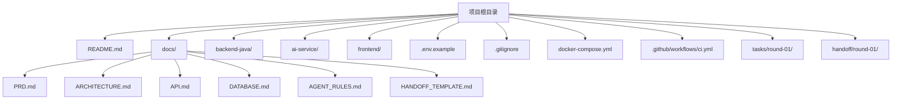
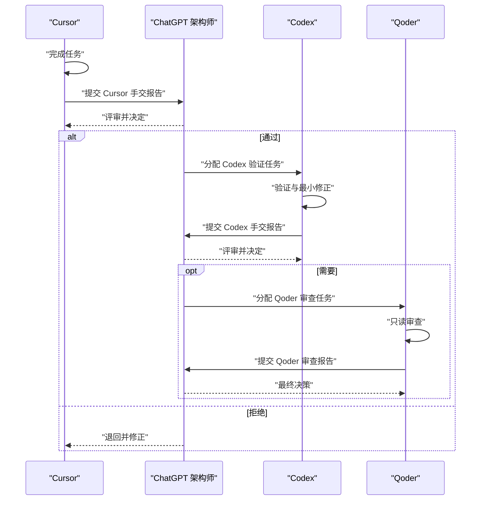
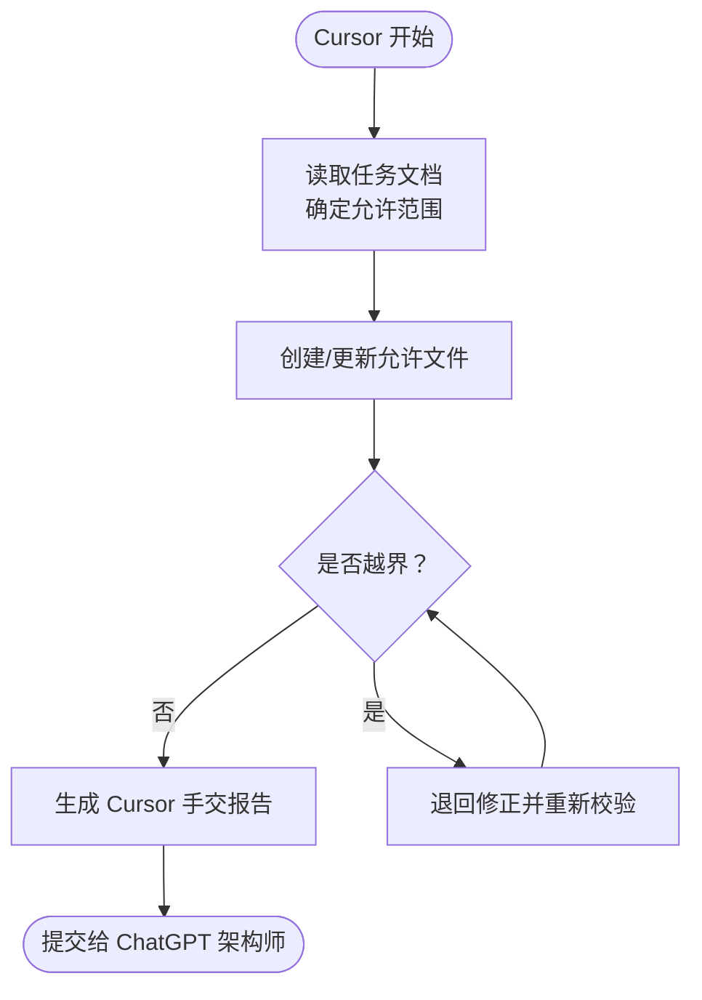
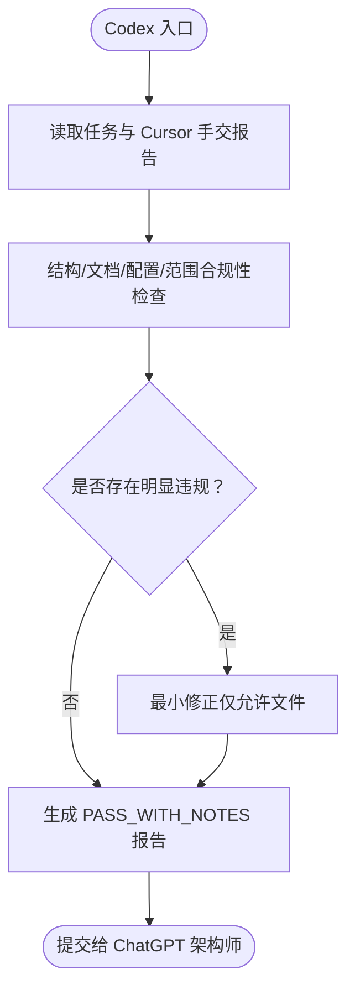
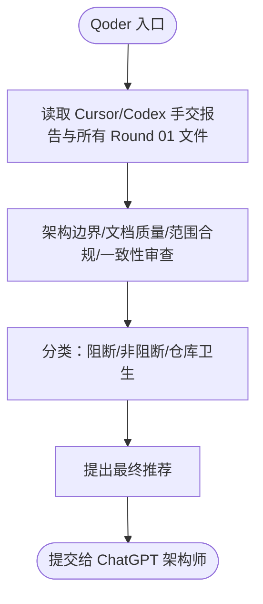
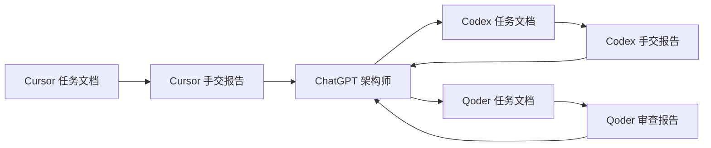

# 文件范围与格式约定

<cite>
**本文引用的文件**
- [README.md](file://README.md)
- [docs/AGENT_RULES.md](file://docs/AGENT_RULES.md)
- [docs/HANDOFF_TEMPLATE.md](file://docs/HANDOFF_TEMPLATE.md)
- [tasks/round-01/01-cursor-repository-foundation.md](file://tasks/round-01/01-cursor-repository-foundation.md)
- [tasks/round-01/02-codex-repository-validation.md](file://tasks/round-01/02-codex-repository-validation.md)
- [tasks/round-01/03-qoder-independent-review.md](file://tasks/round-01/03-qoder-independent-review.md)
- [handoff/round-01/01-cursor-handoff.md](file://handoff/round-01/01-cursor-handoff.md)
- [handoff/round-01/02-codex-handoff.md](file://handoff/round-01/02-codex-handoff.md)
- [handoff/round-01/03-qoder-review.md](file://handoff/round-01/03-qoder-review.md)
- [.env.example](file://.env.example)
- [docker-compose.yml](file://docker-compose.yml)
- [.github/workflows/ci.yml](file://.github/workflows/ci.yml)
</cite>

## 目录
1. [简介](#简介)
2. [项目结构](#项目结构)
3. [核心组件](#核心组件)
4. [架构总览](#架构总览)
5. [详细组件分析](#详细组件分析)
6. [依赖关系分析](#依赖关系分析)
7. [性能考虑](#性能考虑)
8. [故障排查指南](#故障排查指南)
9. [结论](#结论)
10. [附录](#附录)

## 简介
本文件面向 CodeReviewX 多 Agent 协作机制，系统性定义每个 Agent 的文件范围与格式约定，确保 Cursor 的单文件/模块范围、Codex 的仓库级修改范围、Qoder 的只读审查范围清晰可依，并提供任务文档与手交报告的命名模式、格式要求、版本控制规范与质量检查标准，帮助各轮次协作稳定、可追溯、可审计。

## 项目结构
- 顶层包含项目说明、模块目录、文档系统、占位配置与 CI 工作流。
- 任务与手交报告按轮次组织：
  - tasks/round-NN/<序号>-<agent>-<描述>.md
  - handoff/round-NN/<序号>-<agent>-handoff.md

图表来源
- [README.md:1-120](file://README.md#L1-L120)
- [docker-compose.yml:1-14](file://docker-compose.yml#L1-L14)
- [.github/workflows/ci.yml:1-58](file://.github/workflows/ci.yml#L1-L58)

章节来源
- [README.md:1-120](file://README.md#L1-L120)
- [docker-compose.yml:1-14](file://docker-compose.yml#L1-L14)
- [.github/workflows/ci.yml:1-58](file://.github/workflows/ci.yml#L1-L58)

## 核心组件
- Cursor（主执行 Agent）
  - 范围：单文件/单模块任务（控制器、服务、映射器、实体、DTO、前端页面组件、测试文件、指定 docs 文件），以及任务文档中明确授权的 docs 文件。
  - 禁止：docker-compose.yml、.github/workflows/ci.yml、数据库迁移文件、与当前任务无关的文件。
- Codex（仓库级验证 Agent）
  - 范围：仓库级修改（任务明确授权时）、运行测试与修复、在任务授权下修改 docker-compose.yml 与 CI 文件。
  - 禁止：删除既有逻辑、引入未批准技术栈、修改 PRD 与 ARCHITECTURE（仅架构师更新）。
- Qoder（独立审查 Agent）
  - 范围：只读审查，输出审查报告，不修改任何文件。
- 文档与模板
  - 所有 Agent 间文件使用 Markdown 格式。
  - 任务文档命名：tasks/round-<NN>/<NN>-<agent>-<description>.md
  - 手交报告命名：handoff/round-<NN>/<NN>-<agent>-handoff.md

章节来源
- [docs/AGENT_RULES.md:63-94](file://docs/AGENT_RULES.md#L63-L94)
- [docs/HANDOFF_TEMPLATE.md:101-114](file://docs/HANDOFF_TEMPLATE.md#L101-L114)
- [tasks/round-01/01-cursor-repository-foundation.md:117-162](file://tasks/round-01/01-cursor-repository-foundation.md#L117-L162)
- [tasks/round-01/02-codex-repository-validation.md:133-194](file://tasks/round-01/02-codex-repository-validation.md#L133-L194)
- [tasks/round-01/03-qoder-independent-review.md:441-458](file://tasks/round-01/03-qoder-independent-review.md#L441-L458)

## 架构总览
多 Agent 协作遵循“文档驱动 + 轮次推进 + 逐级审批”的流程：Cursor 完成任务 → Cursor 提交手交报告 → 架构师评审 → 若通过则分配 Codex 验证 → Codex 提交手交报告 → 若需要则分配 Qoder 审查 → 架构师做最终决策 → 下一轮开始。

图表来源
- [docs/AGENT_RULES.md:35-57](file://docs/AGENT_RULES.md#L35-L57)
- [docs/HANDOFF_TEMPLATE.md:107-125](file://docs/HANDOFF_TEMPLATE.md#L107-L125)

章节来源
- [docs/AGENT_RULES.md:35-57](file://docs/AGENT_RULES.md#L35-L57)
- [docs/HANDOFF_TEMPLATE.md:107-125](file://docs/HANDOFF_TEMPLATE.md#L107-L125)

## 详细组件分析

### Cursor：单文件/模块范围与任务文档
- 允许范围
  - 单控制器/服务/映射器/实体/DTO 文件
  - 单前端页面组件
  - 单测试文件
  - 任务文档中明确授权的 docs 文件
- 禁止范围
  - docker-compose.yml
  - .github/workflows/ci.yml
  - 数据库迁移文件
  - 与当前任务无关的文件
- 输出要求
  - 使用 Markdown 格式
  - 命名：tasks/round-<NN>/<NN>-cursor-<description>.md
  - 手交报告：handoff/round-<NN>/<NN>-cursor-handoff.md

图表来源
- [tasks/round-01/01-cursor-repository-foundation.md:117-162](file://tasks/round-01/01-cursor-repository-foundation.md#L117-L162)
- [docs/AGENT_RULES.md:63-78](file://docs/AGENT_RULES.md#L63-L78)

章节来源
- [tasks/round-01/01-cursor-repository-foundation.md:117-162](file://tasks/round-01/01-cursor-repository-foundation.md#L117-L162)
- [docs/AGENT_RULES.md:63-78](file://docs/AGENT_RULES.md#L63-L78)

### Codex：仓库级验证与最小修正
- 允许范围
  - 仓库级修改（任务明确授权）
  - 运行测试与修复失败
  - 在任务授权下修改 docker-compose.yml 与 CI 文件
- 禁止范围
  - 删除既有逻辑
  - 引入未批准技术栈
  - 修改 PRD 与 ARCHITECTURE（仅架构师更新）
- 最小修正原则
  - 仅当明显违反 Round 01 接受准则时进行
  - 不引入新依赖/技术
  - 不实现业务逻辑
  - 仅修改允许文件
  - 不重排文档体系
- 输出要求
  - 使用 Markdown 格式
  - 命名：handoff/round-<NN>/<NN>-codex-handoff.md

图表来源
- [tasks/round-01/02-codex-repository-validation.md:133-194](file://tasks/round-01/02-codex-repository-validation.md#L133-L194)
- [docs/AGENT_RULES.md:79-89](file://docs/AGENT_RULES.md#L79-L89)

章节来源
- [tasks/round-01/02-codex-repository-validation.md:133-194](file://tasks/round-01/02-codex-repository-validation.md#L133-L194)
- [docs/AGENT_RULES.md:79-89](file://docs/AGENT_RULES.md#L79-L89)

### Qoder：只读审查与最终决策
- 范围
  - 仅读取与审查，不修改任何文件
- 输出要求
  - 使用 Markdown 格式
  - 命名：handoff/round-<NN>/<NN>-qoder-review.md
- 决策
  - 提出 Approve/Approve with Notes/Request Fixes/Reject 四类结论
  - 不直接指派下一 Agent，由架构师最终决定

图表来源
- [tasks/round-01/03-qoder-independent-review.md:441-458](file://tasks/round-01/03-qoder-independent-review.md#L441-L458)
- [docs/AGENT_RULES.md:90-94](file://docs/AGENT_RULES.md#L90-L94)

章节来源
- [tasks/round-01/03-qoder-independent-review.md:441-458](file://tasks/round-01/03-qoder-independent-review.md#L441-L458)
- [docs/AGENT_RULES.md:90-94](file://docs/AGENT_RULES.md#L90-L94)

### 文件命名约定与格式规范
- 任务文档命名
  - tasks/round-<NN>/<NN>-<agent>-<description>.md
  - 示例：tasks/round-01/01-cursor-repository-foundation.md
- 手交报告命名
  - handoff/round-<NN>/<NN>-<agent>-handoff.md
  - 示例：handoff/round-01/01-cursor-handoff.md
- 格式要求
  - 所有 Agent 间文件使用 Markdown
  - 手交报告必须包含：元数据、执行摘要、创建/修改文件清单、范围合规、验收清单、执行命令与结果、已知问题/限制、偏差说明、下一步建议
- 版本控制与质量检查
  - .env.example 仅包含占位符
  - .gitignore 保护 .env 与生成物
  - docker-compose.yml 仅占位，services: {}
  - .github/workflows/ci.yml 仅占位检查，不执行真实构建
  - 严禁提交密钥、令牌、密码等敏感信息

章节来源
- [docs/HANDOFF_TEMPLATE.md:101-114](file://docs/HANDOFF_TEMPLATE.md#L101-L114)
- [docs/HANDOFF_TEMPLATE.md:11-103](file://docs/HANDOFF_TEMPLATE.md#L11-L103)
- [.env.example:1-29](file://.env.example#L1-L29)
- [docker-compose.yml:1-14](file://docker-compose.yml#L1-L14)
- [.github/workflows/ci.yml:1-58](file://.github/workflows/ci.yml#L1-L58)

## 依赖关系分析
- Agent 间依赖
  - Cursor → 架构师：提交手交报告等待审批
  - Codex → 架构师：提交验证报告等待审批
  - Qoder → 架构师：提交审查报告等待最终决策
- 文件依赖
  - 所有 Agent 输出文件均依赖任务文档与模板
  - 配置文件（.env.example、docker-compose.yml、ci.yml）为占位文件，不引入真实依赖

图表来源
- [docs/AGENT_RULES.md:35-57](file://docs/AGENT_RULES.md#L35-L57)
- [docs/HANDOFF_TEMPLATE.md:107-125](file://docs/HANDOFF_TEMPLATE.md#L107-L125)

章节来源
- [docs/AGENT_RULES.md:35-57](file://docs/AGENT_RULES.md#L35-L57)
- [docs/HANDOFF_TEMPLATE.md:107-125](file://docs/HANDOFF_TEMPLATE.md#L107-L125)

## 性能考虑
- 占位文件设计降低启动成本，避免真实构建/部署带来的资源消耗
- 仅在任务授权范围内进行最小修正，减少不必要的文件改动
- 通过 CI 占位脚本快速验证结构与范围合规性，避免昂贵的集成测试

## 故障排查指南
- 常见问题
  - 越界修改：检查任务文档允许范围与实际改动文件
  - 配置泄露：确认 .env.example 仅含占位符；使用 .gitignore 保护 .env
  - CI/Compose 非占位：确保 .github/workflows/ci.yml 仅做占位检查；docker-compose.yml 为 services: {}
  - 手交报告缺失字段：对照 HANDOFF_TEMPLATE.md 的 10 节结构补齐
- 排查命令（示例）
  - 查看所有文件：find . -type f | sort
  - 搜索业务源码：find . -name "*.java" -o -name "*.py" -o -name "*.js" -o -name "*.ts" -o -name "*.vue" -o -name "*.jsx" -o -name "*.tsx"
  - 搜索密钥：grep -R "sk-\|ghp_\|github_pat_\|AKIA\|BEGIN PRIVATE KEY" . || true
  - 验证占位 YAML：ruby -e 'require "yaml"; YAML.load_file("docker-compose.yml"); YAML.load_file(".github/workflows/ci.yml"); puts "YAML OK"'

章节来源
- [tasks/round-01/01-cursor-repository-foundation.md:645-662](file://tasks/round-01/01-cursor-repository-foundation.md#L645-L662)
- [tasks/round-01/02-codex-repository-validation.md:429-483](file://tasks/round-01/02-codex-repository-validation.md#L429-L483)
- [tasks/round-01/03-qoder-independent-review.md:461-494](file://tasks/round-01/03-qoder-independent-review.md#L461-L494)

## 结论
本文件明确了 CodeReviewX 多 Agent 协作的文件范围与格式约定：Cursor 的单文件/模块范围、Codex 的仓库级最小修正、Qoder 的只读审查，以及任务文档与手交报告的命名与格式规范。通过严格的范围控制、占位配置与质量检查，确保每轮协作稳定可控、可追溯、可审计，为后续 Round 02 及以后的实现奠定坚实基础。

## 附录
- 任务与手交报告示例路径
  - tasks/round-01/01-cursor-repository-foundation.md
  - tasks/round-01/02-codex-repository-validation.md
  - tasks/round-01/03-qoder-independent-review.md
  - handoff/round-01/01-cursor-handoff.md
  - handoff/round-01/02-codex-handoff.md
  - handoff/round-01/03-qoder-review.md
- 占位配置示例路径
  - .env.example
  - docker-compose.yml
  - .github/workflows/ci.yml