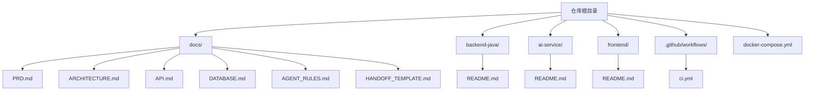
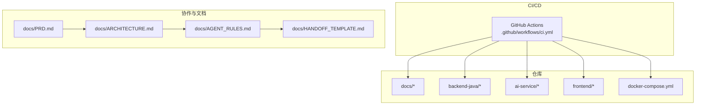
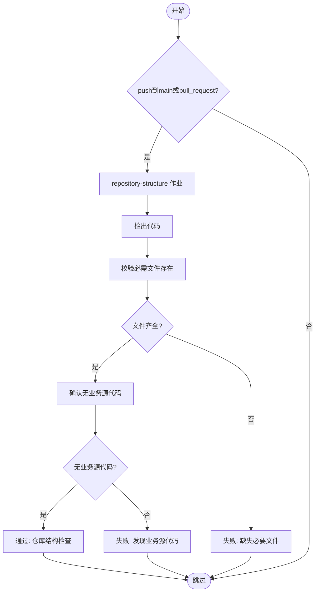
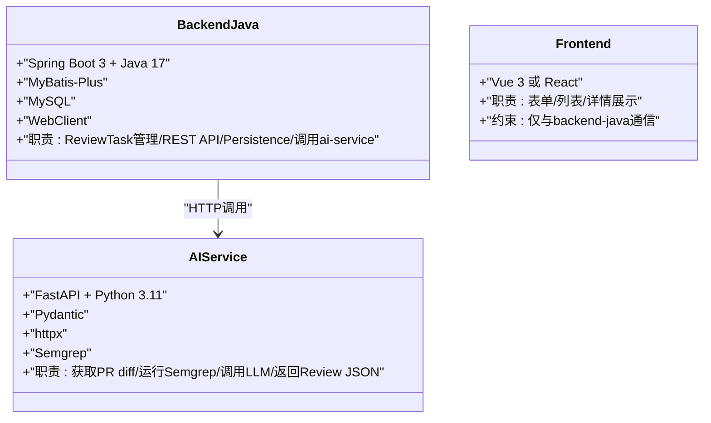
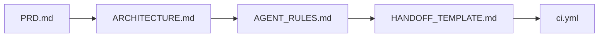
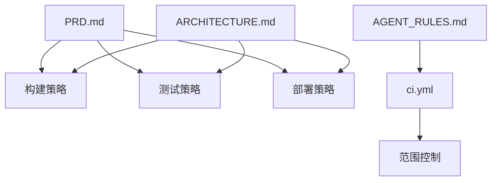

# CI/CD流水线配置

<cite>
**本文引用的文件**
- [.github/workflows/ci.yml](file://.github/workflows/ci.yml)
- [docker-compose.yml](file://docker-compose.yml)
- [README.md](file://README.md)
- [docs/PRD.md](file://docs/PRD.md)
- [docs/ARCHITECTURE.md](file://docs/ARCHITECTURE.md)
- [docs/AGENT_RULES.md](file://docs/AGENT_RULES.md)
- [handoff/round-01/01-cursor-handoff.md](file://handoff/round-01/01-cursor-handoff.md)
- [backend-java/README.md](file://backend-java/README.md)
- [ai-service/README.md](file://ai-service/README.md)
- [frontend/README.md](file://frontend/README.md)
</cite>

## 目录
1. [简介](#简介)
2. [项目结构](#项目结构)
3. [核心组件](#核心组件)
4. [架构总览](#架构总览)
5. [详细组件分析](#详细组件分析)
6. [依赖关系分析](#依赖关系分析)
7. [性能考虑](#性能考虑)
8. [故障排查指南](#故障排查指南)
9. [结论](#结论)
10. [附录](#附录)

## 简介
本文件面向CodeReviewX项目，基于当前Round 01的仓库现状，系统化梳理并扩展CI/CD流水线配置与自动化策略。当前仓库处于“工程骨架初始化”阶段，无任何业务源代码，CI工作流仅进行仓库结构与范围合规性检查。本文在现有基础上，提供未来各轮次（Round 02+）的构建、测试、质量门禁、安全扫描、依赖检查、部署与版本发布的完整实施蓝图，确保从文档驱动到可运行MVP的平滑演进。

## 项目结构
仓库采用多模块分层结构，围绕“文档先行”的原则建立工程骨架：
- 文档层：PRD、架构设计、API与数据库设计、Agent协作规则、交接模板
- 服务层：backend-java（Java/Spring Boot）、ai-service（Python/FastAPI）、frontend（Vue/React）
- 基础设施：docker-compose（占位文件）、CI工作流（占位工作流）

图表来源
- [README.md:58-82](file://README.md#L58-L82)
- [docs/PRD.md:1-218](file://docs/PRD.md#L1-L218)
- [docs/ARCHITECTURE.md:1-417](file://docs/ARCHITECTURE.md#L1-L417)
- [docs/AGENT_RULES.md:1-160](file://docs/AGENT_RULES.md#L1-L160)
- [.github/workflows/ci.yml:1-58](file://.github/workflows/ci.yml#L1-L58)
- [docker-compose.yml:1-14](file://docker-compose.yml#L1-L14)

章节来源
- [README.md:58-82](file://README.md#L58-L82)
- [docs/PRD.md:1-218](file://docs/PRD.md#L1-L218)
- [docs/ARCHITECTURE.md:1-417](file://docs/ARCHITECTURE.md#L1-L417)
- [docs/AGENT_RULES.md:1-160](file://docs/AGENT_RULES.md#L1-L160)
- [.github/workflows/ci.yml:1-58](file://.github/workflows/ci.yml#L1-L58)
- [docker-compose.yml:1-14](file://docker-compose.yml#L1-L14)

## 核心组件
- CI工作流（占位）：在push到main与pull_request事件触发，执行仓库结构检查与范围合规性检查
- 服务模块占位：backend-java、ai-service、frontend均以README占位，声明未来技术栈与职责边界
- 文档与协作：PRD、ARCHITECTURE、AGENT_RULES、HANDOFF_TEMPLATE构成跨Agent协作与变更控制的契约
- 基础设施占位：docker-compose为空服务定义，保留未来服务编排空间

章节来源
- [.github/workflows/ci.yml:8-58](file://.github/workflows/ci.yml#L8-L58)
- [backend-java/README.md:1-74](file://backend-java/README.md#L1-L74)
- [ai-service/README.md:1-86](file://ai-service/README.md#L1-L86)
- [frontend/README.md:1-63](file://frontend/README.md#L1-L63)
- [docs/PRD.md:1-218](file://docs/PRD.md#L1-L218)
- [docs/ARCHITECTURE.md:1-417](file://docs/ARCHITECTURE.md#L1-L417)
- [docs/AGENT_RULES.md:1-160](file://docs/AGENT_RULES.md#L1-L160)
- [docker-compose.yml:1-14](file://docker-compose.yml#L1-L14)

## 架构总览
下图展示了CI/CD在整体系统中的位置与交互关系：CI工作流在GitHub上触发，执行仓库结构与范围合规性检查；后续各轮次在Codex与Cursor/Qoder协作下逐步引入构建、测试、质量门禁与部署流程。

图表来源
- [.github/workflows/ci.yml:1-58](file://.github/workflows/ci.yml#L1-L58)
- [docs/PRD.md:1-218](file://docs/PRD.md#L1-L218)
- [docs/ARCHITECTURE.md:1-417](file://docs/ARCHITECTURE.md#L1-L417)
- [docs/AGENT_RULES.md:1-160](file://docs/AGENT_RULES.md#L1-L160)
- [docs/HANDOFF_TEMPLATE.md:1-128](file://docs/HANDOFF_TEMPLATE.md#L1-L128)
- [docker-compose.yml:1-14](file://docker-compose.yml#L1-L14)

## 详细组件分析

### CI工作流（当前占位）
- 触发条件：push到main分支、pull_request
- 作业：repository-structure
  - 步骤：检出代码、校验必需文件存在、确认无业务源代码
- 设计意图：确保Round 01范围内无业务代码，文档与基础设施占位符合规范

图表来源
- [.github/workflows/ci.yml:8-58](file://.github/workflows/ci.yml#L8-L58)

章节来源
- [.github/workflows/ci.yml:8-58](file://.github/workflows/ci.yml#L8-L58)

### 服务模块占位与职责边界
- backend-java：声明Spring Boot 3、MyBatis-Plus、MySQL连接、WebClient等技术栈与职责边界
- ai-service：声明FastAPI、Pydantic、Semgrep、pytest等技术栈与职责边界
- frontend：声明Vue/React选项、职责边界与API通信约定

图表来源
- [backend-java/README.md:19-46](file://backend-java/README.md#L19-L46)
- [ai-service/README.md:19-47](file://ai-service/README.md#L19-L47)
- [frontend/README.md:25-39](file://frontend/README.md#L25-L39)

章节来源
- [backend-java/README.md:1-74](file://backend-java/README.md#L1-L74)
- [ai-service/README.md:1-86](file://ai-service/README.md#L1-L86)
- [frontend/README.md:1-63](file://frontend/README.md#L1-L63)

### 文档与协作规则
- PRD定义MVP范围与成功标准，明确第一阶段不做内容
- ARCHITECTURE定义模块边界、调用链路与分层设计
- AGENT_RULES定义角色边界、协作原则、变更管理与安全规则
- HANDOFF_TEMPLATE标准化各轮次交接报告结构

图表来源
- [docs/PRD.md:1-218](file://docs/PRD.md#L1-L218)
- [docs/ARCHITECTURE.md:1-417](file://docs/ARCHITECTURE.md#L1-L417)
- [docs/AGENT_RULES.md:1-160](file://docs/AGENT_RULES.md#L1-L160)
- [docs/HANDOFF_TEMPLATE.md:1-128](file://docs/HANDOFF_TEMPLATE.md#L1-L128)
- [.github/workflows/ci.yml:1-58](file://.github/workflows/ci.yml#L1-L58)

章节来源
- [docs/PRD.md:1-218](file://docs/PRD.md#L1-L218)
- [docs/ARCHITECTURE.md:1-417](file://docs/ARCHITECTURE.md#L1-L417)
- [docs/AGENT_RULES.md:1-160](file://docs/AGENT_RULES.md#L1-L160)
- [docs/HANDOFF_TEMPLATE.md:1-128](file://docs/HANDOFF_TEMPLATE.md#L1-L128)

### 基础设施占位与未来演进
- docker-compose当前为空服务定义，保留未来服务编排空间
- CI工作流当前为占位，未来将扩展为多阶段流水线

章节来源
- [docker-compose.yml:1-14](file://docker-compose.yml#L1-L14)
- [.github/workflows/ci.yml:1-58](file://.github/workflows/ci.yml#L1-L58)

## 依赖关系分析
- 文档驱动：PRD/ARCHITECTURE/AGENT_RULES决定后续构建与测试策略
- 服务边界：backend-java与ai-service的职责分离，降低耦合
- CI与协作：CI工作流与Handoff报告共同保障范围控制与质量门禁

图表来源
- [docs/PRD.md:1-218](file://docs/PRD.md#L1-L218)
- [docs/ARCHITECTURE.md:1-417](file://docs/ARCHITECTURE.md#L1-L417)
- [docs/AGENT_RULES.md:1-160](file://docs/AGENT_RULES.md#L1-L160)
- [.github/workflows/ci.yml:1-58](file://.github/workflows/ci.yml#L1-L58)

章节来源
- [docs/PRD.md:1-218](file://docs/PRD.md#L1-L218)
- [docs/ARCHITECTURE.md:1-417](file://docs/ARCHITECTURE.md#L1-L417)
- [docs/AGENT_RULES.md:1-160](file://docs/AGENT_RULES.md#L1-L160)
- [.github/workflows/ci.yml:1-58](file://.github/workflows/ci.yml#L1-L58)

## 性能考虑
- CI阶段尽量保持轻量：当前仅进行文件存在性与范围检查，避免不必要的资源消耗
- 未来构建阶段建议按模块并行化，减少等待时间
- 测试阶段区分单元测试与集成测试，缩短反馈周期
- 依赖扫描与安全检查建议在独立阶段执行，避免阻塞主构建

## 故障排查指南
- CI工作流失败
  - 检查必需文件是否存在：README.md、文档集合、模块README、.env.example、.gitignore、docker-compose.yml、ci.yml
  - 确认无业务源代码：Java、Python、前端源码不应出现在Round 01
- 范围违规
  - 若发现业务源代码或未批准的技术栈，需回退至占位状态并修正
- 安全与机密
  - 确保.env不被提交，仅保留.env.example占位文件
  - 日志中不得包含令牌或API Key

章节来源
- [.github/workflows/ci.yml:19-58](file://.github/workflows/ci.yml#L19-L58)
- [docs/AGENT_RULES.md:152-160](file://docs/AGENT_RULES.md#L152-L160)
- [handoff/round-01/01-cursor-handoff.md:132-167](file://handoff/round-01/01-cursor-handoff.md#L132-L167)

## 结论
当前仓库处于Round 01的工程骨架阶段，CI工作流与文档体系已就绪，确保了范围控制与质量门禁的起点。随着后续轮次推进，可在现有基础上逐步引入构建、测试、质量门禁、安全扫描与部署流程，形成从文档驱动到可运行MVP的完整交付闭环。

## 附录

### 未来CI/CD流水线实施蓝图（基于现有文档与架构）
- 触发策略
  - push到main：执行构建、测试、质量门禁与部署
  - pull_request：执行构建与测试，不部署
- 构建阶段
  - backend-java：Maven构建与单元测试
  - ai-service：pip安装依赖与单元测试
  - frontend：npm/yarn安装依赖与构建
- 测试策略
  - 单元测试：各模块独立执行
  - 集成测试：模块间API连通性测试
  - 端到端测试：UI与后端API端到端验证
- 质量门禁
  - 代码覆盖率阈值
  - 静态分析（SonarQube/Semgrep）
  - 依赖漏洞扫描（OWASP Dependency-Check）
- 安全扫描
  - 机密泄露检测（Trufflehog/Gitleaks）
  - 依赖供应链安全扫描
- 依赖检查
  - 依赖许可证合规检查
  - 过期依赖提醒
- 部署策略
  - Docker镜像构建与推送
  - docker-compose编排与本地部署
  - 环境管理：开发/测试/预发布/生产
- 版本发布
  - 语义化版本与标签
  - 变更日志生成
- 故障恢复与回滚
  - 健康检查与自动重启
  - 基于滚动更新的回滚
  - 配置回滚与数据库迁移回退

章节来源
- [docs/PRD.md:192-206](file://docs/PRD.md#L192-L206)
- [docs/ARCHITECTURE.md:345-381](file://docs/ARCHITECTURE.md#L345-L381)
- [docs/AGENT_RULES.md:152-160](file://docs/AGENT_RULES.md#L152-L160)
- [backend-java/README.md:28-39](file://backend-java/README.md#L28-L39)
- [ai-service/README.md:29-40](file://ai-service/README.md#L29-L40)
- [frontend/README.md:19-22](file://frontend/README.md#L19-L22)