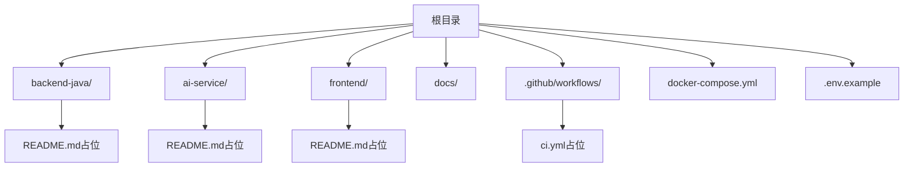
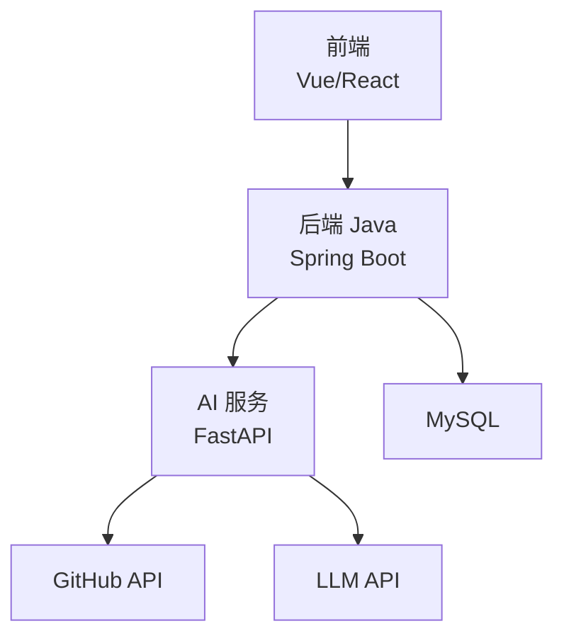
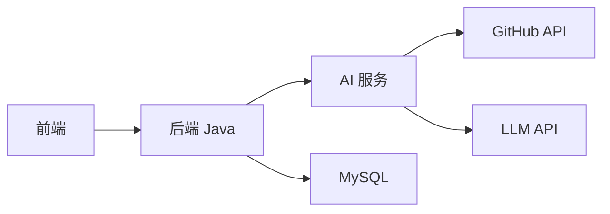

# 代码规范与最佳实践

<cite>
**本文引用的文件**
- [README.md](file://README.md)
- [backend-java/README.md](file://backend-java/README.md)
- [ai-service/README.md](file://ai-service/README.md)
- [frontend/README.md](file://frontend/README.md)
- [.github/workflows/ci.yml](file://.github/workflows/ci.yml)
- [docker-compose.yml](file://docker-compose.yml)
- [.env.example](file://.env.example)
- [docs/PRD.md](file://docs/PRD.md)
- [docs/ARCHITECTURE.md](file://docs/ARCHITECTURE.md)
- [docs/AGENT_RULES.md](file://docs/AGENT_RULES.md)
- [docs/HANDOFF_TEMPLATE.md](file://docs/HANDOFF_TEMPLATE.md)
</cite>

## 目录
1. [引言](#引言)
2. [项目结构](#项目结构)
3. [核心组件](#核心组件)
4. [架构总览](#架构总览)
5. [详细组件分析](#详细组件分析)
6. [依赖关系分析](#依赖关系分析)
7. [性能考虑](#性能考虑)
8. [故障排查指南](#故障排查指南)
9. [结论](#结论)
10. [附录](#附录)

## 引言
本指南旨在为 CodeReviewX 项目制定统一的代码规范与最佳实践，覆盖 Java 后端（Spring Boot 约定、命名规范、注释规范）、Python AI 服务（FastAPI、Pydantic、分层设计）、前端（Vue/React 选型与交互约束）、Git 提交消息格式、分支命名约定、代码审查流程、代码质量检查工具配置（SonarQube、ESLint、Pylint），以及错误处理模式、日志记录规范与安全编码实践。  
本项目处于第一轮工程骨架阶段，所有 Agent 的工作均需遵循“文档先行、MVP 优先、Mock 先行、职责边界”的原则。

## 项目结构
- 顶层采用多模块结构：backend-java、ai-service、frontend，配合 docs 文档与 .github/workflows CI。
- Round 01 仅保留各模块 README 占位与基础 CI 结构检查，业务代码暂不在此轮实现。
- docker-compose.yml 为占位文件，后续按模块实际实现逐步填充服务定义。

图表来源
- [README.md:58-82](file://README.md#L58-L82)
- [backend-java/README.md:1-74](file://backend-java/README.md#L1-L74)
- [ai-service/README.md:1-86](file://ai-service/README.md#L1-L86)
- [frontend/README.md:1-63](file://frontend/README.md#L1-L63)
- [.github/workflows/ci.yml:1-58](file://.github/workflows/ci.yml#L1-L58)
- [docker-compose.yml:1-14](file://docker-compose.yml#L1-L14)

章节来源
- [README.md:58-82](file://README.md#L58-L82)
- [.github/workflows/ci.yml:14-58](file://.github/workflows/ci.yml#L14-L58)

## 核心组件
- 后端 Java（Spring Boot 3 + Java 17）
  - 职责：ReviewTask 生命周期编排、REST API、MySQL 持久化、调用 ai-service。
  - 技术栈：MyBatis-Plus、WebClient、JUnit 5、Maven。
  - 目录规划：controller/service/client/mapper/entity/dto/enums/exception/config。
- AI 服务（Python + FastAPI）
  - 职责：拉取 GitHub PR diff、标准化文件变更、Semgrep 静态分析、mock/真实 LLM、返回结构化 Review JSON。
  - 技术栈：FastAPI、Pydantic v2、httpx、pytest、uvicorn。
  - 目录规划：api/core/schemas/services/prompts/validators/utils。
- 前端（Vue 3 / React）
  - 职责：任务创建表单、任务列表、任务详情与报告展示；仅与 backend-java 通信。
  - 页面规划：/、/tasks、/tasks/:id。
- 数据库（MySQL 8）
  - 存储 ReviewTask、ReviewFileChange、ReviewIssue 三类核心实体。

章节来源
- [backend-java/README.md:19-46](file://backend-java/README.md#L19-L46)
- [ai-service/README.md:19-46](file://ai-service/README.md#L19-L46)
- [frontend/README.md:25-38](file://frontend/README.md#L25-L38)
- [docs/PRD.md:125-169](file://docs/PRD.md#L125-L169)

## 架构总览
系统采用分层与职责分离的设计：前端仅调用后端；后端负责编排与持久化；AI 服务负责数据获取、静态分析与 LLM；数据库仅承载业务数据。第一阶段不引入复杂中间件与分布式组件，确保本地可运行、可调试、可演示。

图表来源
- [docs/ARCHITECTURE.md:19-52](file://docs/ARCHITECTURE.md#L19-L52)
- [docs/ARCHITECTURE.md:345-370](file://docs/ARCHITECTURE.md#L345-L370)

章节来源
- [docs/ARCHITECTURE.md:7-16](file://docs/ARCHITECTURE.md#L7-L16)
- [docs/ARCHITECTURE.md:345-370](file://docs/ARCHITECTURE.md#L345-L370)

## 详细组件分析

### Java 后端代码规范（Spring Boot 约定）
- 包与目录结构
  - 建议采用分层：controller/service/client/mapper/entity/dto/enums/exception/config，保持关注点分离。
  - 配置类集中管理 WebClient、MyBatis-Plus、全局异常处理等。
- 命名规范
  - 类名：帕斯卡命名；接口以 I 前缀或抽象类以 Abstract 前缀区分。
  - 方法名：动词短语，体现职责；布尔方法以 is/has 开头。
  - 常量：全大写下划线；枚举值：全大写。
  - 包名：反向域名 + 小写。
- 注释规范
  - 类与接口：简述职责与边界；必要时标注线程安全性。
  - 方法：@param/@return/@throws；复杂算法附带复杂度说明。
  - 字段：简述含义与约束；敏感字段标注脱敏策略。
- 错误处理
  - 使用统一异常处理器，返回标准化错误响应；区分业务异常与系统异常。
  - ReviewTask 状态失败需记录可读错误信息。
- 日志记录
  - 使用结构化日志，避免在日志中输出敏感信息；区分请求链路 ID。
- 安全实践
  - 配置 CORS、CSRF（如启用）、参数校验；数据库连接使用环境变量。
- 性能与并发
  - 控制一次性批量操作规模；合理使用缓存与连接池；避免阻塞主线程。

章节来源
- [docs/ARCHITECTURE.md:183-230](file://docs/ARCHITECTURE.md#L183-L230)
- [docs/ARCHITECTURE.md:312-343](file://docs/ARCHITECTURE.md#L312-L343)
- [docs/PRD.md:172-178](file://docs/PRD.md#L172-L178)

### Python AI 服务代码规范（FastAPI + Pydantic）
- 分层设计
  - api：HTTP 接口定义；services：业务流程；github_service/semgrep_service/llm_service：单一职责；validators：JSON Schema 校验；schemas：Pydantic 模型；utils：通用工具。
- 命名与注释
  - 函数与类：清晰职责命名；模块与包：小写与下划线；Pydantic 模型字段与校验器注释完整。
- 错误处理
  - 返回标准化错误响应；recoverable 字段标识是否可恢复；失败场景按规则降级或标记失败。
- 日志与安全
  - 结构化日志；不记录令牌与密钥；环境变量集中管理。
- Mock 与真实 LLM
  - LLM_PROVIDER=mock 时返回固定 Review JSON；真实 LLM 失败时优先回退至 mock。

章节来源
- [docs/ARCHITECTURE.md:233-266](file://docs/ARCHITECTURE.md#L233-L266)
- [ai-service/README.md:83-86](file://ai-service/README.md#L83-L86)
- [docs/ARCHITECTURE.md:333-343](file://docs/ARCHITECTURE.md#L333-L343)

### 前端代码规范（Vue/React 选型与交互约束）
- 选型与约定
  - 选型：Vue 3 或 React（TS）；统一构建工具与包管理。
  - 交互：仅与 backend-java 通信；路由：/, /tasks, /tasks/:id。
- 命名与结构
  - 组件：帕斯卡命名；页面路由与组件一一对应；样式与逻辑分离。
  - API：统一客户端封装；环境变量 VITE_API_BASE_URL 控制后端基地址。
- 错误处理与加载
  - 统一错误提示与重试机制；加载态与空状态处理。
- 安全与性能
  - 避免在前端暴露后端实现细节；组件懒加载与按需引入。

章节来源
- [frontend/README.md:19-38](file://frontend/README.md#L19-L38)
- [frontend/README.md:52-63](file://frontend/README.md#L52-L63)

### Git 提交消息格式与分支命名约定
- 提交消息格式
  - 类型：feat、fix、docs、style、refactor、test、chore、build、ci、perf、revert
  - 格式：type(scope): subject
  - 示例：feat(backend): 添加 ReviewTask 创建接口
- 分支命名
  - 规范：feature/<issue-id>-描述、fix/<issue-id>-描述、docs/<page>-描述、chore/<task>-描述
  - 示例：feature/001-create-task-api
- 提交粒度
  - 一次提交解决单一问题；避免混杂无关改动；提交信息清晰可追溯。

章节来源
- [docs/AGENT_RULES.md:22-32](file://docs/AGENT_RULES.md#L22-L32)

### 代码审查流程
- Round 顺序：Cursor → ChatGPT Architect → Codex → Qoder → ChatGPT Architect → 下一轮
- Cursor：单文件/单模块实现，小范围修复与页面创建
- Codex：仓库级验证、CI 修复、最小化改动
- Qoder：架构与代码审查、对比方案、风险识别
- 所有 Agent 间交接必须经 ChatGPT Architect 决策，不得直接交接

章节来源
- [docs/AGENT_RULES.md:35-60](file://docs/AGENT_RULES.md#L35-L60)
- [docs/HANDOFF_TEMPLATE.md:107-128](file://docs/HANDOFF_TEMPLATE.md#L107-L128)

### 代码质量检查工具配置
- SonarQube（Java）
  - 质量门禁：覆盖率、重复率、技术债、阻塞性缺陷
  - 规则：启用 OWASP、Sonar Java 规则集；排除测试与生成代码
- ESLint（前端）
  - 规则：TypeScript/React 最佳实践；禁用 console.warn/console.error；禁用 magic numbers
  - 插件：import/order、react-hooks、unicorn
- Pylint（Python）
  - 规则：命名规范、复杂度控制、未使用导入、docstring
  - 输出：生成报告并与 CI 集成

章节来源
- [docs/ARCHITECTURE.md:345-370](file://docs/ARCHITECTURE.md#L345-L370)

### 错误处理模式与日志记录规范
- 统一错误响应
  - 后端：code/message/details；常见错误码：INVALID_REQUEST/TASK_NOT_FOUND/AI_SERVICE_ERROR/GITHUB_FETCH_FAILED/DATABASE_ERROR/INTERNAL_ERROR
  - AI 服务：errorCode/message/recoverable
- 日志规范
  - 结构化输出；脱敏敏感信息；请求链路 ID；级别：ERROR/WARN/INFO/DEBUG
- 失败降级
  - Semgrep 失败不致任务失败；LLM 失败优先 mock 回退；数据库写入失败标记 FAILED

章节来源
- [docs/ARCHITECTURE.md:312-343](file://docs/ARCHITECTURE.md#L312-L343)
- [docs/PRD.md:172-178](file://docs/PRD.md#L172-L178)

### 安全编码实践
- 凭证管理
  - 禁止硬编码任何密钥、Token；使用 .env.example 与 .env；.env 不提交到仓库
- 环境变量
  - 后端：数据库连接、AI 服务基地址；AI 服务：GitHub Token、LLM Provider、超时；前端：VITE_API_BASE_URL
- 传输与存储
  - HTTPS 传输；最小化日志输出；避免明文存储敏感信息
- 依赖与供应链
  - 定期扫描依赖漏洞；限制第三方库引入；遵循最小权限原则

章节来源
- [docs/AGENT_RULES.md:152-160](file://docs/AGENT_RULES.md#L152-L160)
- [.env.example:1-29](file://.env.example#L1-L29)
- [docs/ARCHITECTURE.md:345-370](file://docs/ARCHITECTURE.md#L345-L370)

## 依赖关系分析
- 模块耦合
  - 前端仅依赖后端 REST API；后端仅依赖 AI 服务内部 API；AI 服务依赖 GitHub API 与 LLM API；数据库仅被后端访问。
- 外部依赖
  - Spring Boot、MyBatis-Plus、FastAPI、Pydantic、httpx、pytest、uvicorn、MySQL Connector
- CI 与容器
  - GitHub Actions 仅进行结构检查；docker-compose 为占位，后续按模块实现填充

图表来源
- [docs/ARCHITECTURE.md:19-52](file://docs/ARCHITECTURE.md#L19-L52)
- [.github/workflows/ci.yml:14-58](file://.github/workflows/ci.yml#L14-L58)
- [docker-compose.yml:1-14](file://docker-compose.yml#L1-14)

章节来源
- [docs/ARCHITECTURE.md:19-52](file://docs/ARCHITECTURE.md#L19-L52)
- [.github/workflows/ci.yml:14-58](file://.github/workflows/ci.yml#L14-L58)

## 性能考虑
- 同步调用优先：MVP 阶段避免引入消息队列与异步复杂度，简化调试与部署。
- 资源限制：Semgrep 超时配置、LLM 调用超时与回退策略。
- 数据库：合理索引、批量写入、连接池大小；避免 N+1 查询。
- 前端：组件懒加载、资源压缩、CDN 加速。

章节来源
- [docs/ARCHITECTURE.md:407-417](file://docs/ARCHITECTURE.md#L407-L417)
- [docs/ARCHITECTURE.md:345-370](file://docs/ARCHITECTURE.md#L345-L370)

## 故障排查指南
- CI 结构检查失败
  - 确认必需文件存在；确认 Round 01 未引入业务源码；检查 CI job 是否按预期执行。
- 环境变量与凭证
  - 检查 .env.example 是否存在；确认 .env 未提交；核对 GITHUB_TOKEN 与 LLM_API_KEY。
- 服务连通性
  - 核对 docker-compose 占位文件；确认端口映射与服务名一致；使用 curl 验证 AI 服务 /review 接口。
- 日志与错误码
  - 查看后端统一错误响应与 AI 服务错误响应；根据错误码定位失败环节。

章节来源
- [.github/workflows/ci.yml:14-58](file://.github/workflows/ci.yml#L14-L58)
- [.env.example:1-29](file://.env.example#L1-L29)
- [docs/ARCHITECTURE.md:312-343](file://docs/ARCHITECTURE.md#L312-L343)

## 结论
本规范以 PRD 与架构文档为依据，结合 Round 01 的工程骨架现状，制定了 Java 后端、Python AI 服务与前端的通用规范与最佳实践。后续各轮迭代应在 ChatGPT Architect 的统一决策下推进，严格遵守职责边界、Mock 先行与文档优先的原则，确保系统可演进、可演示、可复用。

## 附录
- Round 进度与里程碑
  - Round 01：工程骨架与文档；后续轮次逐步引入业务代码与集成。
- Agent 协作与交接模板
  - 使用 HANDOFF_TEMPLATE.md 进行标准化交接；所有 Agent 间交接需经 ChatGPT Architect 决策。

章节来源
- [README.md:110-120](file://README.md#L110-L120)
- [docs/HANDOFF_TEMPLATE.md:1-128](file://docs/HANDOFF_TEMPLATE.md#L1-L128)