# 开发指南

<cite>
**本文引用的文件**
- [README.md](file://README.md)
- [.github/workflows/ci.yml](file://.github/workflows/ci.yml)
- [docker-compose.yml](file://docker-compose.yml)
- [docs/PRD.md](file://docs/PRD.md)
- [docs/ARCHITECTURE.md](file://docs/ARCHITECTURE.md)
- [docs/API.md](file://docs/API.md)
- [docs/DATABASE.md](file://docs/DATABASE.md)
- [docs/AGENT_RULES.md](file://docs/AGENT_RULES.md)
- [docs/HANDOFF_TEMPLATE.md](file://docs/HANDOFF_TEMPLATE.md)
- [backend-java/README.md](file://backend-java/README.md)
- [.gitignore](file://.gitignore)
</cite>

## 目录
1. [简介](#简介)
2. [项目结构](#项目结构)
3. [核心组件](#核心组件)
4. [架构总览](#架构总览)
5. [详细组件分析](#详细组件分析)
6. [依赖关系分析](#依赖关系分析)
7. [性能考虑](#性能考虑)
8. [故障排除指南](#故障排除指南)
9. [结论](#结论)
10. [附录](#附录)

## 简介

CodeReviewX 是一个面向 GitHub Pull Request 的智能代码审查与修复建议系统。该项目采用多 Agent 协作模式，通过文档驱动的方式进行开发，确保每个功能模块都经过充分的设计和规划。

### 项目定位
- **核心目标**：为 GitHub PR 提供智能化的代码审查和修复建议
- **技术栈**：Java + Spring Boot 3、Python + FastAPI、Vue 3/React、MySQL 8
- **开发模式**：文档先行、MVP 优先、Mock 优先、Agent 协作

### 当前状态
- **Round 01**：仓库基础结构建立，文档系统完善，Agent 协作规则确定
- **功能范围**：无业务逻辑实现，专注于基础设施和规范制定
- **下一阶段**：backend-java 骨架、ai-service mock 流水线、GitHub PR 集成等

**章节来源**
- [README.md:29-44](file://README.md#L29-L44)
- [docs/PRD.md:1-25](file://docs/PRD.md#L1-L25)

## 项目结构

项目采用模块化组织方式，每个主要组件都有独立的目录结构：

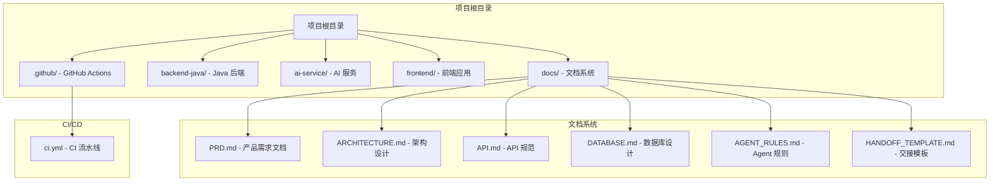

**图表来源**
- [README.md:58-82](file://README.md#L58-L82)
- [docs/ARCHITECTURE.md:19-52](file://docs/ARCHITECTURE.md#L19-L52)

### 模块职责划分

| 模块 | 技术栈 | 核心职责 | 当前状态 |
|------|--------|----------|----------|
| **backend-java** | Spring Boot 3 + Java 17 | REST API、任务编排、MySQL 持久化、调用 ai-service | Round 01 占位符 |
| **ai-service** | Python + FastAPI | GitHub diff 获取、Semgrep 执行、LLM 分析、结构化输出 | Round 01 占位符 |
| **frontend** | Vue 3/React | 任务创建表单、任务列表、报告展示 | Round 01 占位符 |
| **mysql** | MySQL 8 | 任务、文件变更、问题记录持久化 | Round 01 占位符 |

**章节来源**
- [README.md:47-56](file://README.md#L47-L56)
- [backend-java/README.md:19-25](file://backend-java/README.md#L19-L25)

## 核心组件

### Agent 协作体系

CodeReviewX 采用独特的多 Agent 协作模式，确保代码质量和一致性：

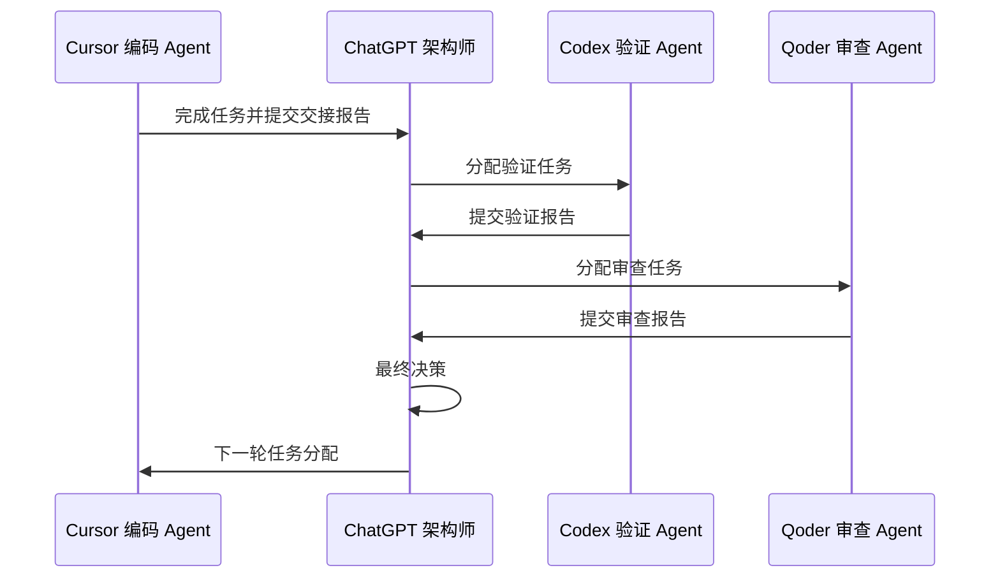

**图表来源**
- [docs/AGENT_RULES.md:35-57](file://docs/AGENT_RULES.md#L35-L57)
- [docs/HANDOFF_TEMPLATE.md:107-125](file://docs/HANDOFF_TEMPLATE.md#L107-L125)

### 开发原则

项目遵循以下核心开发原则：

1. **文档优先**：在实现任何业务代码之前，必须完成相关 PRD、API 设计和数据库设计
2. **MVP 优先**：严格限制功能范围，不引入超出 MVP 的特性
3. **Mock 优先**：ai-service 必须先支持 mock LLM，再集成真实 LLM
4. **职责分离**：各模块职责明确，不得越界
5. **架构变更先文档后代码**：任何架构调整必须先更新文档

**章节来源**
- [README.md:99-107](file://README.md#L99-L107)
- [docs/AGENT_RULES.md:22-32](file://docs/AGENT_RULES.md#L22-L32)

## 架构总览

### 系统总体架构

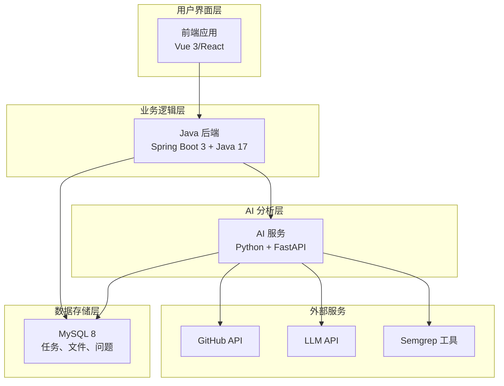

**图表来源**
- [docs/ARCHITECTURE.md:19-52](file://docs/ARCHITECTURE.md#L19-L52)
- [docs/ARCHITECTURE.md:318-343](file://docs/ARCHITECTURE.md#L318-L343)

### 服务职责边界

| 服务 | 核心职责 | 禁止行为 |
|------|----------|----------|
| **frontend** | 任务创建、列表展示、报告展示 | 直接调用 ai-service、GitHub API、LLM |
| **backend-java** | 任务管理、状态流转、数据持久化 | 执行 Semgrep、编写 LLM prompt、解析 diff |
| **ai-service** | GitHub 数据获取、静态分析、LLM 分析 | 直接写数据库、管理任务状态 |
| **MySQL** | 业务数据存储 | 承担分析逻辑 |

**章节来源**
- [docs/ARCHITECTURE.md:56-107](file://docs/ARCHITECTURE.md#L56-L107)

## 详细组件分析

### 后端 Java 组件

#### 分层架构设计

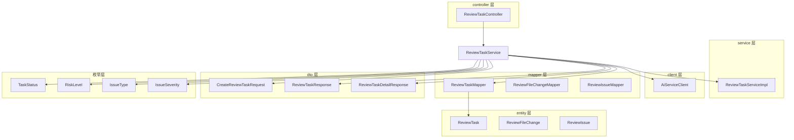

**图表来源**
- [docs/ARCHITECTURE.md:156-203](file://docs/ARCHITECTURE.md#L156-L203)

#### 核心数据模型

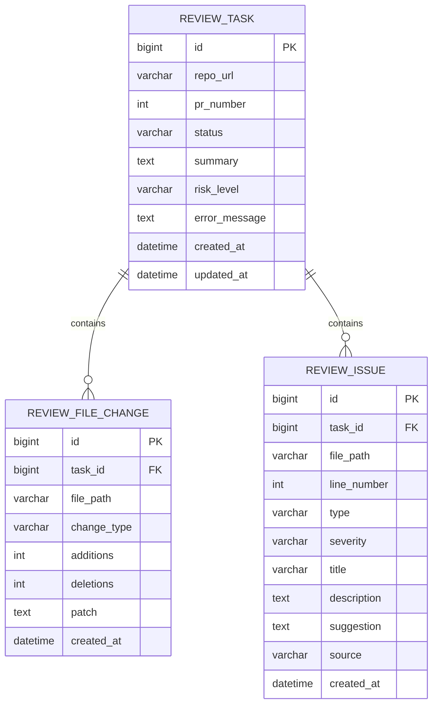

**图表来源**
- [docs/DATABASE.md:22-134](file://docs/DATABASE.md#L22-L134)

**章节来源**
- [docs/ARCHITECTURE.md:156-240](file://docs/ARCHITECTURE.md#L156-L240)
- [docs/DATABASE.md:20-134](file://docs/DATABASE.md#L20-L134)

### AI 服务组件

#### 服务架构设计

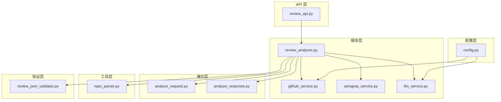

**图表来源**
- [docs/ARCHITECTURE.md:206-239](file://docs/ARCHITECTURE.md#L206-L239)

### API 设计规范

#### 统一响应格式

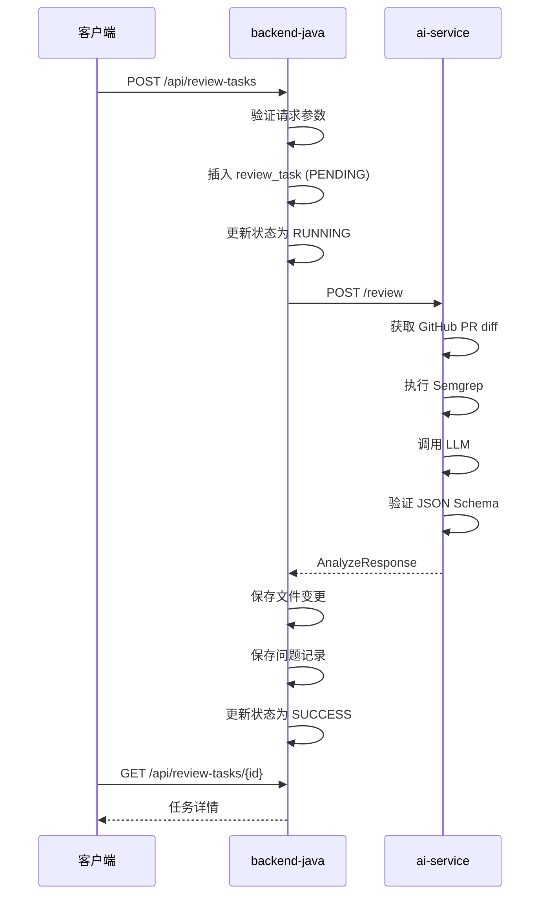

**图表来源**
- [docs/ARCHITECTURE.md:110-142](file://docs/ARCHITECTURE.md#L110-L142)
- [docs/API.md:54-241](file://docs/API.md#L54-L241)

**章节来源**
- [docs/API.md:9-51](file://docs/API.md#L9-L51)
- [docs/ARCHITECTURE.md:285-316](file://docs/ARCHITECTURE.md#L285-L316)

## 依赖关系分析

### CI/CD 流水线

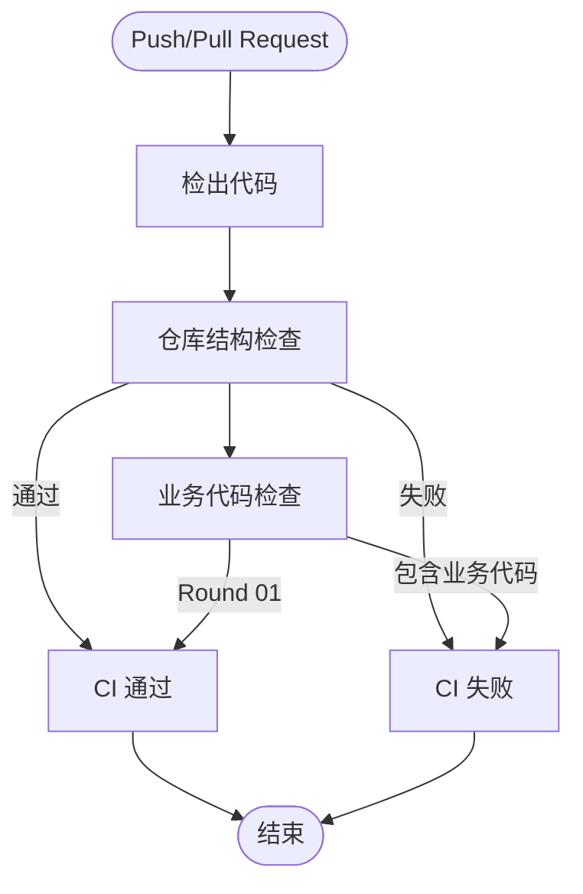

**图表来源**
- [.github/workflows/ci.yml:14-58](file://.github/workflows/ci.yml#L14-L58)

### 环境配置

#### Docker Compose 部署结构

| 服务 | 端口 | 用途 |
|------|------|------|
| **frontend** | 3000 | 前端应用 |
| **backend-java** | 8080 | Java 后端 API |
| **ai-service** | 8000 | AI 分析服务 |
| **mysql** | 3306 | 数据库存储 |

#### 环境变量配置

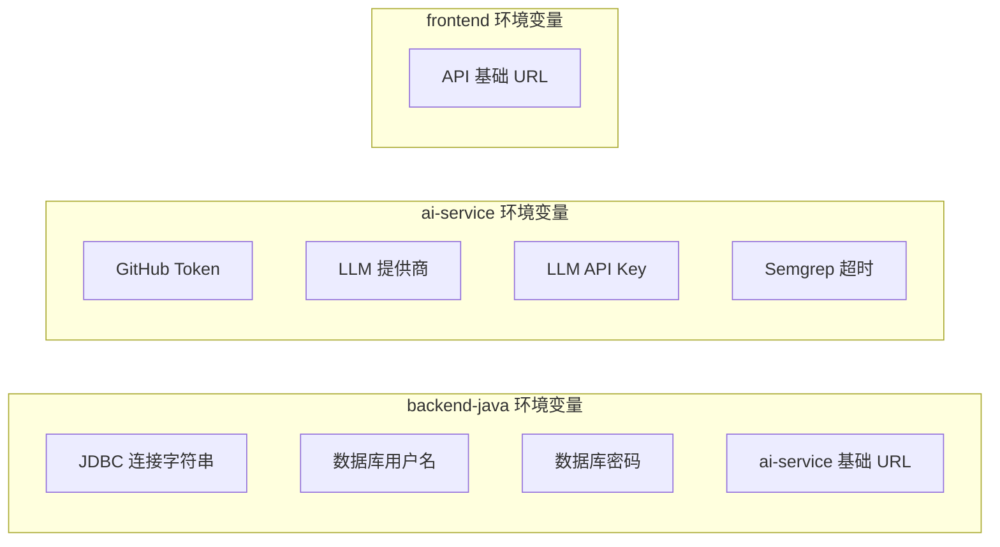

**图表来源**
- [docs/ARCHITECTURE.md:318-343](file://docs/ARCHITECTURE.md#L318-L343)

**章节来源**
- [.github/workflows/ci.yml:14-58](file://.github/workflows/ci.yml#L14-L58)
- [docs/ARCHITECTURE.md:346-354](file://docs/ARCHITECTURE.md#L346-L354)

## 性能考虑

### 架构简化原则

为确保 MVP 阶段的可维护性和可演示性，项目采用以下架构简化策略：

1. **避免复杂中间件**：不引入 Redis、消息队列、Kubernetes 等复杂组件
2. **简化部署**：使用 Docker Compose 替代 Kubernetes
3. **减少异步复杂度**：MVP 阶段采用同步调用而非异步处理
4. **专注核心功能**：不实现自动修复、团队协作等高级功能

### 数据库设计考虑

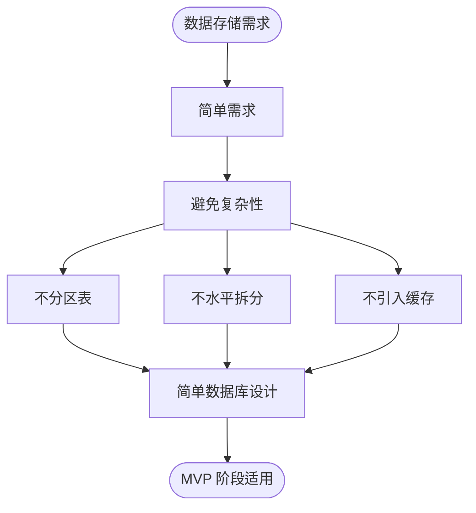

**图表来源**
- [docs/ARCHITECTURE.md:380-390](file://docs/ARCHITECTURE.md#L380-L390)
- [docs/DATABASE.md:288-294](file://docs/DATABASE.md#L288-L294)

## 故障排除指南

### 常见问题诊断

#### CI 流水线问题

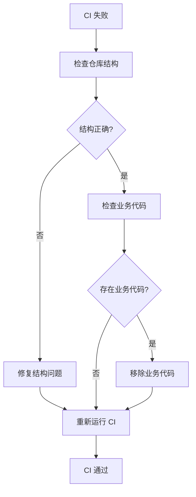

#### 环境配置问题

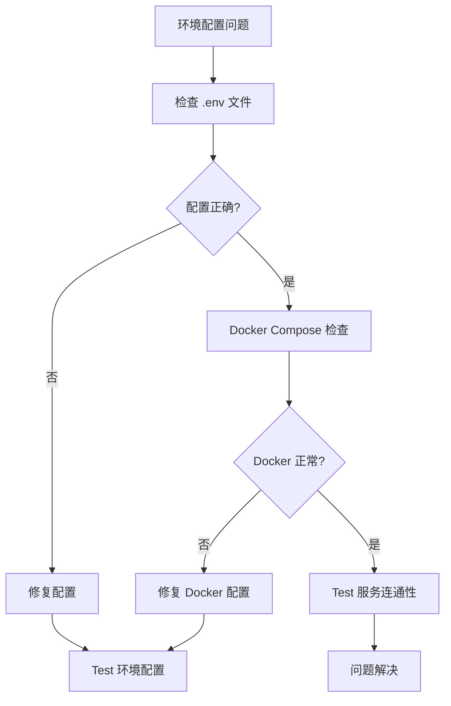

**章节来源**
- [.github/workflows/ci.yml:42-57](file://.github/workflows/ci.yml#L42-L57)
- [.gitignore:1-37](file://.gitignore#L1-L37)

### 安全配置检查

为确保代码安全，项目实施严格的配置管理：

1. **凭证保护**：所有敏感信息必须通过环境变量传递
2. **文件忽略**：`.env` 文件被 `.gitignore` 排除
3. **日志安全**：避免在日志中输出完整令牌
4. **代码审查**：所有 Agent 遵守安全规则

**章节来源**
- [docs/AGENT_RULES.md:152-160](file://docs/AGENT_RULES.md#L152-L160)

## 结论

CodeReviewX 项目通过文档驱动的开发模式和多 Agent 协作机制，为复杂的代码审查系统提供了清晰的开发路径。当前 Round 01 阶段的成功完成，为后续的功能实现奠定了坚实的基础。

### 项目优势

1. **清晰的职责边界**：各模块职责明确，避免了常见的架构混乱
2. **严格的开发流程**：从文档到实现的完整流程确保了质量
3. **可扩展的架构**：简单的架构设计为未来功能扩展预留了空间
4. **安全的开发实践**：完善的配置管理和安全规则

### 下一步建议

1. **按计划推进**：按照 Round 02-Round 06 的计划逐步实现功能
2. **保持文档同步**：每次代码变更都要更新相关文档
3. **严格遵守规则**：确保所有 Agent 都遵循协作规则
4. **持续改进**：根据实际开发经验不断优化流程

## 附录

### 开发环境配置

#### 必需工具

| 工具 | 版本要求 | 用途 |
|------|----------|------|
| **Java** | 17+ | Spring Boot 开发 |
| **Python** | 3.8+ | AI 服务开发 |
| **Node.js** | 16+ | 前端开发 |
| **Docker** | 20+ | 容器化部署 |
| **MySQL** | 8+ | 数据库 |

#### 开发环境设置步骤

1. **克隆仓库**
   ```bash
   git clone https://github.com/your-username/CodeReviewX.git
   cd CodeReviewX
   ```

2. **配置环境变量**
   ```bash
   cp .env.example .env
   # 编辑 .env 文件，添加必要的配置
   ```

3. **启动服务**
   ```bash
   docker-compose up --build
   ```

4. **验证安装**
   ```bash
   curl http://localhost:8080/api/health
   ```

### Git 工作流程

#### 分支策略

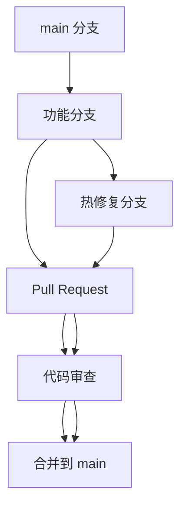

#### 提交规范

1. **类型前缀**：feat、fix、docs、style、refactor、test、chore
2. **描述简洁**：使用祈使句，不超过 50 字符
3. **详细说明**：在正文详细描述变更内容和原因
4. **关联问题**：在提交信息末尾关联相关 Issue

### 代码规范

#### Java 代码规范

1. **命名规范**：类名使用帕斯卡命名法，方法名使用驼峰命名法
2. **缩进**：使用 4 个空格缩进
3. **注释**：重要的类和方法需要 Javadoc 注释
4. **异常处理**：使用自定义异常类处理业务异常

#### Python 代码规范

1. **PEP8 遵循**：遵循 Python 官方编码规范
2. **类型注解**：函数参数和返回值使用类型注解
3. **模块组织**：按功能模块组织代码，避免过长的文件
4. **错误处理**：使用 try-except 处理可能的异常

#### 前端代码规范

1. **组件设计**：单一职责原则，组件尽量小而精
2. **状态管理**：合理使用状态管理，避免过度复杂
3. **样式规范**：使用 CSS Modules 或 styled-components
4. **测试覆盖**：为关键功能编写单元测试

### 调试技巧

#### 日志调试

1. **结构化日志**：使用 JSON 格式记录关键信息
2. **级别控制**：DEBUG、INFO、WARN、ERROR 级别区分
3. **上下文信息**：在日志中包含请求 ID、用户 ID 等上下文
4. **性能监控**：记录关键操作的执行时间

#### 性能优化

1. **数据库查询**：使用合适的索引，避免 N+1 查询
2. **缓存策略**：合理使用缓存减少重复计算
3. **异步处理**：耗时操作使用异步处理
4. **资源管理**：及时释放数据库连接、文件句柄等资源

### 贡献指南

#### Agent 职责

| Agent | 主要职责 | 交付物 |
|-------|----------|--------|
| **Cursor** | 单文件/单模块代码生成 | 实现代码、单元测试 |
| **Codex** | 仓库级验证和修复 | 验证报告、修复代码 |
| **Qoder** | 独立审查 | 审查报告、改进建议 |
| **ChatGPT** | 架构决策 | 最终决策、指导 |

#### 代码提交流程

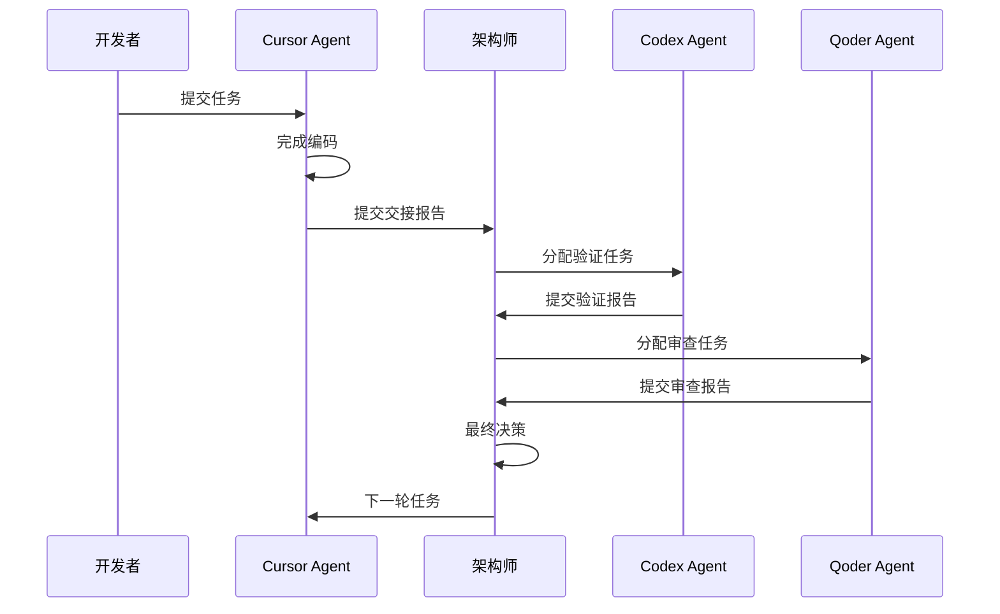

#### 文档更新流程

1. **变更申请**：任何需求变更都需要通过 ChatGPT 架构师评估
2. **文档更新**：变更批准后必须先更新相关文档
3. **代码实现**：文档更新完成后才能进行代码实现
4. **验证确认**：代码实现后需要验证与文档的一致性

### 学习资源

#### 技术文档

- [Spring Boot 官方文档](https://spring.io/projects/spring-boot)
- [FastAPI 官方文档](https://fastapi.tiangolo.com/)
- [Vue 3 官方文档](https://vuejs.org/)
- [MySQL 官方文档](https://dev.mysql.com/doc/)

#### 开发工具

- [IntelliJ IDEA](https://www.jetbrains.com/idea/)
- [PyCharm](https://www.jetbrains.com/pycharm/)
- [Visual Studio Code](https://code.visualstudio.com/)
- [Docker Desktop](https://www.docker.com/products/docker-desktop)

#### 社区资源

- [GitHub 官方文档](https://docs.github.com/)
- [Stack Overflow](https://stackoverflow.com/)
- [掘金](https://juejin.cn/)
- [CSDN](https://www.csdn.net/)

**章节来源**
- [docs/AGENT_RULES.md:1-160](file://docs/AGENT_RULES.md#L1-L160)
- [docs/HANDOFF_TEMPLATE.md:1-128](file://docs/HANDOFF_TEMPLATE.md#L1-L128)